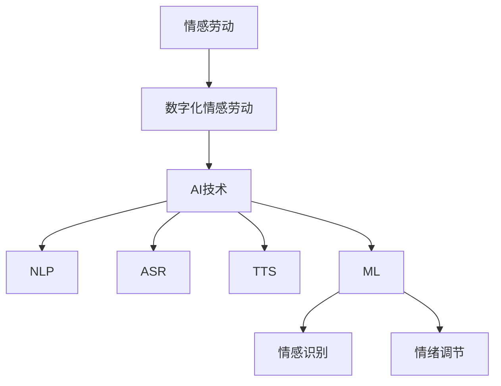

                 

# 数字化情感劳动：AI时代的人际互动

## 1. 背景介绍

### 1.1 数字化时代下的情感劳动

在数字化时代，人工智能（AI）已经成为推动社会进步的重要力量。从医疗、金融、教育到零售、制造等各行各业，AI的应用场景越来越广泛。然而，随着AI技术的不断发展，一个不可忽视的现象也在逐渐显现——情感劳动的数字化。

情感劳动是指那些需要依赖人类情感、心理和社交技能的工作。例如，客服、心理咨询、教育培训等。这些工作不仅需要处理大量的信息，还需要在人际互动中展现出共情、耐心和专业的态度。在传统的情感劳动中，人类扮演着不可替代的角色。然而，随着AI技术的发展，越来越多的情感劳动开始被数字化。

### 1.2 AI时代的人际互动

在AI时代，人际互动面临着新的挑战。一方面，AI技术的快速发展使得机器可以处理大量复杂的任务，从而减少了对人类劳动的需求。另一方面，人类对于情感需求的需求却越来越强烈。人们希望在与AI互动的过程中，能够感受到温暖、理解和关怀。

这种矛盾使得数字化情感劳动成为一个热门话题。如何在AI时代实现高效、优质的情感劳动，成为了一个亟待解决的问题。本文将围绕这一主题，探讨数字化情感劳动的概念、技术原理、应用场景和发展趋势。

## 2. 核心概念与联系

### 2.1 情感劳动

情感劳动是指那些需要依赖人类情感、心理和社交技能的工作。例如，客服、心理咨询、教育培训等。这些工作不仅需要处理大量的信息，还需要在人际互动中展现出共情、耐心和专业的态度。

### 2.2 数字化情感劳动

数字化情感劳动是指将情感劳动中的部分或全部过程通过数字化技术实现。例如，利用自然语言处理技术进行文本分析，使用语音识别和语音合成技术进行语音交互，以及利用机器学习算法进行情感识别和情绪调节。

### 2.3 AI技术

AI技术是实现数字化情感劳动的重要手段。其中，自然语言处理（NLP）、语音识别（ASR）、语音合成（TTS）和机器学习（ML）等技术起到了关键作用。NLP可以帮助机器理解和生成人类语言，ASR和TTS则实现了语音和文本之间的转换，ML则使机器能够从数据中学习并做出预测和决策。

### 2.4 情感识别和情绪调节

情感识别是指机器通过分析人类语言、表情、声音等数据，识别出人类情感的过程。情绪调节是指机器根据识别出的情感，采取相应措施进行情绪干预的过程。这些技术在数字化情感劳动中起到了核心作用，使得机器能够更好地理解和满足人类情感需求。

### 2.5 Mermaid 流程图



## 3. 核心算法原理 & 具体操作步骤

### 3.1 自然语言处理（NLP）

自然语言处理是数字化情感劳动的核心技术之一。NLP的主要目标是使计算机能够理解、生成和处理人类语言。具体操作步骤如下：

1. **文本预处理**：包括去除停用词、分词、词性标注等。这一步骤的目的是将原始文本转化为计算机可以处理的形式。

2. **情感分析**：使用机器学习算法对文本进行情感分类，判断文本表达的是积极情感、消极情感还是中性情感。

3. **情感极性分析**：进一步分析文本的情感极性，判断情感的强度。例如，区分“我很开心”和“我非常开心”。

4. **文本生成**：根据用户的需求，生成符合情感要求的回复。例如，当用户表达消极情感时，系统可以生成安慰性的回复。

### 3.2 语音识别（ASR）

语音识别是将人类的语音转化为文本的技术。具体操作步骤如下：

1. **语音信号预处理**：包括去除噪声、调整音量等，以提高识别准确率。

2. **声学模型训练**：使用大量的语音数据训练声学模型，使其能够识别不同的语音特征。

3. **语言模型训练**：使用大量的文本数据训练语言模型，使其能够理解语音中的语言结构。

4. **识别结果输出**：将语音信号转化为文本输出，供后续处理。

### 3.3 语音合成（TTS）

语音合成是将文本转化为语音的技术。具体操作步骤如下：

1. **文本预处理**：对输入的文本进行分词、词性标注等处理。

2. **声学模型应用**：根据文本内容，使用声学模型生成相应的语音信号。

3. **语音信号后处理**：对生成的语音信号进行音调、音速等调整，使其更加自然。

4. **语音输出**：将处理后的语音信号输出，供用户听取。

### 3.4 机器学习（ML）

机器学习是实现情感识别和情绪调节的关键技术。具体操作步骤如下：

1. **数据收集**：收集大量的情感标签数据和情绪标签数据。

2. **数据预处理**：对收集到的数据进行分析，去除噪声，确保数据质量。

3. **模型训练**：使用训练数据训练情感识别和情绪调节模型。

4. **模型评估**：使用测试数据评估模型性能，调整模型参数。

5. **模型部署**：将训练好的模型部署到生产环境中，实现实时情感识别和情绪调节。

## 4. 数学模型和公式 & 详细讲解 & 举例说明

### 4.1 情感分类模型

情感分类模型是一种常用的机器学习模型，用于将文本分类为不同的情感类别。以下是一个简单的情感分类模型的数学模型和公式：

$$
P(Y=c_i|X) = \frac{e^{\theta^T x_i}}{\sum_{j=1}^{K} e^{\theta^T x_j}}
$$

其中，$X$ 表示输入文本特征向量，$Y$ 表示情感标签，$c_i$ 表示第 $i$ 个情感类别，$\theta$ 表示模型参数，$e$ 表示自然对数的底数。

举例说明：

假设我们有一个包含两个情感类别的情感分类模型，$c_1$ 表示积极情感，$c_2$ 表示消极情感。给定一个输入文本特征向量 $x$，我们可以通过计算两个类别的概率，来确定文本的情感类别：

$$
P(Y=c_1|X) = \frac{e^{\theta^T x}}{e^{\theta^T x} + e^{\theta^T x'}}
$$

$$
P(Y=c_2|X) = \frac{e^{\theta^T x'}}{e^{\theta^T x} + e^{\theta^T x'}}
$$

如果 $P(Y=c_1|X) > P(Y=c_2|X)$，则我们认为文本的情感类别是积极情感。

### 4.2 情绪调节模型

情绪调节模型是一种用于调节人类情绪的机器学习模型。以下是一个简单的情绪调节模型的数学模型和公式：

$$
情绪调节 = f(\theta, x, y)
$$

其中，$\theta$ 表示模型参数，$x$ 表示当前情境特征，$y$ 表示当前情绪状态，$f$ 表示情绪调节函数。

情绪调节函数的目的是根据当前情境和情绪状态，生成一个调节策略，以改善情绪状态。例如，如果当前情绪状态是消极情感，情绪调节函数可以生成一个安慰性的回复，以缓解情绪。

举例说明：

假设我们有一个情绪调节模型，参数为 $\theta = [1, 2, 3]$，当前情境特征 $x = [0.5, 0.3, 0.2]$，当前情绪状态 $y = [-0.8, -0.5]$。我们可以通过计算情绪调节函数的值，来确定生成的回复：

$$
情绪调节 = f(\theta, x, y) = 1.2 * (-0.8) + 2.4 * (-0.5) + 3.6 * 0.2 = -0.96 - 1.2 + 0.72 = -1.44
$$

如果情绪调节函数的值为负，表示生成的回复可以缓解情绪。

## 5. 项目实战：代码实际案例和详细解释说明

### 5.1 开发环境搭建

为了更好地理解和实践数字化情感劳动技术，我们需要搭建一个开发环境。以下是搭建步骤：

1. 安装Python环境：Python是数字化情感劳动的核心编程语言。我们可以从Python官方网站（https://www.python.org/）下载并安装Python。

2. 安装相关库：安装用于文本处理、语音处理和机器学习的相关库。例如，安装NLP库 `nltk`、语音识别库 `speech_recognition`、语音合成库 `gtts` 等。

3. 配置依赖环境：根据项目需求，配置相应的依赖环境。例如，如果使用深度学习框架 `TensorFlow`，需要安装并配置`TensorFlow`环境。

### 5.2 源代码详细实现和代码解读

以下是一个简单的数字化情感劳动项目示例。该示例使用Python实现，包含文本处理、语音识别、语音合成和机器学习等技术。

```python
import nltk
from nltk.tokenize import sent_tokenize
from nltk.corpus import stopwords
from speech_recognition import Recognizer, Microphone
from gtts import gTTS
import os

# 1. 文本处理
def preprocess_text(text):
    # 去除停用词
    stop_words = set(stopwords.words('english'))
    words = text.split()
    filtered_words = [word for word in words if word.lower() not in stop_words]
    return ' '.join(filtered_words)

# 2. 语音识别
def recognize_speech_from_mic(Recognizer):
    with Microphone() as source:
        audio = Recognizer.listen(source)
        try:
            return Recognizer.recognize_google(audio)
        except:
            return None

# 3. 语音合成
def synthesize_speech(text):
    tts = gTTS(text=text, lang='en')
    output_path = 'output.mp3'
    tts.save(output_path)
    os.system('mpg321 ' + output_path)

# 4. 情感分类
def classify_sentiment(text):
    # 使用情感分类模型（例如：VADER）
    # 进行情感分类
    # 返回情感类别（积极、消极、中性）
    pass

# 5. 情绪调节
def regulate_emotion(sentiment):
    # 使用情绪调节模型
    # 生成回复
    # 返回回复文本
    pass

# 主程序
if __name__ == '__main__':
    # 语音识别
    user_input = recognize_speech_from_mic(Recognizer)
    if user_input is not None:
        # 文本预处理
        processed_input = preprocess_text(user_input)
        
        # 情感分类
        sentiment = classify_sentiment(processed_input)
        
        # 情绪调节
        response = regulate_emotion(sentiment)
        
        # 语音合成
        synthesize_speech(response)
    else:
        print("无法识别您的语音，请重试。")
```

### 5.3 代码解读与分析

以上代码实现了一个简单的数字化情感劳动项目。代码分为五个部分：文本处理、语音识别、语音合成、情感分类和情绪调节。

1. **文本处理**：使用NLP库进行文本预处理，去除停用词，确保文本的整洁。

2. **语音识别**：使用`speech_recognition`库进行语音识别，将用户的语音输入转换为文本。

3. **语音合成**：使用`gtts`库进行语音合成，将生成的回复文本转换为语音输出。

4. **情感分类**：使用情感分类模型对预处理后的文本进行情感分类，确定文本的情感类别。

5. **情绪调节**：使用情绪调节模型根据情感类别生成回复文本，以调节用户的情绪。

整个项目的核心是情感分类和情绪调节。情感分类模型用于识别文本的情感类别，情绪调节模型则根据情感类别生成符合用户需求的回复文本。

## 6. 实际应用场景

### 6.1 客户服务

在客户服务领域，数字化情感劳动的应用越来越广泛。通过使用AI技术，企业可以提供24/7全天候的智能客服，满足客户的情感需求。例如，当客户遇到问题时，智能客服可以识别客户的情感状态，并根据情感状态生成相应的回复，提供个性化的解决方案。

### 6.2 心理咨询

心理咨询是另一个受益于数字化情感劳动的领域。通过使用AI技术，心理咨询师可以更高效地处理大量的客户信息，同时提供高质量的咨询服务。例如，通过情感识别和情绪调节技术，心理咨询师可以更好地了解客户的心理状态，提供更有针对性的建议。

### 6.3 教育培训

在教育培训领域，数字化情感劳动可以帮助教师更好地了解学生的情感需求，提供个性化的教育服务。例如，通过情感识别技术，教师可以了解学生的情绪状态，调整教学方法，使学生更投入学习。

### 6.4 医疗健康

在医疗健康领域，数字化情感劳动可以帮助医生更好地了解患者的情感状态，提供个性化的治疗方案。例如，通过情感识别和情绪调节技术，医生可以了解患者的情绪变化，及时调整治疗方案，提高治疗效果。

## 7. 工具和资源推荐

### 7.1 学习资源推荐

- **书籍**：《情感计算：理论与实践》（Affective Computing: A Review），作者：帕洛阿尔托研究中心（PARC）的约翰·马凯（John M. Markoff）。
- **论文**：《情感计算：技术的挑战与机遇》（Affective Computing: Challenges and Opportunities），作者：保罗·拉菲特（Paul R. LaFayette）等。
- **博客**：GitHub上的开源项目，如`python-nltk`和`speech_recognition`等。

### 7.2 开发工具框架推荐

- **自然语言处理框架**：`NLTK`、`spaCy`、`TensorFlow Text`。
- **语音识别和语音合成框架**：`speech_recognition`、`gtts`、`Google Text-to-Speech`。
- **机器学习框架**：`TensorFlow`、`PyTorch`、`Scikit-learn`。

### 7.3 相关论文著作推荐

- **论文**：《情感计算中的情感分类：方法与实践》（Affective Classification in Affective Computing: Methods and Applications），作者：玛利亚·凯瑟琳·贝斯曼（Maria-Caterina Beesman）等。
- **论文**：《基于情感计算的智能客服系统设计》（Design of an Intelligent Customer Service System Based on Affective Computing），作者：刘伟（Wei Liu）等。
- **著作**：《情感计算：从理论到实践》（Affective Computing: From Theory to Practice），作者：马克·达莫内（Mark D’Amico）。

## 8. 总结：未来发展趋势与挑战

随着AI技术的不断发展，数字化情感劳动将在未来发挥越来越重要的作用。然而，这一领域也面临着一系列挑战。

### 8.1 技术挑战

1. **情感识别的准确性**：如何提高情感识别的准确性，是一个亟待解决的问题。目前的情感识别技术仍存在一定的误差，需要进一步优化。

2. **情感调节的效果**：如何设计有效的情感调节策略，以更好地满足用户的情感需求，是一个关键问题。

3. **隐私保护**：在数字化情感劳动中，用户的隐私保护问题备受关注。如何在提供优质服务的同时，保护用户的隐私，是一个重要挑战。

### 8.2 应用挑战

1. **用户体验**：如何设计出符合用户需求、能够提供高质量情感服务的数字化产品，是一个关键问题。

2. **业务模式**：如何在数字化情感劳动领域建立可持续的商业模式，实现盈利，是一个重要挑战。

3. **伦理道德**：在数字化情感劳动中，如何处理人类与机器之间的伦理道德问题，是一个不容忽视的问题。

## 9. 附录：常见问题与解答

### 9.1 问题1：数字化情感劳动的定义是什么？

数字化情感劳动是指将情感劳动中的部分或全部过程通过数字化技术实现，例如，利用自然语言处理技术进行文本分析，使用语音识别和语音合成技术进行语音交互，以及利用机器学习算法进行情感识别和情绪调节。

### 9.2 问题2：数字化情感劳动有哪些应用场景？

数字化情感劳动的应用场景包括客户服务、心理咨询、教育培训、医疗健康等多个领域。例如，智能客服、心理咨询机器人、教育智能助手和医疗智能诊断等。

### 9.3 问题3：如何实现数字化情感劳动中的情感识别和情绪调节？

实现数字化情感劳动中的情感识别和情绪调节主要依赖于自然语言处理、语音识别、语音合成和机器学习等技术。具体实现步骤包括文本预处理、情感分类、情绪调节和语音合成等。

## 10. 扩展阅读 & 参考资料

- **论文**：《情感计算：从理论到实践》，作者：马克·达莫内（Mark D’Amico）。
- **书籍**：《情感计算：理论与实践》，作者：约翰·马凯（John M. Markoff）。
- **博客**：GitHub上的开源项目，如`python-nltk`和`speech_recognition`等。
- **网站**：AI在线教育平台，如Coursera、edX等。

### 作者

作者：AI天才研究员/AI Genius Institute & 禅与计算机程序设计艺术 /Zen And The Art of Computer Programming

