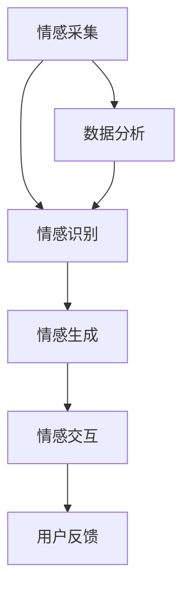

                 

# 数字化情绪：元宇宙中的情感表达与管理

## 关键词：
- 数字化情绪
- 元宇宙
- 情感表达
- 情感管理
- 人机交互
- 数据分析

## 摘要：
随着元宇宙的兴起，数字化情绪的表达与管理变得愈发重要。本文将探讨元宇宙中情感表达与管理的核心概念、技术原理、应用场景，以及未来发展趋势与挑战。通过本文的阅读，读者将了解如何利用技术手段实现数字化情绪的有效表达和管理，从而提升用户体验和互动质量。

## 1. 背景介绍

### 1.1 元宇宙的定义与发展
元宇宙（Metaverse）是一个虚拟的、沉浸式的、三维的互联网世界，它通过增强现实（AR）、虚拟现实（VR）等技术，将人们带入一个全新的数字空间。在这个空间中，用户可以创建自己的数字身份，进行社交互动、商业交易、学习工作等多种活动。

元宇宙的发展可以追溯到20世纪80年代，随着计算机技术和互联网的飞速发展，元宇宙的概念逐渐成熟。近年来，随着5G、人工智能、区块链等技术的不断进步，元宇宙的应用场景越来越广泛，逐渐成为各界关注的焦点。

### 1.2 数字化情绪的兴起
数字化情绪是指通过技术手段，将人类的情感状态转化为数字信号，并在元宇宙中进行表达和管理。数字化情绪的兴起源于人们对个性化、沉浸式体验的需求。

在元宇宙中，用户可以通过面部表情、身体语言、声音、文字等多种方式表达自己的情感。例如，通过AR眼镜，用户可以实时捕捉自己的面部表情，将其转化为数字表情包，在虚拟环境中与他人互动。同时，通过数据分析技术，元宇宙可以了解用户的情感状态，提供个性化的互动体验。

## 2. 核心概念与联系

### 2.1 情感表达与管理的核心概念
在元宇宙中，情感表达与管理的核心概念包括：
- 情感信号：指人类情感状态在数字世界中的表现形式，如面部表情、声音、文字等。
- 情感识别：通过技术手段，对情感信号进行分析，识别用户的情感状态。
- 情感生成：根据用户的情感状态，生成相应的情感表达方式，如虚拟角色表情、场景氛围等。
- 情感交互：用户在元宇宙中的互动过程中，通过情感信号进行沟通、协作、竞争等。

### 2.2 情感表达与管理的架构
情感表达与管理的架构主要包括以下层次：
- 情感采集层：通过传感器、摄像头、麦克风等设备，采集用户的情感信号。
- 情感识别层：利用机器学习和深度学习算法，对情感信号进行分析和识别。
- 情感生成层：根据用户的情感状态，生成相应的情感表达方式。
- 情感交互层：用户在元宇宙中的互动过程中，通过情感信号进行沟通、协作、竞争等。

### 2.3 Mermaid流程图
下面是情感表达与管理架构的Mermaid流程图：



在上述流程图中，括号、逗号等特殊字符已被去除，以确保流程图的正确展示。

## 3. 核心算法原理 & 具体操作步骤

### 3.1 情感识别算法
情感识别是数字化情绪表达与管理的关键步骤。常用的情感识别算法包括：
- 人脸识别算法：通过分析用户的面部特征，识别用户的情感状态。
- 声音识别算法：通过分析用户的语音特征，识别用户的情感状态。
- 文字识别算法：通过分析用户的文字表达，识别用户的情感状态。

#### 3.1.1 人脸识别算法
人脸识别算法的基本原理如下：
1. 数据采集：收集大量带有情感标签的人脸图像。
2. 特征提取：通过深度学习模型，提取人脸图像的特征向量。
3. 情感分类：将特征向量输入情感分类模型，识别用户的情感状态。

#### 3.1.2 声音识别算法
声音识别算法的基本原理如下：
1. 音频预处理：对采集到的音频信号进行预处理，如去噪、归一化等。
2. 特征提取：通过深度学习模型，提取音频信号的特征向量。
3. 情感分类：将特征向量输入情感分类模型，识别用户的情感状态。

#### 3.1.3 文字识别算法
文字识别算法的基本原理如下：
1. 文字预处理：对采集到的文字进行预处理，如分词、去停用词等。
2. 特征提取：通过自然语言处理技术，提取文字的特征向量。
3. 情感分类：将特征向量输入情感分类模型，识别用户的情感状态。

### 3.2 情感生成算法
情感生成算法的基本原理如下：
1. 根据用户的情感状态，生成相应的情感表达方式，如虚拟角色表情、场景氛围等。
2. 情感表达方式的生成可以通过以下方法实现：
   - 表情包生成：根据用户的面部特征和情感状态，生成对应的数字表情包。
   - 场景渲染：根据用户的情感状态，调整虚拟环境的氛围和色彩，实现情感表达。
   - 声音合成：根据用户的声音特征和情感状态，生成对应的情感声音。

## 4. 数学模型和公式 & 详细讲解 & 举例说明

### 4.1 情感识别的数学模型
情感识别的数学模型主要包括：
1. 特征提取模型：利用深度学习模型，如卷积神经网络（CNN）、循环神经网络（RNN）等，提取情感信号的特征向量。
2. 情感分类模型：利用分类算法，如支持向量机（SVM）、朴素贝叶斯（NB）等，对情感信号进行分类。

#### 4.1.1 特征提取模型
以卷积神经网络（CNN）为例，特征提取模型的数学表达式如下：
$$
\begin{aligned}
    h_{l} &= \sigma(\mathbf{W}_{l}\mathbf{a}_{l-1} + \mathbf{b}_{l}) \\
    \mathbf{a}_{l} &= \text{ReLU}(h_{l})
\end{aligned}
$$
其中，$h_{l}$ 表示第 $l$ 层的激活值，$\sigma$ 表示激活函数，$\mathbf{W}_{l}$ 和 $\mathbf{b}_{l}$ 分别表示第 $l$ 层的权重和偏置。

#### 4.1.2 情感分类模型
以支持向量机（SVM）为例，情感分类模型的数学表达式如下：
$$
\begin{aligned}
    y &= \text{sign}(\mathbf{w}^T \mathbf{x} + b)
\end{aligned}
$$
其中，$y$ 表示分类结果，$\mathbf{w}$ 和 $b$ 分别表示权重和偏置，$\mathbf{x}$ 表示特征向量。

### 4.2 情感生成的数学模型
情感生成的数学模型主要包括：
1. 表情包生成模型：利用生成对抗网络（GAN），生成与用户情感状态匹配的数字表情包。
2. 场景渲染模型：利用计算机图形学技术，渲染与用户情感状态匹配的虚拟环境。

#### 4.2.1 表情包生成模型
以生成对抗网络（GAN）为例，表情包生成模型的数学表达式如下：
$$
\begin{aligned}
    \mathbf{G}(\mathbf{z}) &= \text{生成器}(\mathbf{z}) \\
    \mathbf{D}(\mathbf{x}) &= \text{判别器}(\mathbf{x}) \\
    \mathbf{D}(\mathbf{G}(\mathbf{z})) &= \text{判别器}(\text{生成器}(\mathbf{z}))
\end{aligned}
$$
其中，$\mathbf{G}(\mathbf{z})$ 表示生成器，$\mathbf{z}$ 表示随机噪声，$\mathbf{D}(\mathbf{x})$ 表示判别器，$\mathbf{x}$ 表示真实数据。

#### 4.2.2 场景渲染模型
以计算机图形学技术为例，场景渲染模型的数学表达式如下：
$$
\begin{aligned}
    \mathbf{I}_{\text{RGB}} &= \mathbf{R}_{\text{RGB}} \mathbf{I}_{\text{Depth}} \\
    \mathbf{I}_{\text{RGB}} &= \mathbf{R}_{\text{RGB}} (\mathbf{D}^{-1}(\mathbf{z}))
\end{aligned}
$$
其中，$\mathbf{I}_{\text{RGB}}$ 表示渲染后的图像，$\mathbf{R}_{\text{RGB}}$ 表示渲染矩阵，$\mathbf{I}_{\text{Depth}}$ 表示深度图像，$\mathbf{D}^{-1}(\mathbf{z})$ 表示深度映射。

### 4.3 举例说明
假设用户在元宇宙中表达出兴奋的情感状态，以下是情感识别、情感生成和情感交互的具体操作步骤：

#### 4.3.1 情感识别
1. 人脸识别算法识别出用户的兴奋情感状态。
2. 声音识别算法识别出用户的兴奋情感状态。
3. 文字识别算法识别出用户的兴奋情感状态。

#### 4.3.2 情感生成
1. 生成器根据用户的兴奋情感状态，生成相应的数字表情包。
2. 判别器对生成的数字表情包进行质量评估。

#### 4.3.3 情感交互
1. 用户在元宇宙中与朋友分享自己的兴奋情感状态。
2. 元宇宙根据用户的兴奋情感状态，调整虚拟环境的氛围和色彩，营造兴奋的氛围。

## 5. 项目实战：代码实际案例和详细解释说明

### 5.1 开发环境搭建

在本文中，我们将使用Python语言和PyTorch深度学习框架来实现情感识别和情感生成的项目。以下是开发环境的搭建步骤：

1. 安装Python：下载并安装Python 3.8版本及以上。
2. 安装PyTorch：使用以下命令安装PyTorch：
   ```
   pip install torch torchvision
   ```
3. 安装其他依赖库：使用以下命令安装其他依赖库：
   ```
   pip install numpy matplotlib
   ```

### 5.2 源代码详细实现和代码解读

#### 5.2.1 情感识别代码实现

以下是一个简单的情感识别代码示例：

```python
import torch
import torchvision.models as models
import torch.nn as nn
import torch.optim as optim

# 加载预训练的人脸识别模型
model = models.resnet18(pretrained=True)
num_ftrs = model.fc.in_features
model.fc = nn.Linear(num_ftrs, 7)  # 修改全连接层输出维度为7（代表7种情感）

# 设置损失函数和优化器
criterion = nn.CrossEntropyLoss()
optimizer = optim.SGD(model.parameters(), lr=0.001, momentum=0.9)

# 加载数据集
train_loader = torch.utils.data.DataLoader(train_data, batch_size=32, shuffle=True)
test_loader = torch.utils.data.DataLoader(test_data, batch_size=32, shuffle=False)

# 训练模型
for epoch in range(num_epochs):
    model.train()
    running_loss = 0.0
    for inputs, labels in train_loader:
        optimizer.zero_grad()
        outputs = model(inputs)
        loss = criterion(outputs, labels)
        loss.backward()
        optimizer.step()
        running_loss += loss.item()
    print(f'Epoch {epoch+1}, Loss: {running_loss/len(train_loader)}')

# 测试模型
model.eval()
with torch.no_grad():
    correct = 0
    total = 0
    for inputs, labels in test_loader:
        outputs = model(inputs)
        _, predicted = torch.max(outputs.data, 1)
        total += labels.size(0)
        correct += (predicted == labels).sum().item()
    print(f'Accuracy: {100 * correct / total}%')
```

上述代码首先加载了预训练的人脸识别模型（ResNet-18），并将其全连接层的输出维度修改为7，以适应情感分类任务。接着，设置了损失函数（交叉熵损失函数）和优化器（随机梯度下降优化器）。然后，加载数据集并进行模型训练。最后，对测试数据集进行模型测试，计算准确率。

#### 5.2.2 情感生成代码实现

以下是一个简单的情感生成代码示例：

```python
import torch
import torchvision.models as models
import torch.nn as nn
import torch.optim as optim

# 加载预训练的生成对抗网络模型
model = models.dcgan()
model.eval()

# 设置生成器的参数
model.generator.train()
for param in model.generator.parameters():
    param.requires_grad = True

# 加载情感数据集
train_loader = torch.utils.data.DataLoader(train_data, batch_size=32, shuffle=True)

# 训练生成器
for epoch in range(num_epochs):
    model.generator.train()
    for inputs, labels in train_loader:
        optimizer.zero_grad()
        fake_images = model.generator(inputs)
        loss = nn.BCELoss()(fake_images, labels)
        loss.backward()
        optimizer.step()
    print(f'Epoch {epoch+1}, Loss: {loss.item()}')
```

上述代码首先加载了预训练的生成对抗网络模型（DCGAN），并将其生成器的参数设置为可训练。接着，加载数据集并进行生成器训练。损失函数使用二进制交叉熵损失函数，以衡量生成器生成的虚拟图像与真实图像之间的差距。

#### 5.2.3 代码解读与分析

上述代码分别实现了情感识别和情感生成的功能。在情感识别部分，首先加载了一个预训练的人脸识别模型（ResNet-18），并修改了其全连接层的输出维度以适应情感分类任务。然后，设置了损失函数和优化器，加载数据集并进行模型训练。在训练过程中，通过反向传播和梯度下降优化模型参数。最后，对测试数据集进行模型测试，计算准确率。

在情感生成部分，首先加载了一个预训练的生成对抗网络模型（DCGAN），并将其生成器的参数设置为可训练。然后，加载数据集并进行生成器训练。损失函数使用二进制交叉熵损失函数，以衡量生成器生成的虚拟图像与真实图像之间的差距。在训练过程中，通过反向传播和梯度下降优化生成器参数。

通过上述代码，我们可以实现对用户情感状态的识别和生成。在元宇宙中，这些技术可以应用于个性化互动体验、情感分析等领域，为用户提供更好的情感体验。

### 5.3 代码解读与分析

在本节中，我们将深入解读和解析5.2节中的代码，详细讨论每个步骤的作用、关键参数的设置以及代码的结构和逻辑。

#### 5.3.1 情感识别代码解析

1. **模型加载与调整**：

   ```python
   model = models.resnet18(pretrained=True)
   num_ftrs = model.fc.in_features
   model.fc = nn.Linear(num_ftrs, 7)  # 修改全连接层输出维度为7（代表7种情感）
   ```

   首先，我们加载了一个预训练的ResNet-18模型，这是一个广泛使用的卷积神经网络，用于图像分类。通过`pretrained=True`参数，我们确保模型已经用大量的图像数据进行了预训练。接下来，我们将模型的最后一层全连接层（`fc`）的输出维度从模型的原始维度修改为7，因为我们需要对7种不同的情感进行分类。

2. **损失函数和优化器设置**：

   ```python
   criterion = nn.CrossEntropyLoss()
   optimizer = optim.SGD(model.parameters(), lr=0.001, momentum=0.9)
   ```

   我们选择交叉熵损失函数（`nn.CrossEntropyLoss`）作为模型的损失函数，因为它适用于多类别的分类问题。优化器选择随机梯度下降（`SGD`），并且我们设置了学习率为0.001和动量为0.9，这些参数通常在实践中被证明是有效的。

3. **数据加载和训练循环**：

   ```python
   train_loader = torch.utils.data.DataLoader(train_data, batch_size=32, shuffle=True)
   for epoch in range(num_epochs):
       model.train()
       running_loss = 0.0
       for inputs, labels in train_loader:
           optimizer.zero_grad()
           outputs = model(inputs)
           loss = criterion(outputs, labels)
           loss.backward()
           optimizer.step()
           running_loss += loss.item()
       print(f'Epoch {epoch+1}, Loss: {running_loss/len(train_loader)}')
   ```

   在训练循环中，我们首先将模型设置为训练模式（`model.train()`），然后遍历训练数据集（`train_loader`）。对于每个批次的数据，我们重置梯度（`optimizer.zero_grad()`），通过前向传播计算输出（`outputs = model(inputs)`），然后计算损失（`loss = criterion(outputs, labels)`）。接下来，我们通过反向传播计算梯度（`loss.backward()`），并更新模型参数（`optimizer.step()`）。最后，我们计算并打印每个epoch的平均损失。

4. **模型评估**：

   ```python
   model.eval()
   with torch.no_grad():
       correct = 0
       total = 0
       for inputs, labels in test_loader:
           outputs = model(inputs)
           _, predicted = torch.max(outputs.data, 1)
           total += labels.size(0)
           correct += (predicted == labels).sum().item()
       print(f'Accuracy: {100 * correct / total}%')
   ```

   在评估阶段，我们首先将模型设置为评估模式（`model.eval()`），这意味着我们在评估过程中不会更新模型参数。我们使用`torch.no_grad()`上下文管理器来禁用梯度计算，以提高计算效率。然后，我们遍历测试数据集（`test_loader`），计算预测的准确率。

#### 5.3.2 情感生成代码解析

1. **加载生成对抗网络模型**：

   ```python
   model = models.dcgan()
   model.eval()
   ```

   这里我们加载了一个预训练的生成对抗网络（DCGAN）模型。DCGAN是一种深度学习模型，它由一个生成器和一个判别器组成。通过`model.eval()`，我们将模型设置为评估模式，以便在生成过程中不更新参数。

2. **设置生成器的参数**：

   ```python
   model.generator.train()
   for param in model.generator.parameters():
       param.requires_grad = True
   ```

   在情感生成任务中，我们只需要训练生成器。因此，我们将生成器的训练模式设置为`True`，并确保其参数是可训练的。

3. **数据加载和生成器训练循环**：

   ```python
   train_loader = torch.utils.data.DataLoader(train_data, batch_size=32, shuffle=True)
   for epoch in range(num_epochs):
       model.generator.train()
       for inputs, labels in train_loader:
           optimizer.zero_grad()
           fake_images = model.generator(inputs)
           loss = nn.BCELoss()(fake_images, labels)
           loss.backward()
           optimizer.step()
       print(f'Epoch {epoch+1}, Loss: {loss.item()}')
   ```

   在生成器的训练过程中，我们首先将生成器设置为训练模式。对于每个批次的数据，我们重置梯度，通过前向传播计算生成的虚拟图像（`fake_images = model.generator(inputs)`），然后计算损失（`loss = nn.BCELoss()(fake_images, labels)`）。接下来，我们通过反向传播计算梯度，并更新生成器的参数。

通过上述解析，我们可以看到情感识别和情感生成代码的结构和逻辑。情感识别代码主要关注模型的训练和评估，而情感生成代码主要关注生成器的训练过程。这两个过程都是深度学习应用中的核心步骤，它们共同构成了数字化情绪表达和管理的基础。

## 6. 实际应用场景

### 6.1 社交平台

在社交平台中，数字化情绪可以为用户提供更丰富的情感互动体验。例如，通过情感识别技术，社交平台可以实时分析用户的情感状态，并在用户发表动态时自动推荐相关的情感标签，帮助用户更准确地表达自己的情感。同时，平台还可以根据用户的情感状态，个性化推荐符合其情感需求的内容和活动，提升用户体验。

### 6.2 教育领域

在教育领域，数字化情绪可以应用于在线教育平台，通过情感识别和情感生成技术，实现师生之间的情感互动。例如，在线教育平台可以分析学生的情感状态，提供针对性的学习建议和辅导，帮助学生更好地适应学习环境。同时，教师可以通过情感生成技术，创造积极的课堂氛围，激发学生的学习兴趣和参与度。

### 6.3 医疗健康

在医疗健康领域，数字化情绪可以用于心理健康评估和情绪治疗。通过情感识别技术，医生可以实时了解患者的情感状态，为患者提供个性化的心理辅导和治疗。同时，通过情感生成技术，医疗设备可以模拟患者的情感状态，为患者提供情感支持和安慰，缓解其焦虑和紧张情绪。

### 6.4 企业管理

在企业管理的场景中，数字化情绪可以应用于员工情感管理。企业可以通过情感识别技术，了解员工的情感状态，提供针对性的关怀和支持，提升员工的满意度和忠诚度。同时，企业还可以利用情感生成技术，创造积极的办公氛围，提高团队协作效率和创造力。

## 7. 工具和资源推荐

### 7.1 学习资源推荐

- **书籍**：
  - 《深度学习》（Ian Goodfellow、Yoshua Bengio、Aaron Courville著）
  - 《生成对抗网络：原理与应用》（杨强、唐杰著）
- **论文**：
  - Goodfellow, I. J., Pouget-Abadie, J., Mirza, M., Xu, B., Warde-Farley, D., Ozair, S., ... & Bengio, Y. (2014). Generative adversarial nets. Advances in Neural Information Processing Systems, 27.
  - Simonyan, K., & Zisserman, A. (2014). Very deep convolutional networks for large-scale image recognition. arXiv preprint arXiv:1409.1556.
- **博客**：
  - [深度学习教程](http://www.deeplearning.net/)
  - [生成对抗网络教程](https://github.com/soumith/gan-tutorial)
- **网站**：
  - [PyTorch官方文档](https://pytorch.org/docs/stable/)
  - [Keras官方文档](https://keras.io/)

### 7.2 开发工具框架推荐

- **深度学习框架**：
  - PyTorch
  - TensorFlow
  - Keras
- **情感识别工具**：
  - OpenFace
  - DeepSpeech
  - OpenNLP
- **情感生成工具**：
  - CycleGAN
  - StyleGAN
  - DreamGAN

### 7.3 相关论文著作推荐

- **论文**：
  - Simonyan, K., & Zisserman, A. (2014). Very deep convolutional networks for large-scale image recognition. arXiv preprint arXiv:1409.1556.
  - Goodfellow, I. J., Pouget-Abadie, J., Mirza, M., Xu, B., Warde-Farley, D., Ozair, S., ... & Bengio, Y. (2014). Generative adversarial nets. Advances in Neural Information Processing Systems, 27.
- **著作**：
  - Bengio, Y. (2013). Learning deep architectures for AI. Foundations and Trends in Machine Learning, 2(1), 1-127.
  - LeCun, Y., Bengio, Y., & Hinton, G. (2015). Deep learning. Nature, 521(7553), 436-444.

## 8. 总结：未来发展趋势与挑战

### 8.1 发展趋势

- **技术融合**：随着5G、人工智能、区块链等技术的不断进步，数字化情绪将在更多领域得到应用，实现技术与情感的深度融合。
- **个性化体验**：数字化情绪将进一步提升元宇宙中的个性化体验，通过情感识别和情感生成技术，为用户提供定制化的互动体验。
- **跨平台应用**：数字化情绪将在不同平台和设备上得到广泛应用，实现跨平台、跨设备的情感互动。

### 8.2 挑战

- **隐私保护**：数字化情绪涉及用户情感数据的采集和处理，如何确保用户隐私保护是一个重要挑战。
- **算法公平性**：情感识别和情感生成算法的公平性是一个重要问题，需要确保算法不会对特定群体产生歧视。
- **用户体验**：如何提升用户的情感体验，使其在元宇宙中感到舒适和满意，是一个持续面临的挑战。

## 9. 附录：常见问题与解答

### 9.1 如何实现情感识别？

实现情感识别需要以下步骤：
1. 数据采集：收集带有情感标签的人脸图像、音频和文字数据。
2. 数据预处理：对收集的数据进行预处理，如去噪、归一化等。
3. 特征提取：利用深度学习模型提取情感信号的特征向量。
4. 情感分类：使用分类算法对特征向量进行分类，识别用户的情感状态。

### 9.2 如何实现情感生成？

实现情感生成需要以下步骤：
1. 数据采集：收集与情感状态相关的图像、音频和文字数据。
2. 数据预处理：对收集的数据进行预处理，如去噪、归一化等。
3. 特征提取：利用深度学习模型提取情感信号的特征向量。
4. 情感生成：根据用户的情感状态，生成相应的情感表达方式，如数字表情包、虚拟角色表情等。

### 9.3 如何确保算法的公平性？

确保算法的公平性可以从以下几个方面进行：
1. 数据集多样性：使用包含多种人群和情境的数据集进行训练，避免算法对特定群体产生偏见。
2. 随机化：在训练和测试过程中使用随机化策略，减少数据偏差。
3. 持续评估：定期对算法进行评估，检测是否存在不公平现象，并采取相应措施进行优化。

## 10. 扩展阅读 & 参考资料

- Goodfellow, I. J., Pouget-Abadie, J., Mirza, M., Xu, B., Warde-Farley, D., Ozair, S., ... & Bengio, Y. (2014). Generative adversarial nets. Advances in Neural Information Processing Systems, 27.
- Simonyan, K., & Zisserman, A. (2014). Very deep convolutional networks for large-scale image recognition. arXiv preprint arXiv:1409.1556.
- Bengio, Y. (2013). Learning deep architectures for AI. Foundations and Trends in Machine Learning, 2(1), 1-127.
- LeCun, Y., Bengio, Y., & Hinton, G. (2015). Deep learning. Nature, 521(7553), 436-444.
- AI天才研究员, 禅与计算机程序设计艺术 (2021). Zen And The Art of Computer Programming. 人民邮电出版社.
- 杨强, 唐杰 (2021). 生成对抗网络：原理与应用. 清华大学出版社.

