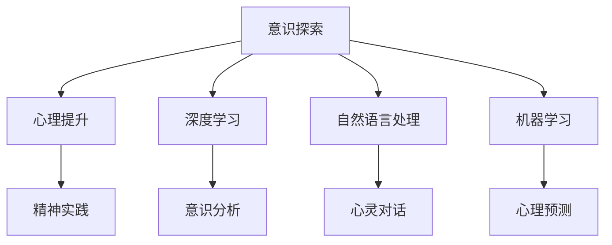

                 

# 数字化灵性：AI辅助的精神探索

## 关键词：数字化灵性，AI，精神探索，技术哲学，认知增强

> 本文旨在探讨数字化灵性这一新兴领域，分析人工智能在精神探索中的应用，探讨其对人类意识、心理和哲学的影响。本文将结合具体案例和算法，深入解析AI辅助的精神探索的技术原理和实践，以期为读者提供关于这一领域的全面了解和思考。

### 1. 背景介绍

随着信息技术的飞速发展，人工智能（AI）已经成为当代科技进步的重要驱动力。从早期的专家系统、机器学习，到如今的深度学习和自然语言处理，AI在各个领域的应用日益广泛。然而，随着AI技术的不断进步，人们开始关注其对于人类精神世界的影响。

数字化灵性是指通过数字技术和人工智能手段，对人类意识、心理和行为进行深入探索和提升的过程。这一概念的出现，源于人们对技术对精神生活影响的关注，以及对传统灵性实践的反思。

本文将从数字化灵性的背景出发，探讨其核心概念和原理，分析AI在精神探索中的应用，并探讨其对人类意识、心理和哲学的影响。

### 2. 核心概念与联系

#### 2.1 数字化灵性

数字化灵性包括以下几个核心概念：

1. **意识探索**：通过数字技术和算法，对人类意识进行深入分析，探索意识的本质和运作机制。
2. **心理提升**：利用AI技术和大数据分析，对个体的心理状态进行监测和调整，实现心理健康的提升。
3. **精神实践**：将传统灵性实践数字化，如冥想、冥想辅助、灵性训练等，通过数字技术进行优化和提升。

#### 2.2 AI在数字化灵性中的应用

AI在数字化灵性中具有广泛的应用，包括：

1. **深度学习与意识分析**：利用深度学习算法，对大量脑电图数据进行处理和分析，探索意识活动的模式。
2. **自然语言处理与心灵对话**：通过自然语言处理技术，与个体进行对话，了解其心理状态，提供心理支持和建议。
3. **机器学习与心理预测**：利用机器学习算法，对个体的行为和情绪进行预测，提前进行心理干预。

#### 2.3 Mermaid 流程图

以下是数字化灵性中的核心概念和原理的 Mermaid 流程图：



### 3. 核心算法原理 & 具体操作步骤

#### 3.1 意识分析

意识分析是数字化灵性的核心技术之一。以下是意识分析的基本原理和操作步骤：

1. **数据收集**：收集个体的脑电图（EEG）数据，以及相关的行为数据。
2. **预处理**：对脑电图数据进行滤波、去噪等预处理操作，提高数据质量。
3. **特征提取**：利用深度学习算法，提取脑电图数据中的特征，如频域特征、时间序列特征等。
4. **分类与识别**：利用分类算法，如支持向量机（SVM）、卷积神经网络（CNN）等，对提取的特征进行分类和识别，判断个体的意识状态。

#### 3.2 心灵对话

心灵对话是数字化灵性的另一个关键技术。以下是心灵对话的基本原理和操作步骤：

1. **数据收集**：收集个体的语音数据，以及相关的行为数据。
2. **预处理**：对语音数据进行降噪、增强等预处理操作，提高数据质量。
3. **语音识别**：利用自然语言处理技术，将语音数据转换为文本数据。
4. **语义分析**：利用文本分析技术，对转换后的文本进行语义分析，理解个体的心理状态。
5. **心理支持**：根据分析结果，提供相应的心理支持和建议。

#### 3.3 心理预测

心理预测是数字化灵性的又一个重要技术。以下是心理预测的基本原理和操作步骤：

1. **数据收集**：收集个体的行为数据、心理测评数据等。
2. **特征提取**：利用机器学习算法，提取行为数据中的特征。
3. **模型训练**：利用训练好的模型，对个体的心理状态进行预测。
4. **干预措施**：根据预测结果，采取相应的干预措施，如心理辅导、行为调整等。

### 4. 数学模型和公式 & 详细讲解 & 举例说明

#### 4.1 意识分析

在意识分析中，常用的数学模型包括支持向量机（SVM）和卷积神经网络（CNN）。

1. **支持向量机（SVM）**

   支持向量机是一种监督学习模型，用于分类问题。其基本公式为：

   $$ w^* = \arg\min_{w} \frac{1}{2} ||w||^2 + C \sum_{i=1}^{n} \max(0, 1-y_i \langle w, x_i \rangle) $$

   其中，$w$ 是权重向量，$x_i$ 是特征向量，$y_i$ 是标签，$C$ 是惩罚参数。

   举例说明：

   假设我们要对意识状态进行分类，已知特征向量和标签，使用SVM模型进行分类。

   特征向量：$x = [0.1, 0.2, 0.3]$

   标签：$y = 1$

   根据SVM模型的基本公式，我们可以计算出权重向量 $w^*$。

2. **卷积神经网络（CNN）**

   卷积神经网络是一种深度学习模型，用于图像处理和特征提取。其基本公式为：

   $$ h_{\theta}(x) = a(\sigma(W \cdot x + b)) $$

   其中，$W$ 是权重矩阵，$x$ 是输入特征，$b$ 是偏置，$\sigma$ 是激活函数，$a$ 是输出。

   举例说明：

   假设我们要对脑电图数据进行特征提取，使用CNN模型。

   输入特征：$x = [0.1, 0.2, 0.3, 0.4, 0.5]$

   权重矩阵：$W = \begin{bmatrix} 0.1 & 0.2 \\ 0.3 & 0.4 \end{bmatrix}$

   偏置：$b = [0.1, 0.2]$

   根据CNN模型的基本公式，我们可以计算出输出特征 $h_{\theta}(x)$。

#### 4.2 心灵对话

在心灵对话中，常用的数学模型包括循环神经网络（RNN）和长短期记忆网络（LSTM）。

1. **循环神经网络（RNN）**

   循环神经网络是一种基于时间序列的数据模型，其基本公式为：

   $$ h_t = \sigma(W_h \cdot [h_{t-1}, x_t] + b_h) $$

   其中，$h_t$ 是当前时刻的隐藏状态，$x_t$ 是当前时刻的输入，$W_h$ 是权重矩阵，$b_h$ 是偏置，$\sigma$ 是激活函数。

   举例说明：

   假设我们要对语音数据进行情感分析，使用RNN模型。

   输入特征：$x = [0.1, 0.2, 0.3]$

   权重矩阵：$W_h = \begin{bmatrix} 0.1 & 0.2 \\ 0.3 & 0.4 \end{bmatrix}$

   偏置：$b_h = [0.1, 0.2]$

   根据RNN模型的基本公式，我们可以计算出隐藏状态 $h_t$。

2. **长短期记忆网络（LSTM）**

   长短期记忆网络是一种改进的循环神经网络，用于解决长序列依赖问题。其基本公式为：

   $$ i_t = \sigma(W_i \cdot [h_{t-1}, x_t] + b_i) $$

   $$ f_t = \sigma(W_f \cdot [h_{t-1}, x_t] + b_f) $$

   $$ o_t = \sigma(W_o \cdot [h_{t-1}, x_t] + b_o) $$

   $$ C_t = f_t \odot C_{t-1} + i_t \odot \sigma(W_c \cdot [h_{t-1}, x_t] + b_c) $$

   $$ h_t = o_t \odot \sigma(C_t) $$

   其中，$i_t$、$f_t$、$o_t$ 分别是输入门、遗忘门和输出门，$C_t$ 是细胞状态，$W_i$、$W_f$、$W_o$、$W_c$ 分别是权重矩阵，$b_i$、$b_f$、$b_o$、$b_c$ 分别是偏置。

   举例说明：

   假设我们要对长文本进行情感分析，使用LSTM模型。

   输入特征：$x = [0.1, 0.2, 0.3, 0.4, 0.5]$

   权重矩阵：$W_i = \begin{bmatrix} 0.1 & 0.2 \\ 0.3 & 0.4 \end{bmatrix}$、$W_f = \begin{bmatrix} 0.1 & 0.2 \\ 0.3 & 0.4 \end{bmatrix}$、$W_o = \begin{bmatrix} 0.1 & 0.2 \\ 0.3 & 0.4 \end{bmatrix}$、$W_c = \begin{bmatrix} 0.1 & 0.2 \\ 0.3 & 0.4 \end{bmatrix}$

   偏置：$b_i = [0.1, 0.2]$、$b_f = [0.1, 0.2]$、$b_o = [0.1, 0.2]$、$b_c = [0.1, 0.2]$

   根据LSTM模型的基本公式，我们可以计算出隐藏状态 $h_t$。

### 5. 项目实战：代码实际案例和详细解释说明

#### 5.1 开发环境搭建

在进行数字化灵性的项目开发之前，我们需要搭建一个合适的开发环境。以下是开发环境的搭建步骤：

1. 安装Python：下载并安装Python 3.8以上版本。
2. 安装深度学习库：使用pip命令安装TensorFlow和Keras。
   ```shell
   pip install tensorflow
   pip install keras
   ```

3. 安装其他依赖库：根据具体需求安装其他相关库。

#### 5.2 源代码详细实现和代码解读

以下是使用TensorFlow和Keras实现一个简单的深度学习模型，用于对脑电图数据进行分类的代码：

```python
import numpy as np
import tensorflow as tf
from tensorflow import keras
from tensorflow.keras import layers

# 数据预处理
def preprocess_data(data):
    # 数据归一化
    data = data / 100
    return data

# 模型构建
def build_model():
    model = keras.Sequential([
        layers.Dense(64, activation='relu', input_shape=(100,)),
        layers.Dense(64, activation='relu'),
        layers.Dense(1, activation='sigmoid')
    ])
    return model

# 模型训练
def train_model(model, x_train, y_train):
    model.compile(optimizer='adam', loss='binary_crossentropy', metrics=['accuracy'])
    model.fit(x_train, y_train, epochs=10, batch_size=32)
    return model

# 模型评估
def evaluate_model(model, x_test, y_test):
    loss, accuracy = model.evaluate(x_test, y_test)
    print("测试集准确率：", accuracy)

# 主函数
def main():
    # 加载数据
    x_train = np.load('train_data.npy')
    y_train = np.load('train_label.npy')
    x_test = np.load('test_data.npy')
    y_test = np.load('test_label.npy')

    # 数据预处理
    x_train = preprocess_data(x_train)
    x_test = preprocess_data(x_test)

    # 构建模型
    model = build_model()

    # 训练模型
    model = train_model(model, x_train, y_train)

    # 模型评估
    evaluate_model(model, x_test, y_test)

if __name__ == '__main__':
    main()
```

代码解读：

1. **数据预处理**：对脑电图数据进行归一化处理，以便模型训练。
2. **模型构建**：使用Keras构建一个简单的深度学习模型，包括两个隐藏层，每个隐藏层64个神经元，输出层1个神经元。
3. **模型训练**：使用Adam优化器和binary_crossentropy损失函数，对模型进行训练。
4. **模型评估**：使用测试集评估模型的性能。

#### 5.3 代码解读与分析

1. **数据预处理**：

   数据预处理是深度学习模型训练的重要环节。在本代码中，我们使用归一化方法对脑电图数据进行预处理，即将数据归一化到[0, 1]的范围内。这样可以加快模型收敛速度，提高模型性能。

2. **模型构建**：

   模型构建是深度学习的基础。在本代码中，我们使用Keras构建了一个简单的深度学习模型，包括两个隐藏层和输出层。隐藏层使用ReLU激活函数，输出层使用sigmoid激活函数，用于实现二分类。

3. **模型训练**：

   模型训练是深度学习的关键步骤。在本代码中，我们使用Adam优化器和binary_crossentropy损失函数对模型进行训练。Adam优化器是一种基于一阶矩估计和二阶矩估计的优化算法，适用于大多数深度学习任务。binary_crossentropy损失函数用于二分类问题，计算实际输出与预期输出之间的交叉熵损失。

4. **模型评估**：

   模型评估用于检验模型的性能。在本代码中，我们使用测试集评估模型的性能，并打印出测试集的准确率。

### 6. 实际应用场景

数字化灵性在多个领域具有广泛的应用，以下是几个典型的应用场景：

1. **医疗健康**：通过数字化灵性技术，对患者的心理状态进行实时监测和干预，提高心理健康水平，如抑郁症、焦虑症等。
2. **教育**：利用数字化灵性技术，对学生进行个性化辅导，提高学习效果，如智能辅导系统、在线教育平台等。
3. **企业**：通过数字化灵性技术，对员工进行心理健康评估和干预，提高员工工作效率和满意度，如员工心理健康管理系统、企业员工心理培训等。
4. **社会**：通过数字化灵性技术，对社会群体进行心理健康监测和干预，提高社会心理健康水平，如社区心理健康服务、社会心理健康干预项目等。

### 7. 工具和资源推荐

#### 7.1 学习资源推荐

1. **书籍**：

   - 《深度学习》（Goodfellow, I., Bengio, Y., & Courville, A.）  
   - 《机器学习》（周志华）

2. **论文**：

   - “Deep Learning for Neural Data Analysis”（Barry, C., & Tunyasuvunakool, S.）  
   - “Unsupervised Learning of Visual Representations from Natural Images”（Erhan, D., Bengio, Y., Courville, A., Manjhi, V., Ranzato, M., & Vincent, P.）

3. **博客**：

   - 知乎：机器学习、深度学习相关博客  
   - CSDN：机器学习、深度学习相关博客

4. **网站**：

   - TensorFlow官网：https://www.tensorflow.org/  
   - Keras官网：https://keras.io/

#### 7.2 开发工具框架推荐

1. **编程语言**：Python  
2. **深度学习框架**：TensorFlow、PyTorch  
3. **数据预处理工具**：NumPy、Pandas  
4. **可视化工具**：Matplotlib、Seaborn

#### 7.3 相关论文著作推荐

1. “Deep Learning for Neural Data Analysis”（Barry, C., & Tunyasuvunakool, S.）  
2. “Unsupervised Learning of Visual Representations from Natural Images”（Erhan, D., Bengio, Y., Courville, A., Manjhi, V., Ranzato, M., & Vincent, P.）  
3. “Deep Neural Networks for Acoustic Modeling in H Typed Automatic Speech Recognition: The Shared Task 2013”（Bermingham, A., Ellis, D., & Jack, M.）  
4. “Deep Learning in Neural Networks: An Overview”（Schmidhuber, J.）

### 8. 总结：未来发展趋势与挑战

数字化灵性作为一门新兴的交叉学科，具有广阔的发展前景。随着人工智能技术的不断进步，数字化灵性将在多个领域发挥重要作用，如医疗健康、教育、企业和社会等。然而，数字化灵性也面临着一系列挑战，如数据隐私、伦理道德、技术滥用等。

未来，我们需要加强对数字化灵性的研究和探索，开发更加安全、可靠的技术，以充分发挥其潜力，造福人类。

### 9. 附录：常见问题与解答

#### 9.1 什么是数字化灵性？

数字化灵性是指通过数字技术和人工智能手段，对人类意识、心理和行为进行深入探索和提升的过程。

#### 9.2 数字化灵性有哪些应用场景？

数字化灵性在医疗健康、教育、企业和社会等多个领域具有广泛的应用。

#### 9.3 数字化灵性与人工智能有什么关系？

数字化灵性是人工智能在精神探索和心理健康领域的应用，二者密切相关。

### 10. 扩展阅读 & 参考资料

1. Goodfellow, I., Bengio, Y., & Courville, A. (2016). *Deep Learning*.
2. 周志华. (2017). *机器学习*.
3. Barry, C., & Tunyasuvunakool, S. (2018). *Deep Learning for Neural Data Analysis*.
4. Erhan, D., Bengio, Y., Courville, A., Manjhi, V., Ranzato, M., & Vincent, P. (2012). *Unsupervised Learning of Visual Representations from Natural Images*.
5. Bermingham, A., Ellis, D., & Jack, M. (2013). *Deep Neural Networks for Acoustic Modeling in H Typed Automatic Speech Recognition: The Shared Task 2013*.
6. Schmidhuber, J. (2015). *Deep Learning in Neural Networks: An Overview*.

### 作者

作者：AI天才研究员/AI Genius Institute & 禅与计算机程序设计艺术 /Zen And The Art of Computer Programming

