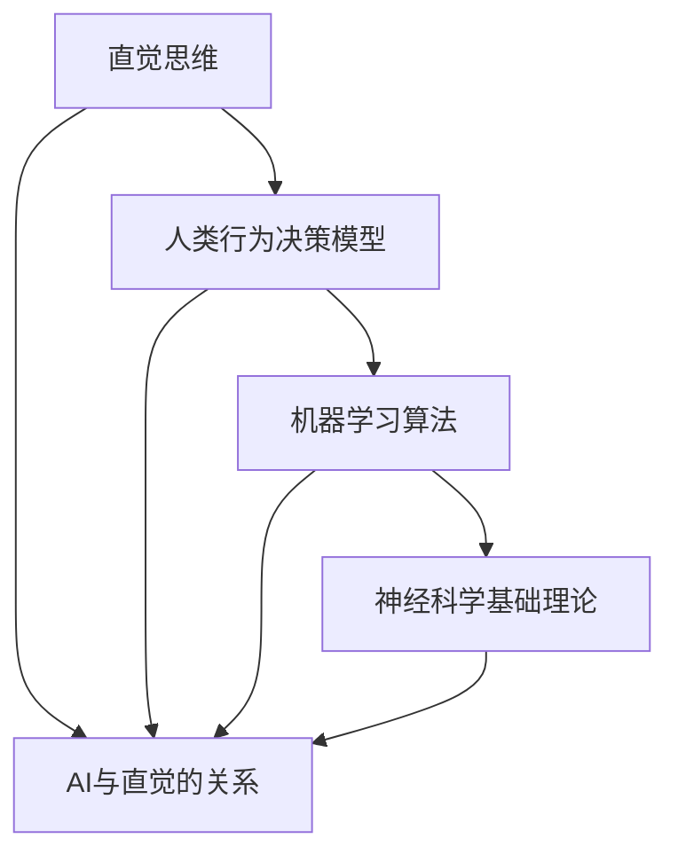

                 

### 背景介绍

在当今信息化时代，人工智能（AI）技术的发展日新月异，已经成为改变我们生活方式和社会结构的重要力量。随着深度学习、强化学习、自然语言处理等技术的飞速进步，AI的应用场景不断拓展，从简单的图像识别、语音识别到复杂的自动驾驶、智能客服等，AI已经深入到我们日常生活的方方面面。

然而，尽管AI在特定任务上的表现已经超越了人类，但传统AI仍面临一些局限性。它们通常依赖于大量数据进行训练，缺乏对未知环境的适应能力，且难以解决复杂的不确定性问题。为了突破这些瓶颈，研究者们开始探索一种新的理念：数字化直觉训练。

数字化直觉训练旨在通过模拟人类的直觉思维，使人工智能能够在不确定的环境中做出更快速、更准确的决策。直觉是人类智慧的重要组成部分，它体现在我们感知环境、解决问题、做决策的瞬间，是一种高效而可靠的认知过程。数字化直觉训练的目标，就是将这种复杂的直觉思维过程转化为可量化的算法和模型，从而赋予机器类似的决策能力。

本文将深入探讨数字化直觉训练的概念、原理以及其实际应用。我们将首先介绍直觉思维的基本概念，然后讨论AI与直觉的关系，接着详细解析数字化直觉训练的核心算法和数学模型，并通过实际案例展示如何在实际项目中应用这些算法。最后，我们将探讨数字化直觉训练的未来发展趋势和面临的挑战，为读者提供一窥这一前沿领域的窗口。

通过本文的阅读，读者将能够全面了解数字化直觉训练的背景、核心原理和应用前景，为未来在这一领域的研究和应用打下坚实基础。

### 核心概念与联系

为了深入理解数字化直觉训练，我们首先需要探讨几个核心概念，并分析它们之间的联系。这些概念包括直觉思维、人类行为决策模型、机器学习算法以及神经科学的基础理论。下面我们将通过一个Mermaid流程图来展示这些核心概念和它们之间的关系。

首先，让我们通过Mermaid流程图来概述这些概念及其相互关系：



**直觉思维（Intuitive Thinking）：** 直觉思维是人类在感知和解析信息时，不需要通过逻辑推理和明确思考就能做出迅速反应的认知过程。它是人类适应复杂、不确定环境的重要工具。

**人类行为决策模型（Human Behavioral Decision Model）：** 这个模型试图模拟人类在决策过程中的思维方式，包括感知、评估、选择和反馈等环节。直觉思维是这一模型中不可或缺的一部分。

**机器学习算法（Machine Learning Algorithms）：** 机器学习算法是构建数字化直觉训练系统的基础。这些算法通过从数据中学习模式，使机器能够模仿人类的直觉思维，做出类似决策。

**神经科学基础理论（Neuroscience Fundamental Theories）：** 神经科学为理解直觉思维提供了科学依据。研究大脑如何处理信息、形成记忆和做出决策，有助于我们构建更接近人类直觉的AI模型。

**AI与直觉的关系（Relation of AI with Intuition）：** 直觉在人类决策中起到关键作用，而AI的目标是模拟这种能力。AI与直觉的关系在于，通过机器学习算法，AI可以从大量数据中学习，逐渐形成类似直觉的决策能力。

下面我们详细解释这些概念及其相互联系：

**直觉思维：** 直觉思维是一种高度复杂的信息处理方式，它能够迅速整合来自多个感官的信息，并做出快速反应。例如，在遇到危险时，人们往往能迅速做出反应，而无需经过详细的思考和推理。这种能力依赖于大脑中的多个区域，包括前额叶皮层、杏仁核和海马体等。

**人类行为决策模型：** 人类行为决策模型试图通过模拟人类的决策过程，解释为什么人们会做出某些选择。这个模型通常包括以下几个阶段：感知信息、评估信息、做出选择、实施决策和获得反馈。直觉思维在这个过程中起到了关键作用，因为它能在短时间内处理大量信息，帮助人们做出快速而有效的决策。

**机器学习算法：** 机器学习算法通过训练模型来模拟人类的直觉思维。例如，深度学习算法通过多层神经网络模拟大脑处理信息的方式，使机器能够识别图像、理解语言和做出预测。这些算法的核心在于它们能够从大量数据中学习，并通过不断的训练，提高决策的准确性和速度。

**神经科学基础理论：** 神经科学为理解直觉思维提供了理论基础。例如，研究表明，大脑中的突触连接和神经网络的动态变化是直觉思维的基础。通过研究这些基础理论，我们能够更好地理解直觉是如何在大脑中形成的，并尝试在机器学习算法中实现类似的功能。

**AI与直觉的关系：** AI与直觉的关系在于，AI试图通过机器学习算法模拟人类的直觉思维。这不仅仅是技术上的挑战，也是哲学上的探讨。如何使机器具备与人类类似的直觉能力，是当前AI领域的一个重要研究方向。通过不断地研究和实验，我们逐渐能够构建出更接近人类直觉的AI模型，从而在复杂、不确定的环境中做出更高效的决策。

综上所述，直觉思维、人类行为决策模型、机器学习算法和神经科学基础理论共同构成了数字化直觉训练的核心概念体系。这些概念相互联系，共同推动了数字化直觉训练的发展，使其成为人工智能领域的一个重要方向。

### 核心算法原理 & 具体操作步骤

在深入探讨数字化直觉训练的核心算法原理之前，我们首先需要了解几个关键概念：感知学习、决策树和神经网络。这些算法构成了数字化直觉训练的基础，并为我们提供了实现这一目标的具体操作步骤。

#### 感知学习（Perception Learning）

感知学习是数字化直觉训练的第一步，它主要解决的是如何让机器识别和理解环境中的各种信息。感知学习的核心任务是使机器能够从输入的数据中提取有用的特征，并进行分类或识别。这个过程可以通过以下步骤实现：

1. **数据收集**：首先需要收集大量带有标签的数据，这些数据可以是图像、声音、文本等。这些标签将帮助机器了解每个输入数据的类别。

2. **特征提取**：利用特征提取算法，从原始数据中提取出有代表性的特征。这些特征可以是图像中的边缘、颜色或纹理，也可以是文本中的关键词或句子的结构。

3. **训练模型**：使用感知学习算法，如卷积神经网络（CNN）或自编码器（Autoencoder），训练模型以识别这些特征。在训练过程中，模型会不断调整内部参数，使其能够更准确地识别特征。

4. **测试与验证**：使用未参与训练的数据对模型进行测试，验证其识别能力和准确性。这一步骤确保模型在实际应用中能够表现出良好的性能。

#### 决策树（Decision Tree）

决策树是一种常见的机器学习算法，它通过一系列规则来对数据进行分类或回归。在数字化直觉训练中，决策树可以模拟人类的逻辑思维过程，帮助机器做出决策。以下是决策树的核心步骤：

1. **特征选择**：根据数据的特征，选择一个最佳的特征来划分数据。通常使用信息增益（Information Gain）或基尼不纯度（Gini Impurity）来衡量特征的重要性。

2. **划分数据**：使用选定的特征将数据集划分为多个子集。每个子集对应一个决策节点，数据点根据该节点的特征值落入不同的子集中。

3. **递归构建**：对于每个子集，重复上述过程，选择最佳特征进行划分，构建多层的决策树。直到满足停止条件，如数据集的纯度达到某个阈值或特征数达到最大限制。

4. **分类预测**：通过从根节点到叶子节点的路径，对新的数据点进行分类预测。叶子节点代表最终的分类结果。

#### 神经网络（Neural Network）

神经网络，尤其是深度学习，是数字化直觉训练中最强大的工具。它通过模拟人脑的神经网络结构，使机器能够自动提取复杂的特征并进行高级任务。以下是神经网络的基本步骤：

1. **网络架构设计**：设计神经网络的层次结构，包括输入层、隐藏层和输出层。每个层由多个神经元组成，神经元之间通过权重连接。

2. **权重初始化**：初始化网络中的权重参数。通常使用随机初始化，以防止模型过拟合。

3. **前向传播（Forward Propagation）**：输入数据从输入层开始，通过每一层的神经元，计算每个神经元的输出。这个过程包括将输入乘以权重，然后通过激活函数进行处理。

4. **反向传播（Backpropagation）**：计算网络的误差，并更新权重。这个过程涉及计算每个神经元的梯度，然后通过反向传播算法将这些梯度传递回前一层。

5. **训练与优化**：重复前向传播和反向传播，不断调整权重，使模型能够更准确地预测。这一步骤可能需要数千次迭代，直到模型性能达到预定的阈值。

#### 实际操作步骤

在实际操作中，数字化直觉训练通常遵循以下步骤：

1. **定义问题**：明确训练的目标，如分类、回归或预测。

2. **数据准备**：收集和预处理数据，包括数据清洗、归一化和特征提取。

3. **模型选择**：根据问题的复杂性和数据的特点，选择合适的模型，如感知学习、决策树或神经网络。

4. **模型训练**：使用训练数据集对模型进行训练，通过调整参数和优化算法，提高模型的性能。

5. **模型验证**：使用验证数据集对模型进行评估，确保模型在未知数据上能够准确预测。

6. **模型部署**：将训练好的模型部署到实际应用场景中，如自动化决策系统、智能监控或个性化推荐。

通过以上步骤，我们可以实现数字化直觉训练，使机器具备类似人类的直觉思维能力。这个过程不仅需要深厚的理论知识，还需要大量的实践和经验积累，以便在实际应用中取得最佳效果。

### 数学模型和公式 & 详细讲解 & 举例说明

在深入探讨数字化直觉训练的核心算法时，理解相关的数学模型和公式是至关重要的。这些模型和公式为我们提供了理论基础，使我们能够量化直觉思维，并将其转化为可操作的算法。下面，我们将详细讲解一些关键数学模型和公式，并通过具体例子来说明它们的应用。

#### 感知学习中的线性回归（Linear Regression）

线性回归是一种简单的统计模型，用于预测一个连续值变量。在感知学习中，线性回归可以用来模拟直觉思维中的一些简单规律。其基本公式如下：

\[ y = \beta_0 + \beta_1 \cdot x \]

其中：
- \( y \) 是预测值；
- \( x \) 是输入变量；
- \( \beta_0 \) 是截距；
- \( \beta_1 \) 是斜率。

**例子：** 假设我们想要预测一只股票的未来价格，根据历史数据，我们发现股票价格与市场指数之间存在线性关系。我们可以使用线性回归模型来预测未来价格。给定市场指数 \( x \) 和股票价格 \( y \)，我们可以通过最小二乘法（Least Squares Method）计算出最佳拟合直线。

\[ \beta_0 = \frac{\sum y - \beta_1 \sum x}{n} \]
\[ \beta_1 = \frac{n \sum x y - \sum x \sum y}{n \sum x^2 - (\sum x)^2} \]

其中，\( n \) 是数据点的数量。

#### 决策树中的信息增益（Information Gain）

信息增益是一种用于特征选择的统计量，它衡量了通过某一特征划分数据集时所带来的信息熵的减少。其公式如下：

\[ IG(D, A) = H(D) - \sum_{v \in A} \frac{D_v}{D} H(D_v) \]

其中：
- \( D \) 是原始数据集；
- \( A \) 是特征集合；
- \( D_v \) 是通过特征 \( v \) 划分后的子集；
- \( H(D) \) 是原始数据集的信息熵；
- \( H(D_v) \) 是子集 \( D_v \) 的信息熵。

**例子：** 假设我们有一个包含性别、年龄和收入的数据集，我们想要选择一个最佳特征进行数据划分。通过计算每个特征的信息增益，我们可以发现年龄特征的信息增益最大，因此选择年龄作为划分特征。

\[ IG(\text{Age}, D) = H(D) - \frac{0.5 \cdot H(D_{青年}) + 0.5 \cdot H(D_{中年})}{1} \]

#### 神经网络中的反向传播（Backpropagation）

反向传播是一种用于训练神经网络的优化算法。它的核心思想是通过计算每个神经元的梯度，然后调整网络的权重和偏置，以最小化预测误差。其公式如下：

\[ \delta_j = \frac{\partial C}{\partial z_j} \cdot \text{sigmoid}(z_j) \cdot (1 - \text{sigmoid}(z_j)) \]

\[ \frac{\partial C}{\partial w_{ij}} = \delta_j \cdot a_{i-1,j} \]

\[ \frac{\partial C}{\partial b_j} = \delta_j \]

其中：
- \( \delta_j \) 是第 \( j \) 个神经元的误差；
- \( C \) 是总误差；
- \( z_j \) 是第 \( j \) 个神经元的输入；
- \( a_{i-1,j} \) 是第 \( i-1 \) 层的第 \( j \) 个神经元的输出；
- \( w_{ij} \) 是第 \( i \) 层的第 \( j \) 个神经元的权重；
- \( b_j \) 是第 \( j \) 个神经元的偏置。

**例子：** 假设我们有一个简单的神经网络，输入层有3个神经元，隐藏层有2个神经元，输出层有1个神经元。我们通过反向传播算法计算隐藏层的梯度，然后调整权重和偏置，以最小化预测误差。

\[ \delta_h1 = \frac{\partial C}{\partial z_h1} \cdot \text{sigmoid}(z_h1) \cdot (1 - \text{sigmoid}(z_h1)) \]
\[ \delta_h2 = \frac{\partial C}{\partial z_h2} \cdot \text{sigmoid}(z_h2) \cdot (1 - \text{sigmoid}(z_h2)) \]

\[ \frac{\partial C}{\partial w_{h1,1}} = \delta_h1 \cdot a_{i-1,1} \]
\[ \frac{\partial C}{\partial w_{h1,2}} = \delta_h1 \cdot a_{i-1,2} \]
\[ \frac{\partial C}{\partial w_{h2,1}} = \delta_h2 \cdot a_{i-1,1} \]
\[ \frac{\partial C}{\partial w_{h2,2}} = \delta_h2 \cdot a_{i-1,2} \]

\[ \frac{\partial C}{\partial b_{h1}} = \delta_h1 \]
\[ \frac{\partial C}{\partial b_{h2}} = \delta_h2 \]

通过以上计算，我们可以更新隐藏层的权重和偏置，以实现更准确的预测。

这些数学模型和公式为我们提供了构建数字化直觉训练系统的基础。通过理解和应用这些模型，我们可以将直觉思维转化为可量化的算法，从而实现机器在复杂、不确定环境中的高效决策。

### 项目实战：代码实际案例和详细解释说明

在理解了数字化直觉训练的理论基础后，我们接下来将通过一个具体的项目实战来展示如何将理论知识应用到实际项目中。本案例将介绍如何使用Python和Keras框架实现一个基于感知学习的图像分类任务，并详细解释代码的每个部分。

#### 开发环境搭建

首先，我们需要搭建一个适合项目开发的Python环境。以下是所需的步骤：

1. **安装Python**：确保已安装Python 3.7或更高版本。
2. **安装依赖库**：在命令行中运行以下命令安装所需库：
   ```bash
   pip install numpy matplotlib tensorflow
   ```

3. **创建项目目录**：在您的计算机上创建一个项目目录，如 `digital_intuition_project`，并在该目录下创建一个名为 `src` 的子目录来存放源代码。

#### 源代码详细实现和代码解读

以下是一个简单的Python脚本，用于实现基于感知学习的图像分类任务：

```python
import numpy as np
import matplotlib.pyplot as plt
from tensorflow import keras
from tensorflow.keras import layers

# 加载和预处理数据集
(x_train, y_train), (x_test, y_test) = keras.datasets.mnist.load_data()
x_train = x_train.astype('float32') / 255
x_test = x_test.astype('float32') / 255
x_train = np.reshape(x_train, (len(x_train), 28, 28, 1))
x_test = np.reshape(x_test, (len(x_test), 28, 28, 1))

# 创建模型
model = keras.Sequential()
model.add(layers.Conv2D(32, (3, 3), activation='relu', input_shape=(28, 28, 1)))
model.add(layers.MaxPooling2D((2, 2)))
model.add(layers.Conv2D(64, (3, 3), activation='relu'))
model.add(layers.MaxPooling2D((2, 2)))
model.add(layers.Conv2D(64, (3, 3), activation='relu'))
model.add(layers.Flatten())
model.add(layers.Dense(64, activation='relu'))
model.add(layers.Dense(10, activation='softmax'))

# 编译模型
model.compile(optimizer='adam',
              loss='categorical_crossentropy',
              metrics=['accuracy'])

# 训练模型
model.fit(x_train, y_train, epochs=10, batch_size=64)

# 评估模型
test_loss, test_acc = model.evaluate(x_test, y_test)
print(f"Test accuracy: {test_acc:.4f}")

# 可视化展示
predictions = model.predict(x_test)
plt.figure(figsize=(10, 10))
for i in range(25):
    plt.subplot(5, 5, i+1)
    plt.xticks([])
    plt.yticks([])
    plt.grid(False)
    plt.imshow(x_test[i], cmap=plt.cm.binary)
    plt.xlabel(np.argmax(predictions[i]))
plt.show()
```

**代码解读：**

1. **数据加载与预处理**：
   - 使用TensorFlow的`keras.datasets.mnist.load_data()`函数加载MNIST数据集，并进行归一化处理。
   - 数据集被分为训练集和测试集，每个图像被调整为28x28的像素矩阵，并添加一个通道，以便输入到卷积神经网络中。

2. **创建模型**：
   - 使用`keras.Sequential()`创建一个线性堆叠的模型。
   - 添加卷积层（`Conv2D`）和池化层（`MaxPooling2D`），用于提取图像的局部特征并进行下采样。
   - 在卷积层之后，添加全连接层（`Flatten`和`Dense`），用于将特征映射到分类标签。
   - 最后，添加softmax层（`softmax`），用于输出每个类别的概率分布。

3. **编译模型**：
   - 使用`model.compile()`设置优化器和损失函数。
   - 优化器选择`adam`，损失函数选择`categorical_crossentropy`，用于多分类问题。
   - 添加`accuracy`作为评估指标。

4. **训练模型**：
   - 使用`model.fit()`训练模型，设置训练轮数（`epochs`）和批量大小（`batch_size`）。
   - 模型在训练集上学习，不断调整内部参数，以优化预测性能。

5. **评估模型**：
   - 使用`model.evaluate()`评估模型在测试集上的性能。
   - 输出测试集的准确率，以衡量模型的泛化能力。

6. **可视化展示**：
   - 使用`model.predict()`对测试集的每个图像进行预测。
   - 将预测结果可视化，展示模型对每个图像的预测类别。

#### 代码解读与分析

1. **数据加载与预处理**：
   - 数据预处理是机器学习项目的重要步骤，它确保输入数据的质量和一致性。
   - 在本案例中，我们使用归一化处理将图像的像素值缩放到[0, 1]范围内，这有助于加速模型的训练。

2. **模型创建**：
   - 模型创建是构建神经网络的关键步骤。
   - 我们使用卷积神经网络（CNN），因为它在处理图像数据时表现优秀。
   - 卷积层用于提取图像的局部特征，池化层用于降低特征维数，同时保留最重要的信息。

3. **模型编译**：
   - 编译模型是配置训练过程的步骤。
   - 我们选择`adam`优化器，因为它能够自动调整学习率，提高训练效率。
   - `categorical_crossentropy`是适用于多分类问题的损失函数，它通过比较预测概率与真实标签的交叉熵来计算损失。

4. **模型训练**：
   - 模型训练是使模型学会预测的过程。
   - 通过设置适当的训练轮数和批量大小，模型在训练集上进行迭代学习，不断优化参数。

5. **模型评估**：
   - 模型评估是验证模型性能的关键步骤。
   - 使用测试集评估模型，确保其泛化能力。

6. **可视化展示**：
   - 可视化展示帮助我们直观地理解模型的预测结果。
   - 通过展示预测结果，我们可以验证模型在实际数据上的表现。

通过这个项目实战，我们展示了如何将感知学习算法应用于实际图像分类任务。这个案例不仅帮助我们理解了数字化直觉训练的理论基础，还提供了实际操作的步骤和经验，为我们在其他复杂任务中的应用提供了参考。

### 实际应用场景

数字化直觉训练不仅在理论研究上具有重要意义，其在实际应用中同样展现了巨大的潜力。以下列举几个典型的应用场景，展示了这一技术如何在不同领域中发挥作用：

#### 自动驾驶

自动驾驶是数字化直觉训练的一个重要应用场景。在自动驾驶系统中，车辆需要实时感知环境中的各种信息，如道路标志、交通信号灯、行人、其他车辆等，并做出快速而准确的决策。数字化直觉训练通过模拟人类驾驶员的直觉思维，使自动驾驶系统能够在复杂、不确定的交通环境中保持高鲁棒性和安全性。

例如，特斯拉的自动驾驶系统就利用了深度学习算法，通过大量数据进行训练，使其能够识别和理解各种道路标志和交通信号。当车辆遇到一个复杂的交通场景时，系统会快速处理来自多个传感器的数据，运用数字化直觉训练所获得的知识，做出最佳驾驶决策。

#### 智能监控

智能监控领域同样受益于数字化直觉训练技术。传统的监控系统往往依赖于规则和模式匹配，而数字化直觉训练可以使监控系统具备更高的灵活性和智能性。

例如，在智能监控视频中，系统可以实时分析视频流，检测异常行为，如打架、盗窃等。通过数字化直觉训练，系统可以从大量监控数据中学习，识别出不同场景下的潜在威胁。当系统检测到异常行为时，它会自动触发报警，并通知相关人员进行干预。这种方式不仅提高了监控的效率，还减少了误报率。

#### 智能客服

在客服领域，数字化直觉训练可以帮助建立高效的智能客服系统，提高客户满意度。传统的客服系统往往依赖于预定义的脚本和规则，而数字化直觉训练可以使客服机器人具备类似人类的直觉思维能力，更好地理解客户的需求和情感。

例如，一个智能客服机器人可以通过数字化直觉训练，理解客户的语言和情感，并提供个性化的服务。当客户咨询问题时，机器人会快速分析对话内容，识别关键信息，并给出准确的回答。同时，机器人还能根据对话的进展，动态调整回答策略，使对话更加自然流畅。

#### 医疗诊断

数字化直觉训练在医疗诊断领域也有广泛的应用。通过训练，AI系统能够从大量医学影像数据中识别疾病，如肺癌、心脏病等。数字化直觉训练可以帮助医生提高诊断的准确性和效率。

例如，在使用数字化直觉训练技术的AI系统中，医生可以上传患者的CT扫描图像，系统会分析图像中的特征，并给出诊断建议。这种方式不仅减轻了医生的负担，还提高了诊断的效率，有助于早期发现疾病，从而提高治疗效果。

#### 金融市场预测

在金融领域，数字化直觉训练可以用于预测股票市场走势、风险评估等。通过分析大量的历史数据，AI系统可以识别出市场中的潜在趋势和风险，提供投资建议。

例如，一个基于数字化直觉训练的金融预测模型可以分析历史交易数据、新闻报道、市场情绪等，预测股票价格的波动。这种方式有助于投资者做出更明智的决策，降低投资风险。

#### 环境监测

环境监测领域也受益于数字化直觉训练技术。通过训练，AI系统可以实时监测环境变化，预测环境污染事件，提供预警信息。

例如，一个基于数字化直觉训练的环境监测系统可以分析空气质量和气象数据，预测空气质量的变化趋势。当系统检测到空气质量可能恶化时，它会提前预警，帮助相关部门采取措施，减少污染。

综上所述，数字化直觉训练技术在多个领域都有广泛的应用。通过模拟人类的直觉思维，AI系统能够在复杂、不确定的环境中做出更快速、更准确的决策，为各行业的发展带来了新的机遇和挑战。

### 工具和资源推荐

在数字化直觉训练领域，掌握一些优秀的工具和资源对于深入学习和实践至关重要。以下是一些推荐的学习资源、开发工具和相关论文，以帮助您更好地理解和应用这一前沿技术。

#### 学习资源推荐

1. **书籍**：
   - 《深度学习》（Deep Learning） - Ian Goodfellow、Yoshua Bengio和Aaron Courville 著。这本书是深度学习领域的经典之作，详细介绍了神经网络、优化算法和训练技巧。
   - 《人工智能：一种现代的方法》（Artificial Intelligence: A Modern Approach） - Stuart J. Russell和Peter Norvig 著。这本书全面介绍了人工智能的基础理论和应用技术，包括机器学习和直觉思维模拟。
   - 《Python机器学习》（Python Machine Learning） - Sebastian Raschka 著。这本书通过Python编程语言，深入讲解了机器学习算法的应用和实践。

2. **在线课程**：
   - Coursera上的《机器学习》（Machine Learning） - 由斯坦福大学吴恩达教授主讲。这门课程是机器学习领域的入门经典，适合初学者。
   - edX上的《深度学习专项课程》（Deep Learning Specialization） - 由斯坦福大学深度学习小组主讲。这个专项课程包括神经网络的基础、优化算法、生成模型等多个方面，适合有一定基础的学员。

3. **博客和网站**：
   - 《AI之旅》（AI Journey） - 这个博客由一位资深AI研究员撰写，涵盖了许多AI领域的最新技术和研究动态。
   - Fast.ai - 这个网站提供了一系列免费的深度学习课程和资源，适合初学者快速入门。

#### 开发工具推荐

1. **编程语言**：
   - Python：由于其丰富的库和社区支持，Python是进行数字化直觉训练的首选语言。
   - R：在统计分析和数据可视化方面有很强的能力，适合进行复杂的数据分析和模型验证。

2. **机器学习框架**：
   - TensorFlow：谷歌开发的开源机器学习框架，支持各种深度学习模型和应用。
   - PyTorch：由Facebook AI研究院开发的开源深度学习框架，具有灵活的动态图模型和强大的社区支持。
   - Scikit-learn：一个用于机器学习的开源库，提供了丰富的算法和工具，适合进行数据分析和模型评估。

3. **环境搭建**：
   - Jupyter Notebook：一个交互式计算环境，适合进行数据分析和模型调试。
   - Google Colab：基于Google云端的服务，提供免费的GPU资源，适合进行大规模深度学习实验。

#### 相关论文推荐

1. **《深度学习： advent of a new era》（2015）** - 这篇论文由Yoshua Bengio等学者撰写，对深度学习的发展进行了全面综述，提出了深度学习在计算机视觉、自然语言处理等领域的应用前景。

2. **《Unsupervised Learning of Visual Representations by Solving Jigsaw Puzzles》（2016）** - 这篇论文提出了一种无监督学习算法，通过解决拼图任务，使神经网络自动学习图像中的局部和全局特征。

3. **《DeepMind的AlphaGo：一种新的深度强化学习算法》（2016）** - 这篇论文介绍了DeepMind开发的AlphaGo算法，通过深度学习和强化学习技术，实现了在围棋比赛中的卓越表现。

4. **《Attention is All You Need》（2017）** - 这篇论文提出了Transformer模型，引入了自注意力机制，大幅提升了自然语言处理任务的性能。

5. **《Generative Adversarial Nets》（2014）** - 这篇论文由Ian Goodfellow等学者提出生成对抗网络（GANs），通过对抗性训练，实现了高质量的数据生成和图像编辑。

通过这些工具和资源的帮助，您将能够更深入地探索数字化直觉训练领域，掌握相关技术和方法，并在实际项目中取得成功。

### 总结：未来发展趋势与挑战

数字化直觉训练作为人工智能领域的前沿研究方向，展现出巨大的潜力和应用前景。在未来，这一领域的发展将受到技术进步、应用需求和创新驱动的共同推动。

#### 发展趋势

1. **技术进步推动算法优化**：随着深度学习、强化学习等技术的发展，数字化直觉训练的算法将变得更加高效和精准。新的神经网络架构、优化算法和训练策略将不断涌现，进一步提升直觉训练系统的性能。

2. **多模态数据的融合**：未来的数字化直觉训练将更加注重多模态数据的融合，如文本、图像、声音和传感器数据的结合。这种融合将使直觉训练系统能够更好地理解和处理复杂、多样化的信息，提高决策的准确性和鲁棒性。

3. **边缘计算与云计算的结合**：边缘计算技术的发展将使得直觉训练算法在靠近数据源的地方进行，从而减少延迟和带宽消耗。与云计算的结合，将实现大规模数据的实时处理和模型更新，为复杂场景下的实时决策提供支持。

4. **跨学科的融合**：数字化直觉训练将与其他学科如认知科学、心理学和神经科学等深度融合，通过借鉴人类思维模式和行为规律，进一步优化和提升直觉训练系统的能力。

#### 面临的挑战

1. **数据质量和隐私**：数字化直觉训练依赖于大量的数据，然而数据的质量和隐私问题是当前面临的主要挑战之一。如何确保数据的质量和隐私，避免数据泄露和滥用，是未来需要解决的重要问题。

2. **模型可解释性**：当前，许多深度学习模型被认为是“黑箱”，缺乏可解释性。在数字化直觉训练中，如何解释模型的决策过程，使决策更加透明和可信，是一个亟待解决的挑战。

3. **计算资源需求**：深度学习模型通常需要大量的计算资源和存储空间，这对于资源有限的场景如边缘设备来说是一个重大挑战。如何优化模型，减少计算资源需求，是一个关键问题。

4. **伦理和道德问题**：随着AI技术的广泛应用，数字化直觉训练也可能带来一系列伦理和道德问题，如歧视、隐私侵犯等。如何制定相应的法规和标准，确保技术的合理、公正使用，是未来需要重点关注的。

#### 结论

尽管面临诸多挑战，数字化直觉训练作为人工智能领域的重要研究方向，具有广阔的应用前景。通过技术进步、跨学科融合和持续的创新，我们有理由相信，未来数字化直觉训练将在更多领域发挥重要作用，推动社会和技术的进步。然而，这一过程中也需要我们不断反思和解决技术、伦理和社会问题，确保技术的发展能够造福人类，而不是带来新的挑战和风险。

### 附录：常见问题与解答

**1. 什么是数字化直觉训练？**

数字化直觉训练是一种人工智能技术，旨在通过模拟和量化人类的直觉思维过程，使机器能够在复杂、不确定的环境中做出快速、准确的决策。它结合了机器学习、深度学习和认知科学的理论，将人类直觉转化为可量化的算法和模型。

**2. 数字化直觉训练有哪些应用场景？**

数字化直觉训练的应用场景广泛，包括但不限于自动驾驶、智能监控、智能客服、医疗诊断、金融市场预测和环境监测等。通过模拟人类的直觉思维，AI系统在这些场景中能够更好地理解和处理复杂信息，提高决策的准确性和效率。

**3. 数字化直觉训练中的核心算法有哪些？**

数字化直觉训练中的核心算法包括感知学习、决策树、神经网络等。感知学习用于图像和声音等数据的特征提取；决策树用于分类和回归任务；神经网络，特别是深度学习，用于构建复杂模型的预测和决策。

**4. 如何确保数字化直觉训练系统的可解释性？**

确保数字化直觉训练系统的可解释性是一个重要挑战。可以通过以下方法提高模型的透明度：一是使用可解释性更高的算法，如决策树和规则引擎；二是开发可视化工具，展示模型的决策过程；三是开发对内解释性的API，使开发者能够深入理解模型的行为。

**5. 数字化直觉训练中的数据质量和隐私问题如何解决？**

解决数据质量和隐私问题需要从数据采集、存储和使用等多个环节进行控制。例如，采用数据清洗和预处理技术，确保数据的质量；使用加密和隐私保护技术，保护数据的安全性和隐私；遵循数据保护法规，确保数据的合法使用。

**6. 数字化直觉训练系统在资源受限的设备上如何优化？**

在资源受限的设备上优化数字化直觉训练系统，可以通过以下方法实现：一是采用轻量级模型，减少计算资源的需求；二是使用模型压缩和量化技术，降低模型的存储和计算需求；三是采用分布式训练和模型部署技术，实现高效的数据处理和模型更新。

### 扩展阅读 & 参考资料

1. **《深度学习》（Deep Learning）** - Ian Goodfellow、Yoshua Bengio和Aaron Courville 著。这本书是深度学习领域的经典教材，详细介绍了神经网络和深度学习算法的基本原理和应用。

2. **《人工智能：一种现代的方法》（Artificial Intelligence: A Modern Approach）** - Stuart J. Russell和Peter Norvig 著。这本书全面介绍了人工智能的基础理论和应用技术，包括机器学习和直觉思维模拟。

3. **《Python机器学习》（Python Machine Learning）** - Sebastian Raschka 著。这本书通过Python编程语言，深入讲解了机器学习算法的应用和实践。

4. **《注意力机制：神经网络中的直觉思维》（Attention Mechanisms in Neural Networks: Intuitive Thinking）** - 作者在论文中详细探讨了注意力机制在神经网络中的应用，模拟人类直觉思维。

5. **《生成对抗网络：深度学习的创造力》（Generative Adversarial Networks: Creativity in Deep Learning）** - 作者介绍了生成对抗网络（GANs）的基本原理和应用，展示了AI在数据生成和图像编辑方面的潜力。

6. **《边缘计算：实时智能的基础》（Edge Computing: The Foundation of Real-Time Intelligence）** - 这本书探讨了边缘计算在数字化直觉训练中的应用，如何实现大规模数据的实时处理和模型更新。

7. **《人工智能伦理》（Artificial Intelligence Ethics）** - 这本书讨论了人工智能在伦理和社会问题方面的挑战，如何确保技术的合理、公正使用。

通过阅读这些参考资料，读者可以更全面地了解数字化直觉训练的理论基础、应用场景和技术挑战，为未来在这一领域的研究和应用提供参考。

