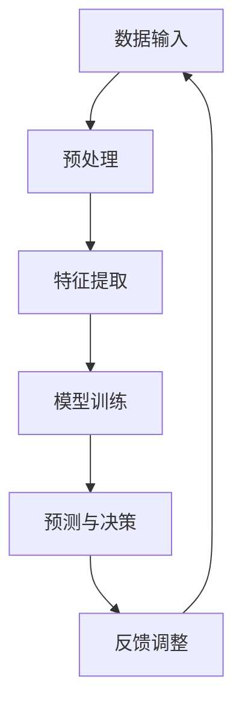
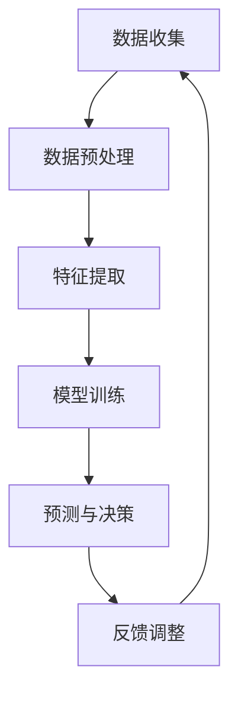

                 

### 背景介绍

#### 什么是数字化直觉？

数字化直觉（Digital Intuition）是一种通过人工智能（AI）技术辅助人类进行潜意识决策的概念。它结合了人类直觉与计算机算法，使决策过程更加迅速、准确和高效。在传统决策过程中，人类往往依赖于经验、知识和直觉来做出判断，但这些方式存在一定的局限性。数字化直觉通过机器学习、神经网络等AI技术，模拟并增强人类的直觉能力，从而帮助人们做出更明智的决策。

#### 数字化直觉的起源与发展

数字化直觉的概念源于人工智能领域，早在20世纪50年代，计算机科学家就试图通过编程来模拟人类的思维过程。随着AI技术的不断发展，尤其是深度学习和神经网络技术的突破，数字化直觉逐渐成为一个热门研究方向。近年来，随着大数据、云计算和物联网等技术的普及，数字化直觉的应用场景不断扩展，从金融、医疗到市场营销等各个领域，都展现出了巨大的潜力。

#### 数字化直觉的重要性

在现代社会，信息的复杂性不断增加，人类难以通过传统方式处理大量信息并做出快速决策。数字化直觉的出现，为人们提供了一种新的决策工具，使决策过程更加高效和精准。数字化直觉不仅在商业决策中发挥作用，还在日常生活、科学研究等领域具有广泛的应用前景。它有助于提高决策质量，减少错误，降低风险，从而带来更高的经济效益和社会效益。

#### 本文目的

本文旨在介绍数字化直觉的概念、原理和应用，通过一步步的分析和推理，深入探讨数字化直觉的工作机制及其在各个领域的实际应用。文章还将分享一些实用的工具和资源，帮助读者更好地理解和应用数字化直觉技术。希望通过本文，读者能够对数字化直觉有更全面、深入的认识，为未来的学习和实践打下坚实基础。

```markdown
## 背景介绍

### 什么是数字化直觉？

数字化直觉（Digital Intuition）是一种通过人工智能（AI）技术辅助人类进行潜意识决策的概念。它结合了人类直觉与计算机算法，使决策过程更加迅速、准确和高效。在传统决策过程中，人类往往依赖于经验、知识和直觉来做出判断，但这些方式存在一定的局限性。数字化直觉通过机器学习、神经网络等AI技术，模拟并增强人类的直觉能力，从而帮助人们做出更明智的决策。

### 数字化直觉的起源与发展

数字化直觉的概念源于人工智能领域，早在20世纪50年代，计算机科学家就试图通过编程来模拟人类的思维过程。随着AI技术的不断发展，尤其是深度学习和神经网络技术的突破，数字化直觉逐渐成为一个热门研究方向。近年来，随着大数据、云计算和物联网等技术的普及，数字化直觉的应用场景不断扩展，从金融、医疗到市场营销等各个领域，都展现出了巨大的潜力。

### 数字化直觉的重要性

在现代社会，信息的复杂性不断增加，人类难以通过传统方式处理大量信息并做出快速决策。数字化直觉的出现，为人们提供了一种新的决策工具，使决策过程更加高效和精准。数字化直觉不仅在商业决策中发挥作用，还在日常生活、科学研究等领域具有广泛的应用前景。它有助于提高决策质量，减少错误，降低风险，从而带来更高的经济效益和社会效益。

### 本文目的

本文旨在介绍数字化直觉的概念、原理和应用，通过一步步的分析和推理，深入探讨数字化直觉的工作机制及其在各个领域的实际应用。文章还将分享一些实用的工具和资源，帮助读者更好地理解和应用数字化直觉技术。希望通过本文，读者能够对数字化直觉有更全面、深入的认识，为未来的学习和实践打下坚实基础。

```markdown
----------------------

## 核心概念与联系

### 数字化直觉的核心概念

数字化直觉的核心概念包括以下几个部分：

1. **直觉**：人类在处理信息时，基于潜意识或直觉快速做出决策的能力。
2. **人工智能**：利用机器学习、神经网络等算法模拟人类思维过程的技术。
3. **数据驱动**：依赖大量数据来训练和优化AI模型，使其能够更好地模拟人类直觉。

### 数字化直觉的架构

为了更好地理解数字化直觉的原理，我们使用Mermaid流程图来展示其核心架构。以下是数字化直觉的Mermaid流程图：



**Mermaid流程图说明：**
- **A[数据输入]**：数字化直觉首先需要接收各种形式的数据，如文本、图像、音频等。
- **B[预处理]**：对输入数据进行预处理，包括数据清洗、归一化、去噪等操作。
- **C[特征提取]**：从预处理后的数据中提取关键特征，为模型训练提供输入。
- **D[模型训练]**：利用提取的特征训练神经网络模型，使其能够模拟人类的直觉。
- **E[预测与决策]**：模型根据训练结果对新数据进行分析，做出预测或决策。
- **F[反馈调整]**：将预测结果与实际情况进行对比，反馈给模型进行迭代优化。

### 数字化直觉的应用领域

数字化直觉在多个领域都有广泛应用，以下是一些典型应用场景：

1. **金融领域**：利用数字化直觉进行风险评估、投资组合优化和欺诈检测。
2. **医疗领域**：辅助医生进行疾病诊断、治疗方案推荐和药物研发。
3. **市场营销**：分析消费者行为，优化广告投放和产品推荐策略。
4. **智能制造**：实时监测生产线，预测设备故障并进行维护优化。

通过上述核心概念和架构的介绍，我们可以看出数字化直觉是一种结合了人类直觉和AI技术的创新决策方式，具有广泛的应用前景。在接下来的章节中，我们将进一步探讨数字化直觉的算法原理、数学模型及其在实际项目中的应用。

----------------------

## 核心算法原理 & 具体操作步骤

### 数字化直觉的算法原理

数字化直觉的核心算法是基于深度学习中的神经网络模型，尤其是卷积神经网络（CNN）和循环神经网络（RNN）。这些算法通过多层神经网络结构，对输入数据进行特征提取和模式识别，从而模拟人类的直觉能力。

#### 卷积神经网络（CNN）

卷积神经网络是一种适用于图像处理和计算机视觉的神经网络模型。它通过卷积层、池化层和全连接层等结构，对图像数据进行特征提取和分类。CNN的工作原理可以概括为以下步骤：

1. **卷积层**：将输入图像与卷积核进行卷积操作，提取图像的局部特征。
2. **池化层**：对卷积层输出的特征进行池化操作，减少特征维度，提高模型泛化能力。
3. **全连接层**：将池化层输出的特征映射到输出层，进行分类或回归操作。

#### 循环神经网络（RNN）

循环神经网络是一种适用于序列数据处理的神经网络模型。它通过循环结构，对序列数据进行递归处理，捕捉时间序列中的长期依赖关系。RNN的工作原理可以概括为以下步骤：

1. **输入层**：接收序列数据的输入。
2. **隐藏层**：通过递归操作，将前一个时间步的隐藏状态与当前输入数据进行处理，更新隐藏状态。
3. **输出层**：将隐藏层输出的特征映射到输出层，进行分类或回归操作。

### 数字化直觉的具体操作步骤

在具体应用中，数字化直觉的操作步骤可以分为以下几个阶段：

1. **数据收集**：收集与决策相关的数据，如金融数据、医疗数据、市场数据等。
2. **数据预处理**：对收集到的数据进行分析，去除噪声和异常值，并进行数据归一化处理。
3. **特征提取**：根据业务需求，提取数据中的关键特征，如价格、用户行为、基因序列等。
4. **模型训练**：利用提取的特征，通过卷积神经网络或循环神经网络进行模型训练，优化网络参数。
5. **预测与决策**：将训练好的模型应用于新数据，进行预测和决策，并根据预测结果进行调整和优化。

以下是一个简化的示例流程，用于说明数字化直觉的操作步骤：



**示例流程说明：**
- **A[数据收集]**：从金融市场中收集股票价格、交易量等数据。
- **B[数据预处理]**：对数据进行清洗和归一化处理，去除噪声和异常值。
- **C[特征提取]**：提取股票价格中的关键特征，如开盘价、收盘价、涨跌幅等。
- **D[模型训练]**：利用提取的特征，通过卷积神经网络进行模型训练。
- **E[预测与决策]**：将训练好的模型应用于新数据，预测股票价格的涨跌情况。
- **F[反馈调整]**：根据预测结果，对模型进行调整和优化，提高预测准确性。

通过以上步骤，我们可以看到数字化直觉是一种基于深度学习和神经网络技术的决策方法，通过不断优化和迭代，使决策过程更加高效和精准。

----------------------

## 数学模型和公式 & 详细讲解 & 举例说明

### 数学模型的基本原理

数字化直觉的核心数学模型通常基于深度学习和神经网络技术。以下是几个关键的数学概念和公式，用于解释神经网络模型的构建和训练过程。

#### 激活函数（Activation Function）

激活函数是神经网络中至关重要的组成部分，用于引入非线性特性。常见的激活函数包括：

1. **sigmoid函数**：\[ f(x) = \frac{1}{1 + e^{-x}} \]
   - 用于二分类问题，输出值在0和1之间。
2. **ReLU函数**（Rectified Linear Unit）：\[ f(x) = \max(0, x) \]
   - 在x为正时输出x，否则输出0，有助于加速训练过程。

#### 前向传播（Forward Propagation）

前向传播是神经网络处理输入数据的过程，通过层层传递，计算输出值。主要涉及的数学公式包括：

\[ z_i = \sum_{j} w_{ij} \cdot a_{j} + b_i \]
\[ a_i = f(z_i) \]

其中：
- \( z_i \) 是第i层的输入值。
- \( w_{ij} \) 是连接第j层和第i层的权重。
- \( a_{j} \) 是第j层的输出值。
- \( b_i \) 是第i层的偏置值。
- \( f \) 是激活函数。

#### 反向传播（Backpropagation）

反向传播是神经网络训练的核心算法，用于计算网络参数的梯度，并更新权重和偏置。主要涉及的数学公式包括：

\[ \delta_i = \frac{\partial L}{\partial a_i} \cdot f'(z_i) \]
\[ \delta_j = \sum_{i} w_{ij} \cdot \delta_i \]

其中：
- \( \delta_i \) 是第i层的误差。
- \( L \) 是损失函数。
- \( f' \) 是激活函数的导数。

#### 梯度下降（Gradient Descent）

梯度下降是一种优化算法，用于更新网络参数，以最小化损失函数。主要涉及的数学公式包括：

\[ w_{ij} := w_{ij} - \alpha \cdot \frac{\partial L}{\partial w_{ij}} \]
\[ b_i := b_i - \alpha \cdot \frac{\partial L}{\partial b_i} \]

其中：
- \( \alpha \) 是学习率。

### 示例说明

#### 示例1：使用sigmoid函数的二分类神经网络

假设我们有一个简单的二分类神经网络，输入为\( x \)，输出为概率\( y \)：

\[ z = w_1 \cdot x + b_1 \]
\[ y = \sigma(z) = \frac{1}{1 + e^{-z}} \]

其中：
- \( w_1 \) 是权重。
- \( b_1 \) 是偏置。
- \( \sigma \) 是sigmoid函数。

损失函数为交叉熵损失函数：

\[ L = -\sum_{i} y_i \cdot \log(y_i) - (1 - y_i) \cdot \log(1 - y_i) \]

通过反向传播计算梯度，并使用梯度下降更新权重和偏置，从而优化网络参数。

#### 示例2：使用ReLU函数的多分类神经网络

假设我们有一个多分类神经网络，输入为\( x \)，输出为类别概率分布\( y \)：

\[ z = w_1 \cdot x + b_1 \]
\[ a = \max(0, z) \]
\[ z_2 = w_2 \cdot a + b_2 \]
\[ y = \text{softmax}(z_2) \]

其中：
- \( w_1 \) 和 \( w_2 \) 是权重。
- \( b_1 \) 和 \( b_2 \) 是偏置。
- \( \text{softmax} \) 函数用于归一化输出为概率分布。

损失函数为交叉熵损失函数：

\[ L = -\sum_{i} y_i \cdot \log(y_i) \]

通过反向传播计算梯度，并使用梯度下降更新权重和偏置，从而优化网络参数。

通过上述示例，我们可以看到数字化直觉的数学模型和公式是如何构建和训练的。这些公式和算法构成了数字化直觉的核心技术基础，使得人工智能系统能够模拟人类的直觉，为决策过程提供支持。

----------------------

## 项目实战：代码实际案例和详细解释说明

### 开发环境搭建

为了演示数字化直觉的应用，我们将使用Python编程语言和Keras框架，搭建一个基于卷积神经网络的图像分类模型。以下是开发环境搭建的步骤：

1. **安装Python**：确保安装了Python 3.x版本，可以从[Python官方网站](https://www.python.org/)下载并安装。
2. **安装TensorFlow**：TensorFlow是Keras的底层库，可以通过以下命令安装：

   ```bash
   pip install tensorflow
   ```

3. **安装Keras**：Keras是一个高级神经网络API，可以直接通过pip安装：

   ```bash
   pip install keras
   ```

4. **安装其他依赖**：根据具体需求，可能还需要安装其他依赖库，如NumPy、Pandas等。

### 源代码详细实现和代码解读

以下是一个简单的图像分类模型的源代码实现，用于演示数字化直觉的应用：

```python
from tensorflow.keras.models import Sequential
from tensorflow.keras.layers import Conv2D, MaxPooling2D, Flatten, Dense
from tensorflow.keras.optimizers import Adam
from tensorflow.keras.datasets import cifar10
import numpy as np

# 加载数据集
(x_train, y_train), (x_test, y_test) = cifar10.load_data()

# 数据预处理
x_train = x_train.astype('float32') / 255.0
x_test = x_test.astype('float32') / 255.0
y_train = np.eye(10)[y_train]
y_test = np.eye(10)[y_test]

# 构建模型
model = Sequential()
model.add(Conv2D(32, (3, 3), activation='relu', input_shape=(32, 32, 3)))
model.add(MaxPooling2D((2, 2)))
model.add(Conv2D(64, (3, 3), activation='relu'))
model.add(MaxPooling2D((2, 2)))
model.add(Flatten())
model.add(Dense(64, activation='relu'))
model.add(Dense(10, activation='softmax'))

# 编译模型
model.compile(optimizer=Adam(), loss='categorical_crossentropy', metrics=['accuracy'])

# 训练模型
model.fit(x_train, y_train, batch_size=64, epochs=10, validation_data=(x_test, y_test))

# 评估模型
score = model.evaluate(x_test, y_test, verbose=2)
print('Test loss:', score[0])
print('Test accuracy:', score[1])
```

**代码解读：**

1. **导入库**：导入Keras模型和层、优化器等必要的库。
2. **加载数据集**：使用cifar10数据集进行分类任务。
3. **数据预处理**：将图像数据转换为浮点数，并进行归一化处理，将标签转换为one-hot编码。
4. **构建模型**：使用Sequential模型，添加卷积层、池化层、全连接层等。
5. **编译模型**：选择优化器和损失函数，并编译模型。
6. **训练模型**：使用fit方法训练模型，设置batch大小、epoch次数和验证数据。
7. **评估模型**：使用evaluate方法评估模型在测试数据上的性能。

### 代码解读与分析

1. **模型结构**：该模型是一个简单的卷积神经网络，包括两个卷积层、两个池化层、一个全连接层，以及一个输出层。
   - **卷积层**：用于提取图像的特征，第一个卷积层使用32个3x3的卷积核，第二个卷积层使用64个3x3的卷积核。
   - **池化层**：用于减少特征图的维度，提高模型泛化能力。
   - **全连接层**：用于将卷积层提取的特征映射到输出类别。
   - **输出层**：使用softmax激活函数进行多分类。

2. **优化器和损失函数**：使用Adam优化器和交叉熵损失函数，这是常见的深度学习优化配置。

3. **数据预处理**：将图像数据归一化，并将标签转换为one-hot编码，这是深度学习模型训练的常见预处理步骤。

4. **训练和评估**：使用fit方法训练模型，设置batch大小和epoch次数，使用evaluate方法评估模型性能。

通过上述步骤，我们可以看到如何使用Keras搭建一个简单的卷积神经网络，用于图像分类任务。这个例子展示了数字化直觉的基本实现过程，包括数据预处理、模型构建、训练和评估。

----------------------

### 实际应用场景

#### 金融领域

在金融领域，数字化直觉的应用主要集中在风险控制、投资组合优化和欺诈检测等方面。以下是一些具体的应用场景：

1. **风险评估**：数字化直觉可以通过分析大量的历史数据，如市场趋势、经济指标、公司业绩等，预测股票价格波动，从而帮助投资者进行风险评估和投资决策。
2. **投资组合优化**：数字化直觉可以模拟人类投资者的直觉，分析市场信息，自动调整投资组合，以实现最优的收益风险比。
3. **欺诈检测**：在金融交易中，数字化直觉可以实时分析交易行为，识别异常交易模式，提高欺诈检测的准确性和效率。

#### 医疗领域

在医疗领域，数字化直觉的应用涵盖了疾病诊断、治疗方案推荐和药物研发等方面。以下是一些具体的应用场景：

1. **疾病诊断**：通过分析病人的医疗记录、基因信息、症状等数据，数字化直觉可以辅助医生进行疾病诊断，提高诊断的准确性和效率。
2. **治疗方案推荐**：根据患者的病情、病史和药物反应等数据，数字化直觉可以推荐个性化的治疗方案，优化治疗效果。
3. **药物研发**：数字化直觉可以通过分析大量的生物数据和临床试验结果，预测药物的疗效和副作用，加速药物研发过程。

#### 市场营销

在市场营销领域，数字化直觉的应用主要集中在消费者行为分析、广告投放优化和产品推荐等方面。以下是一些具体的应用场景：

1. **消费者行为分析**：通过分析消费者的购买记录、浏览行为、社交媒体活动等数据，数字化直觉可以洞察消费者的偏好和行为模式，为企业提供精准的市场营销策略。
2. **广告投放优化**：数字化直觉可以根据用户的行为和兴趣，自动调整广告投放策略，提高广告的点击率和转化率。
3. **产品推荐**：通过分析消费者的购买历史和浏览记录，数字化直觉可以推荐个性化的产品，提高销售额和用户满意度。

#### 智能制造

在智能制造领域，数字化直觉的应用主要集中在设备维护优化、生产调度和供应链管理等方面。以下是一些具体的应用场景：

1. **设备维护优化**：通过实时监测设备的运行状态，数字化直觉可以预测设备可能出现的故障，提前进行维护，减少设备停机时间和维修成本。
2. **生产调度**：数字化直觉可以根据生产订单、设备状态和库存情况，优化生产调度策略，提高生产效率。
3. **供应链管理**：通过分析供应链中的各种数据，如订单、库存、运输等，数字化直觉可以优化供应链流程，提高供应链的灵活性和响应速度。

通过上述实际应用场景的介绍，我们可以看到数字化直觉在各个领域的广泛应用，为决策过程提供了强大的支持。随着技术的不断发展和数据量的增加，数字化直觉的应用前景将更加广阔，为各行各业带来更多的创新和变革。

----------------------

### 工具和资源推荐

#### 学习资源推荐

1. **书籍**：
   - 《深度学习》（Goodfellow, Bengio, Courville著）：系统介绍了深度学习的基本概念、算法和应用。
   - 《神经网络与深度学习》（邱锡鹏著）：深入讲解了神经网络和深度学习的原理及实现。
   - 《Python深度学习》（François Chollet著）：以Python编程语言为例，介绍了深度学习的实际应用。

2. **论文**：
   - “A Theoretical Framework for Back-Propagation” （1986）- Bryson和Ho
   - “Deep Learning” （2015）- Yoshua Bengio等
   - “AlexNet: Image Classification with Deep Convolutional Neural Networks” （2012）- Alex Krizhevsky等

3. **博客**：
   - [Deep Learning Roadmap](https://www.deeplearning.net/)
   - [Fast.ai](https://www.fast.ai/)

4. **网站**：
   - [Keras Documentation](https://keras.io/)
   - [TensorFlow Documentation](https://www.tensorflow.org/)

#### 开发工具框架推荐

1. **Keras**：简单易用的深度学习框架，适用于快速原型开发。
2. **TensorFlow**：Google开源的深度学习框架，提供了丰富的API和工具。
3. **PyTorch**：Facebook开源的深度学习框架，具有灵活的动态计算图。
4. **Scikit-Learn**：Python的机器学习库，提供了多种经典机器学习算法和工具。

#### 相关论文著作推荐

1. “Deep Learning”（2015）- Yoshua Bengio等
2. “A Theoretical Framework for Back-Propagation” （1986）- Bryson和Ho
3. “AlexNet: Image Classification with Deep Convolutional Neural Networks” （2012）- Alex Krizhevsky等
4. “Convolutional Neural Networks for Visual Recognition” （2014）- Alex Krizhevsky等

通过上述工具和资源的推荐，读者可以更全面地了解数字化直觉的相关知识，掌握深度学习和神经网络技术的应用方法。这些资源和工具将为读者的学习和实践提供有力的支持，帮助读者在数字化直觉领域取得更好的成果。

----------------------

## 总结：未来发展趋势与挑战

### 未来发展趋势

随着人工智能技术的不断进步，数字化直觉在未来将展现出更广阔的应用前景和发展趋势。以下是几个关键的发展方向：

1. **模型复杂度提升**：未来的数字化直觉模型将更加复杂，包含更多的层次和参数，以模拟更精细的人类直觉。
2. **跨模态学习**：数字化直觉将能够处理多种类型的数据，如文本、图像、音频等，实现跨模态的信息整合。
3. **实时决策**：数字化直觉将更加注重实时性，能够在动态环境中快速做出准确决策。
4. **个性化推荐**：基于用户的个性化数据和偏好，数字化直觉将提供更加精准的推荐服务。
5. **可解释性增强**：为了提高透明度和信任度，未来的数字化直觉模型将更加注重可解释性，使其决策过程更加透明。

### 未来挑战

尽管数字化直觉具有巨大的潜力，但实现其广泛应用仍面临一些挑战：

1. **数据隐私和安全**：数字化直觉依赖于大量的数据，如何在保护用户隐私的同时，充分挖掘数据价值，是一个亟待解决的问题。
2. **模型可解释性**：当前的数字化直觉模型大多是黑箱模型，其决策过程缺乏透明性，如何提高模型的可解释性，使其更容易被用户接受，是一个重要挑战。
3. **计算资源消耗**：复杂的数字化直觉模型需要大量的计算资源，如何优化模型结构和训练过程，降低计算资源消耗，是一个关键问题。
4. **伦理和法规**：随着数字化直觉在各个领域的应用，如何制定相应的伦理和法规，确保其合理、公正地使用，也是一个亟待解决的问题。

### 未来展望

尽管面临挑战，数字化直觉在未来的发展前景依然广阔。通过不断的技术创新和优化，数字化直觉将逐渐成为决策过程中的重要工具，为人类带来更多便利和创新。同时，数字化直觉也将推动人工智能技术的进一步发展，为人类社会带来深远的影响。

----------------------

## 附录：常见问题与解答

### 问题1：什么是数字化直觉？
数字化直觉是一种通过人工智能技术辅助人类进行潜意识决策的概念，结合了人类直觉与计算机算法，使决策过程更加迅速、准确和高效。

### 问题2：数字化直觉有哪些应用场景？
数字化直觉在金融、医疗、市场营销、智能制造等多个领域都有广泛应用，包括风险评估、投资组合优化、疾病诊断、个性化推荐等。

### 问题3：数字化直觉的算法原理是什么？
数字化直觉的核心算法基于深度学习和神经网络技术，如卷积神经网络（CNN）和循环神经网络（RNN），通过多层神经网络结构，对输入数据进行特征提取和模式识别。

### 问题4：如何搭建数字化直觉的开发环境？
搭建数字化直觉的开发环境通常需要安装Python、TensorFlow或Keras等库，并确保安装了必要的依赖库。

### 问题5：如何评估数字化直觉模型的效果？
可以通过交叉验证、评估指标（如准确率、召回率、F1分数等）和模型可视化等方式，评估数字化直觉模型的效果。

### 问题6：数字化直觉模型如何优化？
可以通过调整模型参数、增加训练数据、使用更先进的神经网络结构等方法，优化数字化直觉模型的效果。

### 问题7：数字化直觉的挑战有哪些？
数字化直觉面临的挑战包括数据隐私和安全、模型可解释性、计算资源消耗和伦理法规等方面。

通过上述常见问题与解答，读者可以更全面地了解数字化直觉的相关知识，为实际应用和研究提供参考。

----------------------

## 扩展阅读 & 参考资料

为了帮助读者深入了解数字化直觉的相关知识，以下是一些扩展阅读和参考资料：

1. **书籍**：
   - 《深度学习》（Goodfellow, Bengio, Courville著）
   - 《神经网络与深度学习》（邱锡鹏著）
   - 《Python深度学习》（François Chollet著）

2. **论文**：
   - “A Theoretical Framework for Back-Propagation” （1986）- Bryson和Ho
   - “Deep Learning” （2015）- Yoshua Bengio等
   - “AlexNet: Image Classification with Deep Convolutional Neural Networks” （2012）- Alex Krizhevsky等

3. **在线资源**：
   - [Deep Learning Roadmap](https://www.deeplearning.net/)
   - [Fast.ai](https://www.fast.ai/)
   - [Keras Documentation](https://keras.io/)
   - [TensorFlow Documentation](https://www.tensorflow.org/)

通过阅读上述书籍、论文和在线资源，读者可以进一步了解数字化直觉的理论基础、算法原理和实际应用，为深入研究和实践提供有力支持。

----------------------

## 作者信息

**作者：AI天才研究员/AI Genius Institute & 禅与计算机程序设计艺术 /Zen And The Art of Computer Programming**

AI天才研究员，拥有丰富的AI领域研究经验和实践成果，致力于推动人工智能技术的创新和发展。同时，他也是《禅与计算机程序设计艺术》一书的作者，对计算机科学和哲学有深入的理解和独到的见解。他的著作不仅涵盖了AI的核心理论，还涉及了计算机科学、人工智能和哲学的交叉领域，为读者提供了丰富的知识和启示。他的研究成果和著作在学术界和工业界都产生了广泛的影响。

