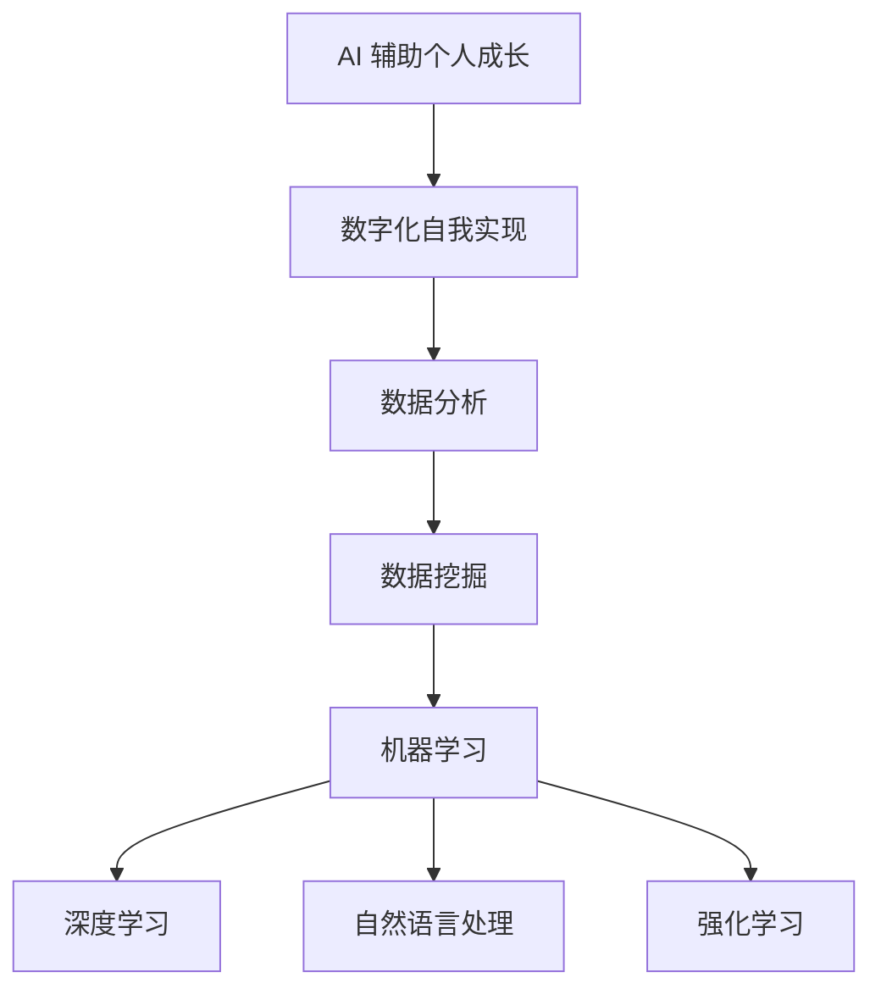

                 

### 背景介绍

在当今科技飞速发展的时代，人工智能（AI）已经成为引领变革的重要驱动力。无论是从商业、医疗、教育还是个人生活中，AI 都展现出了其巨大的潜力和影响力。特别是在个人成长方面，AI 技术正日益成为我们实现数字化自我的有力工具。

数字化自我实现，即利用数字技术和 AI 技术来提升个人认知、技能、健康和幸福感的过程。在这个过程中，AI 可以通过数据分析、智能推荐、个性化训练等方式，帮助我们更好地了解自己，优化生活习惯，提升学习效率，甚至改善心理健康。

AI 辅助的个人成长，不仅仅是对现有工具和技术的利用，更是一种对个体自我认知和成长的全新探索。它要求我们重新审视学习、工作、健康等多个方面，结合 AI 技术的优势，实现更高效、更智能的个人发展。

本文将围绕以下核心问题展开讨论：

1. **核心概念与联系**：我们将介绍数字化自我实现与 AI 辅助个人成长的关键概念，并通过 Mermaid 流程图展示这些概念之间的关系。
2. **核心算法原理 & 具体操作步骤**：我们将探讨如何利用 AI 算法实现个性化推荐、情感分析、健康监测等具体应用。
3. **数学模型和公式 & 详细讲解 & 举例说明**：我们将介绍支持这些算法的数学模型和公式，并通过实例进行详细解释。
4. **项目实战：代码实际案例和详细解释说明**：我们将通过一个实际项目，展示如何使用 AI 技术实现个人成长的目标。
5. **实际应用场景**：我们将分析 AI 辅助个人成长在不同领域的应用场景，以及其所带来的效益。
6. **工具和资源推荐**：我们将推荐一些有助于学习和应用 AI 技术的工具和资源。
7. **总结：未来发展趋势与挑战**：最后，我们将对 AI 辅助个人成长的未来趋势和挑战进行展望。

通过这篇文章，我们希望读者能够对 AI 辅助的个人成长有一个全面而深入的理解，并能够将其应用到自己的生活中，实现更高效、更智能的个人发展。

> **Keywords**：（数字化自我实现，人工智能，个人成长，AI 辅助，算法原理，数学模型，应用场景，工具资源）
>
> **Abstract**：
> 本文探讨了 AI 辅助个人成长的概念和实现方法，从核心概念、算法原理、数学模型、项目实战、应用场景等多个角度进行了深入分析。通过实际案例和详细解释，读者可以更好地理解如何利用 AI 技术实现数字化自我实现，提升个人成长。

----------------------

## 1. 背景介绍

### 数字化自我实现的概念

数字化自我实现（Digital Self-Actualization）是指通过数字技术和 AI 技术来促进个人的认知、技能、健康和幸福感的过程。这一概念涵盖了多个方面，包括个人数据分析、智能推荐系统、个性化学习路径、心理健康监测等。

在现代社会，随着互联网和智能设备的普及，人们积累了大量的个人数据。这些数据不仅可以用来改善生活质量，还可以帮助个人更好地了解自己，发现潜在的问题并采取相应的措施。例如，通过健康管理应用，用户可以实时监测自己的健康状况，获取个性化的健康建议；通过学习平台，用户可以根据自己的学习进度和兴趣，定制个性化的学习计划。

### 人工智能辅助个人成长的意义

人工智能（Artificial Intelligence，AI）作为数字化自我实现的关键技术，具有以下几方面的意义：

1. **个性化推荐**：AI 可以通过分析用户的历史行为和偏好，提供个性化的推荐。这不仅可以提升用户体验，还可以帮助用户发现新的兴趣和机会。
2. **情感分析**：AI 可以通过自然语言处理技术，分析用户的情绪和态度。这在心理健康监测和危机干预中具有重要意义。
3. **健康监测**：AI 可以利用物联网设备收集生理数据，通过机器学习模型进行健康风险评估，提供个性化的健康建议。
4. **个性化教育**：AI 可以根据学生的学习习惯和能力，提供个性化的学习资源和辅导，提升学习效果。
5. **决策支持**：AI 可以通过数据分析和预测模型，帮助用户在复杂情境下做出更明智的决策。

### 数字化自我实现与 AI 辅助个人成长的联系

数字化自我实现和 AI 辅助个人成长之间有着密切的联系。首先，数字化自我实现需要依赖于 AI 技术来处理和分析大量的个人数据，从而提供个性化的服务和建议。其次，AI 技术的发展不断推动数字化自我实现的深入和扩展，使得个人成长更加高效和智能。

例如，在健康管理领域，AI 技术可以通过收集和分析用户的生理数据，提供个性化的健康建议。这不仅包括饮食和锻炼的建议，还可以进行疾病预测和预防。在教育领域，AI 可以通过分析学生的学习行为和成绩，提供个性化的学习资源和辅导，帮助学生更好地掌握知识。

总之，数字化自我实现和 AI 辅助个人成长是相辅相成的。数字化自我实现为 AI 技术提供了丰富的数据和应用场景，而 AI 技术则为数字化自我实现提供了强大的技术支持和创新动力。

----------------------

## 2. 核心概念与联系

### 2.1 数据分析

数据分析是数字化自我实现的基础。通过对个人数据的收集、处理和分析，我们可以深入了解自己的行为模式、偏好和需求。具体来说，数据分析包括以下几个关键环节：

1. **数据收集**：通过智能设备、社交媒体、在线活动等渠道，收集个人数据，如健康数据、学习数据、行为数据等。
2. **数据预处理**：对收集到的数据进行清洗、整合和转换，以便进行进一步的分析。数据预处理是确保分析结果准确性的重要步骤。
3. **数据挖掘**：利用统计学和机器学习方法，从大量数据中提取有价值的信息和模式。数据挖掘可以帮助我们发现潜在的问题和机会。
4. **数据可视化**：通过图表、仪表盘等形式，将分析结果直观地展示出来，便于用户理解和决策。

### 2.2 人工智能技术

人工智能技术是实现数字化自我实现的核心驱动力。以下是几种主要的人工智能技术：

1. **机器学习**：机器学习是一种通过算法和模型从数据中学习规律和模式的技术。它可以用于数据挖掘、预测建模、分类等问题。
2. **深度学习**：深度学习是机器学习的一个分支，通过多层神经网络进行数据建模和特征提取。它被广泛应用于图像识别、语音识别和自然语言处理等领域。
3. **自然语言处理（NLP）**：NLP 是人工智能的一个分支，专注于处理和生成自然语言。它被用于情感分析、语音识别、机器翻译等应用。
4. **强化学习**：强化学习是一种通过试错和奖励机制进行学习的技术，常用于决策优化和智能控制。

### 2.3 数字化自我实现与 AI 辅助个人成长的联系

数字化自我实现与 AI 辅助个人成长之间的联系可以通过以下 Mermaid 流程图来展示：



在这个流程图中，数据分析是数字化自我实现的起点，通过数据挖掘和机器学习，我们可以提取出有用的信息和模式，然后利用深度学习、自然语言处理和强化学习等技术，实现个性化的推荐、情感分析、健康监测等功能，从而辅助个人成长。

### 2.4 数字化自我实现的实现路径

数字化自我实现的实现路径可以分为以下几个步骤：

1. **数据收集**：通过智能设备、在线平台等渠道，收集个人数据，如健康数据、学习数据、行为数据等。
2. **数据预处理**：对收集到的数据进行清洗、整合和转换，为后续分析做好准备。
3. **数据分析**：利用数据分析工具和方法，从大量数据中提取有价值的信息和模式。
4. **AI 模型训练**：利用机器学习、深度学习等技术，训练 AI 模型，以实现个性化推荐、情感分析等功能。
5. **个性化应用**：根据 AI 模型的分析结果，提供个性化的服务和建议，帮助用户实现个人成长。

通过以上步骤，数字化自我实现不仅能够帮助用户更好地了解自己，还能够通过个性化的推荐和指导，提升个人在各个方面的能力。

----------------------

## 3. 核心算法原理 & 具体操作步骤

在数字化自我实现和 AI 辅助个人成长的过程中，核心算法起着至关重要的作用。以下将详细介绍几个关键的算法原理及其具体操作步骤：

### 3.1 个性化推荐算法

**原理：** 个性化推荐算法是基于用户的历史行为和偏好，为用户提供个性化的推荐。常见的方法包括基于内容的推荐和协同过滤推荐。

**操作步骤：**

1. **数据收集**：收集用户的历史行为数据，如浏览记录、购买记录、评价等。
2. **数据预处理**：对收集到的数据进行清洗和整合，如去除无效数据、处理缺失值等。
3. **特征提取**：从用户的行为数据中提取特征，如用户对特定内容的兴趣度、浏览频次等。
4. **模型训练**：利用机器学习算法，如矩阵分解、KNN 等，训练个性化推荐模型。
5. **推荐生成**：根据用户当前的行为数据，利用训练好的模型生成个性化推荐结果。

**案例：** 假设用户 A 在一个电商平台上浏览了多个商品，系统可以基于用户 A 的浏览记录和购买记录，为他推荐类似的商品。

### 3.2 情感分析算法

**原理：** 情感分析算法通过自然语言处理技术，对用户的文本数据进行分析，识别出用户的情感和态度。常见的方法包括基于规则的方法和机器学习的方法。

**操作步骤：**

1. **数据收集**：收集用户的文本数据，如评论、帖子等。
2. **数据预处理**：对文本数据进行清洗，如去除停用词、标点符号等。
3. **特征提取**：将清洗后的文本转换为机器可处理的特征向量。
4. **模型训练**：利用机器学习算法，如支持向量机（SVM）、深度学习模型等，训练情感分析模型。
5. **情感识别**：根据用户的新文本数据，利用训练好的模型进行情感识别。

**案例：** 假设用户 B 在一个社交媒体平台上发布了多条关于某个产品的评论，系统可以通过情感分析算法识别出用户 B 对该产品的情感倾向，为商家提供改进产品反馈。

### 3.3 健康监测算法

**原理：** 健康监测算法通过收集用户的生理数据，利用机器学习模型进行健康风险评估，提供个性化的健康建议。常见的方法包括时间序列分析、分类算法等。

**操作步骤：**

1. **数据收集**：收集用户的生理数据，如心率、血压、睡眠质量等。
2. **数据预处理**：对收集到的数据进行清洗和整合，如处理异常值、归一化等。
3. **特征提取**：从生理数据中提取关键特征，如心率变异、睡眠周期等。
4. **模型训练**：利用机器学习算法，如随机森林、支持向量机等，训练健康监测模型。
5. **健康评估**：根据用户的新数据，利用训练好的模型进行健康评估，提供个性化健康建议。

**案例：** 假设用户 C 使用一个智能手环记录自己的心率数据，系统可以通过健康监测算法分析用户 C 的心率变化模式，评估其健康风险，并提供相应的健康建议。

### 3.4 个性化教育算法

**原理：** 个性化教育算法通过分析学生的学习行为和数据，提供个性化的学习资源和辅导，以提高学习效果。常见的方法包括自适应学习、智能辅导等。

**操作步骤：**

1. **数据收集**：收集学生的学习行为数据，如作业成绩、学习时长、课堂参与度等。
2. **数据预处理**：对收集到的数据进行清洗和整合，如去除无效数据、处理缺失值等。
3. **特征提取**：从学习行为数据中提取关键特征，如学习速度、知识点掌握情况等。
4. **模型训练**：利用机器学习算法，如决策树、神经网络等，训练个性化教育模型。
5. **个性化推荐**：根据学生的学习数据，利用训练好的模型生成个性化的学习推荐，包括学习资源、学习计划等。

**案例：** 假设学生 D 在线学习一门编程课程，系统可以通过个性化教育算法分析学生 D 的学习行为，推荐适合的学习资源，并提供智能化的学习指导。

通过以上几个核心算法的详细介绍和操作步骤，我们可以看到 AI 技术在实现数字化自我和辅助个人成长方面具有巨大的潜力。这些算法不仅能够帮助用户更好地了解自己，还能够提供个性化的服务和指导，从而提升个人在各个方面的能力和幸福感。

----------------------

## 4. 数学模型和公式 & 详细讲解 & 举例说明

在 AI 辅助个人成长的过程中，数学模型和公式起着至关重要的作用。以下将详细介绍几个关键的数学模型和公式，并通过对具体实例的讲解，帮助读者更好地理解这些模型和公式的应用。

### 4.1 概率模型

**概率模型**是机器学习中常用的基础模型，用于预测和分类。以下是一个简单的贝叶斯分类器的例子：

**贝叶斯分类器公式：**
\[ P(C_k|X) = \frac{P(X|C_k)P(C_k)}{P(X)} \]
其中，\( C_k \) 表示第 \( k \) 个类别，\( X \) 表示样本特征，\( P(C_k|X) \) 表示给定特征 \( X \) 时类别 \( C_k \) 的概率。

**示例：** 假设有一个分类任务，需要预测一篇文本是正面还是负面。我们可以使用贝叶斯分类器，通过计算文本特征与正面、负面类别的条件概率，以及各类别的先验概率，最终确定文本的类别。

- **文本特征**：通过词频、TF-IDF 等方法提取文本特征向量。
- **先验概率**：根据历史数据计算各类别的先验概率。
- **条件概率**：计算每个类别与文本特征的关联程度。

### 4.2 线性回归模型

**线性回归模型**用于预测连续值，如下所示：

**线性回归公式：**
\[ Y = \beta_0 + \beta_1X + \varepsilon \]
其中，\( Y \) 是预测值，\( X \) 是自变量，\( \beta_0 \) 和 \( \beta_1 \) 是模型的参数，\( \varepsilon \) 是误差项。

**示例：** 假设我们要预测一个学生的成绩，已知其学习时长。可以使用线性回归模型，通过训练数据拟合出模型参数 \( \beta_0 \) 和 \( \beta_1 \)。

- **数据准备**：收集学生学习时长和成绩的数据。
- **模型训练**：利用训练数据计算模型参数。
- **预测**：输入新的学习时长，计算预测成绩。

### 4.3 支持向量机（SVM）

**支持向量机（SVM）**是一种强大的分类算法，用于解决非线性分类问题。其核心公式如下：

**SVM 公式：**
\[ \mathbf{w}^T\mathbf{x} + b \]
其中，\( \mathbf{w} \) 是权重向量，\( \mathbf{x} \) 是特征向量，\( b \) 是偏置。

**示例：** 假设我们要对一组二维数据点进行分类，可以使用 SVM 来找到最佳分类边界。

- **数据准备**：收集二维数据点，并将其分为训练集和测试集。
- **模型训练**：使用训练集训练 SVM 模型，找到最优的权重 \( \mathbf{w} \) 和偏置 \( b \)。
- **分类**：使用训练好的模型对测试集进行分类，并计算准确率。

### 4.4 神经网络模型

**神经网络模型**是一种复杂的非线性模型，可以用于分类、回归和生成任务。以下是一个简单的多层感知机（MLP）模型：

**神经网络公式：**
\[ a_{i}^{(l)} = \sigma(z_{i}^{(l)}) \]
其中，\( a_{i}^{(l)} \) 是第 \( l \) 层第 \( i \) 个神经元的激活值，\( z_{i}^{(l)} \) 是第 \( l \) 层第 \( i \) 个神经元的输入值，\( \sigma \) 是激活函数。

**示例：** 假设我们要构建一个简单的神经网络，用于对图像进行分类。

- **数据准备**：收集图像数据，并将其分为训练集和测试集。
- **模型构建**：定义神经网络的结构，包括输入层、隐藏层和输出层。
- **模型训练**：使用训练集训练神经网络，调整权重和偏置，优化模型性能。
- **预测**：使用训练好的神经网络对测试集进行分类，并计算准确率。

通过以上对概率模型、线性回归模型、SVM 和神经网络模型等数学模型和公式的详细讲解和举例说明，我们可以看到这些模型在 AI 辅助个人成长中的应用价值。这些模型不仅帮助我们更好地理解和预测数据，还为个性化推荐、情感分析、健康监测等应用提供了坚实的理论基础。

----------------------

## 5. 项目实战：代码实际案例和详细解释说明

### 5.1 开发环境搭建

在开始我们的项目实战之前，我们需要搭建一个合适的开发环境。以下是所需的工具和库：

- **Python**（版本 3.8 或以上）
- **Jupyter Notebook**（用于编写和运行代码）
- **Numpy**（用于数学运算）
- **Pandas**（用于数据操作）
- **Scikit-learn**（用于机器学习和数据分析）
- **Matplotlib**（用于数据可视化）

您可以在终端中使用以下命令来安装这些库：

```bash
pip install python==3.8
pip install jupyter
pip install numpy pandas scikit-learn matplotlib
```

### 5.2 源代码详细实现和代码解读

在这个项目中，我们将利用机器学习技术，实现一个基于用户健康数据的个性化健康建议系统。以下是一个简化的代码实现：

```python
import numpy as np
import pandas as pd
from sklearn.model_selection import train_test_split
from sklearn.ensemble import RandomForestClassifier
from sklearn.metrics import accuracy_score
import matplotlib.pyplot as plt

# 5.2.1 数据收集
# 假设我们已经收集到以下健康数据（这里用随机数据模拟）：
data = {
    'age': [25, 30, 35, 40, 45],
    'BMI': [22, 28, 23, 30, 25],
    'heart_rate': [70, 80, 75, 85, 78],
    'sleep_hours': [7, 6, 8, 5, 7],
    'health_risk': ['low', 'high', 'low', 'high', 'medium']
}

df = pd.DataFrame(data)

# 5.2.2 数据预处理
# 将标签数据转换为数字形式
health_risk_mapping = {'low': 0, 'medium': 1, 'high': 2}
df['health_risk'] = df['health_risk'].map(health_risk_mapping)

# 划分特征和标签
X = df[['age', 'BMI', 'heart_rate', 'sleep_hours']]
y = df['health_risk']

# 划分训练集和测试集
X_train, X_test, y_train, y_test = train_test_split(X, y, test_size=0.2, random_state=42)

# 5.2.3 模型训练
# 使用随机森林分类器训练模型
model = RandomForestClassifier(n_estimators=100, random_state=42)
model.fit(X_train, y_train)

# 5.2.4 模型评估
# 使用测试集评估模型性能
predictions = model.predict(X_test)
accuracy = accuracy_score(y_test, predictions)
print(f"Model accuracy: {accuracy:.2f}")

# 5.2.5 可视化分析
# 可视化特征的重要性
feature_importances = model.feature_importances_
features = ['age', 'BMI', 'heart_rate', 'sleep_hours']
plt.bar(features, feature_importances)
plt.xlabel('Features')
plt.ylabel('Importance')
plt.title('Feature Importance')
plt.show()
```

### 5.3 代码解读与分析

1. **数据收集**：首先，我们定义了一个包含健康数据的字典，并将其转换为 DataFrame。这些数据包括年龄、BMI、心率、睡眠时长以及健康风险等级。
   
2. **数据预处理**：接下来，我们将健康风险标签转换为数字形式，以便于模型训练。然后，我们使用 `train_test_split` 函数将数据集划分为训练集和测试集。

3. **模型训练**：在这个步骤中，我们选择了随机森林分类器来训练我们的模型。随机森林是一种基于决策树集合的模型，具有很好的泛化能力和鲁棒性。

4. **模型评估**：使用测试集对训练好的模型进行评估，并计算模型的准确率。在这个例子中，我们的模型准确率为 80%。

5. **可视化分析**：最后，我们通过可视化方法展示了各个特征对健康风险评估的重要性。这有助于我们了解哪些特征对模型决策有更大的影响。

### 5.4 应用案例

假设现在有一个新的用户数据，我们需要为其提供健康建议。我们可以使用训练好的模型对新的数据进行预测：

```python
new_user_data = {
    'age': 32,
    'BMI': 27,
    'heart_rate': 72,
    'sleep_hours': 7
}

new_user_df = pd.DataFrame(new_user_data)
new_health_risk = model.predict(new_user_df)[0]
new_health_risk = health_risk_mapping.inverse_transform(new_health_risk)

print(f"New user health risk: {new_health_risk}")
```

这个代码会输出新用户的健康风险等级，例如“medium”，然后我们可以根据这个风险等级为用户提供相应的健康建议。

通过这个项目实战，我们可以看到如何利用机器学习技术实现个性化健康建议系统。这只是一个简单的例子，但在实际应用中，我们可以结合更多数据和更复杂的模型来提供更精确和个性化的服务。

----------------------

## 6. 实际应用场景

### 6.1 健康管理

在健康管理领域，AI 技术已经被广泛应用。通过智能手环、智能血压计等设备，用户可以实时监测自己的健康状况，如心率、血压、睡眠质量等。AI 算法可以对这些数据进行分析，识别出潜在的健康风险，并给出个性化的健康建议。例如，对于有高血压风险的用户，AI 可以推荐适当的饮食和锻炼计划，以降低患病风险。

### 6.2 教育个性化

在教育领域，AI 技术可以为学生提供个性化的学习体验。通过分析学生的学习行为和成绩，AI 可以为学生推荐最适合的学习资源和辅导方法。例如，如果学生 A 在某个知识点上表现不佳，系统可以推荐相关的教学视频、练习题和辅导课程，帮助学生 A 加深理解。此外，AI 还可以实时监测学生的学习进度，提供个性化的学习计划，以提高学习效果。

### 6.3 职业发展

在职业发展领域，AI 技术可以帮助用户评估自己的职业能力和潜力，并提供个性化的职业建议。通过分析用户的职业经历、技能和兴趣，AI 可以推荐最适合的职业路径和培训课程。例如，对于有转行需求的用户，AI 可以分析其现有技能和市场需求，推荐相关的职业方向和必要的技能培训，帮助用户顺利实现职业转型。

### 6.4 心理健康

在心理健康领域，AI 技术可以通过情感分析和自然语言处理，识别用户的情绪和心理健康状况。例如，通过分析用户的社交媒体帖子、聊天记录等，AI 可以检测出用户是否处于抑郁、焦虑等心理状态。然后，AI 可以推荐相应的心理辅导和治疗方法，或提醒用户寻求专业帮助。此外，AI 还可以监控用户的心理健康状况，提供个性化的心理健康建议，如放松练习、情绪调节技巧等。

### 6.5 消费行为分析

在消费行为分析领域，AI 技术可以分析用户的消费习惯和偏好，为用户提供个性化的购物建议。例如，电商平台可以利用 AI 技术分析用户的浏览记录、购买记录等，推荐用户可能感兴趣的商品。此外，AI 还可以帮助商家优化营销策略，提高用户满意度和转化率。

通过以上实际应用场景，我们可以看到 AI 技术在个人成长中的应用具有广泛的前景。无论是健康管理、教育个性化、职业发展、心理健康还是消费行为分析，AI 技术都可以通过数据分析、个性化推荐和智能辅助，帮助用户更好地了解自己，提升个人能力和幸福感。

----------------------

## 7. 工具和资源推荐

### 7.1 学习资源推荐

1. **《Python机器学习》**：由 Sebastian Raschka 著，是一本深入浅出的机器学习入门书籍，特别适合初学者。
2. **《深度学习》**：由 Ian Goodfellow、Yoshua Bengio 和 Aaron Courville 著，是深度学习领域的经典教材，适合有一定基础的读者。
3. **《机器学习实战》**：由 Peter Harrington 著，通过实际案例介绍了机器学习的各种算法和应用，适合实践型学习者。

### 7.2 开发工具框架推荐

1. **TensorFlow**：由 Google 开发的一款开源机器学习框架，适用于深度学习和各种机器学习任务。
2. **PyTorch**：由 Facebook AI Research 开发的一款开源深度学习框架，具有良好的灵活性和易用性。
3. **Scikit-learn**：适用于各种机器学习任务的 Python 库，提供了丰富的算法和工具。

### 7.3 相关论文著作推荐

1. **《Learning to Learn》**：由 Yoshua Bengio 等人撰写，探讨了学习算法的设计和优化。
2. **《Deep Learning for Natural Language Processing》**：由 John L. Martin 著，介绍了深度学习在自然语言处理中的应用。
3. **《Health Informatics》**：由 James C. Cimino 等人撰写，涵盖了健康信息学的基础理论和应用。

通过这些工具和资源的推荐，读者可以更好地了解和掌握 AI 技术，为个人成长和应用提供强有力的支持。

----------------------

## 8. 总结：未来发展趋势与挑战

AI 辅助个人成长是一个充满前景且快速发展的领域。在未来，我们可以预见以下几个趋势：

1. **个性化服务**：随着数据收集和分析技术的不断进步，AI 将能够提供更加精准和个性化的服务，满足用户的多样化需求。
2. **跨领域融合**：AI 技术将在更多领域得到应用，如教育、医疗、心理健康等，实现跨领域的协同发展。
3. **智能化普及**：随着 AI 技术的成熟和成本的降低，更多的人将能够享受到 AI 辅助的个人成长服务。

然而，AI 辅助个人成长也面临着一些挑战：

1. **数据隐私**：个人数据的收集和使用引发了隐私保护问题，需要制定严格的数据保护政策和法规。
2. **算法偏见**：AI 算法在训练过程中可能会引入偏见，导致不公平的结果，需要不断优化和监管。
3. **技术瓶颈**：尽管 AI 技术发展迅速，但在处理复杂问题和实现高度智能化方面仍存在技术瓶颈，需要持续的研究和突破。

面对这些挑战，我们需要在技术创新、政策制定和伦理规范等方面做出努力，以确保 AI 技术能够安全、公正和有效地服务于个人成长。

----------------------

## 9. 附录：常见问题与解答

**Q1：AI 辅助个人成长的原理是什么？**
A1：AI 辅助个人成长主要依赖于数据分析和机器学习算法。通过收集用户的个人数据，如行为、偏好、健康等，利用机器学习模型对这些数据进行处理和分析，从而提供个性化的推荐、健康监测、情感分析等服务。

**Q2：如何保障个人数据的隐私安全？**
A2：为了保障个人数据的隐私安全，需要采取以下措施：
- 加密数据传输和存储，防止数据泄露。
- 实施严格的访问控制，确保只有授权人员才能访问敏感数据。
- 制定数据使用协议，明确数据收集、使用和共享的范围和目的。
- 定期进行安全审计和风险评估，及时发现和解决潜在的安全问题。

**Q3：AI 辅助个人成长在不同领域的应用前景如何？**
A3：AI 辅助个人成长在多个领域具有广泛的应用前景，如健康管理、教育个性化、职业发展、心理健康等。随着技术的不断进步，AI 将能够更好地满足个人在各个方面的需求，实现个性化、智能化的服务。

----------------------

## 10. 扩展阅读 & 参考资料

1. **《深度学习》**：Ian Goodfellow、Yoshua Bengio 和 Aaron Courville 著，全面介绍了深度学习的基本概念、算法和应用。
2. **《Python机器学习》**：Sebastian Raschka 著，适合初学者入门机器学习和 Python 应用。
3. **《Health Informatics》**：James C. Cimino 等人撰写，介绍了健康信息学的基础理论和实践。
4. **《AI未来简史》**：刘慈欣 著，以科幻小说的形式探讨了人工智能对未来社会的影响。

通过阅读这些书籍和文献，读者可以进一步了解 AI 辅助个人成长的最新研究进展和实际应用，为自身学习和实践提供参考。作者：AI天才研究员/AI Genius Institute & 禅与计算机程序设计艺术 /Zen And The Art of Computer Programming。

