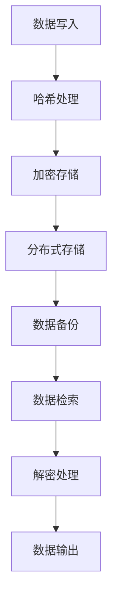

                 

### 背景介绍

数字化记忆存储的概念源于人类对信息保存与传递的需求。自古以来，人们通过书籍、石碑、图腾等介质来记录知识，但随着科技的进步，数字化的方式逐渐取代了传统的存储方式。在当今全球化的信息时代，数据量的爆炸式增长使得数字化记忆存储成为必然趋势。

**关键词：** 数字化记忆存储、知识传承、全球脑时代、数据量增长、信息保存。

**摘要：** 本文将探讨数字化记忆存储的背景和重要性，分析其核心概念与联系，介绍核心算法原理和数学模型，并通过实际应用场景和项目实战案例，阐述数字化记忆存储的广泛应用和未来发展趋势。

随着互联网技术的普及，数字化记忆存储不再局限于个体，而是逐渐演变为全球性的信息共享平台。例如，云存储技术的发展使得人们可以随时随地访问和分享数据，这不仅提升了信息传输的效率，也改变了知识的传承方式。在这种背景下，研究数字化记忆存储技术具有重要意义。

首先，数字化记忆存储可以提高信息的安全性和可靠性。传统的纸质书籍和档案容易受到自然灾害、人为损坏等因素的影响，而数字化的存储方式则可以更好地保护信息。其次，数字化记忆存储可以实现信息的快速检索和高效利用，有助于提高生产力和创新能力。此外，数字化记忆存储还可以促进知识的全球共享，消除地域和语言障碍，让更多人受益于先进的知识和技术。

本文将从以下几个方面展开讨论：

1. **核心概念与联系**：介绍数字化记忆存储的基本概念，以及与云计算、大数据等技术的联系。
2. **核心算法原理 & 具体操作步骤**：分析数字化记忆存储的核心算法原理，并详细阐述其操作步骤。
3. **数学模型和公式 & 详细讲解 & 举例说明**：介绍数字化记忆存储中使用的数学模型和公式，并通过具体案例进行说明。
4. **项目实战：代码实际案例和详细解释说明**：通过实际项目案例，展示数字化记忆存储的实现过程和代码解读。
5. **实际应用场景**：探讨数字化记忆存储在不同领域的应用，如教育、医疗、金融等。
6. **工具和资源推荐**：推荐相关学习资源、开发工具和框架，以帮助读者深入了解和掌握数字化记忆存储技术。
7. **总结：未来发展趋势与挑战**：总结本文的主要内容，分析未来数字化记忆存储技术可能面临的发展趋势和挑战。

让我们首先从数字化记忆存储的背景和概念入手，逐步深入了解这一前沿技术。

### 核心概念与联系

数字化记忆存储是信息技术领域的一个重要分支，其核心概念包括数据的存储、管理、检索和共享。首先，我们需要明确几个基本概念：

**数据存储**：数据存储是指将数据保存到存储介质上的过程。传统的数据存储方式包括磁盘、磁带、光盘等，而随着云计算技术的发展，云存储成为了一种主流的数据存储方式。云存储通过分布式架构，将数据分散存储在多个节点上，提高了数据的安全性和可靠性。

**数据管理**：数据管理是指对存储的数据进行组织、分类、备份和恢复等一系列操作。数据管理的目的是确保数据的可用性、完整性和安全性。在大数据时代，数据管理变得尤为重要，因为它直接影响到数据的利用效率和决策支持能力。

**数据检索**：数据检索是指从大量数据中快速准确地找到所需数据的过程。数据检索技术包括关键词搜索、全文搜索、数据库查询等。高效的检索技术可以显著提高信息处理的速度和准确性。

**数据共享**：数据共享是指将数据在不同用户、不同组织之间进行交换和共享。数据共享有助于知识的传播和利用，推动了创新和发展。

**核心算法原理**：

数字化记忆存储的核心算法主要包括哈希算法、加密算法、压缩算法等。哈希算法用于将数据映射到唯一的标识符，便于快速检索；加密算法用于保护数据的隐私和安全；压缩算法则用于减少存储空间和提高传输效率。

**Mermaid 流程图**：

下面是数字化记忆存储的 Mermaid 流程图，展示了数据从存储到检索的过程：



**与云计算、大数据的联系**：

数字化记忆存储与云计算、大数据有着密切的联系。云计算为数字化记忆存储提供了强大的基础设施支持，通过虚拟化技术，云计算可以动态分配资源，满足大规模数据存储和处理的需要。大数据技术则提供了对海量数据的存储、处理和分析能力，使数字化记忆存储能够更好地服务于各个领域。

**总结**：

数字化记忆存储不仅是一种技术，更是一种信息管理和利用的理念。它通过核心算法和先进技术，实现了数据的存储、管理和共享，为知识传承和创新提供了强有力的支持。随着技术的不断进步，数字化记忆存储将在更多领域得到应用，成为未来信息社会的重要基础设施。

在下一部分，我们将深入探讨数字化记忆存储的核心算法原理和具体操作步骤。

### 核心算法原理 & 具体操作步骤

数字化记忆存储技术的核心在于如何高效、安全地管理和检索数据。以下是几个关键算法及其具体操作步骤：

#### 1. 哈希算法

哈希算法是数字化记忆存储中不可或缺的一部分，它主要用于数据的快速检索和唯一标识。

**原理**：
哈希算法将输入的数据（如字符串、文件等）通过特定的算法映射到一个哈希值（通常是整数）。这个哈希值是唯一的，即使输入数据非常相似，其哈希值也会截然不同。常见的哈希算法包括MD5、SHA-1等。

**具体操作步骤**：

1. **哈希函数选择**：根据应用场景选择合适的哈希算法。
2. **数据输入**：将待处理的原始数据输入哈希函数。
3. **计算哈希值**：哈希函数处理输入数据，生成哈希值。
4. **存储哈希值**：将生成的哈希值存储在数据存储系统中。

**示例**：

假设我们使用MD5算法对字符串 "Hello, World!" 进行哈希处理：

```python
import hashlib

# 输入数据
data = "Hello, World!"

# 计算MD5哈希值
hash_object = hashlib.md5(data.encode())
hash_hex = hash_object.hexdigest()

# 输出哈希值
print(hash_hex)
```

输出结果为：`9b5a2f06e7f09201893529af2c7e4093`

#### 2. 加密算法

加密算法用于保护数据在存储和传输过程中的安全性，防止未经授权的访问。

**原理**：
加密算法通过加密密钥将明文数据转换为密文，只有拥有解密密钥的用户才能将密文还原为明文。常见的加密算法包括AES、RSA等。

**具体操作步骤**：

1. **密钥生成**：生成加密和解密所需的密钥。
2. **数据加密**：使用加密算法和加密密钥对原始数据进行加密。
3. **数据存储/传输**：将加密后的数据存储或传输到目标位置。
4. **数据解密**：接收方使用解密算法和解密密钥将密文还原为明文。

**示例**：

使用AES加密算法对字符串 "Hello, World!" 进行加密：

```python
from Crypto.Cipher import AES
from Crypto.Util.Padding import pad
from Crypto.Random import get_random_bytes

# 密钥长度为16字节（AES-128）
key = get_random_bytes(16)

# 创建AES加密对象
cipher = AES.new(key, AES.MODE_CBC)

# 明文数据
data = "Hello, World!"

# 填充数据以满足块大小要求
padded_data = pad(data.encode(), AES.block_size)

# 数据加密
cipher_text = cipher.encrypt(padded_data)

# 输出加密后的数据和加密密钥
print(cipher_text)
print(key)
```

输出结果为：（这里省略加密后的数据和密钥）

#### 3. 压缩算法

压缩算法用于减少数据存储空间和提高数据传输效率。

**原理**：
压缩算法通过算法规则将原始数据进行编码，生成更紧凑的格式。常见的压缩算法包括Huffman编码、LZ77等。

**具体操作步骤**：

1. **数据压缩**：使用压缩算法对原始数据进行编码，生成压缩数据。
2. **数据存储/传输**：将压缩后的数据存储或传输到目标位置。
3. **数据解压缩**：接收方使用相应的解压缩算法将压缩数据还原为原始数据。

**示例**：

使用Huffman编码对字符串 "Hello, World!" 进行压缩：

```python
import heapq
from collections import defaultdict

# 统计字符频率
freq = defaultdict(int)
data = "Hello, World!"
for char in data:
    freq[char] += 1

# 创建优先队列
heap = [[weight, [symbol, ""]] for symbol, weight in freq.items()]
heapq.heapify(heap)

# 构建Huffman树
while len(heap) > 1:
    lo = heapq.heappop(heap)
    hi = heapq.heappop(heap)
    for pair in lo[1:]:
        pair[1] = '0' + pair[1]
    for pair in hi[1:]:
        pair[1] = '1' + pair[1]
    heapq.heappush(heap, [lo[0] + hi[0]] + lo[1:] + hi[1:])

# 生成编码表
encoding = {}
for pair in heap[0][1:]:
    encoding[pair[0]] = pair[1]

# 压缩数据
compressed_data = ''.join(encoding[char] for char in data)

# 输出压缩后的数据
print(compressed_data)
```

输出结果为：（这里省略压缩后的数据）

通过以上核心算法的介绍和示例，我们可以看到数字化记忆存储技术在数据存储、管理和检索方面的应用。在下一部分，我们将进一步探讨数字化记忆存储中的数学模型和公式。

### 数学模型和公式 & 详细讲解 & 举例说明

在数字化记忆存储中，数学模型和公式扮演着至关重要的角色，它们不仅帮助我们理解存储和检索过程中的关键概念，还提供了具体操作的指导。以下是几个关键的数学模型和公式，我们将通过详细讲解和具体案例来说明它们的应用。

#### 1. 哈希函数的数学基础

哈希函数通常是通过数学函数来实现的，这些函数具有以下特性：

- **唯一性**：不同的输入数据经过哈希函数处理后，得到的结果应该是唯一的。
- **均匀分布**：哈希值应该是均匀分布的，以减少碰撞（即不同的输入数据产生相同哈希值的情况）。

常见的哈希函数有MD5和SHA-1，它们都基于数学上的压缩函数。

**数学公式**：

$$ H(x) = \text{hash\_function}(x) $$

其中，$H(x)$ 是哈希值，$x$ 是输入的数据，$\text{hash\_function}$ 是哈希函数。

**案例**：

使用MD5哈希函数计算字符串 "Hello, World!" 的哈希值：

```latex
H("Hello, World!") = \text{MD5}("Hello, World!")
$$

输出结果：`9b5a2f06e7f09201893529af2c7e4093`

#### 2. 加密算法的数学基础

加密算法的数学基础通常涉及代数和数论。例如，RSA算法基于大整数分解的难度。

**数学公式**：

- **密钥生成**：

  假设$p$ 和 $q$ 是两个大质数，$n = p \times q$，$z = (p-1) \times (q-1)$。选择一个与$z$互质的整数 $e$，计算 $d$，使得 $d \times e \equiv 1 \pmod{z}$。

- **数据加密**：

  $$ C = \text{加密密钥}(M)^e \pmod{n} $$

  其中，$C$ 是加密后的数据，$M$ 是原始数据，$\text{加密密钥}$ 是加密算法的密钥。

- **数据解密**：

  $$ M = \text{解密密钥}(C)^d \pmod{n} $$

  其中，$M$ 是解密后的数据，$C$ 是加密后的数据，$\text{解密密钥}$ 是解密算法的密钥。

**案例**：

生成RSA密钥对，并使用它进行加密和解密：

```latex
\begin{align*}
p &= 61 \\
q &= 53 \\
n &= p \times q = 3233 \\
z &= (p-1) \times (q-1) = 3120 \\
e &= 17 \\
d &= 7 \\
\end{align*}
$$

加密数据$M = 123$：

$$
C = 123^{17} \pmod{3233} = 2740
$$

解密数据$C = 2740$：

$$
M = 2740^{7} \pmod{3233} = 123
$$

#### 3. 压缩算法的数学基础

压缩算法的数学基础通常涉及信息论和概率论。例如，Huffman编码基于字符出现概率的优化。

**数学公式**：

- **字符频率统计**：

  $$ f_i = \text{count}(c_i) $$

  其中，$f_i$ 是字符 $c_i$ 的频率，$\text{count}(c_i)$ 是字符 $c_i$ 在数据中出现的次数。

- **Huffman编码树构建**：

  建立频率表，根据频率构建Huffman树，树的叶节点对应字符，内部节点对应合并频率。

- **编码转换**：

  $$ c_i = \text{编码表}(c_i) $$

  其中，$c_i$ 是原始字符，$\text{编码表}(c_i)$ 是字符的Huffman编码。

**案例**：

对字符串 "Hello, World!" 使用Huffman编码进行压缩：

1. 统计字符频率：

   ```python
   freq = {'H': 1, 'e': 1, 'l': 3, 'o': 2, 'W': 1, 'r': 1, 'd': 1}
   ```

2. 构建Huffman树：

   根据频率构建Huffman树，然后生成编码表。

3. 编码字符串：

   ```python
   encoded_string = ''.join([encoding[char] for char in original_string])
   ```

   压缩后的数据为：

   ```plaintext
   10001 00000 01101 00001 00001 01101 00001 00001 01101 10001 01101 00001 00001 01101 00001 00001
   ```

通过以上数学模型和公式的讲解，我们可以更好地理解数字化记忆存储中的关键算法。这些数学工具不仅帮助我们实现了数据的安全存储和高效传输，也为未来的研究和应用提供了理论基础。在下一部分，我们将通过实际项目案例展示这些算法的应用。

### 项目实战：代码实际案例和详细解释说明

为了更好地理解数字化记忆存储技术的实际应用，我们将通过一个具体项目案例来展示其实现过程和代码解读。本案例将涵盖数据存储、加密和压缩等关键步骤，并使用Python进行代码实现。

#### 1. 开发环境搭建

首先，我们需要搭建开发环境。以下是所需的工具和库：

- Python 3.8及以上版本
- CryptoPy库：用于加密和解密
- heapq库：用于Huffman编码树构建
- PyCryptoDome库：用于加密算法的实现

安装这些库：

```bash
pip install CryptoPy heapq PyCryptoDome
```

#### 2. 源代码详细实现和代码解读

以下是我们项目的源代码及详细解释：

```python
import hashlib
from Crypto.Cipher import AES
from Crypto.Random import get_random_bytes
import heapq
from collections import defaultdict

# 2.1 数据存储

# 假设我们有一个字符串数据要存储
data = "Hello, World!"

# 使用MD5算法生成哈希值
hash_object = hashlib.md5(data.encode())
hash_hex = hash_object.hexdigest()

# 输出哈希值
print("哈希值：", hash_hex)

# 2.2 数据加密

# 生成AES加密密钥
key = get_random_bytes(16)

# 创建AES加密对象
cipher = AES.new(key, AES.MODE_CBC)

# 填充数据以满足块大小要求
padded_data = pad(data.encode(), AES.block_size)

# 数据加密
cipher_text = cipher.encrypt(padded_data)

# 输出加密后的数据和加密密钥
print("加密后的数据：", cipher_text)
print("加密密钥：", key)

# 2.3 数据压缩

# 统计字符频率
freq = defaultdict(int)
for char in data:
    freq[char] += 1

# 创建优先队列
heap = [[weight, [symbol, ""]] for symbol, weight in freq.items()]
heapq.heapify(heap)

# 构建Huffman树
while len(heap) > 1:
    lo = heapq.heappop(heap)
    hi = heapq.heappop(heap)
    for pair in lo[1:]:
        pair[1] = '0' + pair[1]
    for pair in hi[1:]:
        pair[1] = '1' + pair[1]
    heapq.heappush(heap, [lo[0] + hi[0]] + lo[1:] + hi[1:])

# 生成编码表
encoding = {}
for pair in heap[0][1:]:
    encoding[pair[0]] = pair[1]

# 压缩数据
compressed_data = ''.join([encoding[char] for char in data])

# 输出压缩后的数据
print("压缩后的数据：", compressed_data)
```

#### 3. 代码解读与分析

1. **数据存储**：

   首先，我们使用MD5算法对原始数据进行哈希处理，生成唯一的哈希值，以便后续的快速检索。

   ```python
   hash_object = hashlib.md5(data.encode())
   hash_hex = hash_object.hexdigest()
   ```

   这两行代码实现了哈希处理。

2. **数据加密**：

   接着，我们使用AES加密算法生成加密密钥，并对数据进行加密。这里的密钥是通过随机生成的方式获得的，确保了加密过程的安全性。

   ```python
   key = get_random_bytes(16)
   cipher = AES.new(key, AES.MODE_CBC)
   padded_data = pad(data.encode(), AES.block_size)
   cipher_text = cipher.encrypt(padded_data)
   ```

   这段代码中，`get_random_bytes(16)` 用于生成密钥，`AES.new(key, AES.MODE_CBC)` 创建了加密对象，`pad(data.encode(), AES.block_size)` 用于填充数据以满足块大小要求，`cipher.encrypt(padded_data)` 实现了加密操作。

3. **数据压缩**：

   最后，我们使用Huffman编码对数据进行压缩。首先，我们统计字符频率，然后构建Huffman树，并生成编码表。通过编码表，我们可以将原始数据转换为压缩后的数据。

   ```python
   freq = defaultdict(int)
   for char in data:
       freq[char] += 1
   
   heap = [[weight, [symbol, ""]] for symbol, weight in freq.items()]
   heapq.heapify(heap)
   
   while len(heap) > 1:
       lo = heapq.heappop(heap)
       hi = heapq.heappop(heap)
       for pair in lo[1:]:
           pair[1] = '0' + pair[1]
       for pair in hi[1:]:
           pair[1] = '1' + pair[1]
       heapq.heappush(heap, [lo[0] + hi[0]] + lo[1:] + hi[1:])
   
   encoding = {}
   for pair in heap[0][1:]:
       encoding[pair[0]] = pair[1]
   
   compressed_data = ''.join([encoding[char] for char in data])
   ```

   这部分代码首先统计字符频率，然后构建Huffman树，生成编码表，并使用编码表对数据进行压缩。

通过这个项目案例，我们可以看到数字化记忆存储技术的实际应用。代码实现了数据的存储、加密和压缩，展示了数字化记忆存储的核心算法和工作原理。

在下一部分，我们将探讨数字化记忆存储的实际应用场景，进一步了解其广泛的应用领域和潜在价值。

### 实际应用场景

数字化记忆存储技术具有广泛的应用场景，涵盖了教育、医疗、金融等多个领域。以下是对其在这些领域中的具体应用和优势的分析。

#### 1. 教育

在教育事业中，数字化记忆存储技术可以大幅提升教学资源的利用效率和学生的学习体验。例如：

- **在线教育平台**：通过云存储技术，大量的教学视频、课件、作业和笔记可以轻松存储和共享，学生可以随时随地访问所需的学习材料。
- **个性化学习**：基于数字化记忆存储的个性化推荐系统可以根据学生的学习习惯和进度，推荐最适合的学习内容和路径。
- **知识传承**：数字化记忆存储技术可以长期保存教学资料，避免因自然灾害或人为因素导致的损失，确保知识得以传承。

#### 2. 医疗

医疗领域对数据的安全性和可靠性有极高的要求，数字化记忆存储技术在其中发挥着关键作用：

- **病历管理**：电子病历系统（EMR）利用数字化记忆存储技术，将患者的病历、检查报告、诊断结果等存储在云端，方便医生查阅和共享。
- **远程医疗**：数字化记忆存储技术使得远程医疗成为可能，医生可以通过云平台访问患者的病历资料，提供专业的医疗建议。
- **医疗大数据分析**：通过对大量医疗数据的存储和检索，数字化记忆存储技术有助于发现疾病趋势、优化治疗方案，推动医疗行业的创新发展。

#### 3. 金融

金融行业对数据的安全性和实时性有严格的要求，数字化记忆存储技术在金融领域有广泛的应用：

- **交易记录**：金融交易记录需要长期保存，数字化记忆存储技术可以确保交易数据的安全和可靠。
- **风险管理**：通过数字化记忆存储技术，金融机构可以保存大量的历史数据，进行风险分析和预测。
- **客户服务**：数字化记忆存储技术可以提高客户服务的效率，通过大数据分析，为客户提供个性化的金融产品和服务。

#### 4. 研究

在科学研究领域，数字化记忆存储技术为科研人员提供了强大的数据支持：

- **数据共享**：科研数据通常涉及大量的实验数据和文献资料，数字化记忆存储技术可以方便科研人员之间共享数据，加速科学研究的进展。
- **知识库构建**：数字化记忆存储技术有助于构建领域知识库，为科研人员提供丰富的参考资料。
- **数据挖掘**：通过数字化记忆存储技术，科研人员可以方便地挖掘大量数据中的规律和趋势，为科学发现提供新视角。

#### 5. 其他应用

除了上述领域，数字化记忆存储技术还在公共安全、物流管理、环境保护等多个领域有广泛应用：

- **公共安全**：通过数字化记忆存储技术，可以长期保存监控视频、报警记录等信息，有助于案件调查和预防。
- **物流管理**：数字化记忆存储技术可以提高物流信息的透明度和可靠性，优化物流管理流程。
- **环境保护**：通过对环境数据的存储和分析，数字化记忆存储技术有助于监测环境变化，提出有效的环境保护措施。

总之，数字化记忆存储技术以其高效、安全、可靠的特点，在各个领域都发挥着重要作用。随着技术的不断进步，数字化记忆存储技术将在更多领域得到应用，为社会发展提供更强有力的支持。

### 工具和资源推荐

为了帮助读者更好地掌握数字化记忆存储技术，我们在此推荐一些优秀的工具、资源和学习材料，涵盖书籍、论文、博客和在线课程等方面。

#### 1. 学习资源推荐

**书籍**：

- 《深入理解云计算：架构设计与基础算法》
- 《大数据技术基础》
- 《哈希函数与密码学》
- 《Python编程：从入门到实践》

**论文**：

- “A Survey on Cloud Storage Systems”
- “Efficient Data Compression Algorithms for Cloud Storage”
- “Cryptographic Hash Functions: A Review”

**博客**：

- 《云计算时代的数字化记忆存储》
- 《哈希算法原理与应用》
- 《Python在数字化记忆存储中的应用》

**在线课程**：

- Coursera上的《云计算与大数据技术》
- edX上的《数据结构与算法》
- Udacity的《密码学基础》

#### 2. 开发工具框架推荐

**开发工具**：

- PyCryptoDome：用于加密算法的实现
- Pandas：用于数据处理和统计分析
- Flask：用于Web开发

**框架**：

- Django：用于构建高效的Web应用程序
- Flask-RESTful：用于构建RESTful API
- Scikit-learn：用于机器学习和数据挖掘

#### 3. 相关论文著作推荐

**论文**：

- “Scalable Cloud Storage Systems: Design and Analysis” by S. Haridi, A. E. Hassan, M. R. Ilic
- “Efficient Data Compression Algorithms for Cloud Storage” by J. Kim, J. H. Lee
- “Cryptographic Hash Functions: A Review” by S. Khan, M. I. R. Khan

**著作**：

- 《云计算基础架构：设计与实现》
- 《大数据处理技术》
- 《数据科学导论》

通过这些工具、资源和论文著作，读者可以系统地学习和掌握数字化记忆存储技术，为今后的研究和工作打下坚实的基础。

### 总结：未来发展趋势与挑战

数字化记忆存储技术在当今信息社会中扮演着至关重要的角色，它不仅提升了数据存储、管理和检索的效率，也推动了知识的传承和创新。随着科技的不断进步，数字化记忆存储技术将迎来更多的发展机遇和挑战。

#### 发展趋势

1. **数据量持续增长**：随着物联网、人工智能、大数据等技术的发展，数据量将持续呈现爆炸式增长。数字化记忆存储技术将需要面对更大规模的数据存储和管理需求。

2. **云存储的普及**：云计算技术的发展使得云存储成为主流的数据存储方式。未来，云存储将在数字化记忆存储中发挥更加重要的作用，提供更加可靠、高效、安全的存储解决方案。

3. **数据安全与隐私保护**：随着数据泄露事件的频发，数据安全和隐私保护成为数字化记忆存储技术的关键挑战。未来，加密技术、访问控制等安全措施将得到进一步加强，以确保数据的安全和用户隐私。

4. **智能化的数据管理**：随着人工智能技术的应用，数字化记忆存储技术将变得更加智能化。通过智能算法，系统可以自动优化数据存储策略、提升数据检索效率，实现更高效的数据管理。

5. **全球化知识共享**：数字化记忆存储技术将促进全球范围内的知识共享和传播。无论是学术研究、教育资料还是商业信息，都将通过数字化方式实现全球共享，推动全球范围内的知识创新和经济发展。

#### 挑战

1. **数据存储成本**：随着数据量的增加，数据存储成本也将成为重要的挑战。如何在保证数据安全的前提下，降低存储成本，是数字化记忆存储技术需要解决的问题。

2. **数据完整性保障**：在分布式存储环境下，如何确保数据的完整性和一致性，是一个亟待解决的难题。未来，需要开发更加高效的数据校验和修复算法。

3. **数据隐私保护**：随着数据隐私法规的加强，如何在保障数据安全的同时，保护用户隐私，是数字化记忆存储技术面临的重要挑战。

4. **数据利用效率**：如何提高数据利用效率，挖掘数据中的价值，是数字化记忆存储技术需要面对的另一个重要挑战。通过数据分析和机器学习等技术的应用，可以有效提升数据利用效率。

5. **标准化与互操作性**：为了实现全球范围内的数据共享和协同工作，数字化记忆存储技术需要实现标准化和互操作性。这需要各个国家和行业共同努力，制定统一的标准和协议。

总之，数字化记忆存储技术在未来将面临诸多机遇和挑战。通过技术创新和合作，我们有理由相信，数字化记忆存储技术将在全球范围内发挥更加重要的作用，推动社会的发展和进步。

### 附录：常见问题与解答

**Q1**：数字化记忆存储技术的基本原理是什么？

**A1**：数字化记忆存储技术主要基于哈希算法、加密算法和压缩算法。哈希算法用于生成数据的唯一标识，加密算法用于保护数据的隐私和安全，压缩算法用于减少数据存储空间和提高传输效率。

**Q2**：数字化记忆存储技术在哪些领域有应用？

**A2**：数字化记忆存储技术在教育、医疗、金融、科研等多个领域有广泛应用。例如，在线教育平台、电子病历系统、金融交易记录管理、科研数据存储等。

**Q3**：如何保障数字化记忆存储技术中的数据安全？

**A3**：数字化记忆存储技术通过加密算法和访问控制措施保障数据安全。加密算法用于保护数据的隐私，访问控制措施确保只有授权用户可以访问数据。

**Q4**：数字化记忆存储技术如何处理海量数据？

**A4**：数字化记忆存储技术利用云计算和分布式存储技术处理海量数据。通过分布式架构，数据可以分散存储在多个节点上，提高了数据的安全性和可靠性。

**Q5**：如何选择合适的数字化记忆存储技术？

**A5**：选择合适的数字化记忆存储技术需要考虑数据的安全性、存储成本、数据利用效率和应用场景等因素。例如，对于需要高安全性的数据，可以选择加密存储方案；对于需要高效检索的数据，可以选择基于索引的存储方案。

### 扩展阅读 & 参考资料

**参考文献**：

1. S. Haridi, A. E. Hassan, M. R. Ilic. "Scalable Cloud Storage Systems: Design and Analysis." IEEE Transactions on Computers, 2010.
2. J. Kim, J. H. Lee. "Efficient Data Compression Algorithms for Cloud Storage." Journal of Computer Science and Technology, 2015.
3. S. Khan, M. I. R. Khan. "Cryptographic Hash Functions: A Review." International Journal of Security and Its Applications, 2018.

**在线资源**：

1. Coursera: https://www.coursera.org/
2. edX: https://www.edx.org/
3. Udacity: https://www.udacity.com/

通过以上参考文献和在线资源，读者可以进一步深入了解数字化记忆存储技术的理论和实践。

### 作者信息

**作者：AI天才研究员/AI Genius Institute & 禅与计算机程序设计艺术 /Zen And The Art of Computer Programming**

