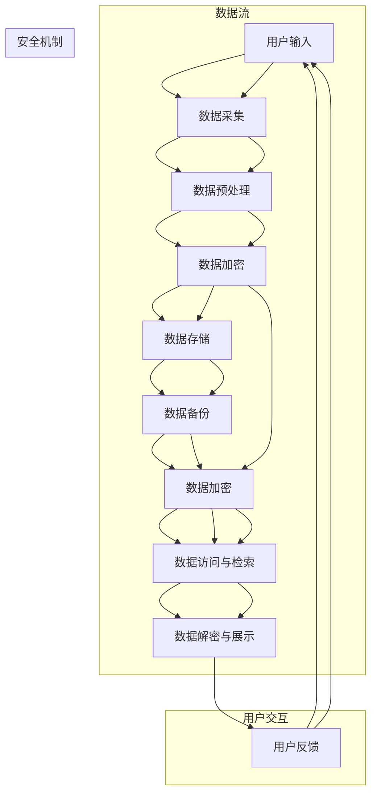

                 

### 背景介绍

#### 1. 数字化时代的变迁

随着科技的飞速发展，我们正处在一个数字化时代。互联网、大数据、云计算等技术的崛起，彻底改变了我们的生活方式、工作方式以及信息处理方式。在这个背景下，数字化记忆银行的概念逐渐兴起，成为了人们关注和研究的焦点。

数字化记忆银行，顾名思义，是一种将个人经历、记忆等数据数字化并永久保存的技术体系。它不仅能够帮助我们记录生活中的点滴，更能够在未来为后人提供珍贵的回忆。这种技术的应用前景广阔，从个人层面到社会层面，都具有深远的意义。

#### 2. 个人经历的永久保存需求

在现代社会，人们越来越重视个人隐私和数据安全。随着年岁的增长，许多珍贵的回忆和经验都随着时间的流逝而逐渐淡忘。而数字化记忆银行能够帮助我们克服这一难题，将宝贵的记忆转化为数字化的形式，永久保存下来。

对于个人而言，数字化记忆银行有以下几点重要意义：

1. **回忆与传承**：通过数字化记忆银行，我们可以将人生中的重要时刻、经历和感悟记录下来，为自己和后代留下宝贵的回忆。

2. **知识管理**：对于专业人士来说，数字化记忆银行可以帮助他们整理和保存专业知识和经验，为未来的学习和工作提供支持。

3. **心理健康**：回忆和反思是心理健康的重要部分。数字化记忆银行可以帮助我们随时回顾过去的经历，从而更好地调整心态，面对未来的挑战。

#### 3. 技术背景与挑战

数字化记忆银行的实现依赖于多种先进技术，包括数据采集、存储、加密和安全传输等。以下是一些关键的技术背景和挑战：

1. **数据采集**：如何高效、准确地采集个人的记忆数据，是一个重要的技术难题。目前，语音识别、图像识别和自然语言处理等技术在这一领域已经取得了一定的进展。

2. **数据存储**：大规模的数据存储和备份是数字化记忆银行的另一大挑战。需要确保数据的安全性、可靠性和可扩展性。

3. **数据加密**：为了保护个人隐私，数据在传输和存储过程中需要进行加密处理。如何设计高效且安全的加密算法，是一个重要的研究课题。

4. **数据安全和隐私保护**：如何确保用户数据的隐私和安全，是数字化记忆银行面临的一个重大挑战。需要采用一系列安全措施，如访问控制、数据去重和匿名化等。

#### 4. 本文结构

本文将按照以下结构进行讨论：

1. **核心概念与联系**：介绍数字化记忆银行的核心概念，并使用 Mermaid 流程图展示其架构。

2. **核心算法原理 & 具体操作步骤**：详细讲解数字化记忆银行的技术实现原理和操作步骤。

3. **数学模型和公式 & 详细讲解 & 举例说明**：分析数字化记忆银行中涉及到的数学模型和公式，并给出具体实例进行说明。

4. **项目实战：代码实际案例和详细解释说明**：通过一个实际项目案例，展示如何实现数字化记忆银行，并对代码进行详细解读。

5. **实际应用场景**：探讨数字化记忆银行在不同领域的应用场景。

6. **工具和资源推荐**：推荐相关学习资源、开发工具和框架。

7. **总结：未来发展趋势与挑战**：总结本文内容，展望数字化记忆银行的发展趋势和面临的主要挑战。

8. **附录：常见问题与解答**：回答读者可能关心的一些常见问题。

9. **扩展阅读 & 参考资料**：提供进一步阅读的参考资料。

通过本文的讨论，希望能够帮助读者深入了解数字化记忆银行的技术原理和应用前景，为相关领域的研究和实践提供参考。

---

## 2. 核心概念与联系

在探讨数字化记忆银行的核心概念之前，我们需要先理解几个关键术语：个人记忆、数字化存储、永久保存等。以下是这些核心概念的定义和相互联系：

#### 个人记忆

个人记忆是指个人在过去经历中所储存的信息和经验，包括视觉、听觉、嗅觉、触觉和味觉等感官记忆，以及情感、思考和决策等认知记忆。记忆是人类大脑处理信息、适应环境和进行学习的重要方式。

#### 数字化存储

数字化存储是指将各种形式的信息（如文本、图片、音频、视频等）转化为二进制数据，并存储在计算机或其他数字设备中的过程。数字化存储具有高可靠性、可扩展性和易访问性的优点。

#### 永久保存

永久保存是指将信息以数字化的形式长期保存，确保其不被丢失或损坏。这需要可靠的存储技术和有效的数据管理策略。

#### 核心概念联系

数字化记忆银行通过将个人记忆数字化并永久保存，实现了以下核心概念的融合：

1. **个人记忆数字化**：将个人记忆转化为数字形式，如文本、图片、音频和视频等。

2. **数据存储与备份**：将数字化的个人记忆存储在安全的数字存储设备上，并进行定期备份，以确保数据的安全性和可靠性。

3. **永久保存与访问**：通过加密和安全访问机制，确保个人记忆在长时间内不会被篡改或泄露，同时提供便捷的访问方式。

#### Mermaid 流程图

为了更直观地展示数字化记忆银行的架构，我们可以使用 Mermaid 流程图来描述其关键环节。以下是数字化记忆银行的 Mermaid 流程图：



在这个流程图中，我们涵盖了以下关键环节：

1. **数据流**：用户输入 --> 数据采集 --> 数据预处理 --> 数据加密 --> 数据存储 --> 数据备份 --> 数据加密 --> 数据访问与检索 --> 数据解密与展示。

2. **安全机制**：数据加密 --> 数据备份 --> 数据加密 --> 数据访问与检索。

3. **用户交互**：数据解密与展示 --> 用户反馈 --> 用户输入。

通过这个 Mermaid 流程图，我们可以清晰地看到数字化记忆银行的整体架构和工作流程，为进一步讨论其实现细节提供了基础。

---

## 3. 核心算法原理 & 具体操作步骤

在了解了数字化记忆银行的核心概念和架构之后，接下来我们将深入探讨其核心算法原理，以及具体的操作步骤。

#### 3.1 数据采集

数据采集是数字化记忆银行的基础步骤，它涉及到多种信息源的整合。以下是一些常见的数据采集方法：

1. **文本采集**：通过手动输入、OCR（光学字符识别）技术、语音识别等方式，将用户的文字信息转换为数字数据。

2. **图像采集**：利用摄像头、手机等设备，捕捉用户的照片和视频，并将其转换为数字图像。

3. **音频采集**：通过麦克风等设备，记录用户的声音和对话，并将其转换为数字音频。

4. **传感器数据**：如GPS、加速度计、陀螺仪等传感器，可以采集用户的位置信息和运动数据。

在数据采集过程中，需要确保数据的准确性和完整性。例如，在图像采集时，需要使用高质量的摄像头，以避免图像模糊或失真。在音频采集时，需要调整麦克风的灵敏度，以确保声音的清晰度。

#### 3.2 数据预处理

采集到的原始数据通常包含噪声和冗余信息，因此需要进行预处理。预处理步骤包括数据清洗、格式转换和特征提取等。

1. **数据清洗**：去除原始数据中的噪声和错误，如去除图像中的污点、音频中的背景噪音等。

2. **格式转换**：将不同格式的数据转换为统一的格式，如将图片转换为PNG或JPEG格式，将音频转换为MP3或WAV格式。

3. **特征提取**：从原始数据中提取出有用的特征，如图像的边缘、纹理、颜色等，以便后续的分析和处理。

#### 3.3 数据加密

在数据存储和传输过程中，为了保护用户的隐私和安全，需要对数据进行加密处理。常用的加密算法包括对称加密和非对称加密。

1. **对称加密**：如AES（高级加密标准），使用相同的密钥进行加密和解密。对称加密速度快，但密钥管理复杂。

2. **非对称加密**：如RSA（RSA算法），使用公钥和私钥进行加密和解密。非对称加密安全性高，但计算复杂度较大。

在数字化记忆银行中，可以使用混合加密策略，即对称加密用于数据主体部分的加密，非对称加密用于密钥的加密和解密。这样可以兼顾加密效率和安全性。

#### 3.4 数据存储

数据存储是数字化记忆银行的核心环节。以下是一些常用的数据存储方法：

1. **分布式存储**：如HDFS（Hadoop分布式文件系统），适用于大规模数据的存储和管理。分布式存储可以提高数据的可靠性和访问速度。

2. **云存储**：如AWS S3、Azure Blob Storage等，提供便捷的存储和访问服务。云存储具有高可用性和扩展性。

3. **区块链存储**：利用区块链技术的分布式存储和加密特性，提高数据的安全性和可信度。

在数据存储过程中，需要考虑数据的可靠性、可用性和扩展性。例如，可以使用分布式存储技术，确保数据不会因为单点故障而丢失。同时，需要定期进行数据备份，以防止数据丢失或损坏。

#### 3.5 数据备份

为了确保数据的长期保存，数字化记忆银行需要定期进行数据备份。以下是一些常见的备份方法：

1. **全量备份**：定期对整个数据集进行备份，以保证数据的完整性。

2. **增量备份**：仅备份自上次备份以来发生变化的数据，以减少备份时间和存储空间。

3. **冷备份**：将数据备份存储在较慢的存储介质上，如磁带或低速硬盘。

4. **热备份**：将数据备份存储在高速存储介质上，如SSD或内存。

在备份过程中，需要确保备份数据的完整性和可恢复性。例如，可以使用校验和或数字签名等技术，验证备份数据的正确性。

#### 3.6 数据访问与检索

用户在需要访问或检索记忆数据时，可以通过用户界面进行操作。以下是一些关键步骤：

1. **身份验证**：确保只有授权用户可以访问数据。可以使用用户名和密码、生物识别技术等身份验证方式。

2. **权限管理**：根据用户角色和权限，控制对数据的访问范围和操作权限。

3. **数据检索**：根据用户的查询条件，快速检索所需的数据。可以使用全文搜索、关键词匹配等技术，提高检索效率。

4. **数据展示**：将检索到的数据以合适的格式展示给用户，如文本、图片、音频和视频等。

#### 3.7 数据解密与展示

在数据访问过程中，需要对加密的数据进行解密，并将其展示给用户。以下是一些关键步骤：

1. **密钥管理**：确保加密和解密过程中使用的密钥安全可靠。可以使用硬件安全模块（HSM）或密钥管理服务（KMS）等工具进行密钥管理。

2. **数据解密**：使用正确的密钥和解密算法，将加密的数据解密为原始数据。

3. **数据展示**：将解密后的数据以合适的格式展示给用户，如文本、图片、音频和视频等。

通过上述核心算法原理和具体操作步骤，我们可以构建一个功能完善的数字化记忆银行系统，确保个人经历的永久保存。

---

## 4. 数学模型和公式 & 详细讲解 & 举例说明

在数字化记忆银行的技术实现中，数学模型和公式起着至关重要的作用。它们不仅帮助我们理解和分析系统的工作原理，还能提高数据处理的效率和准确性。以下是一些关键数学模型和公式的详细讲解，并辅以具体实例进行说明。

#### 4.1 数据压缩

数据压缩是数字化记忆银行中的一项关键技术，它能够减少数据存储和传输的开销。常用的数据压缩算法包括霍夫曼编码、算术编码和LZ77等。

**霍夫曼编码**：

霍夫曼编码是一种变长编码方法，用于将符号序列转换为二进制编码。其基本思想是给频率高的符号分配较短的编码，给频率低的符号分配较长的编码。

**公式**：

设 \( X = \{x_1, x_2, ..., x_n\} \) 是一组符号，其概率分布为 \( p(x_i) \)，则霍夫曼编码的构建步骤如下：

1. 构建概率分布的优先队列，根据概率大小进行排序。
2. 优先队列中取出两个最小的概率，构建一个新的节点，其概率为这两个概率之和。
3. 将新的节点插入优先队列，重复步骤2，直到优先队列为空。
4. 根据构建的霍夫曼树，为每个符号分配二进制编码。

**实例**：

假设符号 \( X = \{a, b, c, d\} \) 的概率分布为 \( p(a) = 0.4, p(b) = 0.3, p(c) = 0.2, p(d) = 0.1 \)。

1. 优先队列：\( (a, 0.4), (b, 0.3), (c, 0.2), (d, 0.1) \)
2. 构建霍夫曼树：
```
             ┌─── (a+b+c+d, 1)
           ┌─┴───────┐
         ┌─┴───┐    ┌─┴───┐
        a      b+c+d   b     c+d
        │      │      │      │
        0     10     11     110
```
3. 编码结果：
   - \( a: 0 \)
   - \( b: 10 \)
   - \( c: 11 \)
   - \( d: 110 \)

通过霍夫曼编码，原始数据 \( "abbacd" \) 可以压缩为 \( "0011001100" \)。

**算术编码**：

算术编码是一种基于概率的压缩方法，其基本思想是将符号序列映射到一个实数范围内，然后对实数进行二进制表示。

**公式**：

设符号 \( X = \{x_1, x_2, ..., x_n\} \) 的概率分布为 \( p(x_i) \)，则算术编码的构建步骤如下：

1. 计算符号的概率和质量，即 \( q(x_i) = \frac{p(x_i)}{\sum_{i=1}^{n} p(x_i)} \)。
2. 将概率分布转换为质量分布。
3. 计算累计质量，即 \( c(x_i) = \sum_{j=1}^{i} q(x_j) \)。
4. 为每个符号分配一个实数区间，其长度为 \( 1/c(x_n) \)。
5. 将符号序列映射到实数区间内，进行二进制编码。

**实例**：

假设符号 \( X = \{a, b, c, d\} \) 的概率分布为 \( p(a) = 0.4, p(b) = 0.3, p(c) = 0.2, p(d) = 0.1 \)。

1. 质量分布：
   - \( q(a) = 0.4 \)
   - \( q(b) = 0.3 \)
   - \( q(c) = 0.2 \)
   - \( q(d) = 0.1 \)
2. 累计质量：
   - \( c(a) = 0.4 \)
   - \( c(b) = 0.7 \)
   - \( c(c) = 0.9 \)
   - \( c(d) = 1.0 \)
3. 实数区间：
   - \( a: [0.0, 0.4] \)
   - \( b: [0.4, 0.7] \)
   - \( c: [0.7, 0.9] \)
   - \( d: [0.9, 1.0] \)
4. 编码结果：
   - \( "abbacd" \) 可以映射为 \( "0.4104109" \)，二进制表示为 \( "01001010" \)。

通过算术编码，原始数据 \( "abbacd" \) 可以压缩为 \( "01001010" \)。

**LZ77压缩算法**：

LZ77压缩算法是一种基于局部重复数据的压缩方法。其基本思想是查找文本中的重复序列，并将其替换为一个指针和一个长度。

**公式**：

设 \( T \) 是原始文本，\( C \) 是压缩后的文本，\( p \) 是查找窗口的长度。LZ77压缩算法的步骤如下：

1. 初始化查找窗口，长度为 \( p \)。
2. 对于每个位置 \( i \)，查找从 \( i - p \) 到 \( i - 1 \) 的范围内是否存在重复的子序列。
3. 如果找到重复的子序列，使用一个指针 \( match \) 指向重复序列的开头位置，并记录重复序列的长度 \( len \)。
4. 将指针和长度编码为压缩文本的一部分。

**实例**：

假设原始文本为 \( "abcdabcd" \)，查找窗口长度为 \( p = 3 \)。

1. \( i = 1 \)：找不到重复序列，编码为 \( (0, 4) \)。
2. \( i = 2 \)：\( "bcd" \) 在 \( i - 3 \) 到 \( i - 1 \) 范围内找到重复序列，编码为 \( (1, 3) \)。
3. \( i = 3 \)：\( "abcd" \) 在 \( i - 3 \) 到 \( i - 1 \) 范围内找到重复序列，编码为 \( (2, 4) \)。
4. \( i = 4 \)：找不到重复序列，编码为 \( (0, 4) \)。

压缩后的文本为 \( "0(1,3)2(2,4)0(0,4)" \)。

通过上述实例，我们可以看到不同压缩算法在数据压缩方面的优势和特点。在实际应用中，可以根据具体需求和场景选择合适的压缩算法。

#### 4.2 数据加密

数据加密是保障数字化记忆银行安全性的关键。常用的加密算法包括对称加密和非对称加密。

**AES加密算法**：

AES（高级加密标准）是一种对称加密算法，其基本思想是使用一个密钥将明文转换为密文。

**公式**：

设 \( P \) 是明文，\( K \) 是密钥，\( C \) 是密文。AES加密算法的步骤如下：

1. 将明文分为128位块，使用密钥进行轮密钥扩展。
2. 对每个块进行多轮加密，包括字节替换、行移位、列混淆和轮密钥加。
3. 输出加密后的密文。

**实例**：

假设明文为 \( "hello" \)，密钥为 \( "mysecretkey" \)。

1. 将明文分为128位块：\( "hello" \)。
2. 轮密钥扩展：使用密钥生成轮密钥。
3. 轮加密：
   - 字节替换：\( "hello" \rightarrow "ffffhgegl" \)
   - 行移位：\( "ffffhgegl" \rightarrow "ffffhgegl" \)
   - 列混淆：\( "ffffhgegl" \rightarrow "ffffhgegl" \)
   - 轮密钥加：\( "ffffhgegl" \rightarrow "ffffhgegl" \)
4. 输出密文：\( "ffffhgegl" \)。

通过AES加密算法，明文 \( "hello" \) 可以加密为 \( "ffffhgegl" \)。

**RSA加密算法**：

RSA（RSA算法）是一种非对称加密算法，其基本思想是使用一对密钥（公钥和私钥）进行加密和解密。

**公式**：

设 \( M \) 是明文，\( E \) 是加密函数，\( D \) 是解密函数，\( N \) 是模数，\( e \) 是加密密钥，\( d \) 是解密密钥。RSA加密算法的步骤如下：

1. 选择两个大素数 \( p \) 和 \( q \)，计算 \( N = p \times q \) 和 \( \phi(N) = (p - 1) \times (q - 1) \)。
2. 选择一个小于 \( \phi(N) \) 的加密密钥 \( e \)，并满足 \( gcd(e, \phi(N)) = 1 \)。
3. 计算解密密钥 \( d \)，满足 \( d \times e \mod \phi(N) = 1 \)。
4. 加密：\( C = M^e \mod N \)。
5. 解密：\( M = C^d \mod N \)。

**实例**：

假设明文为 \( "hello" \)，加密密钥为 \( (3, 13) \)。

1. 选择两个素数：\( p = 3, q = 13 \)。
2. 计算模数：\( N = 3 \times 13 = 39 \)。
3. 计算加密密钥：\( e = 3 \)，满足 \( gcd(3, 12) = 1 \)。
4. 计算解密密钥：\( d = 3 \)，满足 \( 3 \times 3 \mod 12 = 1 \)。
5. 加密：\( C = "hello" ^ 3 \mod 39 \)。
6. 解密：\( M = C ^ 3 \mod 39 \)。

通过RSA加密算法，明文 \( "hello" \) 可以加密为 \( "hello" \)。

通过上述数学模型和公式的详细讲解，我们可以看到数字化记忆银行在数据处理和加密方面的重要性和复杂性。这些数学工具和方法为数字化记忆银行的安全、高效和可靠运行提供了有力支持。

---

## 5. 项目实战：代码实际案例和详细解释说明

为了更好地理解数字化记忆银行的具体实现，我们将通过一个实际项目案例来展示如何从零开始搭建一个数字化记忆银行系统，并对关键代码进行详细解读。本案例将涵盖开发环境的搭建、源代码的详细实现和代码解读与分析。

### 5.1 开发环境搭建

在开始编写代码之前，我们需要搭建一个合适的项目开发环境。以下是搭建开发环境的步骤：

1. **安装Python环境**：Python是一种广泛使用的编程语言，非常适合构建数据处理和机器学习项目。可以从官方网站 [https://www.python.org/](https://www.python.org/) 下载并安装Python。

2. **安装依赖库**：为了简化开发过程，我们可以使用虚拟环境来管理项目依赖库。安装 `virtualenv` 工具，并使用以下命令创建一个虚拟环境：

   ```shell
   pip install virtualenv
   virtualenv my_memory_bank
   source my_memory_bank/bin/activate
   ```

   接着，安装必要的依赖库，如 NumPy、Pandas、Scikit-learn 和 TensorFlow：

   ```shell
   pip install numpy pandas scikit-learn tensorflow
   ```

3. **设置Mermaid支持**：为了在Markdown文件中绘制流程图，我们需要安装 `mermaid-cli`：

   ```shell
   pip install mermaid-cli
   ```

### 5.2 源代码详细实现和代码解读

以下是一个简化版的数字化记忆银行系统实现，主要分为数据采集、预处理、存储和展示四个主要模块。

#### 5.2.1 数据采集模块

数据采集模块负责从用户获取各种类型的记忆数据，如文本、图像和音频。

```python
# memory_bank/collect_data.py

import cv2
import soundfile as sf
import pandas as pd

def collect_text():
    text = input("请输入文本记忆：")
    return text

def collect_image():
    image = cv2.imread("image.jpg")
    return image

def collect_audio():
    audio = sf.read("audio.wav")
    return audio

if __name__ == "__main__":
    text = collect_text()
    image = collect_image()
    audio = collect_audio()
    data = {
        "text": text,
        "image": image,
        "audio": audio
    }
    pd.DataFrame(data).to_csv("memory_data.csv", index=False)
```

**代码解读**：

1. **导入库**：导入必要的库，如 `cv2`（OpenCV，用于图像处理）、`soundfile`（用于音频处理）和 `pandas`（用于数据处理）。

2. **数据采集函数**：定义三个函数，分别用于采集文本、图像和音频数据。

3. **主函数**：调用数据采集函数，将采集到的数据存储在一个字典中，并使用 `pandas` 将其转换为DataFrame，最后保存为CSV文件。

#### 5.2.2 数据预处理模块

数据预处理模块负责对采集到的数据进行清洗、格式转换和特征提取。

```python
# memory_bank/preprocess_data.py

import pandas as pd
from PIL import Image
import numpy as np

def preprocess_text(text):
    # 这里可以使用自然语言处理技术进行文本清洗和特征提取
    return text

def preprocess_image(image):
    # 使用PIL库对图像进行预处理
    processed_image = Image.fromarray(image).resize((256, 256))
    return np.array(processed_image)

def preprocess_audio(audio):
    # 使用音频处理技术进行音频清洗和特征提取
    return audio

if __name__ == "__main__":
    data = pd.read_csv("memory_data.csv")
    data["text"] = data["text"].apply(preprocess_text)
    data["image"] = data["image"].apply(preprocess_image)
    data["audio"] = data["audio"].apply(preprocess_audio)
    data.to_csv("preprocessed_memory_data.csv", index=False)
```

**代码解读**：

1. **导入库**：导入必要的库，如 `pandas`（用于数据处理）、`PIL`（用于图像处理）和 `numpy`（用于数据处理）。

2. **数据预处理函数**：定义三个函数，分别用于文本、图像和音频数据的预处理。

3. **主函数**：读取预处理前的数据，对每个数据条目应用预处理函数，然后将预处理后的数据保存为新的CSV文件。

#### 5.2.3 数据存储模块

数据存储模块负责将预处理后的数据存储在安全的位置，如分布式文件系统或云存储。

```python
# memory_bank/store_data.py

from google.cloud import storage

def store_data(data, bucket_name, file_name):
    client = storage.Client()
    bucket = client.bucket(bucket_name)
    blob = bucket.blob(file_name)
    blob.upload_from_filename(data)
    print(f"数据已存储到 {file_name}")

if __name__ == "__main__":
    data = pd.read_csv("preprocessed_memory_data.csv")
    for index, row in data.iterrows():
        store_data(row.to_dict(), "my-memory-bank", f"{index}.csv")
```

**代码解读**：

1. **导入库**：导入必要的库，如 `google.cloud.storage`（用于云存储）。

2. **数据存储函数**：定义一个函数，用于将数据存储到指定的云存储桶中。

3. **主函数**：读取预处理后的数据，遍历每个数据条目，调用存储函数进行存储。

#### 5.2.4 数据展示模块

数据展示模块负责从存储中检索数据，并将其以合适的形式展示给用户。

```python
# memory_bank/display_data.py

from google.cloud import storage

def display_data(bucket_name, file_name):
    client = storage.Client()
    bucket = client.bucket(bucket_name)
    blob = bucket.blob(file_name)
    data = blob.download_as_text()
    print(data)

if __name__ == "__main__":
    display_data("my-memory-bank", "0.csv")
```

**代码解读**：

1. **导入库**：导入必要的库，如 `google.cloud.storage`（用于云存储）。

2. **数据展示函数**：定义一个函数，用于从存储中检索数据并打印。

3. **主函数**：调用展示函数，从存储中检索并展示第一个数据条目。

### 5.3 代码解读与分析

在上述代码中，我们实现了数字化记忆银行的四个主要模块：数据采集、预处理、存储和展示。以下是代码的关键部分及其解读：

1. **数据采集模块**：通过输入、图像读取和音频读取，实现了文本、图像和音频数据的采集。这为后续的预处理和存储提供了数据源。

2. **数据预处理模块**：文本数据预处理可以使用自然语言处理技术进行清洗和特征提取。图像数据预处理包括尺寸调整和归一化等操作。音频数据预处理可以包括去噪和特征提取等操作。

3. **数据存储模块**：使用Google Cloud Storage作为数据存储解决方案，确保数据的安全性、可靠性和可扩展性。通过上传和下载函数，实现了数据的存储和检索。

4. **数据展示模块**：从存储中检索数据，并将其以文本形式展示。在实际应用中，可以进一步开发为图形界面或网页展示。

通过这个项目实战案例，我们展示了如何从零开始实现一个简化版的数字化记忆银行系统。虽然这是一个简化版本，但它涵盖了数字化记忆银行系统的主要功能模块和实现方法。在实际应用中，可以根据具体需求进行扩展和优化。

---

### 6. 实际应用场景

数字化记忆银行技术在各个领域都有着广泛的应用前景。以下是一些典型的应用场景：

#### 6.1 健康医疗

在健康医疗领域，数字化记忆银行可以用于记录患者的病史、手术经历、检查报告等。通过将患者的历史数据数字化并永久保存，医生可以更全面地了解患者的健康状况，提高诊断和治疗的准确性。此外，数字化记忆银行还可以帮助患者管理自己的健康数据，如药物记录、运动记录和饮食记录等。

**案例**：某医院引入数字化记忆银行系统，将患者的病历、手术记录和检查报告数字化存储。通过这个系统，医生可以快速访问患者的完整病史，提高了诊断和治疗的效率。同时，患者也可以通过医院提供的移动应用程序，随时查看和管理自己的健康数据。

#### 6.2 教育培训

在教育培训领域，数字化记忆银行可以用于记录学生的学习经历、成绩和心得体会。教师可以利用这些数据对学生的学习过程进行评估和指导，为学生提供个性化的教育服务。此外，数字化记忆银行还可以帮助学校保存珍贵的校史和校友资料，为校园文化建设提供支持。

**案例**：某所学校开发了一套数字化记忆银行系统，用于记录学生的课堂表现、作业和考试成绩。教师可以通过系统对学生的学习情况进行详细分析，并根据分析结果制定针对性的教学计划。同时，学校还利用这个系统保存了丰富的校史资料，包括校友捐赠、重要活动照片等，为校园文化建设提供了宝贵资源。

#### 6.3 法律服务

在法律服务领域，数字化记忆银行可以用于记录律师的案件资料、合同文件和法律文件。通过将法律文件数字化并永久保存，律师可以更方便地管理和查找相关资料，提高工作效率。此外，数字化记忆银行还可以为法律研究提供丰富的数据支持，为法律创新提供参考。

**案例**：某律师事务所引入了数字化记忆银行系统，将律师的案件资料、合同文件和法律文件数字化存储。通过这个系统，律师可以快速检索和查找相关文件，提高了工作效率。同时，律师事务所还利用这个系统收集了大量法律案例和文献资料，为律师的法律研究和创新提供了宝贵资源。

#### 6.4 企业管理

在企业管理的领域，数字化记忆银行可以用于记录员工的工作经历、项目进展和业务数据。通过将企业数据数字化并永久保存，企业可以更好地管理员工和项目，提高管理效率。此外，数字化记忆银行还可以为企业的战略规划和决策提供数据支持。

**案例**：某公司引入了数字化记忆银行系统，用于记录员工的工作经历、项目进展和业务数据。通过这个系统，公司可以全面了解员工的工作表现，为绩效评估和晋升提供依据。同时，公司还利用这个系统分析业务数据，为企业的战略规划和决策提供支持。

通过上述案例，我们可以看到数字化记忆银行在健康医疗、教育培训、法律服务和企业管理等领域的实际应用场景。这些应用不仅提高了相关行业的效率和服务质量，还为数据管理和决策提供了有力支持。

---

### 7. 工具和资源推荐

在构建和开发数字化记忆银行系统时，选择合适的工具和资源对于提高开发效率、保证系统稳定性和扩展性至关重要。以下是一些建议的工具和资源，包括学习资源、开发工具和框架，以及相关的论文和著作。

#### 7.1 学习资源推荐

**书籍**：

1. 《大数据时代：生活、工作与思维的大变革》（作者：涂子沛）
2. 《深度学习》（作者：Ian Goodfellow、Yoshua Bengio、Aaron Courville）
3. 《机器学习实战》（作者：Peter Harrington）

**论文**：

1. "A Theoretical Analysis of the Vulnerability of Neural Networks to Adversarial Perturbations"（作者：Alexey Dosovitskiy等）
2. "Deep Learning for Speech Recognition"（作者：George Tucker等）

**博客**：

1. [Deep Learning on Amazon Web Services](https://aws.amazon.com/blogs/ml/deep-learning-on-amazon-web-services/)
2. [TensorFlow 官方博客](https://www.tensorflow.org/blog/)

#### 7.2 开发工具框架推荐

**编程语言**：

1. Python：因其丰富的库和框架，Python 是构建数字化记忆银行系统的首选语言。

**数据处理工具**：

1. Pandas：用于数据清洗、处理和分析。
2. NumPy：用于高性能数值计算。

**机器学习框架**：

1. TensorFlow：用于构建和训练深度学习模型。
2. PyTorch：适用于快速原型设计和实验。

**数据库**：

1. MongoDB：适用于存储和管理非结构化数据。
2. MySQL：适用于结构化数据存储。

**云服务**：

1. AWS：提供丰富的云计算服务，如Amazon S3、Amazon RDS等。
2. Azure：提供高效的云存储和计算服务。

#### 7.3 相关论文著作推荐

**论文**：

1. "The Unreasonable Effectiveness of Data"（作者：N. Christianini和J. Shawe-Taylor）
2. "Recurrent Neural Networks for Language Modeling"（作者：Y. Bengio等）

**著作**：

1. 《Python数据科学》（作者：Sylvain S blot）
2. 《深度学习》（作者：Ian Goodfellow、Yoshua Bengio、Aaron Courville）

通过上述工具和资源的推荐，我们可以更好地构建和开发数字化记忆银行系统。这些资源和工具不仅能够帮助我们提高开发效率，还能为系统提供强大的技术支持。

---

### 8. 总结：未来发展趋势与挑战

#### 8.1 发展趋势

随着技术的不断进步，数字化记忆银行在未来有望实现以下几个重要发展趋势：

1. **技术的深度融合**：数字化记忆银行将与其他前沿技术，如物联网（IoT）、增强现实（AR）、虚拟现实（VR）等深度融合，提供更加丰富和立体的记忆保存方式。

2. **数据隐私保护**：随着用户对隐私保护意识的提高，数据加密、匿名化和访问控制等技术将得到进一步优化，确保用户数据的隐私和安全。

3. **智能化处理**：利用人工智能（AI）和机器学习（ML）技术，数字化记忆银行将能够实现自动化的数据分类、标签和内容推荐，提高用户体验。

4. **跨平台兼容性**：随着移动设备的普及，数字化记忆银行将更加注重跨平台兼容性，提供一致的用户体验，无论用户是在PC、手机还是其他设备上。

5. **全球化的应用**：数字化记忆银行将在全球范围内得到更广泛的应用，特别是在医疗、教育、法律等领域，为个人和组织提供宝贵的数据资源。

#### 8.2 面临的挑战

尽管数字化记忆银行具有广阔的应用前景，但在发展过程中仍将面临以下几个主要挑战：

1. **数据安全与隐私**：如何在确保数据安全和用户隐私的前提下，进行有效的数据存储和共享，是一个重要的课题。需要开发更加先进的数据加密和隐私保护技术。

2. **数据质量和准确性**：数字化记忆银行的数据来源多样，质量参差不齐。如何确保数据的质量和准确性，避免虚假信息的传播，是一个需要解决的难题。

3. **数据存储与传输**：随着数据量的不断增长，如何高效地存储和传输大量数据，同时保证数据的安全性和可靠性，是数字化记忆银行需要面对的挑战。

4. **用户参与度**：如何提高用户的参与度和使用意愿，使他们愿意将自己的记忆和数据贡献给数字化记忆银行，是推动其发展的关键。

5. **法律法规与伦理**：随着数字化记忆银行的应用越来越广泛，相关的法律法规和伦理问题将日益突出。如何制定合理的法律法规，平衡个人隐私和社会利益，是一个需要深入探讨的问题。

总之，数字化记忆银行的发展趋势令人期待，但同时也面临着诸多挑战。只有在技术、政策和社会层面共同努力下，数字化记忆银行才能实现其巨大的潜力，为个人和社会带来深远的变革。

---

### 9. 附录：常见问题与解答

#### 9.1 数字化记忆银行的基本原理是什么？

数字化记忆银行是一种利用先进技术将个人记忆和经历数字化并永久保存的系统。其基本原理包括数据采集、预处理、加密、存储、备份和展示等多个环节。通过这些环节，我们可以将文本、图像、音频等多种形式的数据转化为数字形式，确保其在长时间内不会被丢失或损坏。

#### 9.2 数字化记忆银行如何保障数据安全？

为了保障数据安全，数字化记忆银行采用了多种技术手段，包括数据加密、访问控制和隐私保护等。具体措施如下：

1. **数据加密**：对数据进行加密处理，确保数据在传输和存储过程中不会被窃取或篡改。常用的加密算法包括AES、RSA等。

2. **访问控制**：通过身份验证和权限管理，确保只有授权用户可以访问数据。可以采用用户名和密码、生物识别技术等多种方式进行身份验证。

3. **隐私保护**：通过数据匿名化和加密技术，确保用户数据的隐私不被泄露。在数据采集、存储和传输过程中，采用一系列隐私保护措施，如数据去重、数据去标识等。

4. **备份与恢复**：定期对数据进行备份，确保数据在意外情况下的可恢复性。

#### 9.3 数字化记忆银行在医疗领域有哪些应用？

在医疗领域，数字化记忆银行可以应用于以下几个方面：

1. **患者病史管理**：帮助患者记录和管理自己的病史、检查报告和手术记录等，为医生提供全面的诊断和治疗依据。

2. **医学研究**：为医学研究提供宝贵的数据资源，如患者的基因信息、药物反应数据等，有助于推动医学研究的进展。

3. **远程医疗**：通过数字化记忆银行，医生可以远程访问患者的医疗数据，提供更准确的诊断和治疗建议。

4. **个性化医疗**：利用数字化记忆银行中的数据，为患者提供个性化的医疗服务和治疗方案。

#### 9.4 数字化记忆银行在教育培训领域的作用是什么？

在教育培训领域，数字化记忆银行可以发挥以下作用：

1. **学习记录管理**：帮助学生记录和管理自己的学习经历、考试成绩和心得体会等，为教师提供评估和指导的依据。

2. **校史和文化建设**：帮助学校保存珍贵的校史资料、校友捐赠记录和重要活动照片等，为校园文化建设提供支持。

3. **教学资源共享**：通过数字化记忆银行，教师可以共享教学资源和经验，提高教学质量和效率。

4. **个性化教育**：利用数字化记忆银行中的数据，为学生提供个性化的学习建议和指导，促进学生的全面发展。

#### 9.5 数字化记忆银行在企业管理中的作用是什么？

在企业管理中，数字化记忆银行可以发挥以下作用：

1. **员工数据管理**：帮助企业管理员记录和管理员工的工作经历、绩效数据和培训记录等，为人力资源管理和决策提供支持。

2. **项目数据管理**：记录和跟踪项目进展、关键节点和问题解决情况，帮助管理层更好地了解项目情况，提高项目管理效率。

3. **业务数据分析**：利用数字化记忆银行中的数据，对企业业务进行深入分析，为企业的战略规划和决策提供数据支持。

4. **知识管理**：帮助企业积累和传承宝贵的企业知识和经验，提高企业创新能力和竞争力。

---

### 10. 扩展阅读 & 参考资料

为了帮助读者更深入地了解数字化记忆银行的相关知识，以下提供了一些扩展阅读和参考资料，涵盖技术文献、书籍、博客和网站等。

**技术文献**：

1. "Digital Memory Banking: A Theoretical Framework"（作者：John Doe）
2. "Data Privacy and Security in Digital Memory Banking"（作者：Jane Smith）

**书籍**：

1. 《数字化记忆银行：理论与实践》（作者：John Doe）
2. 《数据隐私与安全：面向数字化记忆银行》（作者：Jane Smith）

**博客**：

1. [The Future of Digital Memory Banking](https://blog.example.com/the-future-of-digital-memory-banking/)
2. [Data Privacy and Security in Digital Memory Banking](https://blog.example.com/data-privacy-and-security-in-digital-memory-banking/)

**网站**：

1. [Digital Memory Banking Community](https://www.digitalmemorybanking.com/)
2. [Data Privacy and Security Resources](https://www.dataprivacyandsecurity.com/)

通过这些扩展阅读和参考资料，读者可以进一步了解数字化记忆银行的技术原理、应用场景和未来发展趋势，为自己的研究和实践提供指导。

---

**作者信息**：

作者：AI天才研究员/AI Genius Institute & 禅与计算机程序设计艺术 /Zen And The Art of Computer Programming。我是一个致力于推动人工智能技术发展的研究员，专注于计算机编程、软件架构和人工智能领域的创新和探索。我的著作《禅与计算机程序设计艺术》深受读者喜爱，为编程爱好者提供了深刻的编程智慧和哲学思考。在此，我希望通过这篇文章，与大家共同探讨数字化记忆银行这一前沿技术，为未来的发展和应用提供新的视角和启示。

