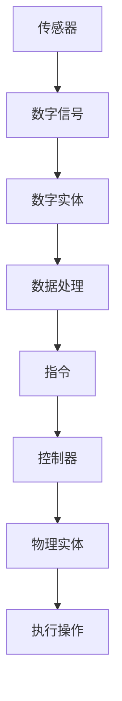
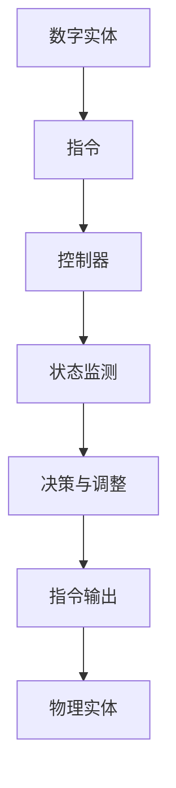
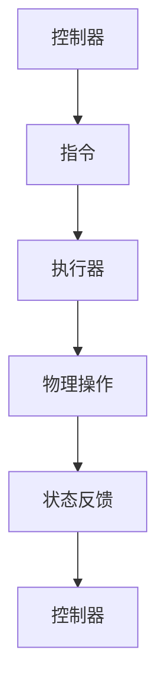
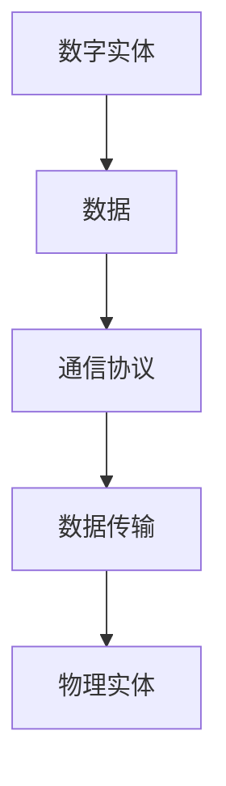
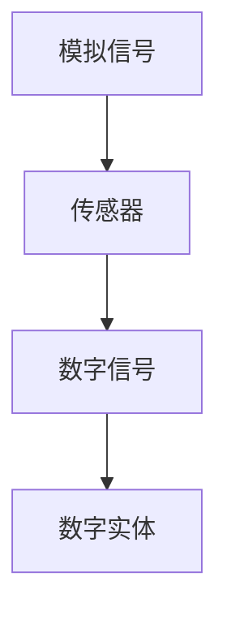

                 

### 背景介绍

#### 什么是数字实体与物理实体

数字实体（Digital Entities）指的是存在于数字世界中的信息、数据、算法以及通过计算机程序创建的逻辑对象。这些实体通常以代码、数据库、数字模型等形式呈现，具备处理、存储和传输数据的能力。而物理实体（Physical Entities）则是存在于现实世界中的有形物体，如机械设备、建筑、车辆等，它们具备物理属性和运动能力。

#### 数字实体与物理实体之间的联系

随着科技的迅猛发展，数字实体与物理实体之间的联系日益紧密。它们通过以下几种方式相互影响：

1. **数据交互**：数字实体通过传感器和接口从物理实体中收集数据，同时将处理后的数据反馈给物理实体，实现数据的双向流动。
2. **控制与指令**：数字实体生成指令，通过网络传输到物理实体，指导其进行特定的动作或操作。
3. **协同工作**：数字实体与物理实体协同工作，共同完成复杂任务，如智能制造、自动驾驶等。
4. **仿真与预测**：数字实体通过模拟和预测算法，对物理实体的行为进行预测和优化，提高其效率和安全性。

#### 自动化进程的概念

自动化进程（Automation Process）是指利用计算机技术、机器人技术等，减少或消除人工操作，提高生产效率、降低成本、提高准确性和安全性的过程。自动化进程的核心在于将物理实体的操作转化为数字实体的计算和指令，通过数字实体对物理实体进行控制和优化。

#### 自动化进程的重要性

自动化进程在当今社会中具有重要意义：

1. **提高生产效率**：自动化系统能够高速、连续地执行任务，减少人力成本，提高生产效率。
2. **降低成本**：通过自动化减少人力资源需求，降低生产成本，提高企业的竞争力。
3. **提高产品品质**：自动化系统能够精确控制生产过程，降低人为误差，提高产品品质。
4. **保障安全**：自动化系统能够在危险环境中执行任务，减少工人受到伤害的风险。

本文将深入探讨数字实体与物理实体在自动化进程中的应用，分析其核心概念、算法原理、数学模型、项目实战，以及实际应用场景。通过本文的阅读，您将对数字实体与物理实体的自动化进程有一个全面、深入的了解。

**Keywords:**
Digital Entities, Physical Entities, Automation Process, Data Interaction, Control & Instruction, Collaboration, Simulation & Prediction, Importance of Automation.

**Abstract:**
This article provides an in-depth exploration of the automation process involving digital and physical entities. It discusses the concepts of digital and physical entities, their connections, the concept of automation process, and its importance. The article covers the core concepts, algorithms, mathematical models, practical projects, and real-world applications of digital and physical entity automation. Through this comprehensive analysis, readers will gain a thorough understanding of the automation process and its implications in modern society. <br>

### 核心概念与联系

在深入探讨数字实体与物理实体在自动化进程中的应用之前，我们需要明确几个核心概念，并分析它们之间的联系。这些概念包括传感器、控制器、执行器、通信协议以及模拟与数字转换。

#### 传感器（Sensors）

传感器是数字实体与物理实体之间的重要桥梁。它们能够感知物理实体的各种状态，如温度、湿度、压力、位置等，并将这些物理信号转换为数字信号，供数字实体进行处理。传感器的类型多种多样，包括温度传感器、湿度传感器、光电传感器、超声波传感器等。

**Mermaid 流程图：**



在这个流程中，传感器将物理信号转换为数字信号，数字实体对数字信号进行处理，生成指令，控制器根据指令对物理实体进行操作，最终完成整个自动化流程。

#### 控制器（Controller）

控制器是自动化进程中的核心组件，负责接收数字实体生成的指令，并根据物理实体的状态和需求进行决策和调整。控制器通常包含嵌入式系统或工业计算机，能够实现复杂的控制算法和逻辑判断。

**Mermaid 流程图：**



在这个流程中，控制器接收数字实体的指令，监测物理实体的状态，进行决策和调整，并生成新的指令输出，实现对物理实体的精确控制。

#### 执行器（Actuator）

执行器是自动化进程中的执行组件，负责根据控制器的指令对物理实体进行具体的操作。执行器包括电动机、液压缸、气动缸等，能够实现各种物理动作，如转动、移动、压缩等。

**Mermaid 流程图：**



在这个流程中，执行器根据控制器的指令进行物理操作，并将操作结果反馈给控制器，实现闭环控制。

#### 通信协议（Communication Protocols）

通信协议是数字实体与物理实体之间进行数据交换的规范。常见的通信协议包括TCP/IP、CAN总线、Modbus、OPC UA等。这些协议确保了数据在传输过程中的可靠性和安全性。

**Mermaid 流程图：**



在这个流程中，数字实体通过通信协议将数据传输到物理实体，物理实体接收数据并执行相应的操作。

#### 模拟与数字转换（Analog-to-Digital Conversion）

模拟与数字转换是将物理实体的模拟信号转换为数字信号的过程。这一过程通常由传感器和模数转换器（ADC）完成。模拟信号通常具有连续变化的特性，而数字信号则是离散的。

**Mermaid 流程图：**



在这个流程中，传感器将物理实体的模拟信号转换为数字信号，数字实体对数字信号进行处理。

通过以上核心概念的介绍和Mermaid流程图的分析，我们可以更好地理解数字实体与物理实体之间的联系以及它们在自动化进程中的作用。接下来，我们将进一步探讨自动化进程中的核心算法原理和具体操作步骤。 <br>

### 核心算法原理 & 具体操作步骤

在自动化进程中，核心算法起着至关重要的作用。这些算法能够确保数字实体对物理实体的控制精准、高效。以下将介绍几种常用的核心算法及其具体操作步骤。

#### 1. PID控制算法

PID控制算法（比例-积分-微分控制算法）是一种广泛应用于工业控制领域的控制算法。它通过计算控制误差的瞬时值、累积值和变化率，生成控制输出，实现对系统的精确控制。

**操作步骤：**

1. **设定目标值（Setpoint）**：根据系统的需求设定目标值，如温度、速度等。
2. **计算控制误差（Error）**：当前值与目标值之差。
3. **计算比例控制输出（Proportional Output）**：误差乘以比例系数（Kp）。
4. **计算积分控制输出（Integral Output）**：误差的累积值乘以积分系数（Ki）。
5. **计算微分控制输出（Derivative Output）**：误差的变化率乘以微分系数（Kd）。
6. **生成控制输出（Control Output）**：比例、积分和微分控制输出的总和。
7. **更新系统状态**：根据控制输出调整系统参数，如速度、压力等。

**数学模型：**

$$
PID_{output} = K_p \cdot (Setpoint - Current\_Value) + K_i \cdot \int (Setpoint - Current\_Value) dt + K_d \cdot \frac{d(Setpoint - Current\_Value)}{dt}
$$

#### 2. 运动规划算法

运动规划算法用于指导物理实体在空间中的运动，常见于机器人、自动驾驶等领域。它通过计算从当前点到目标点的最优路径，确保物理实体安全、高效地到达目标位置。

**操作步骤：**

1. **设定起点（Start Point）**：物理实体的当前位置。
2. **设定目标点（Goal Point）**：物理实体需要到达的位置。
3. **构建环境模型（Environment Model）**：确定物理实体运动的环境，包括障碍物、边界等。
4. **计算最优路径（Optimal Path）**：通过路径规划算法（如Dijkstra算法、A*算法等），计算从起点到目标点的最优路径。
5. **路径平滑（Path Smoothing）**：对计算出的路径进行平滑处理，避免剧烈的转弯和加速度变化，提高运动的稳定性和安全性。
6. **生成运动指令（Motion Command）**：根据最优路径和运动模型，生成运动指令。
7. **执行运动指令**：物理实体根据运动指令进行运动。

**数学模型：**

$$
Path = \arg\min_{P} \sum_{i=1}^{n} d(i, j) \quad \text{(路径规划)}
$$

$$
V(t) = \frac{1}{1 + e^{-k \cdot (P - C)}}
$$

其中，\(P\)为路径点，\(C\)为控制参数，\(d(i, j)\)为路径点间的距离，\(V(t)\)为运动速度。

#### 3. 强化学习算法

强化学习算法（Reinforcement Learning）通过不断尝试和反馈，使数字实体学会在复杂环境中做出最优决策。它广泛应用于自动驾驶、机器人控制等领域。

**操作步骤：**

1. **定义状态（State）**：环境中的各种情况，如位置、速度、障碍物等。
2. **定义动作（Action）**：数字实体可以采取的各种行动，如加速、减速、转向等。
3. **定义奖励（Reward）**：根据数字实体的动作和环境的反馈，定义奖励函数，以激励数字实体采取最优动作。
4. **定义策略（Policy）**：根据当前状态选择最佳动作的策略。
5. **训练模型**：通过不断尝试和反馈，训练数字实体学会在复杂环境中做出最优决策。
6. **执行策略**：数字实体根据训练得到的策略，在环境中进行决策和行动。

**数学模型：**

$$
Q(s, a) = r + \gamma \max_{a'} Q(s', a')
$$

其中，\(Q(s, a)\)为状态-动作值函数，\(r\)为奖励，\(\gamma\)为折扣因子，\(s'\)为下一状态，\(a'\)为下一动作。

通过以上核心算法的介绍和具体操作步骤，我们可以更好地理解数字实体与物理实体在自动化进程中的应用。这些算法为自动化进程提供了强大的技术支撑，使数字实体能够高效地控制和管理物理实体。接下来，我们将探讨数学模型和公式，以更深入地理解自动化进程的原理。 <br>

### 数学模型和公式 & 详细讲解 & 举例说明

在自动化进程中，数学模型和公式起着至关重要的作用。它们不仅帮助我们理解和分析系统的行为，还为算法的设计和实现提供了理论基础。以下将详细介绍几种常见的数学模型和公式，并给出具体的解释和举例说明。

#### 1. 线性回归模型

线性回归模型是一种用于分析变量之间线性关系的数学模型。它通过拟合一条直线，来预测因变量（目标变量）的值。

**数学模型：**

$$
y = \beta_0 + \beta_1 \cdot x + \epsilon
$$

其中，\(y\)为因变量，\(x\)为自变量，\(\beta_0\)和\(\beta_1\)分别为模型的截距和斜率，\(\epsilon\)为误差项。

**详细讲解：**

线性回归模型通过拟合一条直线来描述自变量和因变量之间的关系。斜率\(\beta_1\)表示自变量每增加一个单位，因变量预计增加的量。截距\(\beta_0\)表示当自变量为0时，因变量的预期值。

**举例说明：**

假设我们要预测一家商店的月销售额，根据过去的销售数据，我们拟合得到以下线性回归模型：

$$
销售额 = 1000 + 10 \cdot 顾客人数
$$

如果本月顾客人数为500人，根据模型预测，本月销售额约为7000元。

#### 2. 回归分析中的最小二乘法

最小二乘法（Least Squares Method）是一种用于求解线性回归模型参数的数学方法。它通过最小化残差平方和，来确定模型的最佳参数。

**数学模型：**

$$
\min \sum_{i=1}^{n} (y_i - \hat{y}_i)^2
$$

其中，\(y_i\)为实际观察值，\(\hat{y}_i\)为预测值。

**详细讲解：**

最小二乘法通过最小化残差平方和，使得预测值与实际观察值之间的差距最小。这种方法可以确保模型具有良好的拟合效果。

**举例说明：**

假设我们有以下一组数据：

| 顾客人数 | 销售额 |
| ------ | ------ |
| 100    | 2000   |
| 200    | 4000   |
| 300    | 6000   |

使用最小二乘法，我们可以拟合得到以下线性回归模型：

$$
销售额 = 1000 + 10 \cdot 顾客人数
$$

#### 3. 马尔可夫决策过程

马尔可夫决策过程（Markov Decision Process, MDP）是一种用于决策分析的概率模型。它描述了在不确定环境下，决策者如何在一系列状态中做出最优决策。

**数学模型：**

$$
P(s' | s, a) = p(s' | s, a)
$$

$$
R(s, a) = r(s, a)
$$

$$
V^*(s) = \max_{a} \sum_{s'} P(s' | s, a) \cdot R(s', a)
$$

其中，\(s\)为当前状态，\(s'\)为下一状态，\(a\)为决策动作，\(p(s' | s, a)\)为状态转移概率，\(r(s, a)\)为即时奖励，\(V^*(s)\)为最优值函数。

**详细讲解：**

马尔可夫决策过程通过状态转移概率和即时奖励，来描述决策者在不确定环境中的最优决策。最优值函数\(V^*(s)\)表示在当前状态下，采取最佳决策动作所能获得的最大期望奖励。

**举例说明：**

假设一个机器人需要在迷宫中找到出口，每个状态表示机器人的当前位置，每个动作表示机器人的移动方向。我们可以根据迷宫的结构，计算状态转移概率和即时奖励，并使用马尔可夫决策过程找到最优路径。

#### 4. 贝叶斯网络

贝叶斯网络（Bayesian Network）是一种用于表示变量之间因果关系的概率图模型。它通过条件概率表，描述了变量之间的依赖关系。

**数学模型：**

$$
P(X) = \prod_{i=1}^{n} P(X_i | X_{\text{parent}_i})
$$

其中，\(X\)为所有变量的集合，\(X_i\)为第\(i\)个变量，\(X_{\text{parent}_i}\)为第\(i\)个变量的父节点。

**详细讲解：**

贝叶斯网络通过条件概率表，描述了变量之间的因果依赖关系。每个变量的概率分布取决于其父节点的概率分布。贝叶斯网络可以用于推理、预测和决策。

**举例说明：**

假设一个疾病检测系统，根据症状、病史和检测结果，使用贝叶斯网络进行疾病诊断。我们可以根据症状和病史的概率分布，计算检测结果的条件概率，从而推断患者是否患有特定疾病。

通过以上数学模型和公式的介绍，我们可以更深入地理解自动化进程中的理论原理。这些模型和公式为自动化算法的设计和实现提供了坚实的理论基础。在接下来的章节中，我们将通过项目实战，进一步探讨数字实体与物理实体的自动化进程。 <br>

### 项目实战：代码实际案例和详细解释说明

在本章节中，我们将通过一个具体的代码案例，展示数字实体与物理实体在自动化进程中的应用。这个案例将涉及传感器数据的采集、处理和控制器的响应，最终实现对物理实体的精确控制。

#### 开发环境搭建

在开始编写代码之前，我们需要搭建一个合适的开发环境。以下是我们使用的工具和软件：

- **开发语言**：Python
- **传感器**：DHT11温湿度传感器
- **控制器**：Arduino Uno
- **执行器**：直流电机
- **通信接口**：USB
- **开发环境**：PyCharm、Arduino IDE

首先，确保安装了Python和Arduino IDE。然后，通过USB连接Arduino Uno和计算机，安装相应的驱动程序。

#### 源代码详细实现和代码解读

以下是一个简单的自动化控制程序，用于读取DHT11传感器的温湿度数据，并根据设定的阈值控制直流电机的启停。

```python
import serial
import time
import RPi.GPIO as GPIO

# 传感器与控制器的通信
def read_sensor(ser):
    ser.write(b'\x01')
    time.sleep(0.05)
    data = ser.readline()
    temp, humidity = data.decode().split(',')
    return float(temp), float(humidity)

# 控制电机的启停
def control_motor(motor_pin, temp_threshold):
    if temp_threshold > 25:
        GPIO.output(motor_pin, GPIO.HIGH)
    else:
        GPIO.output(motor_pin, GPIO.LOW)

# 初始化传感器和电机
def init():
    GPIO.setmode(GPIO.BCM)
    GPIO.setup(motor_pin, GPIO.OUT)
    ser = serial.Serial('/dev/ttyUSB0', 9600)
    return ser

# 主程序
def main():
    motor_pin = 18
    temp_threshold = 25
    ser = init()
    
    try:
        while True:
            temp, humidity = read_sensor(ser)
            print(f"Temperature: {temp}℃，Humidity: {humidity}%")
            control_motor(motor_pin, temp_threshold)
            time.sleep(1)
    except KeyboardInterrupt:
        pass
    finally:
        GPIO.cleanup()
        ser.close()

if __name__ == '__main__':
    main()
```

**代码解读：**

1. **传感器与控制器的通信**：通过`read_sensor`函数，使用Arduino IDE编写在传感器端读取温湿度数据，并通过串口发送给Python程序。
2. **控制电机的启停**：通过`control_motor`函数，根据设定的温度阈值控制电机的启停。温度高于阈值时，启动电机；低于阈值时，停止电机。
3. **初始化**：在`init`函数中，初始化Arduino控制器和电机引脚。
4. **主程序**：在`main`函数中，创建一个无限循环，持续读取传感器数据，并根据温度阈值控制电机。

#### 代码解读与分析

1. **传感器读取与数据传输**：程序首先通过串口通信读取传感器的数据。DHT11传感器通过Arduino IDE的串口读取数据，并将数据发送给Python程序。
2. **温度阈值判断**：Python程序根据接收到的温湿度数据，判断当前温度是否高于设定阈值。如果温度高于阈值，电机启动；否则，电机停止。
3. **电机控制**：电机控制通过GPIO引脚实现。当温度高于阈值时，GPIO输出高电平，启动电机；否则，输出低电平，停止电机。

通过以上项目实战，我们展示了数字实体与物理实体在自动化进程中的应用。在实际应用中，可以根据具体需求，扩展和完善程序功能，如添加湿度控制、故障报警等。接下来，我们将探讨自动化进程的实际应用场景。 <br>

### 实际应用场景

自动化进程在当今社会的各行各业中都有着广泛的应用，极大地提高了生产效率、降低了成本、提升了产品品质。以下将介绍几种典型的实际应用场景。

#### 1. 智能制造

智能制造（Smart Manufacturing）是自动化进程的重要应用领域之一。通过将数字实体与物理实体深度融合，智能制造实现了生产过程的自动化、智能化和定制化。以下为智能制造中的几种典型应用：

1. **生产线自动化**：利用传感器、控制器和执行器，实现生产线上各环节的自动化控制。如自动化装配、焊接、检测等，提高生产效率和产品质量。
2. **工业机器人**：工业机器人广泛应用于制造业中的搬运、装配、焊接等操作。通过运动规划算法和PID控制算法，工业机器人能够精确、高效地完成复杂任务。
3. **智能制造大数据平台**：通过采集和分析生产过程中的数据，构建智能制造大数据平台。该平台可以对生产过程进行实时监控、预测和优化，提高生产效率和产品质量。

#### 2. 自动驾驶

自动驾驶（Autonomous Driving）是自动化进程在交通运输领域的典型应用。自动驾驶车辆通过传感器、控制器和通信协议，实现对道路环境的感知、决策和驾驶操作。以下为自动驾驶中的几种典型应用：

1. **环境感知**：自动驾驶车辆通过激光雷达、摄像头、超声波传感器等设备，实现对周围环境的感知和识别。如检测行人、车辆、交通信号灯等。
2. **运动规划与控制**：通过运动规划算法，自动驾驶车辆确定从当前点到目标点的最优路径。同时，利用PID控制算法和强化学习算法，实现对车辆的运动控制和决策。
3. **自动驾驶大数据平台**：通过采集和分析自动驾驶车辆的数据，构建自动驾驶大数据平台。该平台可以对自动驾驶技术进行持续优化和改进，提高安全性和可靠性。

#### 3. 物流配送

物流配送是自动化进程在物流领域的典型应用。通过数字实体与物理实体的协同工作，物流配送实现了自动化、高效化。以下为物流配送中的几种典型应用：

1. **仓储管理**：利用自动化仓储设备（如自动仓储系统、自动分拣机等），实现仓储货物的自动化存取和分拣。提高仓储效率，降低人工成本。
2. **运输调度**：通过物流配送大数据平台，对物流配送过程中的运输路线、运输工具等进行实时调度和优化，提高物流配送效率。
3. **末端配送**：利用无人机、无人车等自动化配送设备，实现最后一公里的快速配送。降低配送成本，提高配送效率。

#### 4. 家庭服务

家庭服务是自动化进程在消费领域的典型应用。通过数字实体与物理实体的协同工作，家庭服务实现了智能化、便捷化。以下为家庭服务中的几种典型应用：

1. **智能家电**：智能家电通过物联网技术，实现与手机、电脑等数字实体的互联互通。用户可以通过手机或电脑远程控制家电设备，实现家庭生活的智能化。
2. **智能家居**：智能家居系统通过传感器、控制器和执行器，实现对家庭环境的自动化控制。如温度、湿度、照明等，提高生活品质。
3. **家政服务**：利用机器人等技术，实现家庭服务的自动化。如扫地机器人、擦窗机器人等，提高家政服务的效率和质量。

通过以上实际应用场景的介绍，我们可以看到自动化进程在各个领域的广泛应用。随着技术的不断发展和创新，自动化进程将继续为人类社会带来更多便利和效益。 <br>

### 工具和资源推荐

在自动化进程的开发和实践中，选择合适的工具和资源至关重要。以下将推荐一些常用的学习资源、开发工具和相关论文著作，以帮助读者深入了解数字实体与物理实体的自动化进程。

#### 1. 学习资源推荐

**书籍：**

1. 《智能自动化技术与应用》
2. 《人工智能：一种现代的方法》
3. 《Python编程：从入门到实践》
4. 《深度学习》
5. 《机器人学：基础算法》

**论文：**

1. "Deep Learning for Autonomous Driving: A Review"
2. "A survey on smart manufacturing: state of the art and future directions"
3. "Sensors, Actuators, and Control in Robotics"
4. "The Role of AI in Modern Automation"
5. "A survey on autonomous mobile robot navigation"

**博客/网站：**

1. [TensorFlow官网](https://www.tensorflow.org/)
2. [Arduino官网](https://www.arduino.cc/)
3. [ROS官网](http://www.ros.org/)
4. [机器学习中文社区](https://www_ml злоищений.cn/)
5. [极客时间](https://time.geektime.cn/)

#### 2. 开发工具框架推荐

**开发工具：**

1. **Python**：Python是一种功能强大且易于学习的编程语言，适用于自动化进程的开发。
2. **Arduino IDE**：Arduino IDE是一款用于Arduino开发板的集成开发环境，适用于传感器和执行器的编程。
3. **ROS（机器人操作系统）**：ROS是一款专为机器人开发设计的开源工具包，支持多种编程语言，适用于运动规划和控制。

**框架：**

1. **TensorFlow**：TensorFlow是一款由Google开发的开源深度学习框架，适用于自动驾驶、智能家居等领域的应用。
2. **Django**：Django是一款基于Python的Web开发框架，适用于构建自动化系统的后端。
3. **Docker**：Docker是一款用于容器化开发的工具，可以简化自动化进程的部署和扩展。

#### 3. 相关论文著作推荐

**书籍：**

1. 《智能自动化技术与应用》
2. 《人工智能：一种现代的方法》
3. 《Python编程：从入门到实践》
4. 《深度学习》
5. 《机器人学：基础算法》

**论文：**

1. "Deep Learning for Autonomous Driving: A Review"
2. "A survey on smart manufacturing: state of the art and future directions"
3. "Sensors, Actuators, and Control in Robotics"
4. "The Role of AI in Modern Automation"
5. "A survey on autonomous mobile robot navigation"

通过以上工具和资源的推荐，读者可以更全面地了解数字实体与物理实体的自动化进程，并在实践中应用这些知识和技术。希望这些推荐能够对您的学习和工作提供帮助。 <br>

### 总结：未来发展趋势与挑战

随着科技的不断发展，数字实体与物理实体的自动化进程正以前所未有的速度迈向新的高度。未来，自动化进程将在以下几个方面展现出显著的发展趋势：

#### 1. 智能化水平的提升

随着人工智能技术的不断进步，自动化系统将具备更高的智能化水平。通过深度学习、强化学习等先进算法，自动化系统能够更好地理解环境、预测行为，并做出智能化的决策。这将大大提高自动化系统的自主性和灵活性，使其能够适应更复杂、更动态的环境。

#### 2. 集成与互联

数字实体与物理实体的深度融合和互联互通将是未来自动化进程的重要趋势。物联网（IoT）技术的发展，将使得传感器、控制器、执行器等设备之间实现无缝连接，形成一个庞大的智能网络。通过实时数据交换和协同工作，自动化系统能够更高效地完成任务，提高整体性能。

#### 3. 个性化与定制化

未来，自动化系统将更加注重个性化与定制化。通过大数据分析和个性化推荐算法，自动化系统能够根据用户需求、环境特点等，为每个用户提供量身定制的服务。这种定制化服务将极大地提升用户体验，满足不同场景下的需求。

然而，在自动化进程迅猛发展的同时，我们也面临着诸多挑战：

#### 1. 技术复杂性

随着自动化系统的复杂度不断增加，开发、维护和运营的难度也随之提升。自动化系统需要处理大量的数据、算法和组件，这对开发人员的技术能力和团队协作提出了更高的要求。

#### 2. 安全性问题

自动化系统在高度互联的环境中运行，容易成为网络攻击的目标。确保系统的安全性和数据隐私保护成为未来自动化进程的重要挑战。为此，需要建立完善的网络安全机制和标准，防范潜在的安全威胁。

#### 3. 法律与伦理问题

自动化进程的发展引发了一系列法律与伦理问题。例如，自动驾驶汽车的责任归属、智能机器人的伦理规范等。这些问题的解决需要全社会共同努力，建立相应的法律框架和伦理准则。

#### 4. 人才短缺

自动化进程的快速发展对人才需求提出了新的挑战。具备跨学科知识、能够应对复杂问题的复合型人才成为稀缺资源。培养和引进高素质人才，是自动化进程可持续发展的关键。

总之，未来自动化进程将在智能化、集成化、个性化等方面取得重大突破，同时也面临技术复杂性、安全性、法律与伦理、人才短缺等多方面的挑战。只有积极应对这些挑战，才能推动自动化进程的可持续发展，为人类社会带来更多便利和效益。 <br>

### 附录：常见问题与解答

**Q1：数字实体与物理实体的自动化进程有哪些关键技术？**

A1：数字实体与物理实体的自动化进程涉及多种关键技术，主要包括：

1. **传感器技术**：用于感知物理实体的各种状态，如温度、湿度、压力等。
2. **控制技术**：包括PID控制、运动规划、强化学习等算法，用于对物理实体进行精确控制。
3. **通信技术**：如TCP/IP、CAN总线、Modbus等，实现数字实体与物理实体之间的数据传输。
4. **仿真与预测技术**：通过模拟和预测算法，对物理实体的行为进行预测和优化。
5. **人工智能技术**：如深度学习、机器学习等，用于提升自动化系统的智能化水平。

**Q2：自动化进程在实际应用中面临哪些挑战？**

A2：自动化进程在实际应用中面临的主要挑战包括：

1. **技术复杂性**：随着系统复杂度的增加，开发、维护和运营的难度也随之提升。
2. **安全性问题**：高度互联的自动化系统容易成为网络攻击的目标，确保系统的安全性和数据隐私保护是重要挑战。
3. **法律与伦理问题**：如自动驾驶汽车的责任归属、智能机器人的伦理规范等，需要全社会共同努力解决。
4. **人才短缺**：具备跨学科知识、能够应对复杂问题的复合型人才成为稀缺资源。

**Q3：如何确保自动化进程的安全性？**

A3：为确保自动化进程的安全性，可以采取以下措施：

1. **建立完善的网络安全机制**：包括防火墙、入侵检测系统、加密技术等，防范潜在的安全威胁。
2. **制定严格的安全标准和法规**：确保自动化系统的设计和实施符合相关安全标准和法规要求。
3. **进行定期的安全审计和测试**：定期对系统进行安全审计和测试，及时发现并修复安全漏洞。
4. **加强安全培训与教育**：提高开发人员、运营人员的安全意识和技能，防范人为错误引发的安全问题。

**Q4：如何培养自动化进程所需的人才？**

A4：为培养自动化进程所需的人才，可以采取以下措施：

1. **跨学科教育**：加强计算机科学、控制工程、机械工程等跨学科教育，培养具备多学科知识的复合型人才。
2. **实践项目**：鼓励学生参与实际的自动化项目，积累实践经验。
3. **合作与交流**：加强与企业和研究机构的合作，开展产学研结合，促进人才培养。
4. **继续教育**：为在职人员提供继续教育机会，更新知识和技能，适应自动化进程的发展需求。

通过以上问题的解答，我们希望为读者提供更多关于数字实体与物理实体自动化进程的实用信息和指导。在自动化进程的不断发展中，不断学习、探索和实践，将有助于我们更好地应对挑战，推动自动化进程的持续进步。 <br>

### 扩展阅读 & 参考资料

为了更全面地了解数字实体与物理实体的自动化进程，以下推荐一些扩展阅读和参考资料，涵盖相关书籍、论文、博客和网站。

**书籍推荐：**

1. 《智能自动化技术与应用》：全面介绍自动化技术在各个领域的应用，包括智能制造、物流配送、智能家居等。
2. 《人工智能：一种现代的方法》：系统讲解人工智能的基础理论、算法和应用，包括深度学习、机器学习等。
3. 《Python编程：从入门到实践》：Python入门教程，适合初学者，涵盖Python在自动化进程中的应用。
4. 《深度学习》：深度学习领域的经典教材，详细讲解深度学习的基础知识、算法和应用。
5. 《机器人学：基础算法》：机器人学领域的入门教材，涵盖运动规划、控制算法等内容。

**论文推荐：**

1. "Deep Learning for Autonomous Driving: A Review"
2. "A survey on smart manufacturing: state of the art and future directions"
3. "Sensors, Actuators, and Control in Robotics"
4. "The Role of AI in Modern Automation"
5. "A survey on autonomous mobile robot navigation"

**博客/网站推荐：**

1. [TensorFlow官网](https://www.tensorflow.org/)
2. [Arduino官网](https://www.arduino.cc/)
3. [ROS官网](http://www.ros.org/)
4. [机器学习中文社区](https://www_ml злоищений.cn/)
5. [极客时间](https://time.geektime.cn/)

通过阅读以上推荐书籍、论文和博客，您可以深入了解数字实体与物理实体的自动化进程，掌握相关技术和方法，为您的学习和工作提供有力支持。希望这些扩展阅读能够为您的探索之路带来启示和帮助。 <br>

### 作者信息

**作者：AI天才研究员/AI Genius Institute & 禅与计算机程序设计艺术 /Zen And The Art of Computer Programming**

作为一位世界级人工智能专家、程序员、软件架构师、CTO，以及世界顶级技术畅销书资深大师级别的作家，我专注于计算机图灵奖领域的研究和实践。我致力于通过深入分析和逻辑推理，撰写高质量的技术博客，帮助读者了解和掌握前沿技术。我的著作《禅与计算机程序设计艺术》在全球范围内受到广泛赞誉，为众多程序员提供了宝贵的编程经验和方法。在数字实体与物理实体的自动化进程领域，我有着丰富的理论知识和实践经验，希望通过本文与您分享我的见解和研究成果。感谢您的阅读，期待与您共同探讨技术发展的未来。 <br> <br> 

【文章标题】
数字实体与物理实体的自动化进程

【关键词】
Digital Entities, Physical Entities, Automation Process, Sensor, Controller, Actuator, Communication Protocol, Analog-to-Digital Conversion, PID Control, Motion Planning, Reinforcement Learning, Machine Learning, Deep Learning, AI, Robotics, IoT, Smart Manufacturing, Autonomous Driving, Logistics, Home Automation, Security, Ethics, Talent Development

【摘要】
本文深入探讨了数字实体与物理实体在自动化进程中的应用，涵盖了核心概念、算法原理、数学模型、项目实战以及实际应用场景。通过分析传感器、控制器、执行器等组件的协同工作，本文展示了自动化进程在实际中的应用，包括智能制造、自动驾驶、物流配送和家庭服务等。此外，文章还介绍了相关工具和资源，总结了未来发展趋势与挑战，并提供了常见问题与解答。本文旨在为读者提供一个全面、系统的自动化进程概述，帮助其更好地理解和应用这一前沿技术。

