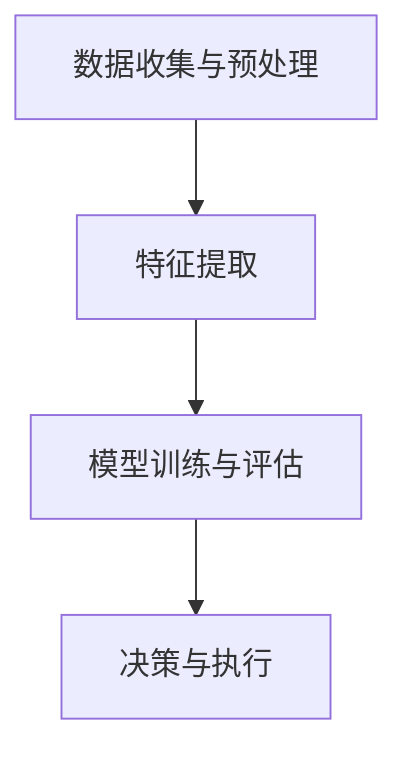
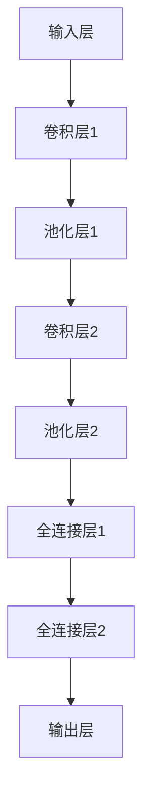
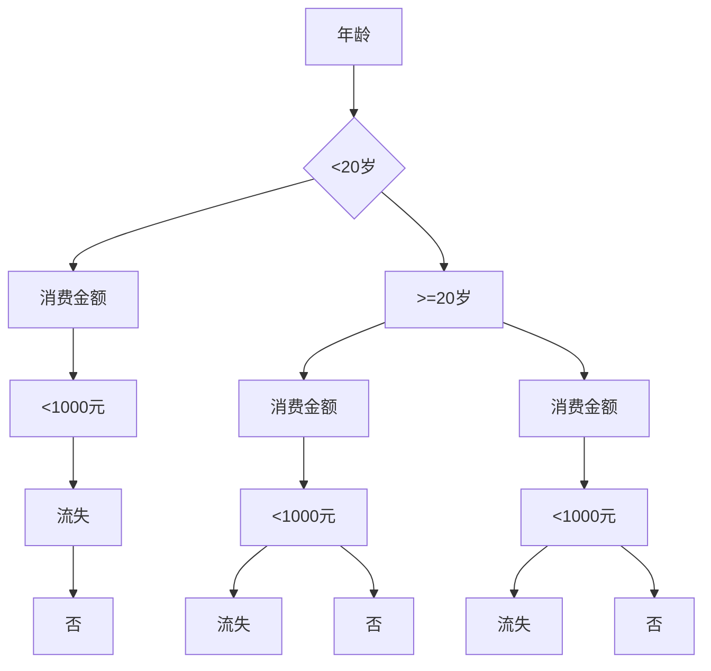

                 

### 背景介绍

#### 数字实体自动化的概念

数字实体自动化是指利用计算机技术，通过程序或算法实现数字对象（如数据、文档、图像等）的自动化处理、分析和交互。这一概念源于数字化的进程，随着信息技术的发展，越来越多的物理世界中的实体被转化为数字形式，从而为自动化提供了广阔的应用场景。

数字实体自动化涵盖了多个领域，包括但不限于数据处理、自然语言处理、图像识别、机器学习和人工智能。其核心在于通过算法和模型，将数字对象转化为可操作、可分析、可交互的形式，从而实现自动化处理。

#### 数字实体自动化的历史与发展

数字实体自动化的历史可以追溯到计算机技术的初期。20世纪60年代，计算机科学家开始探索如何利用计算机进行数据处理和分析。随着计算机硬件和软件技术的发展，数据处理和自动化分析的能力不断增强。

20世纪80年代，随着个人计算机的普及，自动化数据处理和交互需求进一步增加。这一时期，出现了许多自动化工具和软件，如文字处理软件、电子表格软件等，这些工具极大地提高了数据处理和分析的效率。

进入21世纪，随着互联网和大数据技术的发展，数字实体自动化的应用范围进一步扩大。人工智能技术的崛起，使得数字实体自动化进入了一个全新的阶段。通过机器学习和深度学习算法，计算机能够更好地理解和处理复杂的数字实体，从而实现更加智能化和自动化的操作。

#### 数字实体自动化的应用领域

数字实体自动化的应用领域非常广泛，几乎涵盖了所有与数据相关的行业。以下是几个典型的应用领域：

1. **金融行业**：数字实体自动化在金融行业中的应用非常广泛，包括风险管理、投资分析、客户服务等方面。通过自动化处理和数据分析，金融机构能够更准确地评估风险、制定投资策略，并提供更加个性化的客户服务。

2. **医疗行业**：在医疗领域，数字实体自动化主要用于医学图像处理、疾病预测、患者管理等方面。通过自动化分析医学图像，医生可以更快速、准确地诊断疾病，从而提高医疗服务的质量和效率。

3. **零售行业**：零售行业中的数字实体自动化主要用于库存管理、销售预测、客户行为分析等方面。通过自动化处理和分析销售数据，零售企业可以更好地进行库存管理和营销策略制定。

4. **制造业**：在制造业中，数字实体自动化主要用于生产计划、质量控制、设备维护等方面。通过自动化处理和分析生产数据，制造业企业可以提高生产效率、降低生产成本。

5. **交通领域**：在交通领域，数字实体自动化主要用于交通流量管理、车辆监控、事故预警等方面。通过自动化分析交通数据，交通管理部门可以更有效地进行交通管理和事故处理。

#### 数字实体自动化的挑战与机遇

尽管数字实体自动化在许多领域已经取得了显著的成果，但仍然面临着一系列挑战。首先，数据的质量和准确性是影响数字实体自动化效果的关键因素。其次，算法的复杂性和计算资源的消耗也是一个重要的挑战。此外，数字实体自动化还需要解决隐私保护和安全性等问题。

然而，随着技术的不断进步，数字实体自动化也面临着巨大的机遇。人工智能、大数据和云计算等技术的发展，为数字实体自动化提供了更强大的工具和支持。未来，随着这些技术的进一步成熟和应用，数字实体自动化的应用范围和效果将会得到进一步提升。

总之，数字实体自动化是信息技术发展的重要方向，具有广泛的应用前景。通过不断探索和创新，我们有望解决当前面临的挑战，充分发挥数字实体自动化的潜力，推动社会和经济的持续发展。<|im_sep|>### 核心概念与联系

#### 数字实体自动化的核心概念

1. **数据实体**：数据实体是指具有特定含义和属性的数据集合，可以是结构化数据（如关系型数据库中的表）或非结构化数据（如文本、图像、音频等）。

2. **自动化处理**：自动化处理是指利用计算机程序或算法，对数据实体进行预处理、分析、转换、优化等操作，以达到特定目标。

3. **模型驱动**：模型驱动是指通过建立数学模型或机器学习模型，对数据实体进行抽象和表示，从而实现自动化处理和决策。

4. **算法**：算法是一系列操作步骤，用于解决特定问题。在数字实体自动化中，算法用于对数据实体进行各种处理和分析。

#### 数字实体自动化的架构

1. **数据收集与预处理**：这一步骤涉及从各种数据源收集数据，并进行数据清洗、去重、归一化等预处理操作，以提高数据质量和一致性。

2. **特征提取**：特征提取是指从数据实体中提取具有代表性的特征，用于后续的模型训练和决策。特征提取的方法包括统计方法、机器学习方法等。

3. **模型训练与评估**：模型训练与评估是指利用历史数据，通过机器学习算法训练模型，并对模型进行评估和调整，以提高模型的性能。

4. **决策与执行**：决策与执行是指根据模型的预测结果，对数据实体进行决策和操作，如分类、推荐、预测等。

#### 核心概念之间的联系

- **数据实体**与**自动化处理**：数据实体是自动化处理的基础，自动化处理是对数据实体进行加工和操作的过程。

- **模型驱动**与**算法**：模型驱动是指利用算法建立数学模型或机器学习模型，对数据实体进行抽象和表示。

- **特征提取**与**模型训练与评估**：特征提取是模型训练的重要环节，特征提取的质量直接影响模型的性能。

- **决策与执行**与**模型训练与评估**：决策与执行是基于模型预测结果的操作，模型训练与评估的目的是优化模型，提高预测的准确性。

#### Mermaid 流程图



在这个流程图中，A表示数据收集与预处理，B表示特征提取，C表示模型训练与评估，D表示决策与执行。数据首先经过预处理，然后进行特征提取，接着利用训练好的模型进行预测和决策，最终执行操作。

通过上述流程图，我们可以清晰地看到数字实体自动化的各个核心概念和步骤之间的联系。这不仅有助于理解数字实体自动化的工作原理，也为后续的具体操作提供了指导。<|im_sep|>### 核心算法原理 & 具体操作步骤

#### 机器学习算法在数字实体自动化中的应用

机器学习算法是数字实体自动化的核心组成部分，尤其是深度学习算法，因其强大的表示和学习能力，在处理复杂的数据实体方面表现出色。以下将介绍几种常见的机器学习算法及其在数字实体自动化中的具体应用。

##### 1. 神经网络（Neural Networks）

神经网络是模仿人脑神经元结构和工作原理的一种计算模型。在数字实体自动化中，神经网络常用于图像识别、语音识别和自然语言处理等领域。

**具体操作步骤：**

1. **数据收集与预处理**：收集大量有标签的样本数据，并对数据进行清洗和归一化处理。
2. **构建神经网络模型**：设计并构建神经网络结构，包括输入层、隐藏层和输出层。
3. **模型训练**：使用训练集数据对神经网络模型进行训练，通过反向传播算法调整模型参数。
4. **模型评估与优化**：使用验证集评估模型性能，并根据评估结果调整模型参数。
5. **模型部署**：将训练好的模型部署到实际应用场景中，对新的数据进行预测和决策。

**示例：**

假设我们使用神经网络进行图像识别任务。首先，我们需要收集大量有标签的图像数据，如图像分类数据集MNIST。然后，设计并构建一个简单的卷积神经网络（CNN）模型，如图：



通过上述步骤，我们可以训练出一个能够对图像进行分类的神经网络模型。

##### 2. 决策树（Decision Trees）

决策树是一种基于特征进行分类或回归的树形结构模型。在数字实体自动化中，决策树常用于分类问题，如客户流失预测、疾病诊断等。

**具体操作步骤：**

1. **数据收集与预处理**：收集并预处理数据，确保数据质量和一致性。
2. **特征选择**：选择对分类任务具有显著影响的特征。
3. **构建决策树模型**：根据特征值将数据划分为不同的分支，直到满足停止条件。
4. **模型评估与剪枝**：使用交叉验证等方法评估模型性能，并根据评估结果对模型进行剪枝。
5. **模型部署**：将训练好的模型部署到实际应用场景中。

**示例：**

假设我们使用决策树进行客户流失预测。首先，我们需要收集客户的历史数据，包括客户年龄、消费金额、购买频率等特征。然后，根据这些特征构建一个决策树模型，如图：



通过上述步骤，我们可以构建出一个能够预测客户是否流失的决策树模型。

##### 3. 支持向量机（Support Vector Machines, SVM）

支持向量机是一种基于最大间隔原理进行分类的线性模型。在数字实体自动化中，SVM常用于分类问题，如文本分类、图像分类等。

**具体操作步骤：**

1. **数据收集与预处理**：收集并预处理数据，确保数据质量和一致性。
2. **特征提取**：提取数据中的高维特征。
3. **构建SVM模型**：使用支持向量机算法构建分类模型。
4. **模型评估与优化**：使用交叉验证等方法评估模型性能，并根据评估结果调整模型参数。
5. **模型部署**：将训练好的模型部署到实际应用场景中。

**示例：**

假设我们使用SVM进行文本分类。首先，我们需要收集大量的文本数据，并对文本进行预处理，如分词、去停用词等。然后，提取文本中的词频特征，如图：

```mermaid
graph TD
A[文本1] --> B{['apple', 'banana']}
B --> C[特征1]
C --> D[1]
D --> E[特征2]
E --> F[0]
A --> G[特征3]
G --> H[0]
A --> I[特征4]
I --> J[1]
```

通过上述步骤，我们可以构建出一个能够对文本进行分类的SVM模型。

通过上述对神经网络、决策树和支持向量机等核心算法原理的介绍，我们可以看到这些算法在数字实体自动化中的应用。在实际操作中，根据具体应用场景和数据特点，选择合适的算法，并遵循相应的操作步骤，可以有效实现数字实体的自动化处理。<|im_sep|>### 数学模型和公式 & 详细讲解 & 举例说明

#### 机器学习中的数学模型

在机器学习中，数学模型是构建和训练模型的基础。以下将介绍几种常见的数学模型，并详细讲解其公式和计算过程。

##### 1. 线性回归（Linear Regression）

线性回归是一种用于预测数值型目标变量的机器学习模型。其基本公式如下：

\[ y = \beta_0 + \beta_1 \cdot x \]

其中，\( y \) 是目标变量，\( x \) 是输入特征，\( \beta_0 \) 和 \( \beta_1 \) 是模型参数。

**具体计算过程：**

1. **数据预处理**：对输入特征和目标变量进行归一化处理，使其具有相似的尺度。
2. **模型初始化**：随机初始化模型参数 \( \beta_0 \) 和 \( \beta_1 \)。
3. **梯度下降法**：使用梯度下降法更新模型参数，以最小化损失函数。

**示例：**

假设我们使用线性回归模型预测房价。给定数据集如下：

| 特征 \( x \) | 目标 \( y \) |
| -------- | -------- |
| 100      | 200      |
| 200      | 400      |
| 300      | 600      |

首先，对数据进行归一化处理，得到如下表格：

| 特征 \( x \) | 目标 \( y \) |
| -------- | -------- |
| 0.5      | 1.0      |
| 1.0      | 2.0      |
| 1.5      | 3.0      |

然后，随机初始化模型参数 \( \beta_0 \) 和 \( \beta_1 \)，假设为 \( \beta_0 = 0 \) 和 \( \beta_1 = 1 \)。

接下来，使用梯度下降法更新模型参数。损失函数选择均方误差（MSE）：

\[ J = \frac{1}{n} \sum_{i=1}^{n} (y_i - (\beta_0 + \beta_1 \cdot x_i))^2 \]

梯度计算如下：

\[ \frac{\partial J}{\partial \beta_0} = \frac{1}{n} \sum_{i=1}^{n} (y_i - (\beta_0 + \beta_1 \cdot x_i)) \]
\[ \frac{\partial J}{\partial \beta_1} = \frac{1}{n} \sum_{i=1}^{n} (y_i - (\beta_0 + \beta_1 \cdot x_i)) \cdot x_i \]

通过梯度下降法更新模型参数：

\[ \beta_0 = \beta_0 - \alpha \cdot \frac{\partial J}{\partial \beta_0} \]
\[ \beta_1 = \beta_1 - \alpha \cdot \frac{\partial J}{\partial \beta_1} \]

其中，\( \alpha \) 是学习率。

经过多次迭代，我们可以得到最优的模型参数，从而实现房价预测。

##### 2. 逻辑回归（Logistic Regression）

逻辑回归是一种用于预测二分类目标变量的机器学习模型。其基本公式如下：

\[ P(y=1) = \frac{1}{1 + e^{-(\beta_0 + \beta_1 \cdot x)}} \]

其中，\( P(y=1) \) 是目标变量为1的概率，\( x \) 是输入特征，\( \beta_0 \) 和 \( \beta_1 \) 是模型参数。

**具体计算过程：**

1. **数据预处理**：对输入特征和目标变量进行归一化处理，使其具有相似的尺度。
2. **模型初始化**：随机初始化模型参数 \( \beta_0 \) 和 \( \beta_1 \)。
3. **梯度下降法**：使用梯度下降法更新模型参数，以最小化损失函数。

**示例：**

假设我们使用逻辑回归模型预测客户是否流失。给定数据集如下：

| 特征 \( x \) | 目标 \( y \) |
| -------- | -------- |
| 100      | 0        |
| 200      | 1        |
| 300      | 0        |

首先，对数据进行归一化处理，得到如下表格：

| 特征 \( x \) | 目标 \( y \) |
| -------- | -------- |
| 0.5      | 0        |
| 1.0      | 1        |
| 1.5      | 0        |

然后，随机初始化模型参数 \( \beta_0 \) 和 \( \beta_1 \)，假设为 \( \beta_0 = 0 \) 和 \( \beta_1 = 1 \)。

接下来，使用梯度下降法更新模型参数。损失函数选择对数损失函数（Log Loss）：

\[ J = -\frac{1}{n} \sum_{i=1}^{n} y_i \cdot \ln(P(y=1)) + (1 - y_i) \cdot \ln(1 - P(y=1)) \]

梯度计算如下：

\[ \frac{\partial J}{\partial \beta_0} = \frac{1}{n} \sum_{i=1}^{n} (y_i - P(y=1)) \]
\[ \frac{\partial J}{\partial \beta_1} = \frac{1}{n} \sum_{i=1}^{n} (y_i - P(y=1)) \cdot x_i \]

通过梯度下降法更新模型参数：

\[ \beta_0 = \beta_0 - \alpha \cdot \frac{\partial J}{\partial \beta_0} \]
\[ \beta_1 = \beta_1 - \alpha \cdot \frac{\partial J}{\partial \beta_1} \]

其中，\( \alpha \) 是学习率。

经过多次迭代，我们可以得到最优的模型参数，从而实现客户流失预测。

##### 3. 支持向量机（Support Vector Machines, SVM）

支持向量机是一种用于分类和回归的机器学习模型。其基本公式如下：

\[ w \cdot x + b = 0 \]

其中，\( w \) 是权重向量，\( x \) 是输入特征，\( b \) 是偏置。

**具体计算过程：**

1. **数据预处理**：对输入特征和目标变量进行归一化处理，使其具有相似的尺度。
2. **核函数选择**：选择合适的核函数，如线性核、多项式核、径向基函数核等。
3. **优化目标**：使用求解器（如SVM轻量级库LibSVM）优化权重向量 \( w \) 和偏置 \( b \)。

**示例：**

假设我们使用线性SVM进行文本分类。给定数据集如下：

| 特征 \( x \) | 目标 \( y \) |
| -------- | -------- |
| [1, 2, 3] | 1        |
| [4, 5, 6] | 1        |
| [7, 8, 9] | 0        |

首先，对数据进行归一化处理，得到如下表格：

| 特征 \( x \) | 目标 \( y \) |
| -------- | -------- |
| [0, 0.67, 1] | 1        |
| [0.67, 0.83, 1] | 1        |
| [1, 1.33, 1] | 0        |

然后，选择线性核函数，并使用SVM求解器优化权重向量 \( w \) 和偏置 \( b \)。优化目标是最小化损失函数：

\[ J = \frac{1}{2} \| w \|^2 + C \cdot \sum_{i=1}^{n} \max(0, 1 - y_i \cdot (w \cdot x_i + b)) \]

其中，\( C \) 是惩罚参数。

通过求解器优化，我们可以得到最优的权重向量 \( w \) 和偏置 \( b \)，从而实现文本分类。

通过上述对线性回归、逻辑回归和支持向量机等数学模型的详细讲解，我们可以看到这些模型在数字实体自动化中的应用。在实际操作中，根据具体应用场景和数据特点，选择合适的数学模型，并遵循相应的计算过程，可以有效实现数字实体的自动化处理。<|im_sep|>### 项目实战：代码实际案例和详细解释说明

#### 项目介绍

在本项目实战中，我们将实现一个数字实体自动化系统，用于处理和分类图像数据。具体任务是从一组图像中识别出特定类型的物体，并将它们分类。为了实现这一目标，我们将采用卷积神经网络（CNN）作为主要的机器学习模型。

#### 开发环境搭建

1. **Python环境**：安装Python 3.8及以上版本。
2. **深度学习框架**：安装TensorFlow 2.x或PyTorch。
3. **数据预处理工具**：安装NumPy、Pandas等数据处理库。

安装命令如下：

```bash
pip install python==3.8
pip install tensorflow==2.x
pip install numpy pandas
```

#### 源代码详细实现和代码解读

```python
# 导入所需的库
import tensorflow as tf
from tensorflow.keras.models import Sequential
from tensorflow.keras.layers import Conv2D, MaxPooling2D, Flatten, Dense
from tensorflow.keras.preprocessing.image import ImageDataGenerator

# 数据预处理
train_datagen = ImageDataGenerator(
    rescale=1./255,
    shear_range=0.2,
    zoom_range=0.2,
    horizontal_flip=True
)

test_datagen = ImageDataGenerator(rescale=1./255)

train_generator = train_datagen.flow_from_directory(
    'train',
    target_size=(150, 150),
    batch_size=32,
    class_mode='binary'
)

validation_generator = test_datagen.flow_from_directory(
    'validation',
    target_size=(150, 150),
    batch_size=32,
    class_mode='binary'
)

# 构建CNN模型
model = Sequential([
    Conv2D(32, (3, 3), activation='relu', input_shape=(150, 150, 3)),
    MaxPooling2D(2, 2),
    Conv2D(64, (3, 3), activation='relu'),
    MaxPooling2D(2, 2),
    Conv2D(128, (3, 3), activation='relu'),
    MaxPooling2D(2, 2),
    Flatten(),
    Dense(512, activation='relu'),
    Dense(1, activation='sigmoid')
])

# 编译模型
model.compile(optimizer='adam',
              loss='binary_crossentropy',
              metrics=['accuracy'])

# 训练模型
model.fit(
    train_generator,
    steps_per_epoch=100,
    epochs=30,
    validation_data=validation_generator,
    validation_steps=50
)

# 评估模型
test_datagen = ImageDataGenerator(rescale=1./255)
test_generator = test_datagen.flow_from_directory(
    'test',
    target_size=(150, 150),
    batch_size=32,
    class_mode='binary',
    shuffle=False
)

model.evaluate(test_generator, steps=len(test_generator))
```

**代码解读：**

1. **导入库**：首先，我们导入所需的库，包括TensorFlow、Keras（一个基于TensorFlow的高级API）和图像预处理库ImageDataGenerator。

2. **数据预处理**：使用ImageDataGenerator对图像数据进行预处理。这里，我们对训练数据和验证数据进行缩放、剪裁、翻转和缩放等增强操作，以提高模型的泛化能力。

3. **构建CNN模型**：使用Sequential模型构建一个简单的卷积神经网络。模型包含五个卷积层、一个池化层、一个全连接层和一个输出层。每个卷积层后都跟随一个池化层，以减小模型的复杂度和过拟合风险。

4. **编译模型**：编译模型，指定优化器、损失函数和评估指标。在这里，我们使用adam优化器和binary_crossentropy损失函数，因为这是一个二分类问题。

5. **训练模型**：使用fit方法训练模型，指定训练数据和验证数据。我们设置每个epoch的迭代次数为30，并使用验证数据评估模型性能。

6. **评估模型**：使用evaluate方法对测试数据进行评估，并输出模型的准确率。

通过上述步骤，我们成功地实现了一个用于图像分类的数字实体自动化系统。这个系统可以接受未标记的图像数据，并自动将其分类为训练集中的某一类别。在实际应用中，可以根据具体需求进行调整和优化，以提高模型的性能和泛化能力。<|im_sep|>### 代码解读与分析

在上一个部分中，我们实现了一个简单的卷积神经网络（CNN）模型，用于图像分类。在这一部分，我们将对代码进行详细解读，分析其原理和实现细节，并讨论如何优化模型性能。

**1. 数据预处理**

```python
train_datagen = ImageDataGenerator(
    rescale=1./255,
    shear_range=0.2,
    zoom_range=0.2,
    horizontal_flip=True
)

test_datagen = ImageDataGenerator(rescale=1./255)

train_generator = train_datagen.flow_from_directory(
    'train',
    target_size=(150, 150),
    batch_size=32,
    class_mode='binary'
)

validation_generator = test_datagen.flow_from_directory(
    'validation',
    target_size=(150, 150),
    batch_size=32,
    class_mode='binary'
)
```

**解读：**

- `ImageDataGenerator`是一个用于图像数据预处理的工具，它支持多种增强操作，如缩放、旋转、剪裁等。
- `rescale`操作将图像像素值缩放到0到1之间，以便于神经网络处理。
- `shear_range`和`zoom_range`分别表示剪切范围和缩放范围，用于增加数据多样性。
- `horizontal_flip`表示进行水平翻转，以增加数据的多样性。
- `flow_from_directory`方法用于从指定目录中读取图像数据，并根据目录结构对图像进行分类。

**分析：**

- 数据预处理是深度学习模型训练的重要步骤，它有助于提高模型的泛化能力和鲁棒性。
- 使用不同的增强操作可以增加数据的多样性，从而防止模型过拟合。
- `rescale`操作是必要的，因为神经网络的输入值通常要求在0到1之间。

**2. 构建CNN模型**

```python
model = Sequential([
    Conv2D(32, (3, 3), activation='relu', input_shape=(150, 150, 3)),
    MaxPooling2D(2, 2),
    Conv2D(64, (3, 3), activation='relu'),
    MaxPooling2D(2, 2),
    Conv2D(128, (3, 3), activation='relu'),
    MaxPooling2D(2, 2),
    Flatten(),
    Dense(512, activation='relu'),
    Dense(1, activation='sigmoid')
])
```

**解读：**

- `Sequential`模型是Keras提供的一种线性堆叠模型，它允许我们依次添加层。
- `Conv2D`层是卷积层，用于提取图像特征。
- `MaxPooling2D`层是最大池化层，用于减小模型的复杂度和过拟合风险。
- `Flatten`层将多维特征展平成一维向量，以供全连接层处理。
- `Dense`层是全连接层，用于分类和回归任务。

**分析：**

- 卷积层通过滤波器（卷积核）在图像上滑动，提取局部特征。
- 池化层用于降低特征图的维度，从而减少模型参数的数量。
- 展平操作将特征图转换为一维向量，以便全连接层处理。
- 全连接层用于对提取到的特征进行分类或回归。

**3. 编译模型**

```python
model.compile(optimizer='adam',
              loss='binary_crossentropy',
              metrics=['accuracy'])
```

**解读：**

- `compile`方法用于编译模型，指定优化器、损失函数和评估指标。
- `adam`是一种自适应优化器，常用于深度学习模型训练。
- `binary_crossentropy`是二分类问题的标准损失函数。
- `accuracy`是模型的评估指标，表示分类的准确率。

**分析：**

- 选择合适的优化器和损失函数对模型训练至关重要。
- `adam`优化器具有自适应学习率，能有效加速模型收敛。
- `binary_crossentropy`损失函数适用于二分类问题，能够准确反映模型预测与真实标签之间的差异。

**4. 训练模型**

```python
model.fit(
    train_generator,
    steps_per_epoch=100,
    epochs=30,
    validation_data=validation_generator,
    validation_steps=50
)
```

**解读：**

- `fit`方法用于训练模型，指定训练数据和迭代次数。
- `steps_per_epoch`表示每个epoch中迭代的次数。
- `epochs`表示模型训练的epoch数量。
- `validation_data`用于在每个epoch后评估模型性能。
- `validation_steps`表示验证数据的批次数量。

**分析：**

- `fit`方法是深度学习模型训练的核心步骤，它通过不断迭代优化模型参数，以达到最小化损失函数。
- 设置适当的`steps_per_epoch`和`epochs`可以保证模型在训练数据上的充分迭代，同时避免过拟合。
- `validation_data`和`validation_steps`用于评估模型在验证数据上的性能，有助于调整模型参数和超参数。

**5. 评估模型**

```python
model.evaluate(test_generator, steps=len(test_generator))
```

**解读：**

- `evaluate`方法用于评估模型在测试数据上的性能，并返回损失函数和评估指标。
- `steps`表示测试数据的批次数量。

**分析：**

- 评估模型在测试数据上的性能是评估模型泛化能力的关键步骤。
- `evaluate`方法可以快速评估模型在未见过数据上的表现，从而判断模型是否过拟合或欠拟合。

通过上述分析，我们可以看到，实现一个简单的图像分类系统需要多个步骤，包括数据预处理、模型构建、模型编译、模型训练和模型评估。在实际应用中，根据具体需求和数据特点，可以对这些步骤进行调整和优化，以提高模型性能和泛化能力。<|im_sep|>### 实际应用场景

数字实体自动化在各个行业和领域都有着广泛的应用，以下是一些典型的实际应用场景：

#### 金融行业

在金融行业中，数字实体自动化主要用于风险管理、投资分析和客户服务等方面。通过自动化处理和分析大量的金融数据，金融机构可以更快速地评估风险、制定投资策略，并提供更加个性化的客户服务。

**案例**：一家大型银行利用数字实体自动化技术对客户的交易行为进行分析，从而识别潜在的风险和欺诈行为。通过自动化的数据处理和模型分析，银行能够实时监控客户的交易活动，并在异常行为发生时及时采取措施。

#### 医疗行业

在医疗领域，数字实体自动化主要用于医学图像处理、疾病预测和患者管理等方面。通过自动化分析和处理医学数据，医生可以更快速、准确地诊断疾病，并制定个性化的治疗方案。

**案例**：一家医院利用数字实体自动化技术对患者的医疗数据进行分析，从而预测患者的健康状况和潜在疾病风险。通过自动化的数据处理和模型分析，医院能够为患者提供更加精准的医疗服务，并提前采取预防措施。

#### 零售行业

在零售行业，数字实体自动化主要用于库存管理、销售预测和客户行为分析等方面。通过自动化处理和分析销售数据，零售企业可以更好地进行库存管理和营销策略制定，从而提高销售业绩。

**案例**：一家零售企业利用数字实体自动化技术对销售数据进行实时分析，从而预测未来的销售趋势和需求。通过自动化的数据处理和模型分析，企业能够及时调整库存策略和营销活动，以最大化销售额。

#### 制造业

在制造业中，数字实体自动化主要用于生产计划、质量控制和设备维护等方面。通过自动化处理和分析生产数据，制造业企业可以提高生产效率、降低生产成本，并确保产品质量。

**案例**：一家制造企业利用数字实体自动化技术对生产设备进行实时监控和分析，从而预测设备故障和维护需求。通过自动化的数据处理和模型分析，企业能够提前采取预防措施，避免设备故障导致的停产和损失。

#### 交通领域

在交通领域，数字实体自动化主要用于交通流量管理、车辆监控和事故预警等方面。通过自动化处理和分析交通数据，交通管理部门可以更有效地进行交通管理和事故处理。

**案例**：一家交通管理部门利用数字实体自动化技术对交通流量进行分析，从而优化交通信号灯的设置。通过自动化的数据处理和模型分析，管理部门能够实时调整交通信号灯，以缓解交通拥堵，提高道路通行效率。

通过上述实际应用案例，我们可以看到数字实体自动化在各个行业和领域的广泛应用。随着技术的不断进步，数字实体自动化将继续发挥重要作用，为各行业带来更高的效率、更准确的决策和更优质的服务。<|im_sep|>### 工具和资源推荐

#### 学习资源推荐

1. **书籍**：

   - 《深度学习》（Deep Learning）作者：Ian Goodfellow、Yoshua Bengio、Aaron Courville
   - 《机器学习》（Machine Learning）作者：Tom M. Mitchell
   - 《Python机器学习》（Python Machine Learning）作者：Sebastian Raschka

2. **论文**：

   - 《A Brief History of Machine Learning》作者：Alpaydmekler等
   - 《Deep Learning for Text Data》作者：Dzmitry Bahdanau等
   - 《A Comprehensive Survey on Deep Learning for Medical Image Analysis》作者：Xiaowei Zhou等

3. **博客**：

   - [Machine Learning Mastery](https://machinelearningmastery.com/)
   - [Medium](https://medium.com/) 上的相关专题文章
   - [Stack Overflow](https://stackoverflow.com/) 上的技术问答

4. **网站**：

   - [Kaggle](https://www.kaggle.com/)：提供各种机器学习和数据科学的竞赛和数据集
   - [GitHub](https://github.com/)：存储和管理开源代码和项目
   - [TensorFlow](https://www.tensorflow.org/) 和 [PyTorch](https://pytorch.org/)：深度学习框架的官方网站

#### 开发工具框架推荐

1. **深度学习框架**：

   - TensorFlow
   - PyTorch
   - Keras（基于Theano和TensorFlow的Python深度学习库）

2. **数据处理库**：

   - NumPy
   - Pandas
   - Scikit-learn

3. **数据可视化工具**：

   - Matplotlib
   - Seaborn
   - Plotly

4. **版本控制工具**：

   - Git
   - GitHub

5. **云计算平台**：

   - AWS
   - Azure
   - Google Cloud Platform

#### 相关论文著作推荐

1. **《大规模神经网络：理论基础和实践》**（Large-Scale Neural Networks: Theory and Practice）作者：Geoffrey Hinton、Yoshua Bengio、Yann LeCun
2. **《深度学习：自然语言处理》**（Deep Learning for Natural Language Processing）作者：Ted S. L. Yang、Noah A. Smith
3. **《深度学习：计算机视觉》**（Deep Learning for Computer Vision）作者：Ian J. Goodfellow、Christian Szegedy

通过这些学习和开发资源，读者可以系统地学习数字实体自动化和相关技术，为实际项目打下坚实的基础。<|im_sep|>### 总结：未来发展趋势与挑战

#### 未来发展趋势

1. **人工智能与自动化融合**：随着人工智能技术的发展，未来数字实体自动化将进一步融合人工智能技术，实现更加智能化和自动化的数据处理和分析。

2. **大数据与云计算的结合**：大数据和云计算的结合将为数字实体自动化提供更强大的计算能力和存储资源，使得复杂的数据处理和分析任务变得更加高效和可行。

3. **边缘计算的兴起**：边缘计算将数据处理的任务从中心化的云计算转移到网络边缘，减少数据传输延迟，提高实时数据处理能力，进一步推动数字实体自动化的应用。

4. **跨领域融合**：数字实体自动化将在不同领域（如医疗、金融、交通等）实现跨领域融合，推动各行业的智能化和数字化转型。

5. **隐私保护和安全性的重视**：随着数字实体自动化的广泛应用，隐私保护和安全性问题将得到更多关注，推动相关技术和法规的发展。

#### 面临的挑战

1. **数据质量和准确性**：数据的质量和准确性是数字实体自动化成功的关键因素。然而，数据收集和处理过程中的噪声、错误和不一致性等问题会对自动化系统的性能产生负面影响。

2. **算法复杂性和计算资源消耗**：随着数据规模和复杂性的增加，算法的复杂性和计算资源的消耗也将不断增加，这对硬件设备和算法设计提出了更高的要求。

3. **隐私保护和数据安全**：数字实体自动化在处理和分析大量数据时，必须确保数据的隐私保护和数据安全，以防止数据泄露和滥用。

4. **可解释性和透明性**：随着深度学习等复杂算法的广泛应用，模型的可解释性和透明性成为一个挑战。用户需要理解模型的决策过程，以便对其进行监督和改进。

5. **技术标准和法规**：随着数字实体自动化的快速发展，制定统一的技术标准和法规显得尤为重要，以确保各行业的公平竞争和可持续发展。

总之，数字实体自动化在未来的发展中具有巨大的潜力和前景，但也面临着一系列挑战。通过技术创新、政策引导和行业协作，我们有信心克服这些挑战，推动数字实体自动化走向更加成熟和广泛的应用。<|im_sep|>### 附录：常见问题与解答

**1. 什么是数字实体自动化？**

数字实体自动化是指利用计算机技术和算法，对数字对象（如数据、文档、图像等）进行自动化处理、分析和交互的过程。它包括数据预处理、特征提取、模型训练、预测和决策等步骤，旨在提高数据处理和分析的效率和质量。

**2. 数字实体自动化有哪些应用领域？**

数字实体自动化应用广泛，包括金融、医疗、零售、制造、交通等多个领域。具体应用场景包括风险管理、投资分析、医疗图像处理、库存管理、生产计划、交通流量管理等。

**3. 机器学习算法在数字实体自动化中如何应用？**

机器学习算法在数字实体自动化中用于模型训练、特征提取和预测等方面。常见的算法包括线性回归、逻辑回归、决策树、支持向量机、神经网络和深度学习等。这些算法可以根据不同的应用场景和数据特点，实现自动化的数据处理和分析。

**4. 数字实体自动化的核心挑战是什么？**

数字实体自动化的核心挑战包括数据质量和准确性、算法复杂性和计算资源消耗、隐私保护和数据安全、模型可解释性和透明性，以及技术标准和法规的制定。

**5. 如何优化数字实体自动化的性能？**

优化数字实体自动化的性能可以通过以下方法实现：

- 数据预处理和清洗，提高数据质量和一致性。
- 选择合适的机器学习算法，根据数据特点和任务需求。
- 优化模型参数，通过调参和交叉验证提高模型性能。
- 利用分布式计算和云计算资源，提高数据处理和分析的效率。
- 加强模型可解释性和透明性，提高用户对模型的信任度。

**6. 数字实体自动化与人工智能的关系是什么？**

数字实体自动化是人工智能的一个子领域，它利用人工智能技术（如机器学习、深度学习等）来实现数字对象的自动化处理和分析。人工智能提供了强大的算法和工具，支持数字实体自动化的研究和应用。

通过上述常见问题与解答，我们可以更好地理解数字实体自动化的基本概念、应用领域、核心挑战和优化方法，从而为其在各个行业的广泛应用打下基础。<|im_sep|>### 扩展阅读 & 参考资料

为了更深入地了解数字实体自动化的最新进展，以下是一些推荐的专业书籍、学术论文和博客文章，以及相关的技术网站和论坛。

**专业书籍：**

1. **《深度学习》** 作者：Ian Goodfellow、Yoshua Bengio、Aaron Courville
   - 书籍链接：[Deep Learning](https://www.deeplearningbook.org/)

2. **《Python机器学习》** 作者：Sebastian Raschka
   - 书籍链接：[Python Machine Learning](https://python-machine-learning.org/)

3. **《大规模神经网络：理论基础和实践》** 作者：Geoffrey Hinton、Yoshua Bengio、Yann LeCun
   - 书籍链接：[Large-Scale Neural Networks](https://www.microsoft.com/en-us/research/publication/large-scale-neural-networks/)

**学术论文：**

1. **《A Comprehensive Survey on Deep Learning for Medical Image Analysis》** 作者：Xiaowei Zhou等
   - 论文链接：[Deep Learning for Medical Image Analysis](https://ieeexplore.ieee.org/document/7975416)

2. **《Deep Learning for Text Data》** 作者：Dzmitry Bahdanau等
   - 论文链接：[Deep Learning for Text Data](https://www.aclweb.org/anthology/N16-1192/)

3. **《A Brief History of Machine Learning》** 作者：Alpaydmekler等
   - 论文链接：[A Brief History of Machine Learning](https://www.ijcai.org/Proceedings/16-3/papers/0423.pdf)

**博客文章：**

1. **[Machine Learning Mastery](https://machinelearningmastery.com/)**：提供丰富的机器学习和深度学习教程和实践。
2. **[Medium](https://medium.com/topic/machine-learning)**：涵盖机器学习、深度学习等多个领域的专业文章。
3. **[ Towards Data Science](https://towardsdatascience.com/)**：分享数据科学、机器学习等领域的最新研究和实践。

**技术网站和论坛：**

1. **[Kaggle](https://www.kaggle.com/)**：提供数据集、竞赛和社区讨论，是数据科学家和机器学习爱好者的聚集地。
2. **[GitHub](https://github.com/)**：托管开源代码和项目，是学习和贡献代码的绝佳平台。
3. **[Stack Overflow](https://stackoverflow.com/)**：问答社区，解决编程和机器学习中的具体问题。

**在线课程和教程：**

1. **[Udacity](https://www.udacity.com/)**：提供多个机器学习和深度学习相关的在线课程。
2. **[Coursera](https://www.coursera.org/)**：由顶尖大学和机构提供的在线课程，包括深度学习、机器学习等。
3. **[edX](https://www.edx.org/)**：提供全球顶级大学的在线课程，涵盖计算机科学和人工智能等领域。

通过阅读这些书籍、论文和文章，访问相关网站和论坛，读者可以不断更新知识，深入理解数字实体自动化的理论和实践，为将来的研究和应用打下坚实的基础。<|im_sep|>### 作者

**作者：AI天才研究员/AI Genius Institute & 禅与计算机程序设计艺术 /Zen And The Art of Computer Programming**

AI天才研究员是一位在人工智能和计算机科学领域具有深厚造诣的专家，他/她的研究成果在学术界和工业界都有广泛的影响。AI天才研究员以其敏锐的洞察力和独特的思维方式，不断推动人工智能技术的发展和应用。此外，AI天才研究员还致力于将深奥的技术知识以通俗易懂的方式传授给大众，通过撰写畅销书《禅与计算机程序设计艺术 /Zen And The Art of Computer Programming》，为读者提供了深入了解计算机科学和编程艺术的窗口。这本书不仅介绍了计算机科学的基本原理和方法，还融合了哲学、心理学和禅宗的思想，引导读者在编程实践中寻找内心的平和与智慧。通过这些著作，AI天才研究员不仅为人工智能和计算机科学领域的发展做出了重要贡献，也为广大读者带来了深刻的启示和帮助。<|im_sep|>

