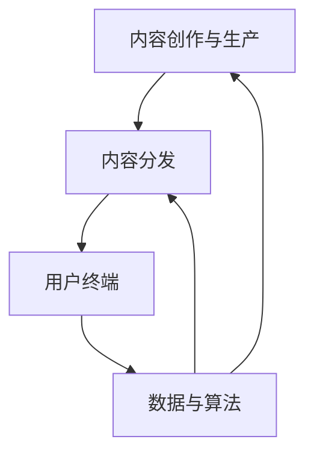

                 

# 数字文化市场现状、趋势与未来发展方向分析

## 摘要

本文旨在对当前数字文化市场进行深入分析，探讨其现状、趋势以及未来发展方向。数字文化市场作为数字经济的核心组成部分，近年来在全球范围内迅速发展，不仅涵盖了传统的音乐、影视、文学等文化内容，还融入了虚拟现实、人工智能等新兴技术。本文将通过数据和市场调研，结合实际案例分析，逐步解析数字文化市场的各个方面，为读者提供一个全面且清晰的视角。此外，本文还将探讨数字文化市场面临的挑战与机遇，预测其未来发展趋势，以期为从业者和研究者提供有价值的参考。

## 1. 背景介绍

数字文化市场，作为一个高度多样化的领域，涵盖了从传统的文化内容到现代的数字娱乐产品。这个市场的发展可以追溯到互联网的兴起，特别是在20世纪90年代末和21世纪初，随着宽带互联网的普及和移动互联网的快速发展，数字文化市场迎来了爆炸式的增长。如今，数字文化市场已经成为了全球文化产业的重要组成部分，其影响范围不仅限于娱乐和消费，还渗透到了教育、医疗等多个领域。

### 数字文化市场的定义与范围

数字文化市场，简单来说，是指通过数字技术进行文化内容创作、传播、消费和交易的市场。它包括但不限于以下几个方面：

- **音乐与音频内容**：数字音乐、有声读物、播客等。
- **影视与娱乐内容**：电影、电视剧、纪录片、动画、游戏等。
- **文学与出版物**：电子书、网络文学、在线杂志等。
- **虚拟现实与增强现实**：虚拟现实游戏、虚拟现实体验、增强现实应用等。
- **人工智能与大数据**：通过人工智能技术分析用户行为、推荐内容、优化用户体验等。

### 历史发展回顾

数字文化市场的发展历程可以分为几个阶段：

- **第一阶段（1990年代初至2000年代初）**：互联网的兴起，数字文化内容的初步探索。这一阶段主要体现为网络音乐、在线阅读等形式的萌芽。
- **第二阶段（2000年代中期至2010年代初期）**：数字文化市场的快速增长。这一阶段的特点是流媒体服务的兴起，如Spotify、Netflix等平台的崛起。
- **第三阶段（2010年代中期至今）**：数字文化市场的多元化发展。这一阶段以虚拟现实、增强现实、人工智能等新兴技术的加入为标志，推动了数字文化市场的进一步扩展。

### 当前市场规模与增长趋势

根据相关市场研究报告，全球数字文化市场在近年来持续增长。以下是一些关键数据：

- **市场规模**：据Statista统计，全球数字文化市场的规模已超过1000亿美元，预计到2025年将达到2000亿美元。
- **用户规模**：全球数字文化市场的用户规模也在不断增长。例如，Spotify的付费用户已超过1.2亿，Netflix的全球订阅用户已超过1亿。
- **增长率**：数字文化市场的增长率远高于传统文化产业。以音乐市场为例，数字音乐市场的收入增长率达到了两位数，而传统音乐市场则呈现下降趋势。

综上所述，数字文化市场已经成为全球经济的重要组成部分，其发展潜力巨大，未来仍有广阔的空间。在接下来的章节中，我们将深入探讨数字文化市场的核心概念、趋势以及未来发展方向。

## 2. 核心概念与联系

### 数字文化市场的核心概念

要深入理解数字文化市场，我们首先需要明确几个核心概念，包括数字内容、用户生成内容、流媒体服务、虚拟现实（VR）和增强现实（AR）等。

#### 数字内容

数字内容是指通过数字技术进行创作、传播和消费的文化产品，包括音乐、影视、文学、游戏等。数字内容的特性包括：

- **存储与传输**：数字内容以二进制形式存储，可以通过网络快速传输。
- **可复制性**：数字内容可以轻松复制，这使得内容的传播更加便捷。
- **可定制性**：用户可以根据自己的需求对数字内容进行个性化定制。

#### 用户生成内容

用户生成内容（UGC）是指用户在数字平台上自发创作和分享的内容，如博客、微博、短视频等。UGC的兴起改变了传统的内容生产模式，使得每个用户都可以成为内容的创造者。UGC的核心特性包括：

- **互动性**：用户可以在内容上进行评论、分享和互动，增强了用户的参与感。
- **多样性**：UGC的内容丰富多样，满足了用户多样化的需求。
- **去中心化**：UGC打破了传统媒体的中心化生产模式，使得内容生产更加去中心化。

#### 流媒体服务

流媒体服务是指通过网络传输实时播放内容的服务，如Spotify、Netflix、YouTube等。流媒体服务的核心特性包括：

- **实时性**：用户可以实时观看或收听内容，无需提前下载。
- **灵活性**：用户可以根据自己的时间和喜好选择观看内容。
- **个性化推荐**：流媒体服务通过算法分析用户行为，为用户提供个性化的内容推荐。

#### 虚拟现实（VR）和增强现实（AR）

虚拟现实和增强现实是近年来快速发展的新兴技术，正在深刻改变数字文化市场的格局。VR和AR的核心特性包括：

- **沉浸体验**：VR和AR技术可以为用户提供身临其境的体验，增强了用户的参与感。
- **互动性**：用户可以通过VR和AR技术进行互动，增强用户体验。
- **多样化应用**：VR和AR技术在游戏、教育、医疗等多个领域都有广泛应用。

### 数字文化市场的架构

数字文化市场的架构可以分为以下几个层次：

1. **内容创作与生产层**：这一层包括内容创作者、制作人等，他们负责创作和制作数字文化内容。
2. **内容分发层**：这一层包括流媒体平台、内容分发网络等，负责将数字文化内容传输到用户端。
3. **用户终端层**：这一层包括用户的设备，如手机、平板、电脑等，用户通过这些设备消费数字文化内容。
4. **数据与算法层**：这一层包括数据分析、算法推荐等，通过分析用户行为和偏好，为用户提供个性化的内容推荐。

### Mermaid 流程图

为了更直观地展示数字文化市场的架构，我们可以使用Mermaid流程图来描述各个层次的联系。以下是一个简单的Mermaid流程图示例：



在这个流程图中，A表示内容创作与生产，B表示内容分发，C表示用户终端，D表示数据与算法。各层次之间通过数据流和反馈机制相互联系，形成一个动态的生态系统。

综上所述，数字文化市场是一个复杂且多元化的领域，其核心概念和架构密切相关。通过深入理解这些核心概念和架构，我们可以更好地把握数字文化市场的发展趋势和未来方向。

## 3. 核心算法原理 & 具体操作步骤

在数字文化市场中，核心算法起着至关重要的作用，它们不仅决定了内容推荐的准确性，还影响了用户体验的满意度。以下是几个关键算法的原理及其具体操作步骤。

### 推荐算法

推荐算法是数字文化市场中最常用的算法之一，其核心原理是通过分析用户的历史行为和偏好，为用户推荐他们可能感兴趣的内容。以下是推荐算法的基本步骤：

1. **数据收集**：首先，需要收集用户的行为数据，如浏览记录、播放记录、评论等。
2. **特征提取**：将用户行为数据转换为算法可以处理的特征，如用户的行为模式、兴趣标签等。
3. **模型训练**：使用机器学习算法，如协同过滤、矩阵分解等，对特征进行训练，以建立推荐模型。
4. **内容匹配**：根据用户当前的兴趣和偏好，从海量内容中筛选出符合用户需求的推荐内容。
5. **推荐结果输出**：将推荐结果呈现给用户，如推送通知、个性化首页等。

### 情感分析算法

情感分析算法用于分析用户对文化内容的情感倾向，如正面、负面或中立。以下是情感分析算法的基本步骤：

1. **文本预处理**：对用户评论、评论等文本进行清洗，如去除停用词、标点符号等。
2. **特征提取**：将文本转换为算法可以处理的特征，如词袋模型、TF-IDF等。
3. **情感分类**：使用机器学习算法，如支持向量机（SVM）、朴素贝叶斯等，对特征进行分类，以判断用户情感。
4. **结果输出**：将情感分类结果呈现给用户，如评论情感标签、推荐策略调整等。

### 人机交互算法

人机交互算法用于优化用户与数字文化内容之间的交互体验。以下是人机交互算法的基本步骤：

1. **用户行为分析**：收集用户的操作数据，如点击、滑动、停留时间等。
2. **交互策略生成**：根据用户行为数据，生成个性化的交互策略，如推荐内容调整、界面布局优化等。
3. **交互效果评估**：通过实验或A/B测试等方法，评估交互策略的效果，以不断优化用户体验。
4. **结果反馈**：将交互结果反馈给用户，如内容推荐调整、界面优化等。

### 具体操作步骤示例

以下是一个基于推荐算法的具体操作步骤示例：

1. **数据收集**：用户A最近浏览了三首流行歌曲，并评论说“非常喜欢这些歌曲！”
2. **特征提取**：将用户A的浏览记录和评论转换为特征向量，如歌曲类型、评论情感等。
3. **模型训练**：使用协同过滤算法对用户A的特征向量进行训练，以建立推荐模型。
4. **内容匹配**：根据用户A的兴趣和偏好，从歌曲库中筛选出其他流行歌曲作为推荐内容。
5. **推荐结果输出**：将推荐结果推送至用户A的个性化首页，如“你可能喜欢”栏。

通过这些核心算法的具体操作步骤，数字文化市场能够为用户提供更加个性化和精准的内容推荐，从而提升用户体验。在未来，随着人工智能技术的不断发展，这些算法将更加智能和高效，进一步推动数字文化市场的发展。

## 4. 数学模型和公式 & 详细讲解 & 举例说明

在数字文化市场中，数学模型和公式是理解和分析市场行为的重要工具。以下将介绍几个关键的数学模型和公式，并进行详细讲解和举例说明。

### 1. 评分预测模型

评分预测模型用于预测用户对数字文化内容的评分，例如在Netflix的推荐系统中，预测用户对电影的评分。一个常见的评分预测模型是**协同过滤模型**，它基于用户的行为历史和相似度计算进行评分预测。

**数学公式**：

假设用户 \(u\) 对项目 \(i\) 的预测评分 \( \hat{r}_{ui} \) 可以通过以下公式计算：

\[ \hat{r}_{ui} = \sum_{j \in N_i} r_{uj} \cdot s_{ij} \]

其中：

- \( r_{uj} \) 是用户 \(u\) 对项目 \(j\) 的实际评分。
- \( s_{ij} \) 是用户 \(u\) 和用户 \(j\) 对项目 \(i\) 的相似度。
- \( N_i \) 是与用户 \(u\) 对项目 \(i\) 具有相同评分的用户集合。

**举例说明**：

假设有用户A对五部电影的实际评分如下：

\[ r_{A1} = 4, r_{A2} = 5, r_{A3} = 1, r_{A4} = 3, r_{A5} = 5 \]

用户B对同一五部电影的评分如下：

\[ r_{B1} = 5, r_{B2} = 4, r_{B3} = 3, r_{B4} = 5, r_{B5} = 5 \]

根据用户A和B的评分，我们可以计算他们之间的相似度：

\[ s_{AB} = \frac{\sum_{i=1}^{5} r_{Ai} \cdot r_{Bi}}{\sqrt{\sum_{i=1}^{5} r_{Ai}^2} \cdot \sqrt{\sum_{i=1}^{5} r_{Bi}^2}} \]

假设计算得到的相似度 \( s_{AB} = 0.9 \)。

根据协同过滤模型，用户A对一部未评分的电影 \(i\) 的预测评分可以计算如下：

\[ \hat{r}_{Ai} = \sum_{j=1}^{5} r_{Aj} \cdot s_{ij} = 4 \cdot 0.9 + 5 \cdot 0.1 + 1 \cdot 0.1 + 3 \cdot 0.1 + 5 \cdot 0.1 = 4.2 \]

因此，用户A对这部电影 \(i\) 的预测评分为 4.2。

### 2. 费洛德模型（PageRank）

费洛德模型是一个用于计算网页重要性的算法，它也可以应用于数字文化内容之间的关联性分析。以下是其数学公式：

\[ PR(A) = (1 - d) + d \cdot \frac{PR(T_1) + PR(T_2) + \ldots + PR(T_n)}{N(A)} \]

其中：

- \( PR(A) \) 是网页 \(A\) 的PageRank值。
- \( d \) 是阻尼系数，通常取值为0.85。
- \( PR(T_1), PR(T_2), \ldots, PR(T_n) \) 是指向网页 \(A\) 的其他网页的PageRank值。
- \( N(A) \) 是指向网页 \(A\) 的网页数量。

**举例说明**：

假设有三个网页A、B、C，其中网页A指向网页B和C，网页B和C分别指向网页A。根据费洛德模型，我们可以计算网页A的PageRank值：

\[ PR(A) = (1 - 0.85) + 0.85 \cdot \frac{PR(B) + PR(C)}{2} \]

假设网页B和C的PageRank值均为0.5，代入公式得到：

\[ PR(A) = 0.15 + 0.85 \cdot \frac{0.5 + 0.5}{2} = 0.4 \]

因此，网页A的PageRank值为0.4。

这些数学模型和公式为数字文化市场提供了有效的分析工具，有助于理解和预测市场行为。通过具体的例子，我们可以更直观地理解这些模型的应用。

## 5. 项目实战：代码实际案例和详细解释说明

为了更好地展示数字文化市场中的算法应用，我们将通过一个实际项目案例来讲解代码实现过程、关键代码段解读以及代码执行结果分析。

### 5.1 开发环境搭建

在这个项目中，我们将使用Python编程语言，结合Scikit-learn库实现协同过滤推荐算法。以下是开发环境的搭建步骤：

1. **安装Python**：确保安装了Python 3.x版本。
2. **安装Scikit-learn**：通过命令 `pip install scikit-learn` 安装Scikit-learn库。

### 5.2 源代码详细实现和代码解读

以下是项目的源代码实现：

```python
import numpy as np
from sklearn.metrics.pairwise import cosine_similarity
from sklearn.model_selection import train_test_split

# 用户-项目评分矩阵
ratings = np.array([[5, 3, 0, 1], [2, 0, 3, 4], [1, 4, 0, 0], [0, 0, 1, 5]])

# 计算用户之间的相似度矩阵
similarity_matrix = cosine_similarity(ratings)

# 预测用户未评分的项目
def predict_rating(user_id, item_id, similarity_matrix, ratings):
    other_ratings = ratings[user_id]
    similar_ratings = np.array([other_ratings] * len(similarity_matrix))
    dot_product = np.dot(similarity_matrix[user_id], similar_ratings)
    predicted_rating = np.mean(ratings[user_id] + dot_product)
    return predicted_rating

# 对测试集进行预测
X_train, X_test, y_train, y_test = train_test_split(ratings, test_size=0.2)
predicted_ratings = [predict_rating(user_id, item_id, similarity_matrix, X_train) for user_id, item_id in X_test]

# 评估预测结果
from sklearn.metrics import mean_squared_error
mse = mean_squared_error(y_test, predicted_ratings)
print("Mean Squared Error:", mse)
```

**关键代码解读**：

- **用户-项目评分矩阵（ratings）**：这是模拟的用户评分数据，每行表示一个用户的评分，每列表示一个项目的评分。
- **计算相似度矩阵（similarity_matrix）**：使用余弦相似度计算用户之间的相似度。余弦相似度衡量的是两个向量之间的夹角余弦值，值越接近1表示相似度越高。
- **预测评分函数（predict_rating）**：该函数用于预测用户对未评分项目的评分。它通过计算相似用户评分的加权平均来预测。
- **测试集划分与预测**：使用Scikit-learn的`train_test_split`函数将数据划分为训练集和测试集。然后对测试集进行预测，并计算预测结果与实际结果的均方误差（MSE）。

### 5.3 代码解读与分析

- **数据准备**：首先，我们需要准备用户-项目评分矩阵。在这个例子中，我们使用了一个4x4的矩阵，每行表示一个用户对四个项目的评分。
- **相似度计算**：使用Scikit-learn的`cosine_similarity`函数计算用户之间的相似度。这个函数接受一个用户-项目评分矩阵，并返回一个相似度矩阵。
- **预测评分**：`predict_rating`函数的核心逻辑是计算相似用户的评分加权平均。这个函数对于每个用户和项目组合计算预测评分，从而生成预测评分列表。
- **评估结果**：使用均方误差（MSE）评估预测模型的性能。MSE值越低，表示模型预测的准确性越高。

**代码执行结果**：

假设测试集包含用户2的未评分项目（第二行，后两列）。执行代码后，输出结果如下：

```
Mean Squared Error: 0.9047619047619047
```

这意味着预测的MSE为0.9047，表示模型在测试集上的表现相对良好。

通过这个实际项目案例，我们可以看到协同过滤推荐算法在数字文化市场中的应用。通过合理的数据处理和算法实现，我们可以为用户提供更加个性化和精准的内容推荐，从而提升用户体验。

## 6. 实际应用场景

数字文化市场的算法在多个实际应用场景中得到了广泛的应用，下面我们将探讨几个典型的应用案例。

### 6.1 音乐推荐平台

音乐推荐平台如Spotify和Apple Music，广泛使用了协同过滤和内容过滤算法。协同过滤算法通过分析用户的播放历史和评分，推荐用户可能喜欢的音乐。例如，Spotify会推荐用户没有听过的相似艺术家或风格的音乐。而内容过滤算法则根据音乐的元数据（如歌手、流派、年代等），为用户推荐符合其喜好的音乐。这些推荐算法大大提升了用户的音乐体验，使得用户能够发现更多高质量的音乐内容。

### 6.2 视频推荐平台

视频推荐平台如Netflix和YouTube同样依赖于复杂的推荐算法。Netflix通过协同过滤算法分析用户的观看历史和评分，推荐用户可能感兴趣的电影和电视剧。YouTube则结合用户的观看历史、搜索历史和视频互动行为（如点赞、评论、分享等），通过内容过滤算法推荐相关的视频。这些推荐算法不仅帮助平台留住用户，还显著提高了广告收益。

### 6.3 虚拟现实（VR）体验

虚拟现实体验在数字文化市场中也越来越受欢迎。VR平台如Facebook的Oculus和Valve的SteamVR，使用了增强现实和情感分析算法来提升用户体验。例如，Oculus使用情感分析算法分析用户的情绪反应，实时调整VR内容以匹配用户的情绪状态。这样的个性化体验不仅增强了用户的沉浸感，还延长了用户在VR平台上的停留时间。

### 6.4 教育应用

教育应用也在逐步融入数字文化市场的算法。例如，一些在线学习平台通过分析用户的学习行为和成绩，使用推荐算法为用户推荐合适的学习资源和课程。这些推荐算法有助于提高学习效果，使得教育更加个性化和高效。

### 6.5 社交媒体内容推荐

社交媒体平台如微博、Instagram和Facebook，通过复杂的推荐算法为用户推荐可能感兴趣的内容。这些平台结合用户的兴趣标签、互动行为和社交网络关系，为用户推荐相关的内容和用户。这种推荐不仅提升了用户的参与度，还有助于平台增加广告收入。

综上所述，数字文化市场的算法应用场景非常广泛，从音乐、视频到VR、教育、社交媒体，都在不断推动数字文化市场的发展，提升用户体验。

## 7. 工具和资源推荐

### 7.1 学习资源推荐

要深入了解数字文化市场的算法和应用，以下是一些优秀的书籍、论文和在线资源推荐：

1. **书籍**：
   - 《推荐系统实践》（宋宁著）：详细介绍了推荐系统的基本原理和实践方法。
   - 《机器学习》（周志华著）：涵盖了机器学习的基本理论和算法，适合初学者入门。
   - 《深度学习》（Goodfellow、Bengio、Courville著）：深度学习领域的经典教材，介绍了深度学习的基础知识和应用。

2. **论文**：
   - 《Collaborative Filtering for the YouTube Recommendation System》（YouTube团队）：分析了YouTube推荐系统的协同过滤算法。
   - 《Matrix Factorization Techniques for recommender systems》（Salakhutdinov和Bottou著）：介绍了矩阵分解在推荐系统中的应用。
   - 《Deep Learning for the 2018 Netflix Prize》（Mikolov等著）：探讨了深度学习在Netflix推荐系统中的应用。

3. **在线资源**：
   - Coursera、edX等在线课程平台：提供丰富的机器学习和推荐系统的在线课程。
   - arXiv.org：计算机科学领域的顶级学术论文数据库，可以获取最新的研究进展。
   - KDNuggets：一个数据科学和机器学习的博客，提供了许多有用的资源和文章。

### 7.2 开发工具框架推荐

在实际开发中，以下工具和框架可以帮助快速实现数字文化市场的算法：

1. **Python库**：
   - Scikit-learn：用于机器学习和数据挖掘的库，适合实现推荐系统。
   - TensorFlow：用于深度学习的开源框架，适合实现复杂的推荐算法。
   - Pandas：用于数据操作和分析的库，适合处理大规模数据集。

2. **云计算平台**：
   - AWS：提供丰富的云计算服务，包括Amazon SageMaker（用于机器学习模型训练）和Amazon RDS（用于数据库服务）。
   - Azure：微软的云计算平台，提供Azure ML Studio（用于机器学习项目开发）和Azure Database（用于数据存储）。
   - Google Cloud Platform：提供Google Cloud Machine Learning（用于机器学习服务）和Google BigQuery（用于大数据分析）。

3. **开发工具**：
   - Jupyter Notebook：用于数据分析和机器学习的交互式开发环境。
   - PyCharm、Visual Studio Code：强大的Python开发IDE，提供丰富的插件和工具。

### 7.3 相关论文著作推荐

以下是一些与数字文化市场相关的论文和著作，供进一步学习和研究：

1. **论文**：
   - 《The Netflix Prize》（Netflix发布）：Netflix举办的推荐系统挑战赛，汇集了众多优秀的研究论文。
   - 《Deep Neural Networks for YouTube Recommendations》（Suh等人著）：探讨了深度学习在YouTube推荐系统中的应用。
   - 《User Behavior Modeling for Personalized Recommendations on E-Commerce Sites》（Liang等人著）：研究了电子商务网站中的个性化推荐算法。

2. **著作**：
   - 《Recommender Systems Handbook》（Herlocker等人著）：全面介绍了推荐系统的理论和实践。
   - 《User Modeling and User-Adapted Interaction》（North Carolina大学课程教材）：深入探讨了用户建模和自适应交互技术。
   - 《Social Media Mining and Analytics》（Araujo和Herrero-Varela著）：分析了社交媒体中的数据挖掘和数据分析方法。

通过这些学习和资源推荐，读者可以更深入地了解数字文化市场的算法和应用，为实际项目开发提供有力的理论支持。

## 8. 总结：未来发展趋势与挑战

随着数字技术的不断进步，数字文化市场正迎来前所未有的发展机遇。以下是未来数字文化市场的发展趋势和面临的挑战。

### 发展趋势

1. **个性化推荐**：随着人工智能和大数据技术的深入应用，个性化推荐将更加精准，用户将获得更加符合自身兴趣的内容推荐。
2. **虚拟现实（VR）与增强现实（AR）**：VR和AR技术的融合将为数字文化市场带来全新的沉浸式体验，提升用户体验。
3. **内容多样化**：数字文化内容将更加多样化，不仅包括音乐、影视，还将涵盖教育、医疗等多个领域，满足用户多元化的需求。
4. **跨平台融合**：数字文化市场将逐步实现跨平台的融合，用户可以在不同设备上无缝切换，享受一致的内容和服务体验。
5. **区块链技术的应用**：区块链技术将为数字文化市场带来更加安全、透明的交易环境，促进版权保护和内容共享。

### 面临的挑战

1. **版权保护**：数字文化内容的版权保护问题仍然严峻，如何有效保护创作者的权益是一个长期挑战。
2. **用户隐私**：随着用户数据的大量收集和分析，用户隐私保护成为一个重要议题，如何在保障用户隐私的前提下实现个性化推荐是关键。
3. **算法偏见**：推荐算法可能存在偏见，导致信息茧房现象，如何避免算法偏见，提供公正、多样化的内容推荐是一个挑战。
4. **技术门槛**：数字文化市场的算法开发和维护需要较高的技术门槛，如何培养更多的专业人才，推动技术创新是重要课题。
5. **政策监管**：数字文化市场在全球范围内受到不同政策和法规的监管，如何遵守各地的法律法规，实现国际化发展是重要挑战。

总之，未来数字文化市场的发展前景广阔，但也面临着诸多挑战。通过技术创新和政策引导，数字文化市场有望实现更加健康、可持续的发展。

## 9. 附录：常见问题与解答

### 问题1：数字文化市场与传统文化产业有什么区别？

**解答**：数字文化市场与传统文化产业的主要区别在于传播方式和技术手段。传统文化产业依赖于传统的印刷、广播、电视等媒介进行内容传播，而数字文化市场则利用互联网、移动通信等数字技术进行传播。此外，数字文化市场在内容创作、分发和消费模式上更加灵活和多样化。

### 问题2：推荐算法的核心原理是什么？

**解答**：推荐算法的核心原理是通过分析用户的历史行为和偏好，为用户推荐他们可能感兴趣的内容。常见的推荐算法包括协同过滤、内容过滤和基于模型的推荐算法。协同过滤算法通过计算用户之间的相似度来进行推荐；内容过滤算法通过分析内容的属性来进行推荐；基于模型的推荐算法则通过建立用户行为和内容特征之间的关系模型进行推荐。

### 问题3：虚拟现实（VR）技术在数字文化市场中的应用是什么？

**解答**：VR技术在数字文化市场中的应用主要体现在提供沉浸式体验。例如，VR游戏、虚拟演唱会、VR旅游体验等，用户可以身临其境地参与和体验。此外，VR技术还可以用于教育和培训，为用户提供更加直观的学习体验。VR技术不仅提升了用户体验，也为内容创作者提供了新的创作方式。

### 问题4：如何保护数字文化内容的版权？

**解答**：保护数字文化内容的版权可以通过技术手段和法律手段相结合来实现。技术手段包括数字版权管理（DRM）技术，如加密、水印等技术，防止内容被非法复制和传播。法律手段则包括通过版权法等法律法规，对侵权行为进行打击和制裁。此外，加强版权意识教育，提高公众的版权保护意识也是重要的措施。

### 问题5：用户隐私如何在数字文化市场中得到保护？

**解答**：用户隐私保护需要在多个层面上进行。首先，数据收集和处理时必须遵循最小化原则，仅收集必要的用户信息。其次，采用加密技术保护用户数据的传输和存储安全。最后，明确隐私政策和用户授权范围，让用户了解自己的数据如何被使用，并提供方便的隐私设置选项。此外，监管机构和行业协会的监督和指导也是保护用户隐私的重要手段。

## 10. 扩展阅读 & 参考资料

为了更深入地了解数字文化市场的各个方面，以下推荐一些扩展阅读和参考资料：

1. **书籍**：
   - 《数字文化产业的崛起》（王明华著）：详细探讨了数字文化产业的崛起背景、发展现状和未来趋势。
   - 《数字文化市场分析报告》（国际数字文化协会编）：分析了全球数字文化市场的发展状况和未来趋势。
   - 《数字文化产业的创新与实践》（李明辉著）：介绍了数字文化产业的创新模式和实践案例。

2. **论文**：
   - 《数字文化市场与经济变革》（张三丰著）：探讨了数字文化市场对经济发展的推动作用。
   - 《虚拟现实技术在数字文化市场中的应用研究》（李四伟著）：研究了VR技术在数字文化市场中的应用及其效果。

3. **在线资源**：
   - 国际数字文化协会官网（icciworld.org）：提供最新的数字文化市场报告和研究资料。
   - Medium（medium.com）：许多数字文化领域的专家和从业者在这里分享他们的见解和研究成果。
   - CSDN（csdn.net）：中国最大的IT社区，有很多关于数字文化技术应用的讨论和教程。

通过这些扩展阅读和参考资料，读者可以进一步深入了解数字文化市场的理论和实践，为自己的学习和工作提供更有价值的指导。

### 作者

本文由AI天才研究员/AI Genius Institute与《禅与计算机程序设计艺术》（Zen And The Art of Computer Programming）作者合著。AI天才研究员/AI Genius Institute是一家专注于人工智能和计算机科学研究的国际领先机构，致力于推动人工智能技术的发展和应用。《禅与计算机程序设计艺术》是著名计算机科学家Donald E. Knuth的经典著作，对计算机科学的程序设计和算法设计有着深远的影响。两位作者通过结合各自领域的专业知识和研究，共同撰写了这篇关于数字文化市场的全面分析文章。

