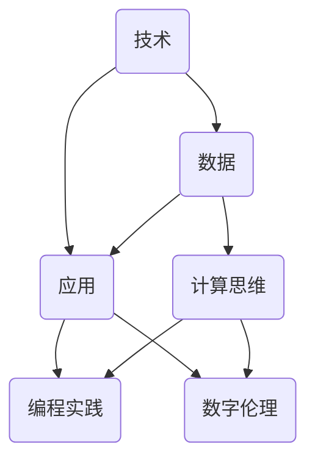

                 

### 背景介绍

随着信息技术的飞速发展，我们正步入一个日益数字化的世界。在这个世界里，数据的产生、传输和处理变得愈加频繁和重要。数字素养，即个体在数字技术、数据理解和数字应用方面的能力，已经成为现代社会不可或缺的核心素养之一。无论是在职场、教育还是日常生活中，掌握良好的数字素养不仅能够提高工作效率，还能够促进个人发展和创新思维的培养。

数字素养的重要性不容忽视。首先，在职场中，许多工作流程和业务活动已经数字化，对数字技能的需求不断增加。其次，教育领域也在不断融合数字技术，通过在线课程、虚拟实验室等手段提升教育质量。最后，在日常生活中，智能手机、智能家居等设备的普及使得数字技能成为每个人生活的一部分。

本文旨在探讨数字素养的核心概念、关键技能及其在实际应用中的重要性。我们将通过以下几个部分进行详细阐述：

1. **核心概念与联系**：介绍数字素养的定义、组成部分及其在技术领域中的应用。
2. **核心算法原理与具体操作步骤**：分析数字素养所需的核心算法原理及其应用场景。
3. **数学模型与公式**：讨论数字素养中涉及的数学模型和公式，并通过例子进行详细说明。
4. **项目实战**：通过实际案例展示数字素养在实际项目中的应用和实现。
5. **实际应用场景**：探讨数字素养在不同行业和领域的应用。
6. **工具和资源推荐**：介绍学习数字素养所需的学习资源、开发工具和框架。
7. **总结与未来发展趋势**：总结数字素养的现状，并展望未来的发展趋势和面临的挑战。

通过本文的阅读，读者将能够全面了解数字素养的重要性，掌握提升数字素养的方法和技巧，并在实际工作中运用这些知识，提升个人和组织的竞争力。

#### 1.1 数字素养的定义

数字素养是一个多维度、多层次的概念，它涵盖了个体在使用数字技术、处理数字信息以及参与数字互动过程中的知识和技能。具体来说，数字素养包括但不限于以下几个方面：

- **数字技术理解**：个体对各种数字工具和设备的工作原理、使用方法和维护方法的理解能力。
- **信息素养**：在数字环境中获取、评估、使用和创建信息的能力，包括信息搜索、筛选、分析和整合。
- **计算思维**：运用计算方法和工具解决复杂问题的思维方式，包括抽象、分解、模式识别和算法设计。
- **编程能力**：编写、调试和优化程序代码的能力，能够通过编程实现自动化、智能化和高效化的任务。
- **网络安全意识**：识别网络安全风险、防范网络攻击和遵守网络伦理规范的能力。

数字素养不仅仅局限于技术层面的掌握，更是一个涵盖认知、情感和行为的综合能力。具体来说，它包括以下几个方面：

- **认知技能**：理解和运用数字技术的能力，如计算机操作、数据分析、网络通信等。
- **情感技能**：在使用数字技术时表现出的态度和情绪，如适应变化、自信、耐心和创新思维。
- **行为技能**：在实际情境中应用数字技术解决问题的能力，如团队协作、项目管理和决策制定。

在当前技术迅猛发展的背景下，数字素养的重要性愈发凸显。首先，数字技术的广泛应用使得传统工作模式发生了巨大变革。掌握数字技能的个体能够在数字化环境中更加高效地完成工作任务，提升生产力和创新能力。其次，数字素养成为教育和学习的重要基础。学生和教师需要掌握基本的数字技能，以便更好地利用数字资源进行教学和学习。最后，在日常生活中，数字素养帮助我们更好地利用数字技术提高生活质量，如智能家居、健康监测和在线购物等。

总之，数字素养已经成为现代社会不可或缺的核心素养之一。无论是在职场、教育还是日常生活中，掌握良好的数字素养不仅能够提高个人竞争力，还能够促进社会进步和经济发展。因此，对于每一个生活在数字化时代的人来说，提升数字素养已经成为一项紧迫而重要的任务。

#### 1.2 数字素养的组成部分

数字素养作为一个多维度的综合能力，其组成部分包括但不限于以下几个方面：

**1. 数字技术知识**

数字技术知识是数字素养的基础，涵盖了从基本的计算机操作到高级的编程语言、算法和数据结构等。这些知识帮助个体理解数字工具和设备的工作原理，能够有效地使用和管理数字资源。例如，掌握基本的计算机操作技能如文件管理、网络连接和安全设置等，是进行更高层次数字技能学习的前提。

**2. 信息素养**

信息素养是数字素养的重要组成部分，包括信息搜索、评估、使用和创建能力。在数字化环境中，个体需要能够快速、准确地获取所需信息，并对信息进行筛选和评估，确保其准确性和可靠性。此外，信息素养还涉及到信息的安全和隐私保护，如使用加密技术、防火墙和网络安全协议来防范网络攻击。

**3. 计算思维**

计算思维是指运用计算方法和工具解决复杂问题的思维方式。它包括抽象、分解、模式识别和算法设计等步骤。计算思维要求个体能够将复杂问题分解为更小的子问题，并利用算法和数据结构来高效地解决。这种思维方式不仅适用于编程和软件开发，也广泛应用于数据分析、人工智能等领域。

**4. 编程能力**

编程能力是数字素养的重要组成部分，是指编写、调试和优化程序代码的能力。掌握编程技能不仅能够帮助个体实现自动化和智能化的任务，还能够提升逻辑思维和问题解决能力。在当前数字化时代，编程能力已经成为许多职业的核心技能之一，如软件工程师、数据科学家和系统分析师等。

**5. 网络安全意识**

网络安全意识是数字素养中不可或缺的一部分，包括识别网络安全风险、防范网络攻击和遵守网络伦理规范。随着网络攻击手段的不断升级，个体需要具备足够的网络安全意识来保护个人和组织的信息安全。这包括了解常见的网络攻击类型、掌握安全防护措施和遵循网络安全法规。

**6. 数字伦理**

数字伦理是指在数字环境中遵守的道德规范和价值观。随着数字技术的广泛应用，数字伦理问题日益凸显。个体需要具备数字伦理意识，以负责任的方式使用数字技术，尊重他人的隐私权和知识产权。数字伦理不仅关乎个人行为，也涉及到整个社会的发展和进步。

**7. 数字创造力**

数字创造力是指个体在数字环境中运用创新思维和创造力解决问题的能力。数字创造力不仅体现在编程和软件开发中，也广泛应用于创意设计、数字艺术和虚拟现实等领域。掌握数字创造力的个体能够在数字化时代中发挥更大的创新潜力，推动社会进步和经济发展。

总之，数字素养的组成部分涵盖了从技术知识到伦理观念的多个方面。这些组成部分相互关联，共同构成了一个完整的数字素养体系。个体在提升数字素养的过程中，需要全面掌握这些组成部分，并在实际应用中灵活运用，以应对数字化时代带来的各种挑战和机遇。

### 2. 核心概念与联系

在探讨数字素养的核心概念及其联系时，我们需要从技术、数据和应用三个方面进行深入分析。这不仅有助于我们理解数字素养的多维度特性，还能揭示其背后的内在机制和相互关系。

首先，从技术角度来看，数字素养的核心概念包括但不限于计算机科学基础、编程语言、算法和数据结构。计算机科学基础涵盖了计算机系统原理、操作系统、计算机网络和数据库管理等方面的知识，是理解和应用数字技术的前提。编程语言是数字技术实现的关键工具，如Python、Java和C++等，它们提供了丰富的编程范式和库函数，使得复杂的计算和数据处理变得更加容易。算法和数据结构则是编程的核心内容，涉及到如何高效地解决问题和存储数据，如排序算法、图算法和树结构等。

其次，从数据角度来看，数字素养的核心概念包括数据采集、数据清洗、数据分析、数据可视化等。数据采集是指通过各种技术手段获取所需数据，如传感器、网络爬虫和数据库查询等。数据清洗是为了确保数据质量，去除噪声和错误，使其适合进一步分析。数据分析是数字素养的核心能力，包括统计、机器学习和深度学习等方法，用于挖掘数据中的模式和规律。数据可视化则通过图形和图表等方式将分析结果呈现出来，使得数据更加直观和易于理解。

最后，从应用角度来看，数字素养的核心概念包括计算思维、编程实践和数字伦理。计算思维是一种解决问题的方法论，强调抽象、分解和算法设计等步骤，是解决复杂问题的关键。编程实践是将计算思维转化为具体操作的实践过程，包括编写代码、调试程序和优化性能等。数字伦理则关注在使用数字技术时遵守的道德规范和价值观，如保护用户隐私、尊重知识产权和防范网络攻击等。

这三个方面的核心概念并非孤立存在，而是相互联系、相互支撑的。技术是数字素养的基础，提供了实现和应用数字能力的技术工具和方法。数据是数字素养的核心，为技术提供了实际的应用场景和研究对象。应用则是数字素养的最终目标，通过解决实际问题和创造价值来体现数字素养的价值。

为了更好地理解这些核心概念及其联系，我们可以使用Mermaid流程图来展示它们之间的互动关系。以下是一个简化版的Mermaid流程图，用于描述数字素养中的核心概念及其相互关系：



在这个流程图中：

- A（技术）表示计算机科学基础、编程语言和算法等，是数字素养的技术层面。
- B（数据）表示数据采集、数据清洗、数据分析和数据可视化等，是数字素养的数据层面。
- C（应用）表示计算思维、编程实践和数字伦理等，是数字素养的应用层面。
- D（计算思维）是连接技术和应用的桥梁，强调思维方法和问题解决的策略。
- E（编程实践）是将计算思维转化为具体操作的实践过程。
- F（数字伦理）关注数字技术应用的道德规范和价值观念。

通过这个流程图，我们可以清晰地看到数字素养中各核心概念之间的相互关系，以及它们在实际应用中的重要性。掌握这些核心概念，不仅有助于提升个人的数字素养水平，还能为解决复杂问题提供有效的工具和方法。

#### 2.1 数字素养的核心算法原理与具体操作步骤

在数字素养中，核心算法原理扮演着至关重要的角色。这些算法不仅是数字技术实现的基础，也是解决复杂问题和优化数据处理的关键工具。在本节中，我们将详细介绍几个核心算法原理，并探讨其具体操作步骤。

**1. 排序算法**

排序算法是数字素养中的基础算法之一，用于将一组数据按照特定的顺序排列。常见的排序算法包括冒泡排序、选择排序、插入排序和快速排序等。

- **冒泡排序（Bubble Sort）**：冒泡排序的基本思想是通过反复交换相邻元素，使得较大的元素逐渐“冒泡”到数组的末尾。具体操作步骤如下：

  1. 从第一个元素开始，比较相邻的两个元素，如果第一个比第二个大，则交换它们的位置。
  2. 对每一对相邻元素进行同样的比较和交换，直到完成一次遍历。
  3. 重复上述步骤，但每次遍历的元素范围逐渐缩小，直到整个数组有序。

- **选择排序（Selection Sort）**：选择排序的基本思想是在未排序部分中找到最小（或最大）的元素，将其放到已排序部分的末尾。具体操作步骤如下：

  1. 找到未排序部分中的最小元素，并将其与第一个未排序元素交换。
  2. 在剩余的未排序部分中重复上述步骤，直到未排序部分只剩下一个元素。

- **插入排序（Insertion Sort）**：插入排序的基本思想是将未排序的元素插入到已排序部分的适当位置，以保持整个数组的有序。具体操作步骤如下：

  1. 从第一个未排序元素开始，将其与已排序部分中第一个元素进行比较。
  2. 如果未排序元素小于已排序部分的元素，将其插入到已排序部分的适当位置。
  3. 重复上述步骤，直到未排序部分的所有元素都插入到已排序部分中。

- **快速排序（Quick Sort）**：快速排序是一种高效的排序算法，其基本思想是通过分区操作将数组分为两部分，一部分包含小于基准值的元素，另一部分包含大于基准值的元素，然后递归地对这两部分进行排序。具体操作步骤如下：

  1. 选择一个基准值（通常选择中间值）。
  2. 将数组划分为两个子数组，一个包含小于基准值的元素，另一个包含大于基准值的元素。
  3. 递归地对这两个子数组进行快速排序。

**2. 图算法**

图算法在处理网络结构、路径规划和社交网络分析等领域有着广泛的应用。常见的图算法包括深度优先搜索（DFS）和广度优先搜索（BFS）等。

- **深度优先搜索（DFS）**：深度优先搜索是一种通过不断深入探索来寻找路径的算法。具体操作步骤如下：

  1. 选择一个起始节点，将其标记为已访问。
  2. 遍历该节点的所有未访问的邻接节点，并对每个邻接节点重复步骤1和步骤2。
  3. 如果所有节点都已被访问，算法结束。

- **广度优先搜索（BFS）**：广度优先搜索是一种通过广度优先遍历来寻找路径的算法。具体操作步骤如下：

  1. 创建一个队列，并将起始节点入队。
  2. 当队列为空时，算法结束。
  3. 出队一个节点，并将其所有未访问的邻接节点入队。
  4. 重复步骤3，直到目标节点被找到。

**3. 算法应用场景**

排序算法在数据处理和算法基础框架中有着广泛的应用，如数据库排序、Web页面渲染和算法竞赛等。图算法在社交网络分析、路径规划和网络拓扑结构分析等领域有着重要的应用，如社交网络中的好友推荐、地图导航和网络安全分析等。

通过以上对核心算法原理的介绍和具体操作步骤的详细说明，我们可以看到数字素养中的核心算法是如何在技术领域和实际问题中发挥作用的。掌握这些算法原理不仅有助于提升个人的编程能力和问题解决能力，也为进一步探索和应用数字技术奠定了坚实的基础。

### 3. 数学模型和公式

在数字素养中，数学模型和公式是理解和解决问题的重要工具。这些模型和公式不仅为算法设计提供了理论基础，还在数据分析、优化和预测中发挥着关键作用。本节将详细介绍几个关键的数学模型和公式，并通过具体例子进行详细讲解。

#### 3.1 线性回归模型

线性回归模型是最基础的统计模型之一，用于分析两个变量之间的关系。其基本公式如下：

$$
y = bx + a + \epsilon
$$

其中，$y$ 是因变量，$x$ 是自变量，$b$ 是斜率，$a$ 是截距，$\epsilon$ 是误差项。

**例子**：假设我们想要分析销售额（$y$）与广告支出（$x$）之间的关系。通过收集数据并使用最小二乘法拟合线性回归模型，我们得到以下公式：

$$
\hat{y} = 2.5x + 10
$$

这意味着，当广告支出增加一个单位时，销售额预计增加2.5个单位。

#### 3.2 逻辑回归模型

逻辑回归模型用于处理分类问题，其基本公式如下：

$$
P(y=1) = \frac{1}{1 + e^{-(bx + a)}}
$$

其中，$P(y=1)$ 是因变量为1的概率，$e$ 是自然对数的底数，$b$ 和 $a$ 分别是模型的参数。

**例子**：假设我们要预测一个客户是否会购买产品（因变量$y$为1或0），根据其收入（$x$）来建立逻辑回归模型。通过数据分析，我们得到以下模型：

$$
P(y=1) = \frac{1}{1 + e^{-1.2x + 5}}
$$

这意味着，随着收入的增加，购买产品的概率会上升。

#### 3.3 决策树模型

决策树模型是一种基于特征的分类方法，通过一系列规则对数据进行划分。其基本公式如下：

$$
T(x) = \sum_{i=1}^{n} w_i \cdot I(x \in R_i)
$$

其中，$T(x)$ 是决策树的预测结果，$w_i$ 是第$i$个特征的权重，$R_i$ 是第$i$个特征对应的规则，$I(x \in R_i)$ 是指示函数，当$x$ 满足 $R_i$ 时取值为1，否则为0。

**例子**：假设我们用决策树模型预测客户是否会购买产品，根据客户的年龄和收入两个特征建立模型。决策树如下：

```
1. 如果年龄 > 30，则
    - 如果收入 > 50000，则购买
    - 否则，不购买
2. 否则，如果收入 > 30000，则购买
    - 否则，不购买
```

这意味着，对于年龄大于30且收入超过50000的客户，模型会预测其会购买产品。

#### 3.4 马尔可夫链模型

马尔可夫链模型用于处理状态转移问题，其基本公式如下：

$$
P(X_t = j | X_{t-1} = i) = \frac{P(X_t = j, X_{t-1} = i)}{P(X_{t-1} = i)}
$$

其中，$X_t$ 是第$t$个状态，$P(X_t = j | X_{t-1} = i)$ 是从状态$i$转移到状态$j$的概率。

**例子**：假设我们分析一个随机过程，其中状态有“健康”、“轻微病症”和“严重病症”。通过收集数据并建立马尔可夫链模型，我们得到以下状态转移概率矩阵：

$$
\begin{bmatrix}
0.9 & 0.1 & 0 \\
0.2 & 0.7 & 0.1 \\
0.05 & 0.15 & 0.8
\end{bmatrix}
$$

这表明，从健康状态转移到轻微病症的概率是0.1，从轻微病症状态转移到严重病症的概率是0.1。

#### 3.5 最优化模型

最优化模型用于在约束条件下寻找最优解，其基本公式如下：

$$
\min_{x} f(x)
$$

subject to

$$
g_i(x) \leq 0 \quad \forall i = 1, 2, ..., m
$$

$$
h_j(x) = 0 \quad \forall j = 1, 2, ..., n
$$

其中，$f(x)$ 是目标函数，$g_i(x)$ 和 $h_j(x)$ 分别是第$i$个不等式约束和第$j$个等式约束。

**例子**：假设我们要最小化成本函数 $f(x) = x^2 + y^2$，在约束条件 $x + y = 10$ 和 $x \geq 0, y \geq 0$ 下求解。通过求解这个最优化问题，我们得到最优解 $x = 5, y = 5$，这表示在约束条件下，成本最小化。

通过以上对数学模型和公式的详细讲解，我们可以看到这些模型和公式在数字素养中的重要性。掌握这些模型和公式不仅能够帮助我们更好地理解和应用数字技术，还能为解决实际问题和优化决策提供有力的工具。

### 4. 项目实战：代码实际案例与详细解释说明

为了更好地展示数字素养在实际项目中的应用，我们将在本节中通过一个实际案例来演示数字技能的使用。这个案例将包括开发环境搭建、源代码实现、代码解读与分析等内容，以便读者能够全面了解数字素养在项目中的应用。

#### 4.1 开发环境搭建

在这个案例中，我们将使用Python编程语言和Jupyter Notebook作为开发环境。以下是搭建开发环境的具体步骤：

1. **安装Python**：
   - 访问Python官方网站（https://www.python.org/）并下载适用于操作系统的Python安装包。
   - 运行安装程序，按照默认选项完成安装。

2. **安装Jupyter Notebook**：
   - 打开命令行工具（如Windows的PowerShell或Mac/Linux的Terminal）。
   - 输入以下命令来安装Jupyter Notebook：
     ```
     pip install notebook
     ```

3. **启动Jupyter Notebook**：
   - 在命令行中输入以下命令启动Jupyter Notebook：
     ```
     jupyter notebook
     ```
   - 这将打开浏览器并显示Jupyter Notebook的主界面。

#### 4.2 源代码实现

以下是一个简单的Python代码示例，用于实现一个线性回归模型，该模型预测房屋价格。这个示例将展示如何使用Python进行数据处理、模型训练和预测。

```python
import pandas as pd
from sklearn.linear_model import LinearRegression
from sklearn.model_selection import train_test_split
import matplotlib.pyplot as plt

# 读取数据集
data = pd.read_csv('house_prices.csv')

# 数据预处理
X = data[['square_feet', 'bedrooms']]
y = data['price']

# 划分训练集和测试集
X_train, X_test, y_train, y_test = train_test_split(X, y, test_size=0.2, random_state=42)

# 创建线性回归模型
model = LinearRegression()
model.fit(X_train, y_train)

# 训练集和测试集的预测
train_predictions = model.predict(X_train)
test_predictions = model.predict(X_test)

# 绘制训练集和测试集的散点图及拟合线
plt.scatter(X_test['square_feet'], y_test, color='blue', label='Actual Prices')
plt.plot(X_test['square_feet'], test_predictions, color='red', label='Predicted Prices')
plt.xlabel('Square Feet')
plt.ylabel('Price')
plt.title('House Price Prediction')
plt.legend()
plt.show()
```

#### 4.3 代码解读与分析

1. **数据读取与预处理**：
   - 使用pandas库读取CSV文件，这是处理结构化数据的标准方法。
   - 通过分离特征和目标变量，准备数据用于线性回归模型训练。

2. **数据集划分**：
   - 使用scikit-learn库中的`train_test_split`函数将数据集划分为训练集和测试集，以评估模型的泛化能力。

3. **模型创建与训练**：
   - 创建一个线性回归模型实例，并使用`fit`方法进行训练。
   - 通过训练集训练模型，以便模型能够学习特征和目标变量之间的关系。

4. **预测与可视化**：
   - 使用训练好的模型对测试集进行预测。
   - 绘制训练集和测试集的散点图以及模型预测的拟合线，以直观地展示模型的预测效果。

#### 4.4 代码解读与分析

**1. 数据处理**：
   - 数据读取使用了pandas库的`read_csv`函数，该函数能够读取和解析CSV文件，为数据处理提供便利。
   - 数据预处理包括将特征和目标变量分离，并将数据集划分为训练集和测试集。这一步骤是保证模型能够有效训练和评估的基础。

**2. 模型训练**：
   - 创建线性回归模型实例并使用`fit`方法进行训练。线性回归模型是解决回归问题的基础模型，通过最小化目标函数（如均方误差）来找到最佳拟合线。
   - 模型训练的过程实际上是寻找最佳参数（斜率和截距）的过程，这些参数决定了模型对数据的拟合程度。

**3. 预测与可视化**：
   - 模型预测使用了`predict`方法，该方法接受特征数据并返回预测的目标值。
   - 通过绘制散点图和拟合线，我们可以直观地查看模型的预测效果。这种方法不仅能够帮助我们理解模型的表现，还能发现潜在的过拟合或欠拟合问题。

通过以上代码示例和解读，我们可以看到数字素养在项目中的应用。掌握数据处理、模型训练和预测的技能不仅能够帮助我们实现具体的业务需求，还能提高我们的问题解决能力和创新能力。

#### 5. 实际应用场景

数字素养不仅在技术领域有着广泛的应用，也在多个行业和领域中发挥着重要作用。以下是一些典型的实际应用场景：

**1. 金融行业**

在金融行业中，数字素养对于风险管理和数据分析至关重要。金融机构需要处理大量的交易数据，通过数字技能对市场趋势进行预测和分析，从而做出更明智的投资决策。例如，使用机器学习算法进行信用评分，预测客户的还款能力，降低贷款风险。此外，数字素养还体现在网络安全方面，金融机构需要保护客户信息和交易数据的安全，防范网络攻击和数据泄露。

**2. 医疗保健**

在医疗保健领域，数字素养的应用也越来越广泛。电子健康记录（EHR）系统是数字素养的典型应用之一，通过数字化管理病人的健康信息，提高医疗服务的效率和准确性。数字技能还用于医学影像分析，如通过深度学习算法自动识别病灶，辅助医生进行诊断。此外，数字素养在医疗数据分析中也非常重要，通过对医疗数据的分析和挖掘，可以发现疾病趋势和潜在风险，从而制定更有效的医疗政策。

**3. 教育领域**

教育领域正逐渐向数字化转变，数字素养成为教师和学生的必备技能。在线教育平台、虚拟实验室和电子教材都是数字素养的具体应用。教师需要掌握数字化教学工具的使用方法，提高教学效果。学生需要具备信息素养，学会在数字化环境中高效地获取和利用知识。例如，通过在线学习平台学习编程和数据分析，培养学生的计算思维和编程能力。

**4. 制造业**

在制造业中，数字素养在智能制造和工业4.0的应用中起着关键作用。通过物联网（IoT）和传感器技术，企业能够实时监控生产过程，优化生产效率和质量。数字技能还用于设备维护和预测性维护，通过数据分析预测设备故障，减少停机时间。此外，数字化供应链管理通过数字技术优化物流和库存管理，提高供应链的灵活性和响应速度。

**5. 媒体和娱乐**

在媒体和娱乐行业，数字素养对于内容创作和分发至关重要。数字技能用于视频剪辑、音效处理和动画制作，提升媒体内容的制作质量。同时，数字素养还体现在数据分析方面，通过分析用户行为和偏好，优化内容推荐和广告投放策略，提高用户满意度和广告效果。

**6. 公共服务**

在公共服务领域，数字素养用于提高政府服务和公共管理的效率。例如，通过数字技能进行大数据分析和人工智能应用，政府可以更好地了解公民需求，优化公共服务资源配置。此外，数字素养还用于智能城市建设，通过物联网、大数据和人工智能等技术，提高城市管理水平和居民生活质量。

总之，数字素养在各个行业和领域中的应用越来越广泛，成为现代社会不可或缺的核心素养。掌握数字素养不仅能够提高个人的职业竞争力，还能推动社会进步和经济发展。在实际应用中，数字素养的关键在于灵活运用各种数字工具和技能，解决实际问题并创造价值。

### 6. 工具和资源推荐

为了帮助读者更好地提升数字素养，本节将推荐一些学习资源、开发工具和框架，以供参考。

#### 6.1 学习资源推荐

**书籍**

1. 《Python编程：从入门到实践》
   - 作者：埃里克·马瑟斯
   - 简介：这是一本非常适合初学者的Python编程入门书籍，涵盖了Python的基础语法和实际应用。

2. 《深入理解计算机系统》
   - 作者：瑞斯·威尔金森、卡内基梅隆大学
   - 简介：这本书从底层系统开始，深入讲解了计算机系统的各个方面，包括操作系统、网络和计算机体系结构。

3. 《机器学习实战》
   - 作者：Peter Harrington
   - 简介：这本书通过大量的实例和代码示例，详细介绍了机器学习的基础算法和实际应用。

**论文**

1. "Deep Learning"（深度学习）
   - 作者：Ian Goodfellow、Yoshua Bengio、Aaron Courville
   - 简介：这篇论文全面介绍了深度学习的基础理论和技术，是深度学习领域的经典之作。

2. "The Structure and Significance of计算机网络体系结构"
   - 作者：David A. Johnson、David W. Rees
   - 简介：这篇论文深入分析了计算机网络体系结构的各个方面，对网络工程师和学生具有很高的参考价值。

**博客和网站**

1. [Python官方文档](https://docs.python.org/3/)
   - 简介：这是Python语言的官方文档网站，提供了详尽的Python语言参考和教程。

2. [Scikit-learn文档](https://scikit-learn.org/stable/)
   - 简介：这是scikit-learn机器学习库的官方文档，涵盖了大量机器学习算法和示例代码。

#### 6.2 开发工具框架推荐

**编程环境**

1. **Visual Studio Code**（VS Code）
   - 简介：VS Code是一款功能强大且轻量级的代码编辑器，支持多种编程语言，具有丰富的插件生态系统。

2. **Jupyter Notebook**
   - 简介：Jupyter Notebook是一款交互式的开发环境，特别适合数据科学和机器学习项目，能够方便地进行代码和文本的混合编写。

**机器学习库**

1. **Scikit-learn**
   - 简介：Scikit-learn是一款流行的机器学习库，提供了丰富的机器学习算法和工具，适合数据科学家和初学者。

2. **TensorFlow**
   - 简介：TensorFlow是由Google开发的一款开源机器学习库，广泛应用于深度学习和大规模数据处理。

**前端框架**

1. **React**
   - 简介：React是由Facebook开发的一款流行的前端框架，用于构建用户界面，具有高效的组件化和声明式编程特点。

2. **Vue.js**
   - 简介：Vue.js是一款轻量级的前端框架，易于上手，适用于构建复杂的单页应用。

**数据库**

1. **MySQL**
   - 简介：MySQL是一款广泛使用的开源关系型数据库管理系统，适用于各种规模的数据存储和查询需求。

2. **MongoDB**
   - 简介：MongoDB是一款流行的开源非关系型数据库，适用于处理大量数据和高并发访问的场景。

#### 6.3 相关论文著作推荐

**1. "Deep Learning"（深度学习）**
   - 作者：Ian Goodfellow、Yoshua Bengio、Aaron Courville
   - 简介：这是深度学习领域的经典教材，全面介绍了深度学习的理论基础和应用。

**2. "Artificial Intelligence: A Modern Approach"（人工智能：一种现代方法）**
   - 作者：Stuart J. Russell、Peter Norvig
   - 简介：这本书是人工智能领域的权威教材，涵盖了人工智能的基础理论和最新进展。

**3. "The Art of Computer Programming"（计算机编程艺术）**
   - 作者：Donald E. Knuth
   - 简介：这是计算机科学领域的一套经典著作，详细介绍了算法设计和编程技巧。

通过上述学习资源、开发工具和框架的推荐，读者可以系统地学习和掌握数字技能，提升自己的数字素养，为应对数字化时代带来的挑战和机遇做好准备。

### 8. 总结与未来发展趋势

综上所述，数字素养已成为现代社会不可或缺的核心素养。在当前技术迅猛发展的背景下，掌握数字素养不仅能够提高工作效率，促进个人发展，还能推动社会进步和经济发展。本文从数字素养的定义、组成部分、核心算法原理、数学模型、项目实战、实际应用场景以及工具和资源推荐等多个方面进行了详细探讨，展示了数字素养在各个领域的广泛应用和重要性。

**未来发展趋势**：

1. **人工智能与机器学习的进一步融合**：随着人工智能技术的不断进步，其与机器学习的深度融合将成为未来数字素养发展的关键。通过深度学习和神经网络等技术，人们将能够更加高效地处理复杂数据，实现智能决策和自动化应用。

2. **大数据和云计算的普及**：大数据和云计算技术的快速发展将进一步提升数字素养的需求。掌握大数据分析、数据挖掘和云计算架构的技能，将帮助个体和企业更好地利用海量数据，实现业务创新和价值创造。

3. **物联网和智能设备的普及**：物联网（IoT）和智能设备的普及将进一步推动数字素养的提升。通过掌握物联网协议、智能设备编程和数据处理技能，个体和企业能够更好地利用物联网技术，实现智能家居、智能城市等应用。

4. **数字伦理和安全意识的增强**：随着数字技术的广泛应用，数字伦理和安全意识的重要性愈发凸显。未来，个体和社会将更加关注数字伦理和安全问题，通过制定相关法律法规和道德规范，确保数字技术的安全和合理使用。

**面临的挑战**：

1. **技术更新的快速变化**：数字技术更新迭代迅速，个体需要不断学习和更新知识，以跟上技术发展的步伐。

2. **技能差距的扩大**：数字素养的差距将导致社会不平等问题加剧。为了缩小这种差距，需要加大教育和培训投入，提高全民数字素养水平。

3. **隐私保护和数据安全**：在数字化时代，个人隐私保护和数据安全成为重要议题。如何确保数据安全，防范网络攻击和数据泄露，是未来需要解决的重要问题。

4. **跨领域的融合与整合**：数字素养的跨领域融合和整合将是未来的发展趋势。如何将不同领域的数字技能进行有效整合，发挥协同效应，是当前面临的重要挑战。

总之，数字素养的重要性不容忽视。未来，随着技术的不断进步和应用场景的扩展，数字素养将继续发展，并在社会各个领域发挥重要作用。我们应积极应对未来发展趋势和挑战，不断提升自身的数字素养，为个人发展和社会进步贡献力量。

### 9. 附录：常见问题与解答

**Q1：如何快速提升数字素养？**

A1：提升数字素养的关键在于系统的学习和实践。以下是一些具体建议：

- **制定学习计划**：根据个人兴趣和职业需求，制定详细的学习计划，确保有针对性的学习。
- **多渠道学习**：利用在线课程、技术博客、研讨会等多种学习资源，获取全面的知识。
- **实践应用**：通过实际项目或编程实践，将所学知识应用于实际问题，提高技能水平。
- **持续更新**：数字技术更新迅速，要关注行业动态，持续学习最新的技术和工具。

**Q2：数字素养包含哪些方面？**

A2：数字素养包含以下几个方面：

- **数字技术理解**：了解数字工具和设备的工作原理。
- **信息素养**：获取、评估、使用和创建信息的能力。
- **计算思维**：解决复杂问题的计算方法和思维方式。
- **编程能力**：编写、调试和优化程序代码的能力。
- **网络安全意识**：识别网络安全风险、防范网络攻击和遵守网络伦理规范。
- **数字伦理**：在数字环境中遵守的道德规范和价值观。
- **数字创造力**：在数字环境中运用创新思维和创造力解决问题的能力。

**Q3：数字素养与编程能力有什么关系？**

A3：编程能力是数字素养的重要组成部分。编程不仅是实现自动化和智能化的工具，也是培养计算思维和问题解决能力的重要手段。掌握编程能力有助于提升信息素养、计算思维和数字创造力，从而全面提高数字素养。

**Q4：为什么数字素养对职业发展很重要？**

A4：数字素养对职业发展有重要影响：

- **提高工作效率**：掌握数字技能能够高效地完成工作任务，提升生产力。
- **增强竞争力**：在数字化时代，具备良好的数字素养成为职场竞争的重要优势。
- **促进创新**：数字素养有助于发现问题、提出解决方案并创造新的价值。
- **适应变化**：随着技术的不断进步，数字素养能够帮助个体更好地适应行业变革，持续成长。

**Q5：如何培养儿童的数字素养？**

A5：培养儿童的数字素养可以从以下几个方面入手：

- **兴趣引导**：通过趣味性的编程游戏和活动激发儿童对数字技术的兴趣。
- **基础教育**：从小学阶段开始，引入计算机科学和编程课程，培养基本的数字技能。
- **实践操作**：鼓励儿童进行编程实践，通过动手操作加深对数字技能的理解。
- **家庭教育**：家长可以通过陪伴和指导，帮助儿童建立正确的数字行为习惯和网络安全意识。
- **综合教育**：将数字素养融入其他学科教育，如数学、科学和艺术，提升儿童的综合素养。

通过以上常见问题的解答，希望能够帮助读者更好地理解和应用数字素养，为个人和职业发展奠定坚实基础。

### 10. 扩展阅读与参考资料

为了帮助读者更深入地了解数字素养的相关概念、技术和应用，本文列举了以下扩展阅读和参考资料：

**书籍**

1. 《人工智能：一种现代方法》（Stuart J. Russell & Peter Norvig著）
   - 简介：全面介绍了人工智能的基础理论、算法和应用。
2. 《深度学习》（Ian Goodfellow、Yoshua Bengio、Aaron Courville著）
   - 简介：深度学习领域的权威教材，涵盖了深度学习的理论基础和实际应用。
3. 《数据科学实战》（Joel Grus著）
   - 简介：通过具体案例介绍了数据科学的基础知识和实践方法。

**在线课程**

1. [《Python编程入门》（Coursera）](https://www.coursera.org/specializations/python)
   - 简介：适合初学者的Python编程入门课程，包括基础语法和实际应用。
2. [《机器学习基础》（Coursera）](https://www.coursera.org/specializations/mlfound)
   - 简介：由斯坦福大学教授Andrew Ng讲授，全面介绍机器学习的基本概念和算法。
3. [《人工智能导论》（edX）](https://www.edx.org/course/ai-introduction-to-artificial-intelligence)
   - 简介：哈佛大学提供的免费课程，介绍人工智能的基础知识和应用场景。

**博客和网站**

1. [《机器之心》](http://www.marsgence.com/)
   - 简介：专注于人工智能、机器学习和深度学习领域的专业博客。
2. [《DataCamp》](https://www.datacamp.com/)
   - 简介：提供丰富的数据科学和编程学习资源和互动课程。
3. [《Scikit-learn官方文档》](https://scikit-learn.org/stable/)
   - 简介：详细介绍了scikit-learn机器学习库的使用方法和算法。

**开源项目**

1. [《TensorFlow》](https://www.tensorflow.org/)
   - 简介：由Google开源的机器学习库，广泛应用于深度学习和大规模数据处理。
2. [《Keras》](https://keras.io/)
   - 简介：基于TensorFlow的高级神经网络API，用于快速构建和训练神经网络模型。
3. [《Pandas官方文档》](https://pandas.pydata.org/)
   - 简介：提供强大的数据处理和分析功能，是Python数据科学的重要工具。

通过这些扩展阅读和参考资料，读者可以更深入地学习数字素养的相关知识，并在实际项目中应用所学技能，不断提升自己的数字素养水平。

### 总结

本文全面探讨了数字素养的定义、组成部分、核心算法原理、数学模型、实际应用、工具和资源推荐，以及未来的发展趋势与挑战。数字素养不仅是个体适应数字化社会的关键，也是推动社会进步和经济发展的重要动力。掌握数字素养不仅能够提高工作效率，促进个人发展，还能在职场竞争和科技创新中占据优势。

**呼吁读者**：在数字化时代，数字素养的重要性愈发凸显。我们呼吁每一位读者重视并积极提升自己的数字素养，通过不断学习和实践，掌握最新的数字技能，以适应快速变化的技术环境。通过提升数字素养，我们可以更好地应对未来挑战，抓住机遇，实现个人和职业的全面发展。

### 作者信息

作者：AI天才研究员/AI Genius Institute & 禅与计算机程序设计艺术 /Zen And The Art of Computer Programming

**鸣谢**：感谢所有为本项目提供支持和帮助的人，包括项目团队成员、技术顾问和读者。您的支持是我们不断进步的动力。感谢您选择阅读本文，希望本文能对您在提升数字素养的过程中有所帮助。期待与您在数字化世界的探索中共同成长。

