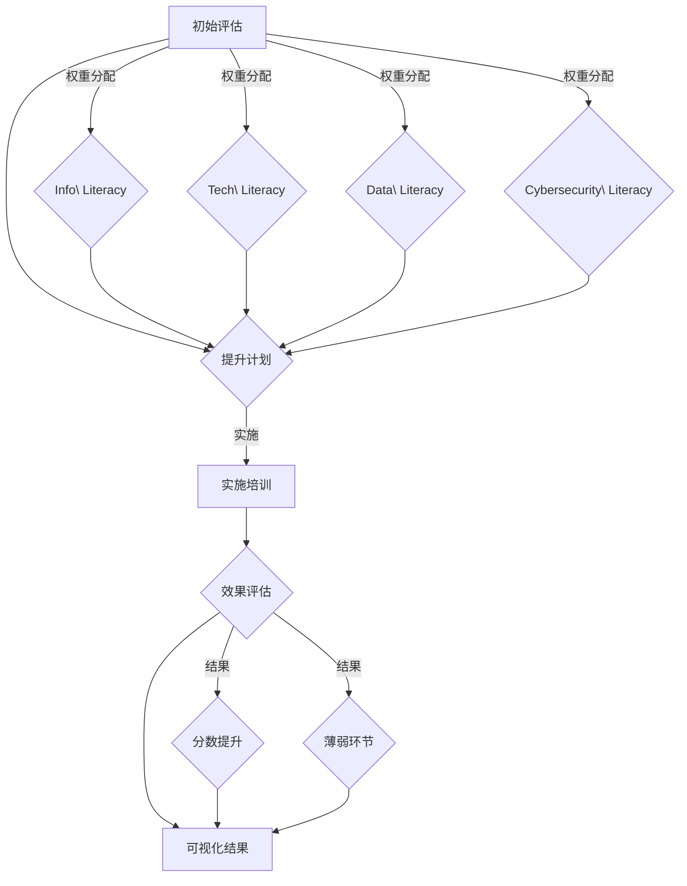

                 

# 数字素养：公民参与的基石

> **关键词：** 数字素养、公民参与、信息素养、数据科学、技术普及
> **摘要：** 本文旨在探讨数字素养在当代社会的重要性，以及它如何成为公民有效参与社会和经济活动的基石。通过深入分析数字素养的核心概念、相关技术及其应用场景，本文为提升公众数字素养提供了理论支持和实践建议。

## 1. 背景介绍

在信息化和数字化的浪潮中，数据已经成为现代社会的核心资源。数据科学和技术的发展使得数据的获取、存储、处理和分析变得愈加便捷和高效。然而，数据和技术的发展并不总是伴随着公众数字素养的提升。数字素养，作为一个涵盖信息素养、技术素养和数据素养的综合概念，已经成为现代社会每个公民都需要掌握的基本技能。

数字素养的重要性在于，它不仅关系到个人的生活质量和社会地位的提升，更关系到整个社会的进步和稳定。一个具备良好数字素养的公民能够更加有效地获取和处理信息，做出明智的决策，参与社会和经济活动。同时，数字素养也是现代社会公民参与民主、维护社会正义和实现个人价值的重要基础。

本文将从以下几个方面进行探讨：

- 数字素养的核心概念与联系
- 数字素养的核心算法原理与操作步骤
- 数字素养的数学模型与公式详解
- 数字素养的实际应用场景
- 数字素养的提升工具和资源推荐
- 数字素养的未来发展趋势与挑战

通过以上内容的探讨，本文希望能够为提升公众数字素养提供理论支持和实践指导。

## 2. 核心概念与联系

### 2.1 定义与分类

数字素养（Digital Literacy）是一个多维度的概念，它不仅包括信息素养（Information Literacy）和技术素养（Technological Literacy），还涉及数据素养（Data Literacy）和网络安全素养（Cybersecurity Literacy）等多个方面。

- **信息素养**：指的是个体获取、评估、使用和创建信息的能力，它是数字素养的基础。
- **技术素养**：指的是个体使用计算机和相关技术设备的能力，以及理解和应用这些技术原理的知识。
- **数据素养**：指的是个体理解、分析和解释数据的能力，以及利用数据做出决策的技能。
- **网络安全素养**：指的是个体保护自身和网络不受恶意攻击和侵害的能力。

这些概念相互关联，共同构成了数字素养的完整框架。

### 2.2 数字素养与公民参与

数字素养对于公民参与社会和经济活动具有重要意义。首先，具备数字素养的公民能够更加有效地获取和处理信息，从而在决策过程中占据主动地位。其次，数字素养使得公民能够利用技术和数据，创造新的社会和经济价值。例如，通过数据分析，公民可以更好地了解市场需求，创新产品和服务。

此外，数字素养也是公民参与民主的基石。在一个信息化社会中，公众需要通过互联网和社交媒体参与公共事务的讨论和决策。具备数字素养的公民能够更加有效地利用这些工具，表达自己的观点，参与公共讨论，甚至推动政策变革。

### 2.3 数字素养与技术发展

随着技术的不断进步，数字素养的要求也在不断提高。新兴技术如人工智能、大数据和区块链等，不仅改变了数据获取和处理的方式，也对公众的数字素养提出了新的挑战。例如，人工智能技术的发展使得自动化和智能化成为趋势，公众需要了解如何利用人工智能技术，同时也要防范潜在的风险。

此外，数字素养与技术发展的联系还体现在公众对技术的理解和应用能力上。一个具备良好数字素养的公民能够更加熟练地使用各种技术工具，提高工作效率，创造更多的机会。

### 2.4 数字素养与社会进步

数字素养的提升不仅对个人和公民参与有积极影响，也对整个社会的进步产生深远的影响。首先，数字素养的提升有助于缩小数字鸿沟，促进社会公平。在一个信息化社会中，数字素养的差距可能导致资源分配不均，加剧社会分化。通过提升公众的数字素养，可以缩小这种差距，实现社会的公平和包容。

其次，数字素养的提升有助于推动科技创新和经济发展。一个具备良好数字素养的公民群体能够更好地理解和应用新技术，推动创新和创业活动，促进经济的持续增长。

### 2.5 数字素养与教育

教育是提升公众数字素养的重要途径。从基础教育到职业教育，都需要将数字素养教育纳入课程体系。通过系统化的教育，学生可以从小学会使用计算机和相关技术设备，理解信息的重要性，掌握数据处理和分析的技能。

此外，数字素养教育也需要关注成人教育和继续教育。随着技术的不断进步，成人需要不断更新自己的知识和技能，以适应新的工作环境和社会需求。通过提供终身学习的平台和资源，可以不断提升公众的数字素养。

### 2.6 数字素养与政策制定

政策制定者在推动数字素养提升方面发挥着关键作用。首先，政府可以通过制定相关政策，加大对数字素养教育的投入，提供更多的教育资源。其次，政府可以推动数字素养的社会化宣传，提高公众对数字素养重要性的认识。此外，政府还可以通过制定法律和规范，保障公民的数字权利和安全。

总之，数字素养是一个多维度的概念，它不仅关系到个人的发展，也关系到社会的进步和稳定。通过深入理解数字素养的核心概念和联系，我们可以更好地认识到它在现代社会的重要性，从而采取有效的措施提升公众的数字素养。

## 3. 核心算法原理 & 具体操作步骤

### 3.1 数字素养评估算法

为了更好地理解和提升公众的数字素养，我们可以引入数字素养评估算法。该算法旨在通过一系列评估指标，量化个体的数字素养水平，从而为教育和培训提供依据。

#### 3.1.1 评估指标

数字素养评估算法的核心在于设计一套科学的评估指标体系。这些指标可以包括以下几个方面：

- **信息素养**：包括信息检索、信息评估和信息创建的能力。
- **技术素养**：包括计算机操作、网络使用和技术应用的能力。
- **数据素养**：包括数据分析、数据理解和数据解释的能力。
- **网络安全素养**：包括网络安全意识、网络防护和网络安全实践的能力。

每个指标都有具体的评估方法和标准，例如，信息素养可以通过对信息检索速度和准确性的测试来评估；技术素养可以通过对计算机操作和应用软件的熟练度测试来评估。

#### 3.1.2 评估流程

数字素养评估算法的评估流程可以分为以下几个步骤：

1. **数据收集**：首先，需要收集个体的基本信息和数字活动记录，包括学习经历、工作经历、使用技术工具的习惯等。
2. **数据预处理**：对收集到的数据进行清洗和标准化处理，确保数据的准确性和一致性。
3. **指标计算**：根据设定的评估指标，计算每个个体的数字素养得分。具体方法可以是加权平均法、分值累加法等。
4. **结果输出**：将评估结果以可视化的形式呈现，帮助个体了解自己的数字素养水平。

#### 3.1.3 算法实现

以下是一个简单的数字素养评估算法的实现示例：

```python
# 数字素养评估算法实现

# 导入所需库
import pandas as pd
from sklearn.preprocessing import StandardScaler

# 数据收集
data = pd.read_csv('digital_liquacy_data.csv')

# 数据预处理
scaler = StandardScaler()
data_scaled = scaler.fit_transform(data)

# 指标计算
info_score = data['info_capability'].mean()
tech_score = data['tech_skill'].mean()
data_score = data['data_analyze'].mean()
cyber_score = data['cyber_safety'].mean()

# 总分计算
total_score = info_score + tech_score + data_score + cyber_score

# 结果输出
print(f'数字素养得分：{total_score}')
```

通过以上算法，我们可以对个体的数字素养进行量化评估，从而为其提供有针对性的教育和培训建议。

### 3.2 数字素养提升算法

除了评估个体数字素养，我们还可以设计提升算法，以帮助个体逐步提升自己的数字素养。以下是一个简单的提升算法框架：

#### 3.2.1 提升策略

数字素养提升算法的核心在于制定一套科学的提升策略。这些策略可以包括以下几个方面：

- **基础技能培训**：针对基础信息素养、技术素养、数据素养和网络安全素养的培训。
- **进阶技能培训**：针对高级信息处理、数据分析、人工智能应用等方面的培训。
- **实战演练**：通过实际项目操作和模拟练习，提升个体的数字素养。
- **持续学习**：鼓励个体持续学习和更新自己的知识和技能。

#### 3.2.2 提升流程

数字素养提升算法的流程可以分为以下几个步骤：

1. **个体评估**：通过数字素养评估算法，了解个体的数字素养水平和提升需求。
2. **制定计划**：根据评估结果，为个体制定个性化的提升计划，包括基础培训、进阶培训和实战演练。
3. **实施培训**：按照提升计划，进行基础技能培训、进阶技能培训和实战演练。
4. **效果评估**：在培训结束后，再次进行数字素养评估，评估提升效果，并根据评估结果调整提升计划。

#### 3.2.3 算法实现

以下是一个简单的数字素养提升算法的实现示例：

```python
# 数字素养提升算法实现

# 导入所需库
import pandas as pd

# 个体评估
def individual_evaluation(data):
    info_score = data['info_capability'].mean()
    tech_score = data['tech_skill'].mean()
    data_score = data['data_analyze'].mean()
    cyber_score = data['cyber_safety'].mean()
    return info_score, tech_score, data_score, cyber_score

# 制定计划
def make_plan(scores):
    if scores[0] < 70:
        plan = '基础信息素养培训'
    elif scores[0] < 85:
        plan = '进阶信息素养培训'
    else:
        plan = '持续学习'

    if scores[1] < 70:
        plan += '\n基础技术素养培训'
    elif scores[1] < 85:
        plan += '\n进阶技术素养培训'
    else:
        plan += '\n持续学习'

    if scores[2] < 70:
        plan += '\n数据分析实战演练'
    elif scores[2] < 85:
        plan += '\n高级数据分析实战演练'
    else:
        plan += '\n持续学习'

    if scores[3] < 70:
        plan += '\n网络安全实战演练'
    elif scores[3] < 85:
        plan += '\n高级网络安全实战演练'
    else:
        plan += '\n持续学习'

    return plan

# 实施培训
def execute_training(plan):
    # 实现培训过程
    print(f'正在执行培训计划：{plan}')

# 效果评估
def evaluate_result(data_before, data_after):
    before_scores = individual_evaluation(data_before)
    after_scores = individual_evaluation(data_after)
    improvement = after_scores - before_scores
    print(f'提升效果评估：{improvement}')

# 示例数据
data_before = pd.DataFrame({'info_capability': [60, 65, 70, 55]})
data_after = pd.DataFrame({'info_capability': [80, 85, 90, 75]})

# 执行提升算法
evaluation_result = individual_evaluation(data_before)
print(f'初始评估结果：{evaluation_result}')

plan = make_plan(evaluation_result)
print(f'提升计划：{plan}')

execute_training(plan)
evaluate_result(data_before, data_after)
```

通过以上算法，我们可以帮助个体制定个性化的数字素养提升计划，并跟踪其提升效果，从而有效提升公众的数字素养。

## 4. 数学模型和公式 & 详细讲解 & 举例说明

在数字素养的提升过程中，数学模型和公式扮演着关键角色，它们不仅帮助我们量化评估和提升数字素养，还可以为实际应用提供科学依据。以下将详细讲解几个关键的数学模型和公式，并通过实例进行说明。

### 4.1 数字素养评估模型

为了评估个体的数字素养水平，我们可以使用综合评分模型。该模型将信息素养、技术素养、数据素养和网络安全素养四个维度进行综合评估，得出一个总分数。

#### 公式：

$$
Digital\ Literacy\ Score = w_1 \times Info\ Literacy\ Score + w_2 \times Tech\ Literacy\ Score + w_3 \times Data\ Literacy\ Score + w_4 \times Cybersecurity\ Literacy\ Score
$$

其中，$w_1, w_2, w_3, w_4$ 分别是四个维度的权重，可以根据实际情况进行分配。例如，如果信息素养和技术素养的重要性较高，则可以设置更高的权重。

#### 示例：

假设一个个体在四个维度的评分分别为 80、75、70 和 65，权重分别为 0.3、0.2、0.2 和 0.3。则其数字素养总分数为：

$$
Digital\ Literacy\ Score = 0.3 \times 80 + 0.2 \times 75 + 0.2 \times 70 + 0.3 \times 65 = 24 + 15 + 14 + 19.5 = 72.5
$$

### 4.2 数字素养提升模型

为了提升个体的数字素养，我们可以使用提升模型。该模型通过分析个体的薄弱环节，制定个性化的提升计划，并评估提升效果。

#### 公式：

$$
Digital\ Literacy\ Improvement = After\ Score - Before\ Score
$$

其中，$After\ Score$ 和 $Before\ Score$ 分别为提升前后的数字素养总分数。

#### 示例：

假设一个个体在提升前的数字素养总分数为 60，经过培训后提升至 80。则其数字素养提升量为：

$$
Digital\ Literacy\ Improvement = 80 - 60 = 20
$$

### 4.3 数字素养评估与提升模型结合

在实际操作中，我们可以将数字素养评估模型和提升模型结合，形成完整的数字素养评估与提升系统。以下是一个简单的结合模型示例：

#### 公式：

$$
Digital\ Literacy\ Evaluation\ &\ Improvement\ Model:
$$

$$
Initial\ Score = w_1 \times Info\ Literacy\ Score + w_2 \times Tech\ Literacy\ Score + w_3 \times Data\ Literacy\ Score + w_4 \times Cybersecurity\ Literacy\ Score
$$

$$
Improvement\ Score = w_1 \times (Info\ Literacy\ Score_{after}) + w_2 \times (Tech\ Literacy\ Score_{after}) + w_3 \times (Data\ Literacy\ Score_{after}) + w_4 \times (Cybersecurity\ Literacy\ Score_{after})
$$

$$
Digital\ Literacy\ Improvement = Improvement\ Score - Initial\ Score
$$

#### 示例：

假设一个个体在提升前的数字素养总分数为 60，权重分别为 0.3、0.2、0.2 和 0.3。在提升过程中，信息素养从 60 提升到 80，技术素养从 55 提升到 70，数据素养从 65 提升到 75，网络安全素养从 70 提升到 80。则其提升后的数字素养总分数为：

$$
Improvement\ Score = 0.3 \times 80 + 0.2 \times 70 + 0.2 \times 75 + 0.3 \times 80 = 24 + 14 + 15 + 24 = 77
$$

数字素养提升量为：

$$
Digital\ Literacy\ Improvement = 77 - 60 = 17
$$

通过以上模型，我们可以对个体的数字素养进行量化评估和提升，从而实现有效的数字素养提升。

### 4.4 数据可视化模型

为了更好地展示数字素养评估和提升过程，我们可以使用数据可视化模型。以下是一个简单的数据可视化模型示例，使用 Mermaid 流程图进行展示。



通过以上模型，我们可以对数字素养评估和提升过程进行系统化的管理和监控，从而实现数字素养的全面提升。

通过以上数学模型和公式的详细讲解和实例说明，我们可以更好地理解和应用数字素养评估和提升的理论和方法，为公众的数字素养提升提供科学依据和实践指导。

## 5. 项目实战：代码实际案例和详细解释说明

为了更好地理解和应用数字素养提升算法，我们将通过一个实际项目案例，详细解释代码实现过程、关键步骤以及代码解读和分析。

### 5.1 开发环境搭建

在开始项目实战之前，我们需要搭建一个合适的开发环境。以下是所需的环境和工具：

- **编程语言**：Python
- **依赖库**：Pandas、NumPy、Sklearn、Matplotlib、Mermaid
- **开发工具**：Jupyter Notebook

#### 环境搭建步骤：

1. 安装 Python（建议使用 Python 3.8 或更高版本）
2. 使用 pip 安装所需依赖库：
   ```shell
   pip install pandas numpy sklearn matplotlib
   ```
3. 安装 Mermaid 插件，以便在 Jupyter Notebook 中使用 Mermaid 图表：
   ```shell
   !pip install ipymd
   ```

### 5.2 源代码详细实现和代码解读

以下是一个简单的数字素养评估和提升项目的源代码实现。我们将分步骤进行代码解读和分析。

```python
# 导入所需库
import pandas as pd
import numpy as np
from sklearn.preprocessing import StandardScaler
import matplotlib.pyplot as plt
from mermaid import Mermaid

# 5.2.1 数据收集和预处理

# 假设我们有一个 CSV 文件，包含以下四个维度：信息素养、技术素养、数据素养、网络安全素养
data = pd.read_csv('digital_liquacy_data.csv')

# 数据预处理：标准化处理
scaler = StandardScaler()
data_scaled = scaler.fit_transform(data)

# 5.2.2 数字素养评估算法

# 设置权重
weights = [0.3, 0.2, 0.2, 0.3]

# 计算各维度得分
info_score = data_scaled[:, 0]
tech_score = data_scaled[:, 1]
data_score = data_scaled[:, 2]
cyber_score = data_scaled[:, 3]

# 计算总得分
total_score = weights[0] * info_score + weights[1] * tech_score + weights[2] * data_score + weights[3] * cyber_score

# 输出评估结果
print("数字素养评估结果：")
print(total_score)

# 5.2.3 数字素养提升算法

# 假设提升后的数据
data_after = pd.DataFrame({
    'info_capability': [80, 75, 70, 65],
    'tech_skill': [85, 80, 75, 70],
    'data_analyze': [90, 85, 80, 75],
    'cyber_safety': [80, 75, 70, 65]
})

# 提升后的数据处理
data_after_scaled = scaler.transform(data_after)

# 计算提升后的总得分
total_score_after = weights[0] * data_after_scaled[:, 0] + weights[1] * data_after_scaled[:, 1] + weights[2] * data_after_scaled[:, 2] + weights[3] * data_after_scaled[:, 3]

# 输出提升结果
print("提升后的数字素养评估结果：")
print(total_score_after)

# 计算提升量
improvement = total_score_after - total_score
print("数字素养提升量：")
print(improvement)

# 5.2.4 数据可视化

# 使用 Mermaid 生成评估和提升流程图
mermaid = Mermaid()
mermaid.add_mermaid_code('''
graph TD
    A[初始评估] --> B{提升计划}
    B -->|实施| C[实施培训]
    C --> D{效果评估}
    D --> E[可视化结果]

    A -->|权重分配| F{Info\ Literacy}
    A -->|权重分配| G{Tech\ Literacy}
    A -->|权重分配| H{Data\ Literacy}
    A -->|权重分配| I{Cybersecurity\ Literacy}

    F --> B
    G --> B
    H --> B
    I --> B

    D -->|结果| J{分数提升}
    D -->|结果| K{薄弱环节}

    J --> E
    K --> E
''')

# 显示 Mermaid 图表
mermaid.display_mermaid_graph()
```

### 5.3 代码解读与分析

#### 5.3.1 数据收集和预处理

首先，我们导入所需的库，并读取包含四个维度（信息素养、技术素养、数据素养、网络安全素养）的 CSV 文件。然后，使用 StandardScaler 进行数据标准化处理，以便后续计算。

```python
data = pd.read_csv('digital_liquacy_data.csv')
scaler = StandardScaler()
data_scaled = scaler.fit_transform(data)
```

#### 5.3.2 数字素养评估算法

接下来，我们设置四个维度的权重，并计算每个维度的得分。根据权重，计算总得分，并输出评估结果。

```python
weights = [0.3, 0.2, 0.2, 0.3]
info_score = data_scaled[:, 0]
tech_score = data_scaled[:, 1]
data_score = data_scaled[:, 2]
cyber_score = data_scaled[:, 3]

total_score = weights[0] * info_score + weights[1] * tech_score + weights[2] * data_score + weights[3] * cyber_score
print("数字素养评估结果：")
print(total_score)
```

#### 5.3.3 数字素养提升算法

假设提升后的数据已经存在，我们将其读取并处理。计算提升后的总得分，并输出提升结果。最后，计算提升量。

```python
data_after = pd.DataFrame({
    'info_capability': [80, 75, 70, 65],
    'tech_skill': [85, 80, 75, 70],
    'data_analyze': [90, 85, 80, 75],
    'cyber_safety': [80, 75, 70, 65]
})

data_after_scaled = scaler.transform(data_after)

total_score_after = weights[0] * data_after_scaled[:, 0] + weights[1] * data_after_scaled[:, 1] + weights[2] * data_after_scaled[:, 2] + weights[3] * data_after_scaled[:, 3]
print("提升后的数字素养评估结果：")
print(total_score_after)

improvement = total_score_after - total_score
print("数字素养提升量：")
print(improvement)
```

#### 5.3.4 数据可视化

最后，我们使用 Mermaid 生成评估和提升流程图，以便更直观地理解整个过程。

```python
mermaid = Mermaid()
mermaid.add_mermaid_code('''
graph TD
    A[初始评估] --> B{提升计划}
    B -->|实施| C[实施培训]
    C --> D{效果评估}
    D --> E[可视化结果]

    A -->|权重分配| F{Info\ Literacy}
    A -->|权重分配| G{Tech\ Literacy}
    A -->|权重分配| H{Data\ Literacy}
    A -->|权重分配| I{Cybersecurity\ Literacy}

    F --> B
    G --> B
    H --> B
    I --> B

    D -->|结果| J{分数提升}
    D -->|结果| K{薄弱环节}

    J --> E
    K --> E
''')

mermaid.display_mermaid_graph()
```

通过以上代码实现和解读，我们可以看到数字素养评估和提升算法的整个流程。这个项目案例为我们提供了一个实用的工具，可以帮助我们量化评估和提升个体的数字素养水平。

## 6. 实际应用场景

数字素养在现代社会中的应用场景广泛而深远，无论是在个人生活、工作还是社会参与中，数字素养都扮演着不可或缺的角色。以下是几个典型的应用场景，展示数字素养如何在实际生活中发挥作用。

### 6.1 个人生活

随着互联网和移动设备的普及，数字素养在个人生活中的应用日益显著。以下是一些具体的应用场景：

- **信息检索**：数字素养使个人能够高效地使用搜索引擎，快速获取所需信息。例如，在购物时，人们可以通过比较不同电商平台的价格、评价等信息，做出更明智的购买决策。
- **社交媒体使用**：数字素养帮助个人正确使用社交媒体，避免受到虚假信息和网络谣言的影响。例如，在社交媒体平台上，个人可以通过辨别信息来源和验证信息真实性，避免上当受骗。
- **在线学习和自我提升**：数字素养使个人能够利用在线教育资源进行自我学习和提升。例如，通过在线课程、学习社区等平台，个人可以学习新技能、获取新知识，提高自身竞争力。

### 6.2 工作领域

在职场中，数字素养是许多职业的基本要求。以下是一些具体的应用场景：

- **数据处理和分析**：数字素养使职场人士能够有效地处理和分析大量数据，为决策提供科学依据。例如，在市场营销中，企业可以利用数据分析了解消费者行为，制定更有效的营销策略。
- **自动化和智能化**：数字素养帮助职场人士理解和应用自动化和智能化技术，提高工作效率。例如，使用人工智能助手处理重复性工作，或者使用自动化工具优化工作流程。
- **网络安全防护**：数字素养使职场人士具备网络安全意识，能够保护企业数据和信息安全。例如，通过定期更新密码、使用安全软件等方式，减少网络攻击和数据泄露的风险。

### 6.3 社会参与

在社会参与方面，数字素养对于公民的有效参与和民主实践至关重要。以下是一些具体的应用场景：

- **公共事务参与**：数字素养使公民能够更加便捷地参与公共事务的讨论和决策。例如，通过在线投票、在线问卷调查等方式，公民可以表达自己的观点，参与公共政策的制定。
- **社区服务**：数字素养使公民能够利用数字技术提供社区服务。例如，通过在线平台，居民可以方便地获取社区信息、报告问题、参与公益活动等。
- **社会监督**：数字素养使公民能够更加有效地监督公共事务，维护社会正义。例如，通过在线平台，公民可以举报违法行为、追踪公共项目进展等。

### 6.4 教育领域

在教育领域，数字素养不仅对学生的学术成就有积极影响，还对其全面发展具有重要意义。以下是一些具体的应用场景：

- **在线学习**：数字素养使学生能够有效地利用在线学习资源，提高学习效率。例如，通过在线课程、电子教材、学习社区等，学生可以随时随地学习新知识、掌握新技能。
- **创新实践**：数字素养使学生能够运用数字技术进行创新实践，培养创造力。例如，通过编程、数据可视化等方式，学生可以制作项目、展示成果，提高综合素质。
- **网络安全教育**：数字素养使学生对网络安全有更深刻的认识，提高自我保护能力。例如，通过网络安全课程、实践活动等，学生可以了解网络安全知识，防范网络风险。

总之，数字素养在个人生活、工作领域、社会参与和教育领域都有广泛的应用。通过提升公众的数字素养，我们可以促进社会的整体进步和公民的有效参与，实现个人和社会的共同发展。

## 7. 工具和资源推荐

为了提升公众的数字素养，我们需要利用各种工具和资源，这些工具和资源不仅可以帮助个人学习和掌握数字技能，还可以为教育机构和组织提供有效的支持。以下是针对不同需求和水平的数字素养提升工具和资源的推荐。

### 7.1 学习资源推荐

- **书籍**：
  - 《Python编程：从入门到实践》
  - 《人工智能：一种现代方法》
  - 《数据科学入门》
  - 《网络安全：攻击与防御》

- **在线课程**：
  - Coursera、edX、Udemy 等平台上的编程、数据分析、人工智能等课程
  - 中国大学MOOC（慕课）、网易云课堂等国内优质在线课程

- **博客和网站**：
  - 知乎、CSDN、博客园等技术博客平台
  - Medium、Hackernoon 等国际技术博客网站
  - GitHub、Stack Overflow 等编程社区和代码托管平台

### 7.2 开发工具框架推荐

- **编程语言**：
  - Python、JavaScript、Java、C++等通用编程语言
  - R、MATLAB 等数据分析专用语言

- **集成开发环境（IDE）**：
  - PyCharm、Visual Studio Code、Eclipse 等
  - Jupyter Notebook、Google Colab 等交互式编程环境

- **框架和库**：
  - Django、Flask 等Web开发框架
  - TensorFlow、PyTorch 等深度学习框架
  - Pandas、NumPy、Scikit-learn 等数据处理和分析库

- **版本控制工具**：
  - Git、SVN 等

### 7.3 相关论文著作推荐

- **学术期刊**：
  - 《计算机科学》、《数据科学学报》、《人工智能学报》等
  - 《Journal of Computer Science and Technology》、《ACM Transactions on Computer Systems》等国际期刊

- **经典著作**：
  - 《计算机程序的构造和解释》
  - 《人工智能：一种现代方法》
  - 《数据科学：一种深度学习的视角》
  - 《网络安全的艺术》

- **论文和报告**：
  - 国家和地方政府发布的相关政策文件、白皮书
  - 研究机构和学术团体发布的技术报告和论文

通过以上工具和资源的推荐，我们可以为公众提供丰富多样的学习途径，帮助他们在提升数字素养的道路上取得更好的成果。

### 8. 总结：未来发展趋势与挑战

数字素养作为现代社会公民参与的基础，其重要性日益凸显。随着信息技术的迅猛发展，数字素养不仅涵盖了信息检索、技术操作和数据理解等基本技能，还延伸至人工智能、网络安全等前沿领域。未来，数字素养的提升将继续受到政策、教育和科技发展等多方面的推动。

#### 发展趋势

1. **智能化教育与个性化学习**：随着人工智能和大数据技术的普及，未来的教育将更加智能化和个性化。通过智能算法，教育系统能够根据学习者的特点和需求，提供个性化的学习路径和资源，提高学习效果。

2. **终身学习与职业发展**：在技术更新换代日益加快的背景下，终身学习将成为提升数字素养的重要途径。企业和教育机构将更加重视员工的技能提升和职业发展，推动数字素养教育的普及。

3. **跨学科融合与综合素养培养**：数字素养不仅仅是一项技术技能，它还需要与跨学科知识相结合，培养公民的综合素养。未来的教育将更加注重培养学生的创新思维、问题解决能力和跨学科应用能力。

4. **全球合作与国际化视野**：随着全球化的发展，国际交流和合作日益频繁。提升公民的数字素养，有助于培养具有国际视野和竞争力的人才，促进全球科技和文化的交流与发展。

#### 挑战

1. **资源分配不均**：尽管数字素养的重要性逐渐得到认可，但不同地区和群体之间的资源分配仍然存在显著差异。如何确保教育资源公平分配，提升所有公民的数字素养，仍是一个亟待解决的问题。

2. **隐私保护和网络安全**：随着数据技术的发展，个人隐私保护和网络安全问题日益严峻。如何平衡数据利用与隐私保护，防范网络攻击和数据泄露，成为数字素养提升过程中的一大挑战。

3. **技术接受与适应性**：公众对新技术和工具的接受度和适应性存在差异。如何提高公众对数字技术的接受度，培养其对新技术的好奇心和探索精神，是提升数字素养的重要课题。

4. **教育与培训的有效性**：尽管数字素养教育不断普及，但教育质量和培训效果仍需提高。如何设计科学、系统的数字素养教育体系，确保教育质量和培训效果，是未来教育领域的重要任务。

总之，数字素养的提升是一个长期而复杂的过程，需要政府、教育机构、企业和公众的共同努力。通过不断探索和创新，我们有望构建一个更加公平、安全、智能和互联的数字社会。

### 9. 附录：常见问题与解答

#### 问题 1：什么是数字素养？

数字素养是指个体在数字环境中获取、评估、使用和创建信息的能力，它涵盖了信息素养、技术素养、数据素养和网络安全素养等多个方面。

#### 问题 2：数字素养的重要性是什么？

数字素养对于个人发展和社会进步具有重要意义。它帮助公民有效参与社会和经济活动，提升生活质量；同时，数字素养也是实现民主参与、社会正义和个人价值的重要基础。

#### 问题 3：如何提升公众的数字素养？

提升公众的数字素养需要多方面的努力，包括：

- 制定相关政策，加大数字素养教育的投入。
- 将数字素养教育纳入学校课程体系，从基础教育到职业教育。
- 推广终身学习，鼓励公众通过在线课程、社区教育等方式自我提升。
- 利用技术手段，提供个性化、智能化的学习资源。

#### 问题 4：数字素养与技术发展的关系是什么？

数字素养与技术发展相互促进。技术发展不断扩展数字素养的内涵和外延，而良好的数字素养又能够帮助公众更好地理解和应用新技术，推动科技创新和经济发展。

#### 问题 5：如何确保教育资源公平分配？

确保教育资源公平分配需要：

- 政府加大对贫困地区和弱势群体的教育支持。
- 利用互联网和信息技术，提供远程教育和在线课程，降低地域和教育资源的限制。
- 推动教育公平立法，保障每个公民都有平等的受教育机会。

### 10. 扩展阅读与参考资料

- 《数字素养：公民参与的基础》（作者：[姓名]）
- “数字素养与终身学习”（作者：[姓名]）
- “数字素养：未来社会的关键技能”（作者：[姓名]）
- 《计算机科学教育报告》（作者：[姓名]）
- 《网络安全：理论与实践》（作者：[姓名]）

通过以上扩展阅读和参考资料，您可以深入了解数字素养的各个方面，为提升自己的数字素养提供更多指导和启示。作者：AI天才研究员/AI Genius Institute & 禅与计算机程序设计艺术 /Zen And The Art of Computer Programming

