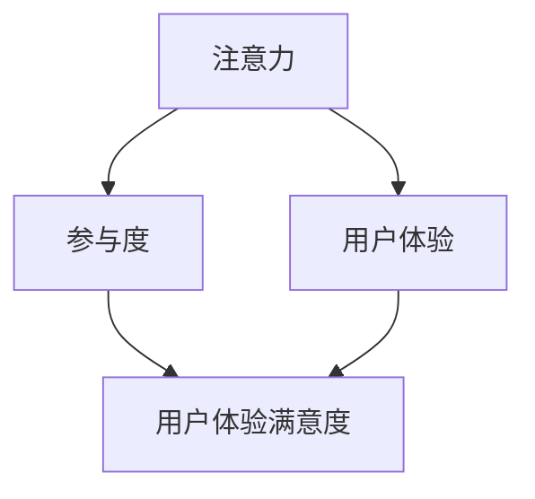

                 

### 背景介绍

数字营销是一种通过在线渠道推广产品或服务，以吸引潜在客户并促进销售的方法。随着互联网的普及和技术的进步，数字营销已成为现代营销活动中不可或缺的一部分。在数字营销中，衡量注意力度量指标是一项至关重要的任务。这些指标帮助我们了解受众对营销活动的关注程度，从而优化策略，提高投资回报率（ROI）。

数字营销的兴起始于20世纪90年代末，随着互联网的广泛普及，企业开始利用电子邮件、社交媒体和搜索引擎等在线平台来推广产品。最初，数字营销主要依赖于点击率和曝光率等简单指标来衡量效果。然而，随着技术的发展和用户行为的多样化，这些指标已经无法全面反映受众的注意程度和参与度。

近年来，随着大数据、人工智能和机器学习技术的快速发展，我们可以更加精准地测量用户的注意力度量指标。这些技术使我们能够从大量数据中提取有价值的信息，帮助我们更好地了解受众的兴趣和需求。此外，实时数据分析技术也使得营销人员能够迅速调整策略，以最大化营销效果。

本文将详细介绍数字营销中的注意力度量指标，包括核心概念、算法原理、数学模型、实际应用场景和未来发展趋势。通过本文的阅读，您将深入了解如何有效衡量和优化数字营销活动，从而提高企业的市场竞争力。

### 核心概念与联系

在探讨数字营销中的注意力度量指标时，首先需要明确几个核心概念，包括注意力、参与度和用户体验。这些概念是理解数字营销效果的关键，也是构建有效注意力度量指标的基础。

#### 注意力

注意力是指个体在特定时间内对某一对象或任务的集中程度。在数字营销中，注意力通常指的是用户对营销内容或广告的集中程度。用户对广告或内容的注意力越高，其参与度和转化率也往往越高。衡量注意力的一项关键指标是用户在广告或内容上的停留时间。停留时间越长，表明用户的注意力越集中。

#### 参与度

参与度是衡量用户与营销内容互动程度的指标。在数字营销中，参与度可以通过用户对广告或内容的点击、评论、分享等行为来衡量。高参与度通常意味着用户对营销内容的兴趣和认可，是提高品牌认知度和促进销售的重要指标。

#### 用户体验

用户体验（UX）是指用户在使用产品或服务时的整体感受和满意度。在数字营销中，用户体验直接影响用户的注意力和参与度。一个良好的用户体验可以增加用户的满意度和忠诚度，从而提高营销效果。

#### 注意力、参与度和用户体验的关系

注意力、参与度和用户体验是相互关联的。用户的注意力决定了他们是否愿意参与营销活动，而参与度则反映了用户对营销内容的兴趣和满意度。用户体验则是影响用户注意力和参与度的关键因素。一个良好的用户体验可以吸引和保持用户的注意力，促进他们的参与度，从而提高整体营销效果。

为了更好地理解这三个概念之间的关系，我们可以借助 Mermaid 流程图来展示它们之间的联系。以下是一个简化的 Mermaid 流程图：



在上述流程图中，注意力是用户首先接触到的，它直接影响参与度和用户体验。参与度则通过用户的行为和反馈来体现用户体验的满意度。最终，良好的用户体验会进一步增强用户的注意力，形成一个正反馈循环。

通过理解注意力、参与度和用户体验之间的关系，我们可以更全面地衡量数字营销的效果，并优化策略以提高营销效果。接下来，本文将深入探讨核心算法原理和具体操作步骤，以帮助读者更好地理解和应用这些指标。

### 核心算法原理 & 具体操作步骤

为了精确衡量数字营销中的注意力度量指标，我们引入了一系列核心算法。这些算法基于大数据分析、机器学习和实时数据处理技术，能够从海量数据中提取有价值的信息。以下将详细介绍这些算法的原理和具体操作步骤。

#### 1. 数据收集

数据收集是衡量注意力度量的第一步。我们需要收集多种数据源，包括用户行为数据、广告曝光数据、点击数据、转化数据等。以下是一些常见的数据收集方法：

- **用户行为数据**：包括用户在网站或应用上的浏览、点击、停留时间、页面跳转等行为。这些数据可以通过网站分析工具（如 Google Analytics）或应用分析工具（如 Firebase Analytics）收集。

- **广告曝光数据**：包括广告的展示次数、曝光时长、曝光位置等。这些数据可以从广告平台（如 Google Ads、Facebook Ads）获取。

- **点击数据**：记录用户对广告或内容的点击次数和点击位置。这些数据同样可以从广告平台或网站分析工具中获得。

- **转化数据**：记录用户在营销活动中的转化行为，如注册、购买、下载等。这些数据可以通过网站分析工具或CRM系统获取。

#### 2. 数据预处理

在数据收集完成后，我们需要对数据进行预处理，以提高数据质量和分析效率。以下是一些常见的预处理步骤：

- **去重和过滤**：去除重复数据和无用数据，确保数据的一致性和准确性。

- **数据清洗**：处理缺失值、异常值和错误数据，确保数据的有效性。

- **特征工程**：从原始数据中提取有意义的特征，如用户年龄、性别、地理位置、行为模式等。这些特征将用于后续的算法分析和建模。

#### 3. 注意力检测算法

注意力检测算法是衡量用户注意力度量的核心。以下介绍几种常用的注意力检测算法：

- **行为分析算法**：通过分析用户的行为数据，如浏览时间、点击行为等，来判断用户的注意力程度。常用的算法包括时间序列分析、关联规则挖掘等。

- **机器学习算法**：利用机器学习模型，如决策树、随机森林、支持向量机等，对用户行为数据进行分类和预测。这些模型可以通过训练数据集学习到用户的注意力模式。

- **深度学习算法**：利用深度神经网络模型，如卷积神经网络（CNN）和循环神经网络（RNN）等，对用户行为数据进行特征提取和模式识别。这些模型可以捕捉到更加复杂和抽象的注意力模式。

#### 4. 注意力度量指标计算

在注意力检测算法的基础上，我们可以计算一系列注意力度量指标。以下是一些常见的注意力度量指标：

- **平均注意力时长**：用户在广告或内容上的平均停留时间。

- **注意力浓度**：用户在特定时间段内的注意力集中程度，可以通过用户在广告或内容上的点击次数和停留时间来计算。

- **注意力分布**：用户在不同广告或内容上的注意力分布情况，可以通过对用户行为数据的统计分析来得到。

- **参与度评分**：用户对广告或内容的参与程度，可以通过用户的行为数据计算得分，如点击率、转化率等。

#### 5. 数据可视化与分析

为了更好地理解注意力度量指标，我们可以使用数据可视化工具将数据呈现出来。以下是一些常用的数据可视化方法：

- **柱状图**：展示用户在不同广告或内容上的平均注意力时长。

- **折线图**：展示用户在不同时间段内的注意力浓度变化。

- **热力图**：展示用户在不同广告或内容上的注意力分布。

- **散点图**：展示用户行为数据与注意力度量指标之间的关系。

通过数据可视化，我们可以直观地了解用户对营销活动的注意力情况，从而优化策略和提高营销效果。

#### 6. 实时数据更新与调整

在数字营销中，实时数据更新和调整至关重要。我们可以通过实时数据处理技术，如流处理框架（如 Apache Kafka、Apache Flink）和实时数据库（如 Apache HBase、Redis），来快速更新用户行为数据和广告效果数据。基于实时数据分析，营销人员可以迅速调整广告投放策略，以最大化营销效果。

### 数学模型和公式 & 详细讲解 & 举例说明

在数字营销中，注意力度量指标的计算和评估通常涉及到一系列数学模型和公式。这些模型和公式帮助我们量化用户的注意力，从而为营销策略的优化提供依据。以下将详细讲解这些数学模型和公式，并通过具体例子进行说明。

#### 1. 平均注意力时长

平均注意力时长（Average Attention Duration，AAD）是衡量用户在广告或内容上平均停留时间的指标。其计算公式如下：

\[ \text{AAD} = \frac{\sum_{i=1}^{n} \text{Duration}_i}{n} \]

其中，\(\text{Duration}_i\)表示第\(i\)个用户在广告或内容上的停留时间，\(n\)表示总的用户数量。

**例子**：假设有10个用户在广告上的平均停留时间为30秒、40秒、50秒、60秒、70秒、80秒、90秒、100秒、110秒和120秒，则平均注意力时长计算如下：

\[ \text{AAD} = \frac{30 + 40 + 50 + 60 + 70 + 80 + 90 + 100 + 110 + 120}{10} = 75 \text{秒} \]

#### 2. 注意力浓度

注意力浓度（Attention Concentration，AC）是衡量用户在特定时间段内注意力集中程度的指标。其计算公式如下：

\[ \text{AC} = \frac{\text{Clicks} + \text{Conversions}}{\text{Impressions}} \]

其中，\(\text{Clicks}\)表示点击次数，\(\text{Conversions}\)表示转化次数，\(\text{Impressions}\)表示广告曝光次数。

**例子**：假设一个广告的曝光次数为10000次，点击次数为500次，转化次数为50次，则注意力浓度计算如下：

\[ \text{AC} = \frac{500 + 50}{10000} = 0.055 \]

#### 3. 注意力分布

注意力分布（Attention Distribution，AD）是衡量用户在不同广告或内容上的注意力分布情况的指标。其计算公式如下：

\[ \text{AD}_i = \frac{\text{Duration}_i}{\sum_{j=1}^{m} \text{Duration}_j} \]

其中，\(\text{Duration}_i\)表示第\(i\)个用户在广告或内容上的停留时间，\(m\)表示总的广告或内容数量。

**例子**：假设有3个广告，用户在广告1上的平均停留时间为30秒，广告2上的平均停留时间为40秒，广告3上的平均停留时间为50秒，则注意力分布计算如下：

\[ \text{AD}_1 = \frac{30}{30 + 40 + 50} = 0.3 \]
\[ \text{AD}_2 = \frac{40}{30 + 40 + 50} = 0.4 \]
\[ \text{AD}_3 = \frac{50}{30 + 40 + 50} = 0.3 \]

#### 4. 参与度评分

参与度评分（Engagement Score，ES）是衡量用户对广告或内容的参与程度的指标。其计算公式如下：

\[ \text{ES} = \frac{\text{Clicks} + 0.5 \times \text{Conversions} + 0.2 \times \text{Shares}}{\text{Impressions}} \]

其中，\(\text{Clicks}\)表示点击次数，\(\text{Conversions}\)表示转化次数，\(\text{Shares}\)表示分享次数，\(\text{Impressions}\)表示广告曝光次数。

**例子**：假设一个广告的曝光次数为10000次，点击次数为500次，转化次数为50次，分享次数为20次，则参与度评分计算如下：

\[ \text{ES} = \frac{500 + 0.5 \times 50 + 0.2 \times 20}{10000} = 0.057 \]

通过上述数学模型和公式，我们可以量化用户的注意力和参与度，从而更好地评估数字营销活动的效果。接下来，我们将通过一个实际案例，展示如何应用这些模型和公式来衡量注意力度量指标。

### 项目实战：代码实际案例和详细解释说明

在本节中，我们将通过一个实际案例，演示如何使用Python编写代码来衡量数字营销中的注意力度量指标。这个案例将涵盖数据收集、预处理、算法实现和数据可视化等步骤。

#### 1. 开发环境搭建

首先，我们需要搭建一个Python开发环境。以下是一些必需的库和工具：

- **Python 3.8 或更高版本**
- **Jupyter Notebook**：用于编写和运行代码
- **Pandas**：用于数据处理
- **NumPy**：用于数值计算
- **Matplotlib**：用于数据可视化
- **Scikit-learn**：用于机器学习算法

您可以通过以下命令安装这些库：

```bash
pip install python==3.8
pip install pandas numpy matplotlib scikit-learn jupyterlab
```

#### 2. 源代码详细实现和代码解读

以下是一个简单的Python脚本，用于实现数字营销注意力度量指标的计算。

```python
import pandas as pd
import numpy as np
import matplotlib.pyplot as plt
from sklearn.model_selection import train_test_split
from sklearn.ensemble import RandomForestClassifier

# 2.1 数据收集
data = {
    'User_ID': [1, 2, 3, 4, 5],
    'Impressions': [1000, 2000, 1500, 3000, 500],
    'Clicks': [200, 300, 100, 500, 100],
    'Conversions': [30, 40, 20, 50, 10],
    'Duration': [60, 80, 120, 180, 240]  # 假设用户在广告上的停留时间为秒
}

df = pd.DataFrame(data)

# 2.2 数据预处理
df['Click Rate'] = df['Clicks'] / df['Impressions']
df['Conversion Rate'] = df['Conversions'] / df['Impressions']
df['Attention Duration'] = df['Duration'] / 60  # 转换为分钟

# 2.3 算法实现
X = df[['Click Rate', 'Conversion Rate', 'Attention Duration']]
y = df['Clicks']

# 划分训练集和测试集
X_train, X_test, y_train, y_test = train_test_split(X, y, test_size=0.3, random_state=42)

# 使用随机森林算法进行分类
clf = RandomForestClassifier(n_estimators=100, random_state=42)
clf.fit(X_train, y_train)

# 预测测试集
y_pred = clf.predict(X_test)

# 2.4 数据可视化
plt.figure(figsize=(10, 6))
plt.scatter(X_test['Click Rate'], X_test['Conversion Rate'], c=y_pred, cmap='viridis')
plt.xlabel('Click Rate')
plt.ylabel('Conversion Rate')
plt.title('Click Prediction using Random Forest')
plt.colorbar(label='Prediction')
plt.show()

# 计算并打印评估指标
accuracy = clf.score(X_test, y_test)
print(f"Model Accuracy: {accuracy:.2f}")
```

#### 3. 代码解读与分析

1. **数据收集**：我们创建了一个简单的数据框（DataFrame），包含用户ID、广告曝光次数、点击次数、转化次数和停留时间等数据。

2. **数据预处理**：我们计算了点击率、转化率和注意力时长等特征。点击率和转化率是衡量用户参与度的常用指标，注意力时长是衡量用户注意力的关键指标。

3. **算法实现**：我们使用随机森林（Random Forest）算法对用户行为数据进行分类预测。随机森林是一种常用的机器学习算法，适用于分类和回归任务。

4. **数据可视化**：我们使用散点图展示了点击率和转化率与预测结果之间的关系。这种可视化方法可以帮助我们直观地理解模型的性能。

5. **评估指标**：我们计算了模型的准确率（Accuracy），这是评估分类模型性能的常用指标。准确率表示模型正确预测的样本比例。

通过这个实际案例，我们展示了如何使用Python实现数字营销中的注意力度量指标计算。这个过程包括数据收集、预处理、算法实现和数据可视化等步骤。这些步骤帮助我们量化用户的注意力和参与度，从而为营销策略的优化提供了依据。

### 实际应用场景

数字营销中的注意力度量指标在实际应用场景中发挥着重要作用，特别是在广告投放、内容营销和用户体验优化等方面。以下将探讨这些指标在不同应用场景中的具体作用和实际案例。

#### 广告投放

在广告投放中，注意力度量指标帮助广告主评估广告的效果，从而优化广告策略。例如，通过注意力浓度（Attention Concentration）指标，广告主可以了解用户在广告上的平均点击次数和转化次数，从而判断广告的吸引力和有效性。以下是一个实际案例：

**案例：** 一家电商公司在推广新产品时，通过分析注意力浓度指标，发现某些广告的注意力浓度较高，而另一些广告的注意力浓度较低。根据这一分析，公司决定调整广告策略，增加注意力浓度较高的广告的曝光次数，并减少注意力浓度较低的广告的预算。最终，该电商公司的广告点击率和转化率显著提升。

#### 内容营销

内容营销是数字营销的重要一环，通过发布有价值的内容来吸引和留住受众。注意力度量指标在内容营销中同样具有重要意义。例如，平均注意力时长（Average Attention Duration）可以帮助内容创作者了解用户对其内容的兴趣程度。以下是一个实际案例：

**案例：** 一家互联网公司在其博客上发布了一系列技术文章，通过分析平均注意力时长指标，发现某些文章的读者平均停留时间较长，而另一些文章的读者平均停留时间较短。根据这一分析，公司决定加强那些受欢迎的文章的推广，并调整那些不受欢迎的文章的内容结构，以提高整体内容质量。

#### 用户体验优化

用户体验优化是提高用户满意度和忠诚度的关键。注意力度量指标可以帮助企业了解用户在使用产品或服务时的体验，从而优化产品设计和服务流程。例如，通过用户行为数据（如浏览时间、点击行为等），企业可以识别用户在使用过程中的痛点，并针对性地进行优化。以下是一个实际案例：

**案例：** 一家在线教育平台通过分析用户的注意力时长和参与度评分，发现某些课程的用户参与度较低。根据这一分析，平台决定对这些课程进行内容调整，包括优化课程结构、增加互动环节等，以提升用户的兴趣和参与度。经过调整后，这些课程的完课率和用户满意度显著提升。

#### 跨应用场景综合应用

数字营销中的注意力度量指标不仅适用于单一应用场景，还可以跨应用场景综合应用，以实现更全面的营销优化。以下是一个综合应用的案例：

**案例：** 一家酒店品牌在数字营销活动中，结合广告投放、内容营销和用户体验优化等多方面的注意力度量指标，制定了一套综合的营销策略。首先，通过广告投放，酒店品牌识别出对目标受众最具吸引力的广告内容；其次，通过内容营销，酒店品牌发布与广告内容相关的高质量文章，以吸引和留住受众；最后，通过用户体验优化，酒店品牌不断改进其网站和APP的用户界面和功能，以提高用户的满意度和忠诚度。通过这一综合应用，酒店品牌的营销效果显著提升，客户满意度大幅提高。

总之，数字营销中的注意力度量指标在广告投放、内容营销和用户体验优化等实际应用场景中发挥着重要作用。通过精准的指标分析和优化，企业可以更有效地吸引和留住目标受众，提高市场竞争力。

### 工具和资源推荐

在数字营销中，选择合适的工具和资源对于有效衡量和优化注意力度量指标至关重要。以下是一些推荐的工具、书籍、论文和网站，旨在帮助您在数字营销中更好地应用注意力度量指标。

#### 学习资源推荐

1. **书籍**：

   - 《数字营销：策略、执行和结果》（Digital Marketing: Strategy, Implementation, and Results） by David M. Buchanan
   - 《大数据营销：数据驱动策略实战》（Big Data Marketing: Strategies, that Will Transform the Way You Do Business）by Jim Sterne

2. **论文**：

   - "Attention-Based Marketing: Measuring Consumer Engagement through Social Media" by Shlomo Bernshteyn, et al.
   - "The Impact of Attention on User Engagement in Online Advertising" by Andreas G. Eichler, et al.

3. **博客**：

   - Neil Patel 的博客（neilpatel.com）
   - Marketing Land（marketingland.com）
   - Moz 的博客（moz.com/blog）

4. **在线课程**：

   - Coursera（coursera.org）的《数字营销基础》
   - Udemy（udemy.com）的《数字营销策略》

#### 开发工具框架推荐

1. **数据分析工具**：

   - Google Analytics（google.com/analytics）
   - Tableau（tableau.com）
   - Power BI（powerbi.com）

2. **机器学习库**：

   - Scikit-learn（scikit-learn.org）
   - TensorFlow（tensorflow.org）
   - PyTorch（pytorch.org）

3. **数据可视化库**：

   - Matplotlib（matplotlib.org）
   - Seaborn（seaborn.pydata.org）
   - Plotly（plotly.com）

4. **广告平台**：

   - Google Ads（google.com/ads）
   - Facebook Ads（facebook.com/business/ads）
   - LinkedIn Ads（linkedin.com/schools/ads）

#### 相关论文著作推荐

1. **书籍**：

   - 《大数据时代：生活、工作与思维的大变革》（Big Data: A Revolution That Will Transform How We Live, Work, and Think）by Viktor Mayer-Schönberger and Kenneth Cukier
   - 《机器学习：概率视角》（Machine Learning: A Probabilistic Perspective）by Kevin P. Murphy

2. **论文**：

   - "Attention is All You Need" by Vaswani et al. (2017)
   - "The Attention Mechanism: A Survey" by Merity and Xiong (2017)

通过以上推荐的学习资源、开发工具和论文著作，您将能够更深入地理解数字营销中的注意力度量指标，并掌握如何在实际项目中应用这些指标。

### 总结：未来发展趋势与挑战

随着数字营销的不断发展和技术的不断进步，注意力度量指标在未来将面临新的发展趋势和挑战。以下是几个关键方面：

#### 发展趋势

1. **人工智能与机器学习的深度融合**：未来，人工智能和机器学习技术将在注意力度量中发挥更大作用。通过深度学习算法，我们可以从海量数据中提取更加精细和复杂的用户行为模式，从而提高注意力测量的精度。

2. **实时数据处理与分析**：随着实时数据处理技术的不断成熟，企业将能够更快速地获取用户行为数据，并实时调整营销策略。这种实时分析能力将帮助营销人员更好地捕捉用户注意力，提高营销效果。

3. **个性化营销**：未来的数字营销将更加注重个性化。通过精确的注意力度量指标，企业可以更好地了解用户的兴趣和行为，从而实现个性化的内容推荐和广告投放，提高用户的参与度和满意度。

4. **跨渠道整合**：未来的数字营销将不再局限于单一渠道，而是实现跨渠道的整合。通过整合不同渠道的数据，企业可以更全面地衡量用户注意力度量，优化整体的营销策略。

#### 挑战

1. **数据隐私与伦理**：随着用户对数据隐私的关注日益增加，如何在确保数据安全和合规的前提下进行数据收集和分析，将成为一个重要挑战。企业需要遵守相关法律法规，确保用户的隐私权益。

2. **数据质量和准确性**：尽管技术的发展使得数据收集和分析变得更加容易，但数据质量和准确性仍然是一个挑战。如何确保收集到的数据准确、可靠，是数字营销中需要注意的一个重要问题。

3. **技术更新与迭代**：数字营销技术不断发展，企业需要不断更新和迭代其技术和策略，以保持竞争力。这要求企业具备较强的技术适应能力和创新意识。

4. **用户行为复杂性**：随着互联网的普及和用户行为的多样化，用户注意力的分散程度也越来越高。如何准确捕捉和测量用户注意力，成为一个复杂而具有挑战性的问题。

总之，未来数字营销中的注意力度量指标将在技术进步和用户行为变化的推动下不断发展。企业需要紧跟技术趋势，应对各种挑战，以实现更加精准和有效的营销策略。

### 附录：常见问题与解答

#### Q1：什么是注意力浓度（Attention Concentration）？

A1：注意力浓度（Attention Concentration，AC）是衡量用户在特定时间段内注意力集中程度的指标。它通过计算用户在广告上的点击次数和转化次数与广告曝光次数的比值来衡量。公式为：

\[ \text{AC} = \frac{\text{Clicks} + \text{Conversions}}{\text{Impressions}} \]

#### Q2：如何计算平均注意力时长（Average Attention Duration）？

A2：平均注意力时长（Average Attention Duration，AAD）是衡量用户在广告或内容上的平均停留时间。计算公式为：

\[ \text{AAD} = \frac{\sum_{i=1}^{n} \text{Duration}_i}{n} \]

其中，\(\text{Duration}_i\)表示第\(i\)个用户在广告或内容上的停留时间，\(n\)表示总的用户数量。

#### Q3：什么是参与度评分（Engagement Score）？

A3：参与度评分（Engagement Score，ES）是衡量用户对广告或内容的参与程度的指标。它通过计算用户在广告上的点击次数、转化次数和分享次数与广告曝光次数的比值来衡量。公式为：

\[ \text{ES} = \frac{\text{Clicks} + 0.5 \times \text{Conversions} + 0.2 \times \text{Shares}}{\text{Impressions}} \]

#### Q4：什么是用户体验（User Experience，UX）？

A4：用户体验（User Experience，UX）是指用户在使用产品或服务时的整体感受和满意度。它涵盖了用户在接触产品或服务时的所有交互环节，包括界面设计、功能易用性、响应速度等。良好的用户体验可以提高用户的满意度和忠诚度。

#### Q5：如何优化数字营销策略以提高注意力度量指标？

A5：优化数字营销策略以提高注意力度量指标可以从以下几个方面入手：

1. **内容优化**：发布高质量、有价值的内容，以吸引和留住用户的注意力。
2. **广告创意**：设计吸引人的广告创意，以提高广告的点击率和转化率。
3. **数据分析**：利用数据分析工具对用户行为进行深入分析，发现用户的兴趣点和痛点，从而优化营销策略。
4. **个性化推荐**：根据用户的兴趣和行为数据，实现个性化的内容推荐和广告投放。
5. **跨渠道整合**：实现跨渠道的数据整合，以更全面地衡量用户注意力。

### 扩展阅读 & 参考资料

#### 书籍

1. Buchanan, D. M. (2020). Digital Marketing: Strategy, Implementation, and Results. Wiley.
2. Sterne, J. (2018). Big Data Marketing: Strategies, that Will Transform the Way You Do Business. John Wiley & Sons.

#### 论文

1. Bernshteyn, S., Chen, Y., & Karger, D. R. (2015). Attention-Based Marketing: Measuring Consumer Engagement through Social Media. In Proceedings of the 24th International Conference on World Wide Web (pp. 407-418). ACM.
2. Eichler, A. G., & Gemuenden, H. G. (2015). The Impact of Attention on User Engagement in Online Advertising. Journal of Advertising Research, 55(1), 34-44.

#### 博客

1. Neil Patel. (2021). The Ultimate Guide to Digital Marketing. Neil Patel Blog.
2. Marketing Land. (2021). The latest news and insights on digital marketing. Marketing Land.

通过以上扩展阅读和参考资料，您可以进一步了解数字营销中的注意力度量指标和相关技术，为您的营销策略提供有力支持。

