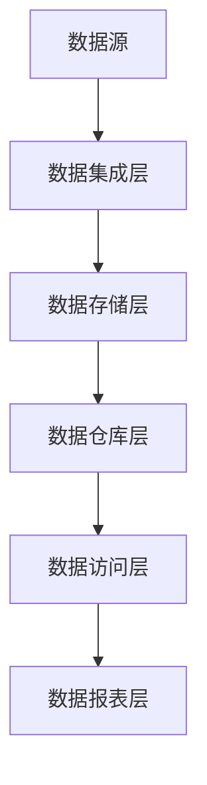
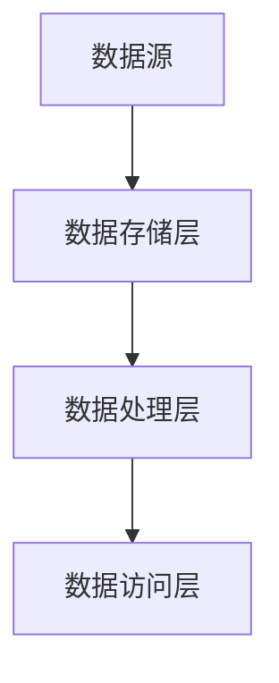
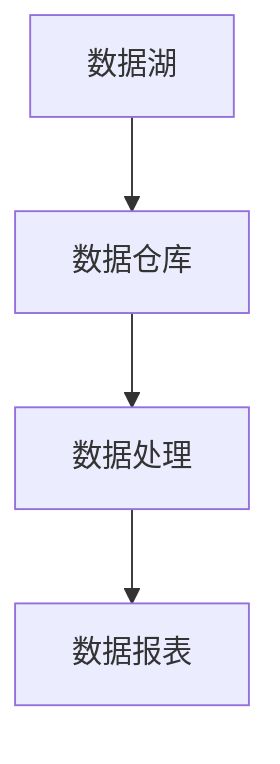

                 

# 数据仓库与数据湖原理与代码实战案例讲解

> **关键词：** 数据仓库，数据湖，大数据处理，数据架构，技术实战

> **摘要：** 本文将深入探讨数据仓库与数据湖的概念、原理以及它们的实际应用场景。通过代码实战案例，读者将了解到如何搭建、配置和操作数据仓库与数据湖，掌握大数据处理的实用技能。

## 1. 背景介绍

### 1.1 数据仓库的定义与起源

数据仓库是一个用于存储、管理和分析大量历史数据的集中式系统。它的起源可以追溯到20世纪80年代末，当时企业开始意识到从历史数据中提取有价值信息的重要性。数据仓库的设计目的是支持企业决策过程，通过整合来自多个业务系统的数据，提供一致性和可分析的数据视图。

### 1.2 数据湖的概念与发展

随着大数据技术的发展，数据仓库的局限性逐渐显现。数据湖作为一种新的数据架构，旨在解决数据仓库在处理非结构化和半结构化数据方面的挑战。数据湖将原始数据存储在原格式中，不进行预定义的结构化处理，使得数据的存储和处理更加灵活。

### 1.3 数据仓库与数据湖的比较

- **数据存储格式：** 数据仓库通常存储结构化数据，而数据湖可以存储结构化、半结构化和非结构化数据。
- **数据处理：** 数据仓库在数据加载时进行结构化处理，数据湖在数据处理时保持原始格式。
- **性能与扩展性：** 数据湖在处理大规模数据时具有更好的扩展性，但查询性能可能不如数据仓库。

## 2. 核心概念与联系

### 2.1 数据仓库架构

数据仓库架构通常包括数据源、数据集成层、数据存储层、数据仓库层、数据访问层和数据报表层。以下是一个简化的数据仓库架构 Mermaid 流程图：



### 2.2 数据湖架构

数据湖架构通常包括数据源、数据存储层、数据处理层和数据访问层。以下是一个简化的数据湖架构 Mermaid 流程图：



### 2.3 数据仓库与数据湖的联系

数据仓库与数据湖都是大数据处理的核心组件，它们之间的关系如下：

- **数据共享：** 数据仓库中的数据通常来源于数据湖，数据湖作为数据仓库的数据源。
- **数据转换：** 数据湖中的原始数据在进入数据仓库前需要进行转换和清洗，以满足数据仓库的查询需求。
- **数据融合：** 数据仓库和数据湖的结合可以实现数据的全面分析和挖掘，提供更丰富的数据洞察。



## 3. 核心算法原理 & 具体操作步骤

### 3.1 数据仓库的ETL过程

数据仓库的核心算法原理是ETL（提取、转换、加载）。以下是ETL过程的详细步骤：

1. **提取（Extract）：** 从多个数据源（如关系数据库、日志文件、Web服务）中提取数据。
2. **转换（Transform）：** 对提取的数据进行清洗、格式转换、去重、聚合等操作。
3. **加载（Load）：** 将转换后的数据加载到数据仓库中，通常使用关系数据库存储。

### 3.2 数据湖的数据处理流程

数据湖的核心算法原理是数据流处理。以下是数据湖的数据处理流程：

1. **数据采集（Data Ingestion）：** 从各种数据源（如文件系统、实时流、外部API）中采集数据。
2. **数据存储（Data Storage）：** 将采集到的数据存储在分布式文件系统（如HDFS、Alluxio）中。
3. **数据处理（Data Processing）：** 使用批处理（如MapReduce、Spark）或实时处理（如Flink、Storm）对数据进行计算和分析。
4. **数据访问（Data Access）：** 提供数据查询和分析接口，如SQL接口、REST API。

## 4. 数学模型和公式 & 详细讲解 & 举例说明

### 4.1 数据仓库的查询优化

数据仓库的查询优化主要依赖于统计信息的使用。以下是查询优化的几个关键数学模型和公式：

- **选择率（Selectivity）：**
  $$Selectivity = \frac{符合条件的记录数}{总记录数}$$

- **数据分布（Data Distribution）：**
  数据分布可以用来预测查询的性能，常用的分布模型有均匀分布、正态分布等。

- **查询计划选择（Query Plan Selection）：**
  $$Cost = \sum_{T \in \text{Join Plans}} (\text{Scan Cost of } T \times \text{Join Cost of } T)$$
  选择成本最低的查询计划。

### 4.2 数据湖的分布式计算

数据湖的分布式计算依赖于MapReduce模型。以下是MapReduce的核心数学模型和公式：

- **Map函数（Map）：**
  $$\text{Map}(k_1, v_1) \rightarrow \text{list of } (k_2, v_2)$$
  映射输入数据到中间键值对。

- **Reduce函数（Reduce）：**
  $$\text{Reduce}(k_2, \text{list of } v_2) \rightarrow \text{output list of } (k_3, v_3)$$
  聚合中间键值对，生成最终输出。

### 4.3 举例说明

**示例1：数据仓库查询优化**

假设有一个包含100万条记录的学生表，其中有一列是学生的成绩。我们想要查询成绩在90分以上的学生记录。

- **选择率：**
  $$Selectivity = \frac{90000}{1000000} = 0.09$$

- **数据分布：**
  假设成绩的分布是正态分布，均值是75分，标准差是10分。

- **查询计划选择：**
  选择扫描整个表并使用索引的查询计划，因为选择率较低，使用索引可以提高查询性能。

**示例2：数据湖的MapReduce计算**

假设我们想要统计一个日志文件中所有访问请求的URL数量。

- **Map函数：**
  ```python
  def map(line):
      parts = line.split()
      yield ("URL", parts[1])
  ```

- **Reduce函数：**
  ```python
  def reduce(key, values):
      return sum(values)
  ```

## 5. 项目实战：代码实际案例和详细解释说明

### 5.1 开发环境搭建

在本节中，我们将使用Apache Hadoop生态系统来搭建一个简单的数据仓库和数据湖环境。以下步骤将指导您完成开发环境的搭建：

1. **安装Hadoop：**
   - 下载并安装Hadoop。
   - 配置Hadoop的集群环境。

2. **安装Hive：**
   - 下载并安装Hive。
   - 配置Hive的元数据库。

3. **安装Spark：**
   - 下载并安装Spark。
   - 配置Spark的集群环境。

### 5.2 源代码详细实现和代码解读

在本节中，我们将使用Hive和Spark来创建一个简单的数据仓库和数据湖项目。以下代码展示了如何执行ETL过程、数据湖数据处理以及数据查询：

**5.2.1 ETL过程**

```python
from pyspark.sql import SparkSession

# 创建Spark会话
spark = SparkSession.builder.appName("DataWarehouseAndLake").getOrCreate()

# 读取数据
data = spark.read.csv("data.csv", header=True)

# 数据清洗和转换
data_cleaned = data.filter((data['score'] > 90) & (data['score'] < 100))

# 加载到数据仓库
data_cleaned.write.mode("overwrite").saveAsTable("data_warehouse.table")

# 加载到数据湖
data_cleaned.write.format("parquet").mode("overwrite").save("data_lake/data_warehouse")

# 关闭Spark会话
spark.stop()
```

**5.2.2 数据湖数据处理**

```python
from pyspark.sql import SparkSession

# 创建Spark会话
spark = SparkSession.builder.appName("DataLakeProcessing").getOrCreate()

# 读取数据湖中的数据
data_lake = spark.read.parquet("data_lake/data_warehouse")

# 数据处理
data_processed = data_lake.groupBy("url").count()

# 存储结果
data_processed.write.format("parquet").mode("overwrite").save("data_lake/data_processed")

# 关闭Spark会话
spark.stop()
```

**5.2.3 数据查询**

```sql
-- 使用Hive查询数据仓库
SELECT * FROM data_warehouse.table;

-- 使用Spark SQL查询数据湖
SELECT url, count(*) as url_count FROM data_processed GROUP BY url;
```

### 5.3 代码解读与分析

在本节中，我们对上述代码进行了详细的解读和分析：

- **ETL过程：** 使用Spark读取CSV文件，进行数据清洗和转换，然后将清洗后的数据加载到数据仓库和数据湖中。
- **数据湖数据处理：** 使用Spark对数据湖中的数据进行批处理，计算每个URL的访问次数。
- **数据查询：** 使用Hive和Spark SQL对数据仓库和数据湖中的数据进行查询，获得所需的结果。

## 6. 实际应用场景

### 6.1 电子商务平台

电子商务平台可以使用数据仓库来存储销售数据，并通过数据湖处理用户行为数据，以实现精准营销和个性化推荐。

### 6.2 金融行业

金融行业可以利用数据仓库进行风险控制，而数据湖则用于处理来自交易、客户关系等系统的海量非结构化数据。

### 6.3 医疗保健

医疗保健行业可以使用数据仓库来存储患者信息，数据湖则用于分析基因数据和医疗记录，以支持疾病预测和治疗方案制定。

## 7. 工具和资源推荐

### 7.1 学习资源推荐

- **书籍：**
  - 《大数据技术导论》
  - 《数据仓库工具与技术》

- **论文：**
  - 《数据仓库和大数据处理技术》

- **博客：**
  - 《Hadoop实战》

- **网站：**
  - Apache Hadoop官网
  - Spark官网

### 7.2 开发工具框架推荐

- **数据仓库：**
  - Apache Hive
  - Apache Impala

- **数据湖：**
  - Apache Spark
  - Apache Flink

- **数据处理：**
  - Apache Hadoop
  - Apache Storm

### 7.3 相关论文著作推荐

- 《大数据时代的数据库技术》
- 《数据仓库与大数据处理》

## 8. 总结：未来发展趋势与挑战

数据仓库和数据湖作为大数据处理的核心技术，将继续发展并应对新的挑战：

- **数据集成与治理：** 随着数据来源的多样性和复杂性增加，如何高效地进行数据集成和治理将成为重要挑战。
- **实时数据处理：** 实时数据处理的性能和可扩展性需要进一步提升，以满足实时分析和决策的需求。
- **数据安全与隐私：** 随着数据量和数据类型的增加，如何保障数据安全和隐私将成为重要的课题。

## 9. 附录：常见问题与解答

### 9.1 数据仓库与数据湖的区别是什么？

数据仓库主要用于存储结构化数据，支持复杂的查询和分析。数据湖则可以存储结构化、半结构化和非结构化数据，提供更灵活的数据处理能力。

### 9.2 如何选择数据仓库或数据湖？

根据数据类型、查询需求和性能要求选择。对于结构化数据和高性能查询需求，选择数据仓库；对于非结构化和半结构化数据以及灵活性要求，选择数据湖。

### 9.3 数据仓库与数据湖的性能比较如何？

数据仓库在查询性能方面通常优于数据湖，但数据湖在扩展性和灵活性方面具有优势。选择应根据具体应用场景和需求进行权衡。

## 10. 扩展阅读 & 参考资料

- 《大数据技术导论》
- 《数据仓库与大数据处理技术》
- Apache Hadoop官网
- Apache Spark官网
- Apache Flink官网

### 作者信息

- 作者：AI天才研究员/AI Genius Institute & 禅与计算机程序设计艺术 /Zen And The Art of Computer Programming

以上是关于“数据仓库与数据湖原理与代码实战案例讲解”的文章。本文通过深入探讨数据仓库与数据湖的概念、原理和实际应用场景，结合代码实战案例，帮助读者掌握大数据处理的实用技能。希望本文对您在数据仓库和数据湖领域的学习和实践有所帮助。

