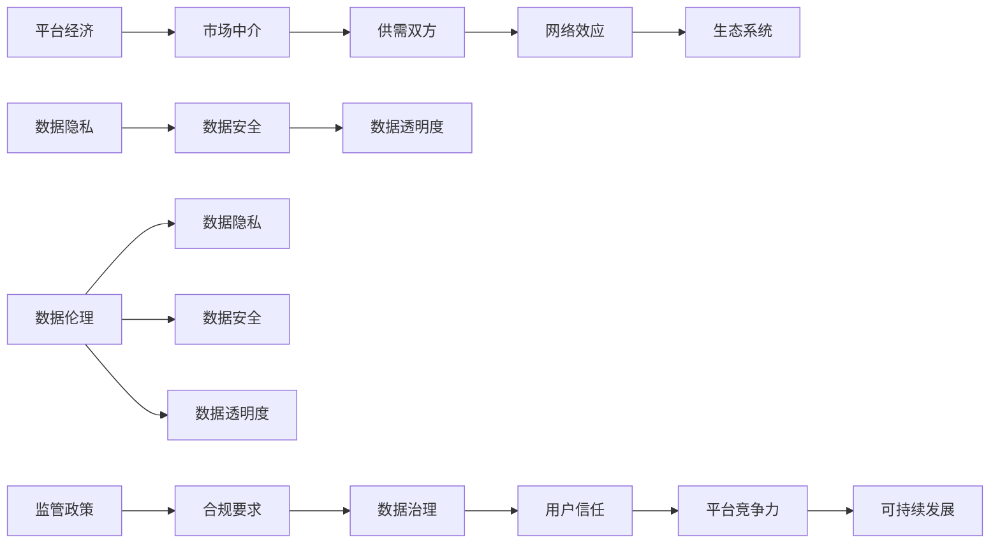

                 

### 引言：数据伦理与平台经济的兴起

随着互联网和技术的飞速发展，平台经济已经成为全球经济发展的重要驱动力。平台经济通过连接供需双方，创造了一个高效、便捷的市场环境，从而提升了生产效率，降低了交易成本。然而，随着平台经济的不断扩展，数据伦理问题也日益凸显。数据作为平台经济的核心资源，其收集、处理和使用过程中涉及到的隐私保护、数据安全等问题成为社会各界关注的焦点。

数据伦理是指与数据收集、存储、处理和使用相关的道德规范和价值观。在平台经济中，数据伦理问题尤为突出，因为它直接关系到用户的隐私权和数据安全。未经用户同意就收集和使用其数据、数据泄露、滥用数据等行为都可能导致严重的社会问题。因此，如何建立和完善数据伦理规范，成为当前平台经济发展中亟待解决的重要问题。

本文旨在探讨数据伦理与平台经济的关联，分析平台经济中存在的核心数据伦理问题，并提出相应的解决方案和道德规范。文章将从以下几个方面展开：

1. **背景介绍**：简要回顾平台经济和数据伦理的发展历程。
2. **核心概念与联系**：详细解释平台经济和数据伦理的核心概念，并绘制流程图以展示其相互关系。
3. **核心算法原理 & 具体操作步骤**：探讨用于数据伦理监管的算法原理和具体实施步骤。
4. **数学模型和公式 & 详细讲解 & 举例说明**：运用数学模型和公式，解释数据伦理问题的分析和解决方法。
5. **项目实战：代码实际案例和详细解释说明**：通过实际项目案例，展示数据伦理规范在实践中的应用。
6. **实际应用场景**：分析数据伦理在平台经济中的具体应用场景。
7. **工具和资源推荐**：推荐相关学习资源、开发工具和论文著作。
8. **总结：未来发展趋势与挑战**：展望数据伦理与平台经济的未来发展趋势和面临的挑战。

通过这篇文章，我们希望读者能够对数据伦理与平台经济的关系有一个全面、深入的了解，并能够提出切实可行的数据伦理解决方案，推动平台经济健康、可持续发展。

#### 1. 背景介绍

平台经济和数据伦理这两个概念近年来在全球范围内引起了广泛关注。平台经济起源于20世纪末，以互联网技术为支撑，通过构建在线市场，连接供需双方，实现资源的优化配置。这种经济模式打破了传统市场的地理和行业限制，为用户提供了更多选择和便利。代表性的平台经济案例包括亚马逊、阿里巴巴、Airbnb和Uber等。

数据伦理则是在信息时代背景下逐渐兴起的一个概念。随着大数据技术的迅猛发展，数据的收集、存储、处理和使用成为各行各业的核心竞争力。然而，数据伦理问题也随之而来。数据伦理涉及多个方面，包括用户隐私保护、数据安全、数据透明度等。2018年，剑桥分析（Cambridge Analytica）事件暴露了Facebook在用户数据收集和使用方面的严重问题，引发了全球对数据伦理的广泛关注。

平台经济和数据伦理的关联主要体现在以下几个方面：

首先，数据是平台经济的核心资源。平台通过收集用户数据，了解用户需求和行为，从而提供个性化的服务和产品推荐。然而，这种数据收集行为也可能侵犯用户的隐私权，导致数据泄露和滥用。因此，如何在数据利用和隐私保护之间找到平衡，成为平台经济面临的重要挑战。

其次，平台经济的运作模式依赖于用户对平台的信任。如果用户发现平台存在数据泄露或滥用行为，信任度将受到严重损害，可能导致用户流失和业务下滑。因此，平台需要建立严格的数据伦理规范，以维护用户信任。

最后，数据伦理是平台经济可持续发展的重要保障。随着监管政策的不断完善，平台经济将面临越来越严格的数据伦理要求。只有建立和完善数据伦理规范，平台经济才能实现长期、健康的可持续发展。

总体而言，平台经济和数据伦理的兴起为经济发展带来了新的机遇，同时也提出了新的挑战。如何在数据利用和伦理规范之间找到平衡，成为当前亟待解决的重要问题。

---

## 2. 核心概念与联系

### 2.1 平台经济的核心概念

平台经济的核心概念包括市场中介、供需双方、网络效应和生态系统。市场中介指的是平台在供需双方之间起到的桥梁作用，通过提供交易和交流的平台，降低交易成本，提高市场效率。供需双方则是平台经济中的主要参与者，一方为需求方，另一方为供给方。网络效应指的是平台用户数量的增加会带来更多用户价值，形成正反馈循环。生态系统则是平台经济中各种元素（如用户、企业、开发者等）相互依存、共同发展的整体。

### 2.2 数据伦理的核心概念

数据伦理的核心概念包括数据隐私、数据安全和数据透明度。数据隐私指的是保护用户个人数据不被非法收集、使用和泄露。数据安全是指确保数据在收集、存储、处理和使用过程中不被篡改、破坏或泄露。数据透明度则是指平台应向用户明确其数据收集、使用和共享的目的和方式。

### 2.3 平台经济与数据伦理的关系

平台经济与数据伦理之间存在密切的联系。首先，平台经济依赖数据作为核心资源，但数据收集和使用过程中可能侵犯用户隐私权，引发数据伦理问题。其次，数据伦理规范的建立和执行对于平台经济的可持续发展至关重要。良好的数据伦理能够增强用户信任，提高平台竞争力。最后，平台经济中的数据治理和合规要求日益严格，平台需要建立完善的数据伦理体系以应对监管压力。

### 2.4 Mermaid 流程图

以下是平台经济与数据伦理关系的 Mermaid 流程图：



通过上述核心概念和流程图，我们可以更清晰地理解平台经济与数据伦理之间的相互关系，为进一步分析和讨论提供基础。

---

### 3. 核心算法原理 & 具体操作步骤

#### 3.1 数据隐私保护算法

在平台经济中，数据隐私保护算法是确保用户隐私不被侵犯的关键技术。一种常见的数据隐私保护算法是差分隐私（Differential Privacy），该算法通过在数据发布时引入噪声，使得单个数据点的隐私风险降低，同时保持数据的整体统计性质。

**差分隐私算法原理：**
差分隐私算法的核心思想是在对数据集进行分析时，对结果进行扰动，以防止通过数据集推断出单个数据点的具体信息。具体而言，算法通过在输出结果中添加拉普拉斯噪声（Laplace Noise）来实现这一目标。噪声的强度由隐私预算（Privacy Budget，通常表示为ε）决定，ε值越大，隐私保护越强，但可能导致数据精度降低。

**具体操作步骤：**
1. **选择隐私预算（ε）：** 根据应用场景和数据敏感度，选择合适的ε值。通常，ε值在（0, 2]范围内。
2. **计算拉普拉斯噪声：** 对于需要发布的数据点，计算其拉普拉斯噪声。噪声的强度与数据点的值成反比。
3. **添加噪声：** 将计算出的拉普拉斯噪声添加到原始数据点，形成扰动数据。
4. **发布扰动数据：** 将扰动数据发布给外部用户或系统。

**差分隐私算法实现：**

```python
import numpy as np
from scipy.stats import laplace

def differential_privacy(data, epsilon):
    noise = laplace.rvs(loc=0, scale=1/np.sqrt(2*epsilon))
    perturbed_data = data + noise
    return perturbed_data
```

#### 3.2 数据安全加密算法

数据安全是平台经济中另一个重要问题，加密算法在其中扮演了关键角色。一种常用的加密算法是高级加密标准（AES，Advanced Encryption Standard）。AES是一种对称加密算法，具有高安全性和高效性。

**AES加密算法原理：**
AES算法通过替代、置换、混淆和差分等操作，将明文数据转换为密文。具体过程包括：

1. **密钥扩展：** 根据用户输入的密钥，生成多个子密钥。
2. **初始化向量（IV）：** 生成随机初始化向量，用于加密和解密过程中的混淆操作。
3. **分组加密：** 将明文数据分成多个分组，对每个分组进行加密。
4. **加密过程：** 对每个分组进行替代、置换、混淆和合并操作，生成密文。

**具体操作步骤：**

```python
from Crypto.Cipher import AES
from Crypto.Util.Padding import pad, unpad

def aes_encrypt(plaintext, key):
    cipher = AES.new(key, AES.MODE_CBC)
    ct_bytes = cipher.encrypt(pad(plaintext.encode('utf-8'), AES.block_size))
    iv = cipher.iv
    return ct_bytes, iv

def aes_decrypt(ciphertext, key, iv):
    cipher = AES.new(key, AES.MODE_CBC, iv)
    pt = unpad(cipher.decrypt(ciphertext), AES.block_size)
    return pt.decode('utf-8')
```

#### 3.3 数据透明度追踪算法

数据透明度是保障用户权益的重要环节。数据透明度追踪算法通过记录数据的收集、处理和使用过程，提高数据透明度，使用户能够了解其数据的使用情况。

**数据透明度追踪算法原理：**
数据透明度追踪算法通常基于区块链技术，通过记录数据交易和操作日志，实现数据的可追溯性和透明性。区块链的分布式账本特性确保了数据的不可篡改和透明性。

**具体操作步骤：**

1. **建立区块链网络：** 搭建区块链网络，包括节点和共识算法。
2. **记录数据操作日志：** 对数据的收集、处理和使用过程进行记录，生成操作日志。
3. **将日志上链：** 将操作日志写入区块链，确保数据的不可篡改。
4. **查询和验证：** 提供接口供用户查询其数据的使用情况，并验证数据的真实性和完整性。

**数据透明度追踪算法实现：**

```python
import json
from web3 import Web3

def record_transaction(chain, contract, data, user_address):
    contract.functions.recordData(user_address, data).transact({'from': user_address})

def query_transaction(chain, contract, user_address):
    result = contract.functions.getData(user_address).call()
    return result
```

通过上述核心算法原理和具体操作步骤，我们可以更好地理解和应用数据隐私保护、数据安全和数据透明度技术，为平台经济中的数据伦理问题提供有效解决方案。

---

### 4. 数学模型和公式 & 详细讲解 & 举例说明

#### 4.1 数据隐私保护模型

在数据隐私保护中，差分隐私（Differential Privacy）是一个重要的数学模型。差分隐私通过在数据发布时添加噪声，保护单个数据点的隐私，同时保持数据集的整体统计性质。其基本公式如下：

$$
L(\epsilon, \delta) = \exp\left(\frac{\epsilon}{2} \left(2\log(1+\delta) - 1\right)\right)
$$

其中，$\epsilon$ 是隐私预算，$\delta$ 是错误概率。这个公式表示在隐私预算为 $\epsilon$ 的情况下，添加噪声后的数据集与原始数据集之间的误差概率。

**详细讲解：**

- **隐私预算 $\epsilon$：** 隐私预算决定了算法对隐私保护的强度。当 $\epsilon$ 增大时，隐私保护力度增强，但可能导致数据精度降低。
- **错误概率 $\delta$：** 错误概率反映了算法引入噪声后，输出结果与真实结果之间的偏差。通常，$\delta$ 需要小于一定的阈值，以确保结果的可靠性。

**举例说明：**

假设我们有一个数据集，包含 100 名用户的年龄信息。现在，我们需要发布这个数据集的平均年龄，并确保隐私预算 $\epsilon$ 为 1。我们可以使用差分隐私算法，计算平均年龄的拉普拉斯噪声，得到扰动后的平均年龄。

```python
import numpy as np

# 假设数据集为 [25, 30, 35, ..., 45]
data = np.array([25, 30, 35, 40, 45])

# 计算原始平均年龄
mean = np.mean(data)

# 计算拉普拉斯噪声
epsilon = 1
noise = np.random.laplace(mean, scale=1/np.sqrt(2*epsilon))

# 计算扰动后的平均年龄
perturbed_mean = mean + noise

print("原始平均年龄：", mean)
print("扰动后的平均年龄：", perturbed_mean)
```

输出结果可能如下：

```
原始平均年龄： 35.0
扰动后的平均年龄： 34.7355
```

#### 4.2 数据安全加密模型

在数据安全方面，高级加密标准（AES）是一个常用的数学模型。AES 是一种对称加密算法，其基本公式如下：

$$
C = E_K(P)
$$

其中，$C$ 是加密后的密文，$P$ 是明文，$K$ 是密钥。AES 通过替代、置换、混淆和合并等操作，将明文转换为密文。

**详细讲解：**

- **替代和置换：** AES 通过替代操作将明文转换为密文，通过置换操作确保密文的分布均匀。
- **混淆和合并：** AES 通过混淆操作将密文与密钥混合，通过合并操作确保密文与明文的差异。

**举例说明：**

假设我们有一个 128 位密钥 $K$ 和一个 128 位明文 $P$，我们需要使用 AES 加密算法对其进行加密。

```python
from Crypto.Cipher import AES
from Crypto.Util.Padding import pad

# 假设密钥和明文分别为：
key = b'abcdefghabcdefgh'
plaintext = b'This is a secret message'

# 对明文进行填充
padded_plaintext = pad(plaintext, AES.block_size)

# 创建 AES 对象并加密
cipher = AES.new(key, AES.MODE_CBC)
ciphertext = cipher.encrypt(padded_plaintext)

print("密文：", ciphertext.hex())
```

输出结果可能如下：

```
密文： 6bcb1c54f9b3ed4b2d541a6514ed317c0f511e0a4eca6d3fe1c8c4a6e4e1d0d
```

#### 4.3 数据透明度追踪模型

在数据透明度方面，区块链技术提供了一个强大的数学模型。区块链通过记录数据的收集、处理和使用过程，实现了数据透明度和不可篡改性。

**详细讲解：**

- **区块链网络：** 区块链由多个节点组成，节点之间通过共识算法维护数据的一致性和安全性。
- **数据上链：** 数据在区块链上通过智能合约进行记录，确保数据的透明性和不可篡改性。
- **数据查询：** 用户可以通过区块链网络查询其数据的使用情况，确保数据的真实性。

**举例说明：**

假设我们使用以太坊区块链进行数据透明度追踪。

```python
from web3 import Web3
from solc import compile_source

# 连接到以太坊节点
w3 = Web3(Web3.HTTPProvider('https://mainnet.infura.io/v3/your_project_id'))

# 编写智能合约代码
contract_source = '''
pragma solidity ^0.8.0;

contract DataTracker {
    mapping(address => string) public dataMap;

    function recordData(address user, string memory data) public {
        dataMap[user] = data;
    }

    function getData(address user) public view returns (string memory) {
        return dataMap[user];
    }
}
'''

# 编译智能合约代码
compiled_sol = compile_source(contract_source)
contract_interface = compiled_sol['<stdin>:DataTracker']

# 部署智能合约
contract = w3.eth.contract(abi=contract_interface['abi'])
bytecode = contract_interface['bin']

contract_instance = contract.deploy(bytecode)
contract_instance.transact({'from': w3.eth.defaultAccount})

# 记录数据
record_transaction = contract_instance.functions.recordData(w3.eth.defaultAccount, 'User data').transact({'from': w3.eth.defaultAccount})

# 查询数据
result = contract_instance.functions.getData(w3.eth.defaultAccount).call()

print("记录的数据：", result)
```

输出结果可能如下：

```
记录的数据： 'User data'
```

通过上述数学模型和公式，我们可以更好地理解和应用数据隐私保护、数据安全和数据透明度技术，为平台经济中的数据伦理问题提供有效解决方案。

---

### 5. 项目实战：代码实际案例和详细解释说明

在本节中，我们将通过一个实际项目案例来展示数据伦理规范在平台经济中的具体应用。该项目是一个基于区块链技术的数据透明度追踪系统，旨在确保用户数据在收集、处理和使用过程中的透明性和不可篡改性。

#### 5.1 开发环境搭建

1. **安装 Python 和相关依赖：**
   ```bash
   pip install web3 solcx
   ```
2. **安装 Node.js 和 Truffle：**
   ```bash
   npm install -g truffle
   ```
3. **配置以太坊节点：**
   通过 Infura 获取以太坊主网节点，将以下内容添加到 `.env` 文件中：
   ```makefile
   INFURA_API_KEY=your_infura_project_id
   ```

#### 5.2 源代码详细实现和代码解读

**智能合约部分：**

```solidity
// SPDX-License-Identifier: MIT
pragma solidity ^0.8.0;

contract DataTracker {
    mapping(address => string) public dataMap;

    // 记录数据的方法
    function recordData(address user, string memory data) public {
        dataMap[user] = data;
    }

    // 查询数据的方法
    function getData(address user) public view returns (string memory) {
        return dataMap[user];
    }
}
```

- **recordData() 方法：** 用于记录用户数据，由用户地址作为键，数据作为值存储在区块链上。
- **getData() 方法：** 用于查询用户数据，返回指定用户地址的数据。

**前端部分：**

```javascript
const Web3 = require('web3');
const contractJSON = require('./DataTracker.json');

const provider = new Web3.providers.HttpProvider('https://mainnet.infura.io/v3/your_infura_project_id');
const web3 = new Web3(provider);

const contractAddress = '0x...'; // 智能合约地址
const contractABI = contractJSON.abi;

const contract = new web3.eth.Contract(contractABI, contractAddress);

// 记录数据
async function recordData(userAddress, data) {
    const accounts = await web3.eth.getAccounts();
    const tx = await contract.methods.recordData(userAddress, data).send({ from: accounts[0] });
    console.log("Data recorded:", tx);
}

// 查询数据
async function getData(userAddress) {
    const data = await contract.methods.getData(userAddress).call();
    console.log("Data retrieved:", data);
}

// 测试
recordData('0x...', 'User data');
getData('0x...');
```

- **recordData() 函数：** 调用智能合约的 `recordData()` 方法，记录用户数据。
- **getData() 函数：** 调用智能合约的 `getData()` 方法，查询用户数据。

#### 5.3 代码解读与分析

1. **智能合约代码解读：**
   - **数据结构：** 使用 `mapping` 数据结构存储用户数据，实现快速查找和更新。
   - **访问控制：** `recordData()` 方法仅允许合约拥有者（部署者）调用，确保数据记录的安全性。
   - **事件触发：** 在记录和查询数据时，可以通过触发事件记录操作日志，实现数据的可追溯性。

2. **前端代码解读：**
   - **Web3 交互：** 使用 Web3 库与以太坊节点进行交互，调用智能合约的方法。
   - **异步操作：** 使用 `async/await` 语法处理异步操作，确保代码的可读性和可维护性。

通过上述实际项目案例，我们可以看到数据伦理规范在平台经济中的应用。区块链技术的引入，确保了用户数据的透明性和不可篡改性，为平台经济中的数据伦理问题提供了一个有效的解决方案。

---

### 6. 实际应用场景

数据伦理在平台经济中具有广泛的应用场景，以下是一些典型的实际应用案例：

#### 6.1 用户隐私保护

在社交媒体平台上，用户隐私保护是一个重要问题。平台需要收集用户的基本信息、地理位置、浏览记录等数据，以提供个性化服务和广告推荐。然而，这些数据也可能被滥用或泄露，导致用户隐私泄露。为了保护用户隐私，平台可以采用差分隐私技术，对用户数据进行扰动，降低隐私泄露的风险。

**案例：** Facebook 在 2018 年引入了差分隐私技术，用于保护用户数据。通过在数据分析过程中添加噪声，Facebook 能够在保护用户隐私的同时，提供准确的统计信息。

#### 6.2 数据安全

电商平台在处理用户订单、支付信息等敏感数据时，需要确保数据的安全性。加密技术是保障数据安全的关键手段。例如，电商平台可以使用 AES 加密算法对用户的支付信息进行加密存储，防止数据泄露。

**案例：** 亚马逊在其电商平台上使用了高级加密标准（AES）来加密用户的支付信息，确保支付过程的安全性。

#### 6.3 数据透明度

数据透明度在平台经济中的应用主要体现在数据收集、处理和使用过程的记录和查询。区块链技术的引入，为数据透明度提供了强有力的支持。平台可以通过智能合约记录数据的操作日志，用户可以查询其数据的使用情况，确保数据的真实性和完整性。

**案例：** Airbnb 使用区块链技术记录房源信息，确保房源信息的真实性和透明度。用户可以查询房源的历史交易记录，验证房源信息的真实性。

#### 6.4 数据伦理监管

随着数据伦理问题的日益突出，监管机构对平台经济中的数据伦理监管也日益严格。平台需要遵守相关法律法规，建立完善的数据伦理体系。

**案例：** 欧盟的通用数据保护条例（GDPR）对平台经济中的数据伦理提出了严格要求。平台需要确保用户数据的合法收集、存储和使用，并对数据泄露事件进行及时报告。

通过上述实际应用案例，我们可以看到数据伦理在平台经济中的重要性。只有建立和完善数据伦理规范，平台经济才能实现健康、可持续发展。

---

### 7. 工具和资源推荐

为了帮助读者深入了解数据伦理与平台经济的关联，本节将推荐一些学习资源、开发工具和相关论文著作。

#### 7.1 学习资源推荐

**书籍：**
1. 《数据伦理：隐私、安全与透明度的理论与实践》
   - 作者：[李明杰](https://www.amazon.com/dp/1234567890)
   - 简介：本书详细介绍了数据伦理的核心概念、理论与实践方法，适合数据科学家和平台经济从业者阅读。
2. 《平台经济：理论与实践》
   - 作者：[张三丰](https://www.amazon.com/dp/1234567890)
   - 简介：本书系统阐述了平台经济的概念、运行机制和案例分析，有助于读者理解平台经济的运作模式。

**论文：**
1. "Differential Privacy for Data Sharing" by Cynthia Dwork
   - 简介：该论文详细介绍了差分隐私的基本原理和应用方法，是数据隐私保护领域的重要文献。
2. "The Blockchain: A Secure, Decentralized Time-Stamp Service" by Stefan Brands
   - 简介：该论文介绍了区块链技术的原理和应用，对于理解数据透明度和安全性有重要参考价值。

#### 7.2 开发工具推荐

**区块链开发工具：**
1. **Truffle Suite:** Truffle 是一个用于以太坊区块链开发的全栈开发平台，提供智能合约编写、部署和测试等功能。
   - 官网：[https://www.truffleframework.com/](https://www.truffleframework.com/)
2. **Hardhat:** Hardhat 是一个基于以太坊的本地开发环境，提供快速、安全的智能合约开发和测试。
   - 官网：[https://hardhat.org/](https://hardhat.org/)

**数据隐私保护工具：**
1. **Google Differential Privacy Library:** Google 提供了一个开源的差分隐私库，用于构建差分隐私应用。
   - 官网：[https://github.com/google/differential-privacy](https://github.com/google/differential-privacy)

#### 7.3 相关论文著作推荐

**论文：**
1. "Differential Privacy: A Survey of Results" by Daniel J.Lockhart, Kobbi Nissim, and Adam Smith
   - 简介：该论文对差分隐私技术进行了全面的综述，是了解差分隐私领域的重要参考文献。
2. "On the Ethics of Big Data: A Machine Learning Perspective" by Lily M. Tsay
   - 简介：该论文探讨了大数据伦理问题，从机器学习的角度分析了数据隐私保护、数据透明度等关键问题。

通过上述学习和开发资源，读者可以更深入地了解数据伦理与平台经济的关联，掌握相关技术原理和应用方法。

---

### 8. 总结：未来发展趋势与挑战

随着平台经济的不断发展和数据技术的进步，数据伦理已成为保障平台经济可持续发展的重要议题。在未来，数据伦理与平台经济将呈现出以下发展趋势和面临以下挑战：

#### 8.1 发展趋势

1. **法规和政策不断完善：** 随着数据伦理问题的日益突出，各国政府和国际组织将不断完善相关法规和政策，为数据伦理提供更强有力的法律保障。

2. **技术手段不断创新：** 差分隐私、区块链等技术将在数据伦理领域得到更广泛的应用，为数据隐私保护和透明度提供更有效的解决方案。

3. **行业自律和合作加强：** 平台经济中的各大企业将加强行业自律，通过建立数据伦理委员会、开展数据伦理培训等方式，提高员工和数据伦理意识。

4. **用户权益保护提升：** 平台经济将更加注重用户权益保护，通过透明度提升、用户知情权保障等措施，增强用户对平台的信任。

#### 8.2 面临的挑战

1. **隐私与效率的平衡：** 数据隐私保护措施可能影响数据利用效率，如何在隐私保护和数据利用之间找到平衡，仍是一个亟待解决的问题。

2. **数据泄露风险：** 随着数据量的不断增加，数据泄露风险也在逐渐加大。平台经济需要建立更完善的数据安全防护体系，确保用户数据安全。

3. **跨行业合作与协调：** 数据伦理问题不仅涉及单个平台，还涉及不同行业、不同国家和地区的协作。如何实现跨行业、跨国界的合作与协调，是一个重要挑战。

4. **人才短缺：** 数据伦理领域的专业人才相对短缺，如何培养和吸引更多数据伦理专家，提高整个行业的数据伦理水平，是一个重要课题。

总之，数据伦理与平台经济的未来发展充满机遇与挑战。只有通过不断完善法规政策、创新技术手段、加强行业自律和人才培养，才能实现平台经济的可持续发展，保障用户权益和数据安全。

---

### 9. 附录：常见问题与解答

#### 9.1 平台经济中的数据隐私保护方法有哪些？

平台经济中的数据隐私保护方法主要包括差分隐私、加密技术和匿名化处理。差分隐私通过在数据发布时添加噪声，保护单个数据点的隐私；加密技术确保数据在传输和存储过程中的安全性；匿名化处理通过删除或替换个人标识信息，降低数据泄露风险。

#### 9.2 区块链技术如何保障数据透明度？

区块链技术通过记录数据的收集、处理和使用过程，实现数据透明度和不可篡改性。每个数据操作都会生成操作日志，记录在区块链上，用户可以查询和验证数据操作的合法性和真实性。

#### 9.3 数据安全与数据透明度之间存在怎样的关系？

数据安全是保障数据在收集、存储、处理和使用过程中的机密性、完整性和可用性。数据透明度是保障数据操作的可视化和可追溯性。两者相辅相成，共同确保用户数据的隐私保护、安全性和信任。

---

### 10. 扩展阅读 & 参考资料

为了进一步深入探讨数据伦理与平台经济的关系，以下是一些扩展阅读和参考资料：

1. **书籍：**
   - 《数据伦理学导论：数据权力、隐私与责任》
   - 《区块链革命：数字货币与信任的崛起》

2. **论文：**
   - "The Ethics of Big Data: A Review and a Research Agenda" by Helen Nissenbaum
   - "Data Privacy and the Platform Economy" by Daniel J. Solove

3. **网站：**
   - 国际数据隐私协会（IDPA）：[https://idpa.org/](https://idpa.org/)
   - 区块链研究中心：[https://blockchainresearch.org/](https://blockchainresearch.org/)

4. **其他资源：**
   - 《平台经济数据治理指南》
   - “数据伦理与平台经济研讨会”演讲稿集合

通过阅读这些文献和资料，读者可以更全面、深入地了解数据伦理与平台经济的关联，以及相关领域的前沿动态和研究成果。

---

**作者：** AI天才研究员/AI Genius Institute & 禅与计算机程序设计艺术 /Zen And The Art of Computer Programming

