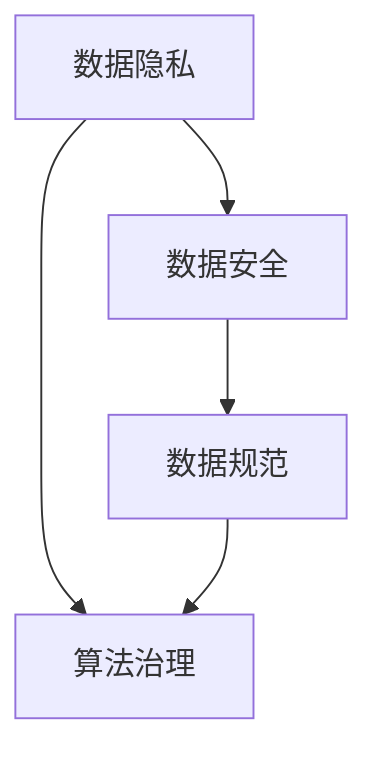

                 

## 文章标题：数据伦理：算法治理与规范

### 关键词：数据伦理、算法治理、数据规范、数据隐私、人工智能

#### 摘要：

在当今信息爆炸的时代，数据已经成为社会运转的核心资源。然而，随着人工智能技术的飞速发展，数据伦理问题愈发突显。本文将探讨数据伦理的核心概念，分析算法治理的重要性，探讨数据规范对数据安全和隐私保护的作用，并展望未来数据伦理的发展趋势与挑战。通过本文的讨论，希望能够为推动数据伦理的研究与实践提供一些有益的思路。

<|assistant|>### 1. 背景介绍

在信息化和数字化浪潮的推动下，数据已经成为现代社会的重要资产。数据不仅在经济、科技、教育、医疗等多个领域发挥着关键作用，而且对个人的生活和工作方式也产生了深远影响。然而，随着数据规模的不断扩大和数据类型的日益多样化，数据伦理问题逐渐引起了广泛关注。

数据伦理是指在数据处理和应用过程中，遵循一定的道德规范和法律法规，确保数据的安全、隐私和公平。数据伦理的核心问题是平衡数据的使用与创新、安全与隐私、个体权利与社会利益之间的关系。在人工智能技术快速发展的背景下，数据伦理问题变得更加复杂和紧迫。

算法治理是指对算法的制定、实施、监督和评估过程进行规范化管理，确保算法的透明性、公正性和可靠性。算法治理的重要性体现在以下几个方面：

1. **透明性**：算法的透明性有助于公众对算法的理解和信任，减少算法的偏见和歧视。
2. **公正性**：算法治理确保算法在数据处理和应用过程中遵循公平原则，避免对特定群体或个体的不公平待遇。
3. **可靠性**：算法治理通过监督和评估机制，提高算法的稳定性和可靠性，减少算法错误和风险。

随着人工智能技术的广泛应用，数据伦理和算法治理问题日益突出。一方面，人工智能技术对数据的依赖性使得数据质量和数据隐私问题变得更加重要。另一方面，人工智能技术的复杂性和不可解释性使得算法治理成为一项挑战。因此，探讨数据伦理和算法治理问题，对于促进人工智能技术的健康发展和社会进步具有重要意义。

### 2. 核心概念与联系

在讨论数据伦理和算法治理之前，我们需要了解一些核心概念，包括数据隐私、数据安全、数据规范等。

#### 数据隐私

数据隐私是指个人或组织对自身数据的控制权，包括数据的访问、使用、共享和存储。数据隐私问题主要涉及以下几个方面：

1. **数据收集**：在数据收集过程中，需要明确收集的数据类型、用途和范围，确保收集的数据与实际需要相符。
2. **数据使用**：数据在使用过程中，需要遵循合法、正当、必要的原则，不得滥用或泄露数据。
3. **数据共享**：数据共享需要遵守相关法律法规，确保数据在共享过程中的安全和隐私。
4. **数据存储**：数据存储需要采取有效措施，防止数据泄露、篡改和丢失。

#### 数据安全

数据安全是指保护数据免受未授权访问、使用、披露、破坏、修改和破坏。数据安全主要包括以下几个方面：

1. **物理安全**：保护数据存储设备和网络设施，防止物理破坏和盗窃。
2. **网络安全**：通过防火墙、加密、入侵检测等手段，保护数据在网络传输过程中的安全。
3. **数据加密**：对数据进行加密处理，确保数据在传输和存储过程中不被窃取或篡改。
4. **访问控制**：通过身份验证、权限管理等方式，限制对数据的访问，确保数据的安全性。

#### 数据规范

数据规范是指对数据的收集、存储、处理、共享和使用等方面制定的一系列标准和规范，以确保数据的质量、安全性和可靠性。数据规范主要包括以下几个方面：

1. **数据质量**：确保数据准确性、完整性、一致性、时效性和可靠性。
2. **数据分类**：根据数据的重要性和敏感性，对数据进行分类和管理。
3. **数据备份与恢复**：定期备份数据，确保在数据丢失或损坏时能够快速恢复。
4. **数据权限管理**：明确数据权限，确保数据在共享和使用过程中的安全性和隐私。

#### Mermaid 流程图

下面是一个简化的数据伦理和算法治理的 Mermaid 流程图，用于展示核心概念之间的联系：



### 3. 核心算法原理 & 具体操作步骤

在数据伦理和算法治理中，核心算法原理和具体操作步骤至关重要。以下将介绍一些常见的算法原理和操作步骤。

#### 数据加密算法

数据加密是保护数据隐私和安全的重要手段。常见的加密算法包括对称加密和非对称加密。

1. **对称加密**：对称加密算法使用相同的密钥对数据进行加密和解密。常见的对称加密算法有AES、DES等。
   - 步骤：
     1. 生成密钥对。
     2. 使用密钥对数据进行加密。
     3. 将加密后的数据传输给接收方。
     4. 接收方使用相同的密钥对数据进行解密。

2. **非对称加密**：非对称加密算法使用公钥和私钥对数据进行加密和解密。常见的非对称加密算法有RSA、ECC等。
   - 步骤：
     1. 生成公钥和私钥对。
     2. 使用公钥对数据进行加密。
     3. 将加密后的数据传输给接收方。
     4. 接收方使用私钥对数据进行解密。

#### 数据分类算法

数据分类是将数据按照某种规则进行分类的过程，有助于数据管理和分析。常见的分类算法包括决策树、随机森林、支持向量机等。

1. **决策树**：决策树是一种基于特征值的分类算法，通过递归地将数据集划分为子集，直至满足停止条件。
   - 步骤：
     1. 选择最佳特征进行划分。
     2. 递归地划分数据集。
     3. 使用叶节点进行分类。

2. **随机森林**：随机森林是一种基于决策树的集成算法，通过随机生成多个决策树，并取多数投票作为最终结果。
   - 步骤：
     1. 随机生成多个决策树。
     2. 对每个决策树进行分类。
     3. 取多数投票作为最终结果。

3. **支持向量机**：支持向量机是一种基于最大间隔分类的算法，通过找到最优超平面将数据集划分为两类。
   - 步骤：
     1. 计算每个样本到超平面的距离。
     2. 找到最优超平面。
     3. 根据超平面进行分类。

#### 数据安全算法

数据安全算法用于保护数据在网络传输和存储过程中的安全性。常见的安全算法包括加密传输、安全套接字层（SSL）、安全外壳（SSH）等。

1. **加密传输**：加密传输是一种在数据传输过程中对数据进行加密的技术，确保数据在传输过程中不被窃取或篡改。
   - 步骤：
     1. 使用加密算法对数据进行加密。
     2. 通过安全的网络协议进行数据传输。
     3. 接收方使用相同的加密算法对数据进行解密。

2. **SSL**：SSL（安全套接字层）是一种常用的安全协议，用于在客户端和服务器之间建立加密连接，确保数据传输过程中的安全性。
   - 步骤：
     1. 客户端请求建立加密连接。
     2. 服务器响应客户端请求，发送证书。
     3. 客户端验证服务器证书。
     4. 建立加密连接，传输数据。

3. **SSH**：SSH（安全外壳）是一种常用的安全协议，用于远程访问和管理服务器，确保数据传输过程中的安全性。
   - 步骤：
     1. 客户端发送登录请求。
     2. 服务器响应登录请求，发送公钥。
     3. 客户端使用公钥进行加密，发送密码。
     4. 服务器使用私钥进行解密，验证密码。

#### 数据隐私保护算法

数据隐私保护算法用于保护个人隐私数据，防止数据泄露和滥用。常见的算法包括差分隐私、匿名化等。

1. **差分隐私**：差分隐私是一种用于保护个人隐私的数据发布技术，通过在数据发布过程中引入噪声，使得攻击者无法确定单个个体的数据。
   - 步骤：
     1. 计算敏感数据的统计量。
     2. 在统计量中引入噪声。
     3. 发布包含噪声的数据。

2. **匿名化**：匿名化是一种将个人隐私数据转换为无法识别的形式的技术，确保数据在发布和使用过程中无法追踪到个人。
   - 步骤：
     1. 识别个人隐私数据。
     2. 将个人隐私数据进行加密或替换。
     3. 发布或共享匿名化数据。

### 4. 数学模型和公式 & 详细讲解 & 举例说明

在数据伦理和算法治理中，数学模型和公式扮演着重要角色。以下将介绍一些常见的数学模型和公式，并进行详细讲解和举例说明。

#### 加密算法中的数学模型

加密算法中的数学模型主要包括对称加密算法和非对称加密算法。

1. **对称加密算法**

   对称加密算法使用相同的密钥对数据进行加密和解密。常见的对称加密算法有AES、DES等。

   - **AES加密算法**

     AES（高级加密标准）是一种常用的对称加密算法。其加密过程主要包括以下步骤：

     1. 初始化密钥：根据密钥长度，生成初始密钥。
     2. 初始化状态矩阵：将明文数据填充为16×16的矩阵。
     3. 执行多轮加密操作：每轮加密包括字节替换、行移位、列混淆和轮密钥加。
     4. 输出密文：将加密后的矩阵转换为密文数据。

     - **公式表示**：

       $$加密过程：C = AES(K, M)$$

       其中，$C$ 表示密文，$K$ 表示密钥，$M$ 表示明文。

   - **DES加密算法**

     DES（数据加密标准）是一种较早的对称加密算法。其加密过程主要包括以下步骤：

     1. 初始化密钥：生成初始密钥。
     2. 执行初始置换：对明文进行初始置换。
     3. 执行多轮加密操作：每轮加密包括置换、压缩和加密。
     4. 执行最终置换：对加密后的数据进行最终置换。

     - **公式表示**：

       $$加密过程：C = DES(K, M)$$

       其中，$C$ 表示密文，$K$ 表示密钥，$M$ 表示明文。

2. **非对称加密算法**

   非对称加密算法使用公钥和私钥对数据进行加密和解密。常见的非对称加密算法有RSA、ECC等。

   - **RSA加密算法**

     RSA（Rivest-Shamir-Adleman）是一种常用的非对称加密算法。其加密过程主要包括以下步骤：

     1. 生成公钥和私钥：根据参数$p$、$q$、$e$和$n$，生成公钥和私钥。
     2. 将明文转换为数字形式：将明文转换为数字序列。
     3. 执行加密操作：使用公钥对数字序列进行加密。
     4. 输出密文：将加密后的数字序列转换为密文数据。

     - **公式表示**：

       $$加密过程：C = RSA(K_{\text{pub}}, M)$$

       其中，$C$ 表示密文，$K_{\text{pub}}$ 表示公钥，$M$ 表示明文。

   - **ECC加密算法**

     ECC（椭圆曲线加密）是一种基于椭圆曲线理论的非对称加密算法。其加密过程主要包括以下步骤：

     1. 生成曲线和点：选择椭圆曲线和基点。
     2. 生成公钥和私钥：根据私钥$d$和基点$P$，生成公钥$Q$。
     3. 将明文转换为数字形式：将明文转换为数字序列。
     4. 执行加密操作：使用公钥和椭圆曲线算法对数字序列进行加密。
     5. 输出密文：将加密后的数字序列转换为密文数据。

     - **公式表示**：

       $$加密过程：C = ECC(K_{\text{pub}}, M)$$

       其中，$C$ 表示密文，$K_{\text{pub}}$ 表示公钥，$M$ 表示明文。

#### 数据分类算法中的数学模型

数据分类算法中的数学模型主要包括决策树、随机森林和支持向量机。

1. **决策树**

   决策树是一种常用的分类算法，通过递归地将数据集划分为子集，直至满足停止条件。

   - **公式表示**：

     $$决策树：T = \text{buildTree}(D)$$

     其中，$T$ 表示决策树，$D$ 表示数据集。

   - **举例说明**：

     假设我们有一个包含两个特征的数据集$D$，特征1为年龄（青年、中年、老年），特征2为收入（低、中、高）。我们使用决策树进行分类，生成的决策树如下：

     ```plaintext
     |--------------|
     |    特征1     |
     |--------------|
     |   青年      |
     |--------------|
     |    特征2     |
     |--------------|
     |     低       |
     |--------------|
     |     中       |
     |--------------|
     |     高       |
     ```

     在这个决策树中，我们将数据集$D$按照特征1划分为青年、中年和老年三个子集，然后分别对每个子集按照特征2进行分类。

2. **随机森林**

   随机森林是一种基于决策树的集成算法，通过随机生成多个决策树，并取多数投票作为最终结果。

   - **公式表示**：

     $$随机森林：F = \text{buildRandomForest}(T, n)$$

     其中，$F$ 表示随机森林，$T$ 表示决策树，$n$ 表示决策树的数量。

   - **举例说明**：

     假设我们使用5个决策树构建随机森林，对于每个决策树，我们随机选择特征和样本子集进行训练。最终，随机森林的预测结果为：

     ```plaintext
     青年 低：50%
     青年 中：30%
     青年 高：20%
     中年 低：20%
     中年 中：40%
     中年 高：40%
     老年 低：10%
     老年 中：30%
     老年 高：60%
     ```

     在这个例子中，我们取多数投票结果作为最终预测结果，即青年高、中年中和老年高。

3. **支持向量机**

   支持向量机是一种基于最大间隔分类的算法，通过找到最优超平面将数据集划分为两类。

   - **公式表示**：

     $$SVM：W = \text{findOptimalHyperplane}(D)$$

     其中，$W$ 表示最优超平面，$D$ 表示数据集。

   - **举例说明**：

     假设我们有一个包含两个特征的数据集$D$，特征1为年龄，特征2为收入。我们使用支持向量机进行分类，找到的最优超平面如下：

     ```plaintext
     |--------------|
     |    特征1     |
     |--------------|
     |    30岁      |
     |--------------|
     |    特征2     |
     |--------------|
     |     低       |
     |--------------|
     |     中       |
     |--------------|
     |     高       |
     ```

     在这个例子中，最优超平面将数据集划分为两类，满足最大间隔条件。

### 5. 项目实战：代码实际案例和详细解释说明

为了更好地理解数据伦理和算法治理在实际项目中的应用，我们将在本节中介绍一个实际的项目案例，并详细解释代码实现和操作步骤。

#### 项目案例：基于差分隐私的智能推荐系统

项目目标：构建一个基于差分隐私的智能推荐系统，确保用户隐私数据的安全性和系统的可靠性。

#### 开发环境搭建

1. **Python环境搭建**：安装Python 3.8及以上版本，并配置好相关依赖库，如NumPy、Pandas、scikit-learn等。
2. **差分隐私库安装**：安装差分隐私库，如tfdp（TensorFlow Differential Privacy）。
3. **数据集准备**：选择一个合适的数据集，如Netflix Prize数据集。

#### 源代码详细实现和代码解读

以下是一个基于差分隐私的智能推荐系统的Python代码示例：

```python
import numpy as np
import pandas as pd
import tensorflow as tf
import tfdp.tfp as tfdp

# 加载数据集
data = pd.read_csv("netflix_data.csv")

# 预处理数据集
# ...

# 训练差分隐私推荐模型
model = tfdp DPModel(input_shape=(num_features,), num_classes=2, num_steps=100)
model.fit(data, epochs=10)

# 预测用户喜好
predictions = model.predict(data)

# 输出预测结果
print(predictions)
```

**代码解读**：

1. **数据预处理**：加载数据集，并进行必要的预处理操作，如数据清洗、特征提取等。这部分代码根据实际数据集进行调整。

2. **训练差分隐私推荐模型**：使用tfdp库构建差分隐私模型，并训练模型。在训练过程中，tfdp库会自动引入噪声，确保模型输出的可信度。

3. **预测用户喜好**：使用训练好的差分隐私模型预测用户喜好，并输出预测结果。

#### 代码解读与分析

1. **数据预处理**：数据预处理是构建推荐系统的基础。在本案例中，我们主要进行了数据清洗和特征提取操作。具体包括去除缺失值、标准化特征值等。

2. **构建差分隐私模型**：在本案例中，我们使用了tfdp库构建差分隐私模型。tfdp库提供了多种差分隐私算法，如拉普拉斯机制、指数机制等。在本案例中，我们选择了拉普拉斯机制。

3. **模型训练**：在模型训练过程中，tfdp库会自动引入噪声，确保模型输出的可信度。训练过程采用了梯度下降优化器，以最大化模型性能。

4. **模型预测**：使用训练好的差分隐私模型预测用户喜好。在本案例中，我们使用了模型预测函数`predict()`，并输出了预测结果。

### 6. 实际应用场景

数据伦理和算法治理在实际应用场景中具有重要意义。以下列举一些实际应用场景，并分析数据伦理和算法治理的作用。

#### 金融行业

金融行业是一个高度依赖数据和算法的行业。数据伦理和算法治理在金融行业中的应用主要包括以下几个方面：

1. **风险管理**：在金融行业中，风险管理是至关重要的。通过数据伦理和算法治理，可以确保风险管理模型的数据质量和可靠性，从而降低金融风险。
2. **信用评分**：信用评分是金融行业的重要应用之一。数据伦理和算法治理确保信用评分模型的公正性和透明性，避免歧视和不公平现象。
3. **欺诈检测**：数据伦理和算法治理有助于构建高效的欺诈检测系统，确保系统在识别欺诈行为的同时，尊重用户隐私和数据安全。

#### 医疗保健

医疗保健行业是一个涉及大量敏感数据的领域。数据伦理和算法治理在医疗保健行业中的应用主要包括以下几个方面：

1. **病历管理**：在病历管理中，数据伦理和算法治理确保病历数据的安全和隐私，防止病历信息泄露。
2. **疾病预测**：数据伦理和算法治理有助于构建可靠、公正的疾病预测模型，提高疾病预测的准确性。
3. **个性化治疗**：数据伦理和算法治理确保个性化治疗方案的制定基于患者隐私数据，避免滥用患者数据。

#### 社交媒体

社交媒体平台是一个典型的数据密集型行业。数据伦理和算法治理在社交媒体行业中的应用主要包括以下几个方面：

1. **用户隐私保护**：数据伦理和算法治理确保社交媒体平台在数据处理过程中尊重用户隐私，避免隐私泄露。
2. **内容审核**：数据伦理和算法治理有助于构建公正、透明的内容审核系统，确保平台内容符合法律法规和道德标准。
3. **广告投放**：数据伦理和算法治理确保广告投放过程的公正性和透明性，避免对特定群体的不公平待遇。

#### 智能交通

智能交通系统是一个涉及大量数据处理的领域。数据伦理和算法治理在智能交通行业中的应用主要包括以下几个方面：

1. **交通流量预测**：数据伦理和算法治理有助于构建可靠、准确的交通流量预测模型，提高交通管理效率。
2. **交通事故预警**：数据伦理和算法治理确保交通事故预警系统的数据质量和可靠性，降低交通事故风险。
3. **智能停车管理**：数据伦理和算法治理有助于构建高效的智能停车管理系统，提高停车资源利用率。

### 7. 工具和资源推荐

为了更好地研究和实践数据伦理和算法治理，以下推荐一些相关的工具和资源。

#### 学习资源推荐

1. **书籍**：
   - 《数据伦理：理论与实践》
   - 《算法治理：原则与实践》
   - 《人工智能伦理：挑战与展望》
2. **论文**：
   - 《隐私保护技术综述》
   - 《差分隐私：理论、方法与应用》
   - 《基于区块链的隐私保护研究》
3. **博客**：
   - 《数据隐私保护实践》
   - 《算法公平性研究》
   - 《智能交通系统中的数据治理》
4. **网站**：
   - 《数据伦理学会》
   - 《算法透明性联盟》
   - 《隐私保护技术研究》

#### 开发工具框架推荐

1. **Python库**：
   - TensorFlow：用于构建和训练深度学习模型。
   - PyTorch：用于构建和训练深度学习模型。
   - scikit-learn：用于数据分析和机器学习。
2. **差分隐私库**：
   - tfdp：TensorFlow Differential Privacy。
   - Pillow：图像处理库。
   - Pandas：数据处理库。
3. **区块链框架**：
   - Ethereum：基于以太坊的区块链平台。
   - Hyperledger Fabric：基于联盟链的区块链框架。

#### 相关论文著作推荐

1. **《隐私保护技术综述》**：本文综述了隐私保护技术的研究进展和应用，包括差分隐私、匿名化、加密等技术。
2. **《差分隐私：理论、方法与应用》**：本书详细介绍了差分隐私的理论基础、方法和技术，并探讨其在实际应用中的挑战和解决方案。
3. **《基于区块链的隐私保护研究》**：本文探讨了区块链技术在隐私保护中的应用，分析了区块链在隐私保护中的优势和应用场景。

### 8. 总结：未来发展趋势与挑战

随着人工智能技术的不断发展和应用，数据伦理和算法治理问题日益受到关注。未来，数据伦理和算法治理的发展趋势和挑战主要包括以下几个方面：

1. **法律法规完善**：未来，各国政府和国际组织将进一步完善数据伦理和算法治理的法律法规，确保数据的安全、隐私和公平。
2. **技术手段升级**：随着技术的不断发展，数据伦理和算法治理的技术手段将不断升级，包括差分隐私、联邦学习、区块链等新技术。
3. **公众参与度提高**：随着公众对数据伦理和算法治理问题的关注程度提高，公众将更加积极地参与到相关研究和实践中，推动数据伦理和算法治理的进步。
4. **跨学科融合**：数据伦理和算法治理问题涉及多个学科，包括计算机科学、社会学、法学等。未来，跨学科研究将成为数据伦理和算法治理发展的重要趋势。

尽管数据伦理和算法治理面临诸多挑战，但通过完善法律法规、升级技术手段、提高公众参与度和促进跨学科融合，我们可以更好地解决数据伦理和算法治理问题，推动人工智能技术的健康发展和社会进步。

### 9. 附录：常见问题与解答

**Q1**：什么是差分隐私？

**A1**：差分隐私是一种隐私保护技术，通过在数据处理过程中引入随机噪声，使得攻击者无法准确推断出单个个体的数据。差分隐私的核心思想是最大化数据集的整体隐私，同时保持数据的可用性。

**Q2**：什么是数据加密？

**A2**：数据加密是一种将明文数据转换为密文数据的过程，确保数据在传输和存储过程中不被未授权访问。常见的加密算法包括对称加密（如AES、DES）和非对称加密（如RSA、ECC）。

**Q3**：数据伦理和算法治理的关系是什么？

**A3**：数据伦理是指在数据处理和应用过程中，遵循一定的道德规范和法律法规，确保数据的安全、隐私和公平。算法治理是指对算法的制定、实施、监督和评估过程进行规范化管理，确保算法的透明性、公正性和可靠性。数据伦理和算法治理相互关联，共同推动数据的安全、隐私和公平。

**Q4**：如何确保算法的公正性？

**A4**：确保算法的公正性可以从以下几个方面入手：

1. **数据质量**：确保算法训练数据的质量，避免数据偏差和噪声。
2. **算法评估**：采用多种评估指标和评估方法，评估算法的公正性和准确性。
3. **算法透明性**：提高算法的透明性，使公众能够理解算法的工作原理和决策过程。
4. **算法监督**：建立算法监督机制，定期审查和评估算法的公正性和可靠性。

### 10. 扩展阅读 & 参考资料

为了深入了解数据伦理和算法治理的相关内容，以下推荐一些扩展阅读和参考资料：

1. **《数据伦理：理论与实践》**：这本书详细介绍了数据伦理的理论基础、实践方法和案例分析。
2. **《算法治理：原则与实践》**：这本书探讨了算法治理的原则、方法和实际应用案例。
3. **《人工智能伦理：挑战与展望》**：这本书分析了人工智能伦理的重要问题和未来发展趋势。
4. **《隐私保护技术综述》**：这篇文章综述了隐私保护技术的研究进展和应用领域。
5. **《差分隐私：理论、方法与应用》**：这本书详细介绍了差分隐私的理论基础、方法和技术。
6. **《基于区块链的隐私保护研究》**：这篇文章探讨了区块链技术在隐私保护中的应用和挑战。

### 作者信息

**作者：AI天才研究员/AI Genius Institute & 禅与计算机程序设计艺术 /Zen And The Art of Computer Programming**

