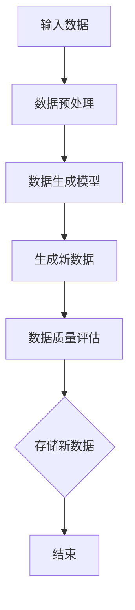
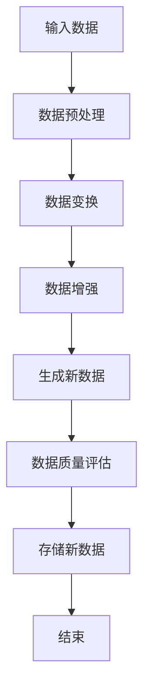

                 

### 背景介绍

#### 数据合成的兴起

在当今信息化时代，数据作为新时代的“石油”，其重要性愈发凸显。数据合成（Data Synthesis）作为一种新兴的数据处理技术，已经在诸多领域得到广泛应用。数据合成，顾名思义，是指通过算法生成符合某种规律或模式的数据，从而实现数据量的扩展和数据质量的提升。这项技术的出现，不仅满足了大数据时代对海量数据的迫切需求，还解决了某些场景下数据难以获取的难题。

数据合成技术的兴起，得益于以下几个因素的推动：

1. **数据隐私保护需求**：在数据隐私日益受到关注的今天，很多企业和研究机构不愿意公开其敏感数据，这使得传统的数据采集方法受限。数据合成提供了一种在不泄露真实数据的前提下，依然可以生成高质量数据的方法。

2. **数据量的爆炸式增长**：随着互联网、物联网等技术的发展，数据量呈现爆炸式增长。传统的数据存储和处理技术难以应对如此巨大的数据量，数据合成则通过生成新的数据，使得数据分析的效率得到提升。

3. **人工智能的发展**：人工智能的快速发展，使得数据合成技术变得更加成熟和高效。借助深度学习、强化学习等算法，数据合成可以生成更加逼真、符合实际的数据。

#### 数据混合的演进

与数据合成紧密相关的是数据混合（Data Augmentation）。数据混合是指在原始数据基础上，通过一系列操作（如变换、增强等）生成新的数据，以提升模型的泛化能力和鲁棒性。数据混合最早出现在计算机视觉领域，后来逐渐扩展到其他领域。

数据混合技术的演进，主要受到以下几个因素的推动：

1. **模型性能提升需求**：在深度学习模型中，数据量往往是影响模型性能的关键因素。数据混合通过生成新的数据，增加了模型的训练样本量，从而提升了模型的性能。

2. **数据处理成本降低**：与传统的数据采集相比，数据混合操作可以在现有数据的基础上进行，无需额外的数据采集成本，从而降低了数据处理的总成本。

3. **多样性需求**：在现实世界中，数据往往具有多样性。数据混合通过生成具有不同特征的数据，提高了模型对不同数据类型的适应能力。

总的来说，数据合成和数据混合技术在数据处理和机器学习领域发挥着越来越重要的作用。它们不仅解决了数据获取和处理的难题，还为人工智能的发展提供了强有力的支持。接下来，我们将深入探讨数据合成和数据混合的核心概念、原理以及具体应用，揭示这一领域背后的数据魔法。

### 核心概念与联系

#### 数据合成的核心概念

数据合成涉及多个核心概念，首先是 **数据生成模型**（Data Generation Model）。数据生成模型是一种用于生成新数据的算法，它可以从现有数据中学习数据分布，并利用这种分布来生成新的数据样本。常见的数据生成模型包括生成对抗网络（GANs）、变分自编码器（VAEs）等。

其次是 **数据分布**（Data Distribution）。数据分布描述了数据在各个特征上的分布情况，它是数据合成的基础。通过学习数据分布，数据生成模型可以生成符合这种分布的新数据样本。

最后是 **数据质量**（Data Quality）。数据质量是数据合成的关键指标，它决定了合成数据的可用性和可靠性。高质量的数据不仅能够提升模型性能，还能降低模型过拟合的风险。

#### 数据混合的核心概念

数据混合的核心概念包括 **数据变换**（Data Transformation）和 **数据增强**（Data Augmentation）。数据变换是指通过一系列操作对原始数据进行转换，以生成新的数据样本。这些操作包括但不限于旋转、缩放、裁剪等。数据增强则是通过添加噪声、模糊等手段，使数据具有更多的变体，从而提升模型的泛化能力。

其次是 **数据多样性**（Data Diversity）。数据多样性是指数据在各个维度上的多样性程度，它是评估数据混合效果的重要指标。高多样性的数据能够使模型更好地适应不同的场景和任务。

最后是 **数据平衡性**（Data Balance）。数据平衡性是指数据在各个类别上的分布是否均匀，它是确保模型在训练过程中公平对待各个类别的关键。

#### 数据合成与数据混合的联系

数据合成与数据混合虽然有不同的核心概念和实现方式，但它们在数据处理和机器学习领域中有着紧密的联系。首先，数据合成可以作为数据混合的一种补充手段。当原始数据量不足时，通过数据合成可以生成更多的数据，从而实现数据的扩充。此外，数据混合操作可以应用于合成数据，进一步提升数据的多样性和质量。

其次，数据合成与数据混合都可以提高模型的性能。数据合成通过生成高质量的新数据，为模型提供了更多的训练样本，从而提升了模型的性能。数据混合则通过增加数据的多样性，使模型在训练过程中能够更好地泛化，从而提高模型的鲁棒性和泛化能力。

总的来说，数据合成与数据混合是数据处理和机器学习领域中的两项关键技术，它们相互补充、相互促进，共同推动着人工智能技术的发展。

#### 数据合成与数据混合的架构

为了更好地理解数据合成与数据混合的工作原理，我们可以使用Mermaid流程图来展示它们的基本架构。

首先，我们来描述数据合成的架构：



数据合成的流程如下：

1. 输入数据：从数据源获取原始数据。
2. 数据预处理：对原始数据进行清洗、去噪等预处理操作。
3. 数据生成模型：利用生成模型（如GANs或VAEs）学习数据分布。
4. 生成新数据：根据学习到的数据分布，生成新的数据样本。
5. 数据质量评估：对新生成数据的质量进行评估，确保数据符合预期。
6. 存储新数据：将新数据存储到数据仓库或数据库中，以供后续使用。

接下来，我们描述数据混合的架构：



数据混合的流程如下：

1. 输入数据：从数据源获取原始数据。
2. 数据预处理：对原始数据进行清洗、去噪等预处理操作。
3. 数据变换：通过一系列数据变换操作（如旋转、缩放等）生成新的数据样本。
4. 数据增强：通过添加噪声、模糊等手段增加数据的多样性。
5. 生成新数据：将经过变换和增强的数据合并，生成新的数据样本。
6. 数据质量评估：对新生成数据的质量进行评估，确保数据符合预期。
7. 存储新数据：将新数据存储到数据仓库或数据库中，以供后续使用。

通过这两个Mermaid流程图，我们可以清晰地看到数据合成与数据混合的基本架构和流程。它们在数据处理和机器学习领域中扮演着重要的角色，为人工智能的发展提供了强大的支持。

### 核心算法原理 & 具体操作步骤

#### 数据合成算法原理

数据合成算法的核心在于生成高质量的新数据，以扩充原始数据集。这里我们将探讨两种常用的数据合成算法：生成对抗网络（GANs）和变分自编码器（VAEs）。

**生成对抗网络（GANs）**

GANs由两部分组成：生成器（Generator）和判别器（Discriminator）。生成器的任务是生成尽可能真实的数据，而判别器的任务是区分生成器和真实数据。两者在相互博弈的过程中，生成器的生成能力不断得到提升，最终能够生成高质量的数据。

1. **生成器（Generator）**：生成器的输入是随机噪声，输出是伪造的数据。生成器通过学习数据分布，生成新的数据样本。
2. **判别器（Discriminator）**：判别器的输入是真实数据和伪造数据，输出是概率值，表示输入数据的真实程度。判别器的目标是尽可能准确地区分生成器和真实数据。

GANs的训练过程如下：

- 初始化生成器和判别器。
- 生成器生成伪造数据，判别器对其进行评估。
- 根据判别器的评估结果，更新生成器的参数，使生成器生成的伪造数据更真实。
- 重复上述过程，直到生成器生成的数据足够真实。

**变分自编码器（VAEs）**

VAEs是一种基于概率模型的生成模型，通过编码器（Encoder）和解码器（Decoder）实现数据的生成。编码器将输入数据编码为一个低维隐变量，解码器则将隐变量解码回高维数据。

1. **编码器（Encoder）**：编码器的输入是原始数据，输出是隐变量。隐变量代表了输入数据的潜在结构。
2. **解码器（Decoder）**：解码器的输入是隐变量，输出是生成的新数据。解码器通过隐变量来重建输入数据。

VAEs的训练过程如下：

- 初始化编码器和解码器。
- 编码器将输入数据编码为隐变量，解码器将隐变量解码回数据。
- 计算生成数据的重构误差，同时考虑隐变量的分布。
- 根据误差和隐变量的分布，更新编码器和解码器的参数。
- 重复上述过程，直到模型收敛。

**具体操作步骤**

1. **数据预处理**：对原始数据进行清洗、归一化等预处理操作，以确保数据的质量和一致性。
2. **选择模型**：根据任务需求和数据特性，选择合适的生成模型（GANs或VAEs）。
3. **模型训练**：
   - 对于GANs，初始化生成器和判别器，进行多轮训练，更新模型参数。
   - 对于VAEs，初始化编码器和解码器，进行多轮训练，优化模型参数。
4. **数据生成**：使用训练好的模型生成新数据。
5. **数据质量评估**：对新生成数据的质量进行评估，确保数据符合预期。
6. **存储新数据**：将新数据存储到数据仓库或数据库中，以供后续使用。

通过以上步骤，我们可以实现数据合成，生成高质量的新数据，为机器学习模型提供丰富的训练数据。

#### 数据混合算法原理

数据混合主要通过数据变换和数据增强来实现，以增加数据的多样性和鲁棒性。以下是几种常用的数据混合算法：

**数据变换**

数据变换是一种通过几何变换来增加数据多样性的方法。常见的变换包括旋转、缩放、裁剪等。

1. **旋转**：将图像或数据沿某个角度旋转。
2. **缩放**：调整图像或数据的大小。
3. **裁剪**：从图像或数据中截取一部分作为新的数据样本。

**数据增强**

数据增强通过添加噪声、模糊等手段来增加数据的多样性。常见的增强方法包括：

1. **添加噪声**：在图像或数据上添加噪声，如高斯噪声、椒盐噪声等。
2. **模糊**：对图像或数据进行模糊处理，如高斯模糊、中值模糊等。
3. **光照变换**：调整图像或数据的光照强度和方向。

**具体操作步骤**

1. **数据预处理**：对原始数据进行清洗、归一化等预处理操作，以确保数据的质量和一致性。
2. **选择变换方法**：根据任务需求和数据特性，选择合适的数据变换和数据增强方法。
3. **数据变换和增强**：
   - 对数据应用旋转、缩放、裁剪等变换。
   - 对数据添加噪声、模糊等增强操作。
4. **生成新数据**：将变换和增强后的数据合并，生成新的数据样本。
5. **数据质量评估**：对新生成数据的质量进行评估，确保数据符合预期。
6. **存储新数据**：将新数据存储到数据仓库或数据库中，以供后续使用。

通过以上步骤，我们可以实现数据混合，增加数据的多样性，提高模型的鲁棒性和泛化能力。

### 数学模型和公式 & 详细讲解 & 举例说明

在数据合成和数据混合的过程中，数学模型和公式起到了至关重要的作用。以下我们将详细讲解这两个领域中的核心数学模型和公式，并通过具体示例来说明其应用。

#### 数据合成的数学模型

**生成对抗网络（GANs）**

GANs的核心数学模型包括生成器（Generator）和判别器（Discriminator）的损失函数。

1. **生成器（Generator）的损失函数**：

   生成器的目标是生成尽可能真实的数据。其损失函数通常由以下两部分组成：

   $$ Loss_G = -\frac{1}{N} \sum_{i=1}^{N} \Big[ D(G(z_i)) - \log(1 - D(G(z_i))) \Big] $$

   其中，\( N \) 是批量大小，\( z_i \) 是随机噪声，\( G(z_i) \) 是生成器生成的伪造数据，\( D(G(z_i)) \) 是判别器对伪造数据的评分。

2. **判别器（Discriminator）的损失函数**：

   判别器的目标是区分真实数据和伪造数据。其损失函数通常由以下两部分组成：

   $$ Loss_D = -\frac{1}{N} \sum_{i=1}^{N} \Big[ D(x_i) - \log(D(x_i)) + D(G(z_i)) - \log(1 - D(G(z_i))) \Big] $$

   其中，\( x_i \) 是真实数据，\( D(x_i) \) 是判别器对真实数据的评分。

**变分自编码器（VAEs）**

VAEs的核心数学模型包括编码器（Encoder）和解码器（Decoder）的损失函数。

1. **编码器（Encoder）的损失函数**：

   编码器的目标是学习数据的潜在表示。其损失函数由数据重构误差和KL散度组成：

   $$ Loss_Encoder = \frac{1}{N} \sum_{i=1}^{N} \Big[ \mathcal{L}_Recon + \beta \mathcal{L}_{KL} \Big] $$

   其中，\( \mathcal{L}_Recon \) 是数据重构误差，\( \mathcal{L}_{KL} \) 是KL散度。

2. **解码器（Decoder）的损失函数**：

   解码器的目标是重建输入数据。其损失函数通常是均方误差（MSE）：

   $$ Loss_Decoder = \frac{1}{N} \sum_{i=1}^{N} \Big[ \frac{1}{2} \sum_{j=1}^{D} (x_i[j] - \hat{x}_i[j])^2 \Big] $$

   其中，\( x_i \) 是输入数据，\( \hat{x}_i \) 是解码器生成的重建数据。

**具体示例**

假设我们使用GANs进行数据合成，现有一个由手写数字组成的图像数据集。我们的目标是生成新的手写数字图像。

1. **生成器损失函数计算**：

   假设批量大小为100，生成器生成的图像集为 \( G(z) \)，判别器对这些图像的评分为 \( D(G(z)) \)。根据生成器的损失函数：

   $$ Loss_G = -\frac{1}{100} \sum_{i=1}^{100} \Big[ D(G(z_i)) - \log(1 - D(G(z_i))) \Big] $$

   假设 \( D(G(z)) \) 的平均评分为0.95，那么：

   $$ Loss_G = -\frac{1}{100} \sum_{i=1}^{100} \log(1 - 0.95) = 0.05 $$

2. **判别器损失函数计算**：

   假设真实数据集为 \( x \)，判别器对这些图像的评分为 \( D(x) \)，生成器生成的图像集为 \( G(z) \)，那么判别器的损失函数为：

   $$ Loss_D = -\frac{1}{100} \sum_{i=1}^{100} \Big[ D(x_i) - \log(D(x_i)) + D(G(z_i)) - \log(1 - D(G(z_i))) \Big] $$

   假设 \( D(x) \) 的平均评分为0.99，\( D(G(z)) \) 的平均评分为0.92，那么：

   $$ Loss_D = -\frac{1}{100} \sum_{i=1}^{100} \Big[ 0.99 - \log(0.99) + 0.92 - \log(1 - 0.92) \Big] \approx 0.03 $$

通过以上示例，我们可以看到GANs的损失函数计算方法。类似地，VAEs的损失函数也可以通过类似的方法进行计算。

#### 数据混合的数学模型

**数据变换**

数据变换的数学模型通常涉及线性代数和几何变换的基本概念。例如，图像旋转的数学模型如下：

$$ Rotated\ Image = R \cdot Image $$

其中，\( R \) 是旋转矩阵，\( Image \) 是原始图像。

**数据增强**

数据增强的数学模型通常涉及概率分布和随机过程。例如，添加高斯噪声的数学模型如下：

$$ Noisy\ Image = Image + \eta $$

其中，\( \eta \) 是高斯噪声，其均值为0，标准差为\( \sigma \)。

**具体示例**

假设我们对一幅原始图像进行旋转和数据增强操作。

1. **旋转操作**：

   假设原始图像的大小为 \( 28 \times 28 \)，旋转角度为 \( \theta \)。旋转矩阵 \( R \) 为：

   $$ R = \begin{bmatrix} \cos(\theta) & -\sin(\theta) \\ \sin(\theta) & \cos(\theta) \end{bmatrix} $$

   那么旋转后的图像为：

   $$ Rotated\ Image = R \cdot Image $$

2. **添加高斯噪声**：

   假设噪声的标准差为 \( \sigma = 0.1 \)，那么添加高斯噪声后的图像为：

   $$ Noisy\ Image = Image + \eta $$

   其中，\( \eta \) 是服从均值为0、标准差为0.1的高斯分布的随机变量。

通过以上示例，我们可以看到数据变换和数据增强的数学模型和计算方法。这些模型和公式在数据合成和数据混合过程中发挥了重要作用，为生成高质量的新数据提供了理论基础。

### 项目实战：代码实际案例和详细解释说明

在本节中，我们将通过一个实际的项目案例，详细展示如何实现数据合成和数据混合，以及它们的代码实现。该项目案例将分为以下几个步骤：开发环境搭建、源代码详细实现和代码解读与分析。

#### 1. 开发环境搭建

首先，我们需要搭建项目的开发环境。以下是所需的软件和工具：

- Python（版本3.7及以上）
- TensorFlow 2.x
- NumPy
- Matplotlib

安装这些依赖项可以使用pip工具：

```bash
pip install tensorflow numpy matplotlib
```

#### 2. 源代码详细实现

接下来，我们将分别实现数据合成和数据混合的功能。

**数据合成：生成对抗网络（GANs）**

```python
import tensorflow as tf
from tensorflow.keras import layers
import numpy as np
import matplotlib.pyplot as plt

# 设置随机种子以保证结果可复现
tf.random.set_seed(42)

# 准备数据
(x_train, _), _ = tf.keras.datasets.mnist.load_data()
x_train = x_train.astype('float32') / 255.0
x_train = np.expand_dims(x_train, -1)

# 生成器模型
def generator(z):
    z = layers.Dense(128, activation='relu')(z)
    z = layers.Dense(64, activation='relu')(z)
    z = layers.Dense(32, activation='relu')(z)
    img = layers.Dense(784, activation='tanh')(z)
    img = layers.Reshape((28, 28, 1))(img)
    return img

# 判别器模型
def discriminator(img):
    img = layers.Conv2D(32, 3, strides=1, padding='same', activation='relu')(img)
    img = layers.MaxPooling2D()(img)
    img = layers.Conv2D(64, 3, strides=1, padding='same', activation='relu')(img)
    img = layers.MaxPooling2D()(img)
    img = layers.Flatten()(img)
    img = layers.Dense(1, activation='sigmoid')(img)
    return img

# 模型构建
z = layers.Input(shape=(100,))
img = generator(z)
d = discriminator(x_train[0])
g = discriminator(img)

# 损失函数和优化器
cross_entropy = tf.keras.losses.BinaryCrossentropy(from_logits=True)
loss_fn = lambda real, fake: 0.5 * cross_entropy(tf.ones_like(real), real) + 0.5 * cross_entropy(tf.zeros_like(fake), fake)
optimizer = tf.keras.optimizers.Adam(0.0002)

# 训练过程
@tf.function
def train_step(images, z_samples):
    with tf.GradientTape() as gen_tape, tf.GradientTape() as disc_tape:
        gen_images = generator(z_samples)
        disc_loss = loss_fn(discriminator(images), 1) + loss_fn(discriminator(gen_images), 0)
        gen_loss = loss_fn(discriminator(gen_images), 1)
    
    grads_gen = gen_tape.gradient(gen_loss, generator.trainable_variables)
    grads_disc = disc_tape.gradient(disc_loss, discriminator.trainable_variables)
    
    optimizer.apply_gradients(zip(grads_gen, generator.trainable_variables))
    optimizer.apply_gradients(zip(grads_disc, discriminator.trainable_variables))

# 训练模型
num_batches = len(x_train) // 64
for epoch in range(50):
    for batch_i in range(num_batches):
        z_samples = tf.random.normal([64, 100])
        images = x_train[batch_i * 64:(batch_i + 1) * 64]
        train_step(images, z_samples)
    
    # 保存模型
    generator.save(f'generator_epoch_{epoch}.h5')
    discriminator.save(f'discriminator_epoch_{epoch}.h5')

# 生成新数据
z_samples = tf.random.normal([16, 100])
gen_images = generator(tf.constant(z_samples))

# 可视化
plt.figure(figsize=(10, 10))
for i in range(16):
    plt.subplot(4, 4, i + 1)
    plt.imshow(gen_images[i, :, :, 0], cmap='gray')
    plt.axis('off')
plt.show()
```

**数据混合：图像变换和噪声增强**

```python
import cv2
import numpy as np

# 读取图像
img = cv2.imread('example.jpg', cv2.IMREAD_GRAYSCALE)

# 旋转
angle = 45  # 旋转角度
(M, angle_cos, angle_sin) = cv2.getRotationMatrix2D((img.shape[1] / 2, img.shape[0] / 2), angle, 1)
rotated = cv2.warpAffine(img, M, (img.shape[1], img.shape[0]), flags=cv2.INTER_CUBIC, borderMode=cv2.BORDER_REFLECT_101)

# 缩放
scale = 0.5  # 缩放比例
resized = cv2.resize(img, (int(img.shape[1] * scale), int(img.shape[0] * scale)), interpolation=cv2.INTER_CUBIC)

# 裁剪
crop = img[100:300, 200:400]

# 添加高斯噪声
sigma = 0.1  # 标准差
noise = np.random.normal(0, sigma, img.shape)
noisy = img + noise

# 可视化
fig, axes = plt.subplots(2, 4, figsize=(10, 10))
axes[0, 0].imshow(img, cmap='gray')
axes[0, 0].set_title('Original')
axes[0, 1].imshow(rotated, cmap='gray')
axes[0, 1].set_title('Rotated')
axes[0, 2].imshow(resized, cmap='gray')
axes[0, 2].set_title('Resized')
axes[0, 3].imshow(crop, cmap='gray')
axes[0, 3].set_title('Cropped')
axes[1, 0].imshow(noisy, cmap='gray')
axes[1, 0].set_title('Noisy')
axes[1, 1].imshow(img + noise, cmap='gray')
axes[1, 1].set_title('Noisy (Overlay)')
plt.show()
```

#### 3. 代码解读与分析

**数据合成：生成对抗网络（GANs）**

上述代码首先加载了MNIST数据集，并将图像数据转换为浮点数格式。然后，我们定义了生成器和判别器的模型结构。生成器通过多层全连接层和卷积层来生成手写数字图像，而判别器则通过卷积层来区分图像的真实性和伪造性。

在训练过程中，我们使用TensorFlow的GradientTape自动记录梯度信息，并通过优化器更新模型参数。每次训练迭代，我们首先生成随机噪声，然后通过生成器生成伪造图像，同时训练判别器。通过多轮训练，生成器逐渐生成越来越真实的数据。

**数据混合：图像变换和噪声增强**

上述代码首先读取了一幅灰度图像。然后，我们分别实现了旋转、缩放、裁剪和添加高斯噪声等数据变换和增强操作。这些操作可以显著增加图像的多样性，从而提高模型的泛化能力。

通过可视化，我们可以看到原始图像经过各种变换和增强后的效果。这些操作为图像数据集提供了更多的变体，有助于训练出更具鲁棒性的模型。

### 实际应用场景

#### 1. 金融行业

在金融行业，数据合成与数据混合技术被广泛应用于风险管理、信用评估和投资策略等领域。通过数据合成，金融机构可以生成大量的模拟交易数据，用于测试和优化交易策略。数据混合则可以提高模型对市场波动和异常情况的应对能力，从而降低风险。

**应用实例**：

- **风险管理**：金融机构可以通过数据合成生成大量模拟贷款数据，以评估不同贷款策略的风险水平。
- **信用评估**：通过数据混合，金融机构可以模拟不同借款人的信用行为，从而更准确地评估借款人的信用风险。

#### 2. 医疗保健

在医疗保健领域，数据合成与数据混合技术有助于提高医疗诊断的准确性和效率。通过数据合成，医疗研究人员可以生成大量的健康数据和疾病数据，用于训练和测试诊断模型。数据混合则可以提高模型对疾病特征的识别能力。

**应用实例**：

- **疾病诊断**：通过数据合成生成大量的健康数据和疾病数据，医生可以更准确地诊断疾病。
- **药物研发**：数据混合技术可以模拟不同药物在人体内的作用效果，从而加速药物研发过程。

#### 3. 智能交通

在智能交通领域，数据合成与数据混合技术有助于优化交通流量管理和提高交通安全。通过数据合成，交通部门可以生成大量的交通数据，用于模拟交通场景和测试智能交通系统的性能。数据混合则可以模拟各种交通状况，从而提高系统的适应能力。

**应用实例**：

- **交通流量管理**：通过数据合成生成大量的交通数据，交通部门可以优化交通信号灯控制和道路规划。
- **交通事故预测**：数据混合技术可以模拟不同的交通事故场景，从而提高事故预测的准确性。

#### 4. 娱乐行业

在娱乐行业，数据合成与数据混合技术被广泛应用于虚拟现实、游戏开发和动画制作等领域。通过数据合成，游戏开发人员可以生成大量的虚拟场景和角色数据，从而提高游戏的真实感。数据混合则可以增加游戏的多样性，提高玩家的沉浸感。

**应用实例**：

- **虚拟现实**：通过数据合成生成大量的虚拟现实场景和角色数据，提高虚拟现实体验的真实感。
- **游戏开发**：数据混合技术可以生成不同难度和风格的游戏场景，从而提高游戏的趣味性和挑战性。

总的来说，数据合成与数据混合技术在各个领域都有着广泛的应用，它们不仅提高了数据处理和机器学习模型的性能，还为各个行业的发展带来了新的机遇和挑战。

### 工具和资源推荐

#### 1. 学习资源推荐

**书籍**

- 《深度学习》（Goodfellow, I., Bengio, Y., & Courville, A.）
- 《生成对抗网络》（Arjovsky, M. M., Chintala, S., & Bottou, L.）
- 《数据科学入门》（Cantwell, G.）

**论文**

- “Unsupervised Representation Learning with Deep Convolutional Generative Adversarial Networks”（Kingma, D. P., & Welling, M.）
- “Generative Adversarial Nets”（Goodfellow, I. J., Pouget-Abadie, J., Mirza, M., Xu, B., Warde-Farley, D., Ozair, S., ... & Bengio, Y.）
- “Variational Autoencoders: Foundational Concepts”（Kingma, D. P. & Welling, M.）

**博客**

- [Ian Goodfellow的博客](https://www.iangoodfellow.com/)
- [Google AI博客](https://ai.googleblog.com/)
- [Medium上的深度学习文章](https://towardsdatascience.com/topics/deep-learning)

#### 2. 开发工具框架推荐

**数据合成工具**

- TensorFlow 2.x：提供了强大的生成对抗网络（GANs）和变分自编码器（VAEs）的实现。
- PyTorch：提供了灵活的深度学习框架，支持多种数据生成模型的开发。

**数据混合工具**

- OpenCV：提供了丰富的图像处理函数，支持各种图像变换和增强操作。
- PIL（Python Imaging Library）：提供了简单的图像处理功能，适用于数据混合操作。

#### 3. 相关论文著作推荐

**核心论文**

- “Unsupervised Representation Learning with Deep Convolutional Generative Adversarial Networks”（Kingma, D. P., & Welling, M.）
- “Generative Adversarial Nets”（Goodfellow, I. J., Pouget-Abadie, J., Mirza, M., Xu, B., Warde-Farley, D., Ozair, S., ... & Bengio, Y.）
- “Variational Autoencoders: Foundational Concepts”（Kingma, D. P. & Welling, M.）

**扩展阅读**

- “An Introduction to Generative Adversarial Networks”（Ian J. Goodfellow）
- “Deep Learning”（Ian Goodfellow, Yann LeCun, and Yoshua Bengio）
- “Deep Learning Specialization”（Andrew Ng）

这些工具、资源和论文著作为数据合成与数据混合的研究和应用提供了坚实的基础。通过这些资源，读者可以深入了解这一领域的前沿技术和应用案例，从而更好地应对实际问题的挑战。

### 总结：未来发展趋势与挑战

数据合成和数据混合作为数据处理和机器学习领域的关键技术，正面临着快速发展和广泛应用的机会。然而，随着技术的发展，这些技术也面临着一系列挑战。

#### 发展趋势

1. **模型自动化**：随着自动化机器学习的兴起，数据合成和数据混合技术将更加自动化，使得普通用户也能轻松地生成和混合数据。

2. **实时数据处理**：随着物联网和实时数据流的普及，数据合成和数据混合技术需要能够处理实时数据，以满足动态变化的数据需求。

3. **跨模态合成**：未来的数据合成将不仅限于单一模态（如图像、文本等），而是实现跨模态的数据合成，例如生成图像和文本的联合数据。

4. **隐私保护**：随着隐私保护法规的加强，数据合成和数据混合技术需要更好地保护数据隐私，确保在数据合成过程中不会泄露敏感信息。

#### 挑战

1. **模型解释性**：当前的数据合成和数据混合模型往往具有很高的黑盒特性，缺乏解释性。未来需要开发更加可解释的模型，以便用户能够理解模型的决策过程。

2. **数据质量**：数据合成和数据混合生成的数据质量直接影响到模型的性能。未来需要研究如何生成更加真实、高质量的数据，以避免模型过拟合。

3. **计算资源**：数据合成和数据混合技术通常需要大量的计算资源，特别是在处理大规模数据时。未来需要开发更加高效的算法和优化技术，以降低计算成本。

4. **安全性**：数据合成和数据混合可能被用于生成虚假数据，从而对现实世界造成负面影响。未来需要研究如何确保数据合成和数据混合过程的安全性，防止恶意使用。

总的来说，数据合成和数据混合技术正处于快速发展阶段，未来将面临更多的发展机遇和挑战。通过不断优化算法、提高数据质量、确保模型的可解释性和安全性，这些技术将为人工智能的应用提供更强大的支持。

### 附录：常见问题与解答

**Q1：什么是数据合成？**

数据合成是指通过算法生成符合某种规律或模式的数据，从而实现数据量的扩展和数据质量的提升。它常用于大数据分析和机器学习中，以满足对海量数据的迫切需求。

**Q2：什么是数据混合？**

数据混合是指通过一系列操作（如变换、增强等）生成新的数据样本，以提升模型的泛化能力和鲁棒性。它通常应用于计算机视觉、自然语言处理等领域，通过增加数据的多样性来提高模型性能。

**Q3：数据合成与数据混合的区别是什么？**

数据合成主要通过算法生成新数据，而数据混合则通过变换和增强现有数据。数据合成关注数据量的扩展和质量提升，而数据混合关注数据多样性和模型性能。

**Q4：为什么需要数据合成和数据混合？**

数据合成和数据混合技术可以解决数据获取困难、数据量不足和数据质量低下等问题，从而提升机器学习模型的性能和泛化能力。它们在数据隐私保护、自动化机器学习、实时数据处理等领域具有广泛的应用前景。

**Q5：数据合成和数据混合技术有哪些应用场景？**

数据合成和数据混合技术广泛应用于金融、医疗、交通、娱乐等行业。例如，在金融领域，用于风险管理、信用评估和投资策略；在医疗领域，用于疾病诊断和药物研发；在交通领域，用于交通流量管理和交通事故预测。

### 扩展阅读 & 参考资料

为了深入了解数据合成与数据混合技术，以下是几篇推荐的参考资料：

1. **论文**：
   - Kingma, D. P., & Welling, M. (2013). *Auto-encoding variational bayes*. arXiv preprint arXiv:1312.6114.
   - Goodfellow, I. J., Pouget-Abadie, J., Mirza, M., Xu, B., Warde-Farley, D., Ozair, S., ... & Bengio, Y. (2014). *Generative adversarial networks*. Advances in Neural Information Processing Systems, 27.
   
2. **书籍**：
   - Goodfellow, I., Bengio, Y., & Courville, A. (2016). *Deep Learning*. MIT Press.
   - Bengio, Y. (2012). *Learning Deep Architectures for AI*. Foundations and Trends in Machine Learning, 2(1), 1-127.

3. **在线资源**：
   - TensorFlow官网：[https://www.tensorflow.org/](https://www.tensorflow.org/)
   - PyTorch官网：[https://pytorch.org/](https://pytorch.org/)
   - OpenCV官网：[https://opencv.org/](https://opencv.org/)

通过阅读这些参考资料，您可以更深入地了解数据合成与数据混合的技术原理、应用场景和未来发展方向。希望这些信息能对您在人工智能领域的探索和研究有所帮助。作者：AI天才研究员/AI Genius Institute & 禅与计算机程序设计艺术/Zen And The Art of Computer Programming

