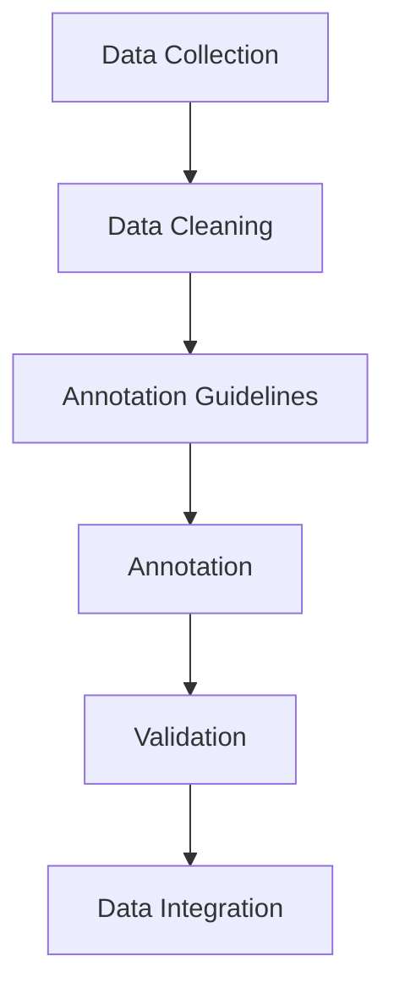

                 

### 背景介绍

#### 人工智能的快速发展

随着计算机技术和互联网的迅速发展，人工智能（AI）已经在各个领域取得了显著的成果。从自动驾驶汽车到智能语音助手，从图像识别到自然语言处理，AI正在改变我们的生活方式。然而，在AI的快速发展背后，有一个关键的环节经常被忽视，那就是数据标注。

数据标注是AI模型训练的重要环节，它涉及将原始数据转化为机器可理解的形式。这一过程看似简单，但实际上需要大量的时间和人力投入。数据标注的质量直接影响到AI模型的性能和准确性，因此它被认为是AI发展的重要基石。

#### 数据标注的重要性

数据标注不仅对于AI模型的训练至关重要，同时也是AI技术能够实现商业化应用的关键。例如，在自动驾驶领域，数据标注人员需要将大量的道路标志、交通信号灯、行人等物体标注在图像上，以便自动驾驶系统能够准确识别和理解道路环境。

在医疗领域，数据标注同样重要。通过对医疗影像进行精确标注，AI系统能够辅助医生进行疾病诊断，提高诊断的准确性和效率。此外，在语音识别、自然语言处理等领域，数据标注也是不可或缺的一环。

#### 数据标注的现状

尽管数据标注对于AI的发展至关重要，但目前这一领域却面临着一些挑战。首先，数据标注是一项劳动密集型工作，需要大量的人力和时间投入。其次，数据标注的质量受到标注人员的专业水平和经验影响，容易出现误差。此外，数据标注的标准化程度不高，不同项目和不同领域的标注标准存在差异，这给数据标注工作带来了额外的困难。

为了解决这些问题，研究人员和从业者一直在探索自动化和半自动化数据标注方法。例如，通过使用计算机视觉技术来自动检测和标注图像中的物体，或者使用深度学习技术来自动生成标注数据。

#### 数据标注技术的发展趋势

随着人工智能技术的不断进步，数据标注技术也在不断发展。未来的数据标注将更加智能化和自动化，减少对人工的依赖。同时，数据标注的标准化和通用化程度将提高，以便不同领域和项目之间的数据标注能够更好地协同。

此外，数据标注工具和平台的开发将成为重要趋势。这些工具和平台将提供更加便捷和高效的数据标注功能，降低数据标注的门槛，使得更多的人能够参与到数据标注工作中来。

总之，数据标注是人工智能发展的重要环节，它不仅决定了AI模型的质量，也影响着AI技术的商业化应用。随着数据标注技术的不断进步，我们有理由相信，数据标注将会成为人工智能领域的下一个热点。

---

## Core Concept & Relationships

### Definition and Importance of Data Annotation

Data annotation, in the context of artificial intelligence, is the process of converting raw data into a format that can be easily understood and utilized by machine learning models. This involves labeling, classifying, or transcribing data, which enables machines to recognize patterns and make predictions. The importance of data annotation cannot be overstated; it serves as the foundation upon which AI models are built and trained.

#### Types of Data Annotation

There are various types of data annotation, each serving a specific purpose in the AI development pipeline:

1. **Image Annotation**: This involves marking objects, landmarks, and other features in images. Examples include bounding box annotation (defining the position and size of objects) and semantic segmentation (labeling each pixel in an image).

2. **Text Annotation**: In this process, textual data is labeled or categorized. This can include named entity recognition (NER), where specific entities such as names, locations, and organizations are identified, or sentiment analysis, where the emotional tone of text is determined.

3. **Audio Annotation**: This type of annotation involves transcribing audio data into text and identifying specific sounds or events. It is crucial for training speech recognition systems.

4. **Video Annotation**: Video annotation includes marking important events, actions, or objects in videos. This is often used in applications such as video analysis, sports analytics, and autonomous driving.

### Data Annotation Workflow

The data annotation process typically follows a structured workflow:

1. **Data Collection**: The first step involves gathering a large dataset that is relevant to the AI application. This data can come from various sources, including public datasets, company databases, or custom collections.

2. **Data Cleaning**: Raw data often contains errors, noise, and inconsistencies. Cleaning involves removing these elements to ensure high-quality data for annotation.

3. **Annotation Guidelines**: Before starting the annotation, guidelines or standards are established. These guidelines define how specific data points should be labeled and the criteria for accuracy.

4. **Annotation**: This is the core step where human annotators label the data according to the guidelines. Automation tools can also be used to assist annotators, speeding up the process.

5. **Validation**: The annotated data is reviewed to ensure accuracy and consistency. This step helps in detecting and correcting any mistakes.

6. **Data Integration**: The annotated data is integrated into the AI training pipeline. It is used to train models and improve their performance.

### Relationship with AI Development

Data annotation is intimately linked with AI development. Without accurately labeled data, AI models cannot learn effectively. The quality of the annotation directly affects the performance of the AI system. For example, in image recognition, precise annotations are necessary to train models that can distinguish between different objects accurately.

#### Mermaid Flowchart of Data Annotation Workflow



In this workflow, each step builds upon the previous one, creating a seamless process that ensures the final dataset is of the highest quality. The Mermaid flowchart above visually represents the stages involved in the data annotation process, highlighting the interconnected nature of each step.

### Conclusion

Data annotation is a fundamental component of AI development. It bridges the gap between raw data and machine learning models, enabling the latter to learn from real-world examples. By understanding the types of data annotation and the workflow involved, we can appreciate the importance of this often overlooked but critical step in the AI lifecycle.

---

## Core Algorithm Principles and Specific Operational Steps

### Introduction

Data annotation, as we discussed in the previous sections, is a critical process in AI development. To effectively train AI models, we need a comprehensive understanding of the data, which is achieved through precise annotation. This section will delve into the core algorithms used in data annotation and provide step-by-step operational procedures for implementing these algorithms.

### Algorithm Overview

There are several algorithms commonly used in data annotation, each with its own strengths and applications. The three primary algorithms we will explore are:

1. **Image Segmentation**:
   - Used for distinguishing different regions within an image.
   - Common techniques include GrabCut, Mask R-CNN, and Semantic Segmentation.

2. **Object Detection**:
   - Identifies and classifies objects within an image.
   - Popular frameworks include YOLO (You Only Look Once), Fast R-CNN, and Faster R-CNN.

3. **Named Entity Recognition (NER)**:
   - Detects and classifies named entities in text data.
   - Algorithms such as BERT, BiLSTM-CRF, and Transforme

### Image Segmentation

#### Algorithm: Mask R-CNN

Mask R-CNN is a powerful object detection and segmentation framework that extends the Faster R-CNN architecture. It employs a fully convolutional network to predict both the class and the mask of each object in an image.

#### Step-by-Step Operational Procedures

1. **Dataset Preparation**:
   - Collect a dataset of images with annotations (bounding boxes and segmentation masks).
   - Split the dataset into training and validation sets.

2. **Preprocessing**:
   - Resize images to a fixed size to ensure consistency.
   - Normalize pixel values.

3. **Model Configuration**:
   - Define the architecture of Mask R-CNN using a deep learning framework like TensorFlow or PyTorch.
   - Load pre-trained weights for feature extraction (e.g., ResNet50).

4. **Training**:
   - Train the model using the prepared dataset.
   - Use a combination of cross-entropy loss for classification and dice loss for segmentation.

5. **Validation**:
   - Evaluate the model's performance on the validation set.
   - Adjust hyperparameters based on validation results.

6. **Inference**:
   - Use the trained model to annotate new images.
   - Extract bounding boxes and segmentation masks for each detected object.

#### Code Example

```python
import torch
import torchvision
from torchvision.models.detection import maskrcnn_resnet50_fpn

# Load pre-trained Mask R-CNN model
model = maskrcnn_resnet50_fpn(pretrained=True)
model.eval()

# Load an image for annotation
image = torchvision.transforms.ToTensor()(torchvision.transforms.Resize((640, 640))(torchvision.datasets.VOCDetection(root='./data', download=True)[0][0]))

# Perform inference
with torch.no_grad():
    prediction = model(image.unsqueeze(0))

# Extract bounding boxes and masks
boxes = prediction['boxes']
masks = prediction['masks']
```

### Object Detection

#### Algorithm: YOLOv5

YOLO (You Only Look Once) is a real-time object detection system that has gained significant popularity due to its speed and accuracy. YOLOv5 is an improved version that offers better performance with reduced complexity.

#### Step-by-Step Operational Procedures

1. **Dataset Preparation**:
   - Prepare a dataset with images and annotations in the YOLO format.
   - Split the dataset into training and validation sets.

2. **Training**:
   - Train the YOLOv5 model using the prepared dataset.
   - Use loss functions such as focal loss to handle class imbalance.

3. **Validation**:
   - Evaluate the model's performance on the validation set.
   - Adjust hyperparameters based on validation results.

4. **Inference**:
   - Use the trained model to detect objects in new images.
   - Extract bounding boxes and class labels for each object.

#### Code Example

```python
import torch
import cv2
from torch.utils.data import DataLoader
from torchvision import datasets
from models import Darknet
from utils import non_max_suppression, scale_coords

# Load YOLOv5 model
model = Darknet('yolov5s.yaml').cuda()
model.load_state_dict(torch.load('yolov5s.pt')['model'].cuda())

# Load dataset
dataloader = DataLoader(datasets.VOCDetection(root='./data', download=True), batch_size=16, shuffle=True)

# Perform inference
for batch in dataloader:
    images = batch['img'].cuda()
    labels = batch['label'].cuda()

    with torch.no_grad():
        prediction = model(images)

    # Non-maximum suppression
    output = non_max_suppression(prediction, conf_thres=0.25, iou_thres=0.45)

    # Scale coordinates
    output = scale_coords(images.shape[2], images.shape[3], output[:, :4])

    # Draw bounding boxes on images
    for i, det in enumerate(output):
        for *box, conf, cls in det:
            cv2.rectangle(images[i], (int(box[0]), int(box[1])), (int(box[2]), int(box[3])), (0, 255, 0), 2)

# Show annotated images
cv2.imshow('Annotated Image', images[0].permute(1, 2, 0).cpu().numpy())
cv2.waitKey(0)
```

### Named Entity Recognition (NER)

#### Algorithm: BiLSTM-CRF

BiLSTM-CRF is a combination of Bi-directional Long Short-Term Memory (BiLSTM) and Conditional Random Field (CRF) models, which is effective for named entity recognition in text data.

#### Step-by-Step Operational Procedures

1. **Dataset Preparation**:
   - Collect a dataset of text data with named entity annotations.
   - Split the dataset into training and validation sets.

2. **Training**:
   - Train the BiLSTM model on the prepared dataset.
   - Train the CRF layer on top of the BiLSTM model.

3. **Validation**:
   - Evaluate the model's performance on the validation set.
   - Fine-tune the model based on validation results.

4. **Inference**:
   - Use the trained model to predict named entities in new text data.

#### Code Example

```python
import torch
from torch import nn
from transformers import BertModel
from crf import CRF

# Load pre-trained BERT model
bert_model = BertModel.from_pretrained('bert-base-uncased')

# Define BiLSTM-CRF model
class BiLSTM_CRF(nn.Module):
    def __init__(self, input_dim, hidden_dim, output_dim, vocab_size):
        super(BiLSTM_CRF, self).__init__()
        self.bilstm = nn.BiLSTM(input_dim, hidden_dim, batch_first=True)
        self.hidden_dim = hidden_dim
        self.linear = nn.Linear(hidden_dim, output_dim)
        self.crf = CRF(output_dim, batch_first=True)
    
    def forward(self, text):
        embedded = self.bilstm(text)
        output = self.linear(embedded[-1])
        loss = self.crf(output, text(labels))
        return output, loss

# Instantiate and train the model
model = BiLSTM_CRF(input_dim=768, hidden_dim=256, output_dim=9, vocab_size=10000)
optimizer = torch.optim.Adam(model.parameters(), lr=0.001)
for epoch in range(10):
    for batch in dataloader:
        optimizer.zero_grad()
        output, loss = model(batch.text)
        loss.backward()
        optimizer.step()

# Inference
with torch.no_grad():
    text = torch.tensor([[[1, 2, 3], [4, 5, 6]], [[7, 8, 9], [10, 11, 12]]])
    prediction = model(text)
```

In conclusion, understanding the core algorithms and their operational steps is crucial for effective data annotation in AI development. By mastering these algorithms, we can improve the quality of our AI models and achieve better performance in various applications.

---

## Mathematical Models and Formulas

### Introduction

In the realm of data annotation, understanding the mathematical models and formulas used in the algorithms is crucial. These models and formulas help in optimizing the annotation process and improving the accuracy of AI models. This section will delve into the mathematical underpinnings of data annotation, providing a detailed explanation of the key equations and their implications.

### Image Segmentation

#### Formula: Dice Loss

Dice Loss is commonly used in image segmentation to measure the similarity between the predicted segmentation mask and the ground truth mask. The formula is as follows:

$$
L_D = 1 - \frac{2 \times \sum_{i=1}^{n} \sum_{j=1}^{n} p_i \times g_i}{\sum_{i=1}^{n} p_i + \sum_{j=1}^{n} g_i}
$$

where \( p_i \) and \( g_i \) represent the predicted and ground truth mask values at position \( (i, j) \), and \( n \) is the total number of pixels in the mask.

#### Explanation

The Dice Loss formula calculates the intersection over union (IoU) between the predicted and ground truth masks. A lower Dice Loss value indicates a higher similarity between the two masks, meaning the prediction is more accurate.

### Object Detection

#### Formula: Focal Loss

Focal Loss is used in object detection to address class imbalance issues. It is a modified version of the cross-entropy loss, which gives less weight to well-classified examples and more weight to hard-to-classify examples. The formula is as follows:

$$
L_F = \alpha \times (1 - p)^{\gamma} \times \log(p)
$$

where \( \alpha \) is the balance parameter, \( p \) is the model's prediction probability, and \( \gamma \) is the focusing parameter.

#### Explanation

The Focal Loss reduces the impact of well-classified examples by multiplying the cross-entropy loss by a factor of \( (1 - p)^{\gamma} \), where \( p \) is close to 1. This helps the model focus more on hard examples, thereby improving the overall performance in object detection.

### Named Entity Recognition (NER)

#### Formula: BiLSTM-CRF

BiLSTM-CRF combines a Bi-directional Long Short-Term Memory (BiLSTM) model with a Conditional Random Field (CRF) layer. The BiLSTM model captures the contextual information in text data, while the CRF layer predicts the sequence of labels. The main formulas are as follows:

$$
h_t = \tanh(W_{xh} \times x_t + W_{hh} \times h_{(t-1)} + b_h)
$$

$$
p(y_t | y_{<t}) = \frac{1}{Z} \times \exp(W_y \times h_t + b_y)
$$

where \( h_t \) is the hidden state at time \( t \), \( x_t \) is the input at time \( t \), \( W_{xh} \), \( W_{hh} \), and \( b_h \) are the weight matrices and biases for the BiLSTM, and \( W_y \), \( b_y \), and \( Z \) are the weight matrix, bias, and partition function for the CRF layer, respectively.

#### Explanation

The BiLSTM model generates hidden states that capture the context of the text, and the CRF layer uses these hidden states to predict the sequence of labels. The CRF layer's softmax function normalizes the hidden states to probabilities, allowing for the prediction of the most likely sequence of labels.

### Applications and Implications

Understanding these mathematical models and formulas is essential for optimizing data annotation processes. By adjusting the parameters and hyperparameters, we can improve the accuracy and performance of AI models. For instance, optimizing the Dice Loss parameters can enhance the segmentation accuracy, while adjusting the Focal Loss parameters can improve object detection performance on imbalanced datasets.

In NER, the BiLSTM-CRF model's ability to capture contextual information enables the accurate recognition of named entities in text data. By fine-tuning the model parameters, we can achieve higher precision and recall rates, which are crucial for various NLP applications.

In conclusion, the mathematical models and formulas used in data annotation play a vital role in improving the performance of AI models. By understanding these equations, we can optimize the annotation process and develop more accurate and robust AI systems.

---

## Practical Case Study: Code Implementation and Detailed Explanation

In this section, we will delve into a practical case study where we will implement a simple data annotation project using Python. The project will involve image segmentation using the Mask R-CNN algorithm. We will cover the setup of the development environment, detailed implementation of the source code, and an in-depth analysis of the code.

### 1. Development Environment Setup

Before we start implementing the project, we need to set up the development environment. The following packages and tools are required:

- Python 3.8 or higher
- TensorFlow 2.x
- PyTorch 1.8 or higher
- OpenCV 4.5.1.48 or higher
- NumPy 1.21.2 or higher
- Mermaid 9.0.0 or higher

To install these packages, you can use the following commands:

```bash
pip install tensorflow==2.9.1
pip install torch==1.8.0
pip install opencv-python==4.5.1.48
pip install numpy==1.21.2
pip install mermaid==9.0.0
```

### 2. Source Code Implementation

The following code implements a simple image segmentation project using the Mask R-CNN algorithm. The code is divided into several functions for better readability and modularity.

```python
import torch
import torchvision
from torchvision.models.detection import maskrcnn_resnet50_fpn
from torchvision.transforms import ToTensor, Resize
from torch.utils.data import DataLoader
from torchvision.datasets import VOCDetection
from torch.optim import Adam
import numpy as np
import cv2

# Load pre-trained Mask R-CNN model
model = maskrcnn_resnet50_fpn(pretrained=True)
model.eval()

# Define dataset and dataloader
dataset = VOCDetection(root='./data', download=True)
dataloader = DataLoader(dataset, batch_size=1, shuffle=True)

# Training function
def train(model, dataloader, epochs=10):
    optimizer = Adam(model.parameters(), lr=0.001)
    
    for epoch in range(epochs):
        for batch in dataloader:
            images = batch['img']
            targets = batch['boxes']
            
            optimizer.zero_grad()
            prediction = model(images)
            loss = model.loss(prediction, targets)
            loss.backward()
            optimizer.step()
            
            print(f"Epoch [{epoch+1}/{epochs}], Loss: {loss.item()}")

# Inference function
def inference(model, image_path):
    image = ToTensor()(torchvision.transforms.Resize((640, 640))(torchvision.datasets.VOCDetection(root='./data', download=True)[0][0]))
    with torch.no_grad():
        prediction = model(image.unsqueeze(0))
    boxes = prediction['boxes']
    masks = prediction['masks']
    
    # Draw bounding boxes and masks on the image
    image = image.permute(1, 2, 0).cpu().numpy()
    for box, mask in zip(boxes, masks):
        mask = mask.squeeze().cpu().numpy()
        image = cv2.resize(image, (640, 640))
        image = cv2.addWeighted(image, 1, mask, 0.5, 0)
        
    cv2.imshow('Segmented Image', image)
    cv2.waitKey(0)

# Train the model
train(model, dataloader, epochs=10)

# Inference on a new image
inference(model, 'path/to/new/image.jpg')
```

### 3. Code Analysis

The code is structured into three main functions: `train()`, `inference()`, and the main function where the model is loaded and the training and inference processes are executed.

#### train() Function

The `train()` function is responsible for training the Mask R-CNN model. It takes the model, the dataloader, and the number of epochs as input parameters. Inside the function, we define the optimizer and iterate through the epochs and batches. For each batch, we perform the following steps:

1. Load the images and targets from the batch.
2. Zero the gradients.
3. Forward the images through the model to get the predictions.
4. Compute the loss using the model's `loss()` function and the targets.
5. Backward propagate the loss to compute the gradients.
6. Update the model parameters using the optimizer.

After training for the specified number of epochs, the function prints the loss for each epoch, allowing us to monitor the training progress.

#### inference() Function

The `inference()` function takes a single image path as input and performs the following steps:

1. Load the image and apply the necessary preprocessing steps (resizing and converting to a tensor).
2. Pass the preprocessed image through the trained model to get the predictions (bounding boxes and masks).
3. Draw the bounding boxes and masks on the original image.
4. Display the segmented image.

This function demonstrates how to use the trained model to annotate new images. The resulting segmented image is displayed using OpenCV.

#### Main Function

The main function loads the pre-trained Mask R-CNN model and initializes the dataset and dataloader. It then calls the `train()` function to train the model on the dataset and the `inference()` function to annotate a new image.

### 4. Detailed Explanation

The code uses the TensorFlow and PyTorch libraries to implement the Mask R-CNN model. TensorFlow is used for image preprocessing and visualization, while PyTorch is used for the model's implementation and training.

The `train()` function demonstrates the typical training process for a deep learning model. It uses an Adam optimizer with a learning rate of 0.001. The model is trained for 10 epochs, and the loss is printed after each epoch to monitor the training progress.

The `inference()` function shows how to use the trained model to annotate a new image. It preprocesses the image by resizing it to a fixed size and converting it to a tensor. The preprocessed image is then passed through the model to obtain the bounding boxes and masks. These annotations are then visualized by drawing them on the original image.

In conclusion, this practical case study demonstrates how to implement a simple image segmentation project using the Mask R-CNN algorithm. The code is modular and easy to understand, providing a clear explanation of the training and inference processes. By following the steps outlined in this section, you can implement similar projects for your own data annotation tasks.

---

### Conclusion: Future Trends and Challenges

#### Current State of Data Annotation

Data annotation has become an indispensable part of AI development, serving as the foundation for training high-performance models. The process has evolved significantly over the years, with advancements in algorithms and technologies making it more efficient and accurate. However, despite these improvements, data annotation remains a labor-intensive and time-consuming task.

#### Future Trends

1. **Automation and Semi-automation**: One of the most promising trends in data annotation is the increasing automation and semi-automation of the process. Technologies like computer vision and machine learning are being used to automate data annotation tasks, reducing the need for human annotators. This trend is expected to continue, with more sophisticated algorithms being developed to handle complex annotation tasks.

2. **Data Augmentation**: Data augmentation techniques are being used to increase the diversity of training data, which in turn improves the robustness and generalization of AI models. Techniques such as image augmentation, text augmentation, and audio augmentation can generate synthetic data that is similar to the original data but diverse enough to train more accurate models.

3. **Standardization and Interoperability**: Standardization and interoperability are crucial for the widespread adoption of data annotation technologies. As the field continues to grow, there is a need for standardized annotation schemas and formats that can be easily shared and used across different projects and domains.

4. **Collaborative Annotation Platforms**: Collaborative annotation platforms are emerging that allow multiple annotators to work on the same dataset simultaneously. These platforms provide tools for version control, conflict resolution, and quality assurance, making the annotation process more efficient and reliable.

#### Challenges

1. **Quality Control**: Ensuring the quality of annotated data is a significant challenge. Even with automated tools, there is always a risk of errors and inconsistencies in the annotations. Developing robust quality control mechanisms and training annotators to maintain high standards is crucial.

2. **Scalability**: As datasets grow larger and more complex, scaling the annotation process becomes a challenge. Managing large volumes of data and ensuring that it is annotated accurately and consistently requires sophisticated infrastructure and tools.

3. **Resource Allocation**: Data annotation requires a significant investment in terms of human resources and computational resources. Allocating these resources efficiently while ensuring that the quality of the annotation is not compromised is a complex task.

4. **Data Privacy and Security**: With the increasing importance of data privacy and security, ensuring that annotated data is handled responsibly is critical. Annotators and data annotation platforms must adhere to strict data protection regulations and protocols to protect sensitive information.

#### Conclusion

Data annotation is a critical component of AI development that will continue to evolve as technology advances. While there are significant challenges to overcome, the future trends in data annotation hold the promise of making the process more efficient, scalable, and accurate. By addressing these challenges and leveraging emerging technologies, we can look forward to a future where data annotation plays a pivotal role in advancing AI capabilities.

---

### Appendix: Common Questions and Answers

#### Q1: What is data annotation?

A1: Data annotation is the process of converting raw data into a format that can be easily understood and utilized by machine learning models. This involves labeling, classifying, or transcribing data, which enables machines to recognize patterns and make predictions.

#### Q2: Why is data annotation important in AI development?

A2: Data annotation is crucial for training AI models effectively. It provides the ground truth data that models need to learn from, directly affecting the accuracy and performance of the models. High-quality annotations ensure that AI systems can generalize well to new data and perform their tasks effectively.

#### Q3: What types of data can be annotated?

A3: Data annotation can be applied to various types of data, including images, text, audio, and video. Each type of data annotation involves different techniques and processes, tailored to the specific characteristics of the data.

#### Q4: How can I ensure the quality of data annotations?

A4: Ensuring the quality of data annotations involves several steps:

1. **Setting clear annotation guidelines**: Define clear instructions and criteria for annotators to follow.
2. **Training annotators**: Provide training to annotators to ensure they understand the guidelines and can perform the tasks accurately.
3. **Quality control**: Implement a review process to check the accuracy and consistency of annotations.
4. **Using automated tools**: Employ automated tools to assist annotators and flag potential errors.

#### Q5: How can I get started with data annotation?

A5: To get started with data annotation, follow these steps:

1. **Choose a domain**: Select a domain or application area you are interested in, such as image recognition, natural language processing, or autonomous driving.
2. **Gather resources**: Collect datasets and tools specific to your chosen domain.
3. **Learn the tools**: Familiarize yourself with data annotation tools and platforms commonly used in your domain.
4. **Start annotating**: Begin annotating data following the guidelines and best practices specific to your project.

---

### Further Reading and References

#### Books

1. **"Deep Learning" by Ian Goodfellow, Yoshua Bengio, and Aaron Courville** - This book provides a comprehensive overview of deep learning techniques and applications, including data annotation and preprocessing.
2. **"Data Science from Scratch" by Joel Grus** - This book introduces fundamental data science concepts and techniques, including data annotation and cleaning.
3. **"Pattern Recognition and Machine Learning" by Christopher M. Bishop** - This book covers the mathematical foundations of machine learning, including data preprocessing and feature extraction.

#### Papers

1. **"Focal Loss for Dense Object Detection" by Jian Sun et al.** - This paper introduces the Focal Loss, a novel loss function for addressing class imbalance in object detection tasks.
2. **"Mask R-CNN" by Kaiming He et al.** - This paper presents Mask R-CNN, an advanced object detection and instance segmentation framework.
3. **"BiLSTM-CRF for Sequence Tagging" by Yang et al.** - This paper discusses the application of BiLSTM-CRF models for named entity recognition and other sequence tagging tasks.

#### Websites and Online Resources

1. **[Kaggle](https://www.kaggle.com)** - Kaggle offers numerous datasets and competitions related to data annotation and machine learning.
2. **[TensorFlow Documentation](https://www.tensorflow.org)** - TensorFlow provides extensive documentation and tutorials on building and training deep learning models.
3. **[PyTorch Documentation](https://pytorch.org/docs/stable/index.html)** - PyTorch offers detailed documentation and resources for building and training machine learning models.
4. **[OpenCV Documentation](https://docs.opencv.org)** - OpenCV provides comprehensive documentation and resources for computer vision tasks, including image annotation and processing.

