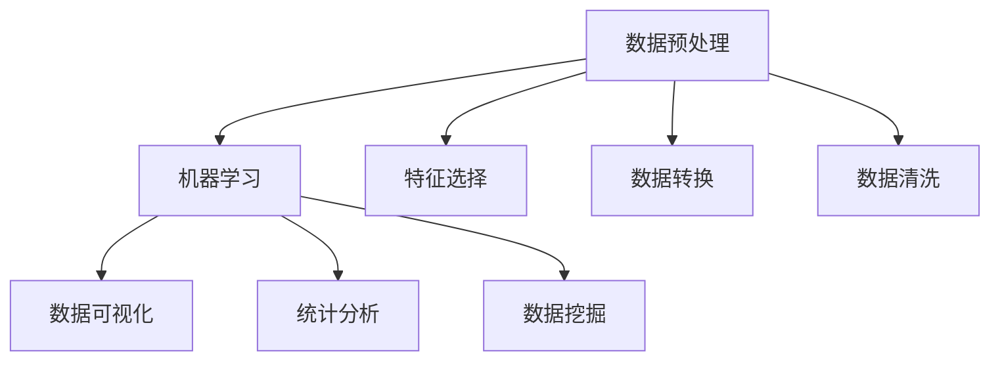

                 

# 数据科学 (Data Science)

## 概述

数据科学是一个涵盖数据收集、处理、分析和解释的跨学科领域，旨在通过数据驱动的方法来解决实际问题。数据科学的应用范围广泛，包括但不限于商业智能、医学研究、金融分析、气候预测和社交媒体分析。

在这篇文章中，我们将逐步深入探讨数据科学的各个核心概念和算法，从基本原理到实际应用。本文的目标是提供一个既全面又易于理解的指南，帮助读者掌握数据科学的基本知识和技能。

## 关键词

- 数据预处理
- 机器学习
- 数据可视化
- 统计分析
- 数据挖掘
- 大数据

## 摘要

本文将探讨数据科学的本质和核心概念。我们将介绍数据科学的基础技术，如数据预处理、机器学习和数据分析。随后，我们将深入讨论各种算法和模型，并提供实际项目案例和代码实现。最后，我们将分析数据科学在实际应用中的重要性，并展望其未来的发展趋势和挑战。

### 背景介绍

#### 数据科学的定义与发展历程

数据科学是一门综合性的学科，它结合了统计学、计算机科学、信息科学和领域专业知识，以处理和分析复杂数据集，提取有价值的信息和洞察。数据科学的发展历程可以追溯到20世纪中叶，当时计算机科学和信息技术的兴起为数据科学的发展奠定了基础。

在过去的几十年中，随着互联网和移动设备的普及，数据以惊人的速度增长。这一趋势催生了大数据（Big Data）的概念，即指在数量、速度和复杂性上超出传统数据处理系统能力的数据集。大数据的兴起进一步推动了数据科学的发展，使得数据科学家可以利用先进的算法和技术来提取数据中的隐藏模式和关联。

#### 数据科学的应用领域

数据科学的应用领域非常广泛，几乎涵盖了所有行业。以下是一些主要的应用领域：

1. **商业智能（Business Intelligence）**：通过数据分析帮助企业做出更明智的决策，提高运营效率和盈利能力。
2. **医学研究（Medical Research）**：利用数据科学技术进行疾病预测、药物开发和个性化医疗。
3. **金融分析（Financial Analysis）**：通过数据挖掘和机器学习预测市场趋势，进行风险评估和投资决策。
4. **气候预测（Climate Prediction）**：利用历史气候数据和气象模型进行未来气候趋势的预测。
5. **社交媒体分析（Social Media Analysis）**：分析社交媒体数据以了解用户行为、市场趋势和舆论动态。

### 核心概念与联系

为了更好地理解数据科学，我们需要掌握其核心概念和它们之间的联系。以下是数据科学中的一些关键概念：

#### 数据预处理（Data Preprocessing）

数据预处理是数据科学流程的第一步，旨在清洗、转换和格式化数据，以便后续的分析和处理。以下是数据预处理的一些关键任务：

- **数据清洗（Data Cleaning）**：去除重复数据、处理缺失值、纠正数据中的错误。
- **数据转换（Data Transformation）**：将数据转换为适合分析的格式，例如归一化、标准化或离散化。
- **数据集成（Data Integration）**：将来自多个源的数据合并为一个统一的视图。
- **特征选择（Feature Selection）**：选择对模型性能有显著影响的关键特征。

#### 机器学习（Machine Learning）

机器学习是数据科学的核心技术之一，它使计算机系统能够从数据中自动学习和改进。以下是机器学习的一些基本概念：

- **监督学习（Supervised Learning）**：通过已知标签数据训练模型，以便对新数据进行预测。
- **无监督学习（Unsupervised Learning）**：在未知标签数据中寻找数据结构和模式。
- **强化学习（Reinforcement Learning）**：通过与环境交互来学习最佳策略。

#### 数据可视化（Data Visualization）

数据可视化是使复杂数据集更易于理解和解释的重要工具。以下是数据可视化的一些关键技术：

- **图表和图形（Charts and Graphs）**：使用图表、直方图、散点图和热力图等可视化工具。
- **交互式可视化（Interactive Visualization）**：允许用户交互地探索数据，如交互式仪表板和地图。

#### 统计分析（Statistical Analysis）

统计分析是数据科学中的另一个重要组成部分，它用于描述、分析和解释数据。以下是统计分析的一些基本概念：

- **描述性统计（Descriptive Statistics）**：用于描述数据集的基本特性，如平均值、中位数和标准差。
- **推断性统计（Inferential Statistics）**：用于基于样本数据推断总体特征，如假设检验和置信区间。
- **回归分析（Regression Analysis）**：用于建立自变量和因变量之间的关系模型。

#### 数据挖掘（Data Mining）

数据挖掘是发现数据中隐藏的模式和关联的复杂过程。以下是数据挖掘的一些基本概念：

- **分类（Classification）**：将数据分为不同的类别或标签。
- **聚类（Clustering）**：将相似的数据点分组在一起，形成簇。
- **关联规则挖掘（Association Rule Mining）**：发现数据集中的关联规则，如“购买啤酒的人通常会购买尿布”。

### 核心概念原理与架构的 Mermaid 流程图

以下是数据科学核心概念原理与架构的 Mermaid 流程图：



### 核心算法原理 & 具体操作步骤

#### 数据预处理（Data Preprocessing）

数据预处理是确保数据质量、减少噪音和异常值的关键步骤。以下是数据预处理的核心算法原理和具体操作步骤：

1. **数据清洗（Data Cleaning）**：
   - **处理缺失值**：使用平均值、中位数或模式来填充缺失值。
   - **处理异常值**：识别并处理异常值，例如使用离群点检测算法。
   - **去除重复数据**：删除重复的数据记录，以避免模型过拟合。

2. **数据转换（Data Transformation）**：
   - **归一化（Normalization）**：将数据缩放到相同的范围，例如使用最小-最大缩放或Z-Score缩放。
   - **标准化（Standardization）**：将数据转换为具有零均值和单位方差的格式。
   - **离散化（Discretization）**：将连续数据转换为离散的类别。

3. **特征选择（Feature Selection）**：
   - **过滤方法（Filter Method）**：根据特征的重要性进行选择，例如使用方差阈值或相关系数。
   - **包裹方法（Wrapper Method）**：通过尝试不同的特征组合来选择最佳特征。
   - **嵌入式方法（Embedded Method）**：在模型训练过程中自动选择特征，例如LASSO回归。

#### 机器学习（Machine Learning）

机器学习是数据科学的核心，它包括多种算法和模型，用于预测、分类和聚类。以下是机器学习的核心算法原理和具体操作步骤：

1. **监督学习（Supervised Learning）**：
   - **线性回归（Linear Regression）**：使用线性模型预测连续值。
   - **逻辑回归（Logistic Regression）**：使用线性模型进行分类。
   - **决策树（Decision Tree）**：根据特征值创建决策分支进行分类或回归。
   - **随机森林（Random Forest）**：使用多个决策树进行集成学习。

2. **无监督学习（Unsupervised Learning）**：
   - **聚类（Clustering）**：将相似的数据点分组，例如K-Means聚类和层次聚类。
   - **降维（Dimensionality Reduction）**：减少数据维度，例如主成分分析（PCA）和t-SNE。

3. **强化学习（Reinforcement Learning）**：
   - **Q-Learning**：通过试错学习最佳策略。
   - **深度强化学习**：使用神经网络进行强化学习，例如DQN和PPO。

#### 数据可视化（Data Visualization）

数据可视化是将复杂数据以图形化的方式呈现，以便更好地理解和分析。以下是数据可视化的核心算法原理和具体操作步骤：

1. **图表和图形**：
   - **条形图（Bar Chart）**：显示不同类别的数据数量。
   - **折线图（Line Chart）**：显示数据随时间的变化趋势。
   - **散点图（Scatter Plot）**：显示两个变量之间的关系。

2. **交互式可视化**：
   - **交互式仪表板（Interactive Dashboard）**：使用交互式控件和滑块进行数据探索。
   - **地图（Map）**：显示地理空间数据，如热力图和地理加权回归。

### 数学模型和公式 & 详细讲解 & 举例说明

#### 线性回归（Linear Regression）

线性回归是一种常用的监督学习算法，用于建立自变量和因变量之间的线性关系。以下是线性回归的核心数学模型和公式：

1. **线性回归模型**：
   $$ y = \beta_0 + \beta_1x_1 + \beta_2x_2 + ... + \beta_nx_n + \epsilon $$

   其中，$y$ 是因变量，$x_1, x_2, ..., x_n$ 是自变量，$\beta_0, \beta_1, \beta_2, ..., \beta_n$ 是模型参数，$\epsilon$ 是误差项。

2. **最小二乘法（Least Squares Method）**：
   $$ \min_{\beta_0, \beta_1, ..., \beta_n} \sum_{i=1}^{n} (y_i - (\beta_0 + \beta_1x_i + \beta_2x_i + ... + \beta_nx_i))^2 $$

   最小二乘法通过最小化误差平方和来估计模型参数。

#### 逻辑回归（Logistic Regression）

逻辑回归是一种用于分类问题的监督学习算法，用于估计概率。以下是逻辑回归的核心数学模型和公式：

1. **逻辑函数（Logistic Function）**：
   $$ \sigma(z) = \frac{1}{1 + e^{-z}} $$

   其中，$z = \beta_0 + \beta_1x_1 + \beta_2x_2 + ... + \beta_nx_n$ 是模型参数和自变量的线性组合。

2. **概率估计**：
   $$ P(y=1|x) = \sigma(z) = \frac{1}{1 + e^{-(\beta_0 + \beta_1x_1 + \beta_2x_2 + ... + \beta_nx_n)}} $$

   其中，$P(y=1|x)$ 是给定自变量 $x$ 时因变量 $y$ 为1的概率。

#### 决策树（Decision Tree）

决策树是一种常见的分类和回归算法，通过创建一系列决策分支来进行预测。以下是决策树的核心数学模型和公式：

1. **决策规则**：
   $$ x_j = \text{splitting\_point} \Rightarrow y = \text{left\_child} \text{ or } y = \text{right\_child} $$

   其中，$x_j$ 是特征，$\text{splitting\_point}$ 是分割点，$\text{left\_child}$ 和 $\text{right\_child}$ 是左分支和右分支。

2. **叶节点**：
   - **分类问题**：叶节点包含一个类别标签。
   - **回归问题**：叶节点包含一个回归值。

#### K-Means 聚类（K-Means Clustering）

K-Means 是一种常见的无监督学习算法，用于将数据点分为K个簇。以下是K-Means 聚类的核心数学模型和公式：

1. **初始化**：
   - 随机选择K个初始中心点。

2. **迭代过程**：
   - **分配**：将每个数据点分配到最近的中心点。
   - **更新**：重新计算中心点，以表示当前簇的平均位置。

3. **公式**：
   $$ \text{Cluster}_i = \{x | \text{dist}(x, \mu_i) \leq \text{dist}(x, \mu_j) \text{ for all } j \neq i\} $$

   其中，$\text{Cluster}_i$ 是第i个簇，$\mu_i$ 是第i个簇的中心点，$\text{dist}(x, \mu_i)$ 是数据点 $x$ 到中心点 $\mu_i$ 的距离。

### 项目实战：代码实际案例和详细解释说明

在本节中，我们将通过一个实际项目案例来展示数据科学的核心算法和模型在实践中的应用。我们将使用Python和相关的数据科学库（如Pandas、Scikit-learn、Matplotlib）来构建一个简单的分类问题。

#### 项目背景

假设我们有一组关于房屋销售的数据，包括房屋的价格、卧室数量、浴室数量和房屋年龄等特征。我们的目标是使用这些数据来预测房屋的价格。

#### 开发环境搭建

1. **安装Python**：确保安装了Python 3.x版本。
2. **安装必要的库**：
   ```bash
   pip install pandas scikit-learn matplotlib
   ```

#### 源代码详细实现和代码解读

以下是我们的源代码实现：

```python
import pandas as pd
from sklearn.model_selection import train_test_split
from sklearn.preprocessing import StandardScaler
from sklearn.linear_model import LinearRegression
from sklearn.metrics import mean_squared_error
import matplotlib.pyplot as plt

# 1. 数据加载与预处理
data = pd.read_csv('house_data.csv')
X = data[['bedrooms', 'bathrooms', 'age']]
y = data['price']

# 划分训练集和测试集
X_train, X_test, y_train, y_test = train_test_split(X, y, test_size=0.2, random_state=42)

# 数据标准化
scaler = StandardScaler()
X_train_scaled = scaler.fit_transform(X_train)
X_test_scaled = scaler.transform(X_test)

# 2. 模型训练
model = LinearRegression()
model.fit(X_train_scaled, y_train)

# 3. 模型评估
y_pred = model.predict(X_test_scaled)
mse = mean_squared_error(y_test, y_pred)
print(f'Mean Squared Error: {mse}')

# 4. 可视化
plt.scatter(y_test, y_pred)
plt.xlabel('Actual Prices')
plt.ylabel('Predicted Prices')
plt.title('Actual vs Predicted House Prices')
plt.show()
```

#### 代码解读与分析

1. **数据加载与预处理**：
   - 使用Pandas读取房屋销售数据。
   - 将数据集分为特征集 $X$ 和标签集 $y$。
   - 使用Scikit-learn的 `train_test_split` 函数将数据集划分为训练集和测试集。
   - 使用 `StandardScaler` 对特征数据进行标准化，以提高模型的性能。

2. **模型训练**：
   - 创建一个线性回归模型实例。
   - 使用训练集数据训练模型。

3. **模型评估**：
   - 使用测试集数据对模型进行预测。
   - 计算均方误差（MSE）来评估模型的性能。

4. **可视化**：
   - 使用Matplotlib绘制实际价格与预测价格的散点图，以直观地观察模型的预测效果。

### 实际应用场景

数据科学在现实世界中的应用场景非常广泛。以下是一些典型的实际应用场景：

1. **医疗健康**：
   - 利用数据科学进行疾病预测、药物开发和个性化医疗。
   - 例如，使用机器学习算法分析电子健康记录来预测患者患病风险。

2. **金融分析**：
   - 利用数据科学进行市场趋势预测、风险评估和投资决策。
   - 例如，使用时间序列分析来预测股票价格走势。

3. **社交媒体**：
   - 利用数据科学分析社交媒体数据，了解用户行为、市场趋势和舆论动态。
   - 例如，使用文本挖掘和情感分析来识别和回应用户反馈。

4. **交通运输**：
   - 利用数据科学优化交通流量、减少拥堵和降低碳排放。
   - 例如，使用地理信息系统（GIS）和交通流量预测模型来改善城市交通管理。

5. **零售业**：
   - 利用数据科学优化库存管理、提升客户体验和增加销售额。
   - 例如，使用推荐系统来个性化推荐商品。

### 工具和资源推荐

为了更好地学习和实践数据科学，以下是几个推荐的学习资源、开发工具和相关论文著作：

#### 学习资源推荐

1. **书籍**：
   - 《数据科学入门》（Data Science from Scratch）by Joel Grus
   - 《数据科学实战》（Data Science for Business）by Foster Provost and Tom Fawcett

2. **在线课程**：
   - Coursera《数据科学基础》（Data Science Specialization）by Johns Hopkins University
   - edX《机器学习基础》（Introduction to Machine Learning）by University of Washington

3. **博客和网站**：
   -Towards Data Science：一个关于数据科学、机器学习和深度学习的顶级博客。
   - Dataquest：提供互动式的数据科学和机器学习课程。

#### 开发工具框架推荐

1. **编程语言**：
   - Python：Python是最流行的数据科学编程语言，具有丰富的库和框架。
   - R：R语言是统计分析和数据可视化的专业工具。

2. **库和框架**：
   - **Pandas**：用于数据预处理和分析。
   - **Scikit-learn**：用于机器学习和数据挖掘。
   - **TensorFlow**：用于深度学习和神经网络。
   - **Matplotlib** 和 **Seaborn**：用于数据可视化。

#### 相关论文著作推荐

1. **经典论文**：
   - "Learning to Represent Financial Time Series for Classification" by Xiang et al.
   - "Deep Learning for NLP" by Bengio et al.

2. **权威著作**：
   - "Deep Learning" by Goodfellow et al.
   - "Statistical Learning with R" by Zou et al.

### 总结：未来发展趋势与挑战

数据科学正在经历快速的发展，随着人工智能、大数据和云计算技术的不断进步，数据科学的应用前景将更加广阔。以下是数据科学未来发展的几个趋势和挑战：

#### 发展趋势

1. **人工智能的融合**：人工智能（AI）将更深入地与数据科学相结合，推动自动化和智能化的数据分析。
2. **实时数据分析**：实时数据分析将变得更加普及，使企业能够更快地做出决策。
3. **多模态数据分析**：结合结构化数据和非结构化数据（如图像、文本和音频）的综合性数据分析将得到进一步发展。
4. **隐私保护与伦理**：随着数据隐私和伦理问题的日益突出，数据科学家将需要更关注数据的隐私保护和伦理问题。

#### 挑战

1. **数据质量问题**：数据质量仍然是数据科学领域的一个主要挑战，需要更多的技术和方法来确保数据质量。
2. **模型解释性**：随着深度学习模型的广泛应用，如何提高模型的可解释性将是一个关键问题。
3. **计算资源和成本**：大规模数据集的处理和存储需要大量的计算资源和成本，这可能会限制某些领域的数据科学研究。
4. **跨学科合作**：数据科学需要更多的跨学科合作，以解决复杂的问题和推动领域发展。

### 附录：常见问题与解答

#### 1. 什么是数据科学？

数据科学是一门跨学科领域，涉及统计学、计算机科学、信息科学和领域专业知识，旨在通过数据驱动的方法来解决实际问题。

#### 2. 数据科学的主要应用领域是什么？

数据科学的应用领域广泛，包括商业智能、医学研究、金融分析、气候预测和社交媒体分析等。

#### 3. 数据预处理的重要性是什么？

数据预处理是确保数据质量、减少噪音和异常值的关键步骤，对于后续的数据分析和模型性能至关重要。

#### 4. 机器学习和数据科学有什么区别？

机器学习是数据科学的一个子领域，专注于构建和使用算法来从数据中学习并做出预测或决策。

#### 5. 数据可视化有什么作用？

数据可视化有助于理解复杂数据集、发现数据中的模式和关联，以及传达数据分析结果。

### 扩展阅读 & 参考资料

1. **数据科学基础**：
   - [《数据科学入门》](https://books.google.com/books?id=XX-AAAAQBAJ) by Joel Grus
   - [《数据科学基础教程》](https://www.datacamp.com/courses/data-science-fundamentals) by DataCamp

2. **机器学习与深度学习**：
   - [《机器学习》](https://www.amazon.com/Machine-Learning-Techniques-Implementations-Applications/dp/0072136313) by Tom M. Mitchell
   - [《深度学习》](https://www.amazon.com/Deep-Learning-Adaptive-Information-Processing/dp/0262039584) by Ian Goodfellow, Yoshua Bengio, Aaron Courville

3. **数据分析与数据可视化**：
   - [《数据分析与数据可视化》](https://www.amazon.com/Data-Science-Data-Visualization-Techniques/dp/331941449X) by Michael Simmons
   - [《数据可视化》](https://www.datacamp.com/courses/data-visualization-in-python) by DataCamp

4. **大数据与云计算**：
   - [《大数据技术导论》](https://www.amazon.com/Big-Data-Technology-Introduction-Approach/dp/0128021803) by Paul Dowling and Carl E. Landwehr
   - [《云计算基础》](https://www.amazon.com/Cloud-Computing-Concepts-Technology-Applications/dp/012408051X) by Thomas Erl

5. **数据科学领域论文**：
   - "Learning to Represent Financial Time Series for Classification" by Xiang et al.
   - "Deep Learning for NLP" by Bengio et al.

### 作者信息

- 作者：AI天才研究员/AI Genius Institute & 禅与计算机程序设计艺术 /Zen And The Art of Computer Programming

