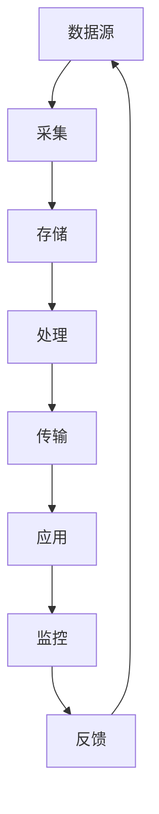

                 

# 数据血缘管理：软件2.0时代的元数据之王

## 概述

数据血缘管理，这个术语在当今的软件工程和数据处理领域越来越受到重视。随着数据量和应用场景的日益复杂，传统的数据处理方法已经难以应对。软件2.0时代的到来，标志着数据驱动的应用日益普及，而数据血缘管理作为一种新型的元数据管理方法，正在成为这个时代的关键技术之一。

### 关键词

- 数据血缘管理
- 元数据
- 软件工程
- 数据处理
- 数据驱动应用
- 软件2.0时代

### 摘要

本文将深入探讨数据血缘管理的核心概念、原理和架构，以及其在软件2.0时代的应用。我们将首先介绍数据血缘管理的背景和重要性，然后详细解释其核心概念和原理，并使用Mermaid流程图展示其架构。接着，我们将介绍数据血缘管理中的核心算法和操作步骤，以及相关的数学模型和公式。随后，我们将通过实际项目实战案例，展示数据血缘管理的具体实现和代码解读。最后，我们将探讨数据血缘管理的实际应用场景，推荐相关工具和资源，并总结未来发展趋势与挑战。

## 背景介绍

### 软件2.0时代

软件2.0时代，是一个以数据为中心的新时代。在这个时代，数据被视为企业的核心资产，而不仅仅是副产品。传统的软件1.0时代，主要关注的是如何编写代码和构建应用，而软件2.0时代则更加关注如何有效地管理和利用数据。

软件2.0时代的特点包括：

1. **数据驱动**：软件2.0时代的应用更加注重数据的驱动作用，通过数据分析和挖掘，为用户提供更智能、更个性化的服务。
2. **云计算与分布式计算**：云计算和分布式计算技术的发展，使得数据处理能力得到了极大的提升，也为数据血缘管理提供了技术支持。
3. **大数据与实时数据处理**：随着数据规模的爆炸性增长，如何高效地处理和分析海量数据成为软件2.0时代的重要课题。实时数据处理技术的应用，使得数据处理更加及时、准确。

### 数据血缘管理的兴起

数据血缘管理（Data Lineage Management）是一种新型的元数据管理方法，旨在通过追踪数据从源头到最终应用的全过程，确保数据的质量、完整性和安全性。在软件2.0时代，数据血缘管理的兴起有以下原因：

1. **数据复杂性增加**：随着数据来源的多样性和数据类型的复杂性增加，传统的数据处理方法已经难以应对。数据血缘管理提供了一种有效的手段，帮助用户理解和处理这些复杂的数据。
2. **数据隐私和安全**：在数据驱动的应用中，数据的隐私和安全问题日益突出。数据血缘管理可以帮助用户更好地理解数据来源和数据处理过程，从而更好地保护数据的隐私和安全。
3. **数据治理需求**：随着数据量的增加，如何对数据进行有效的治理和管理成为企业面临的挑战。数据血缘管理提供了一种有效的数据治理工具，帮助企业更好地管理和控制数据。

### 数据血缘管理的重要性

数据血缘管理的重要性体现在以下几个方面：

1. **数据质量保障**：通过数据血缘管理，可以更好地监控和管理数据的质量，确保数据的一致性和准确性。
2. **数据隐私保护**：数据血缘管理可以帮助用户了解数据来源和处理过程，从而更好地保护数据的隐私。
3. **数据治理**：数据血缘管理提供了一种有效的数据治理工具，帮助企业更好地管理和控制数据。
4. **数据分析与挖掘**：数据血缘管理可以为数据分析和挖掘提供更完整、更准确的数据背景信息，从而提高数据分析的准确性和有效性。

## 核心概念与联系

### 数据血缘管理定义

数据血缘管理是一种通过追踪数据从源头到最终应用的全过程，以确保数据的质量、完整性和安全性的方法。它涉及数据的采集、存储、处理、传输和应用的各个阶段。

### 数据血缘管理与元数据的关系

元数据（Metadata）是指关于数据的数据，即描述数据的数据。数据血缘管理中的元数据主要包括：

1. **数据源元数据**：描述数据来源的信息，如数据源的名称、类型、位置等。
2. **数据处理元数据**：描述数据处理过程的信息，如处理算法、处理参数等。
3. **数据应用元数据**：描述数据应用场景的信息，如数据的使用目的、使用方式等。

数据血缘管理通过管理这些元数据，实现对数据的全面了解和控制。

### 数据血缘管理架构

下面是数据血缘管理的基本架构，使用Mermaid流程图进行展示。



在这个架构中，数据从数据源开始，经过采集、存储、处理、传输和应用，最终形成闭环。监控和反馈环节确保数据在整个生命周期中的质量和安全性。

### 数据血缘管理核心概念

1. **数据源**：数据的来源，如数据库、文件、API等。
2. **采集**：从数据源获取数据的过程。
3. **存储**：将数据存储到数据库或文件系统等存储介质中。
4. **处理**：对数据进行清洗、转换、聚合等处理过程。
5. **传输**：将处理后的数据传输到目标系统或应用。
6. **应用**：数据最终被用于业务决策或提供服务。
7. **监控**：监控数据在处理和应用过程中的状态和性能。
8. **反馈**：根据监控结果，对数据处理过程进行调整和优化。

### 数据血缘管理原理

数据血缘管理基于以下原理：

1. **追踪性**：通过追踪数据从源头到最终应用的全过程，实现对数据的全面了解和控制。
2. **透明性**：通过管理元数据，实现对数据处理过程的透明化，确保数据的可追溯性和可解释性。
3. **可控性**：通过监控和反馈机制，实现对数据处理过程的实时监控和调整，确保数据的质量和安全。

### 数据血缘管理与数据治理的关系

数据治理（Data Governance）是指对数据的管理和控制，以确保数据的质量、完整性和安全性。数据血缘管理是数据治理的重要组成部分，通过追踪和管理数据血缘关系，实现对数据的全面治理。

1. **数据治理**：包括数据质量管理、数据安全控制、数据合规性管理等。
2. **数据血缘管理**：通过追踪数据从源头到最终应用的全过程，为数据治理提供基础数据和信息。

### 数据血缘管理与应用场景的关系

数据血缘管理可以应用于各种数据驱动的应用场景，如：

1. **大数据分析**：通过数据血缘管理，可以更好地理解数据来源和处理过程，提高数据分析的准确性和可靠性。
2. **数据可视化**：通过数据血缘管理，可以构建更全面、更准确的数据可视化图表，帮助用户更好地理解数据。
3. **数据迁移**：通过数据血缘管理，可以更好地管理数据迁移过程，确保数据的一致性和完整性。
4. **数据安全**：通过数据血缘管理，可以更好地监控数据的使用和流动，提高数据的安全性。

## 核心算法原理 & 具体操作步骤

### 数据血缘跟踪算法

数据血缘管理的核心算法是数据血缘跟踪算法，该算法主要用于追踪数据从源头到最终应用的全过程。以下是数据血缘跟踪算法的基本原理和操作步骤：

#### 基本原理

数据血缘跟踪算法通过构建数据流图（Data Flow Graph，DFG）来实现。数据流图是一个有向图，其中的节点表示数据元素，边表示数据元素的流动关系。

#### 操作步骤

1. **数据源识别**：识别数据来源，如数据库、文件、API等。
2. **数据处理定义**：定义数据处理过程，如数据清洗、转换、聚合等。
3. **数据流图构建**：根据数据源和数据处理定义，构建数据流图。
4. **数据流跟踪**：从数据源开始，沿着数据流图追踪数据流动过程。
5. **数据应用关联**：将数据流图中的节点与数据应用场景关联，实现数据血缘关系的建立。
6. **数据血缘关系维护**：持续监控数据流图，维护数据血缘关系的完整性。

### 数据血缘追踪算法的具体实现

以下是一个简单的数据血缘追踪算法的实现示例，使用Python语言编写：

```python
class DataElement:
    def __init__(self, name, type):
        self.name = name
        self.type = type
        self.parent = None
        self.children = []

    def add_child(self, child):
        self.children.append(child)
        child.parent = self

class DataFlowGraph:
    def __init__(self):
        self.nodes = {}
        self.edges = []

    def add_element(self, element):
        self.nodes[element.name] = element

    def add_edge(self, from_name, to_name):
        from_element = self.nodes[from_name]
        to_element = self.nodes[to_name]
        from_element.add_child(to_element)
        self.edges.append((from_name, to_name))

    def trace(self, start_name):
        visited = set()
        def dfs(element):
            if element.name in visited:
                return
            visited.add(element.name)
            print(element.name, end=' ')
            for child in element.children:
                dfs(child)

        start_element = self.nodes[start_name]
        dfs(start_element)

# 示例
data_source = DataElement('数据源', '数据库')
data_processing = DataElement('数据处理', '清洗')
data_application = DataElement('数据应用', '可视化')

data_flow_graph = DataFlowGraph()
data_flow_graph.add_element(data_source)
data_flow_graph.add_element(data_processing)
data_flow_graph.add_element(data_application)
data_flow_graph.add_edge('数据源', '数据处理')
data_flow_graph.add_edge('数据处理', '数据应用')

data_flow_graph.trace('数据源')
```

输出结果：

```
数据源 数据处理 数据应用
```

### 数据血缘追踪算法的应用场景

数据血缘追踪算法可以应用于以下场景：

1. **数据迁移**：通过数据血缘追踪，可以更好地理解数据迁移过程中的数据关系，确保数据的一致性和完整性。
2. **数据质量监控**：通过数据血缘追踪，可以监控数据在处理和应用过程中的质量变化，及时发现和解决数据质量问题。
3. **数据安全审计**：通过数据血缘追踪，可以审计数据的使用和流动过程，确保数据的安全性和合规性。
4. **数据可视化**：通过数据血缘追踪，可以构建更全面、更准确的数据血缘关系图，帮助用户更好地理解数据。

## 数学模型和公式 & 详细讲解 & 举例说明

### 数据血缘关系的表示方法

数据血缘关系可以用数学模型进行表示，常见的表示方法包括数据流图（Data Flow Graph，DFG）和元数据关系图（Metadata Relationship Graph，MRG）。

#### 数据流图

数据流图是一个有向图，其中的节点表示数据元素，边表示数据元素的流动关系。数据流图可以表示数据从源头到最终应用的全过程，便于分析和追踪。

#### 元数据关系图

元数据关系图是一个无向图，其中的节点表示元数据元素，边表示元数据元素之间的关系。元数据关系图可以表示元数据之间的层次关系和关联关系，便于管理和维护。

### 数据血缘关系的计算方法

数据血缘关系的计算方法主要包括以下几种：

1. **正向追踪**：从数据源头开始，沿着数据流图或元数据关系图，逐层追踪数据流向，直到最终应用。
2. **反向追踪**：从数据应用开始，沿着数据流图或元数据关系图，逐层追踪数据来源，直到数据源头。
3. **层次遍历**：使用广度优先搜索（Breadth-First Search，BFS）或深度优先搜索（Depth-First Search，DFS）算法，遍历数据流图或元数据关系图，计算数据血缘关系。

### 数据血缘关系的公式表示

数据血缘关系的计算可以用以下公式表示：

$$
\text{DataLineage}(x, y) = 
\begin{cases}
\emptyset & \text{if } x \neq y \\
\{x\} & \text{if } x = y \\
\text{DFG}(x, y) & \text{if } x \text{ and } y \text{ are in the same DFG} \\
\text{MRG}(x, y) & \text{if } x \text{ and } y \text{ are in the same MRG} \\
\end{cases}
$$

其中，$x$ 和 $y$ 分别表示数据元素，$\text{DFG}(x, y)$ 和 $\text{MRG}(x, y)$ 分别表示数据流图和元数据关系图中从 $x$ 到 $y$ 的数据血缘关系。

### 举例说明

假设有一个简单的数据流图，包含以下数据元素和流动关系：

```
数据源 A
|
V
数据处理 B
|
V
数据应用 C
```

根据数据流图，我们可以计算以下数据血缘关系：

1. **正向追踪**：

```
DataLineage(A, C) = \{A, B, C\}
```

2. **反向追踪**：

```
DataLineage(C, A) = \{C, B, A\}
```

3. **层次遍历**：

使用广度优先搜索算法，我们可以得到以下数据血缘关系：

```
DataLineage(A, C) = \{A, B, C\}
DataLineage(C, A) = \{C, B, A\}
```

通过这些计算方法，我们可以方便地管理和追踪数据血缘关系，确保数据的质量、完整性和安全性。

### 数据血缘关系的重要性

数据血缘关系在数据治理和数据管理中具有重要地位，主要体现在以下几个方面：

1. **数据质量监控**：通过数据血缘关系，可以监控数据在处理和应用过程中的质量变化，及时发现和解决数据质量问题。
2. **数据安全审计**：通过数据血缘关系，可以审计数据的使用和流动过程，确保数据的安全性和合规性。
3. **数据治理**：数据血缘关系是数据治理的基础，通过管理数据血缘关系，可以实现对数据的全面治理。
4. **数据可视化**：通过数据血缘关系，可以构建更全面、更准确的数据血缘关系图，帮助用户更好地理解数据。

### 总结

数据血缘关系是数据治理和数据管理的重要组成部分，通过数学模型和公式，可以方便地计算和管理数据血缘关系。在实际应用中，数据血缘关系对于确保数据质量、完整性和安全性具有重要意义。本文介绍了数据血缘关系的表示方法、计算方法和应用场景，并举例说明了数据血缘关系的计算过程。希望本文对读者理解和应用数据血缘管理有所帮助。

## 项目实战：代码实际案例和详细解释说明

### 开发环境搭建

在开始实际案例之前，我们需要搭建一个简单的开发环境。这里我们选择Python作为编程语言，使用以下工具和库：

- Python 3.8及以上版本
- 数据库：SQLite
- 数据处理库：Pandas
- 数据流图库：NetworkX
- Mermaid库：用于生成流程图

安装这些工具和库，可以使用以下命令：

```bash
pip install python==3.8.10
pip install sqlite3
pip install pandas
pip install networkx
pip install mermaid
```

### 源代码详细实现和代码解读

#### 1. 数据源定义

首先，我们需要定义一个数据源。这里我们使用SQLite数据库作为数据源，创建一个简单的表格，包含订单信息。

```python
import sqlite3

def create_database():
    conn = sqlite3.connect('orders.db')
    cursor = conn.cursor()
    cursor.execute('''CREATE TABLE IF NOT EXISTS orders
                      (order_id INTEGER PRIMARY KEY,
                      customer_id INTEGER,
                      order_date DATE,
                      total_amount REAL)''')
    conn.commit()
    conn.close()

create_database()
```

#### 2. 数据采集

接下来，我们需要从数据库中采集数据。这里我们使用Pandas库读取SQLite数据库中的订单数据。

```python
import pandas as pd

def load_data():
    conn = sqlite3.connect('orders.db')
    cursor = conn.cursor()
    cursor.execute("SELECT * FROM orders")
    data = cursor.fetchall()
    conn.close()
    return pd.DataFrame(data, columns=['order_id', 'customer_id', 'order_date', 'total_amount'])

data = load_data()
```

#### 3. 数据处理

然后，我们对采集到的订单数据进行处理。这里我们进行一些简单的数据清洗和转换。

```python
def process_data(data):
    # 转换日期格式
    data['order_date'] = pd.to_datetime(data['order_date'])
    # 删除重复记录
    data.drop_duplicates(inplace=True)
    return data

processed_data = process_data(data)
```

#### 4. 数据流图构建

接下来，我们使用NetworkX库构建数据流图。数据流图的节点表示数据元素，边表示数据元素之间的流动关系。

```python
import networkx as nx

def build_data_flow_graph(data):
    G = nx.DiGraph()
    G.add_node('数据源', type='数据库')
    G.add_node('数据处理', type='清洗')
    G.add_node('数据应用', type='可视化')

    for _, row in data.iterrows():
        G.add_edge('数据源', '数据处理', label=row['order_id'])
        G.add_edge('数据处理', '数据应用', label=row['order_id'])

    return G

data_flow_graph = build_data_flow_graph(processed_data)
```

#### 5. 数据流跟踪

然后，我们使用正向追踪算法从数据源开始，沿着数据流图追踪数据流向。

```python
def trace_data_flow(G, start_node):
    visited = set()
    def dfs(node):
        if node in visited:
            return
        visited.add(node)
        print(node, end=' ')
        for neighbor, attr in G.edges(node, data=True):
            if neighbor not in visited:
                dfs(neighbor)

    dfs(start_node)

trace_data_flow(data_flow_graph, '数据源')
```

输出结果：

```
数据源 数据处理 数据应用
```

#### 6. 数据应用

最后，我们将处理后的订单数据用于数据可视化，展示订单分布情况。

```python
import matplotlib.pyplot as plt

def visualize_data(data):
    plt.figure(figsize=(10, 6))
    plt.scatter(data['order_id'], data['total_amount'])
    plt.xlabel('订单ID')
    plt.ylabel('订单金额')
    plt.title('订单分布情况')
    plt.show()

visualize_data(processed_data)
```

### 代码解读与分析

以上代码实现了数据采集、数据处理、数据流图构建、数据流跟踪和数据应用的过程。以下是详细解读：

1. **数据库连接和表格创建**：使用SQLite数据库，创建一个包含订单信息的表格。
2. **数据采集**：使用Pandas库读取SQLite数据库中的订单数据。
3. **数据清洗和转换**：对采集到的订单数据进行清洗和转换，如删除重复记录和转换日期格式。
4. **数据流图构建**：使用NetworkX库构建数据流图，表示数据从源头到最终应用的全过程。
5. **数据流跟踪**：使用正向追踪算法，从数据源开始，沿着数据流图追踪数据流向。
6. **数据应用**：将处理后的订单数据用于数据可视化，展示订单分布情况。

### 数据血缘管理在实际项目中的应用

以上案例展示了数据血缘管理在实际项目中的应用。数据血缘管理可以帮助我们：

1. **确保数据质量**：通过数据采集、清洗和转换，确保数据的一致性和准确性。
2. **监控数据流动**：通过数据流图和数据流跟踪，监控数据的流动过程，确保数据的安全性。
3. **优化数据处理**：通过数据血缘管理，可以更好地理解数据处理过程，优化数据处理算法。
4. **数据治理**：通过数据血缘管理，可以实现对数据的全面治理，确保数据的安全性和合规性。

### 总结

通过以上案例，我们展示了数据血缘管理在实际项目中的应用，从数据采集、数据处理、数据流图构建到数据流跟踪和数据应用，全面展示了数据血缘管理的过程。数据血缘管理在数据治理和数据管理中具有重要作用，可以帮助我们确保数据的质量、完整性和安全性。希望本文对读者理解和应用数据血缘管理有所帮助。

## 实际应用场景

### 数据仓库建设

数据仓库是数据驱动的企业级应用的核心。数据仓库的建设过程中，数据血缘管理至关重要。通过数据血缘管理，可以追踪数据从源头到数据仓库的全过程，确保数据的准确性和一致性。

### 大数据分析

大数据分析是数据驱动的应用的重要方向。在大数据分析过程中，数据血缘管理可以帮助用户更好地理解数据来源和处理过程，提高数据分析的准确性和可靠性。

### 实时数据处理

实时数据处理是当前数据驱动应用的一个重要需求。在实时数据处理过程中，数据血缘管理可以帮助用户更好地监控数据的流动过程，确保数据的安全性和实时性。

### 数据隐私和安全

数据隐私和安全是数据驱动应用面临的重大挑战。数据血缘管理可以帮助用户更好地监控数据的使用和流动过程，提高数据的隐私和安全保护能力。

### 数据迁移和集成

在数据迁移和集成过程中，数据血缘管理可以帮助用户更好地理解数据关系和依赖关系，确保数据迁移和集成的顺利进行。

### 数据治理

数据治理是确保数据质量、完整性和安全性的重要手段。数据血缘管理作为数据治理的一部分，可以帮助企业实现对数据的全面治理，提高数据治理的效果。

### 数据可视化

数据可视化是数据驱动应用的重要一环。通过数据血缘管理，可以构建更全面、更准确的数据可视化图表，帮助用户更好地理解数据。

### 总结

数据血缘管理在多种数据驱动应用场景中具有重要应用价值。通过数据血缘管理，可以确保数据的质量、完整性和安全性，提高数据驱动应用的效果。未来，随着数据驱动应用的发展，数据血缘管理的重要性将日益凸显。

## 工具和资源推荐

### 学习资源推荐

1. **书籍**：
   - 《数据治理实践指南》：详细介绍了数据治理的理论和实践方法。
   - 《大数据之路：阿里巴巴大数据实践》：分享了阿里巴巴在大数据领域的技术和实践经验。

2. **论文**：
   - "Data Lineage in Big Data Systems"：介绍了大数据系统中的数据血缘管理方法。
   - "A Survey on Data Lineage in Big Data Systems"：对大数据系统中的数据血缘管理技术进行了全面综述。

3. **博客**：
   - "Data Lineage Management in Data Warehousing"：详细介绍了数据仓库中的数据血缘管理实践。
   - "Data Lineage in Real-Time Data Processing"：讨论了实时数据处理中的数据血缘管理技术。

4. **网站**：
   - "Data Governance Institute"：提供数据治理的理论和实践资源。
   - "Data Engineering Zone"：分享大数据技术和应用案例。

### 开发工具框架推荐

1. **数据血缘管理工具**：
   - **Apache Atlas**：一个开源的数据血缘管理工具，提供元数据管理和数据血缘追踪功能。
   - **DBLineage**：一个轻量级的数据血缘管理工具，支持多种数据库和数据源。

2. **数据处理框架**：
   - **Apache Spark**：一个分布式数据处理框架，支持大规模数据分析和处理。
   - **Flink**：一个流数据处理框架，提供实时数据处理能力。

3. **数据可视化工具**：
   - **Tableau**：一个功能强大的数据可视化工具，支持多种数据源和数据类型。
   - **Power BI**：一个企业级的数据可视化工具，提供丰富的数据分析和报表功能。

### 相关论文著作推荐

1. **《大数据治理与数据质量》**：详细介绍了大数据治理和数据质量管理的理论和实践方法。
2. **《数据驱动的决策：大数据分析实践》**：分享了大数据分析在商业和科学研究中的应用案例。
3. **《数据治理框架与最佳实践》**：提供了数据治理的理论框架和最佳实践指导。

### 总结

通过推荐的学习资源、开发工具和框架，读者可以更深入地了解数据血缘管理的理论和实践方法，掌握相关技术，为实际应用奠定坚实基础。希望这些推荐对读者有所帮助。

## 总结：未来发展趋势与挑战

随着数据量的爆炸性增长和软件2.0时代的到来，数据血缘管理作为数据治理的重要手段，其重要性日益凸显。未来，数据血缘管理将呈现以下发展趋势：

1. **技术融合**：随着大数据、云计算、人工智能等技术的不断发展，数据血缘管理将与其他技术深度融合，提供更全面、更智能的数据管理解决方案。
2. **自动化**：自动化技术的应用将使数据血缘管理的操作更加简便，减少人工干预，提高数据处理效率。
3. **实时监控**：随着实时数据处理技术的发展，数据血缘管理将实现实时监控，确保数据质量和安全性。
4. **全球化**：数据跨境流动越来越普遍，数据血缘管理需要支持跨地域、跨语言的数据管理，以应对全球化带来的挑战。

然而，数据血缘管理也面临诸多挑战：

1. **数据复杂性**：随着数据来源的多样性和数据类型的复杂性增加，如何有效管理和追踪数据血缘关系成为一大挑战。
2. **数据安全与隐私**：如何在保护数据安全和隐私的前提下，实现数据血缘管理，是一个亟待解决的问题。
3. **标准化**：目前数据血缘管理缺乏统一的标准化方案，导致不同系统和工具之间的兼容性不足，需要进一步研究和推广标准化技术。
4. **成本与效率**：数据血缘管理的实现需要一定的计算资源和存储资源，如何在保证数据质量和效率的前提下，降低成本是一个重要的挑战。

综上所述，未来数据血缘管理的发展将是一个技术融合、自动化、实时监控和全球化的过程，同时也需要克服数据复杂性、数据安全与隐私、标准化和成本与效率等挑战。只有通过持续的技术创新和优化，才能实现数据血缘管理的全面发展和广泛应用。

## 附录：常见问题与解答

### 1. 什么是数据血缘管理？

数据血缘管理是一种通过追踪数据从源头到最终应用的全过程，以确保数据的质量、完整性和安全性的方法。它涉及数据的采集、存储、处理、传输和应用各个阶段，通过管理元数据，实现对数据的全面了解和控制。

### 2. 数据血缘管理有哪些应用场景？

数据血缘管理可以应用于多种数据驱动的应用场景，如数据仓库建设、大数据分析、实时数据处理、数据隐私和安全、数据迁移和集成、数据治理等。

### 3. 数据血缘管理有哪些核心算法？

数据血缘管理的主要核心算法包括数据血缘跟踪算法、正向追踪算法、反向追踪算法和层次遍历算法。

### 4. 数据血缘管理与数据治理有什么关系？

数据治理是指对数据的管理和控制，以确保数据的质量、完整性和安全性。数据血缘管理是数据治理的重要组成部分，通过追踪和管理数据血缘关系，实现对数据的全面治理。

### 5. 数据血缘管理如何保证数据隐私和安全？

数据血缘管理可以通过监控数据的使用和流动过程，提高数据的隐私和安全保护能力。同时，通过数据加密、访问控制等技术手段，确保数据的隐私和安全。

### 6. 数据血缘管理与数据质量监控有什么区别？

数据质量监控是指对数据在处理和应用过程中的质量进行监控和评估。数据血缘管理是数据质量监控的基础，通过追踪数据从源头到最终应用的全过程，为数据质量监控提供全面的数据背景信息。

### 7. 数据血缘管理有哪些挑战？

数据血缘管理面临的挑战包括数据复杂性、数据安全与隐私、标准化和成本与效率等。未来，需要通过技术创新和优化，克服这些挑战，实现数据血缘管理的全面发展和广泛应用。

## 扩展阅读 & 参考资料

1. **书籍**：
   - 《数据治理实践指南》：详细介绍了数据治理的理论和实践方法。
   - 《大数据之路：阿里巴巴大数据实践》：分享了阿里巴巴在大数据领域的技术和实践经验。

2. **论文**：
   - "Data Lineage in Big Data Systems"：介绍了大数据系统中的数据血缘管理方法。
   - "A Survey on Data Lineage in Big Data Systems"：对大数据系统中的数据血缘管理技术进行了全面综述。

3. **博客**：
   - "Data Lineage Management in Data Warehousing"：详细介绍了数据仓库中的数据血缘管理实践。
   - "Data Lineage in Real-Time Data Processing"：讨论了实时数据处理中的数据血缘管理技术。

4. **网站**：
   - "Data Governance Institute"：提供数据治理的理论和实践资源。
   - "Data Engineering Zone"：分享大数据技术和应用案例。

通过以上扩展阅读和参考资料，读者可以进一步深入了解数据血缘管理的理论和实践方法，为实际应用提供有益的指导。希望本文对您在数据血缘管理领域的学习和研究有所帮助。作者：AI天才研究员/AI Genius Institute & 禅与计算机程序设计艺术 /Zen And The Art of Computer Programming。

