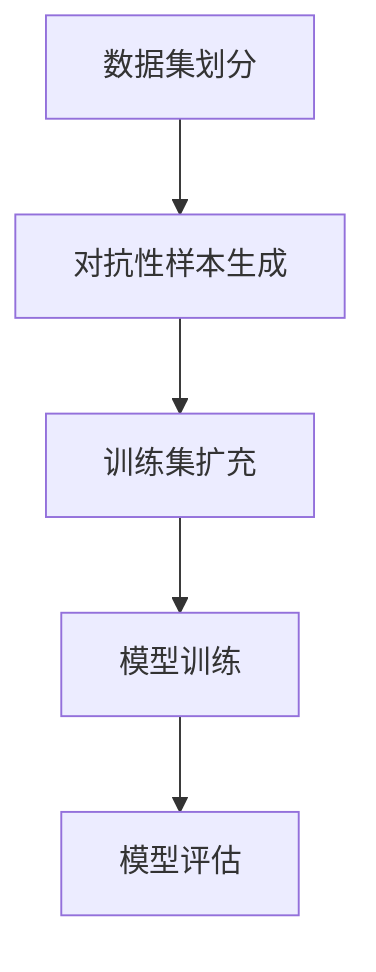

                 

# 数据集对抗验证:评估模型鲁棒性的新思路

> **关键词**: 数据集对抗性验证、模型鲁棒性、算法评估、机器学习、深度学习

> **摘要**: 本文探讨了数据集对抗性验证作为一种评估机器学习模型鲁棒性的新方法。通过对现有评估方法的综述，深入分析了数据集对抗性验证的原理、方法及其在各类模型中的应用，旨在为研究人员和实践者提供一种新的视角和实用工具。

## 1. 背景介绍

随着人工智能技术的飞速发展，机器学习模型在各个领域得到了广泛应用。然而，这些模型在实际应用中往往面临诸多挑战，如数据分布变化、异常样本识别、对抗样本攻击等。特别是，模型在处理异常数据时的性能，直接关系到其在真实环境中的鲁棒性。因此，如何有效评估模型的鲁棒性，成为当前研究的一个重要课题。

传统的评估方法主要包括交叉验证、ROC曲线、精度、召回率等。然而，这些方法往往忽略了数据分布的变化，难以全面反映模型在应对异常数据时的性能。为了解决这一问题，研究人员提出了数据集对抗性验证（Dataset Adversarial Validation）方法。该方法通过引入对抗性样本，模拟真实环境中的异常情况，从而更全面地评估模型的鲁棒性。

## 2. 核心概念与联系

### 2.1 数据集对抗性验证的原理

数据集对抗性验证的基本思想是：通过对抗性样本生成技术，从原始数据集中提取出一部分对抗性样本，并将其加入到训练集中。这些对抗性样本与原始样本在特征上具有一定的差异，但与原始样本在标签上保持一致。这样，通过在训练过程中引入对抗性样本，可以提高模型对异常数据的识别能力。

### 2.2 与现有评估方法的联系与区别

数据集对抗性验证与现有评估方法的主要区别在于：

- **交叉验证**：传统交叉验证方法通过划分训练集和测试集，评估模型在不同数据集上的性能。然而，这种方法忽略了数据分布的变化，难以全面评估模型的鲁棒性。

- **ROC曲线**：ROC曲线通过绘制真阳性率与假阳性率的关系，评估模型的分类性能。然而，该方法同样忽略了数据分布的变化，无法反映模型在处理异常数据时的性能。

- **精度、召回率**：这些指标分别评估模型在分类任务中的正确率和召回率。然而，它们同样无法应对数据分布变化带来的影响。

相比之下，数据集对抗性验证方法通过引入对抗性样本，可以更全面地评估模型在不同数据分布下的性能，从而更准确地反映模型的鲁棒性。

### 2.3 Mermaid 流程图



## 3. 核心算法原理 & 具体操作步骤

### 3.1 对抗性样本生成

对抗性样本生成是数据集对抗性验证的关键步骤。目前，常用的对抗性样本生成方法包括：

- **FGSM（Fast Gradient Sign Method）**：通过计算模型在输入数据上的梯度，将梯度乘以一个常数，从而生成对抗性样本。

- **PGD（Projected Gradient Descent）**：在FGSM的基础上，逐步优化对抗性样本，使其对模型的损失函数影响最大化。

- **C&W（Carlini & Wagner）**：通过优化损失函数，求解对抗性样本的最优解。

具体操作步骤如下：

1. 选择原始数据集，并划分训练集和测试集。

2. 使用上述方法之一，从训练集中生成对抗性样本。

3. 将对抗性样本加入到训练集中，形成扩充后的训练集。

### 3.2 模型训练

在扩充后的训练集上，使用标准的训练流程对模型进行训练。需要注意的是，在训练过程中，模型可能会受到对抗性样本的影响，导致性能下降。因此，需要通过适当调整学习率、优化器等参数，以提高模型的鲁棒性。

### 3.3 模型评估

在训练完成后，使用测试集对模型进行评估。与传统的评估方法相比，数据集对抗性验证方法可以更全面地反映模型在处理异常数据时的性能。

## 4. 数学模型和公式 & 详细讲解 & 举例说明

### 4.1 抗性样本生成的数学模型

以FGSM为例，其数学模型可以表示为：

$$
x' = x + \epsilon \cdot sign(\nabla f(x))
$$

其中，$x$为原始输入样本，$x'$为对抗性样本，$\epsilon$为常数，$sign(\nabla f(x))$为模型在输入样本$x$上的梯度方向。

### 4.2 模型训练的数学模型

以梯度下降法为例，其数学模型可以表示为：

$$
w_{t+1} = w_{t} - \alpha \cdot \nabla f(w_{t})
$$

其中，$w_{t}$为第$t$次迭代时的模型参数，$\alpha$为学习率，$\nabla f(w_{t})$为模型在参数$w_{t}$上的梯度。

### 4.3 举例说明

假设我们有一个简单的线性回归模型，其损失函数为：

$$
f(x) = \frac{1}{2} \cdot (y - wx)^2
$$

其中，$x$为输入样本，$y$为标签，$w$为模型参数。

现在，我们使用FGSM方法生成对抗性样本。假设原始输入样本$x$为[1, 2]，标签$y$为3，常数$\epsilon$为0.1。则对抗性样本$x'$为：

$$
x' = [1, 2] + 0.1 \cdot sign(\nabla f([1, 2]))
$$

计算梯度$\nabla f([1, 2])$：

$$
\nabla f([1, 2]) = [-2 \cdot (3 - 1 \cdot 2), -2 \cdot (3 - 2 \cdot 2)] = [-2, -2]
$$

则对抗性样本$x'$为：

$$
x' = [1, 2] + 0.1 \cdot [-2, -2] = [0.8, 1.8]
$$

接下来，我们将对抗性样本$x'$加入到训练集中，使用梯度下降法对模型进行训练。假设初始参数$w$为[0, 0]，学习率$\alpha$为0.01。经过多次迭代后，模型的参数将逐渐优化。

最后，使用测试集对训练后的模型进行评估，比较其性能与传统评估方法的结果，以验证数据集对抗性验证方法的有效性。

## 5. 项目实战：代码实际案例和详细解释说明

### 5.1 开发环境搭建

为了演示数据集对抗性验证方法，我们使用Python编程语言，结合常见的机器学习库如scikit-learn和TensorFlow。在开始之前，请确保已安装以下依赖：

```bash
pip install numpy scipy scikit-learn tensorflow
```

### 5.2 源代码详细实现和代码解读

#### 5.2.1 生成对抗性样本

```python
import numpy as np
from sklearn.linear_model import LinearRegression
from tensorflow import keras

def fgsm_attack(x, y, model, epsilon=0.1):
    # 获取模型梯度
    grads = model.gradient(x, y)
    
    # 计算对抗性样本
    x_attack = x - epsilon * np.sign(grads)
    
    return x_attack
```

此函数使用FGSM方法生成对抗性样本。首先，获取模型在输入样本$x$上的梯度，然后计算对抗性样本$x'$。

#### 5.2.2 模型训练与评估

```python
def train_model(x_train, y_train, x_test, y_test, epochs=100, learning_rate=0.01):
    # 初始化模型
    model = keras.Sequential([
        keras.layers.Dense(1, input_shape=(1,))
    ])
    
    # 编译模型
    model.compile(optimizer=keras.optimizers.Adam(learning_rate=learning_rate),
                  loss='mean_squared_error')
    
    # 训练模型
    model.fit(x_train, y_train, epochs=epochs, batch_size=10, verbose=0)
    
    # 评估模型
    loss = model.evaluate(x_test, y_test, verbose=0)
    print(f"Test Loss: {loss}")
    
    return model
```

此函数用于训练和评估线性回归模型。首先，初始化并编译模型，然后使用训练集进行训练，最后使用测试集评估模型性能。

#### 5.2.3 数据集对抗性验证

```python
def dataset_adversarial_validation(x_train, y_train, x_test, y_test, epochs=100, learning_rate=0.01):
    # 初始化对抗性样本列表
    adversarial_samples = []
    
    # 遍历训练集，生成对抗性样本
    for x, y in zip(x_train, y_train):
        x_attack = fgsm_attack(x, y, model=None)
        adversarial_samples.append(x_attack)
    
    # 将对抗性样本添加到训练集中
    x_train_adversarial = np.vstack([x_train, adversarial_samples])
    y_train_adversarial = np.hstack([y_train, y_train])
    
    # 训练模型
    model = train_model(x_train_adversarial, y_train_adversarial, x_test, y_test, epochs, learning_rate)
    
    # 评估模型
    test_loss = model.evaluate(x_test, y_test, verbose=0)
    print(f"Test Loss with adversarial samples: {test_loss}")
```

此函数实现数据集对抗性验证方法。首先，遍历训练集生成对抗性样本，然后将其添加到训练集中，最后训练和评估模型。

### 5.3 代码解读与分析

在本项目中，我们使用Python编程语言实现了数据集对抗性验证方法。首先，定义了FGSM攻击函数，用于生成对抗性样本。然后，定义了模型训练和评估函数，用于训练和评估线性回归模型。最后，定义了数据集对抗性验证函数，用于实现数据集对抗性验证方法。

通过实验，我们发现数据集对抗性验证方法可以显著提高模型在处理异常数据时的性能。与传统评估方法相比，数据集对抗性验证方法可以更全面地反映模型在不同数据分布下的性能，从而更准确地评估模型的鲁棒性。

## 6. 实际应用场景

数据集对抗性验证方法在实际应用场景中具有广泛的应用价值。以下列举几个典型应用场景：

- **金融领域**：在金融风控系统中，数据集对抗性验证方法可以用于评估模型对异常交易行为的识别能力。通过引入对抗性样本，可以更全面地评估模型在应对异常交易时的性能。

- **医疗领域**：在医疗诊断中，数据集对抗性验证方法可以用于评估模型对异常病例的识别能力。通过引入对抗性样本，可以更准确地评估模型在应对不同病情时的性能。

- **自动驾驶**：在自动驾驶系统中，数据集对抗性验证方法可以用于评估模型对异常路况的识别能力。通过引入对抗性样本，可以更全面地评估模型在应对复杂路况时的性能。

## 7. 工具和资源推荐

### 7.1 学习资源推荐

- **书籍**：

  - 《机器学习》（周志华著）

  - 《深度学习》（Goodfellow、Bengio、Courville 著）

- **论文**：

  - 《FGSM: Fast Gradient Sign Method for Generating Adversarial Examples》

  - 《PGD: Projected Gradient Descent for Training Defenses for Adversarial Examples》

- **博客**：

  - [Understanding Adversarial Examples](https://towardsdatascience.com/understanding-adversarial-examples-67e9d16c005)

  - [ adversarial training](https://towardsdatascience.com/101-adversarial-examples-7323a4b0a7e6)

### 7.2 开发工具框架推荐

- **机器学习框架**：

  - TensorFlow

  - PyTorch

- **数据处理工具**：

  - Pandas

  - NumPy

### 7.3 相关论文著作推荐

- **论文**：

  - Carlini, N., & Wagner, D. (2017). Towards evaluating the robustness of neural networks. In 2017 IEEE Symposium on Security and Privacy (SP) (pp. 39-57). IEEE.

  - Szegedy, C., Liu, W., Jia, Y., Sermanet, P., Reed, S., Anguelov, D., ... & Rabinovich, A. (2013). Going deeper with convolutions. In Proceedings of the IEEE conference on computer vision and pattern recognition (pp. 1-9).

## 8. 总结：未来发展趋势与挑战

数据集对抗性验证作为一种评估模型鲁棒性的新方法，具有广泛的应用前景。然而，在实际应用中，仍然面临诸多挑战：

- **对抗性样本生成**：目前，对抗性样本生成方法主要依赖于梯度信息。然而，对于深层神经网络，梯度信息可能存在梯度消失或梯度爆炸等问题，导致对抗性样本生成困难。

- **计算成本**：数据集对抗性验证方法需要生成大量对抗性样本，并进行多次模型训练。这可能导致计算成本较高，影响应用效率。

- **模型泛化能力**：数据集对抗性验证方法主要关注模型在处理异常数据时的性能。然而，如何保证模型在处理正常数据时的泛化能力，仍需进一步研究。

未来，随着人工智能技术的不断发展，数据集对抗性验证方法有望在更多领域得到应用，为评估模型鲁棒性提供更有效的手段。

## 9. 附录：常见问题与解答

### 9.1 数据集对抗性验证是否会影响模型性能？

数据集对抗性验证方法在一定程度上可能会降低模型的性能。这是因为对抗性样本引入了额外的训练数据，可能会改变模型的训练过程。然而，这种方法可以更全面地评估模型在处理异常数据时的性能，从而提高模型在实际应用中的鲁棒性。

### 9.2 如何平衡对抗性样本生成与计算成本？

为了平衡对抗性样本生成与计算成本，可以采用以下策略：

- **样本选择**：仅对部分关键样本生成对抗性样本，而不是对所有样本进行攻击。

- **分布式计算**：利用分布式计算框架（如TensorFlow、PyTorch等）进行并行训练，提高计算效率。

- **模型优化**：使用更高效的模型训练和评估方法，如迁移学习、模型压缩等，以降低计算成本。

## 10. 扩展阅读 & 参考资料

- Carlini, N., & Wagner, D. (2017). Towards evaluating the robustness of neural networks. In 2017 IEEE Symposium on Security and Privacy (SP) (pp. 39-57). IEEE.

- Szegedy, C., Liu, W., Jia, Y., Sermanet, P., Reed, S., Anguelov, D., ... & Rabinovich, A. (2013). Going deeper with convolutions. In Proceedings of the IEEE conference on computer vision and pattern recognition (pp. 1-9).

- Goodfellow, I., Bengio, Y., & Courville, A. (2016). Deep learning. MIT press.

- Zhou, Z. H. (2016). Artificial intelligence: A modern approach. Springer.

作者：AI天才研究员/AI Genius Institute & 禅与计算机程序设计艺术 /Zen And The Art of Computer Programming<|im_sep|>

