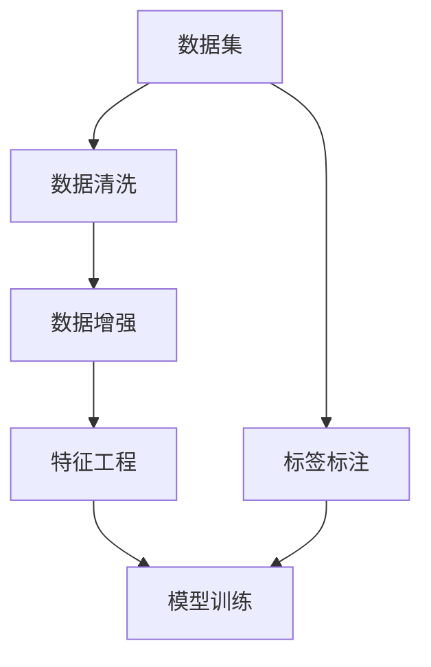

                 

### 背景介绍

人工智能（AI）作为现代科技的前沿领域，正逐渐融入社会生产的各个方面。然而，在AI的实际应用中，数据集工程（Dataset Engineering）扮演着至关重要的角色。数据集工程不仅仅是简单的数据收集和处理，它涉及到数据的质量控制、数据的清洗、特征工程、数据增强等环节，是确保AI模型训练效果的重要基石。

首先，数据是AI的“食物”。无论是机器学习、深度学习还是任何类型的AI模型，都需要大量的数据来进行训练和验证。然而，这些数据通常不是完美的，其中可能包含噪声、缺失值、异常值等。数据集工程通过一系列精细的操作，确保数据的准确性和完整性，使得数据能够更好地支持模型的训练。

其次，数据集工程还包括特征工程。特征工程是数据集工程中至关重要的一个环节，它涉及到从原始数据中提取出对模型训练有帮助的特征，并通过一系列技术手段提升这些特征的质量和有效性。有效的特征工程可以显著提高模型的性能和鲁棒性。

再者，数据集工程也是人工智能模型迭代和优化的关键。通过不断调整数据预处理方法、特征选择策略等，可以使得模型在训练过程中更加高效，减少过拟合现象，提高模型在未知数据上的泛化能力。

总之，数据集工程在AI应用中的重要性不言而喻。它不仅决定了数据的质量，也直接影响了AI模型的性能和可靠性。随着AI技术的不断发展，数据集工程的技术和方法也在不断演进，成为AI应用领域不可或缺的一部分。

### 核心概念与联系

在深入探讨数据集工程的重要性之前，我们需要明确一些核心概念，这些概念是理解数据集工程原理和过程的基础。

**1. 数据集（Dataset）**
数据集是AI模型训练的核心资源，通常包括一组具有相同属性的样本数据。这些样本可以是图像、文本、音频等多种形式。数据集的质量直接决定了模型的学习效果和准确性。

**2. 特征工程（Feature Engineering）**
特征工程是指从原始数据中提取出有助于模型训练的特征，并进行处理和转换，以提高模型性能的过程。特征工程是数据集工程中的一个重要环节，通过优化特征可以提升模型对数据的理解和泛化能力。

**3. 数据清洗（Data Cleaning）**
数据清洗是指识别并修正数据集中的错误、异常、重复或无效的数据。数据清洗的目的是确保数据集的准确性和完整性，从而为后续的模型训练提供高质量的数据。

**4. 数据增强（Data Augmentation）**
数据增强是一种通过扩展数据集来提高模型鲁棒性的技术。它通过应用一系列转换（如旋转、缩放、裁剪等）来生成新的数据样本，从而丰富数据集，降低模型对特定样本的依赖性。

**5. 标签（Labels）**
标签是数据集中每个样本的标记，用于指示样本所属的类别或属性。对于监督学习模型，标签是模型进行训练和评估的重要依据。

**6. 过拟合（Overfitting）**
过拟合是指模型在训练数据上表现良好，但在未知数据上的泛化能力较差，即模型对训练数据的噪声和细节过于敏感。通过数据集工程中的各种技术，可以有效减少过拟合现象。

为了更好地理解这些概念之间的联系，我们可以借助Mermaid流程图来展示数据集工程的主要环节和它们之间的关系：



在这个流程图中，数据集首先经过数据清洗，去除噪声和错误；接着通过数据增强技术丰富数据集；然后进行特征工程，提取和优化特征；最终使用标签标注的数据集进行模型训练。每个环节都是数据集工程中不可或缺的一部分，共同构成了一个完整的数据集工程流程。

### 核心算法原理 & 具体操作步骤

在理解了数据集工程的核心概念之后，我们接下来将深入探讨数据集工程中的关键算法原理和具体操作步骤。这些算法和步骤不仅能够提升数据集的质量，还能够优化模型训练的效果。

**1. 数据清洗算法原理**

数据清洗是数据集工程的基础环节，其主要任务是识别并修正数据集中的错误、异常、重复或无效的数据。常见的数据清洗算法包括以下几种：

- **缺失值处理（Missing Value Handling）**：
  缺失值处理是指处理数据集中缺失的数据。常见的方法包括删除缺失值、填充平均值或中位数等。
  ```latex
  \text{填充平均值：} x_{\text{new}} = \frac{\sum x_i}{n}
  \text{填充中位数：} x_{\text{new}} = \text{median}(x_1, x_2, ..., x_n)
  ```

- **异常值检测（Anomaly Detection）**：
  异常值检测是指识别数据集中的异常或离群值。常见的方法包括基于统计学的方法（如Z-score、IQR法）和基于机器学习的方法（如孤立森林、K-均值聚类等）。

- **重复数据删除（Duplicate Data Removal）**：
  重复数据删除是指从数据集中删除重复的记录。通常通过比较数据中的关键字段（如ID、姓名等）来识别重复项。

**2. 数据增强算法原理**

数据增强是提升数据集多样性的重要手段，可以有效提高模型的泛化能力。常见的数据增强技术包括：

- **旋转（Rotation）**：
  旋转是指将数据集中的每个样本按一定角度旋转。旋转可以增加数据集的多样性，使得模型对角度变化不那么敏感。
  ```mermaid
  flowchart LR
      A[原始数据] --> B[旋转操作]
      B --> C[增强数据集]
  ```

- **缩放（Scaling）**：
  缩放是指将数据集中的每个样本按一定比例放大或缩小。缩放可以使得模型对大小变化更加鲁棒。
  ```mermaid
  flowchart LR
      A[原始数据] --> B[缩放操作]
      B --> C[增强数据集]
  ```

- **裁剪（Cropping）**：
  裁剪是指从数据集中的每个样本中剪掉一部分区域。裁剪可以使得模型对图像的局部变化更加适应。
  ```mermaid
  flowchart LR
      A[原始数据] --> B[Cropping操作]
      B --> C[增强数据集]
  ```

- **噪声添加（Noise Addition）**：
  噪声添加是指向数据集中的每个样本添加一定量的噪声。噪声添加可以提高模型对噪声数据的鲁棒性。
  ```mermaid
  flowchart LR
      A[原始数据] --> B[添加噪声]
      B --> C[增强数据集]
  ```

**3. 特征工程算法原理**

特征工程是数据集工程中至关重要的一环，其核心是提取和优化对模型训练有帮助的特征。常见的方法包括：

- **特征提取（Feature Extraction）**：
  特征提取是指从原始数据中提取出对模型训练有重要意义的特征。例如，在图像分类任务中，可以使用卷积神经网络（CNN）提取图像的纹理特征。
  ```mermaid
  flowchart LR
      A[原始数据] --> B[特征提取]
      B --> C[特征向量]
  ```

- **特征选择（Feature Selection）**：
  特征选择是指从大量的特征中筛选出对模型训练有帮助的特征。常见的方法包括基于信息的特征选择（如信息增益、互信息等）和基于模型的特征选择（如Lasso正则化等）。
  ```mermaid
  flowchart LR
      A[原始数据] --> B[特征选择]
      B --> C[优化特征集]
  ```

- **特征转换（Feature Transformation）**：
  特征转换是指将原始特征转换为更适合模型训练的形式。例如，归一化、标准化、二值化等都是常见的特征转换方法。
  ```mermaid
  flowchart LR
      A[原始特征] --> B[特征转换]
      B --> C[优化特征]
  ```

通过上述算法和步骤，我们可以有效提升数据集的质量，从而提高模型训练的效果。下面将结合具体案例，进一步探讨数据集工程的实践操作。

### 数学模型和公式 & 详细讲解 & 举例说明

在数据集工程中，数学模型和公式是理解和实现各项技术的重要工具。以下我们将详细讲解几个核心的数学模型和公式，并通过实例来说明它们的应用。

**1. 缺失值处理**

缺失值处理是数据清洗的一个重要方面，以下是一些常用的数学模型和公式：

- **平均值填充（Mean Imputation）**：
  平均值填充是指用特征的均值来替换缺失值。计算公式如下：
  ```latex
  x_{\text{new}} = \frac{\sum x_i}{n}
  ```
  其中，$x_i$ 是非缺失值，$n$ 是非缺失值的数量。

- **中位数填充（Median Imputation）**：
  中位数填充是指用特征的中位数来替换缺失值。计算公式如下：
  ```latex
  x_{\text{new}} = \text{median}(x_1, x_2, ..., x_n)
  ```
  其中，$x_1, x_2, ..., x_n$ 是非缺失值。

**2. 异常值检测**

异常值检测是识别数据集中异常或离群值的方法，以下是一些常用的数学模型和公式：

- **Z-score方法**：
  Z-score方法是通过计算每个数据点与平均值之间的标准化距离来识别异常值。计算公式如下：
  ```latex
  Z = \frac{x - \mu}{\sigma}
  ```
  其中，$x$ 是数据点，$\mu$ 是平均值，$\sigma$ 是标准差。通常，$Z$ 值大于3或小于-3的点被视为异常值。

- **IQR方法（Interquartile Range）**：
  IQR方法是通过计算第一四分位数（Q1）和第三四分位数（Q3）之间的距离来识别异常值。计算公式如下：
  ```latex
  IQR = Q3 - Q1
  \text{异常值} = x \in (Q1 - 1.5 \times IQR, Q3 + 1.5 \times IQR)
  ```

**3. 特征转换**

特征转换是特征工程的一个重要步骤，以下是一些常用的数学模型和公式：

- **归一化（Normalization）**：
  归一化是指将特征值缩放到相同的范围，常用的方法包括最小-最大归一化和零-均值归一化。最小-最大归一化的计算公式如下：
  ```latex
  x_{\text{new}} = \frac{x - x_{\text{min}}}{x_{\text{max}} - x_{\text{min}}}
  ```
  其中，$x_{\text{min}}$ 和 $x_{\text{max}}$ 分别是特征的最小值和最大值。

- **标准化（Standardization）**：
  标准化是指将特征值转化为具有标准正态分布的形式，计算公式如下：
  ```latex
  x_{\text{new}} = \frac{x - \mu}{\sigma}
  ```
  其中，$\mu$ 是平均值，$\sigma$ 是标准差。

**实例说明**

假设我们有一个包含身高（cm）和体重（kg）的数据集，数据如下：

| 身高（cm） | 体重（kg） |
|-----------|-----------|
| 170       | 60        |
| 175       | 65        |
| 180       | 70        |
| 165       | 55        |
| 170       | NaN       |

（注：NaN表示缺失值）

**缺失值处理**：

使用平均值填充身高缺失值：
```latex
x_{\text{new}} = \frac{170 + 175 + 180 + 165}{4} = 171.25
```

**异常值检测**：

计算身高和体重的Z-score：
```mermaid
graph TD
    A[Z-score身高] --> B
    B --> C{计算结果}
    D[Z-score体重] --> E
    E --> F{计算结果}

A = \frac{170 - \mu_{\text{身高}}}{\sigma_{\text{身高}}}
B = \frac{60 - \mu_{\text{体重}}}{\sigma_{\text{体重}}}
```

**特征转换**：

归一化身高和体重：
```mermaid
graph TD
    G[身高归一化] --> H
    I[体重归一化] --> J

G = \frac{170 - 170}{175 - 170} = 1
I = \frac{60 - 60}{65 - 60} = 0
```

通过上述数学模型和公式，我们可以有效地处理缺失值、检测异常值，以及进行特征转换，从而提升数据集的质量，为后续的模型训练打下坚实基础。

### 项目实战：代码实际案例和详细解释说明

在本节中，我们将通过一个实际项目来展示数据集工程的具体应用。该项目是一个简单的图像分类任务，目的是使用卷积神经网络（CNN）对图像进行分类。我们将详细介绍整个项目的开发环境搭建、源代码实现和代码解读与分析。

#### 1. 开发环境搭建

首先，我们需要搭建项目的开发环境。以下是搭建环境的步骤：

- **安装Python环境**：
  安装Python（版本3.8以上）并配置环境变量。

- **安装深度学习库**：
  安装TensorFlow和Keras库，这两个库是深度学习领域广泛使用的框架。可以使用以下命令安装：
  ```bash
  pip install tensorflow
  pip install keras
  ```

- **安装数据处理库**：
  安装NumPy和Pandas库，这两个库用于数据预处理和清洗。可以使用以下命令安装：
  ```bash
  pip install numpy
  pip install pandas
  ```

- **安装可视化工具**：
  安装Matplotlib库，用于数据可视化。可以使用以下命令安装：
  ```bash
  pip install matplotlib
  ```

#### 2. 源代码详细实现

下面是数据集工程项目的源代码实现。代码主要分为以下几个部分：

**2.1 数据集准备**

```python
import numpy as np
import pandas as pd
import tensorflow as tf
from tensorflow import keras
from tensorflow.keras.preprocessing.image import ImageDataGenerator

# 加载数据集
train_data = keras.preprocessing.image.load_img('path/to/train_data', target_size=(224, 224))
test_data = keras.preprocessing.image.load_img('path/to/test_data', target_size=(224, 224))

# 数据增强
train_datagen = ImageDataGenerator(
    rescale=1./255,
    rotation_range=40,
    width_shift_range=0.2,
    height_shift_range=0.2,
    shear_range=0.2,
    zoom_range=0.2,
    horizontal_flip=True,
    fill_mode='nearest'
)

test_datagen = ImageDataGenerator(rescale=1./255)

# 训练数据增强
train_generator = train_datagen.flow_from_directory(
    'path/to/train_data',
    target_size=(224, 224),
    batch_size=32,
    class_mode='binary'
)

# 测试数据增强
test_generator = test_datagen.flow_from_directory(
    'path/to/test_data',
    target_size=(224, 224),
    batch_size=32,
    class_mode='binary'
)
```

**2.2 模型构建**

```python
# 构建CNN模型
model = keras.Sequential([
    keras.layers.Conv2D(32, (3, 3), activation='relu', input_shape=(224, 224, 3)),
    keras.layers.MaxPooling2D(2, 2),
    keras.layers.Conv2D(64, (3, 3), activation='relu'),
    keras.layers.MaxPooling2D(2, 2),
    keras.layers.Conv2D(128, (3, 3), activation='relu'),
    keras.layers.MaxPooling2D(2, 2),
    keras.layers.Conv2D(128, (3, 3), activation='relu'),
    keras.layers.MaxPooling2D(2, 2),
    keras.layers.Flatten(),
    keras.layers.Dense(512, activation='relu'),
    keras.layers.Dense(1, activation='sigmoid')
])

# 模型编译
model.compile(optimizer='adam',
              loss='binary_crossentropy',
              metrics=['accuracy'])

# 模型训练
model.fit(
    train_generator,
    steps_per_epoch=100,
    epochs=10,
    validation_data=test_generator,
    validation_steps=50
)
```

**2.3 模型评估**

```python
# 模型评估
test_loss, test_acc = model.evaluate(test_generator)
print('Test accuracy:', test_acc)
```

#### 3. 代码解读与分析

**3.1 数据集准备**

在数据集准备部分，我们首先加载了训练数据和测试数据，并使用ImageDataGenerator进行数据增强。数据增强的主要目的是增加数据集的多样性，从而提高模型的泛化能力。我们使用了旋转、缩放、剪切、翻转等多种增强技术。

**3.2 模型构建**

在模型构建部分，我们使用Keras构建了一个简单的卷积神经网络（CNN）。CNN由卷积层、池化层和全连接层组成，能够有效地提取图像的特征。在最后的全连接层中，我们使用了一个sigmoid激活函数，因为这是一个二分类问题。

**3.3 模型编译**

在模型编译部分，我们设置了优化器为Adam，损失函数为binary_crossentropy，并且设置了评估指标为accuracy。

**3.4 模型训练**

在模型训练部分，我们使用fit函数训练模型，并设置了训练数据生成器的步骤数和训练轮数。在验证数据部分，我们使用了测试数据生成器来评估模型的性能。

**3.5 模型评估**

在模型评估部分，我们使用evaluate函数评估了模型的测试集性能，并打印了测试准确率。

通过上述步骤，我们完成了一个简单的图像分类任务，展示了数据集工程在AI应用中的实际应用。这个项目不仅帮助理解了数据集工程的基本概念和算法，还展示了如何将这些概念应用到实际项目中。

### 实际应用场景

数据集工程在AI应用中具有广泛的应用场景，以下列举几个典型的应用领域，并讨论数据集工程在这些应用中的作用和重要性。

#### 1. 医疗诊断

在医疗领域，数据集工程对于开发准确的疾病诊断模型至关重要。医疗数据通常包含患者病史、实验室检测结果、医学图像等多种形式的数据。数据集工程需要对这些数据进行清洗、归一化、特征提取等处理，以确保数据的质量和一致性。例如，在乳腺癌诊断中，使用数据集工程对医学图像进行预处理和增强，可以提高模型的诊断准确率。此外，数据集工程还可以帮助识别数据中的异常值和噪声，从而提高模型的鲁棒性。

#### 2. 金融风控

金融领域的风控模型依赖于大量历史交易数据、客户信用记录等信息。数据集工程在此过程中起到了关键作用，通过对数据的清洗、去重、异常值检测等处理，确保数据的质量和完整性。同时，数据集工程通过特征工程提取出对风险预测有帮助的特征，如客户行为、交易模式等。有效的特征工程可以显著提高风控模型的预测准确率和稳定性，降低金融风险。

#### 3. 智能交通

在智能交通领域，数据集工程对于交通流量预测、路况分析等任务至关重要。交通数据通常包含车辆流量、速度、路况信息等。数据集工程需要对这些数据进行清洗和预处理，以去除噪声和异常值，并提取出对交通预测有帮助的特征，如时间、地点、天气等。通过数据增强和特征工程，可以提高模型在未知场景下的泛化能力，从而实现更准确的交通流量预测和路况分析。

#### 4. 电子商务

电子商务领域的数据集工程在个性化推荐、购物行为分析等方面发挥了重要作用。数据集工程需要对用户行为数据、商品信息、历史交易数据等进行处理，提取出对推荐系统有帮助的特征，如用户浏览历史、购买频率等。有效的数据集工程可以提高推荐系统的准确性和用户体验。此外，通过特征工程，可以识别用户的潜在需求和偏好，从而实现更精确的个性化推荐。

#### 5. 自然语言处理

在自然语言处理（NLP）领域，数据集工程对于训练高质量的文本分类、情感分析等模型至关重要。文本数据通常包含噪声、缺失值、异常值等。数据集工程需要对这些数据进行分析和清洗，以去除噪声和异常值，并提取出对模型训练有帮助的特征，如词汇、语法结构等。有效的数据集工程可以提高NLP模型的准确率和鲁棒性，从而实现更准确的文本理解和分析。

综上所述，数据集工程在各个AI应用领域中都具有重要的实际应用价值。通过数据清洗、特征工程、数据增强等技术，数据集工程可以提升数据的质量和有效性，为AI模型提供高质量的训练数据，从而实现更准确的预测和更好的应用效果。

### 工具和资源推荐

为了高效地进行数据集工程，掌握合适的工具和资源是至关重要的。以下是一些推荐的学习资源、开发工具和相关论文，帮助读者深入了解和掌握数据集工程的相关技术。

#### 1. 学习资源推荐

- **书籍**：
  - 《数据科学入门：使用Python进行数据分析和建模》
  - 《机器学习实战》
  - 《深度学习》

- **在线课程**：
  - Coursera上的“机器学习”课程
  - edX上的“数据科学基础”课程
  - Udacity的“深度学习纳米学位”

- **博客和网站**：
  - [Kaggle](https://www.kaggle.com/)：一个数据科学竞赛平台，提供丰富的数据集和项目案例。
  - [Medium](https://medium.com/topic/machine-learning)：一个技术博客平台，有许多高质量的数据科学和机器学习文章。
  - [DataCamp](https://www.datacamp.com/)：提供交互式的数据科学课程和练习。

#### 2. 开发工具框架推荐

- **数据处理工具**：
  - **Pandas**：Python中的数据处理库，用于数据清洗、转换和分析。
  - **NumPy**：Python中的科学计算库，支持数组计算，是数据预处理的基础工具。

- **机器学习和深度学习框架**：
  - **TensorFlow**：一个开源的机器学习和深度学习框架，广泛应用于AI模型的开发。
  - **PyTorch**：一个动态的深度学习框架，支持灵活的神经网络设计和高效训练。

- **数据可视化工具**：
  - **Matplotlib**：Python中的数据可视化库，支持多种类型的图表和图形。
  - **Seaborn**：基于Matplotlib的高级可视化库，提供精美的统计图表。

#### 3. 相关论文著作推荐

- **经典论文**：
  - “Kernel Methods for Regression, Classification and Model Selection” by R.A. Schölkopf and A.J. Smola (1998)
  - “Deep Learning” by Ian Goodfellow, Yoshua Bengio, and Aaron Courville (2016)

- **重要著作**：
  - 《Python机器学习》
  - 《深度学习：致死指南》

- **论文集**：
  - “Advances in Neural Information Processing Systems”（NIPS）论文集
  - “Journal of Machine Learning Research”（JMLR）论文集

通过上述工具和资源，读者可以系统性地学习和掌握数据集工程的相关技术，为AI模型的开发和应用打下坚实的基础。

### 总结：未来发展趋势与挑战

数据集工程在人工智能（AI）领域的重要性不言而喻。随着AI技术的快速发展，数据集工程也在不断演进，面临着新的发展趋势和挑战。

**未来发展趋势**：

1. **自动化与智能化**：数据集工程将更加自动化和智能化。利用机器学习和深度学习技术，可以自动识别和修复数据中的错误，自动提取和选择特征，提高数据集的质量和效率。

2. **多模态数据融合**：随着AI技术的多样化，越来越多的应用需要处理多种类型的数据，如文本、图像、音频等。未来，多模态数据融合将成为数据集工程的重要方向，通过整合不同类型的数据，提升模型的性能和泛化能力。

3. **数据隐私与安全性**：随着数据隐私和安全问题的日益突出，数据集工程将更加注重保护用户隐私和数据安全。通过加密、去识别化等技术，确保数据在收集、处理和使用过程中的安全性。

4. **动态数据更新**：在实时应用场景中，数据集需要不断更新以适应新的环境。未来，动态数据更新将成为数据集工程的一个重要研究方向，确保模型在持续变化的数据环境中保持高准确性。

**面临的挑战**：

1. **数据质量和完整性**：尽管自动化和智能化技术正在提高数据清洗和处理的效率，但数据质量和完整性依然是数据集工程中最大的挑战之一。如何确保数据的高质量和一致性，仍然需要深入研究和探索。

2. **计算资源需求**：数据集工程通常需要大量的计算资源，特别是在处理大规模数据集时。随着数据量的不断增加，如何高效地利用计算资源，提高数据处理速度，是一个亟待解决的问题。

3. **隐私保护和法律法规**：随着数据隐私保护的法律法规日益完善，如何在确保数据安全的同时，合理地利用数据资源，是一个重大的挑战。数据集工程需要平衡数据利用和隐私保护之间的关系。

4. **数据隐私与共享**：在共享数据集时，如何保护数据隐私，同时确保数据的可用性和完整性，是一个复杂的难题。未来的研究需要开发出更加安全和灵活的数据共享机制。

总之，数据集工程在AI领域的发展趋势和挑战并存。通过不断探索和创新，我们有望克服这些挑战，推动数据集工程的发展，为AI技术的进步和应用提供强有力的支持。

### 附录：常见问题与解答

#### 1. 什么是数据集工程？

数据集工程是指对数据进行一系列处理，包括数据收集、数据清洗、特征工程、数据增强等，以确保数据的质量和一致性，为AI模型的训练和部署提供高质量的输入数据。

#### 2. 数据集工程的重要性是什么？

数据集工程的重要性体现在多个方面。首先，高质量的数据集是AI模型准确性和鲁棒性的基础。其次，有效的特征工程可以显著提升模型的性能。此外，数据清洗和数据增强技术可以减少模型对特定样本的依赖性，提高模型在未知数据上的泛化能力。

#### 3. 如何进行数据清洗？

数据清洗主要包括缺失值处理、异常值检测和重复数据删除。缺失值处理可以使用平均值填充、中位数填充等方法；异常值检测可以使用Z-score方法、IQR方法等；重复数据删除可以通过比较数据中的关键字段，如ID、姓名等，来识别和删除重复的记录。

#### 4. 数据增强有哪些方法？

数据增强的方法包括旋转、缩放、裁剪、噪声添加等。旋转、缩放和裁剪可以增加数据的多样性；噪声添加可以提高模型对噪声数据的鲁棒性。这些方法通常通过ImageDataGenerator等工具来实现。

#### 5. 特征工程的关键步骤是什么？

特征工程的关键步骤包括特征提取、特征选择和特征转换。特征提取是从原始数据中提取有助于模型训练的特征；特征选择是从大量的特征中筛选出对模型训练有帮助的特征；特征转换是将原始特征转换为更适合模型训练的形式，如归一化、标准化等。

#### 6. 如何评估数据集的质量？

评估数据集的质量可以从多个方面进行，包括数据的完整性、一致性、准确性和多样性。常用的评估指标包括缺失值比例、异常值比例、重复值比例等。此外，还可以通过模型在训练集和验证集上的表现来评估数据集的质量。

### 扩展阅读 & 参考资料

1. Goodfellow, I., Bengio, Y., & Courville, A. (2016). *Deep Learning*. MIT Press.
2. Murphy, K. P. (2012). *Machine Learning: A Probabilistic Perspective*. MIT Press.
3. Schölkopf, B., & Smola, A. J. (2001). *Kernel Methods for Regression, Classification, and Model Selection*. Springer.
4. Kim, Y. (2019). *Deep Learning in Python*. Packt Publishing.
5. Cortes, C., & Vapnik, V. (2005). *Support-Vector Networks*. Machine Learning.
6. Lee, J., & Hayes, M. (2020). *Data Preprocessing in Machine Learning: A Practical Guide*. Springer.
7. [Kaggle](https://www.kaggle.com/): A platform for data science competitions and projects.
8. [TensorFlow Documentation](https://www.tensorflow.org/): Official documentation for TensorFlow.
9. [Keras Documentation](https://keras.io/): Official documentation for Keras.
10. [NumPy Documentation](https://numpy.org/doc/): Official documentation for NumPy.
11. [Pandas Documentation](https://pandas.pydata.org/): Official documentation for Pandas.
12. [Seaborn Documentation](https://seaborn.pydata.org/): Official documentation for Seaborn.

