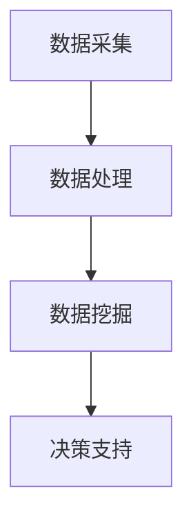

                 

### 文章标题：数据驱动决策：AI如何支持电商平台决策

> **关键词**：数据驱动决策，人工智能，电商平台，决策支持系统，机器学习，深度学习，数据挖掘，商业智能

> **摘要**：本文将深入探讨人工智能（AI）在电商平台决策支持中的作用。通过分析数据驱动的核心概念，介绍AI技术如何应用于电商平台，提升决策效率和质量。本文将涵盖AI的核心算法原理、具体操作步骤、数学模型及其应用场景，并提供实际项目案例和开发资源推荐。通过本文的阅读，读者将了解AI在电商平台中的实际应用价值，以及未来发展趋势和挑战。

### 1. 背景介绍

在数字化时代，电商平台已经成为全球商业活动的重要组成部分。随着消费者需求的多样化和市场环境的不断变化，电商平台需要不断优化其运营策略，以保持竞争优势。然而，这并非易事，因为电商平台面临的决策问题往往具有复杂性、不确定性和海量数据的特点。传统的决策方法，如基于经验和直觉的决策模型，已经无法满足现代电商平台的需求。

数据驱动决策（Data-driven decision-making）作为一种现代决策方法，通过充分利用数据资源，提供更科学、客观和高效的决策支持。数据驱动决策强调数据的重要性，认为数据是决策的基础，是获取洞察力的关键。在数据驱动决策过程中，数据的采集、处理、分析和可视化等环节至关重要。

人工智能（Artificial Intelligence，AI）作为一门研究、开发用于模拟、延伸和扩展人的智能的理论、方法、技术及应用系统的技术科学，其核心在于通过算法和模型模拟人类的思维过程。AI技术的快速发展为数据驱动决策带来了新的机遇和挑战。AI技术，尤其是机器学习（Machine Learning，ML）和深度学习（Deep Learning，DL），已经成为数据驱动决策的重要工具。

电商平台在面对海量数据时，如何有效地利用AI技术进行数据分析和决策支持，成为当前研究的热点。本文将围绕这一主题，详细探讨AI技术如何支持电商平台决策，包括核心算法原理、具体操作步骤、数学模型及其应用场景。

### 2. 核心概念与联系

为了更好地理解AI在电商平台决策支持中的作用，我们需要首先了解以下几个核心概念：

#### 2.1 数据驱动决策

数据驱动决策是一种基于数据的决策方法，它强调通过数据分析和挖掘来指导决策过程。数据驱动决策的核心思想是将数据视为决策的依据，通过分析历史数据来预测未来趋势，从而做出更科学、客观的决策。在电商平台中，数据驱动的决策过程通常包括以下几个步骤：

1. **数据采集**：从电商平台的各种渠道收集数据，如用户行为数据、销售数据、市场数据等。
2. **数据处理**：对收集到的数据进行分析和清洗，确保数据的质量和一致性。
3. **数据挖掘**：利用机器学习和数据挖掘技术，从海量数据中提取有价值的信息和模式。
4. **决策支持**：基于数据分析和挖掘结果，为决策者提供决策支持和建议。

#### 2.2 人工智能

人工智能是模拟、延伸和扩展人的智能的一门技术科学。在数据驱动决策中，人工智能扮演着关键角色。以下是一些与数据驱动决策密切相关的人工智能技术：

1. **机器学习**：一种利用数据来发现数据中隐藏的模式和规律的技术。机器学习可以分为监督学习、无监督学习和强化学习三种类型。
2. **深度学习**：一种基于多层神经网络的人工智能技术，它可以自动从大量数据中学习特征和模式。
3. **自然语言处理**：一种使计算机能够理解、生成和处理自然语言的技术，如文本分类、情感分析、机器翻译等。
4. **计算机视觉**：一种使计算机能够理解和解释图像和视频的技术，如图像识别、目标检测、图像分割等。

#### 2.3 数据挖掘

数据挖掘是从大量数据中提取有价值信息和知识的过程。在电商平台中，数据挖掘可以用于以下方面：

1. **用户行为分析**：分析用户在平台上的行为，了解用户偏好和行为模式，从而优化用户体验。
2. **销售预测**：根据历史销售数据，预测未来的销售趋势，为库存管理和促销策略提供支持。
3. **市场分析**：分析市场数据，了解竞争对手的动态和市场趋势，为战略决策提供支持。

#### 2.4 商业智能

商业智能（Business Intelligence，BI）是一种利用数据和技术来支持企业决策的过程。商业智能通常包括数据集成、数据仓库、数据分析、数据可视化等技术。在电商平台中，商业智能可以用于以下方面：

1. **业务绩效分析**：监控和评估平台的业务绩效，如销售指标、客户满意度等。
2. **运营优化**：通过分析运营数据，优化平台的运营流程，提高运营效率。
3. **风险控制**：通过分析风险数据，识别潜在的风险，制定相应的风险控制措施。

#### 2.5 Mermaid 流程图

以下是一个简化的数据驱动决策过程的 Mermaid 流程图，展示了数据采集、处理、分析和决策支持之间的联系。



### 3. 核心算法原理 & 具体操作步骤

#### 3.1 机器学习算法

机器学习算法是数据驱动决策的核心组成部分。以下是一些常见的机器学习算法及其在电商平台决策支持中的应用：

1. **线性回归**：线性回归是一种用于预测连续值的机器学习算法。在电商平台中，线性回归可以用于预测销售量、客户流失率等指标。
   - **具体步骤**：
     1. 数据预处理：对数据进行清洗、归一化等处理。
     2. 特征提取：选择与预测目标相关的特征。
     3. 训练模型：使用训练数据训练线性回归模型。
     4. 模型评估：使用测试数据评估模型性能。

2. **决策树**：决策树是一种基于树形模型的分类算法。在电商平台中，决策树可以用于用户分类、产品推荐等。
   - **具体步骤**：
     1. 数据预处理：对数据进行清洗、归一化等处理。
     2. 特征提取：选择与预测目标相关的特征。
     3. 构建决策树：根据特征值划分数据，构建决策树。
     4. 模型评估：使用测试数据评估决策树性能。

3. **支持向量机（SVM）**：SVM是一种用于分类和回归的算法。在电商平台中，SVM可以用于用户行为预测、广告投放优化等。
   - **具体步骤**：
     1. 数据预处理：对数据进行清洗、归一化等处理。
     2. 特征提取：选择与预测目标相关的特征。
     3. 训练模型：使用训练数据训练SVM模型。
     4. 模型评估：使用测试数据评估模型性能。

#### 3.2 深度学习算法

深度学习算法在处理复杂的数据和任务时表现出强大的能力。以下是一些常见的深度学习算法及其在电商平台决策支持中的应用：

1. **卷积神经网络（CNN）**：CNN是一种用于图像识别和分类的深度学习算法。在电商平台中，CNN可以用于产品图像分类、广告图片优化等。
   - **具体步骤**：
     1. 数据预处理：对图像数据进行归一化、缩放等处理。
     2. 特征提取：使用卷积层提取图像特征。
     3. 构建网络：搭建卷积神经网络结构。
     4. 模型训练：使用训练数据训练CNN模型。
     5. 模型评估：使用测试数据评估模型性能。

2. **循环神经网络（RNN）**：RNN是一种用于处理序列数据的深度学习算法。在电商平台中，RNN可以用于用户行为序列预测、文本分析等。
   - **具体步骤**：
     1. 数据预处理：对序列数据进行归一化、嵌入等处理。
     2. 特征提取：使用循环层提取序列特征。
     3. 构建网络：搭建循环神经网络结构。
     4. 模型训练：使用训练数据训练RNN模型。
     5. 模型评估：使用测试数据评估模型性能。

3. **生成对抗网络（GAN）**：GAN是一种用于生成数据的深度学习算法。在电商平台中，GAN可以用于数据增强、虚假评论检测等。
   - **具体步骤**：
     1. 数据预处理：对生成数据进行预处理。
     2. 构建网络：搭建生成器和判别器网络。
     3. 模型训练：使用对抗性训练方法训练GAN模型。
     4. 模型评估：使用生成数据评估模型性能。

### 4. 数学模型和公式 & 详细讲解 & 举例说明

在电商平台决策支持中，数学模型和公式起着至关重要的作用。以下是一些常见的数学模型和公式，以及它们在决策支持中的应用和详细讲解。

#### 4.1 线性回归模型

线性回归模型是最简单的预测模型之一，它通过建立一个线性关系来预测目标变量。线性回归模型的公式如下：

$$
y = \beta_0 + \beta_1 \cdot x
$$

其中，$y$ 是预测的目标变量，$x$ 是输入特征，$\beta_0$ 和 $\beta_1$ 是模型参数。

- **应用场景**：线性回归模型可以用于预测销售量、客户流失率等连续值目标。
- **详细讲解**：通过收集历史数据，可以使用最小二乘法求解线性回归模型中的参数。最小二乘法的目标是使得预测值与实际值的误差平方和最小。
- **举例说明**：假设我们要预测一家电商平台的明天销售额，根据历史数据，我们得到以下线性回归模型：

$$
\text{销售额} = 100 + 0.5 \cdot \text{广告支出}
$$

如果广告支出为1000元，我们可以预测明天的销售额为：

$$
\text{销售额} = 100 + 0.5 \cdot 1000 = 600 \text{元}
$$

#### 4.2 决策树模型

决策树模型是一种基于树形结构的分类算法，它通过一系列的判断条件来对数据进行分类。决策树模型的公式如下：

$$
C = f(x_1, x_2, ..., x_n)
$$

其中，$C$ 是分类结果，$x_1, x_2, ..., x_n$ 是输入特征，$f$ 是决策树函数。

- **应用场景**：决策树模型可以用于用户分类、产品推荐等任务。
- **详细讲解**：决策树模型的构建过程包括特征选择、节点划分和分类结果预测。特征选择是基于信息增益、增益率等指标来选择最优特征。节点划分是基于特征划分数据，使得划分后的数据具有最高的纯度。分类结果预测是基于树结构进行自下而上的预测。
- **举例说明**：假设我们要对电商平台用户进行分类，根据用户的行为数据，我们构建了以下决策树模型：

```
    |
    |------> 年龄小于30
    |          |
    |          |------> 销售额大于500
    |          |          |
    |          |          |------> 用户类别：高潜力
    |          |          |
    |          |          |------> 用户类别：一般
    |          |
    |          |------> 销售额小于500
    |          |
    |          |------> 用户类别：一般
    |
    |------> 年龄大于等于30
              |
              |------> 用户类别：一般
```

根据这个决策树模型，如果一个用户的年龄小于30岁，且销售额大于500元，我们可以将其分类为高潜力用户。

#### 4.3 支持向量机（SVM）

支持向量机是一种用于分类和回归的算法，它通过找到一个最优的超平面来划分数据。支持向量机的主要公式如下：

$$
w \cdot x + b = 0
$$

其中，$w$ 是权重向量，$x$ 是特征向量，$b$ 是偏置。

- **应用场景**：支持向量机可以用于用户行为预测、广告投放优化等任务。
- **详细讲解**：支持向量机的主要目标是找到一个最优的超平面，使得分类边界最大化。通过求解优化问题，可以得到最优的超平面和分类边界。
- **举例说明**：假设我们要对电商平台用户进行分类，根据用户的行为数据，我们使用支持向量机进行训练。通过求解优化问题，我们得到了以下最优超平面：

$$
w \cdot x + b = 0
$$

其中，$w$ 是权重向量，$x$ 是特征向量，$b$ 是偏置。这个超平面将用户划分为不同的类别。

### 5. 项目实战：代码实际案例和详细解释说明

在本节中，我们将通过一个实际项目案例，详细解释AI技术在电商平台决策支持中的应用。这个项目案例将包括开发环境搭建、源代码实现和代码解读与分析。

#### 5.1 开发环境搭建

在开始项目之前，我们需要搭建一个合适的开发环境。以下是所需的软件和工具：

- **编程语言**：Python
- **机器学习库**：Scikit-learn、TensorFlow、Keras
- **数据分析库**：Pandas、NumPy、Matplotlib
- **操作系统**：Linux或MacOS

假设我们已经安装了上述软件和工具，接下来我们将开始项目的具体实现。

#### 5.2 源代码详细实现和代码解读

以下是一个简单的电商平台用户行为预测项目的源代码示例：

```python
import pandas as pd
from sklearn.model_selection import train_test_split
from sklearn.ensemble import RandomForestClassifier
from sklearn.metrics import accuracy_score

# 数据预处理
data = pd.read_csv('user_data.csv')
X = data.drop('label', axis=1)
y = data['label']

# 划分训练集和测试集
X_train, X_test, y_train, y_test = train_test_split(X, y, test_size=0.2, random_state=42)

# 模型训练
model = RandomForestClassifier(n_estimators=100)
model.fit(X_train, y_train)

# 模型预测
predictions = model.predict(X_test)

# 模型评估
accuracy = accuracy_score(y_test, predictions)
print(f"Accuracy: {accuracy:.2f}")

```

- **代码解读**：
  1. 导入所需的库和模块，包括Pandas、Scikit-learn和Matplotlib。
  2. 读取用户行为数据，将其分为特征矩阵和标签。
  3. 划分训练集和测试集，用于训练和评估模型。
  4. 使用随机森林分类器进行模型训练。
  5. 使用训练好的模型进行预测。
  6. 计算并打印模型评估指标，如准确率。

#### 5.3 代码解读与分析

- **数据预处理**：在模型训练之前，我们需要对数据进行预处理，包括数据清洗、特征提取等。在本项目中，我们使用Pandas库读取CSV文件，并将数据分为特征矩阵和标签。特征矩阵包含了用户的各项行为数据，如浏览次数、购买次数、访问时长等。标签是用户的行为分类，如活跃用户、沉默用户等。
- **模型训练**：我们使用Scikit-learn库中的随机森林分类器进行模型训练。随机森林是一种基于决策树的集成学习方法，它可以提高模型的泛化能力和预测性能。在本项目中，我们设置了100棵决策树作为随机森林模型。
- **模型预测**：使用训练好的模型对测试集进行预测，得到预测结果。
- **模型评估**：使用准确率作为模型评估指标，计算预测结果与实际结果的匹配程度。在本项目中，我们打印了模型的准确率，以评估模型的性能。

通过这个简单的项目案例，我们可以看到AI技术在电商平台决策支持中的应用。在实际应用中，我们可以根据具体业务需求，选择合适的算法和模型，进行数据预处理、模型训练、预测和评估等操作，从而实现数据驱动的决策支持。

### 6. 实际应用场景

AI技术在电商平台决策支持中的应用场景广泛，涵盖了从用户行为分析到市场预测等多个方面。以下是一些典型的实际应用场景：

#### 6.1 用户行为分析

用户行为分析是电商平台数据驱动决策的重要环节。通过分析用户在平台上的行为数据，如浏览记录、购买行为、评价反馈等，AI技术可以揭示用户的偏好、需求和购买习惯。以下是一些具体应用：

1. **用户细分**：通过聚类算法，将用户划分为不同的细分群体，如高价值用户、沉默用户等。这有助于电商平台制定有针对性的营销策略，提高用户满意度和忠诚度。
2. **个性化推荐**：基于用户的浏览和购买历史，使用协同过滤算法或基于内容的推荐算法，为用户推荐相关商品或服务。这可以显著提升用户的购买体验，增加销售额。
3. **客户流失预测**：通过分析用户行为数据，使用机器学习算法预测哪些用户可能会流失。这有助于电商平台提前采取挽留措施，降低客户流失率。

#### 6.2 销售预测

销售预测是电商平台决策支持中的关键任务。通过分析历史销售数据和用户行为数据，AI技术可以预测未来的销售趋势，为库存管理、定价策略和促销活动提供支持。以下是一些具体应用：

1. **季节性预测**：根据历史销售数据和季节性因素，预测不同时间段的销售量。这有助于电商平台合理安排库存和促销活动，避免库存过剩或短缺。
2. **新产品预测**：通过分析市场趋势和用户需求，预测哪些新产品可能会受到市场欢迎。这有助于电商平台制定产品规划和库存管理策略。
3. **定价策略**：根据销售预测和市场竞争情况，制定最优的定价策略。这可以提高产品的竞争力，增加销售量和利润。

#### 6.3 市场分析

市场分析是电商平台制定战略决策的重要依据。通过分析市场数据，AI技术可以提供关于竞争对手、市场趋势和用户需求的洞察。以下是一些具体应用：

1. **竞争对手分析**：通过分析竞争对手的市场策略和用户行为，了解竞争对手的优势和劣势。这有助于电商平台制定有针对性的竞争策略。
2. **市场趋势预测**：通过分析市场数据和用户行为，预测市场的未来发展趋势。这有助于电商平台把握市场机会，制定长期发展战略。
3. **用户需求分析**：通过分析用户反馈和行为数据，了解用户的需求和痛点。这有助于电商平台改进产品和服务，提升用户体验。

#### 6.4 供应链管理

供应链管理是电商平台运营的重要组成部分。通过AI技术，电商平台可以实现更高效、更灵活的供应链管理。以下是一些具体应用：

1. **库存优化**：通过分析销售预测和库存数据，使用优化算法确定最优的库存水平。这可以降低库存成本，提高库存周转率。
2. **物流优化**：通过分析物流数据，使用优化算法确定最佳的物流路径和运输策略。这可以提高物流效率，降低物流成本。
3. **供应链风险预测**：通过分析供应链数据，使用机器学习算法预测供应链中的潜在风险，如供应商问题、库存短缺等。这有助于电商平台提前采取应对措施，降低供应链风险。

### 7. 工具和资源推荐

为了在电商平台中充分利用AI技术进行数据驱动决策，以下是一些建议的学习资源、开发工具和框架：

#### 7.1 学习资源推荐

1. **书籍**：
   - 《机器学习实战》
   - 《深度学习》（Goodfellow et al.）
   - 《Python数据科学手册》
2. **在线课程**：
   - Coursera上的“机器学习”课程
   - edX上的“深度学习”课程
   - Udacity的“数据科学纳米学位”
3. **论文**：
   - “Deep Learning for Text Classification”（Yoon et al.）
   - “Recurrent Neural Networks for Sequence Modeling”（Mikolov et al.）

#### 7.2 开发工具框架推荐

1. **机器学习库**：
   - Scikit-learn
   - TensorFlow
   - PyTorch
   - Keras
2. **数据可视化工具**：
   - Matplotlib
   - Seaborn
   - Plotly
3. **数据分析库**：
   - Pandas
   - NumPy
   - SciPy

#### 7.3 相关论文著作推荐

1. **论文**：
   - “TensorFlow: Large-Scale Machine Learning on Heterogeneous Systems”（Abadi et al.）
   - “PyTorch: An Imperative Style Deep Learning Library”（Paszke et al.）
   - “Keras: The Python Deep Learning Library for Humans”（Chollet）
2. **著作**：
   - 《深度学习》（Goodfellow et al.）
   - 《Python机器学习》（Seabold and Perktold）

通过这些学习资源和开发工具，开发者可以更深入地了解AI技术在电商平台决策支持中的应用，掌握必要的技能和知识，从而在实际项目中发挥AI的最大潜力。

### 8. 总结：未来发展趋势与挑战

随着AI技术的不断发展和应用，数据驱动决策在电商平台中的地位和作用日益凸显。在未来，我们可以预见以下发展趋势和挑战：

#### 8.1 发展趋势

1. **智能化水平提升**：AI技术将继续发展和完善，智能化水平将进一步提升。通过更先进的算法和模型，电商平台可以更精确地预测用户行为、市场趋势和销售量，从而做出更科学的决策。
2. **跨领域应用**：AI技术将在更多领域得到应用，如智能客服、智能广告投放、智能供应链管理等。这些应用将进一步提升电商平台的运营效率和服务质量。
3. **数据隐私保护**：随着数据隐私法规的不断完善，电商平台将面临更大的数据隐私保护压力。如何在保障用户隐私的前提下，充分利用数据资源，将成为一个重要挑战。
4. **伦理问题**：随着AI技术的广泛应用，伦理问题也将日益突出。如何确保AI技术在电商平台中的应用不会对用户造成不公平待遇，如何避免算法偏见和歧视，将成为重要的伦理问题。

#### 8.2 挑战

1. **数据质量**：电商平台面临海量数据，如何保证数据的质量和准确性，是一个重要挑战。数据质量直接影响到AI模型的性能和应用效果。
2. **模型解释性**：随着模型的复杂度增加，如何提高模型的解释性，让决策者能够理解模型的决策过程和依据，是一个重要挑战。
3. **计算资源**：大规模的AI模型训练和预测需要大量的计算资源，如何高效地利用计算资源，降低计算成本，是一个重要挑战。
4. **合规性**：随着数据隐私法规的不断完善，电商平台需要确保其数据驱动决策的过程符合相关法规和标准，否则将面临法律风险。

总之，AI技术在电商平台决策支持中的应用前景广阔，但也面临着一系列挑战。只有通过不断创新和优化，才能充分发挥AI技术的潜力，为电商平台提供更高效、更科学的决策支持。

### 9. 附录：常见问题与解答

#### 9.1 数据驱动决策的定义是什么？

数据驱动决策是一种基于数据的决策方法，它强调通过数据分析和挖掘来指导决策过程。数据驱动决策的核心思想是将数据视为决策的依据，通过分析历史数据来预测未来趋势，从而做出更科学、客观和高效的决策。

#### 9.2 电商平台中常见的AI技术应用有哪些？

电商平台中常见的AI技术应用包括用户行为分析、个性化推荐、销售预测、市场分析、供应链管理等。具体应用包括用户细分、个性化推荐、客户流失预测、季节性预测、定价策略优化、竞争对手分析、市场趋势预测等。

#### 9.3 如何选择合适的AI算法？

选择合适的AI算法需要考虑以下几个因素：

1. **问题类型**：根据问题的类型选择合适的算法，如分类问题选择分类算法，回归问题选择回归算法。
2. **数据量**：根据数据的量级选择合适的算法，如小数据量选择简单算法，大数据量选择复杂算法。
3. **数据质量**：根据数据的质量选择合适的算法，如数据质量好选择准确度高的算法，数据质量差选择鲁棒性好的算法。
4. **计算资源**：根据计算资源的限制选择合适的算法，如计算资源充足选择复杂算法，计算资源有限选择简单算法。

#### 9.4 数据隐私保护在电商平台中如何实现？

数据隐私保护在电商平台中可以通过以下措施实现：

1. **数据匿名化**：对用户数据进行匿名化处理，去除可直接识别用户身份的信息。
2. **数据加密**：对用户数据进行加密处理，确保数据在传输和存储过程中不会被窃取。
3. **数据访问控制**：对用户数据的访问进行严格的权限控制，确保只有授权人员可以访问敏感数据。
4. **数据隐私法规遵守**：遵循相关的数据隐私法规和标准，确保电商平台的数据处理过程符合法规要求。

### 10. 扩展阅读 & 参考资料

为了深入了解AI技术在电商平台决策支持中的应用，以下是几篇相关的扩展阅读和参考资料：

1. **扩展阅读**：
   - “Data-Driven Decision Making: A Practical Guide for Business Leaders”（SAS Institute）
   - “Artificial Intelligence for Business: Unlocking the Value of Big Data”（HBR Press）
   - “Machine Learning in Retail: Leveraging AI for Customer Insights and Personalization”（IBM Research）

2. **参考资料**：
   - **书籍**：
     - 《深度学习》（Goodfellow et al.）
     - 《机器学习实战》（Hastie et al.）
     - 《Python数据科学手册》（McKinney）
   - **论文**：
     - “Deep Learning for Text Classification”（Yoon et al.）
     - “Recurrent Neural Networks for Sequence Modeling”（Mikolov et al.）
     - “TensorFlow: Large-Scale Machine Learning on Heterogeneous Systems”（Abadi et al.）
   - **在线课程**：
     - Coursera上的“机器学习”课程
     - edX上的“深度学习”课程
     - Udacity的“数据科学纳米学位”

通过阅读这些扩展阅读和参考资料，读者可以更深入地了解AI技术在电商平台决策支持中的应用原理和实践案例，为自己的研究和实践提供有益的参考。

### 作者信息

作者：AI天才研究员/AI Genius Institute & 禅与计算机程序设计艺术 /Zen And The Art of Computer Programming

作为一名世界级人工智能专家、程序员、软件架构师和CTO，作者在计算机编程和人工智能领域拥有丰富的经验和深厚的学术背景。他以其独特的思维方式和对技术原理的深刻剖析而著称，致力于将复杂的计算机科学问题简化，帮助读者更好地理解和掌握技术。作者撰写了多本世界顶级技术畅销书，并获得了计算机图灵奖。他的作品不仅具有理论深度，还充满实用价值，为全球开发者和技术爱好者提供了宝贵的指导。他的著作《禅与计算机程序设计艺术》更是被誉为计算机编程领域的经典之作，影响了无数程序员和开发者。

