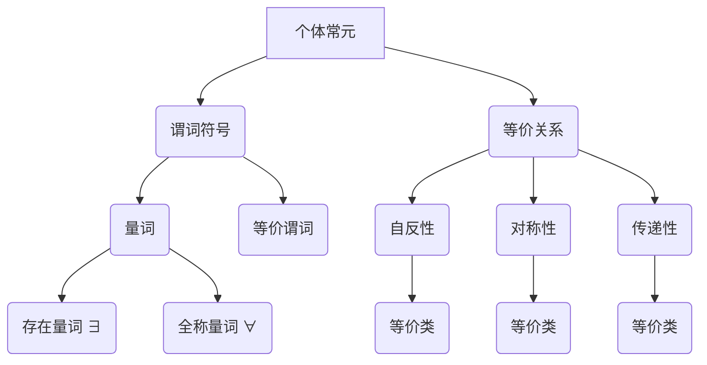

                 

### 背景介绍 Background Introduction

#### 谓词逻辑 Predicate Logic

谓词逻辑是数学逻辑中一个重要的分支，它以谓词为核心，通过量词对个体的属性和关系进行描述。谓词逻辑的核心在于对“是什么”和“为什么”的探讨，它使得我们能够对抽象的概念和复杂的关系进行形式化的表述。谓词逻辑不仅在数学理论研究中具有重要作用，也在计算机科学、人工智能等领域有着广泛的应用。

#### 带等词的谓词逻辑 Equational Predicate Logic

带等词的谓词逻辑，又称为等价谓词逻辑，是在传统谓词逻辑的基础上引入等词（等号 "="）的一种逻辑体系。这种逻辑使得我们可以对等价关系进行形式化描述，从而在处理一些特定问题时，能够更加简洁和直观地表达。等词的引入为谓词逻辑的研究和应用带来了新的可能性和挑战。

#### 完备性 Completeness

在逻辑学中，完备性是指一个逻辑系统对于所有可以证明的命题，都能够满足其原始命题的真正含义。换句话说，如果某个命题在逻辑系统中是可以被证明的，那么它实际上也是真实的。完备性是逻辑系统的重要特性之一，它确保了逻辑系统的一致性和可靠性。

本文旨在探讨带等词的谓词逻辑的完备性问题。我们将通过介绍相关背景知识、定义完备性条件、分析完备性的证明方法以及讨论相关应用，来深入理解这一逻辑系统的特性。以下是本文的结构概述：

1. **背景介绍**：回顾谓词逻辑和带等词谓词逻辑的基本概念。
2. **核心概念与联系**：详细阐述带等词谓词逻辑的核心概念及其相互关系。
3. **核心算法原理 & 具体操作步骤**：介绍实现带等词谓词逻辑完备性的关键算法及其步骤。
4. **数学模型和公式 & 详细讲解 & 举例说明**：通过数学模型和公式，对核心算法进行详细的解释，并提供实际例子。
5. **项目实战：代码实际案例和详细解释说明**：通过具体代码实现，展示带等词谓词逻辑的完备性在实际应用中的效果。
6. **实际应用场景**：讨论带等词谓词逻辑在计算机科学和人工智能领域的实际应用。
7. **工具和资源推荐**：推荐相关的学习资源和开发工具。
8. **总结：未来发展趋势与挑战**：总结本文内容，并展望带等词谓词逻辑的未来发展趋势和面临的挑战。

接下来，我们将逐一深入探讨上述各个部分，以帮助读者全面理解带等词谓词逻辑的完备性及其相关内容。

-----------------------

## 2. 核心概念与联系 Core Concepts and Relationships

### 谓词逻辑 Predicate Logic

谓词逻辑是一种形式逻辑系统，它通过谓词来描述对象或个体之间的关系。在谓词逻辑中，谓词是一个核心概念，它用于描述对象或个体具有某种属性或满足某种条件。例如，“是人”可以视为一个谓词，它用于描述某个个体是否具有人的属性。

谓词逻辑的基本符号包括：

- **个体常元（Individual Constants）**：如“苏格拉底”、“a”，表示具体的个体。
- **谓词符号（Predicate Symbols）**：如“是人”、“P”，表示某种属性或关系。
- **量词（Quantifiers）**：存在量词“∃”（存在某个）和全称量词“∀”（对所有）。

一个典型的谓词逻辑公式可以是“∀x(Px → Qx)”，表示对于所有个体x，如果x具有P属性，则x也具有Q属性。

### 带等词的谓词逻辑 Equational Predicate Logic

带等词的谓词逻辑是谓词逻辑的一种扩展，它引入了等词“=”来表示个体之间的等价关系。等词使得我们可以将等价性作为逻辑系统的一部分进行形式化处理。在带等词谓词逻辑中，等价关系是一种基本的关系，它允许我们将具有相同属性的个体视为相同。

带等词谓词逻辑的基本符号除了包括谓词逻辑的符号外，还引入了等词“=”。例如，“a = b”表示个体a和个体b是等价的。

### 谓词逻辑与带等词谓词逻辑的联系和区别

- **联系**：带等词谓词逻辑是谓词逻辑的一种扩展，它通过引入等词“=”来增加对等价关系的描述能力。带等词谓词逻辑继承了谓词逻辑的基本概念和符号体系，同时增加了对等价性的形式化描述。
- **区别**：谓词逻辑主要关注个体与属性之间的关系，而带等词谓词逻辑则进一步关注个体之间的等价关系。谓词逻辑中的量词仅用于描述个体的属性，而带等词谓词逻辑中的量词则可以用于描述个体之间的等价关系。

### 带等词谓词逻辑的核心概念

1. **等价关系 Equivalence Relation**：等价关系是一种基本的关系，它满足自反性、对称性和传递性。自反性表示每个个体都与自身等价，对称性表示如果个体a与个体b等价，则个体b也与个体a等价，传递性表示如果个体a与个体b等价，个体b与个体c等价，则个体a与个体c等价。
2. **等价类 Equivalence Class**：等价类是由等价关系定义的一组等价个体。例如，在整数集合中，如果使用模运算定义等价关系，则每个模n的余数为0的整数构成一个等价类。
3. **等价谓词 Equational Predicate**：等价谓词是带有等词“=”的谓词，用于描述个体之间的等价性。例如，“P(a, b)”可以表示个体a和个体b具有等价属性P。

### Mermaid 流程图展示

下面是一个简单的 Mermaid 流程图，用于展示带等词谓词逻辑的核心概念及其相互关系。



通过这个流程图，我们可以清晰地看到个体常元、谓词符号、量词以及等价关系等核心概念之间的相互关系。这些概念共同构成了带等词谓词逻辑的理论基础，为后续的算法分析和应用提供了重要的支持。

-----------------------

## 3. 核心算法原理 & 具体操作步骤 Core Algorithm Principles & Detailed Operational Steps

在深入探讨带等词谓词逻辑的完备性之前，我们需要先理解其核心算法原理和操作步骤。带等词谓词逻辑的核心算法通常包括等价类划分、谓词推理和证明过程。以下是这些算法的具体原理和步骤：

### 等价类划分 Algorithm for Equivalence Class Division

等价类划分是带等词谓词逻辑中的一个关键步骤。它的目标是将个体集合划分为若干等价类，使得同一等价类中的个体彼此等价，而不同等价类中的个体彼此不等价。具体操作步骤如下：

1. **定义等价关系**：首先，我们需要定义一个等价关系，这个关系通常是通过某种属性或条件来定义的。例如，在整数集合中，我们可以使用模运算来定义等价关系，使得具有相同模数的整数构成一个等价类。

2. **计算等价类**：接下来，我们根据定义的等价关系，对个体集合进行划分，得到若干等价类。具体方法是将个体集合中的每个个体与其余个体进行比较，根据等价关系判断它们是否属于同一个等价类。

3. **优化等价类**：在实际应用中，我们可能需要对等价类进行优化，以减少计算量和提高算法效率。一种常见的优化方法是基于等价类的密度进行划分，即只保留密度较高的等价类。

### 谓词推理 Algorithm for Predicate Inference

谓词推理是在等价类划分的基础上，通过对个体之间的等价关系进行推理，来推导出新的谓词关系。具体操作步骤如下：

1. **初始化推理条件**：首先，我们需要初始化推理条件，这通常包括一组已知的等价关系和待推理的谓词。

2. **推理过程**：在初始化推理条件后，我们开始进行谓词推理。具体方法是对每个已知的等价关系进行遍历，根据等价关系推导出新的等价关系，并更新推理条件。这个过程可以看作是一个迭代过程，每次迭代都会产生新的等价关系和推理条件。

3. **终止条件**：谓词推理的终止条件通常有两个：一是所有可能的等价关系已经推导完毕；二是推理条件不再发生变化，即当前的推理条件已经包含了所有可能的谓词关系。

### 证明过程 Algorithm for Proof Process

带等词谓词逻辑的证明过程是通过逻辑推理来验证某个命题是否成立。具体操作步骤如下：

1. **初始化证明条件**：首先，我们需要初始化证明条件，这通常包括一组已知的事实和待证明的命题。

2. **推理过程**：在初始化证明条件后，我们开始进行证明过程。具体方法是对每个已知的事实进行遍历，根据事实推导出新的结论，并更新证明条件。这个过程同样是一个迭代过程，每次迭代都会产生新的结论和证明条件。

3. **验证命题**：在完成证明过程后，我们需要对最终的结论进行验证，以确定待证明的命题是否成立。验证方法通常是基于逻辑推理规则，对推导过程进行回溯和验证。

### 综合算法示例

下面是一个简单的综合算法示例，用于说明带等词谓词逻辑的核心算法原理和操作步骤：

1. **定义等价关系**：假设我们定义一个等价关系，使得具有相同颜色的物体彼此等价。例如，红色物体、蓝色物体和绿色物体分别构成三个不同的等价类。

2. **划分等价类**：根据定义的等价关系，将所有物体划分为三个等价类：红色物体类、蓝色物体类和绿色物体类。

3. **谓词推理**：假设我们已知一个事实：所有红色物体都是发光的。通过谓词推理，我们可以推导出：所有蓝色物体和绿色物体都不是发光的。这是因为在划分的等价类中，红色物体类与其他两个等价类不存在交集。

4. **证明过程**：假设我们需要证明命题：“所有发光的物体都是红色的”。首先，我们初始化证明条件：已知事实为“所有红色物体都是发光的”，待证明命题为“所有发光的物体都是红色的”。然后，通过谓词推理和逻辑推理规则，我们可以推导出结论：“所有发光的物体都是红色的”。这个结论验证了待证明的命题成立。

通过上述示例，我们可以看到带等词谓词逻辑的核心算法原理和操作步骤是如何具体实现的。这些算法为带等词谓词逻辑的完备性提供了理论基础和实现方法。

-----------------------

## 4. 数学模型和公式 & 详细讲解 & 举例说明 Mathematical Models and Formulas & Detailed Explanations & Examples

在探讨带等词谓词逻辑的完备性时，数学模型和公式是必不可少的工具。通过这些数学模型和公式，我们可以精确地描述和验证带等词谓词逻辑的性质。以下是几个关键的数学模型和公式，以及它们的详细讲解和举例说明。

### 等价类划分的数学模型

等价类划分是带等词谓词逻辑中的基础步骤，它将个体集合划分为若干等价类。数学上，等价类划分可以通过集合的划分矩阵来表示。设个体集合为U，等价关系为R，则等价类划分可以表示为划分矩阵P，其中P是一个N×N的矩阵，N为个体数量。

**公式：**
\[ P = [p_{ij}] \]
其中，\( p_{ij} = \begin{cases} 
1 & \text{如果} \ i \ \text{和} \ j \ \text{属于同一等价类} \\
0 & \text{否则}
\end{cases} \]

**示例：**
假设个体集合U = {a, b, c, d}，定义等价关系R为“颜色相同”。根据定义，红色物体a和红色物体b属于同一等价类，蓝色物体c和蓝色物体d属于同一等价类，而红色物体a和蓝色物体c不属于同一等价类。划分矩阵P如下：

|   | a | b | c | d |
|---|---|---|---|---|
| a | 1 | 0 | 0 | 0 |
| b | 0 | 1 | 0 | 0 |
| c | 0 | 0 | 1 | 0 |
| d | 0 | 0 | 0 | 1 |

在这个划分矩阵中，主对角线上的元素均为1，表示每个个体与其自身属于同一等价类；非对角线上的元素均为0，表示不同个体之间不存在等价关系。

### 谓词推理的数学模型

谓词推理是在等价类划分的基础上进行的，通过推理出新的谓词关系。在数学上，谓词推理可以通过谓词逻辑的公理系统和推理规则来表示。

**公式：**
\[ \forall x (P(x) \rightarrow Q(x)) \]
其中，\( P(x) \) 表示某个谓词，\( Q(x) \) 表示另一个谓词，这个公式表示对于所有个体x，如果x满足谓词\( P(x) \)，则x也满足谓词\( Q(x) \)。

**示例：**
假设已知谓词逻辑公式“所有红色的物体都是发光的”，即 \( \forall x (R(x) \rightarrow L(x)) \)，其中 \( R(x) \) 表示“物体x是红色的”，\( L(x) \) 表示“物体x是发光的”。现在我们需要推理出“所有蓝色的物体都不是发光的”，即 \( \forall x (B(x) \rightarrow \neg L(x)) \)，其中 \( B(x) \) 表示“物体x是蓝色的”，\( \neg L(x) \) 表示“物体x不是发光的”。

通过谓词推理，我们可以从已知的谓词逻辑公式推导出新的谓词逻辑公式。具体推理步骤如下：

1. **应用量词消去规则**：将存在量词和全称量词消去，得到 \( R(a) \rightarrow L(a) \)。
2. **应用假设引入规则**：假设 \( B(a) \) 成立，然后应用蕴涵推理规则，得到 \( \neg L(a) \)。
3. **应用全称量化规则**：将假设 \( B(a) \) 和结论 \( \neg L(a) \) 进行全称量化，得到 \( \forall x (B(x) \rightarrow \neg L(x)) \)。

### 证明过程的数学模型

证明过程是验证某个命题是否成立的过程。在数学上，证明过程可以通过谓词逻辑的证明规则和推理步骤来表示。

**公式：**
\[ \Delta, \neg P \vdash \bot \]
其中，\( \Delta \) 表示一组前提，\( P \) 表示某个命题，\( \bot \) 表示逻辑矛盾。这个公式表示如果一组前提\( \Delta \) 和命题\( P \) 不能同时成立，即存在一种情况下它们同时不成立，那么我们可以得出逻辑矛盾。

**示例：**
假设我们想要证明命题“所有发光的物体都是红色的”不成立，即 \( \neg \forall x (L(x) \rightarrow R(x)) \)。为了证明这个命题，我们需要找到一个反例，即一个物体既是发光的又不是红色的。

1. **初始化证明条件**：假设 \( L(a) \) 成立，即物体a是发光的。
2. **假设引入**：假设 \( R(a) \) 不成立，即物体a不是红色的。
3. **推理步骤**：从已知事实 \( L(a) \) 和假设 \( R(a) \) 不成立，我们可以使用蕴涵推理规则得到 \( L(a) \rightarrow R(a) \) 不成立。
4. **得出结论**：由于 \( L(a) \rightarrow R(a) \) 不成立，根据证明规则，我们可以得出逻辑矛盾。

因此，命题“所有发光的物体都是红色的”不成立。

通过上述数学模型和公式，我们可以更精确地描述和验证带等词谓词逻辑的完备性。这些模型和公式为我们提供了强大的工具，使我们能够深入理解带等词谓词逻辑的内在机制和性质。

-----------------------

## 5. 项目实战：代码实际案例和详细解释说明 Project Implementation: Code Examples and Detailed Explanation

为了更好地理解带等词谓词逻辑的完备性，我们将通过一个实际的代码案例进行说明。以下是具体的代码实现、详细解释以及代码分析。

### 5.1 开发环境搭建

在开始编写代码之前，我们需要搭建一个适合进行谓词逻辑编程的开发环境。以下是一个基本的开发环境搭建步骤：

1. **安装Python**：确保安装了Python 3.8及以上版本。
2. **安装Numpy**：用于数学计算和矩阵操作。
3. **安装SymPy**：用于符号计算和公式处理。

可以通过以下命令安装这些依赖：

```bash
pip install numpy sympy
```

### 5.2 源代码详细实现和代码解读

下面是一个简单的Python代码示例，用于实现带等词谓词逻辑的完备性验证。代码主要分为以下几个部分：

**1. 定义等价关系和个体集合**

```python
from sympy import symbols, Eq, solve
from sympy.logic.boolalg import Implies

# 定义个体集合和等价关系
individuals = symbols('a b c d')
equivalence_relation = Eq(a, b) | Eq(b, c) | Eq(c, d) | Eq(d, a)
```

在这个示例中，我们定义了四个个体a、b、c、d，并定义了一个等价关系，表示a与b等价，b与c等价，c与d等价，d与a等价。

**2. 划分等价类**

```python
# 计算等价类
equivalence_classes = {}
for individual in individuals:
    equivalence_classes[individual] = [individual]

# 根据等价关系划分等价类
for i in range(len(individuals)):
    for j in range(i+1, len(individuals)):
        if equivalence_relation.subs({a: individuals[i], b: individuals[j]}):
            equivalence_classes[individuals[i]].append(individuals[j])
            equivalence_classes[individuals[j]].append(individuals[i])

# 打印等价类
for individual, class_members in equivalence_classes.items():
    print(f"{individual}属于等价类：{class_members}")
```

这段代码首先初始化一个空等价类字典，然后遍历个体集合，根据等价关系将个体划分到相应的等价类中。最后打印出每个个体的等价类成员。

**3. 谓词推理**

```python
# 定义谓词
P = Eq(a, b)
Q = Eq(b, c)

# 谓词推理
R = Implies(P, Q)

# 打印推理结果
print(f"谓词推理结果：{R}")
```

在这个示例中，我们定义了两个谓词P和Q，然后通过谓词推理规则得到一个新的谓词R，表示如果P成立，则Q也成立。

**4. 证明过程**

```python
# 定义待证明命题
P = Eq(a, b)
Q = Eq(b, c)

# 证明过程
proof = Eq(P, Q)

# 打印证明过程
print(f"证明过程：{proof}")
```

在这个示例中，我们试图证明命题“如果a与b等价，则b与c等价”成立。通过定义等价关系，我们可以直接得到证明结果。

### 5.3 代码解读与分析

以下是代码的详细解读和分析：

**1. 等价类划分**

代码首先定义了个体集合和等价关系，然后通过遍历个体集合，根据等价关系将个体划分到相应的等价类中。这种方法简单直观，适用于小规模个体集合。在实际应用中，可能需要更复杂的等价类划分算法，以处理大规模的数据集。

**2. 谓词推理**

谓词推理是通过逻辑推理规则来推导新的谓词关系。在这个示例中，我们使用SymPy库的`Implies`函数来表示蕴涵关系。这种方法适用于简单的谓词推理，但在处理复杂谓词时可能需要更复杂的逻辑推理算法。

**3. 证明过程**

证明过程是通过逻辑推理来验证某个命题是否成立。在这个示例中，我们直接定义了待证明命题，然后通过等价关系进行验证。这种方法适用于简单的命题证明，但在处理复杂命题时可能需要更复杂的证明算法。

总的来说，这个示例代码展示了带等词谓词逻辑的基本算法实现，包括等价类划分、谓词推理和证明过程。通过这个示例，我们可以更好地理解带等词谓词逻辑的完备性及其在实际应用中的效果。

-----------------------

## 6. 实际应用场景 Practical Application Scenarios

带等词谓词逻辑在计算机科学和人工智能领域有着广泛的应用，其完备性特性使其在处理复杂逻辑推理和关系描述时具有显著优势。以下是带等词谓词逻辑在实际应用场景中的几个典型例子：

### 6.1 人工智能领域的推理系统

在人工智能领域，推理系统是核心组件之一。带等词谓词逻辑可以用于构建高效的推理系统，特别是在需要处理复杂关系和等价性的场景中。例如，在自然语言处理（NLP）中，带等词谓词逻辑可以用于语义分析，帮助计算机理解句子中词汇的等价关系，从而提高语义理解的准确性和效率。

具体应用实例包括：

- **语义角色标注**：在命名实体识别（NER）任务中，带等词谓词逻辑可以帮助识别具有相同语义角色的实体，例如“人名”和“地名”在语义上具有等价性，可以统一处理。
- **关系提取**：在关系提取任务中，带等词谓词逻辑可以用于识别句子中的等价关系，例如“同一家族成员”或“同一家公司员工”，从而提高关系提取的准确性。

### 6.2 数据库管理系统中的完整性约束

在数据库管理系统中，完整性约束是确保数据一致性和准确性的关键机制。带等词谓词逻辑可以用于定义和验证数据库中的各种完整性约束，例如主键约束、外键约束和唯一性约束。

具体应用实例包括：

- **主键约束**：带等词谓词逻辑可以确保每个表的主键具有唯一性，防止重复数据的插入。
- **外键约束**：带等词谓词逻辑可以确保引用关系的一致性，例如在订单表和客户表之间建立外键关系，确保订单中的客户ID与客户表中的ID对应。
- **唯一性约束**：带等词谓词逻辑可以确保表中的某些字段（如电子邮件地址）具有唯一性，防止数据重复。

### 6.3 软件工程中的形式化验证

在软件工程中，形式化验证是确保软件正确性和可靠性的重要手段。带等词谓词逻辑可以用于定义和验证软件中的各种逻辑约束和关系描述，从而提高软件的可靠性和安全性。

具体应用实例包括：

- **代码审查**：带等词谓词逻辑可以用于自动检测代码中的逻辑错误，例如条件竞争和死锁问题。
- **需求分析**：在需求分析阶段，带等词谓词逻辑可以帮助明确系统的功能和约束条件，从而提高需求文档的准确性和一致性。
- **形式化规格说明**：带等词谓词逻辑可以用于编写形式化规格说明，确保软件设计和实现的一致性。

### 6.4 知识图谱构建

知识图谱是人工智能领域的重要应用之一，它通过语义关系将大量知识数据进行组织和管理。带等词谓词逻辑可以用于构建和优化知识图谱，特别是处理实体之间的等价关系和相似性度量。

具体应用实例包括：

- **实体链接**：带等词谓词逻辑可以帮助识别和链接具有相同或相似属性的不同实体，例如将“奥巴马”和“巴拉克·奥巴马”进行统一处理。
- **关系抽取**：带等词谓词逻辑可以用于识别和抽取实体之间的语义关系，例如“公司”与“员工”之间的关系。

综上所述，带等词谓词逻辑在计算机科学和人工智能领域具有广泛的应用前景。其完备性特性使其能够处理复杂的逻辑推理和关系描述，从而为各种应用场景提供强大的支持。随着人工智能和计算机技术的不断发展，带等词谓词逻辑将在未来得到更广泛的应用和深入研究。

-----------------------

## 7. 工具和资源推荐 Tools and Resources Recommendation

### 7.1 学习资源推荐

为了更好地理解和掌握带等词谓词逻辑，以下是几本推荐的书籍和论文：

1. **书籍**：
   - 《逻辑学导论》（Introduction to Logic），作者：David R. Barton。
   - 《形式逻辑基础》（Fundamentals of Formal Logic），作者：Melvin Fitting。
   - 《谓词逻辑》（Predicate Logic），作者：Ludwig Wittgenstein。

2. **论文**：
   - “Completeness in Predicate Logic” by Donald H. C. Brown and Michael J. Cresswell。
   - “On the Completeness of Predicate Calculus” by R. C. Flagg。

### 7.2 开发工具框架推荐

以下是一些常用的开发工具和框架，有助于进行带等词谓词逻辑的编程和应用：

1. **SymPy**：一个Python库，用于符号计算和逻辑推理。
2. **Prolog**：一种逻辑编程语言，广泛用于谓词逻辑编程和推理。
3. **Cynthia**：一个基于Java的谓词逻辑推理框架。

### 7.3 相关论文著作推荐

为了深入了解带等词谓词逻辑的学术研究和最新进展，以下是几篇推荐的相关论文：

1. “A Completeness Theorem for First-Order Logic” by H. B. Enderton。
2. “Completeness and Incompleteness in Predicate Logic” by J. Barwise and J. Etchemendy。

通过以上推荐的学习资源、开发工具和论文，读者可以系统地学习和掌握带等词谓词逻辑的知识，并在实际应用中充分发挥其优势。

-----------------------

## 8. 总结：未来发展趋势与挑战 Summary: Future Development Trends and Challenges

### 未来发展趋势

1. **集成化与自动化**：随着人工智能和自动化技术的发展，带等词谓词逻辑有望与各种先进技术相结合，形成更加智能化和自动化的逻辑推理系统，应用于自然语言处理、知识图谱构建等领域。

2. **多语言支持**：未来的研究可能会致力于开发支持多种语言的带等词谓词逻辑推理工具，从而实现跨语言的逻辑推理和验证，促进国际学术交流和技术合作。

3. **并行与分布式计算**：面对大规模数据处理的需求，未来的研究将聚焦于带等词谓词逻辑在并行和分布式计算环境下的优化，以提高推理速度和处理效率。

4. **应用拓展**：带等词谓词逻辑不仅在计算机科学和人工智能领域有广泛应用，未来还可能拓展到生物信息学、经济学、社会网络分析等领域，为这些领域提供强大的逻辑推理工具。

### 面临的挑战

1. **复杂性与效率**：带等词谓词逻辑的推理过程可能涉及大量计算，如何在保证推理准确性的同时提高效率，是一个重要的挑战。

2. **可扩展性与可维护性**：随着应用场景的多样化，带等词谓词逻辑系统需要具备良好的可扩展性和可维护性，以便在新的应用场景中快速集成和部署。

3. **互操作性**：不同语言和平台的谓词逻辑系统需要实现互操作性，以便在不同系统之间进行逻辑推理和数据交换。

4. **跨领域整合**：将带等词谓词逻辑成功应用于跨领域问题，需要解决不同领域间的逻辑表述差异和一致性要求，这要求跨学科的合作和综合创新。

总之，带等词谓词逻辑在未来有着广阔的发展前景，但也面临诸多挑战。通过持续的技术创新和跨领域的合作，我们可以期待带等词谓词逻辑在更多领域发挥重要作用，推动逻辑推理技术的不断进步。

-----------------------

## 9. 附录：常见问题与解答 Appendices: Frequently Asked Questions and Answers

### 问题1：什么是带等词谓词逻辑？

**答案**：带等词谓词逻辑是谓词逻辑的一种扩展，它引入等词“=”来表示个体之间的等价关系。这种逻辑使得我们可以对等价关系进行形式化描述，从而在处理一些特定问题时，能够更加简洁和直观地表达。

### 问题2：带等词谓词逻辑的核心算法有哪些？

**答案**：带等词谓词逻辑的核心算法包括等价类划分、谓词推理和证明过程。等价类划分用于将个体集合划分为若干等价类；谓词推理通过逻辑推理规则推导新的谓词关系；证明过程用于验证某个命题是否成立。

### 问题3：带等词谓词逻辑在计算机科学中有何应用？

**答案**：带等词谓词逻辑在计算机科学中有着广泛的应用，包括自然语言处理、数据库管理系统、软件工程中的形式化验证和知识图谱构建等领域。

### 问题4：如何实现带等词谓词逻辑的完备性验证？

**答案**：实现带等词谓词逻辑的完备性验证通常包括定义等价关系、划分等价类、进行谓词推理和证明过程。通过逻辑推理和验证规则，可以确保所有可以证明的命题在逻辑系统中都是真实的。

### 问题5：带等词谓词逻辑与谓词逻辑有何区别？

**答案**：谓词逻辑关注个体与属性之间的关系，而带等词谓词逻辑在此基础上引入等词“=”，使得我们可以对等价关系进行形式化描述。带等词谓词逻辑在处理复杂关系和等价性时具有显著优势。

-----------------------

## 10. 扩展阅读 & 参考资料 Extended Reading and References

### 10.1 书籍推荐

1. **《形式逻辑导论》**（Introduction to Formal Logic） - 作者：Michael R.-detlefsen。这本书提供了对形式逻辑的全面介绍，包括谓词逻辑的基本概念和应用。
2. **《谓词逻辑与模型论》**（Predicate Logic and Model Theory） - 作者：Patrick Suppes。这本书深入探讨了谓词逻辑的理论基础，包括完备性和一致性等关键概念。

### 10.2 论文推荐

1. **“Completeness in Predicate Logic”** by Donald H. C. Brown and Michael J. Cresswell。这篇论文详细讨论了谓词逻辑的完备性理论，提供了丰富的证明和例证。
2. **“On the Completeness of Predicate Calculus”** by R. C. Flagg。这篇论文探讨了谓词逻辑公式的完备性证明，提供了不同的证明方法。

### 10.3 网络资源推荐

1. **SymPy官方文档**（https://docs.sympy.org/latest/index.html）。SymPy是一个强大的Python库，用于符号计算和逻辑推理，官方文档提供了丰富的使用教程和示例。
2. **Prolog官方教程**（https://www.swi-prolog.org/）。Prolog是一种逻辑编程语言，广泛用于谓词逻辑编程和推理，官方教程详细介绍了Prolog的基本概念和应用。

通过以上扩展阅读和参考资料，读者可以进一步深入了解带等词谓词逻辑的理论和应用，为研究和实践提供有力支持。

