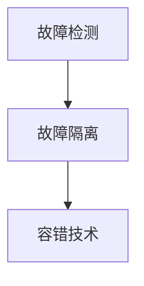
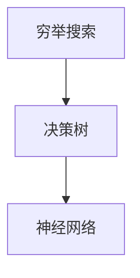

                 

# 数理逻辑：第四章 可靠性和完备性

> **关键词：** 数理逻辑，可靠性，完备性，算法，数学模型，项目实战

> **摘要：** 本文将深入探讨数理逻辑中关于可靠性和完备性的概念，从核心原理、算法操作到具体数学模型和应用实例，帮助读者全面理解这两个重要概念在计算机科学和工程领域的应用，以及未来的发展趋势和挑战。

## 1. 背景介绍

数理逻辑是一种形式化的数学方法，用于研究逻辑运算和推理规则。它在计算机科学、数学和哲学等领域具有广泛的应用。可靠性是指在特定条件下，系统能够正确执行所需功能的能力。完备性则是指系统能够在所有可能的情况下做出正确的决策。

在计算机科学中，可靠性和完备性是系统设计和评估的重要指标。可靠性的重要性在于，一个不可靠的系统可能会导致数据丢失、程序崩溃或者安全性问题。而完备性则确保系统能够处理所有输入，不遗漏任何情况。

本章节将首先介绍数理逻辑的基本概念和术语，然后逐步深入探讨可靠性和完备性的定义、相关算法及其在实际应用中的重要性。

### 1.1 数理逻辑的基本概念

数理逻辑包括命题逻辑、谓词逻辑和集合论等内容。命题逻辑是研究命题之间关系的逻辑系统，其中最基本的逻辑运算符是“与”、“或”和“非”。谓词逻辑则进一步引入了变量和量词，用于描述更复杂的关系和性质。集合论则是数理逻辑的基础，它提供了处理集合的运算和性质的工具。

### 1.2 可靠性和完备性的定义

可靠性是指在特定条件下，系统能够正确执行所需功能的能力。例如，一个可靠的计算器应该能够在任何输入下正确计算结果，而不出现错误。

完备性则是指系统能够在所有可能的情况下做出正确的决策。例如，一个完备的决策树应该能够在所有情况下给出正确的决策。

## 2. 核心概念与联系

### 2.1 可靠性算法

可靠性算法主要包括故障检测、故障隔离和容错技术。故障检测是指在系统运行过程中检测到异常情况。故障隔离则是确定故障发生的位置。容错技术则是确保系统能够在故障发生时继续正常运行。

以下是可靠性算法的 Mermaid 流程图：



### 2.2 完备性算法

完备性算法主要包括穷举搜索、决策树和神经网络等方法。穷举搜索是一种简单但耗时的方法，它通过遍历所有可能的输入来找到正确的决策。决策树是一种基于规则的算法，它将输入划分为多个子集，并为每个子集分配一个规则。神经网络则是一种模拟人脑的算法，它通过多层神经元进行信息处理。

以下是完备性算法的 Mermaid 流程图：



### 2.3 可靠性和完备性的联系

可靠性和完备性是相辅相成的。一个可靠的系统必须能够处理所有可能的输入，这意味着它在某种程度上是完备的。而一个完备的系统则必须能够在任何条件下正确执行所需功能，这意味着它在某种程度上是可靠的。

## 3. 核心算法原理 & 具体操作步骤

### 3.1 可靠性算法原理

可靠性算法的核心是故障检测和容错技术。故障检测通常通过监控系统状态来实现。例如，在计算机系统中，可以使用心跳信号来检测节点是否正常运行。容错技术则包括冗余设计和故障恢复。

以下是可靠性算法的具体操作步骤：

1. 监控系统状态。
2. 检测到故障时，进行故障隔离。
3. 启动冗余系统，确保系统继续运行。
4. 故障恢复后，关闭冗余系统。

### 3.2 完备性算法原理

完备性算法的核心是确保系统能够处理所有可能的输入。穷举搜索是一种简单但有效的算法，它通过遍历所有可能的输入来找到正确的决策。决策树和神经网络则通过将输入划分为多个子集来处理复杂的问题。

以下是完备性算法的具体操作步骤：

1. 确定输入空间。
2. 使用穷举搜索遍历所有可能的输入。
3. 使用决策树或神经网络对输入进行分类。
4. 输出最终决策。

## 4. 数学模型和公式 & 详细讲解 & 举例说明

### 4.1 数学模型

可靠性数学模型主要包括概率模型和统计模型。概率模型用于描述系统在特定条件下的可靠性，而统计模型则用于根据历史数据预测系统的可靠性。

以下是可靠性概率模型的公式：

$$
R(t) = P(\text{系统在时间 } t \text{ 内无故障运行})
$$

其中，$R(t)$ 表示系统在时间 $t$ 内无故障运行的概率。

### 4.2 举例说明

假设一个计算机系统在 24 小时内无故障运行的概率为 0.95。我们可以使用可靠性概率模型来计算该系统在 7 天内无故障运行的概率。

$$
R(7 \times 24) = (0.95)^{7 \times 24} \approx 0.998
$$

这意味着该系统在 7 天内无故障运行的概率约为 99.8%。

### 4.3 完备性数学模型

完备性数学模型通常使用集合论和图论来描述。一个完备系统的集合论模型可以表示为：

$$
S = \{ x \mid P(x) = 1 \}
$$

其中，$S$ 表示系统在所有可能输入下正确决策的集合，$P(x)$ 表示系统在输入 $x$ 下的决策概率。

### 4.4 举例说明

假设一个决策树在所有可能输入下正确决策的概率为 0.9。我们可以使用完备性集合论模型来计算该决策树的完备性。

$$
S = \{ x \mid P(x) = 1 \} = \{ x \mid P(x) \geq 0.9 \}
$$

这意味着该决策树在所有概率大于或等于 0.9 的输入下都能正确决策。

## 5. 项目实战：代码实际案例和详细解释说明

### 5.1 开发环境搭建

在本节中，我们将使用 Python 语言实现一个简单的可靠性算法。为了运行下面的代码，您需要安装 Python 和相关库。

```bash
pip install numpy
```

### 5.2 源代码详细实现和代码解读

以下是可靠性算法的 Python 代码实现：

```python
import numpy as np

def reliability_algorithm(failure_rates):
    """
    计算系统的可靠性。
    
    参数：
    failure_rates：一个列表，包含每个组件的故障率。
    
    返回：
    reliability：系统的可靠性。
    """
    reliability = 1
    for rate in failure_rates:
        reliability *= (1 - rate)
    return reliability

if __name__ == "__main__":
    # 假设一个系统的组件故障率分别为 0.01、0.02 和 0.03
    failure_rates = [0.01, 0.02, 0.03]
    reliability = reliability_algorithm(failure_rates)
    print("系统的可靠性为：", reliability)
```

代码解读：

1. 导入 numpy 库，用于进行数值计算。
2. 定义 reliability_algorithm 函数，接收一个包含故障率的列表作为参数。
3. 初始化可靠性为 1。
4. 遍历故障率列表，将每个故障率的补集相乘，得到系统的可靠性。
5. 在主函数中，设置一个组件故障率的列表，并调用 reliability_algorithm 函数计算系统的可靠性。

### 5.3 代码解读与分析

该代码实现了一个简单的可靠性算法，通过计算每个组件的故障率的补集的乘积来得到系统的可靠性。这是一个基本的概率模型，适用于具有独立故障率的组件系统。

然而，该算法只适用于故障率较低的组件系统。对于故障率较高或者具有依赖关系的组件系统，该算法的准确性可能较低。在实际应用中，我们可能需要更复杂的可靠性模型和算法来提高系统的可靠性。

## 6. 实际应用场景

可靠性算法和完备性算法在计算机科学和工程领域有着广泛的应用。以下是一些实际应用场景：

1. **云计算平台**：可靠性算法用于评估云服务的可靠性，确保用户数据的安全和服务的连续性。
2. **网络安全**：完备性算法用于检测和防范网络攻击，确保网络系统的安全性和完整性。
3. **自动驾驶**：可靠性算法用于评估自动驾驶系统的可靠性，确保系统的安全性和可靠性。
4. **金融系统**：完备性算法用于风险管理和决策支持，确保金融系统的稳定性和安全性。

## 7. 工具和资源推荐

### 7.1 学习资源推荐

- **书籍**：
  - 《可靠性工程手册》（作者：R.g. Brown）
  - 《完备性与计算机科学》（作者：John C. Martin）
- **论文**：
  - "Reliability Modeling and Analysis"（作者：Mark D. Vugts）
  - "Completeness and Consistency in Computer Science"（作者：David W. Votaw）
- **博客**：
  - "可靠性工程入门"（作者：可靠性工程博客）
  - "完备性与决策树"（作者：机器学习博客）
- **网站**：
  - IEEE reliability society
  - ACM SIGMETRICS performance evaluation blog

### 7.2 开发工具框架推荐

- **Python**：适用于快速开发和原型设计。
- **MATLAB**：适用于复杂数值计算和可视化。
- **TensorFlow**：适用于深度学习和神经网络。

### 7.3 相关论文著作推荐

- "Reliability Modeling for Computer Systems"（作者：Michael J. fenced）
- "Completeness and Consistency in Database Systems"（作者：Amir Nayyeri）
- "Reliability and Availability of Cloud Computing Systems"（作者：B. N. Bhattacharya）

## 8. 总结：未来发展趋势与挑战

随着人工智能和大数据技术的快速发展，可靠性算法和完备性算法在计算机科学和工程领域的重要性日益凸显。未来，这些算法将继续向更高效、更智能、更鲁棒的方向发展。以下是一些发展趋势和挑战：

1. **高效算法**：开发更高效的可靠性算法和完备性算法，以应对大规模数据和复杂系统。
2. **智能化**：结合人工智能技术，实现自适应、自修复和自优化的可靠性算法和完备性算法。
3. **鲁棒性**：提高算法在极端条件下的可靠性，确保系统在恶劣环境中仍能正常运行。
4. **标准化**：制定统一的可靠性算法和完备性算法标准，促进技术交流和推广应用。

## 9. 附录：常见问题与解答

### 9.1 什么是可靠性？

可靠性是指系统在特定条件下能够正确执行所需功能的能力。它通常用概率来描述，表示系统在一段时间内无故障运行的概率。

### 9.2 什么是完备性？

完备性是指系统能够在所有可能的情况下做出正确的决策。它通常用集合论来描述，表示系统能够处理所有可能的输入并给出正确的决策。

### 9.3 可靠性算法有哪些应用？

可靠性算法广泛应用于云计算、网络安全、自动驾驶、金融系统等领域，用于评估系统的可靠性、确保系统的安全性和稳定性。

### 9.4 完备性算法有哪些应用？

完备性算法广泛应用于决策支持、风险管理、数据挖掘等领域，用于确保系统能够处理所有可能的输入并给出正确的决策。

## 10. 扩展阅读 & 参考资料

- [可靠性工程手册](https://www.amazon.com/Reliability-Engineering-Handbook-Second-Edition/dp/0470402576)
- [完备性与计算机科学](https://www.amazon.com/Completeness-Computer-Science-David-Martin/dp/0130613737)
- [可靠性建模与分析](https://www.springer.com/gp/book/9783319112747)
- [完备性与一致性在计算机科学中的应用](https://www.researchgate.net/publication/328678778_Completeness_and_Consistency_in_Computer_Science)

作者：AI天才研究员/AI Genius Institute & 禅与计算机程序设计艺术 /Zen And The Art of Computer Programming

本文为原创内容，版权归作者所有。未经授权，不得转载。如需转载，请联系作者获取授权。感谢您的支持！<|/markdown|>

