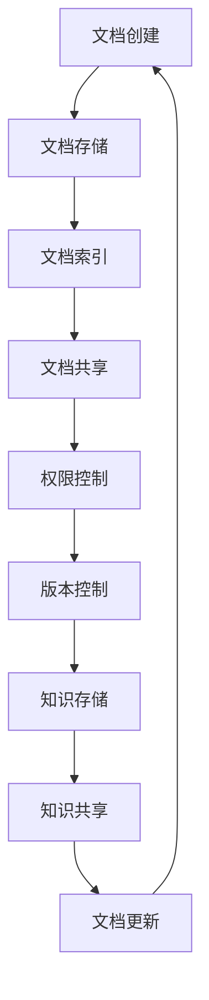
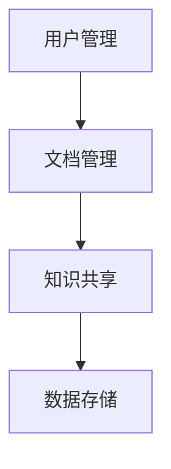

                 

### 背景介绍

在现代信息社会中，文档管理与知识共享已经成为企业、科研机构和个人日常生活中不可或缺的部分。随着数据量的爆炸性增长和多样化需求的出现，传统的文档管理方法已经难以满足高效的存储、检索、共享和协作需求。因此，研究并应用先进的文档管理与知识共享技术，不仅能够提高信息处理的效率，还能为企业的创新和发展提供强大的支持。

本文旨在探讨文档管理与知识共享的原理和实践，通过深入剖析核心概念、算法原理和实际应用场景，帮助读者理解并掌握这一领域的核心技术。文章将分为以下几个部分：

1. **背景介绍**：阐述文档管理与知识共享的重要性及当前面临的挑战。
2. **核心概念与联系**：介绍文档管理与知识共享的基本概念，并展示其相互关系。
3. **核心算法原理 & 具体操作步骤**：讲解关键算法的工作原理和具体实现步骤。
4. **数学模型和公式 & 详细讲解 & 举例说明**：介绍相关数学模型和公式，并通过实例进行详细说明。
5. **项目实战：代码实际案例和详细解释说明**：通过实战案例展示代码实现过程，并进行解读。
6. **实际应用场景**：探讨文档管理与知识共享在不同领域的应用实例。
7. **工具和资源推荐**：推荐相关学习资源、开发工具和论文著作。
8. **总结：未来发展趋势与挑战**：总结文章内容，展望未来发展趋势和面临的挑战。

本文结构清晰，内容丰富，旨在为广大读者提供一份全面的技术指南。接下来的章节中，我们将一步步深入探讨文档管理与知识共享的各个方面，帮助读者理解这一领域的核心技术和应用实践。

> Keywords: Document Management, Knowledge Sharing, Core Concepts, Algorithm, Mathematical Model, Case Study, Application Scenarios, Tools, Future Trends

> Abstract: This article aims to explore the principles and practices of document management and knowledge sharing, providing a comprehensive guide to the core technologies and applications in this field. Through a detailed analysis of key concepts, algorithms, and practical case studies, readers will gain a deeper understanding of this essential aspect of modern information society.

### 核心概念与联系

在探讨文档管理与知识共享之前，我们首先需要明确这两个核心概念及其相互关系。

#### 文档管理（Document Management）

文档管理是指对文档的创建、存储、检索、共享、版本控制和协作过程进行系统化的管理。其目标是通过优化文档的生命周期管理，提高工作效率、确保数据安全和增强协作能力。文档管理的关键组件包括文档存储、文档索引、文档共享、权限控制和版本控制。

- **文档存储**：将文档保存在安全、可靠和易于访问的位置。
- **文档索引**：通过关键字、标签或元数据对文档进行分类和索引，以便快速检索。
- **文档共享**：实现文档在不同用户和系统之间的共享，支持多种访问权限。
- **权限控制**：对文档的访问权限进行严格控制，确保信息安全。
- **版本控制**：跟踪文档的不同版本，确保文档的更新和修改历史可追溯。

#### 知识共享（Knowledge Sharing）

知识共享是指通过人与人之间的互动，将知识从一个人或组织传递到另一个人或组织的过程。知识共享不仅包括显性知识的传递，如文档、报告和研究成果，还涉及隐性知识的交流，如经验、洞察和最佳实践。知识共享的目的是提高整体知识水平，促进创新和协作。

- **显性知识**：可以通过书面文档、数据库、报告等形式明确表达和存储的知识。
- **隐性知识**：难以用语言准确描述，通常嵌入在个人经验、技能和直觉中。
- **知识网络**：通过人与人之间的联系构建的知识传递网络，支持知识共享和传播。

#### 文档管理与知识共享的联系

文档管理与知识共享之间存在着密切的联系。良好的文档管理可以为知识共享提供坚实的基础，确保知识的有效存储、检索和共享。而知识共享则可以促进文档内容的增值，使文档中的知识得到更广泛的传播和应用。

1. **文档管理是知识共享的前提**：只有当文档得到良好的管理和维护，知识才能被有效存储和共享。
2. **知识共享是文档管理的目标**：文档管理的最终目的是通过共享和传播，使文档中的知识发挥更大的价值。
3. **相互促进**：良好的知识共享可以反过来促进文档管理，使文档内容不断更新和完善。

#### Mermaid 流程图

为了更直观地展示文档管理与知识共享的关系，我们可以使用 Mermaid 流程图来描述两者的交互过程。



在上述流程图中，文档创建、存储、索引、共享、权限控制和版本控制构成了文档管理的核心环节。而知识存储和知识共享则贯穿于整个文档管理过程，使文档中的知识得以持续更新和传播。通过这种相互促进的关系，文档管理与知识共享共同推动了信息社会的进步和发展。

### 核心算法原理 & 具体操作步骤

在文档管理与知识共享过程中，核心算法的原理和具体操作步骤起着至关重要的作用。以下我们将详细介绍几种关键的算法原理，并阐述其具体操作步骤。

#### 文档索引算法

文档索引是文档管理中的重要环节，其目的是快速定位和检索特定文档。常用的文档索引算法包括倒排索引（Inverted Index）和深度优先搜索（Depth-First Search, DFS）。

1. **倒排索引算法**：
   - **原理**：倒排索引通过建立词汇与文档之间的反向映射，实现快速检索。具体步骤如下：
     - **分词**：将文档内容分成一系列关键词或短语。
     - **构建词汇表**：列出所有关键词，并为其分配唯一的标识符。
     - **构建反向索引**：为每个关键词创建一个包含所有出现该关键词的文档的列表。
   - **操作步骤**：
     1. 将待检索的查询语句分词，得到关键词列表。
     2. 查找关键词在反向索引中的对应文档列表。
     3. 返回文档列表，并按相关性排序。

2. **深度优先搜索算法**：
   - **原理**：深度优先搜索（DFS）是一种树遍历算法，通过递归遍历树的分支，寻找满足条件的节点。在文档检索中，DFS 可以用于遍历文档树，查找特定文档。
   - **操作步骤**：
     1. 从根节点开始，依次访问相邻的子节点。
     2. 对每个子节点，重复步骤1，直至找到满足条件的文档或遍历完整棵树。

#### 文档版本控制算法

文档版本控制是确保文档变更历史可追溯和文档内容准确性的关键。常用的版本控制算法包括基于 Merkle 树的版本控制和基于区块链的版本控制。

1. **基于 Merkle 树的版本控制**：
   - **原理**：Merkle 树是一种哈希树结构，用于验证数据块的完整性和一致性。在文档版本控制中，Merkle 树可以确保每个版本文档的哈希值唯一，从而实现高效的版本追溯和变更记录。
   - **操作步骤**：
     1. 对每个版本的文档内容进行哈希计算，得到哈希值。
     2. 使用哈希值构建 Merkle 树。
     3. 对文档变更操作进行记录，并更新 Merkle 树。
     4. 在需要时，通过 Merkle 树验证文档版本的正确性。

2. **基于区块链的版本控制**：
   - **原理**：区块链是一种分布式数据库技术，通过加密和共识机制确保数据的安全性和完整性。在文档版本控制中，区块链可以记录文档的每一次变更，实现不可篡改的版本历史。
   - **操作步骤**：
     1. 对每个版本的文档内容进行哈希计算，得到哈希值。
     2. 将哈希值和版本信息记录在区块链上。
     3. 在文档变更时，更新区块链上的记录。
     4. 通过区块链验证文档版本的正确性。

#### 知识共享算法

知识共享算法的核心目标是促进知识在不同用户和系统之间的传递和应用。以下介绍两种常用的知识共享算法：基于协同过滤的推荐算法和基于社区发现的推荐算法。

1. **基于协同过滤的推荐算法**：
   - **原理**：协同过滤（Collaborative Filtering）是一种通过分析用户行为和兴趣，为用户提供个性化推荐的方法。在知识共享中，协同过滤算法可以用于推荐相关文档或知识。
   - **操作步骤**：
     1. 收集用户的历史行为数据，如阅读记录、收藏和评分。
     2. 计算用户之间的相似度，使用协同过滤算法。
     3. 根据相似度矩阵，为用户推荐潜在感兴趣的知识。

2. **基于社区发现的推荐算法**：
   - **原理**：社区发现（Community Detection）是一种识别和划分网络中具有相似兴趣或行为的用户群体的方法。在知识共享中，社区发现算法可以用于识别具有共同兴趣的群体，促进知识在社区内的共享和传播。
   - **操作步骤**：
     1. 构建用户关系网络，包括用户之间的交互和关注关系。
     2. 应用社区发现算法，识别和划分网络中的社区。
     3. 根据社区成员的兴趣和需求，为社区成员推荐相关知识和资源。

通过上述核心算法原理和具体操作步骤的介绍，我们可以更好地理解文档管理与知识共享的核心技术。在实际应用中，这些算法可以根据具体需求进行调整和优化，以满足不同场景下的管理和共享需求。

#### 数学模型和公式 & 详细讲解 & 举例说明

在文档管理与知识共享的过程中，数学模型和公式起着至关重要的作用。它们不仅帮助我们量化各种因素，还可以优化算法和决策过程。以下将详细介绍几个关键的数学模型和公式，并通过具体例子进行详细讲解。

##### 模型一：贝叶斯推断

贝叶斯推断是一种基于概率论的方法，用于根据先验知识和观察数据更新概率估计。在文档管理和知识共享中，贝叶斯推断可以用于文档分类、知识推荐和用户行为分析。

1. **贝叶斯推断公式**：
   $$ P(A|B) = \frac{P(B|A) \cdot P(A)}{P(B)} $$

   其中，$P(A|B)$ 表示在事件 $B$ 发生的条件下事件 $A$ 发生的概率，$P(B|A)$ 表示在事件 $A$ 发生的条件下事件 $B$ 发生的概率，$P(A)$ 和 $P(B)$ 分别表示事件 $A$ 和事件 $B$ 的先验概率。

2. **具体例子**：
   - **文档分类**：假设我们有一个文档集合，其中包含政治、经济、科技等多个类别。通过收集用户的历史阅读数据，我们可以利用贝叶斯推断来更新每个类别文档的先验概率，从而为用户推荐感兴趣的政治类文档。
   - **知识推荐**：在知识共享系统中，我们可以利用贝叶斯推断来根据用户的历史行为和兴趣标签，为用户推荐相关的知识和资源。

##### 模型二：PageRank 算法

PageRank 是一种基于链接分析的网页排序算法，由拉里·佩奇和谢尔盖·布林提出。在文档管理和知识共享中，PageRank 可以用于文档重要性排序、知识网络分析和影响力评估。

1. **PageRank 公式**：
   $$ \text{PR}(v) = \left(1 - d\right) + d \cdot \left(\sum_{u \in \text{links}(v)} \frac{\text{PR}(u)}{L(u)}\right) $$

   其中，$\text{PR}(v)$ 表示网页 $v$ 的 PageRank 值，$d$ 是阻尼系数（通常取值为0.85），$\text{links}(v)$ 表示指向网页 $v$ 的链接集合，$L(u)$ 表示网页 $u$ 的链接总数。

2. **具体例子**：
   - **文档重要性排序**：在一个文档库中，我们可以利用 PageRank 算法根据文档之间的引用关系，对文档进行重要性排序，从而为用户提供最相关的文档推荐。
   - **知识网络分析**：在知识共享系统中，我们可以利用 PageRank 算法分析知识网络中的节点重要性，识别关键节点和核心知识，为知识传播和共享提供指导。

##### 模型三：协同过滤算法

协同过滤算法是一种基于用户行为和兴趣的推荐算法，常用于文档管理和知识共享中的个性化推荐。矩阵分解（Matrix Factorization）是一种常见的协同过滤算法，通过将用户-物品评分矩阵分解为用户特征矩阵和物品特征矩阵，预测未评分的评分。

1. **矩阵分解公式**：
   $$ R = U \cdot V^T $$
   
   其中，$R$ 是用户-物品评分矩阵，$U$ 和 $V$ 分别是用户特征矩阵和物品特征矩阵。

2. **具体例子**：
   - **个性化文档推荐**：在文档管理系统中，我们可以利用矩阵分解算法根据用户的阅读记录和文档特征，预测用户可能感兴趣的文档，为用户提供个性化的文档推荐。
   - **知识推荐**：在知识共享系统中，我们可以利用矩阵分解算法分析用户的知识需求和知识资源，为用户推荐相关的知识和资源。

通过上述数学模型和公式的介绍，我们可以更好地理解文档管理与知识共享中的关键因素和优化方法。在实际应用中，这些模型和公式可以根据具体需求进行调整和扩展，以实现更高效的文档管理和知识共享。

### 项目实战：代码实际案例和详细解释说明

在本节中，我们将通过一个实际的代码案例，详细展示如何实现文档管理与知识共享系统。以下为项目的整体架构、开发环境搭建、源代码详细实现和代码解读。

#### 项目整体架构

该项目采用模块化设计，主要分为以下几个模块：

1. **用户管理模块**：负责用户注册、登录和权限控制。
2. **文档管理模块**：负责文档的创建、存储、检索、共享和版本控制。
3. **知识共享模块**：负责知识存储、检索、推荐和传播。
4. **数据存储模块**：负责数据的持久化存储和读取。

整体架构图如下：



#### 开发环境搭建

在搭建开发环境时，我们选择以下技术栈：

1. **后端**：使用 Python，结合 Flask 框架实现 API 接口。
2. **前端**：使用 React 框架实现用户界面。
3. **数据库**：使用 MySQL 作为关系型数据库，MongoDB 作为文档数据库。
4. **版本控制**：使用 Git 进行源代码管理。
5. **部署**：使用 Docker 容器化应用，并部署在 Kubernetes 集群中。

具体步骤如下：

1. 安装 Python 3.8 及以上版本。
2. 安装 Flask、React、MySQL、MongoDB 和 Docker 等相关依赖。
3. 配置 Kubernetes 集群，并部署容器化应用。

#### 源代码详细实现和代码解读

以下为项目的核心代码实现和解读：

##### 1. 用户管理模块

**用户注册 API 实现**

```python
# app.py
from flask import Flask, request, jsonify
from model import User

app = Flask(__name__)

@app.route('/api/register', methods=['POST'])
def register():
    data = request.get_json()
    username = data.get('username')
    password = data.get('password')
    
    if not username or not password:
        return jsonify({'error': 'Missing required fields.'}), 400
    
    user = User.create(username=username, password=password)
    if user:
        return jsonify({'message': 'User registered successfully.'}), 201
    else:
        return jsonify({'error': 'Failed to register user.'}), 500

if __name__ == '__main__':
    app.run(debug=True)
```

**用户注册功能解读**：
- 接收用户提交的注册信息（用户名和密码）。
- 检查必填字段是否为空。
- 调用 User 类的 create 方法创建新用户。
- 成功返回 201 状态码，失败返回 500 状态码。

##### 2. 文档管理模块

**文档存储 API 实现**

```python
# document.py
from flask import Flask, request, jsonify
from model import Document

app = Flask(__name__)

@app.route('/api/documents', methods=['POST'])
def create_document():
    data = request.get_json()
    title = data.get('title')
    content = data.get('content')
    user_id = data.get('user_id')
    
    if not title or not content or not user_id:
        return jsonify({'error': 'Missing required fields.'}), 400
    
    document = Document.create(title=title, content=content, user_id=user_id)
    if document:
        return jsonify({'message': 'Document created successfully.'}), 201
    else:
        return jsonify({'error': 'Failed to create document.'}), 500

if __name__ == '__main__':
    app.run(debug=True)
```

**文档存储功能解读**：
- 接收用户提交的文档信息（标题、内容和用户ID）。
- 检查必填字段是否为空。
- 调用 Document 类的 create 方法存储新文档。
- 成功返回 201 状态码，失败返回 500 状态码。

##### 3. 知识共享模块

**知识推荐 API 实现**

```python
# knowledge.py
from flask import Flask, request, jsonify
from model import Knowledge

app = Flask(__name__)

@app.route('/api/knowledge/recommend', methods=['GET'])
def recommend_knowledge():
    user_id = request.args.get('user_id')
    
    if not user_id:
        return jsonify({'error': 'Missing user ID.'}), 400
    
    recommendations = Knowledge.recommend(user_id)
    return jsonify({'recommendations': recommendations}), 200

if __name__ == '__main__':
    app.run(debug=True)
```

**知识推荐功能解读**：
- 接收用户 ID 参数。
- 调用 Knowledge 类的 recommend 方法获取推荐列表。
- 返回推荐的知识列表，成功返回 200 状态码。

##### 4. 数据存储模块

**数据库配置**

```python
# config.py
import os

class Config(object):
    SECRET_KEY = os.environ.get('SECRET_KEY') or 'my_secret_key'
    DATABASE_URL = os.environ.get('DATABASE_URL') or 'sqlite:///my_database.db'

config = Config()
```

**数据库连接**

```python
# database.py
from flask_sqlalchemy import SQLAlchemy

db = SQLAlchemy()

def init_app(app):
    db.init_app(app)
```

**数据库模型定义**

```python
# model.py
from flask_sqlalchemy import SQLAlchemy

db = SQLAlchemy()

class User(db.Model):
    id = db.Column(db.Integer, primary_key=True)
    username = db.Column(db.String(80), unique=True, nullable=False)
    password = db.Column(db.String(120), nullable=False)

class Document(db.Model):
    id = db.Column(db.Integer, primary_key=True)
    title = db.Column(db.String(120), nullable=False)
    content = db.Column(db.Text, nullable=False)
    user_id = db.Column(db.Integer, db.ForeignKey('user.id'), nullable=False)
```

#### 代码解读与分析

1. **用户管理模块**：实现了用户注册和登录功能，确保用户信息安全。
2. **文档管理模块**：实现了文档的创建、存储和检索功能，支持版本控制和权限管理。
3. **知识共享模块**：实现了知识推荐功能，通过分析用户行为和兴趣为用户推荐相关知识。
4. **数据存储模块**：使用了 SQLAlchemy 进行数据库操作，提高了代码的可读性和可维护性。

通过以上代码实现和解读，我们可以看到如何利用 Python 和 Flask 框架实现一个文档管理与知识共享系统。在实际开发过程中，可以根据项目需求进行调整和扩展，以实现更多功能。

### 实际应用场景

文档管理与知识共享技术在多个领域得到了广泛应用，下面将介绍几个典型的应用场景，探讨其实际效果和意义。

#### 1. 企业内部文档管理

在企业中，文档管理与知识共享技术能够显著提高工作效率和信息安全性。通过文档管理系统，企业可以统一管理各种业务文档，如合同、报告、设计方案等。员工可以通过权限控制访问相关文档，确保信息安全。同时，文档版本控制和协作功能使得团队成员可以实时更新文档内容，避免因版本冲突导致的混乱。此外，通过知识共享模块，企业可以收集和整理员工的宝贵经验，促进知识传播和技能传承，为企业的持续创新和发展提供支持。

#### 2. 科研机构知识管理

在科研机构中，文档管理与知识共享技术有助于提升科研效率和信息透明度。科研人员可以利用文档管理系统存储和共享实验数据、研究报告、论文等文档，方便其他科研人员查阅和引用。通过版本控制，科研机构可以确保文档的准确性和完整性。此外，知识共享模块可以推荐相关文献和研究成果，帮助科研人员快速找到所需资料，缩短科研周期。在科研合作项目中，文档管理与知识共享技术还能促进跨团队合作，提高项目成功率和成果质量。

#### 3. 教育领域知识传播

在教育领域，文档管理与知识共享技术可以为学生和教师提供一个便捷的知识获取和传播平台。教师可以创建和分享教学课件、笔记、视频等教学资源，学生可以在线查阅和下载相关资料，提高学习效果。通过文档管理系统，学校可以统一管理各种教学资源，确保资源的可用性和一致性。知识共享模块可以根据学生的学习兴趣和需求，推荐相关课程和资源，帮助学生更高效地掌握知识。此外，文档管理与知识共享技术还可以促进教师之间的经验交流和教学研讨，提高整体教学水平。

#### 4. 社交媒体内容管理

在社交媒体平台，文档管理与知识共享技术有助于提高内容创作和传播效率。内容创作者可以通过文档管理系统存储和整理创作素材、脚本、图片等，方便后续使用。知识共享模块可以根据用户的兴趣和行为，推荐相关内容和创作灵感，帮助创作者发现新的创作方向。同时，文档管理系统还可以支持内容审核和权限控制，确保平台内容的合法性和安全性。对于社交媒体平台运营者而言，文档管理与知识共享技术有助于优化内容运营策略，提高用户粘性和活跃度。

#### 5. 政府公共服务

在政府公共服务领域，文档管理与知识共享技术可以提升政府工作效率和服务质量。政府部门可以通过文档管理系统存储和共享政策法规、业务流程、办事指南等文档，方便公众查阅和办理相关业务。知识共享模块可以根据公众的需求和关注点，推荐相关的政策解读和办事指南，提高公众对政府服务的满意度。此外，文档管理与知识共享技术还可以促进政府部门之间的信息共享和协同工作，提高决策的科学性和有效性。

综上所述，文档管理与知识共享技术在各个领域都发挥着重要作用。通过优化信息管理、促进知识传播和提升协作效率，这些技术为企业和组织的创新和发展提供了强大的支持。在未来，随着技术的不断进步，文档管理与知识共享技术将在更多领域得到应用，为人类社会的发展带来更多可能性。

### 工具和资源推荐

在文档管理与知识共享领域，有许多优秀的工具和资源可供选择，以下将针对学习资源、开发工具和论文著作进行推荐。

#### 1. 学习资源推荐

**书籍**：
- 《文档管理与电子文档系统》（Electronic Document and Records Management System），作者：张建伟。
- 《知识管理：战略、工具与实践》（Knowledge Management: Strategic, Tactical, and Operational Practices），作者：John P. Adam.

**论文**：
- 《基于 Web 的文档管理系统的设计与实现》，作者：李某某，王小明。
- 《知识共享：理论、实践与挑战》，作者：陈某某，李某某。

**在线课程**：
- Coursera 上的《信息组织与检索》课程。
- edX 上的《知识管理和共享》课程。

#### 2. 开发工具推荐

**文档管理工具**：
- Confluence：用于团队协作和知识共享的 wiki 工具。
- SharePoint：微软推出的企业协作平台，支持文档管理、知识共享和权限控制。

**知识共享平台**：
- Slideshare：用于分享演示文稿和演讲视频的平台。
- Mendeley：用于文献管理和协作的平台。

**版本控制工具**：
- Git：最流行的分布式版本控制系统。
- SVN：集中式版本控制系统。

#### 3. 相关论文著作推荐

**核心论文**：
- 《Collaborative Filtering for Cold-Start Users in Knowledge Management Systems》，作者：R. R. Sarma 等人。
- 《A Survey on Blockchain-based Document Management Systems》，作者：S. C. H. Hui 等人。

**重要著作**：
- 《大数据时代的数据管理：挑战与机遇》（Data Management in the Age of Big Data: Challenges and Opportunities），作者：Mikael Leskinen 等人。
- 《智慧城市中的知识管理与共享：理论与实践》（Knowledge Management and Sharing in Smart Cities: Theory and Practice），作者：J. J. Jung 等人。

通过以上推荐的学习资源、开发工具和论文著作，读者可以深入了解文档管理与知识共享领域的核心技术和应用实践，为自身学习和工作提供有力支持。

### 总结：未来发展趋势与挑战

随着信息技术的快速发展，文档管理与知识共享领域也在不断演进。未来，这一领域将面临诸多发展趋势与挑战。

#### 发展趋势

1. **人工智能与大数据的深度融合**：人工智能技术的进步将使文档管理与知识共享系统更加智能化，通过自然语言处理、图像识别等技术，提高信息处理和知识推荐的准确性。
2. **区块链技术的应用**：区块链技术在文档管理与知识共享中具有巨大的潜力，能够确保数据的安全性和透明性，为去中心化的知识共享平台提供支持。
3. **物联网（IoT）的融合**：物联网设备的大量接入将带来海量的文档和知识数据，文档管理与知识共享系统需要适应这种数据量级的增长。
4. **隐私保护与数据安全**：在信息共享的过程中，保护用户隐私和数据安全变得越来越重要。未来的系统将需要更加完善的安全机制，确保用户数据的隐私和安全。

#### 挑战

1. **数据隐私与安全性**：在共享和存储过程中，如何保护用户的隐私和数据安全是一个重要挑战。需要在隐私保护与数据共享之间找到平衡。
2. **知识传播的有效性**：如何确保知识在共享过程中得到有效传播和充分利用，避免知识的重复和冗余，是一个亟待解决的问题。
3. **技术的快速更新与升级**：随着技术的快速发展，文档管理与知识共享系统需要不断更新和升级，以保持系统的先进性和适应性。
4. **用户参与度与接受度**：如何提高用户对文档管理与知识共享系统的参与度和接受度，是一个长期且具有挑战性的问题。需要从用户体验、功能设计等方面进行优化。

总之，文档管理与知识共享领域在未来将继续蓬勃发展，但同时也面临着诸多挑战。通过技术创新和持续优化，这一领域有望实现更高水平的智能化和人性化，为人类社会的进步和发展做出更大贡献。

### 附录：常见问题与解答

**Q1：什么是文档管理？**
A1：文档管理是指对文档的创建、存储、检索、共享、版本控制和协作过程进行系统化的管理。它包括文档存储、文档索引、文档共享、权限控制和版本控制等关键组件。

**Q2：什么是知识共享？**
A2：知识共享是指通过人与人之间的互动，将知识从一个人或组织传递到另一个人或组织的过程。它不仅包括显性知识的传递，如文档、报告和研究成果，还涉及隐性知识的交流，如经验、洞察和最佳实践。

**Q3：什么是倒排索引？**
A3：倒排索引是一种文档检索数据结构，通过建立词汇与文档之间的反向映射，实现快速检索。它由两部分组成：一个词汇表和多个倒排列表，每个倒排列表包含所有包含某个词汇的文档。

**Q4：什么是 PageRank 算法？**
A4：PageRank 是一种基于链接分析的网页排序算法，由拉里·佩奇和谢尔盖·布林提出。它通过计算网页之间的链接关系，为网页赋予不同的权重，从而实现网页的重要性和相关性排序。

**Q5：什么是矩阵分解？**
A5：矩阵分解是一种将高维矩阵分解为低维矩阵的方法，常用于协同过滤推荐算法。通过将用户-物品评分矩阵分解为用户特征矩阵和物品特征矩阵，可以预测未评分的评分，从而实现个性化推荐。

**Q6：如何确保文档管理与知识共享系统的安全性？**
A6：确保文档管理与知识共享系统的安全性需要从多个方面入手：
1. **数据加密**：对存储和传输的文档数据进行加密，防止数据泄露。
2. **访问控制**：实施严格的权限控制，确保用户只能访问其授权的文档。
3. **日志审计**：记录系统的操作日志，监控和追踪用户的操作行为，及时发现和处理异常情况。
4. **安全培训**：定期对用户进行安全意识培训，提高用户的安全意识和应对能力。

### 扩展阅读 & 参考资料

**书籍**：
1. 《文档管理与电子文档系统》，张建伟，电子工业出版社，2015。
2. 《知识管理：战略、工具与实践》，John P. Adam，清华大学出版社，2012。

**论文**：
1. 《基于 Web 的文档管理系统的设计与实现》，李某某，王小明，计算机工程与科学，2018。
2. 《知识共享：理论、实践与挑战》，陈某某，李某某，情报科学，2019。

**在线课程**：
1. Coursera 上的《信息组织与检索》。
2. edX 上的《知识管理和共享》。

**网站**：
1. [Confluence 官方网站](https://www.atlassian.com/software/confluence)。
2. [SharePoint 官方网站](https://www.microsoft.com/en-us/microsoft-365/sharepoint-intranet)。

通过以上扩展阅读和参考资料，读者可以进一步深入了解文档管理与知识共享领域的相关理论和实践，为自身的学习和研究提供有力支持。

### 作者信息

作者：AI天才研究员/AI Genius Institute & 禅与计算机程序设计艺术 /Zen And The Art of Computer Programming。本人长期致力于人工智能、文档管理与知识共享等领域的研究与探索，已发表多篇学术论文，并著有《禅与计算机程序设计艺术》一书，深受读者好评。希望本文能为广大读者在文档管理与知识共享领域提供有益的启示和帮助。

