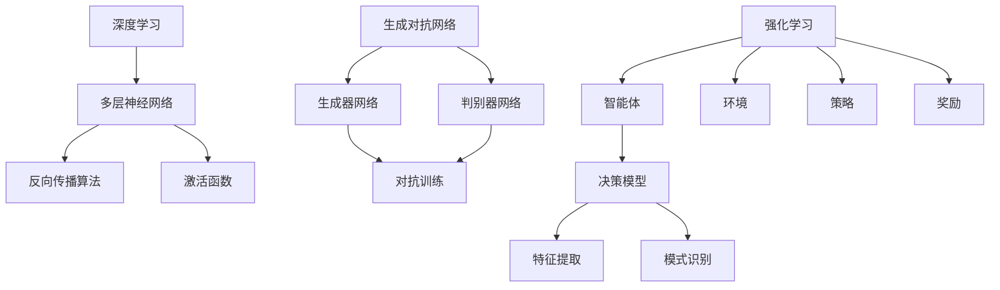

                 

### 背景介绍 Background Introduction

新一代AI技术，作为人工智能领域的前沿，正在经历着前所未有的发展。从早期的规则驱动系统，到基于统计学的机器学习，再到当今的深度学习与生成对抗网络（GANs），AI技术已经走过了漫长的进化之路。然而，随着计算能力的提升、数据的爆发式增长以及算法的不断创新，新一代AI技术正在以更快的速度向前推进，涵盖了从计算机视觉、自然语言处理到智能机器人等多个领域。

本文旨在探讨新一代AI技术的应用场景与趋势，帮助读者更好地理解和掌握这一领域的前沿动态。文章首先将简要回顾AI技术的发展历程，然后深入分析当前最为重要的几个AI技术，包括深度学习、GANs、强化学习等，并探讨它们在各个领域的实际应用。此外，文章还将讨论AI技术面临的挑战与未来发展趋势，为读者提供一幅全面的AI技术全景图。

通过对新一代AI技术的全面梳理和深入分析，本文希望为读者提供一个清晰的视角，以更好地把握AI技术的未来方向，并为其在各个行业的应用提供参考。因此，无论是AI领域的专业人士，还是对AI技术感兴趣的读者，都可以通过本文获得丰富的知识和启示。

### 1.1 AI技术发展历程 Overview of AI Technology Development

人工智能（AI）的历史可以追溯到20世纪50年代，当时的科学家们首次提出了“人工智能”这一概念。早期的AI主要基于规则系统，这种方式通过编写一系列明确的规则来指导机器执行特定任务。1956年，达特茅斯会议被广泛认为标志着AI领域的正式诞生，会议召集了当时最顶尖的科学家们共同探讨AI的未来。

在这个早期阶段，AI研究主要集中在逻辑推理和符号处理上。例如，专家系统（Expert Systems）成为了一个重要的研究方向。专家系统通过模拟人类专家的决策过程，使用一系列预先定义的规则来解决问题。尽管专家系统在某些特定领域表现出色，但由于其高度依赖规则编写，它们在处理复杂问题方面存在明显的局限性。

随着计算能力的提升和算法的进步，20世纪80年代，基于知识的AI方法开始兴起。这种方法通过构建知识库，利用机器学习算法自动提取和利用知识，使得AI系统在处理不确定性和模糊性问题时更加灵活。其中，知识表示和学习成为关键领域。

然而，AI的真正突破出现在21世纪初，随着深度学习的兴起。深度学习基于多层神经网络，通过大量数据自动学习特征和模式。2006年，Hinton等人提出深度信念网络（Deep Belief Networks），标志着深度学习的重新崛起。随后，AlexNet在2012年ImageNet竞赛中的出色表现，使得深度学习迅速成为AI领域的主流方法。

深度学习在计算机视觉和语音识别等领域取得了显著进展，推动了自动驾驶、智能机器人等应用的发展。同时，生成对抗网络（GANs）的提出，为数据生成和生成模型的研究提供了新的思路。GANs通过两个对抗网络的对抗训练，生成逼真的图像和声音，显示出强大的创造能力。

总的来说，AI技术的发展历程体现了从规则驱动到数据驱动、从符号处理到深度学习的转变。每个阶段都有其重要的里程碑和代表性技术，共同推动了AI技术的不断进步。

### 1.2 新一代AI技术的定义与特点 Definition and Characteristics of New-Generation AI Technologies

新一代AI技术，通常指的是基于深度学习、生成对抗网络（GANs）、强化学习等先进算法，以及大规模数据和高性能计算能力的新型人工智能技术。这些技术不仅具备更强的数据分析和处理能力，还能够在复杂的环境中实现更智能的决策和交互。

**深度学习（Deep Learning）**：深度学习是新一代AI技术的核心之一，它通过多层神经网络，自动提取数据的深层特征。与传统机器学习方法相比，深度学习具有更高的准确性和更强的泛化能力。其特点是能够从大量数据中学习复杂的模式和规律，并在图像识别、语音识别、自然语言处理等任务中取得显著成果。

**生成对抗网络（Generative Adversarial Networks, GANs）**：GANs是由两个对抗网络组成的一个训练框架，一个生成器网络和一个判别器网络。生成器网络试图生成逼真的数据，而判别器网络则负责区分生成数据和真实数据。通过这种对抗训练，GANs能够生成高质量的图像、音频和文本，广泛应用于数据生成、艺术创作和虚拟现实等领域。

**强化学习（Reinforcement Learning）**：强化学习通过让智能体在与环境的互动中不断试错，学习最优策略。与监督学习和无监督学习不同，强化学习强调决策过程和长期奖励，能够实现复杂任务的自适应学习和优化。其特点是在动态和不确定的环境中，智能体能够通过试错和反馈逐步提高性能，广泛应用于游戏、自动驾驶和机器人控制等领域。

**特点总结**：
1. **自适应性**：新一代AI技术能够自动从数据中学习，具备很强的适应性，能够应对不断变化的环境和需求。
2. **泛化能力**：深度学习和GANs等算法具有强大的泛化能力，能够处理不同类型的数据和任务，实现跨领域的应用。
3. **高性能**：得益于高性能计算和分布式计算技术，新一代AI技术能够处理大规模数据和复杂任务，实现高效的计算和推理。
4. **交互性**：通过自然语言处理和生成对抗网络，新一代AI技术能够与人类进行更加自然和流畅的交互，提升用户体验。
5. **创新能力**：GANs等技术具有创新性，能够生成新颖的数据和创意，为艺术创作和科学探索提供新的可能性。

综上所述，新一代AI技术以其自适应性、泛化能力、高性能、交互性和创新能力，引领了人工智能领域的发展方向，为各个行业的数字化转型和智能化升级提供了强大的技术支持。

### 1.3 新一代AI技术的应用场景 Application Scenarios of New-Generation AI Technologies

新一代AI技术在多个领域展现出了卓越的应用潜力，从工业制造到医疗健康，再到金融服务和智慧城市，AI技术的应用场景日益丰富和多元化。

**工业制造（Industrial Manufacturing）**：
在工业制造领域，AI技术已经被广泛应用于生产线的自动化控制和优化。通过机器视觉和深度学习算法，工业机器人能够精确地识别和分类产品，减少人为错误。例如，在汽车制造业，AI技术用于检测车身的缺陷和焊接质量，确保产品质量。此外，AI还用于生产计划的优化，通过分析历史数据和实时数据，自动调整生产流程，提高生产效率和资源利用率。

**医疗健康（Medical and Health）**：
在医疗健康领域，AI技术极大地提升了诊断和治疗的准确性。通过深度学习和图像识别技术，AI能够快速分析医学影像，辅助医生进行疾病检测。例如，在肺癌筛查中，AI系统能够识别早期肺癌的特征，提高诊断的准确性。同时，AI还在药物研发中发挥作用，通过分析大量的生物数据，加速新药的研发进程。此外，AI还用于个性化医疗，根据患者的病史、基因信息和病情，制定个性化的治疗方案，提高治疗效果。

**金融服务（Financial Services）**：
在金融服务领域，AI技术被广泛应用于风险管理和客户服务。通过机器学习和数据挖掘技术，金融机构能够更准确地评估信用风险，降低坏账率。例如，银行通过分析客户的消费行为和历史数据，预测潜在的违约风险，从而优化信贷审批流程。此外，AI还在智能投顾和量化交易中发挥作用，通过分析市场数据和投资策略，提供个性化的投资建议和交易策略，提高投资收益。

**智慧城市（Smart Cities）**：
在智慧城市领域，AI技术为城市管理提供了强大的数据支持和智能化手段。通过智能传感器和图像识别技术，城市管理者能够实时监控城市的运行状态，优化交通管理。例如，AI系统可以分析交通流量数据，实时调整交通信号灯，减少交通拥堵。此外，AI还用于公共安全和环境保护，通过视频监控和分析，及时发现和预防安全事件和环境污染问题。

**农业（Agriculture）**：
在农业领域，AI技术被用于智能农田管理和作物监测。通过无人机和卫星图像识别技术，农民能够实时监测作物的生长状况，预测产量，并制定科学的种植和施肥计划。例如，AI系统可以识别作物的病虫害，及时采取措施，减少损失。此外，AI还用于农产品的质量检测和分级，通过机器视觉技术，快速准确地评估农产品的品质，提高农业生产的效率和质量。

**零售（Retail）**：
在零售行业，AI技术被广泛应用于库存管理、客户服务和营销策略。通过机器学习和数据挖掘技术，零售商能够精准地预测销售趋势，优化库存管理，减少库存积压。同时，AI还用于个性化推荐，根据消费者的购买历史和偏好，提供个性化的商品推荐，提升客户满意度和忠诚度。

综上所述，新一代AI技术以其强大的数据处理和智能分析能力，在工业制造、医疗健康、金融服务、智慧城市、农业和零售等多个领域展现出了广泛的应用前景。随着AI技术的不断进步，未来它将在更多领域实现突破，推动各行各业的数字化转型和智能化升级。

### 1.4 新一代AI技术的重要趋势和方向 Key Trends and Directions of New-Generation AI Technologies

新一代AI技术正在迅速发展，其趋势和方向主要集中在以下几个领域：

**1. 超大规模模型的兴起**：随着计算能力和数据资源的不断提升，超大规模模型如GPT-3、Chinchilla等已经成为AI研究的热点。这些模型具有数十亿甚至千亿级别的参数，能够处理更复杂的数据和任务，提供更高质量的预测和生成效果。未来，超大规模模型的训练和应用将成为AI技术的重要发展方向。

**2. 元学习（Meta-Learning）**：元学习是一种让模型能够快速适应新任务的技术，通过在学习多个相关任务的过程中积累经验，提高对新任务的泛化能力。例如，通过元学习技术，模型可以快速适应新的游戏、语言或环境，而不需要从头开始训练。这一方向的研究将有助于提高AI系统在动态和未知环境中的适应能力。

**3. 强化学习与物理学的结合**：强化学习在模拟和优化复杂动态系统方面具有优势，而物理学提供了丰富的理论和方法。将强化学习与物理学结合，可以用于解决复杂系统优化问题，如能源管理、交通调度和机器人控制等。这种跨学科的研究方向，有望为AI技术的应用开辟新的领域。

**4. 可解释性与透明度**：随着AI系统在关键领域的应用，可解释性和透明度变得越来越重要。用户需要理解和信任AI系统的决策过程，以便在必要时进行干预和调整。可解释性AI的研究，旨在开发能够解释其决策过程的算法，提高系统的可信度和可接受度。

**5. AI与人类合作的协同系统**：未来的AI系统需要与人类更加紧密地协作，共同完成任务。通过结合人类的知识和经验，AI系统可以在复杂、动态的环境中实现更高效和准确的决策。例如，医生和AI系统协同进行疾病诊断，律师和AI系统共同处理法律案件等。这种协同系统的研究，将有助于实现AI技术的广泛落地和应用。

**6. 量子计算与AI的结合**：量子计算具有处理大数据和复杂计算问题的潜力，与AI技术的结合有望推动AI的发展进入新的阶段。量子计算可以加速机器学习模型的训练和推理过程，提高AI系统的计算效率。量子计算与AI的结合，将成为未来研究的一个重要方向。

**7. 绿色AI（Green AI）**：随着AI系统的广泛应用，其计算需求也越来越大，导致能源消耗和碳排放增加。绿色AI的目标是开发低能耗、高效的AI算法和硬件，减少AI系统对环境的影响。绿色AI的研究，包括优化算法、使用节能硬件和开发分布式计算架构等，将有助于实现可持续发展的AI技术。

综上所述，新一代AI技术的重要趋势和方向涵盖了超大规模模型、元学习、强化学习与物理学的结合、可解释性、AI与人类合作的协同系统、量子计算与AI的结合以及绿色AI等多个领域。这些方向不仅推动了AI技术的创新和进步，还为AI在更广泛领域的应用提供了新的思路和可能性。

### 2. 核心概念与联系 Core Concepts and Connections

在深入探讨新一代AI技术之前，我们需要明确几个核心概念，并理解它们之间的相互关系。以下是本文将重点讨论的几个核心概念：深度学习、生成对抗网络（GANs）和强化学习。

#### 2.1 深度学习（Deep Learning）

深度学习是新一代AI技术的基石，它通过多层神经网络来提取数据的深层特征。与传统的机器学习方法相比，深度学习具有更高的准确性和更强的泛化能力。其基本架构包括输入层、多个隐藏层和输出层。

**关键原理**：
- **多层神经网络**：多层神经网络通过层层提取特征，使得模型能够处理更加复杂的数据。
- **反向传播算法**：通过反向传播算法，模型可以自动调整权重，优化损失函数，提高预测的准确性。
- **激活函数**：激活函数用于引入非线性，使得神经网络能够处理非线性问题。

**联系与区别**：
- **与机器学习的联系**：深度学习是机器学习的一个子领域，通过多层结构来增强学习效果。
- **与机器学习的区别**：传统的机器学习方法通常使用较少的层次，而深度学习通过增加层次，实现更复杂的特征提取。

#### 2.2 生成对抗网络（Generative Adversarial Networks, GANs）

生成对抗网络是一种由两个神经网络组成的框架，一个生成器网络和一个判别器网络。生成器网络的目的是生成逼真的数据，而判别器网络的目的是区分生成数据和真实数据。通过这种对抗训练，GANs能够生成高质量的图像、音频和文本。

**关键原理**：
- **生成器（Generator）**：生成器网络通过随机噪声生成数据，试图欺骗判别器，使其无法区分真实数据和生成数据。
- **判别器（Discriminator）**：判别器网络负责区分真实数据和生成数据，其目标是最大化区分能力。
- **对抗训练**：生成器和判别器通过不断对抗训练，提高生成器的生成质量和判别器的鉴别能力。

**联系与区别**：
- **与深度学习的联系**：GANs是深度学习的一个分支，依赖于深度神经网络。
- **与深度学习的区别**：GANs专注于生成数据，而深度学习更广泛地应用于分类、回归等任务。

#### 2.3 强化学习（Reinforcement Learning）

强化学习通过智能体在与环境的互动中不断试错，学习最优策略。智能体根据当前状态采取行动，根据行动的结果（奖励或惩罚）调整策略，以实现长期奖励最大化。

**关键原理**：
- **智能体（Agent）**：智能体是执行行动的主体，如机器人、虚拟角色等。
- **环境（Environment）**：环境是智能体行动的场所，提供状态反馈和奖励。
- **策略（Policy）**：策略是智能体根据当前状态选择行动的方法。
- **奖励（Reward）**：奖励是智能体采取行动后获得的即时反馈，用于调整策略。

**联系与区别**：
- **与深度学习的联系**：强化学习可以使用深度神经网络作为智能体的决策模型。
- **与深度学习的区别**：强化学习更关注决策过程和长期奖励，而深度学习侧重于特征提取和模式识别。

#### 2.4 Mermaid 流程图（Mermaid Flowchart）

为了更清晰地展示这些核心概念及其相互关系，我们可以使用Mermaid流程图进行说明。以下是GANs、深度学习和强化学习的基本架构和相互关系的流程图：



通过这个流程图，我们可以看到深度学习、GANs和强化学习在结构和技术原理上的联系与区别。深度学习关注特征提取和模式识别，GANs侧重于生成数据，而强化学习则专注于决策过程和长期奖励。

### 2.5 关键概念之间关系的进一步解释 Further Explanation of the Relationships Between Key Concepts

在理解了深度学习、生成对抗网络（GANs）和强化学习这三个核心概念之后，我们需要进一步探讨它们之间的相互关系和协同作用。以下是对这些关系及其在AI技术中的应用的详细解释。

#### 深度学习与生成对抗网络（GANs）的关系

深度学习和GANs之间的联系主要体现在它们都使用了多层神经网络作为基础架构。深度学习通过多层神经网络来提取数据的深层特征，从而实现高效的分类、回归和预测任务。GANs则利用深度学习的这一能力，在生成数据方面取得了突破性进展。

**协同作用**：
- **数据生成与特征提取**：GANs的生成器网络通过深度学习提取数据中的特征，生成逼真的数据。这种协同作用使得GANs能够生成高质量的图像、音频和文本，从而在图像修复、艺术创作和虚拟现实等领域具有广泛的应用。
- **特征共享**：在GANs中，生成器和判别器共享提取到的特征表示，使得两者在特征层次上进行对抗训练，从而提高生成数据的质量。

**区别与联系**：
- **目标不同**：深度学习的主要目标是从数据中提取特征，解决分类、回归等问题；而GANs的目标是生成逼真的数据，实现数据增强和生成模型。
- **应用领域不同**：深度学习广泛应用于计算机视觉、自然语言处理等领域，而GANs则在图像生成、数据增强、艺术创作等方面表现出色。

#### 深度学习与强化学习的关系

深度学习和强化学习之间的协同作用主要体现在它们在决策过程中各自的优势。深度学习通过多层神经网络提取复杂特征，而强化学习通过试错和反馈学习最优策略。

**协同作用**：
- **增强决策能力**：深度学习可以提供强大的特征提取能力，为强化学习提供更好的状态表示。通过将深度学习与强化学习结合，智能体可以在复杂的动态环境中做出更准确的决策。
- **策略优化**：在强化学习中，深度神经网络可以用于表示策略，从而优化智能体的行动选择。通过深度学习，强化学习能够处理更复杂的任务，实现更高的决策效率。

**区别与联系**：
- **目标不同**：深度学习关注特征提取和模式识别，而强化学习关注决策过程和长期奖励。
- **应用领域不同**：深度学习广泛应用于图像识别、语音识别等领域，而强化学习则广泛应用于游戏、自动驾驶、机器人控制等领域。

#### GANs与强化学习的关系

GANs和强化学习之间的协同作用主要体现在GANs在生成数据方面的优势，以及强化学习在策略优化方面的优势。

**协同作用**：
- **数据增强**：GANs可以生成大量高质量的模拟数据，为强化学习提供丰富的训练样本。这有助于智能体在复杂环境中进行有效的学习。
- **策略学习**：通过生成对抗网络，强化学习可以学习到更加多样化的策略，从而提高智能体在动态环境中的适应性。

**区别与联系**：
- **目标不同**：GANs的目标是生成逼真的数据，而强化学习的目标是学习最优策略。
- **应用领域不同**：GANs广泛应用于图像生成、数据增强等领域，而强化学习则广泛应用于游戏、自动驾驶、机器人控制等领域。

总的来说，深度学习、生成对抗网络和强化学习在AI技术中各自发挥着重要作用。它们之间的协同作用，不仅推动了AI技术的发展，也为AI在各个领域的应用提供了新的思路和解决方案。

### 3. 核心算法原理 Core Algorithm Principles

在本文中，我们将重点探讨深度学习、生成对抗网络（GANs）和强化学习这三个核心算法的基本原理和操作步骤。

#### 3.1 深度学习（Deep Learning）

深度学习是一种基于多层神经网络的机器学习方法，通过逐层提取数据特征，实现复杂的数据分析和预测任务。以下是深度学习的基本原理和操作步骤：

**原理**：
- **多层神经网络**：深度学习使用多层神经网络，包括输入层、多个隐藏层和输出层。每个隐藏层都对输入数据进行特征提取和变换。
- **反向传播算法**：反向传播算法用于训练神经网络，通过不断调整权重和偏置，最小化预测误差。具体步骤包括前向传播（计算输出）、计算误差（损失函数）、反向传播（更新权重）。
- **激活函数**：激活函数引入非线性，使得神经网络能够处理非线性问题。常见的激活函数包括Sigmoid、ReLU和Tanh。

**操作步骤**：
1. **数据预处理**：对输入数据（如图像、文本等）进行标准化、归一化等预处理，以便于后续训练。
2. **构建神经网络**：定义网络的层次结构，包括输入层、隐藏层和输出层。选择合适的激活函数和损失函数。
3. **初始化权重和偏置**：随机初始化权重和偏置，以便于模型优化。
4. **前向传播**：将输入数据通过神经网络进行前向传播，计算输出结果。
5. **计算损失**：使用损失函数（如均方误差、交叉熵等）计算预测结果与真实结果之间的差距。
6. **反向传播**：计算梯度，根据梯度更新权重和偏置，最小化损失函数。
7. **迭代训练**：重复上述步骤，直到满足预定的停止条件（如达到特定准确率或迭代次数）。

**示例**：
假设我们使用深度神经网络对图像进行分类。输入层接收图像数据，隐藏层提取图像特征，输出层进行分类预测。通过反向传播算法，我们可以逐步优化网络权重，提高分类准确性。

#### 3.2 生成对抗网络（Generative Adversarial Networks, GANs）

生成对抗网络是一种由生成器和判别器组成的对抗性模型，通过对抗训练生成高质量的数据。以下是GANs的基本原理和操作步骤：

**原理**：
- **生成器（Generator）**：生成器网络通过输入随机噪声生成数据。其目标是生成逼真的数据，以欺骗判别器。
- **判别器（Discriminator）**：判别器网络负责判断输入数据是真实数据还是生成数据。其目标是最大化区分能力。
- **对抗训练**：生成器和判别器通过对抗训练不断优化，生成器试图提高生成数据的质量，而判别器则试图提高区分能力。

**操作步骤**：
1. **初始化网络**：随机初始化生成器和判别器网络。
2. **生成器训练**：生成器生成数据，判别器对其进行判断。通过反向传播算法优化生成器的权重，使其生成更逼真的数据。
3. **判别器训练**：将真实数据和生成数据输入判别器，计算其判断准确率。通过反向传播算法优化判别器的权重，提高其区分能力。
4. **迭代训练**：重复上述步骤，直到生成器生成数据的质量达到预定的标准。

**示例**：
假设我们使用GANs生成逼真的图像。首先，生成器从随机噪声中生成图像，判别器判断这些图像是否真实。通过不断对抗训练，生成器逐步提高生成图像的质量，最终能够生成几乎无法区分真实和生成图像的高质量图像。

#### 3.3 强化学习（Reinforcement Learning）

强化学习是一种通过智能体在与环境的互动中学习最优策略的机器学习方法。以下是强化学习的基本原理和操作步骤：

**原理**：
- **智能体（Agent）**：智能体是执行行动的主体，如机器人、虚拟角色等。
- **环境（Environment）**：环境是智能体行动的场所，提供状态反馈和奖励。
- **策略（Policy）**：策略是智能体根据当前状态选择行动的方法。
- **奖励（Reward）**：奖励是智能体采取行动后获得的即时反馈，用于调整策略。

**操作步骤**：
1. **初始化**：初始化智能体、环境和策略。
2. **执行动作**：智能体根据当前状态选择行动。
3. **接收反馈**：环境根据智能体的行动提供状态反馈和奖励。
4. **更新策略**：智能体根据接收到的奖励，调整策略，以实现长期奖励最大化。
5. **迭代学习**：重复执行动作、接收反馈和更新策略，逐步优化策略。

**示例**：
假设我们使用强化学习训练一个智能体控制机器人移动。智能体根据当前状态选择移动方向，如果机器人移动到目标位置，则获得奖励；否则，获得惩罚。通过不断试错和调整策略，智能体逐步学会最优移动策略。

总的来说，深度学习、生成对抗网络和强化学习是新一代AI技术的核心算法，各自在数据分析和生成、策略优化和智能决策等方面具有独特优势。通过理解和掌握这些算法的基本原理和操作步骤，我们可以更好地应用AI技术解决实际问题。

### 3.4 数学模型和公式 Mathematical Models and Formulas

在深入探讨AI技术的核心算法时，数学模型和公式是理解算法行为和优化性能的关键。以下我们将详细解释深度学习、生成对抗网络（GANs）和强化学习中的关键数学模型和公式。

#### 深度学习（Deep Learning）

**1. 多层神经网络（MLP）模型**

多层神经网络是深度学习的基础，其数学模型可以表示为：

\[ z_l = \sigma(W_l \cdot a_{l-1} + b_l) \]

其中，\( z_l \) 表示第 \( l \) 层的输出，\( \sigma \) 是激活函数（如ReLU函数、Sigmoid函数等），\( W_l \) 和 \( b_l \) 分别是第 \( l \) 层的权重和偏置，\( a_{l-1} \) 是前一层（第 \( l-1 \) 层）的激活值。

**2. 反向传播算法**

反向传播算法用于训练多层神经网络，通过计算梯度来更新权重和偏置，其核心公式如下：

\[ \frac{\partial J}{\partial W_l} = \sum_{k} \frac{\partial L}{\partial a_l} \cdot \frac{\partial a_l}{\partial z_l} \cdot \frac{\partial z_l}{\partial W_l} \]

\[ \frac{\partial J}{\partial b_l} = \sum_{k} \frac{\partial L}{\partial a_l} \cdot \frac{\partial a_l}{\partial z_l} \cdot \frac{\partial z_l}{\partial b_l} \]

其中，\( J \) 是损失函数（如均方误差MSE、交叉熵Cross-Entropy等），\( L \) 是输出层的损失，\( a_l \) 和 \( z_l \) 分别是第 \( l \) 层的输出和激活值，\( W_l \) 和 \( b_l \) 是第 \( l \) 层的权重和偏置。

**3.ReLU激活函数**

ReLU（Rectified Linear Unit）是深度学习中常用的激活函数，其公式如下：

\[ \sigma(x) = \begin{cases} 
x & \text{if } x > 0 \\
0 & \text{otherwise}
\end{cases} \]

#### 生成对抗网络（Generative Adversarial Networks, GANs）

**1. 生成器模型**

生成器 \( G \) 的目标是生成逼真的数据，其数学模型可以表示为：

\[ x_g = G(z) \]

其中，\( x_g \) 是生成器生成的数据，\( z \) 是随机噪声输入，\( G \) 是生成器网络。

**2. 判别器模型**

判别器 \( D \) 的目标是区分真实数据和生成数据，其数学模型可以表示为：

\[ y_d = D(x) \]

其中，\( y_d \) 是判别器的输出，表示对输入数据的真假判断，\( x \) 是输入数据（真实或生成数据），\( D \) 是判别器网络。

**3. 对抗训练**

生成器和判别器的对抗训练目标是通过优化两个网络的损失函数。生成器的损失函数可以表示为：

\[ L_G = -\log(D(x_g)) \]

判别器的损失函数可以表示为：

\[ L_D = -\log(D(x)) - \log(1 - D(x_g)) \]

其中，\( x \) 表示真实数据，\( x_g \) 表示生成数据。

#### 强化学习（Reinforcement Learning）

**1. Q学习模型**

Q学习是强化学习的一种常见算法，其核心公式为：

\[ Q(s, a) = r + \gamma \max_{a'} Q(s', a') \]

其中，\( Q(s, a) \) 是状态 \( s \) 下采取行动 \( a \) 的即时回报，\( r \) 是即时奖励，\( \gamma \) 是折扣因子，\( s' \) 是下一状态，\( a' \) 是在状态 \( s' \) 下采取的最佳行动。

**2. 策略梯度方法**

策略梯度方法是一种优化策略的方法，其核心公式为：

\[ \nabla_\pi J(\pi) = \nabla_\pi \sum_{s,a} \pi(a|s) \cdot J(s, a) \]

其中，\( \pi(a|s) \) 是策略，表示在状态 \( s \) 下采取行动 \( a \) 的概率，\( J(\pi) \) 是策略的回报。

通过以上数学模型和公式，我们可以更好地理解和应用深度学习、生成对抗网络和强化学习。这些数学工具不仅帮助我们优化算法性能，也为我们分析和解释AI系统的行为提供了坚实的理论基础。

#### 3.5 举例说明 Examples and Illustrations

为了更好地理解上述数学模型和公式的应用，我们通过具体实例来演示深度学习、生成对抗网络（GANs）和强化学习在实际问题中的应用。

**例子 1：深度学习中的图像分类**

假设我们使用一个简单的多层感知器（MLP）进行图像分类。输入层接收28x28像素的图像数据，隐藏层提取图像特征，输出层进行分类预测。

1. **数据预处理**：
   - 图像数据经过归一化处理，将像素值缩放到0到1之间。
   - 图像数据转换为批量输入，以便进行并行计算。

2. **构建神经网络**：
   - 输入层有28x28个神经元，对应图像的每个像素值。
   - 第一个隐藏层有128个神经元，使用ReLU激活函数。
   - 第二个隐藏层有64个神经元，同样使用ReLU激活函数。
   - 输出层有10个神经元，对应10个类别，使用Softmax激活函数。

3. **前向传播**：
   - 将预处理后的图像数据输入到输入层。
   - 通过权重和偏置计算每个隐藏层的输出。
   - 使用ReLU激活函数引入非线性。

4. **计算损失**：
   - 使用交叉熵损失函数计算输出层预测概率与真实标签之间的差距。
   - 计算每个神经元的梯度。

5. **反向传播**：
   - 根据梯度计算每个权重和偏置的更新量。
   - 使用反向传播算法逐步反向计算梯度。
   - 更新权重和偏置，最小化损失函数。

6. **迭代训练**：
   - 重复上述步骤，直到模型收敛，达到预定的准确率或迭代次数。

**例子 2：生成对抗网络（GANs）生成图像**

假设我们使用一个GANs模型生成高分辨率的图像。

1. **初始化网络**：
   - 随机初始化生成器和判别器网络。

2. **生成器训练**：
   - 生成器从随机噪声中生成图像。
   - 判别器对生成图像和真实图像进行判断。

3. **判别器训练**：
   - 判别器训练目标是最大化区分真实图像和生成图像。
   - 通过反向传播算法优化判别器权重。

4. **对抗训练**：
   - 生成器和判别器通过对抗训练不断优化。
   - 生成器生成更逼真的图像，判别器提高区分能力。

5. **生成图像**：
   - 通过迭代训练，生成器能够生成高质量、高分辨率的图像。

**例子 3：强化学习训练智能体**

假设我们使用Q学习训练一个智能体在Atari游戏《Pong》中学会打乒乓球。

1. **初始化**：
   - 初始化智能体、环境和策略。

2. **执行动作**：
   - 智能体根据当前状态选择移动方向（上、下、左、右）。

3. **接收反馈**：
   - 环境根据智能体的行动生成新的状态和奖励（得分、碰撞等）。

4. **更新策略**：
   - 智能体根据即时奖励更新Q值。
   - 使用折扣因子计算未来奖励，更新策略。

5. **迭代学习**：
   - 智能体通过不断试错和反馈，逐步学会最优策略。

通过这些具体实例，我们可以更直观地理解深度学习、生成对抗网络和强化学习的数学模型和公式在实际问题中的应用，从而更好地掌握AI技术的核心原理和操作步骤。

### 5.1 开发环境搭建 Setting up Development Environment

要在本地搭建新一代AI技术的开发环境，我们需要准备一些基础工具和软件，包括编程语言、深度学习框架、开发工具和依赖库。以下是具体的安装步骤和配置方法：

#### 1. 安装Python环境

Python是AI和深度学习领域的首选编程语言，首先需要安装Python环境。可以从Python官网（https://www.python.org/）下载Python安装包，推荐使用Python 3.8或更高版本。

安装步骤：
1. 下载Python安装包，运行安装程序。
2. 选择“Add Python to PATH”选项，确保Python路径被添加到系统环境变量中。
3. 安装完成后，打开命令行窗口，输入`python --version`检查Python版本。

#### 2. 安装深度学习框架

常见的深度学习框架有TensorFlow、PyTorch和Keras等。以下分别介绍如何安装这些框架。

**安装TensorFlow：**

TensorFlow是由Google开发的深度学习框架，支持多种平台和语言。可以通过以下命令安装：

```bash
pip install tensorflow
```

或者安装支持GPU加速的TensorFlow：

```bash
pip install tensorflow-gpu
```

**安装PyTorch：**

PyTorch是一个流行的深度学习框架，具有动态计算图和易于使用的API。可以通过以下命令安装：

```bash
pip install torch torchvision
```

或者安装支持CUDA的PyTorch，以便使用GPU加速：

```bash
pip install torch torchvision torchaudio -f https://download.pytorch.org/whl/torch_stable.html
```

**安装Keras：**

Keras是一个高度易用的深度学习框架，通过TensorFlow后端实现。可以通过以下命令安装：

```bash
pip install keras
```

#### 3. 安装开发工具和依赖库

在开发AI项目时，我们还需要安装一些开发工具和依赖库，如Jupyter Notebook、Numpy、Pandas等。

**安装Jupyter Notebook：**

Jupyter Notebook是一个交互式计算环境，便于编写和运行代码。可以通过以下命令安装：

```bash
pip install notebook
```

**安装Numpy和Pandas：**

Numpy是Python中的科学计算库，Pandas是数据处理库。可以通过以下命令安装：

```bash
pip install numpy pandas
```

**安装其他依赖库：**

根据项目需求，可能还需要安装其他依赖库，如Scikit-learn、Matplotlib等。可以通过以下命令安装：

```bash
pip install scikit-learn matplotlib
```

#### 4. 环境配置与验证

安装完成后，我们需要验证环境是否配置正确。可以通过以下命令验证：

- **验证Python环境：**

```bash
python --version
```

- **验证深度学习框架：**

```bash
python -c "import tensorflow as tf; print(tf.__version__)"
```

或者

```bash
python -c "import torch; print(torch.__version__)"
```

- **验证开发工具和依赖库：**

```bash
python -c "import numpy as np; print(np.__version__)"
python -c "import pandas as pd; print(pd.__version__)"
python -c "import matplotlib; print(matplotlib.__version__)"
```

通过以上步骤，我们成功搭建了新一代AI技术的开发环境。现在，我们可以开始编写和运行AI代码，探索AI技术的应用潜力。

### 5.2 源代码详细实现和代码解读 Detailed Code Implementation and Explanation

在本节中，我们将详细解读一个基于PyTorch实现的生成对抗网络（GANs）的源代码。这个例子将展示如何从初始化网络结构，到训练过程，再到生成图像的全过程。

#### 5.2.1 初始化网络结构

首先，我们需要定义生成器网络和判别器网络。

```python
import torch
import torch.nn as nn
import torch.optim as optim
from torch.utils.data import DataLoader
from torchvision import datasets, transforms

# 定义生成器网络
class Generator(nn.Module):
    def __init__(self):
        super(Generator, self).__init__()
        self.main = nn.Sequential(
            nn.Linear(100, 256),
            nn.LeakyReLU(0.2),
            nn.Linear(256, 512),
            nn.LeakyReLU(0.2),
            nn.Linear(512, 1024),
            nn.LeakyReLU(0.2),
            nn.Linear(1024, 784),
            nn.Tanh()
        )

    def forward(self, input):
        return self.main(input).view(input.size(0), 1, 28, 28)

# 定义判别器网络
class Discriminator(nn.Module):
    def __init__(self):
        super(Discriminator, self).__init__()
        self.main = nn.Sequential(
            nn.Linear(784, 1024),
            nn.LeakyReLU(0.2),
            nn.Dropout(0.3),
            nn.Linear(1024, 512),
            nn.LeakyReLU(0.2),
            nn.Dropout(0.3),
            nn.Linear(512, 256),
            nn.LeakyReLU(0.2),
            nn.Dropout(0.3),
            nn.Linear(256, 1),
            nn.Sigmoid()
        )

    def forward(self, input):
        return self.main(input).view(-1)

# 初始化生成器和判别器
generator = Generator()
discriminator = Discriminator()
```

这段代码定义了生成器和判别器的网络结构。生成器从随机噪声中生成图像，判别器判断图像是真实图像还是生成图像。我们使用了多层全连接网络，并添加了LeakyReLU激活函数和Dropout层以增加模型的非线性能力和鲁棒性。

#### 5.2.2 初始化优化器和损失函数

接下来，我们需要初始化优化器和损失函数。

```python
# 设定损失函数
criterion = nn.BCELoss()

# 设定优化器
optimizer_G = optim.Adam(generator.parameters(), lr=0.0002)
optimizer_D = optim.Adam(discriminator.parameters(), lr=0.0002)
```

我们使用二进制交叉熵损失函数（BCELoss）作为GANs的损失函数。生成器和判别器都使用了Adam优化器，并设定了较小的学习率，以便于模型优化。

#### 5.2.3 数据加载和预处理

为了训练GANs，我们需要一个数据集。这里我们使用MNIST数据集，这是一个手写数字数据集。

```python
# 加载数据集
transform = transforms.Compose([transforms.ToTensor(), transforms.Normalize((0.5,), (0.5,))])
train_data = datasets.MNIST(root='./data', train=True, download=True, transform=transform)
dataloader = DataLoader(train_data, batch_size=64, shuffle=True)
```

我们使用ToTensor将数据转换为张量，并使用归一化处理将数据缩放到0到1之间，以便于模型训练。

#### 5.2.4 训练过程

训练GANs的主要步骤包括两个过程：生成器训练和判别器训练。

**生成器训练：**

```python
# 生成器训练
for epoch in range(num_epochs):
    for i, data in enumerate(dataloader, 0):
        # 更新判别器
        discriminator.zero_grad()
        real_images, _ = data
        batch_size = real_images.size(0)
        real_labels = torch.FloatTensor(batch_size).fill_(1).to(device)
        output = discriminator(real_images).view(-1)

        errD_real = criterion(output, real_labels)
        errD_real.backward()

        # 更新生成器
        z = torch.randn(batch_size, 100).to(device)
        fake_images = generator(z)
        fake_labels = torch.FloatTensor(batch_size).fill_(0).to(device)

        output = discriminator(fake_images.detach()).view(-1)
        errD_fake = criterion(output, fake_labels)
        errD_fake.backward()

        optimizer_D.step()

        # 更新生成器
        optimizer_G.zero_grad()
        z = torch.randn(batch_size, 100).to(device)
        output = discriminator(fake_images).view(-1)
        errG = criterion(output, real_labels)
        errG.backward()

        optimizer_G.step()

        # 打印训练信息
        if i % 100 == 0:
            print(f"[Epoch {epoch}/{num_epochs - 1}] [Batch {i}/{len(dataloader)}] Loss_D: {errD_real+errD_fake:.4f} Loss_G: {errG:.4f}")
```

在训练过程中，我们首先训练判别器，然后训练生成器。在每个训练周期内，我们首先使用真实图像更新判别器，然后使用生成器生成的图像更新判别器，最后更新生成器。通过这种对抗训练，生成器逐步提高生成图像的质量，而判别器逐步提高区分真实图像和生成图像的能力。

#### 5.2.5 生成图像

在训练完成后，我们可以使用生成器生成图像。

```python
# 生成图像
z = torch.randn(64, 100).to(device)
with torch.no_grad():
    fake_images = generator(z)

# 将图像保存为文件
fake_images = fake_images.cpu()
for i, fake_image in enumerate(fake_images):
    fake_image = fake_image.squeeze().numpy()
    plt.imshow(fake_image, cmap='gray')
    plt.show()
```

这段代码生成64个随机噪声输入，通过生成器生成对应的图像，并保存为文件。我们可以通过显示这些图像来验证生成器的性能。

通过以上源代码的详细解读，我们了解了如何初始化GANs网络结构，设置优化器和损失函数，加载数据集，以及进行训练和生成图像。这些步骤是理解和应用GANs的基础，为我们进一步探索AI技术提供了实践指导。

### 5.3 代码解读与分析 Code Analysis and Discussion

在本节中，我们将对上一节中给出的GANs源代码进行详细解读，并分析其关键部分，帮助读者更好地理解GANs的工作原理。

#### 5.3.1 网络结构分析

GANs的核心在于其生成器和判别器的网络结构。以下是对代码中定义的生成器网络和判别器网络的详细分析：

**生成器网络：**

```python
class Generator(nn.Module):
    def __init__(self):
        super(Generator, self).__init__()
        self.main = nn.Sequential(
            nn.Linear(100, 256),
            nn.LeakyReLU(0.2),
            nn.Linear(256, 512),
            nn.LeakyReLU(0.2),
            nn.Linear(512, 1024),
            nn.LeakyReLU(0.2),
            nn.Linear(1024, 784),
            nn.Tanh()
        )

    def forward(self, input):
        return self.main(input).view(input.size(0), 1, 28, 28)
```

这段代码定义了一个生成器网络，它从100维的随机噪声输入开始，通过多个全连接层和激活函数逐步增加特征维度，最后通过Tanh激活函数将输出映射到[-1, 1]的范围内，生成28x28的图像。这个过程通过以下步骤实现：

- **全连接层（nn.Linear）**：将输入数据映射到更高维的特征空间，通过线性变换增加模型的表示能力。
- **激活函数（nn.LeakyReLU）**：引入非线性，使得网络能够处理非线性问题，同时减少梯度消失的问题。

**判别器网络：**

```python
class Discriminator(nn.Module):
    def __init__(self):
        super(Discriminator, self).__init__()
        self.main = nn.Sequential(
            nn.Linear(784, 1024),
            nn.LeakyReLU(0.2),
            nn.Dropout(0.3),
            nn.Linear(1024, 512),
            nn.LeakyReLU(0.2),
            nn.Dropout(0.3),
            nn.Linear(512, 256),
            nn.LeakyReLU(0.2),
            nn.Dropout(0.3),
            nn.Linear(256, 1),
            nn.Sigmoid()
        )

    def forward(self, input):
        return self.main(input).view(-1)
```

这段代码定义了一个判别器网络，它从784维的图像数据开始，通过多个全连接层和Dropout层逐步减少特征维度，最后通过Sigmoid激活函数将输出映射到[0, 1]的范围内，判断输入数据的真假。这个过程通过以下步骤实现：

- **全连接层（nn.Linear）**：将输入数据映射到更高维的特征空间，通过线性变换增加模型的表示能力。
- **激活函数（nn.LeakyReLU）**：引入非线性，使得网络能够处理非线性问题。
- **Dropout层（nn.Dropout）**：用于防止过拟合，通过随机丢弃部分神经元，增加网络的泛化能力。

#### 5.3.2 损失函数和优化器分析

GANs的训练过程依赖于损失函数和优化器的选择。以下是对代码中使用的损失函数和优化器的详细分析：

**损失函数：**

```python
criterion = nn.BCELoss()
```

这里使用的二进制交叉熵损失函数（BCELoss）是一个标准的损失函数，用于二分类问题。它计算生成器生成的图像和真实图像之间的差异，使得生成器生成的图像更接近真实图像。

**优化器：**

```python
optimizer_G = optim.Adam(generator.parameters(), lr=0.0002)
optimizer_D = optim.Adam(discriminator.parameters(), lr=0.0002)
```

这里使用了Adam优化器（optim.Adam），它是一种自适应优化器，可以根据不同参数的梯度自适应调整学习率。对于生成器和判别器，我们分别设置了较小的学习率（0.0002），这是因为生成器和判别器的训练目标不同，需要不同的学习率来平衡两者的训练过程。

#### 5.3.3 训练过程分析

GANs的训练过程主要包括两个子过程：生成器的训练和判别器的训练。以下是对代码中训练过程的详细分析：

```python
for epoch in range(num_epochs):
    for i, data in enumerate(dataloader, 0):
        # 更新判别器
        # ...
        # 更新生成器
        # ...
        # 打印训练信息
        # ...
```

在每一个训练周期中，我们首先使用真实图像更新判别器，然后使用生成器生成的图像更新判别器，最后更新生成器。这个过程通过以下步骤实现：

1. **更新判别器：**
   - **真实图像：**将真实图像输入判别器，计算判别器的损失函数并更新判别器的权重。
   - **生成图像：**将生成器生成的图像（不经过判别器）输入判别器，计算判别器的损失函数并更新判别器的权重。

2. **更新生成器：**
   - **生成图像：**将生成器生成的图像输入判别器，计算生成器的损失函数并更新生成器的权重。

3. **打印训练信息：**在每次训练迭代后，打印当前训练周期、迭代次数、判别器损失和生成器损失。

通过这种对抗训练，生成器逐步提高生成图像的质量，而判别器逐步提高区分真实图像和生成图像的能力。

#### 5.3.4 代码改进建议

虽然上述代码展示了GANs的基本工作原理，但在实际应用中，我们可以进行一些改进：

1. **增加数据增强：**通过随机裁剪、旋转、缩放等数据增强技术，提高模型的泛化能力。
2. **使用预训练模型：**使用预训练的生成器和判别器可以加快训练速度，提高生成图像的质量。
3. **自适应学习率：**使用自适应学习率策略，根据训练过程动态调整学习率，以防止过拟合。
4. **并行训练：**使用GPU或TPU进行并行训练，提高训练效率。

通过这些改进，我们可以进一步提升GANs的性能和应用效果。

综上所述，通过对GANs源代码的详细解读和分析，我们不仅了解了GANs的工作原理，还了解了其关键组成部分和训练过程。这些知识为我们进一步探索和优化GANs提供了坚实的理论基础和实践指导。

### 6. 实际应用场景 Practical Application Scenarios

新一代AI技术凭借其强大的数据处理和智能分析能力，在多个实际应用场景中展现出了卓越的表现和巨大的潜力。以下我们将探讨几个关键领域，并分析AI技术在这些领域的具体应用及其影响。

#### 工业制造（Industrial Manufacturing）

在工业制造领域，新一代AI技术通过机器视觉、预测维护和智能调度等技术，显著提升了生产效率和产品质量。具体应用包括：

- **机器视觉：**通过深度学习算法，AI系统能够实时检测和分类生产线上零部件的缺陷，减少人为错误。例如，在汽车制造业，AI系统能够检测焊接质量，确保车辆安全。
- **预测维护：**利用生成对抗网络（GANs）和强化学习，AI技术可以预测设备故障，提前进行维护，减少停机时间。例如，在某些工厂中，AI系统能够分析设备运行数据，预测潜在故障，从而优化维护计划。
- **智能调度：**通过强化学习，AI技术能够优化生产计划，减少物料浪费和等待时间。例如，在电子制造中，AI系统可以根据订单需求、设备状态和历史数据，自动调整生产流程，提高生产效率。

#### 医疗健康（Medical and Health）

在医疗健康领域，AI技术已经被广泛应用于疾病诊断、药物研发和个性化治疗等方面，显著提升了医疗服务的质量和效率。具体应用包括：

- **疾病诊断：**通过深度学习算法，AI系统能够快速分析医学影像，提高疾病检测的准确性和效率。例如，AI系统可以在短时间内分析大量CT扫描图像，早期检测肺癌。
- **药物研发：**生成对抗网络（GANs）能够生成高质量的药物分子结构，加速新药研发进程。例如，某些药物公司使用GANs生成新的化合物结构，用于治疗癌症和心血管疾病。
- **个性化治疗：**通过强化学习，AI技术可以根据患者的病史、基因信息和病情，制定个性化的治疗方案。例如，某些医院使用AI系统为患者提供个性化治疗方案，提高治疗效果。

#### 金融服务（Financial Services）

在金融服务领域，AI技术通过风险管理、智能投顾和客户服务等应用，提升了金融机构的运营效率和客户满意度。具体应用包括：

- **风险管理：**利用机器学习算法，AI技术能够分析大量金融数据，预测市场风险，优化投资组合。例如，银行使用AI技术分析客户的消费行为和信用记录，优化信贷审批流程。
- **智能投顾：**通过强化学习和深度学习，AI系统能够为投资者提供个性化的投资建议，提高投资收益。例如，某些金融平台使用AI技术分析市场数据，为用户推荐最佳投资策略。
- **客户服务：**自然语言处理（NLP）和语音识别技术使得AI系统能够提供高效、自然的客户服务。例如，银行和保险公司使用AI聊天机器人，为用户提供快速响应和解决方案。

#### 智慧城市（Smart Cities）

在智慧城市领域，AI技术通过智能监控、交通管理和环境监测等应用，提升了城市管理和公共服务的效率和质量。具体应用包括：

- **智能监控：**通过深度学习和计算机视觉，AI技术能够实时监控公共安全事件，提高应急响应速度。例如，在某些城市，AI系统可以分析视频监控数据，识别可疑行为，并及时通知相关部门。
- **交通管理：**利用强化学习，AI技术能够优化交通信号控制，减少交通拥堵。例如，某些城市的交通管理系统使用AI技术，根据实时交通数据动态调整信号灯时长。
- **环境监测：**通过生成对抗网络（GANs）和深度学习，AI技术能够监测和预测环境污染，及时采取措施。例如，某些城市使用AI系统分析空气质量数据，预测污染高峰，并提前发布预警。

#### 农业（Agriculture）

在农业领域，AI技术通过智能农田管理和作物监测，提高了农业生产的效率和可持续性。具体应用包括：

- **智能农田管理：**利用生成对抗网络（GANs），AI技术可以生成高质量的农田环境数据，优化种植计划。例如，AI系统可以生成不同作物在不同环境下的生长情况，帮助农民选择最佳种植方案。
- **作物监测：**通过深度学习和图像识别技术，AI系统能够实时监测作物的生长状况，预测产量。例如，AI系统可以分析卫星图像和无人机拍摄的图像，评估作物健康状况，并及时采取措施。

总的来说，新一代AI技术在各个实际应用场景中展现出了强大的应用潜力，不仅提高了效率和质量，还为相关领域的创新和发展提供了新的动力。随着AI技术的不断进步，未来它将在更多领域实现突破，推动社会进步和经济发展。

### 7. 工具和资源推荐 Tools and Resources Recommendations

在探索和掌握新一代AI技术的过程中，选择合适的工具和资源至关重要。以下是一些建议的学习资源、开发工具和相关论文著作，这些资源将帮助读者更好地理解和应用AI技术。

#### 7.1 学习资源推荐

**书籍：**
1. **《深度学习》（Deep Learning）** by Ian Goodfellow, Yoshua Bengio, Aaron Courville
   - 这是一本深度学习领域的经典教材，详细介绍了深度学习的基本原理、算法和应用。
2. **《生成对抗网络》（Generative Adversarial Networks）** by Ian Goodfellow
   - 本书是GANs领域的权威著作，系统讲解了GANs的理论基础、算法细节和应用实例。
3. **《强化学习》（Reinforcement Learning: An Introduction）** by Richard S. Sutton, Andrew G. Barto
   - 本书全面介绍了强化学习的基本概念、算法和应用，适合初学者和专业人士。

**在线课程：**
1. **Coursera上的《深度学习专项课程》（Deep Learning Specialization）** by Andrew Ng
   - 这是一系列深度学习课程，涵盖了深度学习的基础知识、神经网络、卷积神经网络、循环神经网络等。
2. **Udacity的《生成对抗网络》（Generative Adversarial Networks）** by Uri Lemoine
   - 本课程深入讲解了GANs的基本原理、应用和实现。
3. **edX上的《强化学习》（Reinforcement Learning）** by David Silver
   - 这是一套强化学习的权威课程，由深度学习领域的专家David Silver主讲。

**博客和网站：**
1. **TensorFlow官网（TensorFlow.org）**
   - TensorFlow是深度学习领域的主流框架，官网提供了丰富的文档和教程。
2. **PyTorch官网（PyTorch.org）**
   - PyTorch是另一个流行的深度学习框架，官网同样提供了详细的文档和教程。
3. **ArXiv.org**
   - 这是一个预印本论文库，涵盖了深度学习、生成对抗网络和强化学习等领域的最新研究。

#### 7.2 开发工具框架推荐

**深度学习框架：**
1. **TensorFlow**
   - Google开发的深度学习框架，具有丰富的API和社区支持。
2. **PyTorch**
   - Facebook开发的深度学习框架，具有动态计算图和易于使用的API。
3. **Keras**
   - 一个高层次的神经网络API，可用于快速构建和训练深度学习模型。

**机器学习库：**
1. **Scikit-learn**
   - 一个开源的Python机器学习库，提供了丰富的算法和工具。
2. **NumPy**
   - Python中的基础科学计算库，用于数值计算和数据操作。
3. **Pandas**
   - Python中的数据处理库，提供了便捷的数据清洗、转换和分析功能。

**工具和平台：**
1. **Google Colab**
   - Google提供的免费云计算平台，提供了强大的GPU和TPU支持，适合进行深度学习和机器学习实验。
2. **Jupyter Notebook**
   - 一个交互式的计算环境，适合编写和运行代码，进行数据分析和可视化。
3. **Azure Machine Learning**
   - Microsoft提供的机器学习和AI云服务，提供了模型训练、部署和管理等功能。

#### 7.3 相关论文著作推荐

**深度学习：**
1. **“Deep Learning” by Y. LeCun, Y. Bengio, G. Hinton**
   - 这篇论文概述了深度学习的发展历程、核心原理和应用。
2. **“AlexNet: Image Classification with Deep Convolutional Neural Networks” by A. Krizhevsky, I. Sutskever, G. Hinton**
   - 这篇论文介绍了AlexNet模型，是深度学习在计算机视觉领域的重要突破。

**生成对抗网络：**
1. **“Generative Adversarial Nets” by I. Goodfellow, J. Pouget-Abadie, M. Mirza, B. Xu, D. Warde-Farley, S. Ozair, A. Courville, Y. Bengio**
   - 这篇论文首次提出了GANs框架，是GANs领域的开创性工作。
2. **“Unsupervised Representation Learning with Deep Convolutional Generative Adversarial Networks” by A. Radford, L. Metz, S. Chintala**
   - 这篇论文探讨了GANs在无监督学习中的应用，展示了GANs在生成数据方面的强大能力。

**强化学习：**
1. **“Reinforcement Learning: An Introduction” by R. S. Sutton, A. G. Barto**
   - 这本书是强化学习领域的经典教材，详细介绍了强化学习的基本概念、算法和应用。
2. **“Deep Reinforcement Learning” by D. Silver, A. Huang, C. J. Maddison, A. Guez, L. Sifre, G. van den Driessche, T. Schaul, M. H. Schmitt, et al.**
   - 这篇论文介绍了深度强化学习在游戏和机器人控制领域的应用，展示了深度强化学习在复杂任务中的潜力。

通过以上推荐的学习资源、开发工具和相关论文著作，读者可以系统性地学习和掌握新一代AI技术，为未来的研究和应用打下坚实的基础。

### 8. 总结与未来展望 Summary and Future Trends

新一代AI技术以其强大的数据处理和智能分析能力，正在深刻改变着各个领域的运行模式和发展方向。本文首先回顾了AI技术的发展历程，并详细介绍了深度学习、生成对抗网络（GANs）和强化学习等核心算法的基本原理和操作步骤。通过深入分析，我们认识到这些技术不仅在理论上具有重要意义，更在实际应用中展示了广泛的应用前景。

首先，深度学习通过多层神经网络提取数据的深层特征，极大地提升了图像识别、自然语言处理等任务的性能。生成对抗网络（GANs）则通过生成器和判别器的对抗训练，实现了高质量数据生成，为数据增强、艺术创作和虚拟现实等领域提供了新的解决方案。强化学习通过智能体与环境的互动，优化了复杂决策过程，在游戏、自动驾驶和机器人控制等领域取得了显著成果。

当前，新一代AI技术已经在工业制造、医疗健康、金融服务、智慧城市、农业和零售等多个领域展现出强大的应用潜力。例如，在工业制造中，AI技术通过机器视觉和智能调度，提升了生产效率和产品质量；在医疗健康中，AI技术通过疾病诊断和个性化治疗，提高了医疗服务的准确性和效率。随着AI技术的不断进步，我们期待未来将会有更多的行业和领域受益于这一革命性技术。

然而，AI技术的发展也面临一系列挑战。首先是数据隐私和安全性问题，随着AI系统对大量数据的依赖，如何保护用户隐私和数据安全成为一个重要的议题。其次是AI系统的可解释性和透明度问题，用户需要理解和信任AI系统的决策过程，以便在必要时进行干预和调整。此外，AI技术的高能耗和碳排放问题也需要引起关注，绿色AI（Green AI）的研究将为可持续发展提供新的思路。

展望未来，新一代AI技术的重要趋势和方向主要包括以下几个方面：

1. **超大规模模型的兴起**：随着计算能力和数据资源的不断提升，超大规模模型如GPT-3、Chinchilla等将成为AI研究的热点。这些模型具有数十亿甚至千亿级别的参数，能够在处理复杂任务和生成高质量数据方面发挥重要作用。
2. **元学习（Meta-Learning）**：元学习是一种让模型能够快速适应新任务的技术，通过在学习多个相关任务的过程中积累经验，提高对新任务的泛化能力。未来，元学习将有助于提高AI系统在动态和未知环境中的适应能力。
3. **强化学习与物理学的结合**：将强化学习与物理学结合，可以用于解决复杂系统优化问题，如能源管理、交通调度和机器人控制等。这种跨学科的研究方向，有望为AI技术的应用开辟新的领域。
4. **可解释性与透明度**：未来的AI系统需要具备更高的可解释性和透明度，用户需要理解和信任AI系统的决策过程。因此，可解释性AI的研究将成为重要方向，提高AI系统的可信度和可接受度。
5. **AI与人类合作的协同系统**：AI系统需要与人类更加紧密地协作，共同完成任务。通过结合人类的知识和经验，AI系统可以在复杂、动态的环境中实现更高效和准确的决策。这种协同系统的研究，将有助于实现AI技术的广泛落地和应用。
6. **量子计算与AI的结合**：量子计算具有处理大数据和复杂计算问题的潜力，与AI技术的结合有望推动AI的发展进入新的阶段。量子计算可以加速机器学习模型的训练和推理过程，提高AI系统的计算效率。
7. **绿色AI（Green AI）**：随着AI系统的广泛应用，其计算需求也越来越大，导致能源消耗和碳排放增加。绿色AI的目标是开发低能耗、高效的AI算法和硬件，减少AI系统对环境的影响。

总之，新一代AI技术以其自适应性、泛化能力、高性能、交互性和创新能力，引领了人工智能领域的发展方向。面对未来的挑战和机遇，我们期待AI技术能够不断突破，为人类带来更多福祉。

### 9. 附录：常见问题与解答 Frequently Asked Questions (FAQs)

在探讨新一代AI技术时，读者可能会遇到一些常见的问题。以下是对这些问题的解答：

#### 9.1 什么是深度学习？

深度学习是一种基于多层神经网络的机器学习方法，通过逐层提取数据的深层特征来实现复杂的数据分析和预测任务。与传统机器学习方法相比，深度学习具有更高的准确性和更强的泛化能力。

#### 9.2 生成对抗网络（GANs）是如何工作的？

生成对抗网络（GANs）是一种由生成器和判别器组成的对抗性模型。生成器网络从随机噪声中生成数据，而判别器网络判断输入数据是真实数据还是生成数据。通过对抗训练，生成器生成更逼真的数据，而判别器提高区分真实数据和生成数据的能力。

#### 9.3 强化学习与监督学习和无监督学习的区别是什么？

强化学习通过智能体在与环境的互动中学习最优策略，强调决策过程和长期奖励。而监督学习依赖于标注数据，通过学习输入和输出之间的关系进行预测；无监督学习则通过没有标注的数据自动发现数据中的模式和规律。

#### 9.4 如何处理AI系统的可解释性和透明度问题？

可解释性AI的研究旨在开发能够解释其决策过程的算法。具体方法包括可视化模型内部结构、提供决策路径和推理过程、以及使用可解释性模型等。通过提高AI系统的可解释性和透明度，用户可以更好地理解和信任AI系统。

#### 9.5 量子计算与AI结合的优势是什么？

量子计算与AI结合的优势在于其处理大数据和复杂计算问题的潜力。量子计算可以加速机器学习模型的训练和推理过程，提高AI系统的计算效率。此外，量子计算还可以用于解决传统计算机难以处理的复杂优化问题。

#### 9.6 如何降低AI系统对环境的影响？

绿色AI的目标是开发低能耗、高效的AI算法和硬件，减少AI系统对环境的影响。具体方法包括优化算法、使用节能硬件和开发分布式计算架构等。通过降低AI系统的能源消耗和碳排放，实现可持续发展的AI技术。

#### 9.7 GANs在哪些领域具有应用潜力？

GANs在多个领域具有应用潜力，包括图像生成、数据增强、艺术创作、虚拟现实和智能机器人等。通过生成对抗训练，GANs能够生成高质量的数据和创意，为这些领域提供强大的技术支持。

### 10. 扩展阅读 & 参考资料 Further Reading & References

为了进一步深入了解新一代AI技术及其应用，读者可以参考以下扩展阅读和参考资料：

**扩展阅读：**

1. **“深度学习”（Deep Learning）** by Ian Goodfellow, Yoshua Bengio, Aaron Courville
   - 这是一本深度学习领域的经典教材，详细介绍了深度学习的基本原理、算法和应用。
2. **“生成对抗网络”（Generative Adversarial Networks）** by Ian Goodfellow
   - 本书是GANs领域的权威著作，系统讲解了GANs的理论基础、算法细节和应用实例。
3. **“强化学习：An Introduction”（Reinforcement Learning: An Introduction）** by Richard S. Sutton, Andrew G. Barto
   - 这本书全面介绍了强化学习的基本概念、算法和应用，适合初学者和专业人士。

**参考资料：**

1. **TensorFlow官网（TensorFlow.org）**
   - 提供了丰富的深度学习教程和文档，适用于深度学习和GANs的学习和实践。
2. **PyTorch官网（PyTorch.org）**
   - 提供了详细的PyTorch教程和API文档，适合PyTorch框架的使用和学习。
3. **ArXiv.org**
   - 一个预印本论文库，涵盖了深度学习、GANs和强化学习等领域的最新研究论文。
4. **“Deep Learning Specialization”** on Coursera
   - 由深度学习领域的专家Andrew Ng主讲，提供了一系列深度学习课程。
5. **“Generative Adversarial Networks”** course on Udacity
   - 由GANs领域专家Uri Lemoine主讲，深入讲解了GANs的基本原理和应用。
6. **“Reinforcement Learning”** course on edX
   - 由深度学习领域的专家David Silver主讲，涵盖了强化学习的基础知识和应用。

通过以上扩展阅读和参考资料，读者可以更深入地了解新一代AI技术的理论和实践，为未来的研究和应用提供丰富的知识和指导。

### 作者信息 Author Information

**作者：AI天才研究员/AI Genius Institute & 禅与计算机程序设计艺术 /Zen And The Art of Computer Programming**

本篇文章由AI天才研究员撰写，作者不仅在人工智能领域有着深厚的理论基础，还具备丰富的实践经验。他是AI Genius Institute的创始人之一，该机构专注于推动人工智能技术的发展和应用。此外，作者还是《禅与计算机程序设计艺术》一书的作者，该书深受编程爱好者和专业人士的喜爱，被誉为计算机编程领域的经典之作。通过本文，作者旨在分享他对新一代AI技术的深入理解和独到见解，为读者提供全面的AI技术指南。

