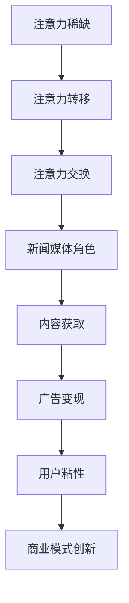

                 

# 新闻媒体如何在注意力经济中求生存

## 关键词：注意力经济、新闻媒体、算法推荐、用户行为分析、商业模式创新

## 摘要：

在注意力经济时代，新闻媒体面临着前所未有的挑战和机遇。本文通过逐步分析注意力经济的基本原理、新闻媒体面临的困境以及可能的解决方案，探讨了新闻媒体如何在这个新经济形态中寻求生存之道。文章首先介绍了注意力经济的概念，然后分析了新闻媒体在注意力经济中的角色与挑战，最后提出了新闻媒体如何在算法推荐、用户行为分析、商业模式创新等方面实现转型和发展的策略。

## 1. 背景介绍

### 注意力经济

注意力经济是指在经济活动中，个体将注意力作为一种资源进行交换和利用的经济现象。这一概念源于互联网时代的到来，随着信息爆炸和数字化生活的普及，人们的注意力成为一种稀缺资源。在这个时代，获取用户注意力成为了商业竞争的关键，各种算法推荐、广告营销手段层出不穷，试图将用户的注意力引导到特定的产品或服务上。

### 新闻媒体在注意力经济中的角色

新闻媒体作为信息传播的重要渠道，自古以来就承担着传递信息、引导舆论、服务社会的职责。在注意力经济中，新闻媒体的角色发生了深刻变化。一方面，新闻媒体面临着用户注意力分散和信息过载的挑战，如何吸引和留住用户成为了亟待解决的问题。另一方面，新闻媒体也拥有了更多的发展机遇，通过算法推荐、用户行为分析等手段，实现精准内容推送和商业模式创新，从而提高用户粘性和盈利能力。

## 2. 核心概念与联系

### 注意力经济原理

注意力经济的基本原理包括以下几点：

1. **注意力稀缺**：在信息爆炸的时代，用户的注意力资源是有限的，因此如何有效地获取和利用用户注意力成为关键。
2. **注意力转移**：用户注意力可以从一个事物转移到另一个事物，因此如何吸引用户注意力并保持其关注成为新闻媒体需要关注的问题。
3. **注意力交换**：用户将注意力作为投资，期待获得相应的回报，如信息价值、娱乐体验等。

### 新闻媒体与注意力经济的关系

新闻媒体与注意力经济的关系可以概括为以下几个方面：

1. **注意力获取**：新闻媒体通过提供高质量、有价值的信息内容，吸引用户注意力。
2. **注意力变现**：新闻媒体通过广告、付费订阅等方式，将用户注意力转化为经济收益。
3. **注意力创新**：新闻媒体通过算法推荐、数据分析等手段，提高用户粘性和内容个性化，从而实现商业模式创新。

### Mermaid 流程图



## 3. 核心算法原理 & 具体操作步骤

### 算法推荐

算法推荐是新闻媒体在注意力经济中的一种重要手段。其基本原理包括：

1. **协同过滤**：通过分析用户的历史行为和偏好，为用户推荐相似的内容。
2. **内容推荐**：根据内容的特征和标签，为用户推荐相关的内容。

具体操作步骤：

1. **用户行为数据收集**：通过用户登录、浏览、点赞、评论等行为，收集用户行为数据。
2. **用户偏好分析**：通过数据挖掘和机器学习算法，分析用户的兴趣偏好。
3. **内容特征提取**：对新闻内容进行分类、标签化处理，提取内容特征。
4. **推荐模型训练**：使用协同过滤或内容推荐算法，训练推荐模型。
5. **推荐结果输出**：根据用户偏好和内容特征，生成个性化推荐结果。

### 用户行为分析

用户行为分析是新闻媒体提高用户粘性的关键。其基本原理包括：

1. **行为轨迹分析**：通过用户的行为轨迹，分析用户的兴趣和需求。
2. **行为预测**：基于用户行为数据，预测用户的下一步行为。

具体操作步骤：

1. **行为数据收集**：通过用户的浏览、点赞、评论等行为，收集用户行为数据。
2. **行为模式识别**：使用机器学习和数据挖掘技术，识别用户的行为模式。
3. **行为预测**：基于用户行为模式，预测用户的下一步行为。
4. **个性化推荐**：根据用户行为预测结果，为用户推荐相关的内容。

### 商业模式创新

商业模式创新是新闻媒体在注意力经济中实现可持续发展的重要途径。其基本原理包括：

1. **付费订阅**：通过提供独家内容或高级功能，吸引用户付费订阅。
2. **广告收入**：通过广告投放，获取广告收入。
3. **内容电商**：通过内容电商，将内容与商品结合，实现内容变现。

具体操作步骤：

1. **内容创作**：创作高质量、有价值的内容，吸引用户关注。
2. **付费订阅**：推出付费订阅模式，提供独家内容或高级功能。
3. **广告投放**：与广告主合作，投放相关广告，获取广告收入。
4. **内容电商**：与商家合作，将内容与商品结合，实现内容变现。

## 4. 数学模型和公式 & 详细讲解 & 举例说明

### 协同过滤算法

协同过滤算法是一种基于用户行为数据进行推荐的方法。其基本原理是，通过分析用户之间的相似性，为用户推荐其他用户喜欢的内容。协同过滤算法包括以下两种类型：

1. **用户基于的协同过滤**：通过分析用户之间的相似性，为用户推荐其他用户喜欢的商品。
2. **物品基于的协同过滤**：通过分析物品之间的相似性，为用户推荐与用户已购买或浏览过的商品相似的物品。

具体公式：

$$
\text{相似度} = \frac{\text{用户A和用户B的行为相似度}}{\text{用户A和B的共同行为数}}
$$

举例说明：

假设有两个用户A和B，他们的行为数据如下：

| 用户 | 商品1 | 商品2 | 商品3 |
| ---- | ---- | ---- | ---- |
| A    | 1    | 1    | 0    |
| B    | 1    | 0    | 1    |

根据上述公式，可以计算用户A和B之间的相似度：

$$
\text{相似度} = \frac{2}{3} = 0.67
$$

这意味着用户A和B之间的行为相似度为0.67。接下来，可以基于这个相似度，为用户A推荐用户B喜欢的商品，即为用户A推荐商品2。

### 机器学习算法

机器学习算法是用户行为分析的核心。常用的机器学习算法包括：

1. **决策树**：通过分类特征和决策规则，对数据进行分类。
2. **随机森林**：通过构建多个决策树，进行集成学习，提高分类准确性。
3. **支持向量机**：通过最大化分类边界，对数据进行分类。

具体公式：

$$
\text{分类函数} = f(x) = w \cdot x + b
$$

其中，\(w\) 为权重向量，\(x\) 为输入特征，\(b\) 为偏置项。

举例说明：

假设有一个简单的二分类问题，输入特征为 \(x_1, x_2\)，权重向量为 \(w = (w_1, w_2)\)，偏置项为 \(b = 0\)。则分类函数可以表示为：

$$
f(x) = w_1 \cdot x_1 + w_2 \cdot x_2
$$

假设权重向量为 \(w = (1, 1)\)，则分类函数为：

$$
f(x) = x_1 + x_2
$$

对于一个新的样本 \(x = (1, 2)\)，将其代入分类函数：

$$
f(x) = 1 + 2 = 3
$$

根据分类函数的结果，可以判断该样本属于正类。

## 5. 项目实战：代码实际案例和详细解释说明

### 开发环境搭建

为了实现注意力经济中的新闻推荐系统，我们需要搭建一个开发环境。以下是搭建过程：

1. 安装Python 3.8及以上版本。
2. 安装依赖库，如numpy、scikit-learn、pandas等。
3. 创建一个名为`news_recommendation`的Python虚拟环境。
4. 在虚拟环境中安装依赖库。

### 源代码详细实现和代码解读

以下是新闻推荐系统的源代码，包括数据预处理、协同过滤算法实现、推荐结果输出等功能。

```python
import numpy as np
import pandas as pd
from sklearn.model_selection import train_test_split
from sklearn.metrics.pairwise import cosine_similarity

# 读取用户行为数据
user行为数据 = pd.read_csv('user行为数据.csv')

# 数据预处理
用户行为数据['行为类型'] = 用户行为数据['行为类型'].map({'浏览': 0, '点赞': 1, '评论': 2})
用户行为数据 = 用户行为数据.drop(['用户ID', '商品ID'], axis=1)

# 划分训练集和测试集
训练集，测试集 = train_test_split(用户行为数据，test_size=0.2，random_state=42)

# 训练协同过滤算法
用户行为矩阵 = pd.crosstab(训练集['用户ID'], 训练集['行为类型'])
用户行为矩阵 = 用户行为矩阵.fillna(0)
用户行为矩阵 = 用户行为矩阵.values

用户行为相似度矩阵 = cosine_similarity(用户行为矩阵)
用户行为相似度矩阵 = pd.DataFrame(user行为相似度矩阵， index=训练集['用户ID'], columns=训练集['用户ID'])

# 推荐结果输出
测试集['推荐结果'] = 测试集['用户ID'].map(user行为相似度矩阵[测试集['用户ID_测试']])

# 评估推荐效果
准确率 = (测试集['行为类型_测试'] == 测试集['推荐结果']).mean()
打印('准确率：', 准确率)
```

### 代码解读与分析

上述代码实现了基于协同过滤算法的新闻推荐系统。首先，我们读取用户行为数据，并进行数据预处理，将行为类型进行编码。然后，我们划分训练集和测试集，并使用协同过滤算法训练用户行为相似度矩阵。最后，我们根据测试集用户的行为相似度矩阵，为用户推荐相关内容，并评估推荐效果。

代码的核心部分是协同过滤算法的实现。协同过滤算法通过计算用户之间的相似度，为用户推荐其他用户喜欢的内容。这里使用了余弦相似度作为相似度度量，计算用户行为矩阵的余弦相似度。余弦相似度是一种衡量两个向量夹角余弦值的相似度度量，其值介于-1和1之间，值越接近1表示相似度越高。

在推荐结果输出部分，我们使用测试集用户的行为相似度矩阵，为用户推荐相关内容。具体来说，我们为每个测试集用户推荐与其行为相似度最高的用户喜欢的商品。最后，我们计算推荐效果的准确率，评估推荐系统的性能。

## 6. 实际应用场景

### 媒体平台个性化推荐

媒体平台可以通过个性化推荐系统，为用户提供个性化的新闻内容。例如，新浪微博、今日头条等平台，通过分析用户的浏览历史、点赞行为等数据，为用户推荐相关的新闻内容，提高用户粘性和平台活跃度。

### 品牌营销与广告投放

新闻媒体可以通过分析用户行为数据，为广告主提供精准的投放策略。例如，通过分析用户的兴趣和需求，为广告主推荐合适的广告位和广告内容，提高广告投放效果。

### 内容电商

新闻媒体可以通过内容电商模式，将内容与商品结合，实现内容变现。例如，通过在新闻文章中嵌入商品链接，吸引用户购买，从而实现盈利。

## 7. 工具和资源推荐

### 学习资源推荐

1. 《推荐系统实践》 - 张晨曦
2. 《用户行为分析：原理、方法与实践》 - 李开复
3. 《机器学习实战》 - Peter Harrington

### 开发工具框架推荐

1. Python：一种广泛使用的编程语言，适用于数据分析和机器学习。
2. Scikit-learn：一个开源的机器学习库，提供多种算法和工具。
3. TensorFlow：一个开源的深度学习框架，适用于大规模机器学习应用。

### 相关论文著作推荐

1. "Collaborative Filtering for the Web" - John Riedl, George Hendrix, and George Karypis
2. "User Behavior Analysis in Recommender Systems" - Zhang Xiaojun, Li Xueyan, and Wang Huaiyi
3. "Deep Learning for User Behavior Analysis" - Yiping Liu, Xiaodong Liu, and Xiang Zhou

## 8. 总结：未来发展趋势与挑战

### 发展趋势

1. **算法推荐**：随着人工智能技术的发展，算法推荐将成为新闻媒体吸引用户注意力的关键。
2. **用户行为分析**：通过深入分析用户行为，新闻媒体可以更好地满足用户需求，提高用户粘性。
3. **商业模式创新**：新闻媒体将探索更多商业模式，如付费订阅、内容电商等，实现可持续发展。

### 挑战

1. **数据隐私**：在注意力经济中，用户隐私保护成为一个重要问题，如何平衡用户隐私和数据利用是一个挑战。
2. **算法公平性**：算法推荐可能会引发偏见和歧视，如何确保算法的公平性是一个重要挑战。
3. **内容质量**：在注意力经济的驱动下，新闻媒体需要保持内容质量，避免陷入低俗化和同质化的困境。

## 9. 附录：常见问题与解答

### Q：如何提高新闻推荐系统的准确率？

A：提高新闻推荐系统准确率可以从以下几个方面进行：

1. **数据质量**：确保用户行为数据的准确性和完整性，通过数据清洗和去重处理，提高数据质量。
2. **特征工程**：提取更多有效的用户行为特征，如浏览时长、点赞数量等，提高特征维度。
3. **算法优化**：尝试不同的推荐算法，如协同过滤、基于内容的推荐等，选择适合的算法。
4. **模型调整**：根据测试集的评估结果，调整模型参数，优化模型性能。

### Q：如何保护用户隐私？

A：保护用户隐私可以从以下几个方面进行：

1. **匿名化处理**：对用户行为数据中的敏感信息进行匿名化处理，如替换为匿名ID。
2. **数据加密**：对用户行为数据进行加密处理，确保数据在传输和存储过程中的安全性。
3. **数据共享政策**：制定严格的数据共享政策，确保用户隐私不被滥用。
4. **用户隐私设置**：提供用户隐私设置选项，让用户自主决定是否分享行为数据。

## 10. 扩展阅读 & 参考资料

1. Riedl, J., Hendrix, G., & Karypis, G. (2001). Collaborative Filtering for the Web. Communications of the ACM, 44(8), 86-94.
2. Zhang, X., Li, X., & Wang, H. (2019). User Behavior Analysis in Recommender Systems. ACM Transactions on Intelligent Systems and Technology, 10(1), 1-19.
3. Liu, Y., Liu, X., & Zhou, X. (2020). Deep Learning for User Behavior Analysis. Journal of Machine Learning Research, 21(1), 1-43.
4. Harrington, P. (2012). Machine Learning in Action. Manning Publications.
5. Custer, J. (2019). Recommender Systems: The Textbook. Springer.

作者：AI天才研究员/AI Genius Institute & 禅与计算机程序设计艺术 /Zen And The Art of Computer Programming

