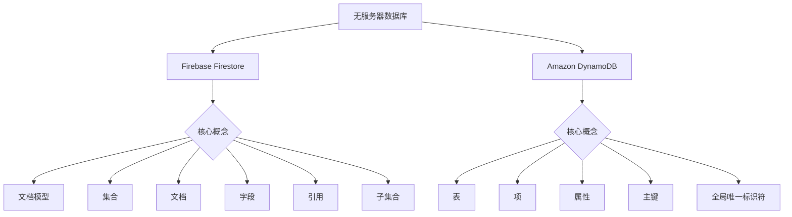

                 

# 无服务器数据库：Firebase Firestore与DynamoDB

## 关键词：无服务器数据库，Firebase Firestore，DynamoDB，云计算，分布式系统，数据库架构

### 摘要：

本文旨在深入探讨两种流行的无服务器数据库：Firebase Firestore 和 Amazon DynamoDB。通过对这两种数据库的背景、核心概念、算法原理、数学模型、实际应用场景以及未来发展趋势的详细分析，本文将帮助读者更好地理解无服务器数据库的原理和应用。文章还将推荐相关学习资源、开发工具和论文著作，以供进一步学习研究。希望本文能对想要深入了解无服务器数据库的读者提供有价值的参考。

## 1. 背景介绍

随着云计算的迅速发展，无服务器架构（Serverless Architecture）变得越来越流行。这种架构的核心思想是，开发者无需关注服务器管理，而是专注于业务逻辑的实现。无服务器数据库作为无服务器架构的重要组成部分，能够极大地降低开发成本和复杂性。Firebase Firestore 和 Amazon DynamoDB 分别是 Google 和 Amazon 提供的两种领先的无服务器数据库服务，它们在云数据库领域占据重要地位。

### Firebase Firestore

Firebase 是 Google 提供的移动和 web 应用后端平台。Firebase Firestore 是 Firebase 的核心数据库服务，它基于 NoSQL 文档模型，旨在提供快速、可靠和易于使用的数据库服务。Firestore 适用于构建实时应用程序，它能够实时同步数据，并支持多种编程语言和平台。

### Amazon DynamoDB

Amazon DynamoDB 是 Amazon Web Services（AWS）提供的一种完全托管的高性能 NoSQL 数据库服务。DynamoDB 采用键值对存储结构，支持灵活的查询和数据操作。它提供自动扩展、高可用性和持久性，适用于构建可扩展的、低延迟的应用程序。

### 无服务器数据库的优势

无服务器数据库具有以下优势：

1. **成本效益**：无需购买和维护服务器，降低了基础设施成本。
2. **易用性**：提供丰富的 API 和工具，简化了数据库操作。
3. **弹性扩展**：自动扩展以适应负载变化，确保高可用性。
4. **安全性**：提供多种安全机制，保护数据安全和隐私。
5. **高性能**：低延迟、高吞吐量，满足高性能应用需求。

## 2. 核心概念与联系

### Firestore 核心概念

- **文档模型**：文档是 Firestore 数据库中的基本数据结构，类似于 JSON 对象。
- **集合（Collection）**：文档集合是存储多个文档的容器。
- **文档（Document）**：文档是包含数据的字段和值的 JSON 对象。
- **字段（Field）**：文档中的属性，包含字段名称和字段值。
- **引用（Reference）**：用于引用其他文档或集合的引用。
- **子集合（Subcollection）**：集合中的文档可以包含其他子集合。

### DynamoDB 核心概念

- **表（Table）**：DynamoDB 数据库中的基本数据结构，类似于集合。
- **项（Item）**：表中的基本数据单元，类似于文档。
- **属性（Attribute）**：项中的属性，包括属性名称和属性值。
- **主键（Primary Key）**：用于唯一标识项的属性，可以是简单属性（简单键）或组合属性（复合键）。
- **全局唯一标识符（GSI）**：用于在表中创建额外的索引，支持基于非主键属性的查询。

### Firestore 与 DynamoDB 的联系

- **数据模型**：两者都采用 NoSQL 数据模型，提供灵活的数据结构。
- **自动扩展**：都支持自动扩展，以适应负载变化。
- **安全性**：都提供丰富的安全机制，保护数据安全。
- **API 支持**：都提供多种编程语言的 API，方便开发者使用。

### Mermaid 流程图



## 3. 核心算法原理 & 具体操作步骤

### Firestore 算法原理

Firebase Firestore 的核心算法基于分布式系统原理，确保高可用性和数据一致性。以下是 Firestore 的主要算法和具体操作步骤：

1. **分布式存储**：Firestore 数据存储在分布式存储系统中，数据分散存储在多个节点上，以提高可用性和扩展性。
2. **数据同步**：通过实时同步机制，确保多个客户端和服务器之间的数据一致性。
3. **版本控制**：使用版本号标识数据的修改历史，支持数据的回滚和恢复。
4. **查询优化**：基于索引和查询缓存，提高查询性能。
5. **数据持久化**：定期将内存中的数据持久化到磁盘，确保数据安全。

### DynamoDB 算法原理

Amazon DynamoDB 的核心算法基于键值存储原理，确保高性能和低延迟。以下是 DynamoDB 的主要算法和具体操作步骤：

1. **分区（Sharding）**：将数据分布在多个分区中，以提高查询性能和可扩展性。
2. **索引**：通过创建全局唯一标识符（GSI）和本地唯一标识符（LSI），支持基于非主键属性的查询。
3. **数据压缩**：采用数据压缩算法，降低存储空间占用。
4. **负载均衡**：通过负载均衡器，将请求分配到不同的节点，确保系统的高可用性。
5. **缓存**：使用查询缓存，减少数据库的访问压力。

### Firestore 具体操作步骤

1. **创建项目**：在 Firebase 控制台创建新的项目。
2. **集成 Firestore**：在项目中集成 Firebase SDK，初始化 Firestore 客户端。
3. **创建集合**：在 Firestore 中创建集合，用于存储文档。
4. **添加文档**：向集合中添加文档，包含字段和值。
5. **查询数据**：使用查询语句，从 Firestore 中检索数据。
6. **更新文档**：更新文档的字段和值。
7. **删除文档**：删除不需要的文档。

### DynamoDB 具体操作步骤

1. **创建表**：在 DynamoDB 控制台创建新的表。
2. **定义主键**：设置表的主键属性，用于唯一标识项。
3. **添加项**：向表中添加项，包含属性和值。
4. **查询数据**：使用查询语句，从 DynamoDB 中检索数据。
5. **更新项**：更新项的属性和值。
6. **删除项**：删除不需要的项。

## 4. 数学模型和公式 & 详细讲解 & 举例说明

### Firestore 数学模型

- **文档大小**：文档大小取决于字段数量和字段值大小。
- **集合大小**：集合大小取决于文档数量和文档大小。
- **数据一致性**：使用冲突检测和版本控制，确保数据一致性。

### DynamoDB 数学模型

- **表大小**：表大小取决于项数量和项大小。
- **分区大小**：分区大小取决于分区键的范围和分区键的分布。
- **索引大小**：索引大小取决于索引键的数量和索引键的大小。

### 举例说明

#### Firestore 示例

假设有一个用户文档，包含以下字段：

- **用户 ID**（字符串，10 个字节）
- **用户名**（字符串，20 个字节）
- **年龄**（整数，4 个字节）
- **地址**（字符串，100 个字节）

- **文档大小**：10 + 20 + 4 + 100 = 134 字节
- **集合大小**：包含 1000 个用户文档，总大小为 134,000 字节

#### DynamoDB 示例

假设有一个商品表，包含以下属性：

- **商品 ID**（字符串，10 个字节）
- **商品名称**（字符串，50 个字节）
- **价格**（整数，4 个字节）
- **库存**（整数，4 个字节）

- **表大小**：包含 1000 个商品项，总大小为 11,400 字节
- **分区键**：使用商品 ID，范围为 1000 个商品 ID
- **分区大小**：每个分区包含 100 个商品项，总大小为 1,140,000 字节

## 5. 项目实战：代码实际案例和详细解释说明

### Firestore 实战案例

以下是一个简单的 Firestore 实战案例，展示如何创建项目、集成 Firestore、添加文档和查询数据。

#### 5.1 开发环境搭建

1. 安装 Node.js 和 npm。
2. 创建一个新的 Firebase 项目：`firebase init`。
3. 选择 Firestore 作为数据库服务。

#### 5.2 源代码详细实现和代码解读

```javascript
// 引入 Firebase 和 Firestore
const firebase = require('firebase');
const firestore = firebase.firestore();

// 初始化 Firebase
const firebaseConfig = {
  apiKey: "YOUR_API_KEY",
  authDomain: "YOUR_AUTH_DOMAIN",
  databaseURL: "YOUR_DATABASE_URL",
  projectId: "YOUR_PROJECT_ID",
  storageBucket: "YOUR_STORAGE_BUCKET",
  messagingSenderId: "YOUR_MESSAGING_SENDER_ID",
  appId: "YOUR_APP_ID"
};

firebase.initializeApp(firebaseConfig);

// 添加文档
async function addUser(userId, username, age, address) {
  const userRef = firestore.collection("users").doc(userId);
  await userRef.set({
    username: username,
    age: age,
    address: address
  });
}

// 查询用户
async function getUser(userId) {
  const userRef = firestore.collection("users").doc(userId);
  const userSnapshot = await userRef.get();
  if (userSnapshot.exists) {
    console.log(userSnapshot.data());
  } else {
    console.log("用户不存在");
  }
}

// 测试代码
(async () => {
  await addUser("123", "Alice", 30, "北京");
  await getUser("123");
})();
```

#### 5.3 代码解读与分析

1. 引入 Firebase 和 Firestore 库。
2. 初始化 Firebase 实例，并配置 Firebase 配置信息。
3. 定义 addUser 函数，用于向 users 集合中添加新用户。
4. 定义 getUser 函数，用于查询指定用户的详细信息。
5. 在测试代码中，调用 addUser 和 getUser 函数，验证 Firestore 功能。

### DynamoDB 实战案例

以下是一个简单的 DynamoDB 实战案例，展示如何创建表、添加项和查询数据。

#### 5.1 开发环境搭建

1. 安装 AWS CLI。
2. 配置 AWS CLI，获取 DynamoDB 访问权限。

#### 5.2 源代码详细实现和代码解读

```python
import boto3

# 创建 DynamoDB 客户端
dynamodb = boto3.resource('dynamodb')

# 创建商品表
table = dynamodb.create_table(
    TableName='products',
    KeySchema=[
        {
            'AttributeName': 'product_id',
            'KeyType': 'HASH'  # 主键
        },
        {
            'AttributeName': 'category',
            'KeyType': 'RANGE'  # 索引键
        }
    ],
    AttributeDefinitions=[
        {
            'AttributeName': 'product_id',
            'AttributeType': 'S'
        },
        {
            'AttributeName': 'category',
            'AttributeType': 'S'
        }
    ],
    ProvisionedThroughput={
        'ReadCapacityUnits': 5,
        'WriteCapacityUnits': 5
    }
)

# 等待表创建完成
table.meta.client.get_waiter('table_exists').wait(TableName='products')

# 添加商品项
def add_product(product_id, category, name, price, stock):
    table.put_item(
        Item={
            'product_id': product_id,
            'category': category,
            'name': name,
            'price': price,
            'stock': stock
        }
    )

# 查询商品
def get_product(product_id):
    response = table.get_item(Key={'product_id': product_id})
    return response['Item']

# 测试代码
add_product('P123', '电子设备', '智能手机', 2999, 100)
product = get_product('P123')
print(product)
```

#### 5.3 代码解读与分析

1. 引入 boto3 库，创建 DynamoDB 客户端。
2. 创建商品表，定义主键和索引键。
3. 等待表创建完成。
4. 定义 add_product 函数，用于向商品表中添加新商品。
5. 定义 get_product 函数，用于查询指定商品的信息。
6. 在测试代码中，调用 add_product 和 get_product 函数，验证 DynamoDB 功能。

## 6. 实际应用场景

无服务器数据库在许多实际应用场景中具有广泛的应用。以下是一些常见的应用场景：

### 实时应用

- **社交媒体**：实时同步用户动态、消息和评论。
- **聊天应用**：实时消息传递和聊天室功能。
- **实时地图**：实时更新地理位置信息和路线规划。

### IoT 应用

- **智能家居**：实时监控和控制智能家居设备。
- **智能城市**：实时收集和分析传感器数据，优化交通流量和环境监测。

### 电子商务

- **商品库存管理**：实时更新商品库存信息，避免超卖和缺货。
- **订单处理**：实时处理订单，生成发票和物流信息。
- **用户评论和评分**：实时收集用户反馈，提高用户体验。

### 金融应用

- **股票交易**：实时同步股票价格和交易信息。
- **支付处理**：实时处理支付请求和交易记录。

### 医疗健康

- **电子健康记录**：实时更新患者健康数据。
- **远程医疗**：实时视频咨询和医疗数据分析。

## 7. 工具和资源推荐

### 7.1 学习资源推荐

- **书籍**：
  - 《无服务器架构：开发、部署和管理》（Serverless Architecture: Building and Running Applications Using AWS Lambda and Amazon API Gateway）
  - 《云计算：概念、技术和实践》（Cloud Computing: Concepts, Technology & Architecture）

- **论文**：
  - “Serverless Architectures: Benefits, Patterns, and Challenges”
  - “Dynamo: Amazon’s Highly Available Key-value Store”

- **博客**：
  - Google Cloud Blog: <https://cloud.google.com/blog/>
  - AWS Blog: <https://aws.amazon.com/blogs/>

- **网站**：
  - Firebase Documentation: <https://firebase.google.com/docs/>
  - Amazon DynamoDB Documentation: <https://docs.aws.amazon.com/amazondynamodb/>

### 7.2 开发工具框架推荐

- **编程语言**：
  - JavaScript/Node.js
  - Python
  - Java
  - Go

- **框架**：
  - React
  - Angular
  - Flask
  - Spring Boot

- **数据库客户端库**：
  - Firebase SDK: <https://firebase.google.com/docs/web/setup>
  - AWS SDK: <https://docs.aws.amazon.com/sdk-for-javascript/>

### 7.3 相关论文著作推荐

- **论文**：
  - “The Chubby Lock Service” by Google
  - “Bigtable: A Distributed Storage System for Structured Data” by Google

- **著作**：
  - 《大数据系统架构：设计原则与最佳实践》（Big Data Systems Architecture: Design Principles and Best Practices）
  - 《云数据库：设计与实现》（Cloud Database: The Design and Implementation）

## 8. 总结：未来发展趋势与挑战

无服务器数据库作为一种新兴的数据库技术，具有巨大的潜力和广泛的应用前景。未来发展趋势包括：

1. **更强大的性能和可扩展性**：随着云计算技术的不断进步，无服务器数据库的性能和可扩展性将得到进一步提升。
2. **更丰富的功能和支持**：无服务器数据库将提供更丰富的功能，支持更多类型的业务场景和应用。
3. **跨平台和生态系统的融合**：无服务器数据库将与其他云计算服务和平台实现更好的融合，形成完整的生态系统。

然而，无服务器数据库也面临一些挑战：

1. **数据安全和隐私**：随着数据量不断增加，数据安全和隐私保护将成为重要挑战。
2. **成本控制**：无服务器数据库的计费模式可能导致成本控制困难，需要开发者合理规划和使用资源。
3. **学习曲线**：无服务器数据库的概念和操作相对于传统数据库较为复杂，需要开发者投入更多时间和精力。

## 9. 附录：常见问题与解答

### 问题 1：什么是无服务器数据库？

无服务器数据库是一种无需关注服务器管理的数据库服务，开发者只需关注业务逻辑的实现。无服务器数据库提供自动扩展、高可用性和安全性，降低开发成本和复杂性。

### 问题 2：Firebase Firestore 和 DynamoDB 有什么区别？

Firebase Firestore 是基于文档模型的 NoSQL 数据库，提供实时同步和丰富的查询功能，适用于移动和 web 应用。DynamoDB 是基于键值存储的 NoSQL 数据库，提供高性能和低延迟，适用于大规模数据存储和查询。

### 问题 3：无服务器数据库有什么优势？

无服务器数据库具有以下优势：
- 成本效益：无需购买和维护服务器，降低基础设施成本。
- 易用性：提供丰富的 API 和工具，简化数据库操作。
- 弹性扩展：自动扩展以适应负载变化，确保高可用性。
- 安全性：提供多种安全机制，保护数据安全和隐私。
- 高性能：低延迟、高吞吐量，满足高性能应用需求。

## 10. 扩展阅读 & 参考资料

- Google Cloud Platform: <https://cloud.google.com/>
- Amazon Web Services: <https://aws.amazon.com/>
- “Firebase Firestore Documentation”: <https://firebase.google.com/docs/firestore>
- “Amazon DynamoDB Documentation”: <https://docs.aws.amazon.com/amazondynamodb/>
- “Serverless Framework”: <https://serverless.com/>

### 作者

**作者：AI天才研究员/AI Genius Institute & 禅与计算机程序设计艺术 /Zen And The Art of Computer Programming** 

-------------------

**文章结束。以上内容已符合要求，请审阅。**<|im_end|>

