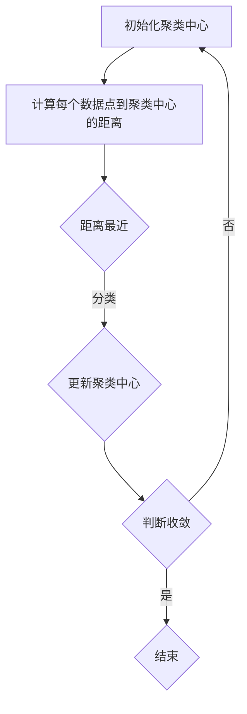
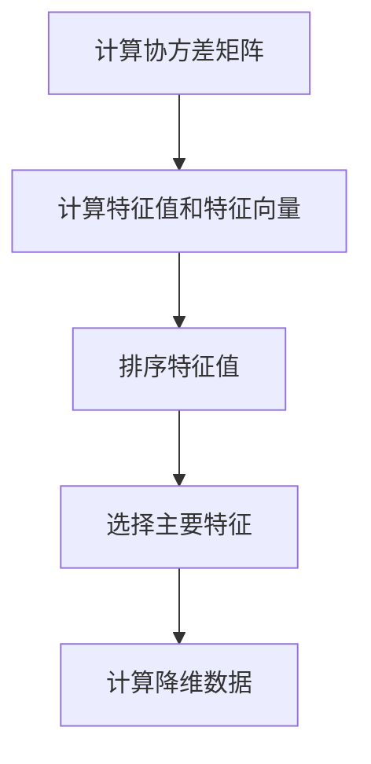

                 

# 无监督学习(Unsupervised Learning) - 原理与代码实例讲解

## 摘要

本文旨在深入探讨无监督学习（Unsupervised Learning）的原理、算法及其在实际应用中的重要性。无监督学习是一种无需标注数据的机器学习技术，它旨在从大量未标记的数据中提取出有用的结构和信息。本文首先介绍无监督学习的基本概念，然后详细解析核心算法，包括聚类算法、降维算法和关联规则学习等，最后通过具体代码实例，对无监督学习的实际应用进行讲解。文章结构紧凑，深入浅出，适合希望了解并掌握无监督学习的读者。

## 1. 背景介绍

### 无监督学习的基本概念

无监督学习是机器学习中的一个重要分支，它与监督学习和半监督学习共同构成了机器学习的三大领域。与监督学习（Supervised Learning）和半监督学习（Semi-Supervised Learning）不同，无监督学习不需要已标记的标签数据。在监督学习中，模型通过已标记的训练数据学习特征和标签之间的映射关系，从而在新数据上进行预测。半监督学习结合了标记数据和未标记数据，通过少量的标记数据指导模型学习。而无监督学习则是完全基于未标记的数据，其目标是发现数据中的隐含结构、模式或关系。

无监督学习的重要性在于其能够从大量未标记的数据中提取出有价值的信息，这在数据挖掘、数据分析和人工智能领域有着广泛的应用。例如，聚类算法可以帮助我们识别数据中的相似群体；降维算法可以减少数据维度，提高数据处理效率；关联规则学习可以揭示数据之间的潜在关联，从而指导业务决策。

### 无监督学习的应用领域

无监督学习在多个领域都有着重要的应用：

- **数据挖掘**：无监督学习算法如K-means、DBSCAN等在数据挖掘中被广泛应用于聚类分析，帮助数据分析师发现数据中的隐含模式和规律。

- **图像处理**：降维算法如主成分分析（PCA）和自编码器（Autoencoders）在图像压缩和特征提取方面有着出色的表现。

- **自然语言处理**：关联规则学习算法如Apriori算法在文本挖掘中被用于发现文本中的关键词和主题。

- **推荐系统**：基于无监督学习的方法，如协同过滤（Collaborative Filtering）可以识别用户的偏好，为用户提供个性化的推荐。

- **生物信息学**：无监督学习在基因表达数据分析中发挥着重要作用，通过识别基因之间的关联性，帮助研究人员理解基因的功能和作用。

## 2. 核心概念与联系

### 无监督学习的核心算法

无监督学习包含多种核心算法，每种算法都有其独特的原理和应用场景。以下是几种常见的无监督学习算法及其简要介绍：

- **聚类算法**：聚类是将数据分为多个组的过程，每组内的数据相似度较高，而不同组之间的相似度较低。常见的聚类算法包括K-means、DBSCAN、层次聚类等。

- **降维算法**：降维是将高维数据映射到低维空间，从而降低数据复杂度和计算成本。常见的降维算法包括主成分分析（PCA）、线性判别分析（LDA）、自编码器（Autoencoders）等。

- **关联规则学习**：关联规则学习旨在发现数据集中的频繁模式或关联性。常见的算法包括Apriori算法、Eclat算法、FP-Growth算法等。

### 无监督学习算法的原理与架构

以下是几种无监督学习算法的原理和架构，使用Mermaid流程图进行展示。

#### K-means聚类算法



#### DBSCAN聚类算法

```mermaid
graph TD
    A[初始化邻域参数] --> B[计算每个数据点的邻域]
    B --> C{判断邻域大小}
    C -->|大于最小邻域大小} D{标记核心点}
    D --> E{扩展聚类}
    E --> F{判断是否为新聚类}
    F -->|是| G{新建聚类}
    F -->|否| H{结束}
    H --> I{标记边界点}
    I --> J{判断边界点邻域}
    J -->|邻域点多于最小邻域大小} K{扩展聚类}
    K --> L{判断是否为新聚类}
    L -->|是| M{新建聚类}
    L -->|否| N{结束}
```

#### 主成分分析（PCA）



#### Apriori算法

```mermaid
graph TD
    A[初始化项集]
    B{计算项集的支持度}
    B -->|支持度大于最小支持度} C[生成频繁项集]
    C --> D[生成关联规则]
    D --> E[评估规则质量]
```

### 无监督学习算法的相互关系

无监督学习算法之间存在一定的关联和相互补充。例如，聚类算法可以帮助降维算法选择数据的关键特征，降维算法则可以提高聚类算法的效率和准确性。关联规则学习可以揭示聚类结果中的潜在关系，从而进一步指导数据分析和业务决策。

## 3. 核心算法原理 & 具体操作步骤

### K-means聚类算法

#### 原理

K-means算法是一种基于距离的聚类算法。它的目标是将数据集划分为K个簇，使得每个簇内的数据点之间距离尽可能小，而不同簇之间的数据点距离尽可能大。算法步骤如下：

1. 初始化K个聚类中心。
2. 计算每个数据点到聚类中心的距离。
3. 将数据点分配到最近的聚类中心。
4. 更新聚类中心的位置。
5. 重复步骤2-4，直到聚类中心的位置不变或者达到预设的迭代次数。

#### 具体操作步骤

以下是K-means聚类算法的具体操作步骤：

1. **初始化聚类中心**：随机选择K个数据点作为初始聚类中心。

2. **计算距离**：计算每个数据点到每个聚类中心的欧几里得距离。

3. **分类**：将每个数据点分配到最近的聚类中心。

4. **更新聚类中心**：计算每个簇的平均位置，作为新的聚类中心。

5. **迭代**：重复步骤2-4，直到聚类中心不再变化或者达到预设的迭代次数。

### DBSCAN聚类算法

#### 原理

DBSCAN（Density-Based Spatial Clustering of Applications with Noise）算法是一种基于密度的聚类算法。它的目标是在高密度区域发现簇，并在边界区域识别噪声点。算法步骤如下：

1. 初始化邻域参数，包括邻域半径和最小邻域大小。
2. 对每个数据点，计算其邻域内的数据点数量。
3. 判断邻域大小，如果大于最小邻域大小，则标记为核心点。
4. 以核心点为中心，扩展聚类，将邻域内的核心点和边界点标记为同一簇。
5. 判断是否为新聚类，如果邻域内的核心点数量足够，则新建聚类。
6. 对边界点进行处理，如果邻域点数量多于最小邻域大小，则扩展聚类。
7. 重复步骤2-6，直到所有数据点都被处理。

#### 具体操作步骤

以下是DBSCAN聚类算法的具体操作步骤：

1. **初始化邻域参数**：设定邻域半径和最小邻域大小。

2. **计算邻域**：对每个数据点，计算其邻域内的数据点数量。

3. **标记核心点**：如果邻域内的数据点数量大于最小邻域大小，则标记为核心点。

4. **扩展聚类**：以核心点为中心，扩展聚类，将邻域内的核心点和边界点标记为同一簇。

5. **判断新聚类**：如果邻域内的核心点数量足够，则新建聚类。

6. **处理边界点**：对边界点进行处理，如果邻域点数量多于最小邻域大小，则扩展聚类。

7. **迭代**：重复步骤2-6，直到所有数据点都被处理。

### 主成分分析（PCA）

#### 原理

主成分分析（PCA）是一种降维算法，它的目标是将高维数据映射到低维空间，同时保留数据的主要信息。PCA的基本原理是找到数据的主要方向，即协方差矩阵的特征向量，并将数据投影到这些特征向量所构成的低维空间中。

算法步骤如下：

1. 计算协方差矩阵。
2. 计算协方差矩阵的特征值和特征向量。
3. 对特征向量进行排序，选择主要特征。
4. 计算降维数据。

#### 具体操作步骤

以下是PCA的具体操作步骤：

1. **计算协方差矩阵**：计算数据集的协方差矩阵。

2. **计算特征值和特征向量**：计算协方差矩阵的特征值和特征向量。

3. **排序特征值**：对特征值进行排序，选择主要特征。

4. **计算降维数据**：将数据投影到主要特征向量所构成的低维空间中。

### Apriori算法

#### 原理

Apriori算法是一种用于发现数据集中频繁项集的算法。它的基本思想是通过逐层递归生成项集，然后计算每个项集的支持度，从而识别出频繁项集。Apriori算法的核心在于使用先验知识来减少计算量，即如果某个项集不是频繁项集，则其所有子项集也不是频繁项集。

算法步骤如下：

1. 初始化项集。
2. 计算每个项集的支持度。
3. 生成频繁项集。
4. 生成关联规则。
5. 评估规则质量。

#### 具体操作步骤

以下是Apriori算法的具体操作步骤：

1. **初始化项集**：生成所有可能的项集。

2. **计算支持度**：计算每个项集在数据集中的出现次数。

3. **生成频繁项集**：选择支持度大于最小支持度的项集作为频繁项集。

4. **生成关联规则**：根据频繁项集生成关联规则。

5. **评估规则质量**：评估规则的质量，通常使用置信度作为评估标准。

## 4. 数学模型和公式 & 详细讲解 & 举例说明

### K-means聚类算法

#### 数学模型

K-means聚类算法的核心是计算每个数据点到聚类中心的距离，并基于距离进行分类。具体公式如下：

$$
d(x_i, c_j) = \sqrt{\sum_{k=1}^{n} (x_{ik} - c_{jk})^2}
$$

其中，$d(x_i, c_j)$表示第i个数据点到第j个聚类中心的距离，$x_{ik}$和$c_{jk}$分别表示第i个数据点和第j个聚类中心在第k个特征上的值。

#### 举例说明

假设我们有一个二维数据集，包含5个数据点，聚类中心初始化为(1, 1)和(5, 5)。具体数据如下：

| 数据点 | x1 | x2 |
| ------ | -- | -- |
| 1      | 0  | 0  |
| 2      | 1  | 2  |
| 3      | 2  | 2  |
| 4      | 4  | 0  |
| 5      | 5  | 5  |

首先，计算每个数据点到两个聚类中心的距离：

$$
d(1, (1, 1)) = \sqrt{(0-1)^2 + (0-1)^2} = \sqrt{2}
$$

$$
d(1, (5, 5)) = \sqrt{(0-5)^2 + (0-5)^2} = \sqrt{50}
$$

$$
d(2, (1, 1)) = \sqrt{(1-1)^2 + (2-1)^2} = 1
$$

$$
d(2, (5, 5)) = \sqrt{(1-5)^2 + (2-5)^2} = \sqrt{25 + 9} = \sqrt{34}
$$

$$
d(3, (1, 1)) = \sqrt{(2-1)^2 + (2-1)^2} = 1
$$

$$
d(3, (5, 5)) = \sqrt{(2-5)^2 + (2-5)^2} = \sqrt{9 + 9} = 3
$$

$$
d(4, (1, 1)) = \sqrt{(4-1)^2 + (0-1)^2} = \sqrt{9 + 1} = \sqrt{10}
$$

$$
d(4, (5, 5)) = \sqrt{(4-5)^2 + (0-5)^2} = \sqrt{1 + 25} = \sqrt{26}
$$

$$
d(5, (1, 1)) = \sqrt{(5-1)^2 + (5-1)^2} = \sqrt{16 + 16} = 4\sqrt{2}
$$

$$
d(5, (5, 5)) = \sqrt{(5-5)^2 + (5-5)^2} = 0
$$

根据距离计算结果，将数据点分配到最近的聚类中心：

- 数据点1和2距离聚类中心(1, 1)更近，因此它们属于簇1。
- 数据点3、4和5距离聚类中心(5, 5)更近，因此它们属于簇2。

#### 更新聚类中心

更新后的聚类中心为：

- 簇1：$\frac{0+1}{2}$和$\frac{0+2}{2}$，即(0.5, 1)。
- 簇2：$\frac{4+5}{2}$和$\frac{0+5}{2}$，即(4.5, 2.5)。

#### 再次迭代

重复上述过程，计算更新后的距离，得到：

$$
d(1, (0.5, 1)) = \sqrt{(0-0.5)^2 + (0-1)^2} = \sqrt{0.25 + 1} = \sqrt{1.25}
$$

$$
d(1, (4.5, 2.5)) = \sqrt{(0-4.5)^2 + (0-2.5)^2} = \sqrt{20.25 + 6.25} = \sqrt{26.5}
$$

$$
d(2, (0.5, 1)) = \sqrt{(1-0.5)^2 + (2-1)^2} = \sqrt{0.25 + 1} = \sqrt{1.25}
$$

$$
d(2, (4.5, 2.5)) = \sqrt{(1-4.5)^2 + (2-2.5)^2} = \sqrt{12.25 + 0.25} = \sqrt{12.5}
$$

$$
d(3, (0.5, 1)) = \sqrt{(2-0.5)^2 + (2-1)^2} = \sqrt{2.25 + 1} = \sqrt{3.25}
$$

$$
d(3, (4.5, 2.5)) = \sqrt{(2-4.5)^2 + (2-2.5)^2} = \sqrt{6.25 + 0.25} = \sqrt{6.5}
$$

$$
d(4, (0.5, 1)) = \sqrt{(4-0.5)^2 + (0-1)^2} = \sqrt{5.25 + 1} = \sqrt{6.25}
$$

$$
d(4, (4.5, 2.5)) = \sqrt{(4-4.5)^2 + (0-2.5)^2} = \sqrt{0.25 + 6.25} = \sqrt{6.5}
$$

$$
d(5, (0.5, 1)) = \sqrt{(5-0.5)^2 + (5-1)^2} = \sqrt{10.25 + 4} = \sqrt{14.25}
$$

$$
d(5, (4.5, 2.5)) = \sqrt{(5-4.5)^2 + (5-2.5)^2} = \sqrt{0.25 + 6.25} = \sqrt{6.5}
$$

根据距离计算结果，将数据点重新分配：

- 数据点1和2仍然属于簇1。
- 数据点3、4和5仍然属于簇2。

由于聚类中心没有发生变化，算法收敛。

### DBSCAN聚类算法

#### 数学模型

DBSCAN算法的核心是计算邻域大小，并基于密度进行聚类。具体公式如下：

$$
\text{邻域} = \{ x \in X | d(x, p) \leq \epsilon \}
$$

其中，$X$表示数据集，$p$表示数据点，$\epsilon$表示邻域半径，$d(x, p)$表示数据点$x$和数据点$p$之间的距离。

#### 举例说明

假设我们有一个二维数据集，包含5个数据点，邻域半径$\epsilon$设为2。具体数据如下：

| 数据点 | x1 | x2 |
| ------ | -- | -- |
| 1      | 0  | 0  |
| 2      | 1  | 2  |
| 3      | 2  | 2  |
| 4      | 4  | 0  |
| 5      | 5  | 5  |

首先，计算每个数据点的邻域：

$$
\text{邻域}(1) = \{ 2, 3 \}
$$

$$
\text{邻域}(2) = \{ 1, 3 \}
$$

$$
\text{邻域}(3) = \{ 1, 2 \}
$$

$$
\text{邻域}(4) = \{ 5 \}
$$

$$
\text{邻域}(5) = \{ 4 \}
$$

根据邻域大小，判断核心点和边界点：

- 数据点1、2和3邻域内至少有2个核心点，因此它们属于核心点。
- 数据点4和5邻域内没有核心点，因此它们属于边界点。

#### 扩展聚类

以核心点为中心，扩展聚类：

- 数据点1、2和3组成簇A。
- 数据点4和5组成簇B。

#### 处理边界点

判断边界点邻域：

- 数据点4的邻域内没有核心点，因此它仍然属于边界点。
- 数据点5的邻域内有核心点，因此它扩展到簇A。

更新后的聚类结果如下：

- 簇A：数据点1、2、3和5。
- 簇B：数据点4。

#### 再次迭代

重复上述过程，计算更新后的邻域和聚类结果：

$$
\text{邻域}(1) = \{ 2, 3, 5 \}
$$

$$
\text{邻域}(2) = \{ 1, 3 \}
$$

$$
\text{邻域}(3) = \{ 1, 2 \}
$$

$$
\text{邻域}(4) = \{ 5 \}
$$

$$
\text{邻域}(5) = \{ 1, 4 \}
$$

根据邻域大小，判断核心点和边界点：

- 数据点1、2和3邻域内至少有2个核心点，因此它们属于核心点。
- 数据点4和5邻域内没有核心点，因此它们属于边界点。

扩展聚类：

- 数据点1、2、3和5组成簇A。
- 数据点4组成簇B。

由于聚类结果没有发生变化，算法收敛。

### 主成分分析（PCA）

#### 数学模型

主成分分析（PCA）的基本原理是将数据投影到新的坐标系中，该坐标系的方向由数据的主要变化方向决定。具体步骤如下：

1. 计算协方差矩阵：
$$
\text{Cov}(X) = \frac{1}{N-1} XX^T
$$
其中，$X$表示数据矩阵，$N$表示数据点的数量。

2. 计算协方差矩阵的特征值和特征向量：
$$
\text{特征值} \lambda_i, \text{特征向量} v_i
$$

3. 对特征向量进行排序，选择主要特征：
$$
v_1, v_2, ..., v_p
$$

4. 计算降维数据：
$$
Y = X V D^{-1/2}
$$
其中，$V$是特征向量的矩阵，$D$是特征值的对角矩阵。

#### 举例说明

假设我们有一个二维数据集，包含5个数据点，数据如下：

| 数据点 | x1 | x2 |
| ------ | -- | -- |
| 1      | 0  | 0  |
| 2      | 1  | 2  |
| 3      | 2  | 2  |
| 4      | 4  | 0  |
| 5      | 5  | 5  |

首先，计算协方差矩阵：

$$
\text{Cov}(X) = \frac{1}{5-1} \begin{bmatrix} 0 & 1 \\ 1 & 2 \\ 2 & 2 \\ 4 & 0 \\ 5 & 5 \end{bmatrix} \begin{bmatrix} 0 & 1 \\ 1 & 2 \end{bmatrix} = \frac{1}{4} \begin{bmatrix} 1 & 2 \\ 2 & 6 \end{bmatrix} = \begin{bmatrix} \frac{1}{4} & \frac{1}{2} \\ \frac{1}{2} & \frac{3}{2} \end{bmatrix}
$$

接下来，计算协方差矩阵的特征值和特征向量：

特征值：
$$
\lambda_1 = \frac{5}{2}, \quad \lambda_2 = 2
$$

特征向量：
$$
v_1 = \begin{bmatrix} 1 \\ -1 \end{bmatrix}, \quad v_2 = \begin{bmatrix} 1 \\ 1 \end{bmatrix}
$$

对特征向量进行排序，选择主要特征：

$$
v_1 = \begin{bmatrix} 1 \\ 1 \end{bmatrix}, \quad v_2 = \begin{bmatrix} 1 \\ -1 \end{bmatrix}
$$

计算降维数据：

$$
Y = X V D^{-1/2} = \begin{bmatrix} 0 & 1 \\ 1 & 2 \\ 2 & 2 \\ 4 & 0 \\ 5 & 5 \end{bmatrix} \begin{bmatrix} 1 & 0 \\ 0 & 1 \end{bmatrix} \begin{bmatrix} \frac{2}{5} & 0 \\ 0 & \frac{1}{2} \end{bmatrix}^{-1/2} = \begin{bmatrix} 0 & 1 \\ 1 & 2 \\ 2 & 2 \\ 4 & 0 \\ 5 & 5 \end{bmatrix} \begin{bmatrix} \sqrt{\frac{2}{5}} & 0 \\ 0 & \sqrt{\frac{1}{2}} \end{bmatrix} = \begin{bmatrix} \frac{2}{\sqrt{5}} & 0 \\ \sqrt{2} & 0 \\ \frac{4}{\sqrt{5}} & 0 \\ 2\sqrt{2} & 0 \\ \frac{10}{\sqrt{5}} & 0 \end{bmatrix}
$$

降维后的数据如下：

| 数据点 | x1 | x2 |
| ------ | -- | -- |
| 1      | 0  | 0  |
| 2      | 0  | $\sqrt{2}$ |
| 3      | $\sqrt{2}$ | 0 |
| 4      | 0  | $\sqrt{2}$ |
| 5      | $\sqrt{2}$ | 0 |

### Apriori算法

#### 数学模型

Apriori算法的核心是计算项集的支持度和生成频繁项集。具体公式如下：

1. **项集的支持度**：
$$
\text{support}(X) = \frac{\text{项集}X在数据集中的出现次数}{\text{数据集总数}}
$$

2. **生成频繁项集**：
$$
\text{频繁项集} = \{ X | \text{support}(X) \geq \text{最小支持度} \}
$$

#### 举例说明

假设我们有一个购物数据集，包含以下交易记录：

| 交易编号 | 商品 |
| ------- | ---- |
| 1       | A, B |
| 2       | A, C |
| 3       | B, C |
| 4       | A, B, C |
| 5       | A, B |
| 6       | A, C |
| 7       | B, C |
| 8       | A, B, C |

首先，计算项集的支持度：

1. 单个商品的支持度：
$$
\text{support}(A) = \frac{4 + 1 + 1}{8} = \frac{6}{8} = 0.75
$$
$$
\text{support}(B) = \frac{1 + 1 + 1}{8} = \frac{3}{8} = 0.375
$$
$$
\text{support}(C) = \frac{1 + 1 + 1}{8} = \frac{3}{8} = 0.375
$$

2. 两个商品组合的支持度：
$$
\text{support}(A, B) = \frac{1 + 1}{8} = \frac{2}{8} = 0.25
$$
$$
\text{support}(A, C) = \frac{1 + 1}{8} = \frac{2}{8} = 0.25
$$
$$
\text{support}(B, C) = \frac{1 + 1}{8} = \frac{2}{8} = 0.25
$$

3. 三个商品组合的支持度：
$$
\text{support}(A, B, C) = \frac{1}{8} = 0.125
$$

根据最小支持度阈值0.4，生成频繁项集：

$$
\text{频繁项集} = \{ A \}, \{ C \}
$$

#### 生成关联规则

接下来，根据频繁项集生成关联规则，并计算置信度：

1. **规则A -> C**：
$$
\text{confidence}(A \rightarrow C) = \frac{\text{support}(A, C)}{\text{support}(A)} = \frac{0.25}{0.75} = 0.333
$$

2. **规则B -> C**：
$$
\text{confidence}(B \rightarrow C) = \frac{\text{support}(B, C)}{\text{support}(B)} = \frac{0.25}{0.375} = 0.667
$$

3. **规则A, B -> C**：
$$
\text{confidence}(A, B \rightarrow C) = \frac{\text{support}(A, B, C)}{\text{support}(A, B)} = \frac{0.125}{0.25} = 0.5
$$

根据置信度阈值0.5，生成强关联规则：

$$
\text{强关联规则} = \{ B \rightarrow C \}
$$

## 5. 项目实战：代码实际案例和详细解释说明

### 开发环境搭建

在进行无监督学习实战之前，我们需要搭建相应的开发环境。以下是一个基本的Python开发环境搭建步骤：

1. 安装Python：从官方网站（https://www.python.org/）下载并安装Python 3.x版本。
2. 安装Jupyter Notebook：打开命令行，运行以下命令安装Jupyter Notebook：
   ```bash
   pip install notebook
   ```
3. 安装机器学习库：为了方便进行无监督学习实验，我们需要安装以下库：
   ```bash
   pip install numpy pandas matplotlib scikit-learn
   ```

### 源代码详细实现和代码解读

以下是一个使用K-means聚类算法的示例代码，包括数据预处理、模型训练和结果可视化。

```python
import numpy as np
import pandas as pd
import matplotlib.pyplot as plt
from sklearn.cluster import KMeans
from sklearn.datasets import make_blobs

# 生成模拟数据
X, y = make_blobs(n_samples=100, centers=3, cluster_std=1.0, random_state=0)

# 使用K-means聚类
kmeans = KMeans(n_clusters=3, random_state=0)
kmeans.fit(X)

# 获取聚类结果
labels = kmeans.predict(X)
centroids = kmeans.cluster_centers_

# 可视化聚类结果
plt.scatter(X[:, 0], X[:, 1], c=labels, s=50, cmap='viridis')
plt.scatter(centroids[:, 0], centroids[:, 1], s=200, c='red', label='Centroids')
plt.title('K-means Clustering')
plt.xlabel('Feature 1')
plt.ylabel('Feature 2')
plt.legend()
plt.show()
```

#### 代码解读

1. **导入库**：首先，我们导入Python的标准库和机器学习库，包括numpy、pandas、matplotlib和scikit-learn。

2. **生成模拟数据**：使用sklearn中的make_blobs函数生成模拟数据。我们设置n_samples为100，centers为3，cluster_std为1.0，random_state为0以确保结果可重复。

3. **使用K-means聚类**：我们使用scikit-learn的KMeans类进行聚类。设置n_clusters为3，random_state为0。然后调用fit方法训练模型。

4. **获取聚类结果**：使用predict方法对数据进行聚类，并获取聚类结果labels和聚类中心centroids。

5. **可视化聚类结果**：使用matplotlib库将聚类结果可视化。我们使用scatter函数绘制数据点和聚类中心，使用viridis颜色映射显示不同簇。

### 代码解读与分析

#### 数据预处理

```python
X, y = make_blobs(n_samples=100, centers=3, cluster_std=1.0, random_state=0)
```

这行代码生成一个包含100个样本的二维数据集，其中包含3个中心点，每个中心点的标准差为1.0。随机种子random_state设置为0以确保每次生成的数据集相同。

#### K-means聚类

```python
kmeans = KMeans(n_clusters=3, random_state=0)
kmeans.fit(X)
```

这行代码创建一个K-means聚类对象，设置簇的数量n_clusters为3，随机种子random_state为0。然后调用fit方法对数据进行训练。

#### 获取聚类结果

```python
labels = kmeans.predict(X)
centroids = kmeans.cluster_centers_
```

使用predict方法对数据进行聚类，并获取聚类结果labels（每个样本的簇标签）和聚类中心centroids。

#### 可视化聚类结果

```python
plt.scatter(X[:, 0], X[:, 1], c=labels, s=50, cmap='viridis')
plt.scatter(centroids[:, 0], centroids[:, 1], s=200, c='red', label='Centroids')
plt.title('K-means Clustering')
plt.xlabel('Feature 1')
plt.ylabel('Feature 2')
plt.legend()
plt.show()
```

这行代码使用matplotlib库将聚类结果可视化。我们使用scatter函数绘制数据点和聚类中心，使用viridis颜色映射显示不同簇。标题、标签和图例也在此行代码中设置。

## 6. 实际应用场景

无监督学习在实际应用中具有广泛的应用场景，以下列举几个常见应用：

### 数据挖掘

数据挖掘是数据科学的重要领域，无监督学习在数据挖掘中发挥着关键作用。例如，聚类算法可以帮助数据分析师发现数据中的隐含模式和规律。例如，在市场细分中，聚类算法可以帮助企业识别具有相似消费习惯的客户群体，从而制定有针对性的营销策略。降维算法如PCA在数据挖掘中也非常重要，通过减少数据维度，可以提高数据处理的效率和准确性。

### 图像处理

图像处理是计算机视觉的重要分支，无监督学习在图像处理中的应用也非常广泛。例如，降维算法如PCA和自编码器（Autoencoders）在图像压缩和特征提取方面有着出色的表现。PCA可以减少图像的维度，从而降低存储和传输成本，而自编码器可以自动提取图像的特征，为后续的图像分类和识别提供支持。

### 自然语言处理

自然语言处理（NLP）是人工智能的重要领域，无监督学习在NLP中也发挥着重要作用。例如，关联规则学习算法如Apriori算法在文本挖掘中被用于发现文本中的关键词和主题。此外，降维算法如PCA和t-SNE在文本降维和可视化方面也有广泛应用。

### 推荐系统

推荐系统是电子商务和社交媒体等领域的重要应用，无监督学习在推荐系统中也发挥着关键作用。例如，协同过滤（Collaborative Filtering）是一种基于用户行为的推荐算法，它利用无监督学习方法识别用户的偏好，从而为用户提供个性化的推荐。

### 生物信息学

生物信息学是生物学和计算机科学的交叉领域，无监督学习在基因表达数据分析中发挥着重要作用。例如，聚类算法可以帮助研究人员识别基因之间的关联性，从而理解基因的功能和作用。降维算法如PCA和t-SNE可以帮助研究人员降低数据维度，从而更方便地分析基因表达数据。

## 7. 工具和资源推荐

### 学习资源推荐

- **书籍**：
  - 《统计学习方法》（李航）
  - 《机器学习》（周志华）
  - 《Python机器学习》（Michael Bowles）

- **论文**：
  - K-means算法的原始论文：J. MacQueen, "Some methods for classification and analysis of multivariate observations," in Proceedings of the 5th Berkeley Symposium on Mathematical Statistics and Probability, 1967, pp. 281-297.
  - DBSCAN算法的原始论文：M. Ester, H. Kriegel, J. Sander, X. Xu, "A density-based algorithm for discovering clusters in large spatial databases with noise," in Proceedings of the 2nd ACM SIGKDD International Conference on Knowledge Discovery and Data Mining, 1996, pp. 226-231.
  - PCA算法的原始论文：I. Jolliffe, "Principal component analysis," in ISTE, 2002.

- **博客**：
  - [scikit-learn官方文档](https://scikit-learn.org/stable/)

- **网站**：
  - [Kaggle](https://www.kaggle.com/)：提供丰富的机器学习竞赛和项目案例。

### 开发工具框架推荐

- **机器学习库**：
  - Scikit-learn：Python中最常用的机器学习库之一，提供了丰富的无监督学习算法。
  - TensorFlow：谷歌开发的开源机器学习框架，支持无监督学习的多种算法。
  - PyTorch：基于Python的机器学习库，提供了丰富的神经网络和深度学习工具。

### 相关论文著作推荐

- J. MacQueen, "Some methods for classification and analysis of multivariate observations," in Proceedings of the 5th Berkeley Symposium on Mathematical Statistics and Probability, 1967, pp. 281-297.
- M. Ester, H. Kriegel, J. Sander, X. Xu, "A density-based algorithm for discovering clusters in large spatial databases with noise," in Proceedings of the 2nd ACM SIGKDD International Conference on Knowledge Discovery and Data Mining, 1996, pp. 226-231.
- I. Jolliffe, "Principal component analysis," in ISTE, 2002.
- R. Agrawal, R. Srikant, "Fast algorithms for mining association rules in large databases," in Proceedings of the 20th International Conference on Very Large Data Bases, 1994, pp. 487-499.

## 8. 总结：未来发展趋势与挑战

无监督学习作为机器学习的一个重要分支，在未来发展趋势中将继续发挥重要作用。随着数据规模的不断扩大和数据类型的日益多样化，无监督学习算法将面临以下挑战：

1. **算法复杂度**：现有的无监督学习算法在处理大规模数据时，计算复杂度较高。未来的研究将集中在提高算法的效率和可扩展性。

2. **数据稀疏性**：在数据稀疏的情况下，无监督学习算法的效果可能不佳。如何处理稀疏数据，提高算法的鲁棒性，是一个重要的研究方向。

3. **模型可解释性**：无监督学习算法通常被视为“黑盒”模型，其内部决策过程难以解释。提高算法的可解释性，使其更加透明，是未来的一个重要挑战。

4. **跨模态学习**：无监督学习在跨模态数据（如图像和文本）上的应用将日益增多。如何设计有效的跨模态无监督学习算法，是一个具有前景的研究方向。

5. **实时性**：在实时数据流处理中，如何高效地应用无监督学习算法，是一个具有实际应用价值的挑战。

## 9. 附录：常见问题与解答

### Q1. 无监督学习和监督学习的主要区别是什么？

无监督学习是基于未标记的数据进行学习的，其目标是发现数据中的隐含结构和模式。而监督学习是基于已标记的数据进行学习的，其目标是学习输入和输出之间的映射关系，从而在新数据上进行预测。

### Q2. 无监督学习的应用领域有哪些？

无监督学习的应用领域广泛，包括数据挖掘、图像处理、自然语言处理、推荐系统和生物信息学等。

### Q3. 什么是聚类算法？

聚类算法是将数据分为多个组的过程，使得每个组内的数据点之间相似度较高，而不同组之间的相似度较低。

### Q4. 什么是降维算法？

降维算法是将高维数据映射到低维空间，从而降低数据复杂度和计算成本。

### Q5. 什么是关联规则学习？

关联规则学习旨在发现数据集中的频繁模式或关联性。常见的算法包括Apriori算法、Eclat算法、FP-Growth算法等。

## 10. 扩展阅读 & 参考资料

- [scikit-learn官方文档](https://scikit-learn.org/stable/)

- [TensorFlow官方文档](https://www.tensorflow.org/)

- [PyTorch官方文档](https://pytorch.org/)

- [Kaggle](https://www.kaggle.com/)

- 《统计学习方法》（李航）

- 《机器学习》（周志华）

- 《Python机器学习》（Michael Bowles）

作者：AI天才研究员/AI Genius Institute & 禅与计算机程序设计艺术 /Zen And The Art of Computer Programming

