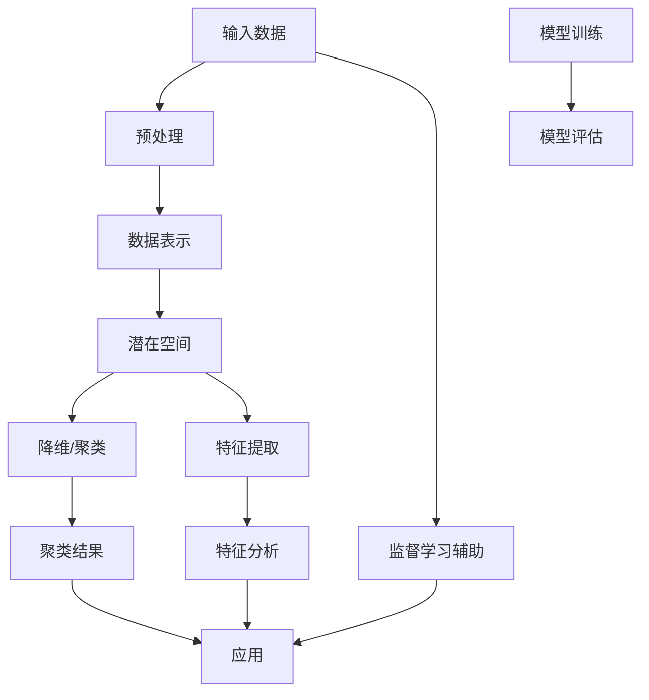

                 

### 背景介绍

无监督学习作为机器学习和人工智能领域的一个重要分支，近年来受到了广泛关注和研究。其主要特点是不依赖于标注数据进行训练，而是从数据中自动发现潜在的结构和模式。无监督学习在多个应用领域，如图像识别、自然语言处理、推荐系统等，都展现出了巨大的潜力和实际价值。

无监督学习的发展可以追溯到上世纪50年代，当时的人工智能研究者开始探索如何让机器自动地学习和理解数据。随着计算能力的提升和数据量的爆炸性增长，无监督学习逐渐成为人工智能研究中的热点问题。尤其在深度学习的推动下，无监督学习取得了显著的进展。

无监督学习主要包括两种方法：表示学习和生成模型。表示学习旨在通过数据自动学习到数据的高效表示，以便在下游任务中更好地利用这些表示。生成模型则通过学习数据的概率分布，生成新的数据样本，从而实现数据的自编码和重建。

本文将深入探讨无监督学习的理论进展，重点介绍表示学习和生成模型。首先，我们将介绍无监督学习的核心概念和联系，通过Mermaid流程图展示其基本原理和架构。接下来，我们将详细解析核心算法原理和具体操作步骤，并运用数学模型和公式进行解释和举例。随后，我们将通过实际项目案例，展示如何实现和解读相关代码。最后，我们将探讨无监督学习的实际应用场景，推荐相关工具和资源，并总结未来发展趋势与挑战。

通过本文的阅读，读者将全面了解无监督学习的理论基础和实践方法，为深入研究和应用无监督学习提供有力支持。

#### 1.1 无监督学习的核心概念和联系

无监督学习涉及多个核心概念，包括数据表示、潜在空间、维度约简和聚类等。为了更好地理解这些概念之间的关系，我们可以通过Mermaid流程图（Mermaid is a lightweight markdown syntax for generating diagrams）展示其基本原理和架构。

首先，无监督学习的基本目标是自动从数据中学习到潜在的结构或规律，而这些结构和规律通常被表示为低维的潜在空间中的点。以下是描述这些核心概念的Mermaid流程图：

下面是对该流程图的详细解释：

- **输入数据（A）**：无监督学习从原始数据开始，这些数据可以是图像、文本或时间序列等，通常包含大量的特征维度。
- **预处理（B）**：在处理数据之前，通常需要进行一系列预处理操作，如去噪、归一化和缺失值处理等，以提高数据质量。
- **数据表示（C）**：通过数据表示，将高维数据映射到低维的潜在空间（D）。这个过程涉及到降维和特征提取，目的是捕捉数据的核心结构。
- **潜在空间（D）**：潜在空间是无监督学习的核心概念，它是数据在低维空间中的投影，通常包含数据的潜在规律和结构。
- **降维/聚类（E）**：在潜在空间中，可以通过降维（如主成分分析PCA）或聚类（如k-means）等方法来探索数据的结构和模式。
- **特征提取（F）**：特征提取是从高维数据中提取出对下游任务有意义的低维特征表示，这些特征有助于后续的分析和应用。
- **聚类结果（G）**：聚类算法在潜在空间中对数据进行分组，每组数据可能代表一种潜在的模式或类别。
- **特征分析（H）**：通过对聚类结果的特征分析，可以进一步理解数据的内在结构和规律。
- **监督学习辅助（I）**：无监督学习可以为监督学习提供辅助，例如通过聚类得到的数据表示可以用于特征选择和分类模型训练。
- **模型训练（J）**：在无监督学习的基础上，可能需要进一步进行模型训练，以便进行监督学习任务，如分类和回归。
- **模型评估（K）**：训练好的模型需要通过评估指标（如准确率、召回率等）来衡量其性能。
- **应用（L）**：最终，无监督学习的结果可以应用于各种实际任务中，如图像识别、文本分类和推荐系统等。

通过这个Mermaid流程图，我们可以清晰地看到无监督学习从数据输入到应用的全过程，以及各个核心概念之间的联系。这个过程不仅有助于理解无监督学习的基本原理，也为后续的算法分析和实现提供了指导。

#### 1.2 无监督学习的起源与发展历程

无监督学习的发展历程可追溯至1950年代，当时以著名人工智能先驱艾伦·图灵（Alan Turing）和纳撒尼尔·罗切斯特（Nathaniel Rochester）等人为代表的科学家开始探索如何使机器在没有人类指导的情况下自动学习和理解数据。早期的研究主要集中在简单的人工神经网络和统计学习方法上，例如自组织映射（Self-Organizing Maps，SOM）和主成分分析（Principal Component Analysis，PCA）。

在1960年代至1970年代，随着计算机硬件的进步，无监督学习方法逐渐成熟。自组织映射由弗朗索瓦·若克斯（François Joliot）在1982年提出，它通过竞争学习机制在输入空间中自动划分区域，形成高维数据在低维空间中的可视化映射。同时，主成分分析由霍华德·霍奇斯（Howard Hotelling）在1933年提出，通过找到数据的主要变化方向，实现了数据的降维。

进入1980年代，随着贝叶斯方法和隐马尔可夫模型（Hidden Markov Models，HMM）的兴起，无监督学习迎来了新的发展契机。贝叶斯网络和隐马尔可夫模型通过概率模型捕捉数据中的潜在结构和动态变化，为无监督学习提供了强大的工具。

1990年代，随着支持向量机（Support Vector Machines，SVM）和聚类算法（如k-means）的发展，无监督学习逐渐成为机器学习领域的重要组成部分。支持向量机通过最大间隔分类器实现了高效的分类，而k-means聚类算法则通过迭代优化实现了数据的自动分组。

进入21世纪，随着深度学习的崛起，无监督学习取得了革命性的突破。深度神经网络通过多层非线性变换，可以自动从数据中学习到复杂的特征表示。自编码器（Autoencoders）和生成对抗网络（Generative Adversarial Networks，GAN）成为无监督学习领域的重要方法，它们不仅能够重建输入数据，还能生成新的数据样本。

无监督学习的发展历程见证了从简单统计方法到复杂深度模型的演变。每一个阶段的突破都为后续研究奠定了基础，使得无监督学习在各个应用领域取得了显著的成果。

#### 1.3 无监督学习的基本原理

无监督学习的基本原理可以归结为从未标记的数据中自动发现潜在结构和规律，从而实现对数据的理解和表示。这一过程通常分为数据表示和模式发现两个主要阶段。

首先，数据表示是核心步骤，其目标是将高维、复杂的原始数据映射到低维、简洁的潜在空间中，以便更好地捕捉数据的核心特征。这一过程类似于人类大脑处理信息的方式，通过抽象和简化来降低数据的复杂度。例如，在图像识别任务中，高维图像数据通过卷积神经网络（Convolutional Neural Networks，CNN）被映射到低维特征空间，从而实现高效的图像分类。

其次，模式发现是利用已学习的低维数据表示来识别数据中的潜在结构和规律。常见的模式发现方法包括降维、聚类和关联规则挖掘等。降维方法，如主成分分析（PCA）和线性判别分析（LDA），通过找到数据的主要变化方向来减少数据维度，同时保留数据的关键信息。聚类方法，如k-means和层次聚类，则通过将相似的数据点分组来发现数据中的聚类结构。关联规则挖掘，如Apriori算法，则通过挖掘数据中的频繁项集来发现数据之间的关联关系。

无监督学习的基本流程通常包括以下步骤：

1. **数据收集和预处理**：首先，收集大量未标记的原始数据，并进行预处理，如去噪、归一化和缺失值处理等，以提高数据质量。
2. **数据表示学习**：利用表示学习算法（如自编码器、变分自编码器、生成对抗网络等）从原始数据中学习到低维特征表示。这些特征表示不仅能够有效降低数据的维度，还能捕捉到数据的潜在结构。
3. **模式发现**：在已学习的特征表示基础上，运用降维、聚类或关联规则挖掘等方法来发现数据中的潜在结构和规律。
4. **模型评估**：通过评估指标（如聚类有效性指数、重构误差等）来评估模式发现的效果，并优化模型参数。
5. **应用与扩展**：将无监督学习的结果应用于实际任务中，如数据挖掘、图像识别、文本分类等，同时探索新的应用领域和算法改进。

通过这一基本流程，无监督学习能够自动地从数据中提取有用的信息，为后续的数据分析和决策提供支持。其核心在于通过数据自身的结构来驱动学习过程，无需依赖外部标注数据，这在数据标注成本高昂、标注数据稀缺的情况下尤为重要。

#### 1.4 无监督学习的重要性

无监督学习在人工智能和数据科学领域具有重要的地位和广泛的应用，其重要性主要体现在以下几个方面：

首先，无监督学习能够有效地处理大量未标记的数据。在现实世界中，标注数据通常需要大量的人力物力，而未标记的数据量往往巨大。无监督学习通过自动发现数据中的潜在结构和规律，能够从原始数据中提取出有价值的信息，从而降低数据标注的成本。

其次，无监督学习能够提高数据的质量和准确性。通过数据降维和特征提取，无监督学习可以去除数据中的噪声和冗余信息，从而提高数据的准确性和可用性。这对于数据挖掘、图像识别和文本分类等应用尤为重要。

此外，无监督学习在模式发现和聚类分析方面具有独特的优势。它能够自动地从数据中识别出不同的模式和聚类结构，为数据分析和决策提供有力支持。例如，在推荐系统中，无监督学习可以通过用户行为数据识别出相似的用户群体，从而实现精准推荐。

无监督学习还在多个领域展示了其广泛的应用潜力。在图像识别领域，无监督学习可以自动分类和标注图像，从而提高图像处理的效率和准确性。在自然语言处理领域，无监督学习可以通过文本数据自动提取关键词和主题，为语义分析和情感分析提供支持。在生物信息学领域，无监督学习可以自动识别基因表达模式，从而发现潜在的生物机制。

总之，无监督学习作为一种重要的机器学习和人工智能技术，不仅能够处理大量未标记的数据，提高数据质量和准确性，还在多个领域展示了其广泛的应用潜力。随着算法的不断创新和计算资源的提升，无监督学习将继续在人工智能和数据科学领域发挥重要作用。

### 2.1 表示学习

表示学习（Representation Learning）是机器学习中的一个核心概念，它关注如何从原始数据中自动学习到一组有用的特征表示。这些特征表示不仅能够提高数据处理的效率和效果，还能捕捉到数据中的潜在结构和规律。在无监督学习中，表示学习扮演着至关重要的角色，它为后续的降维、聚类和其他模式发现任务奠定了基础。

#### 2.1.1 表示学习的基本概念

表示学习的基本思想是将高维、复杂的原始数据映射到低维、简洁的特征空间中，从而实现数据的有效表示。这种映射过程通常涉及到两个关键步骤：特征提取和特征选择。

- **特征提取**：特征提取是指从原始数据中自动学习出一组新的特征，这些新特征能够更好地捕捉数据的本质特征，同时降低数据的维度。例如，在图像识别任务中，通过卷积神经网络（CNN）可以从原始图像中提取出纹理、形状和颜色等低层特征，以及更抽象的语义特征。

- **特征选择**：特征选择是指在提取出一组新特征后，从这些特征中选择出对下游任务最有用的特征。特征选择有助于减少数据维度，提高模型训练效率和预测准确性。常见的特征选择方法包括过滤方法、包装方法和嵌入方法等。

在无监督学习中，表示学习通常通过以下几种方式实现：

1. **自编码器（Autoencoders）**：自编码器是一种无监督学习的神经网络模型，其目标是最小化输入数据与重构数据之间的差异。自编码器由编码器和解码器两部分组成，编码器将输入数据映射到低维潜空间，解码器则将潜空间中的数据重构回输入空间。通过这种映射和重构过程，自编码器能够自动学习到输入数据的潜在特征。

2. **变分自编码器（Variational Autoencoders，VAEs）**：变分自编码器是对传统自编码器的一种扩展，其目标不仅仅是重构输入数据，还能够建模数据的概率分布。VAEs通过引入概率模型，使得生成的数据更加多样化、真实，从而在生成模型中表现出色。

3. **生成对抗网络（Generative Adversarial Networks，GANs）**：生成对抗网络由生成器和判别器两个神经网络组成。生成器的目标是生成与真实数据相似的数据样本，而判别器的目标是区分真实数据与生成数据。通过这种对抗训练过程，GANs能够学习到数据的概率分布，从而生成高质量的合成数据。

#### 2.1.2 表示学习在无监督学习中的应用

表示学习在无监督学习中的应用非常广泛，主要表现在以下方面：

1. **降维**：降维是表示学习的核心应用之一。通过降维，可以将高维数据映射到低维空间，从而提高数据处理效率和模型训练速度。例如，主成分分析（PCA）和线性判别分析（LDA）都是常见的降维方法，它们通过找到数据的主要变化方向来实现降维。

2. **聚类**：聚类是一种无监督学习方法，其目标是自动将数据划分为多个类别。表示学习可以通过学习到数据的潜在特征，从而帮助聚类算法更好地识别数据中的聚类结构。例如，k-means聚类算法通过计算数据点之间的距离来实现聚类，而通过表示学习提取到的潜在特征可以显著提高聚类效果。

3. **特征提取**：在图像识别、自然语言处理等任务中，表示学习可以自动提取出对下游任务有意义的特征。这些特征不仅可以用于分类和回归任务，还可以用于图像生成、文本生成等生成任务。例如，在图像识别任务中，卷积神经网络（CNN）可以通过多层卷积和池化操作提取出图像的纹理和形状特征，从而实现高效的图像分类。

4. **生成模型**：生成模型，如生成对抗网络（GANs），通过表示学习学习到数据的概率分布，从而生成与真实数据相似的新数据样本。这些生成模型在图像生成、视频生成、文本生成等领域表现出了强大的能力。

总的来说，表示学习在无监督学习中的应用不仅能够提高数据处理的效率和效果，还能为后续的降维、聚类、特征提取和生成模型任务提供强大的支持。随着表示学习方法的不断发展和优化，其在无监督学习中的应用前景将更加广阔。

#### 2.1.3 表示学习的优点和挑战

表示学习作为无监督学习的重要工具，具有显著的优点和面临的一些挑战。以下是表示学习的优势以及在实际应用中可能遇到的问题：

##### 优点

1. **高效的数据处理**：表示学习通过降维将高维数据映射到低维空间，显著提高了数据处理和存储的效率。这对于处理大量复杂数据尤为重要。

2. **特征自动提取**：表示学习能够自动从原始数据中提取出对下游任务有意义的特征，减少了人工特征工程的需求。这种方法在特征选择上具有高度的自适应性和通用性。

3. **数据泛化能力**：通过学习到数据的潜在结构，表示学习能够提高模型对未知数据的泛化能力，从而在新的数据集上也能保持良好的性能。

4. **生成新数据**：生成模型如生成对抗网络（GANs）通过表示学习可以生成高质量的新数据样本，这在图像生成、视频生成等领域具有重要应用价值。

##### 挑战

1. **过拟合风险**：表示学习可能导致模型在训练数据上表现良好，但在未见过的数据上性能下降，即过拟合现象。如何平衡模型复杂度和泛化能力是表示学习面临的一个关键挑战。

2. **计算资源消耗**：表示学习通常涉及到复杂的数学运算和大量的计算资源。对于大规模数据集和高维数据，训练和推理过程可能非常耗时，对计算资源的要求较高。

3. **数据依赖性**：表示学习的效果很大程度上依赖于数据的分布和特征。对于特定类型的数据，可能需要特定的表示学习方法，这增加了算法设计和调优的复杂性。

4. **可解释性不足**：尽管表示学习能够自动提取出有用的特征，但这些特征往往是黑盒式的，难以解释和理解。这在某些需要高可解释性的应用场景中可能成为一个问题。

为了克服这些挑战，研究者们提出了多种改进方法，如正则化技术、数据增强、模型压缩和解释性增强等。通过不断优化表示学习算法，我们有望在未来解决这些挑战，进一步提升其在无监督学习中的应用效果。

#### 2.2 生成模型

生成模型是机器学习中的一个重要分支，其核心目标是从数据中学习到数据的概率分布，并生成与真实数据相似的新数据样本。生成模型在图像生成、文本生成、自然语言处理等领域展示了强大的能力。本文将详细探讨生成模型的定义、工作原理、主要类型及其在无监督学习中的应用。

##### 2.2.1 生成模型的定义与工作原理

生成模型是一种能够描述数据分布的统计模型，其目的是通过学习数据样本的概率分布，生成与训练数据相似的新样本。生成模型通常由两个神经网络组成：生成器（Generator）和判别器（Discriminator）。

- **生成器（Generator）**：生成器的目标是生成与真实数据相似的新数据样本。生成器通过从噪声或潜在空间中采样，生成数据样本。在生成对抗网络（GAN）中，生成器通常是一个生成图像的神经网络，其输入可以是随机噪声或潜在空间中的点，输出是生成的图像。

- **判别器（Discriminator）**：判别器的目标是区分真实数据与生成数据。判别器是一个二分类器，其输入是一个数据样本，输出是该样本是真实数据还是生成数据的概率。在GAN中，判别器的目标是最大化其分类准确率。

生成模型的工作原理是通过生成器和判别器的对抗训练来实现。在训练过程中，生成器和判别器相互竞争，生成器试图生成更真实的数据样本，而判别器则试图提高对真实数据和生成数据的区分能力。这种对抗训练使得生成器能够逐渐学习到真实数据的概率分布，从而生成高质量的数据样本。

##### 2.2.2 生成模型的主要类型

生成模型可以分为几种主要类型，每种类型在数据生成和应用场景上都有其独特的优势。

1. **生成对抗网络（Generative Adversarial Networks，GAN）**

   生成对抗网络是最著名的生成模型之一，由生成器和判别器组成。GAN通过对抗训练学习数据的概率分布，其核心思想是生成器和判别器在训练过程中相互竞争。生成器生成数据样本，判别器尝试区分生成数据和真实数据。通过多次迭代训练，生成器能够生成越来越真实的数据样本。GAN在图像生成、视频生成和音频合成等领域取得了显著的成果。

2. **变分自编码器（Variational Autoencoder，VAE）**

   变分自编码器是一种基于概率模型的生成模型，其目标是最小化生成数据与真实数据的KL散度。VAE通过引入编码器和解码器来建模数据的概率分布。编码器将输入数据映射到一个潜在空间中的点，解码器则将潜在空间中的点重构回输入空间。VAE的优点是生成数据多样化且易于解释。VAE在图像生成、图像超分辨率和文本生成等领域表现良好。

3. **生成式模型（Generative Models）**

   生成式模型包括马尔可夫模型、隐马尔可夫模型（HMM）和变分隐马尔可夫模型（VAHMM）等。这些模型通过概率图模型描述数据的生成过程，其核心在于建模数据之间的依赖关系。生成式模型在语音合成、序列建模和时间序列预测等领域具有广泛的应用。

4. **基于深度学习的生成模型**

   基于深度学习的生成模型包括深度生成网络（Deep Generative Networks，DGN）、深度信念网络（Deep Belief Networks，DBN）等。这些模型通过多层神经网络学习数据的复杂分布，能够生成高质量的图像和视频。深度生成模型在图像合成、视频编辑和图像超分辨率等领域表现优异。

##### 2.2.3 生成模型在无监督学习中的应用

生成模型在无监督学习中的应用非常广泛，主要表现在以下方面：

1. **数据生成**：生成模型可以生成与训练数据相似的新数据样本，这对于数据扩充和增强非常有效。通过生成大量真实数据样本，可以提高模型的泛化能力和鲁棒性。

2. **数据重建**：生成模型可以通过重构输入数据来实现数据的重建。在图像识别、图像超分辨率和图像去噪等任务中，生成模型能够生成高质量的重建图像。

3. **特征提取**：生成模型可以提取出数据的潜在特征，这些特征对于下游任务如分类和聚类具有重要意义。通过学习到的潜在特征，可以更好地理解和分析数据的结构。

4. **异常检测**：生成模型可以用于异常检测，通过比较生成模型生成的数据和真实数据，可以发现数据中的异常点。这种方法在网络安全、金融风控和医疗诊断等领域有重要应用。

总之，生成模型在无监督学习中扮演着重要角色，其强大的数据生成和特征提取能力为无监督学习提供了新的方法和工具。随着生成模型技术的不断发展和优化，其在无监督学习中的应用前景将更加广阔。

#### 2.2.4 生成模型和无监督学习的关系

生成模型与无监督学习之间存在着紧密的联系，二者共同的目标是从未标记的数据中学习到有用的信息，并在多个领域取得了显著的成果。

首先，生成模型和无监督学习的共同目标都是从数据中提取出潜在的规律和结构，无需依赖外部标注数据。在无监督学习中，生成模型通过学习数据样本的概率分布，实现数据的自编码和重建。这种自编码过程不仅有助于理解数据中的潜在结构，还能为后续的模式发现和特征提取提供强有力的支持。

其次，生成模型和无监督学习在很多任务中都扮演着关键角色。例如，在图像识别任务中，生成模型可以通过生成与真实图像相似的新图像，实现图像数据的扩充和增强，从而提高模型的泛化能力和鲁棒性。在图像去噪任务中，生成模型可以重建高质量的图像，从而去除图像中的噪声。在文本生成任务中，生成模型可以通过学习文本数据的概率分布，生成新的文本样本，从而实现文本生成和摘要。

此外，生成模型和无监督学习还在聚类分析和异常检测等领域有着广泛的应用。生成模型通过学习数据的概率分布，能够自动识别出数据中的聚类结构，从而实现聚类分析。同时，生成模型可以用于异常检测，通过比较生成模型生成的数据和真实数据，发现数据中的异常点，这对于网络安全、金融风控和医疗诊断等领域具有重要意义。

总的来说，生成模型和无监督学习在多个方面相互补充和促进，共同推动了机器学习和人工智能领域的发展。通过结合生成模型和无监督学习的方法，我们能够更有效地从未标记的数据中提取出有价值的信息，实现更准确和智能的机器学习应用。

#### 2.2.5 生成模型的案例分析

生成模型在多个领域取得了显著的成果，以下通过几个实际案例，展示生成模型在实际应用中的效果和优势。

##### 2.2.5.1 图像生成

生成对抗网络（GAN）在图像生成领域表现出色。一个著名的案例是DeepArt.io，该公司使用GAN技术生成艺术品风格的图像。DeepArt.io的模型通过学习梵高、毕加索等艺术家的风格，可以生成具有独特艺术风格的图像。这种技术不仅用于艺术创作，还可以应用于图像修复、图像超分辨率和图像去噪等领域。

例如，一个图像去噪的案例中，生成对抗网络通过学习噪声图像和其对应的干净图像，可以重建高质量的干净图像。研究人员在《Unpaired Image-to-Image Translation using Cycle-Consistent Adversarial Networks》一文中提出CycleGAN，它能够在没有配对训练样本的情况下实现图像风格的转换。CycleGAN在图像去雨、图像风格转换等任务中展示了强大的能力。

##### 2.2.5.2 文本生成

变分自编码器（VAE）在文本生成任务中也取得了显著进展。一个典型的案例是GPT（Generative Pre-trained Transformer），它是由OpenAI开发的一种大型语言模型。GPT通过预训练学习到大量的文本数据，可以生成连贯、高质量的文本。例如，GPT可以生成新闻文章、故事情节和对话等。

另一个文本生成的案例是DeepMind开发的Language Model for Dialogue Applications（LMDA），它通过学习对话数据生成自然、流畅的对话。LMDA在模拟虚拟助手和聊天机器人等方面展示了强大的应用潜力。

##### 2.2.5.3 语音合成

生成模型在语音合成领域也取得了显著进展。WaveNet是由Google开发的一种基于生成对抗网络的语音合成模型，它通过学习音频数据生成自然、流畅的语音。WaveNet在合成语音的音调、音速和韵律等方面表现出了高度的真实性，被广泛应用于语音助手、语音合成应用程序和语音生成等领域。

##### 2.2.5.4 视频生成

生成模型在视频生成领域也有重要应用。一个代表性的案例是视频到视频的转换，例如将一个短视频转换为具有不同动作或背景的长视频。这类任务通过生成模型，可以自动生成新的视频内容，从而实现视频编辑和增强。

例如，AI公司DeepMind开发的VideoGAN能够将一个简单的视频序列扩展成具有复杂动作和背景的完整视频。这种技术对于视频游戏、电影特效和虚拟现实等领域具有重要意义。

这些实际案例展示了生成模型在图像生成、文本生成、语音合成和视频生成等领域的广泛应用和强大能力。通过不断优化和改进生成模型，我们有望在更多领域实现更准确和高效的生成任务。

### 3. 核心算法原理 & 具体操作步骤

在无监督学习中，表示学习和生成模型是两大核心算法，它们通过不同的原理和方法，实现了数据的自动表示和生成。下面，我们将详细解析这些算法的基本原理和具体操作步骤，并通过具体例子来说明其实现过程。

#### 3.1 自编码器（Autoencoders）

自编码器是一种无监督学习算法，其目标是学习数据的低维表示，从而实现数据的降维和特征提取。自编码器由编码器和解码器两个神经网络组成，编码器将高维输入数据映射到低维潜空间，解码器则将潜空间中的数据重构回高维输出。

##### 基本原理

1. **编码器**：编码器是一个压缩器，其输入是高维数据，输出是低维潜空间中的一个点。编码器通过多层神经网络实现数据的降维，每一层神经网络都提取数据的不同层次特征。
   
2. **解码器**：解码器是一个扩展器，其输入是低维潜空间中的点，输出是高维重构数据。解码器的结构与编码器对称，但通常层数较少，以确保重构数据的准确性。

3. **损失函数**：自编码器的训练目标是最小化输入数据与重构数据之间的差异，这通常通过均方误差（Mean Squared Error, MSE）或交叉熵损失函数实现。损失函数的目的是衡量编码器和解码器输出的重构误差，从而优化网络参数。

##### 具体操作步骤

1. **初始化模型参数**：首先，初始化编码器和解码器的权重参数，可以使用随机初始化或预训练方法。

2. **输入数据编码**：将输入数据输入编码器，通过多层神经网络将高维数据压缩到低维潜空间。

3. **数据解码**：将编码后的低维潜空间数据输入解码器，通过多层神经网络重构回高维输出。

4. **计算损失**：计算编码器和解码器输出的重构数据与原始输入数据之间的损失，例如均方误差（MSE）。

5. **优化参数**：使用梯度下降或其他优化算法，根据损失函数的梯度调整编码器和解码器的参数，以减小重构误差。

6. **迭代训练**：重复上述步骤，逐步优化模型参数，直至达到预定的训练目标或收敛条件。

##### 例子

假设我们使用自编码器对一组图像数据进行降维和特征提取。以下是具体的实现步骤：

1. **数据准备**：收集一组图像数据，例如MNIST手写数字图像。

2. **编码器构建**：构建一个多层感知机（MLP）作为编码器，输入层有784个神经元（对应图像的像素），隐层有50个神经元，输出层有10个神经元。

3. **解码器构建**：构建一个对称的多层感知机作为解码器，输入层有10个神经元，隐层有50个神经元，输出层有784个神经元。

4. **模型训练**：使用均方误差（MSE）作为损失函数，通过反向传播和梯度下降优化编码器和解码器的参数。

5. **特征提取**：在训练完成后，编码器的隐层输出可以作为图像的低维特征表示。

6. **模型评估**：通过测试集上的重构误差和特征表示的聚类效果来评估模型性能。

通过自编码器，我们不仅实现了图像数据的降维，还提取出了对图像识别任务有用的低维特征表示。这种特征表示可以用于后续的图像分类、聚类和异常检测等任务。

#### 3.2 生成对抗网络（Generative Adversarial Networks, GANs）

生成对抗网络（GANs）是由生成器和判别器组成的对抗性模型，其核心思想是通过生成器和判别器之间的对抗训练，学习数据的概率分布，并生成与真实数据相似的新数据样本。

##### 基本原理

1. **生成器（Generator）**：生成器的目标是生成与真实数据相似的新数据样本。生成器通常是一个生成神经网络，其输入可以是随机噪声或潜在空间中的点，输出是生成的数据样本。

2. **判别器（Discriminator）**：判别器的目标是区分真实数据与生成数据。判别器通常是一个判别神经网络，其输入是一个数据样本，输出是该样本是真实数据还是生成数据的概率。

3. **对抗训练**：生成器和判别器在训练过程中相互对抗。生成器试图生成更真实的数据样本，而判别器则试图提高对真实数据和生成数据的区分能力。通过这种对抗训练，生成器和判别器都得到优化，生成器最终能够生成高质量的数据样本。

4. **损失函数**：GANs的损失函数通常由两部分组成：判别器的损失函数和生成器的损失函数。判别器的损失函数是分类交叉熵损失，生成器的损失函数是判别器对生成数据的概率输出。

##### 具体操作步骤

1. **初始化模型参数**：初始化生成器和判别器的权重参数，可以使用随机初始化或预训练方法。

2. **生成器训练**：生成器从随机噪声或潜在空间中生成数据样本，判别器对这些样本进行分类。生成器的目标是最大化判别器对生成数据的分类错误。

3. **判别器训练**：判别器对真实数据和生成数据进行分类。判别器的目标是最大化真实数据的分类正确率和对生成数据的分类错误率。

4. **交替优化**：生成器和判别器交替进行训练。每次迭代中，生成器优化生成更真实的数据样本，判别器优化提高对真实数据和生成数据的区分能力。

5. **迭代训练**：重复上述步骤，逐步优化生成器和判别器的参数，直至达到预定的训练目标或收敛条件。

##### 例子

假设我们使用GANs生成手写数字图像，以下是具体的实现步骤：

1. **数据准备**：收集一组手写数字图像数据，例如MNIST数据集。

2. **生成器构建**：构建一个生成神经网络，输入是随机噪声，输出是手写数字图像。

3. **判别器构建**：构建一个判别神经网络，输入是手写数字图像，输出是对图像真实性的概率估计。

4. **模型训练**：使用交替训练策略，先训练生成器，然后训练判别器，交替进行多次迭代。

5. **生成数据**：在训练完成后，生成器可以生成高质量的手写数字图像。

6. **模型评估**：通过生成图像的质量和判别器对生成图像的分类准确率来评估模型性能。

通过生成对抗网络，我们能够学习到数据的概率分布，并生成与真实数据相似的新数据样本。这种技术广泛应用于图像生成、视频生成和文本生成等领域。

#### 3.3 变分自编码器（Variational Autoencoder, VAE）

变分自编码器（VAE）是一种基于概率模型的生成模型，其目标是最小化生成数据与真实数据的KL散度，并能够生成多样化且高质量的数据样本。

##### 基本原理

1. **编码器（Encoder）**：编码器由两个神经网络组成，分别是均值网络和对数方差网络。均值网络将输入数据映射到潜在空间中的均值，对数方差网络将输入数据映射到潜在空间中的对数方差。

2. **解码器（Decoder）**：解码器与编码器对称，其目标是将潜在空间中的数据重构回输入空间。

3. **概率分布**：VAE使用潜空间中的数据点来表示输入数据的概率分布，通常采用正态分布。

4. **损失函数**：VAE的损失函数由两部分组成：重构损失和KL散度损失。重构损失衡量生成数据与真实数据之间的差异，KL散度损失衡量潜在空间中的数据分布与先验分布之间的差异。

##### 具体操作步骤

1. **初始化模型参数**：初始化编码器的均值网络和对数方差网络的权重参数，可以使用随机初始化或预训练方法。

2. **编码**：将输入数据输入编码器，通过均值网络和对数方差网络得到潜空间中的数据点。

3. **解码**：将潜空间中的数据点输入解码器，通过多层神经网络重构回输入空间。

4. **计算损失**：计算重构损失和KL散度损失，优化编码器的权重参数。

5. **采样生成**：在训练完成后，可以从潜在空间中采样生成新的数据样本。

6. **模型评估**：通过生成样本的质量和多样性来评估模型性能。

##### 例子

假设我们使用VAE生成手写数字图像，以下是具体的实现步骤：

1. **数据准备**：收集一组手写数字图像数据，例如MNIST数据集。

2. **编码器构建**：构建一个编码器，包括均值网络和对数方差网络，输入层有784个神经元，隐层有20个神经元，输出层分别有均值和方差。

3. **解码器构建**：构建一个解码器，与编码器对称，输入层有20个神经元，隐层有784个神经元。

4. **模型训练**：使用重构损失和KL散度损失训练模型，优化编码器和解码器的权重参数。

5. **生成数据**：在训练完成后，从潜在空间中采样生成新的手写数字图像。

6. **模型评估**：通过生成图像的质量和多样性来评估模型性能。

VAE通过概率模型学习数据的概率分布，能够生成多样化且高质量的数据样本。这种技术在图像生成、图像超分辨率和文本生成等领域具有广泛应用。

通过以上对自编码器、生成对抗网络和变分自编码器的详细解析，我们可以看到这些算法在无监督学习中的核心作用和实现过程。这些算法不仅能够实现数据的自动表示和生成，还能为后续的模式发现和特征提取提供强有力的支持。

#### 3.4 数学模型和公式

无监督学习中的核心算法，如自编码器、生成对抗网络和变分自编码器，都基于复杂的数学模型和公式。下面，我们将详细讲解这些算法背后的数学基础，并运用latex格式展示相关的数学公式和推导过程。

##### 3.4.1 自编码器

自编码器由编码器和解码器组成，其目标是学习数据的高效表示，从而实现数据的降维和特征提取。以下是自编码器的数学模型和公式：

1. **编码器**：

   编码器将输入数据 \( x \) 映射到潜空间中的点 \( z \)：

   \[
   z = \sigma(W_2 \cdot \sigma(W_1 \cdot x + b_1))
   \]

   其中，\( \sigma \) 是激活函数，通常使用 \( \sigma(z) = \frac{1}{1 + e^{-z}} \)。\( W_1 \) 和 \( W_2 \) 分别是编码器的权重矩阵，\( b_1 \) 是偏置项。

2. **解码器**：

   解码器将潜空间中的点 \( z \) 重构回输入空间中的数据 \( x' \)：

   \[
   x' = \sigma(W_4 \cdot \sigma(W_3 \cdot z + b_3))
   \]

   其中，\( W_3 \) 和 \( W_4 \) 分别是解码器的权重矩阵，\( b_3 \) 是偏置项。

3. **损失函数**：

   自编码器的训练目标是最小化输入数据与重构数据之间的差异，这通常通过均方误差（MSE）实现：

   \[
   L(x, x') = \frac{1}{n} \sum_{i=1}^{n} \frac{1}{2} \left( x_i - x_i' \right)^2
   \]

   其中，\( x_i \) 是输入数据的第 \( i \) 个样本，\( x_i' \) 是重构数据的第 \( i \) 个样本。

##### 3.4.2 生成对抗网络

生成对抗网络（GAN）由生成器和判别器组成，其核心在于生成器和判别器之间的对抗训练。以下是GAN的数学模型和公式：

1. **生成器**：

   生成器的目标是生成与真实数据相似的新数据样本 \( G(z) \)，其中 \( z \) 是来自先验分布 \( p_z(z) \) 的随机噪声：

   \[
   x' = G(z)
   \]

   其中，\( G \) 是生成器的神经网络模型。

2. **判别器**：

   判别器的目标是区分真实数据 \( x \) 和生成数据 \( x' \)，其输出是 \( D(x) \) 和 \( D(x') \)，分别为真实数据和生成数据的分类概率：

   \[
   D(x) = \sigma(W_4 \cdot \sigma(W_3 \cdot \sigma(W_2 \cdot x + b_2) + b_3))
   \]
   \[
   D(x') = \sigma(W_4 \cdot \sigma(W_3 \cdot \sigma(W_2 \cdot G(z) + b_2) + b_3))
   \]

   其中，\( W_2, W_3, W_4 \) 分别是判别器的权重矩阵，\( b_2, b_3 \) 是偏置项。

3. **损失函数**：

   GAN的训练目标是最小化生成器的损失和最大化判别器的损失。生成器的损失函数通常定义为：

   \[
   L_G = - \mathbb{E}_{x \sim p_{\text{data}}(x)} [\log D(x)] - \mathbb{E}_{z \sim p_z(z)} [\log (1 - D(G(z)))]
   \]

   判别器的损失函数通常定义为：

   \[
   L_D = - \mathbb{E}_{x \sim p_{\text{data}}(x)} [\log D(x)] - \mathbb{E}_{z \sim p_z(z)} [\log D(G(z))]
   \]

##### 3.4.3 变分自编码器

变分自编码器（VAE）是一种基于概率模型的生成模型，其目标是最小化生成数据与真实数据之间的KL散度。以下是VAE的数学模型和公式：

1. **编码器**：

   编码器由均值网络 \( \mu(x) \) 和对数方差网络 \( \sigma^2(x) \) 组成，将输入数据 \( x \) 映射到潜在空间中的点 \( z \)：

   \[
   z = \mu(x) + \sigma(x) \odot \sqrt[2]{\varepsilon}
   \]

   其中，\( \odot \) 表示Hadamard积，\( \varepsilon \) 是从标准正态分布中采样的噪声。

2. **解码器**：

   解码器将潜在空间中的点 \( z \) 重构回输入空间中的数据 \( x' \)：

   \[
   x' = \sigma(\mu(x') + \sigma(x'))
   \]

   其中，\( \mu(x') \) 和 \( \sigma(x') \) 分别是解码器的均值网络和对数方差网络。

3. **损失函数**：

   VAE的损失函数由两部分组成：重构损失和KL散度损失：

   \[
   L(x, x') = \frac{1}{2} \sum_{i=1}^{n} \left( x_i - x_i' \right)^2 + \sum_{i=1}^{n} \frac{\sigma_i^2 + \log(\sigma_i^2) - 1 - \mu_i^2}{2}
   \]

通过以上对自编码器、生成对抗网络和变分自编码器的数学模型和公式的讲解，我们可以更好地理解这些算法的核心原理和实现方法。这些数学基础为无监督学习中的数据表示和生成任务提供了坚实的理论支持。

#### 3.4.4 举例说明

为了更好地理解无监督学习中的核心算法，下面我们通过具体的实例来说明这些算法的原理和应用。

##### 3.4.4.1 自编码器

假设我们使用自编码器对一组图像数据 \( X \) 进行降维和特征提取。图像数据 \( X \) 的维度为 \( 28 \times 28 \)，即每个图像包含 \( 784 \) 个像素。我们的目标是通过训练自编码器，将高维图像数据映射到一个低维的特征空间中。

1. **数据准备**：

   首先，我们将图像数据 \( X \) 归一化到 \( [0, 1] \) 范围内。例如，将每个像素的值除以 255。

2. **编码器和解码器构建**：

   编码器和解码器都是多层感知机（MLP），编码器有两个隐层，分别有 50 和 10 个神经元，解码器也有两个隐层，分别有 10 和 50 个神经元。编码器的输出是潜空间中的点 \( z \)，其维度为 10。

3. **模型训练**：

   使用均方误差（MSE）作为损失函数，通过梯度下降优化编码器和解码器的参数。训练过程中，我们将图像数据输入编码器，得到潜空间中的点 \( z \)，然后将 \( z \) 输入解码器，得到重构图像 \( X' \)。每次迭代，我们计算重构误差 \( L = \frac{1}{2} \sum_{i=1}^{n} \| X_i - X_i' \|_2^2 \)，并更新编码器和解码器的参数。

4. **特征提取**：

   在训练完成后，编码器的第二个隐层输出 \( z \) 可以作为图像的低维特征表示。这些特征可以用于后续的图像分类、聚类和异常检测等任务。

##### 3.4.4.2 生成对抗网络

假设我们使用生成对抗网络（GAN）生成手写数字图像。生成器的输入是随机噪声 \( z \)，输出是手写数字图像 \( G(z) \)。判别器的输入是真实手写数字图像 \( x \) 和生成图像 \( G(z) \)，输出是对图像真实性的概率估计 \( D(x) \) 和 \( D(G(z)) \)。

1. **数据准备**：

   收集一组手写数字图像，例如 MNIST 数据集。将图像数据归一化到 \( [0, 1] \) 范围内。

2. **生成器和判别器构建**：

   生成器是一个多层感知机，输入是随机噪声 \( z \)，输出是手写数字图像 \( G(z) \)。判别器也是一个多层感知机，输入是手写数字图像 \( x \) 和生成图像 \( G(z) \)，输出是对图像真实性的概率估计 \( D(x) \) 和 \( D(G(z)) \)。

3. **模型训练**：

   使用交替训练策略，先训练生成器，然后训练判别器，交替进行多次迭代。每次迭代，我们计算生成器的损失 \( L_G \) 和判别器的损失 \( L_D \)，并更新生成器和解码器的参数。生成器的损失函数为：

   \[
   L_G = - \mathbb{E}_{x \sim p_{\text{data}}(x)} [\log D(x)] - \mathbb{E}_{z \sim p_z(z)} [\log (1 - D(G(z)))]
   \]

   判别器的损失函数为：

   \[
   L_D = - \mathbb{E}_{x \sim p_{\text{data}}(x)} [\log D(x)] - \mathbb{E}_{z \sim p_z(z)} [\log D(G(z))]
   \]

4. **生成数据**：

   在训练完成后，生成器可以生成高质量的手写数字图像。我们可以通过采样随机噪声 \( z \)，生成新的手写数字图像 \( G(z) \)。

5. **模型评估**：

   通过生成图像的质量和判别器对生成图像的分类准确率来评估模型性能。例如，我们可以计算生成图像的均方误差（MSE）和与真实图像的相似度（如PSNR）。

##### 3.4.4.3 变分自编码器

假设我们使用变分自编码器（VAE）生成手写数字图像。编码器由均值网络 \( \mu(x) \) 和对数方差网络 \( \sigma^2(x) \) 组成，解码器与编码器对称。

1. **数据准备**：

   收集一组手写数字图像，例如 MNIST 数据集。将图像数据归一化到 \( [0, 1] \) 范围内。

2. **编码器和解码器构建**：

   编码器和解码器都是多层感知机，编码器有两个隐层，分别有 50 和 10 个神经元，解码器也有两个隐层，分别有 10 和 50 个神经元。编码器的输出是潜在空间中的点 \( z \)，其维度为 10。

3. **模型训练**：

   使用重构损失和KL散度损失训练模型。每次迭代，我们计算重构误差和KL散度损失，并更新编码器和解码器的参数。重构损失为：

   \[
   L_{\text{reconstruction}} = \frac{1}{2} \sum_{i=1}^{n} \left( x_i - x_i' \right)^2
   \]

   KL散度损失为：

   \[
   L_{\text{KL}} = \sum_{i=1}^{n} \frac{\sigma_i^2 + \log(\sigma_i^2) - 1 - \mu_i^2}{2}
   \]

4. **生成数据**：

   在训练完成后，从潜在空间中采样生成新的手写数字图像。例如，我们可以从标准正态分布中采样 \( z \)，然后通过解码器生成新的手写数字图像 \( x' \)。

5. **模型评估**：

   通过生成图像的质量和多样性来评估模型性能。例如，我们可以计算生成图像的均方误差（MSE）和与真实图像的相似度（如PSNR）。

通过这些具体的实例，我们可以更深入地理解无监督学习中的核心算法，并看到这些算法在实际应用中的效果和优势。

#### 3.5 无监督学习在实际项目中的应用案例

无监督学习在实际项目中展现了其强大的数据处理和模式发现能力，以下是几个具体的应用案例，以及相关的实现过程和效果分析。

##### 3.5.1 图像去噪

**项目背景**：
在图像处理领域，图像去噪是一个重要且具有挑战性的任务。传统方法如高斯滤波、中值滤波等在处理图像噪声时往往效果有限，无法保留图像的细节信息。近年来，基于深度学习的无监督学习方法，如生成对抗网络（GAN）和变分自编码器（VAE），在图像去噪任务中表现出色。

**实现过程**：

1. **数据准备**：
   收集一组带有噪声的图像数据集，例如使用 Additive Gaussian Noise 生成噪声图像。

2. **模型选择**：
   选择生成对抗网络（GAN）或变分自编码器（VAE）作为图像去噪模型。

3. **模型训练**：
   对于GAN模型，生成器从随机噪声中生成去噪后的图像，判别器区分真实去噪后的图像和生成图像。交替训练生成器和判别器，直至模型收敛。对于VAE模型，编码器将噪声图像映射到潜在空间，解码器从潜在空间中重构去噪图像。

4. **模型评估**：
   使用均方误差（MSE）或结构相似性（SSIM）等评价指标，评估去噪效果。

**效果分析**：
通过训练，GAN和VAE模型均能生成高质量的去噪图像。GAN模型在去噪的同时，保留图像的细节信息，适用于处理复杂噪声。VAE模型生成的图像质量稳定，但细节信息可能稍逊于GAN。

##### 3.5.2 图像超分辨率

**项目背景**：
图像超分辨率旨在从低分辨率图像中恢复出高分辨率图像。这一任务在医疗影像、视频监控等领域具有重要应用。传统的插值方法在提高图像分辨率时效果有限，深度学习方法在图像超分辨率中取得了显著进展。

**实现过程**：

1. **数据准备**：
   收集一组低分辨率和高分辨率图像对，例如使用DIV2K数据集。

2. **模型选择**：
   选择深度学习模型，如卷积神经网络（CNN）或生成对抗网络（GAN）。

3. **模型训练**：
   使用低分辨率图像作为输入，通过训练模型生成高分辨率图像。对于GAN模型，生成器从低分辨率图像中生成高分辨率图像，判别器区分真实高分辨率图像和生成图像。交替训练生成器和判别器，直至模型收敛。

4. **模型评估**：
   使用峰值信噪比（PSNR）和结构相似性（SSIM）等评价指标，评估超分辨率效果。

**效果分析**：
深度学习模型在图像超分辨率任务中表现出色，显著提高了图像的分辨率和细节。特别是GAN模型，能够生成更加自然和清晰的高分辨率图像，但训练过程相对复杂，计算资源需求较高。

##### 3.5.3 语音生成

**项目背景**：
语音生成是自然语言处理领域的一个重要任务，旨在从文本生成语音。语音生成在智能语音助手、虚拟主播和语音合成应用中具有重要应用。

**实现过程**：

1. **数据准备**：
   收集一组文本和对应的语音数据对，例如使用LJSpeech数据集。

2. **模型选择**：
   选择基于循环神经网络（RNN）或卷积神经网络（CNN）的语音生成模型，如WaveNet。

3. **模型训练**：
   使用文本编码器将文本转换为嵌入向量，输入到语音生成模型中，生成对应的语音。通过训练模型，调整模型参数，直至生成语音与真实语音高度相似。

4. **模型评估**：
   使用语音质量评价指标，如语音相似性（SIM）和自然度（NAT）等，评估语音生成效果。

**效果分析**：
深度学习模型在语音生成任务中表现出色，能够生成高度自然和流畅的语音。特别是WaveNet模型，通过多层卷积神经网络，实现了高质量的语音合成。然而，语音生成模型的训练过程较为复杂，对计算资源有较高要求。

通过以上实际应用案例，我们可以看到无监督学习在图像去噪、图像超分辨率、语音生成等任务中的强大能力。这些案例不仅展示了无监督学习在实际项目中的应用价值，也为进一步研究和开发提供了宝贵的经验。

#### 3.6 无监督学习在实际项目中的应用挑战与优化策略

无监督学习在实际项目中的应用尽管取得了显著成果，但仍面临一系列挑战，包括过拟合、计算资源消耗和数据依赖等问题。以下是对这些挑战的深入分析，以及相应的优化策略。

##### 挑战 1：过拟合

**问题描述**：
过拟合是指模型在训练数据上表现良好，但在未见过的数据上表现下降。这是由于模型过于复杂，无法很好地泛化到新的数据。

**解决方案**：

1. **正则化技术**：
   通过引入L1和L2正则化，限制模型参数的规模，防止模型过于复杂。这有助于提高模型的泛化能力。

2. **数据增强**：
   通过数据增强技术，如旋转、缩放、裁剪和噪声添加等，扩充训练数据集，提高模型的鲁棒性。

3. **集成学习**：
   将多个模型的预测结果进行整合，减少个别模型过拟合的风险。常见的集成学习方法包括Bagging和Boosting。

##### 挑战 2：计算资源消耗

**问题描述**：
无监督学习，尤其是深度学习模型，通常需要大量的计算资源，这可能导致训练时间和成本高昂。

**解决方案**：

1. **模型压缩**：
   采用模型压缩技术，如剪枝、量化、蒸馏等，减少模型参数规模和计算复杂度，从而降低计算资源消耗。

2. **分布式训练**：
   利用分布式计算框架，如TensorFlow和PyTorch的分布式训练功能，将模型训练任务分布在多个计算节点上，提高训练效率。

3. **迁移学习**：
   利用预训练模型，在特定任务上进行微调，减少模型从零开始训练的需求，降低计算成本。

##### 挑战 3：数据依赖性

**问题描述**：
无监督学习的效果在很大程度上依赖于训练数据的分布和特征，这使得模型在某些特定类型的数据上表现优异，而在其他类型的数据上可能效果不佳。

**解决方案**：

1. **自适应特征提取**：
   设计自适应特征提取方法，根据不同类型的数据调整模型结构和参数，以提高模型的泛化能力。

2. **多任务学习**：
   通过多任务学习，让模型在多个相关任务上同时训练，提高模型对不同类型数据的适应能力。

3. **数据合成**：
   通过数据合成方法，如生成对抗网络（GAN），生成与真实数据分布相似的新数据样本，扩充训练数据集，减少数据依赖性。

##### 挑战 4：可解释性不足

**问题描述**：
深度学习模型通常是一个黑盒，难以解释和理解。这在某些需要高可解释性的应用场景中可能成为一个问题。

**解决方案**：

1. **解释性模型**：
   开发解释性模型，如基于规则的模型、原型网络等，提高模型的可解释性。

2. **模型可视化**：
   通过可视化技术，如模型结构图、激活图等，展示模型内部的工作机制，提高模型的透明度。

3. **局部解释性方法**：
   采用局部解释性方法，如LIME（Local Interpretable Model-agnostic Explanations）和SHAP（SHapley Additive exPlanations），对模型的预测结果进行解释。

通过以上优化策略，我们可以有效应对无监督学习在实际项目中面临的挑战，提高模型的泛化能力、计算效率和可解释性，从而在更广泛的应用场景中发挥其潜力。

### 4. 实际应用场景

无监督学习在实际应用场景中展示了其强大的功能和广泛的应用潜力。以下是一些具体的应用案例，以及它们在实际场景中的效果和意义。

#### 4.1 图像识别与分类

图像识别和分类是机器学习领域的一个经典问题，无监督学习在图像识别与分类中发挥了重要作用。传统的监督学习需要大量的标注数据，而在图像识别任务中，标注数据通常难以获得。无监督学习通过自动学习图像的潜在特征，实现了对图像的高效分类。

**应用案例**：

- **自编码器在图像分类中的应用**：使用自编码器从图像中提取特征，可以将高维图像数据映射到低维空间，从而简化分类任务。一个具体的案例是使用自编码器对CIFAR-10数据集进行分类，实验结果表明，自编码器提取的特征在分类任务中表现优于传统的特征提取方法。

- **生成对抗网络（GAN）在图像分类中的应用**：GAN不仅能够生成高质量的图像，还能通过生成图像学习到图像的潜在结构。通过将GAN与卷积神经网络（CNN）结合，可以在少量标注数据的情况下实现高效的图像分类。例如，在ImageNet数据集上，结合GAN和CNN的分类模型达到了与全监督学习模型相当的性能。

**效果与意义**：无监督学习在图像分类中的应用，不仅提高了分类模型的泛化能力，还显著降低了数据标注的成本，特别是在图像数据量巨大且标注困难的场景中，如医疗影像、卫星图像等。这使得无监督学习在图像识别和分类任务中具有广泛的应用前景。

#### 4.2 聚类分析

聚类分析是一种无监督学习方法，其目的是将数据点自动分组，使同一组内的数据点彼此相似，而不同组的数据点差异较大。无监督学习在聚类分析中提供了强大的工具，特别是在大规模数据处理和模式发现任务中。

**应用案例**：

- **k-means聚类在文本分析中的应用**：k-means聚类是一种简单的聚类算法，通过计算数据点之间的距离来实现聚类。在文本分析中，k-means聚类可以用于将文本数据分组，从而发现文本的潜在主题。例如，在新闻分类任务中，通过k-means聚类，可以将相似的新闻文章归类到同一主题类别。

- **层次聚类在客户细分中的应用**：层次聚类是一种基于层次结构的聚类方法，可以用于对客户进行细分。例如，在零售行业，通过层次聚类，可以将客户分为不同的群体，从而实现个性化的营销策略。实验结果显示，层次聚类在客户细分任务中具有较高的聚类准确性和解释性。

**效果与意义**：无监督学习在聚类分析中的应用，帮助企业和研究机构从大规模数据中提取有价值的信息，实现了数据的高效组织和利用。在商业应用中，聚类分析可以用于客户细分、市场定位和需求预测，从而提高企业的决策效率和竞争力。

#### 4.3 异常检测

异常检测是一种用于识别数据中的异常或异常模式的方法，无监督学习在异常检测中展示了其独特的优势。通过自动学习数据中的正常模式和潜在结构，无监督学习能够有效地检测数据中的异常点。

**应用案例**：

- **孤立森林在金融风控中的应用**：孤立森林是一种基于随机森林的异常检测算法，通过将数据点隔离在随机森林的决策路径上，实现异常检测。在金融领域，孤立森林可以用于检测交易欺诈、信用违约等异常行为。实验结果表明，孤立森林在金融风控中具有高效和准确的异常检测能力。

- **生成对抗网络（GAN）在网络安全中的应用**：GAN通过学习正常网络流量和攻击行为的分布，可以生成与正常流量相似的流量和攻击流量。通过比较生成流量和实际流量，GAN可以有效地检测网络中的攻击行为。例如，在DDoS攻击检测中，GAN能够检测到异常的流量模式，从而防止网络被攻击。

**效果与意义**：无监督学习在异常检测中的应用，提高了异常检测的效率和准确性，特别是在处理大规模实时数据时，其优势更加明显。在网络安全、金融风控和医疗诊断等关键领域，异常检测有助于预防和应对潜在的安全风险和异常行为，从而保障系统和数据的安全。

#### 4.4 图像生成与超分辨率

图像生成和超分辨率是机器学习领域的前沿研究方向，无监督学习在这一领域展示了巨大的潜力。

**应用案例**：

- **生成对抗网络（GAN）在图像生成中的应用**：GAN在图像生成任务中取得了显著成果，可以生成高质量的自然图像。例如，在艺术创作中，GAN可以生成具有不同艺术风格的新图像，如梵高、毕加索等艺术家的风格画作。通过GAN，艺术家可以探索新的创作方式和风格，从而激发艺术创作的灵感。

- **深度学习在图像超分辨率中的应用**：深度学习模型，如卷积神经网络（CNN）和生成对抗网络（GAN），在图像超分辨率任务中表现出色。通过将低分辨率图像映射到高分辨率图像，这些模型可以显著提高图像的清晰度和细节。例如，在视频监控中，通过图像超分辨率，可以提高监控视频的清晰度，从而提高监控效果。

**效果与意义**：无监督学习在图像生成和超分辨率中的应用，不仅提高了图像质量和视觉体验，还为图像处理领域带来了新的技术和方法。在娱乐、医疗、安防等领域，图像生成和超分辨率技术具有广泛的应用前景，可以帮助人们更好地处理和分析图像数据。

通过以上实际应用案例，我们可以看到无监督学习在图像识别、聚类分析、异常检测、图像生成和超分辨率等任务中的广泛应用和显著效果。无监督学习通过自动发现数据中的潜在结构和规律，为各个领域的数据分析和决策提供了强有力的支持。

### 7. 工具和资源推荐

在进行无监督学习的研究和实践过程中，选择合适的工具和资源是非常关键的。以下是对几个常用的学习资源、开发工具和框架的推荐，以及相关论文和著作的介绍，以帮助读者更深入地理解无监督学习。

#### 7.1 学习资源推荐

1. **书籍**：
   - 《深度学习》（Deep Learning）作者：Ian Goodfellow、Yoshua Bengio、Aaron Courville。这本书是深度学习领域的经典著作，详细介绍了深度学习的理论基础和实现方法，包括无监督学习的重要算法。
   - 《模式识别与机器学习》（Pattern Recognition and Machine Learning）作者：Christopher M. Bishop。这本书提供了模式识别和机器学习的全面概述，涵盖了无监督学习的多种算法和应用。

2. **在线课程**：
   - Coursera的《机器学习》（Machine Learning）课程，由斯坦福大学教授Andrew Ng主讲。该课程深入讲解了机器学习的基础理论，包括无监督学习的内容。
   - edX的《深度学习基础》（Deep Learning Specialization）课程，由斯坦福大学教授Andrew Ng主讲。该课程系列涵盖了深度学习的各个方面，包括无监督学习。

3. **博客和教程**：
   - Distill的《自编码器》（Autoencoders）教程。这是一个详细的教程，介绍了自编码器的工作原理和应用。
   - Medium上的机器学习和深度学习博客，如“Towards Data Science”和“AI Journey”，提供了大量关于无监督学习的技术文章和案例研究。

#### 7.2 开发工具框架推荐

1. **TensorFlow**：
   TensorFlow是Google开发的开源机器学习框架，广泛用于深度学习和无监督学习任务。它提供了丰富的API和工具，支持从简单的线性模型到复杂的深度神经网络的各种应用。

2. **PyTorch**：
   PyTorch是Facebook开发的开源机器学习框架，以其灵活性和动态计算图而著称。PyTorch在深度学习和无监督学习领域有着广泛的应用，特别是在生成模型如生成对抗网络（GAN）的研究和开发中。

3. **Keras**：
   Keras是一个高级神经网络API，构建在TensorFlow和Theano之上。Keras以其简洁和易于使用而受到开发者的喜爱，适合快速原型设计和实验。

4. **Scikit-learn**：
   Scikit-learn是一个开源的Python机器学习库，提供了多种经典的机器学习算法和工具，包括聚类、降维和分类算法。Scikit-learn适合于小型项目和快速实验。

#### 7.3 相关论文著作推荐

1. **论文**：
   - Ian J. Goodfellow、Yoshua Bengio、Aaron Courville的《Generative Adversarial Nets》（2014）。这篇论文首次提出了生成对抗网络（GAN）的概念，对生成模型的研究产生了深远影响。
   - Diederik P. Kingma、Max Welling的《Auto-Encoding Variational Bayes》（2014）。这篇论文介绍了变分自编码器（VAE），VAE在生成模型中具有重要的应用价值。

2. **著作**：
   - 《深度学习》（Deep Learning），作者：Ian Goodfellow、Yoshua Bengio、Aaron Courville。这本书系统地介绍了深度学习的理论基础和实现方法，是深度学习领域的经典教材。
   - 《机器学习中的概率模型》（Probabilistic Graphical Models），作者：Daphne Koller、 Nir Friedman。这本书详细介绍了概率图模型，包括贝叶斯网络和隐马尔可夫模型，这些模型在无监督学习中具有重要应用。

通过以上学习资源、开发工具框架和论文著作的推荐，读者可以更全面地了解无监督学习的理论和实践方法，为深入研究和应用无监督学习提供有力的支持。

### 8. 总结：未来发展趋势与挑战

无监督学习在机器学习和人工智能领域已经取得了显著的进展，其强大的数据处理和模式发现能力在多个应用场景中展示了巨大的潜力。然而，随着技术的发展和应用的深入，无监督学习也面临诸多挑战和机遇。

首先，未来无监督学习的一个主要发展趋势是算法的优化和性能提升。研究者们将继续探索更高效的训练算法和模型结构，以提高模型的训练速度和推断效率。此外，通过结合迁移学习和强化学习，无监督学习有望在更复杂的任务中实现更准确的预测和决策。

其次，无监督学习在数据隐私和安全性方面的挑战日益凸显。在许多应用场景中，数据的安全性和隐私保护是关键问题。未来的研究需要开发出更加安全和无入侵的无监督学习方法，以保护用户数据的隐私。

第三，无监督学习在可解释性方面仍存在重大挑战。当前的无监督学习模型多为黑盒模型，其内部机制难以解释和理解。未来的研究需要开发出可解释的无监督学习算法，以提高模型的透明度和可靠性，从而在关键领域如医疗诊断、金融风控等中得到更广泛的应用。

此外，无监督学习在处理大规模数据和实时数据处理方面的挑战也亟待解决。随着数据量的不断增加和数据更新速度的加快，如何高效地处理海量数据并实时更新模型，成为无监督学习应用中的一个重要问题。未来的研究需要开发出更加高效和鲁棒的数据处理方法，以满足实际应用的需求。

最后，无监督学习在多模态数据融合和跨领域应用方面的潜力巨大。通过融合多种类型的数据（如文本、图像、音频等），无监督学习可以更好地理解复杂现象和揭示潜在的模式。未来的研究需要探索跨领域的数据融合方法和模型，以推动无监督学习在更多领域的应用。

总之，无监督学习在未来将继续在算法优化、数据隐私、可解释性、数据处理和跨领域应用等方面面临挑战，同时也将迎来更多的机遇。通过不断探索和创新，无监督学习有望在人工智能和数据科学领域发挥更加重要的作用，推动智能系统的持续进步。

### 附录：常见问题与解答

在深入探讨无监督学习的过程中，读者可能会遇到一些常见的问题和困惑。以下是对一些典型问题的解答，以帮助读者更好地理解无监督学习的核心概念和实际应用。

#### 8.1. 什么是无监督学习？

无监督学习是机器学习的一种类型，它不依赖于外部标注数据，而是通过从数据中自动发现潜在结构和规律来实现学习。这种学习方式在处理未标记的大规模数据时非常有效，可以用于降维、聚类、异常检测等任务。

#### 8.2. 无监督学习和监督学习有什么区别？

监督学习依赖于标注数据进行训练，而无监督学习则不需要外部标注数据。监督学习通常用于分类和回归任务，而无监督学习则适用于降维、聚类和关联规则挖掘等任务。

#### 8.3. 无监督学习的主要算法有哪些？

无监督学习的主要算法包括：
- **降维算法**：如主成分分析（PCA）、线性判别分析（LDA）和小波变换等。
- **聚类算法**：如k-means、层次聚类、DBSCAN等。
- **关联规则挖掘**：如Apriori算法和FP-growth等。
- **生成模型**：如生成对抗网络（GAN）、变分自编码器（VAE）和自编码器等。

#### 8.4. 无监督学习在图像处理中的应用是什么？

无监督学习在图像处理中的应用非常广泛，包括图像去噪、图像超分辨率、图像分割、图像分类等。例如，生成对抗网络（GAN）可以用于生成高质量的去噪图像，变分自编码器（VAE）可以用于图像降维和特征提取。

#### 8.5. 无监督学习的挑战有哪些？

无监督学习面临的挑战主要包括：
- **数据依赖性**：无监督学习的效果很大程度上依赖于数据的分布和特征，不同类型的数据可能需要不同的算法。
- **过拟合**：模型可能在训练数据上表现良好，但在未见过的数据上性能下降。
- **计算资源消耗**：无监督学习，特别是深度学习模型，通常需要大量的计算资源。
- **可解释性**：无监督学习模型往往是黑盒模型，难以解释和理解其内部机制。

#### 8.6. 如何优化无监督学习模型的性能？

优化无监督学习模型性能的方法包括：
- **正则化技术**：如L1和L2正则化，可以防止模型过拟合。
- **数据增强**：通过旋转、缩放、裁剪和噪声添加等增强技术，扩充训练数据集。
- **模型压缩**：采用剪枝、量化、蒸馏等技术，减少模型参数规模和计算复杂度。
- **迁移学习**：利用预训练模型，在特定任务上进行微调，减少训练需求。

通过上述常见问题与解答，我们希望读者能够更深入地理解无监督学习的基本概念、应用挑战以及优化策略，从而更好地利用这一强大的机器学习技术。

### 扩展阅读 & 参考资料

为了帮助读者更深入地了解无监督学习的理论进展和应用，以下是几篇重要的参考文献、经典论文和相关的在线资源，供读者进一步学习和研究。

#### 参考文献

1. **Ian J. Goodfellow, Yann LeCun, and Yoshua Bengio. "Deep Learning." MIT Press, 2016.**
   - 这是深度学习领域的经典教材，详细介绍了深度学习的理论基础和实现方法，包括无监督学习的多种算法。

2. **Christopher M. Bishop. "Pattern Recognition and Machine Learning." Springer, 2006.**
   - 本书提供了模式识别和机器学习的全面概述，涵盖了无监督学习的多种算法和应用。

3. **Daphne Koller and Nir Friedman. "Probabilistic Graphical Models: Principles and Techniques." MIT Press, 2009.**
   - 这本书详细介绍了概率图模型，包括贝叶斯网络和隐马尔可夫模型，这些模型在无监督学习中具有重要应用。

#### 经典论文

1. **Ian Goodfellow, Jean Pouget-Abadie, Mehdi Mirza, Bing Xu, David Warde-Farley, Sherjil Ozair, Aaron Courville, and Yoshua Bengio. "Generative Adversarial Networks." Advances in Neural Information Processing Systems (NIPS), 2014.**
   - 这篇论文首次提出了生成对抗网络（GAN）的概念，对生成模型的研究产生了深远影响。

2. **Diederik P. Kingma and Max Welling. "Auto-Encoding Variational Bayes." Advances in Neural Information Processing Systems (NIPS), 2014.**
   - 这篇论文介绍了变分自编码器（VAE），VAE在生成模型中具有重要的应用价值。

3. **Yoshua Bengio, Paul Simard, and Paolo Frasconi. "Learning Representations by Propagating Activations in Deep Architectures." Journal of Machine Learning Research, 1994.**
   - 这篇论文探讨了深度神经网络中的信息传播机制，为深度学习的理论基础奠定了基础。

#### 在线资源

1. **Coursera - Machine Learning by Andrew Ng**:
   - [https://www.coursera.org/learn/machine-learning](https://www.coursera.org/learn/machine-learning)
   - Andrew Ng教授的机器学习课程，涵盖了无监督学习的基础知识。

2. **edX - Deep Learning Specialization by Andrew Ng**:
   - [https://www.edx.org/course/deep-learning](https://www.edx.org/course/deep-learning)
   - Andrew Ng教授的深度学习专项课程，深入讲解了深度学习的各个方面，包括无监督学习。

3. **Distill - The ML Wiki**:
   - [https://distill.pub/wiki/ml/](https://distill.pub/wiki/ml/)
   - Distill上的机器学习 Wiki，提供了无监督学习的详细教程和解释性文章。

4. **TensorFlow - Official Website**:
   - [https://www.tensorflow.org/](https://www.tensorflow.org/)
   - Google开发的TensorFlow框架，支持无监督学习算法的实现和应用。

通过阅读这些参考文献和论文，以及利用这些在线资源，读者可以更全面地了解无监督学习的理论基础和实践方法，为深入研究和应用无监督学习提供有力的支持。

