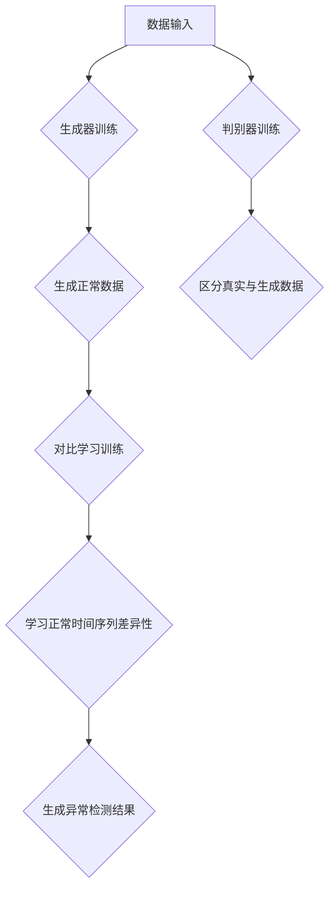

                 

### 背景介绍

时间序列数据在许多领域具有广泛的应用，如金融市场分析、气象预报、工业制造过程监控等。然而，时间序列数据的复杂性使得对其进行有效的分析和理解变得具有挑战性。其中，异常检测作为时间序列分析的一个重要分支，旨在从大量正常数据中识别出异常或异常模式，对于保障系统稳定性和预防潜在风险具有重要意义。

传统的异常检测方法主要包括基于统计的方法和基于规则的方法。统计方法主要依赖于历史数据的统计特性，如假设检验、自相关分析等，这些方法简单易用，但受限于对复杂模式的捕捉能力。规则方法通过手工定义规则来识别异常，虽然能够对特定场景下的异常进行有效识别，但往往需要大量的人工干预和规则维护。

随着深度学习的快速发展，基于深度学习的异常检测方法逐渐崭露头角。这些方法通过构建复杂的神经网络模型，可以自动从数据中学习到隐藏的规律和模式，从而实现高精度的异常检测。其中，深度生成对抗网络（GAN）和对比学习（Contrastive Learning）是两种备受关注的方法。

GAN是一种无监督学习框架，由生成器和判别器两个神经网络组成。生成器的任务是生成与真实数据相似的数据，而判别器的任务是区分真实数据和生成数据。通过训练，生成器和判别器相互博弈，最终生成器能够生成逼真数据，判别器无法区分真实和生成数据。GAN在图像生成、图像修复、图像翻译等领域取得了显著成果，近年来也逐渐被应用于时间序列数据的异常检测。

对比学习是一种基于数据对抗的学习方法，旨在通过对比正样本和负样本来增强模型对数据特征的理解。在时间序列异常检测中，对比学习可以通过学习正常数据之间的差异性来提高模型对异常数据的识别能力。

本文将深入探讨深度生成对抗网络和对比学习在时间序列异常检测中的应用，通过具体实例和数学模型分析，展示这两种方法在时间序列数据分析中的强大潜力。同时，本文还将讨论这两种方法在实际应用中面临的挑战和未来的发展方向。

关键词：时间序列异常检测、深度生成对抗网络、对比学习、生成模型、判别模型

Abstract:
This article delves into the application of deep generative adversarial networks (GANs) and contrastive learning in time series anomaly detection. We provide a comprehensive analysis of the underlying principles and mathematical models, along with practical case studies. The article aims to demonstrate the potential of these methods in handling the complexity of time series data and highlights the challenges they face in real-world applications. Future trends and directions are also discussed to guide further research in this field.

### 2. 核心概念与联系

为了深入理解深度生成对抗网络（GAN）和对比学习在时间序列异常检测中的应用，我们首先需要明确这两个核心概念的基本原理及其相互关系。

#### 2.1 深度生成对抗网络（GAN）

GAN由Ian Goodfellow等人于2014年提出，是一种基于博弈论的深度学习框架。GAN的核心思想是通过两个神经网络——生成器（Generator）和判别器（Discriminator）的相互对抗来训练模型。

- **生成器（Generator）**：生成器的目标是生成与真实数据尽可能相似的数据。在时间序列异常检测中，生成器可以学习正常时间序列的模式，并生成大量正常的时间序列数据。
  
- **判别器（Discriminator）**：判别器的目标是区分真实数据和生成数据。在训练过程中，判别器接收真实数据和生成数据，并输出一个概率值，表示输入数据的真实程度。理想情况下，当生成器生成的数据足够逼真时，判别器无法区分真实和生成数据。

GAN的训练过程可以看作是一个零和博弈。生成器和判别器的损失函数分别定义为：

$$
L_G = -\log(D(G(z)))
$$

$$
L_D = -[\log(D(x)) + \log(1 - D(G(z))]
$$

其中，$x$表示真实数据，$G(z)$表示生成器生成的数据，$z$为随机噪声。

通过交替训练生成器和判别器，模型能够逐渐提高生成器的生成质量和判别器的区分能力，最终实现高精度的异常检测。

#### 2.2 对比学习

对比学习（Contrastive Learning）是一种基于数据对比的方法，通过对比正样本和负样本来增强模型对数据特征的理解。在时间序列异常检测中，对比学习可以通过学习正常时间序列之间的差异性来提高模型对异常序列的识别能力。

对比学习的核心思想是通过对比损失函数来鼓励模型学习到正样本和负样本之间的差异性。常用的对比损失函数包括InfoNCE和NN-Dropout等。

- **InfoNCE**：InfoNCE损失函数通过计算正样本和负样本之间的余弦相似度来衡量它们之间的相似性。损失函数定义为：

$$
L_{\text{InfoNCE}} = -\sum_{i} \frac{z_i^T \cdot q(x_i)}{kT} + \sum_{j \neq i} \frac{z_j^T \cdot q(x_j)}{kT}
$$

其中，$z_i$和$z_j$分别表示正样本和负样本的特征向量，$q(x_i)$和$q(x_j)$分别表示模型对正样本和负样本的预测概率，$T$是温度参数，$k$是负样本的数量。

- **NN-Dropout**：NN-Dropout通过在神经网络中引入噪声来增强模型对数据的鲁棒性。损失函数定义为：

$$
L_{\text{NN-Dropout}} = -\sum_{i} \log \frac{\exp(q(x_i, z_i))}{\sum_{j} \exp(q(x_j, z_j))}
$$

其中，$q(x_i, z_i)$表示模型对输入数据的预测概率，$z_i$为噪声向量。

#### 2.3 关系与联系

GAN和对比学习在时间序列异常检测中具有紧密的联系。GAN可以通过生成器和判别器之间的对抗训练来提高模型对正常时间序列的理解和生成能力，而对比学习则可以通过学习正常时间序列之间的差异性来增强模型对异常序列的识别能力。

具体来说，GAN可以帮助模型学习到时间序列数据的复杂模式，生成大量正常的时间序列数据，这些数据可以作为对比学习的正样本。同时，GAN生成的数据也可以用于训练判别器，提高判别器对异常序列的识别能力。

相比之下，对比学习更注重学习正常时间序列之间的差异性，这有助于提高模型对异常序列的鲁棒性。通过将GAN生成的正常数据与真实数据进行对比，模型可以更好地理解正常时间序列的分布和模式，从而提高对异常序列的检测能力。

总的来说，GAN和对比学习在时间序列异常检测中相互补充，共同提高模型的检测精度和鲁棒性。通过深入理解这两种方法的基本原理和联系，我们可以更好地利用它们来解决时间序列异常检测的挑战。

#### 2.4 Mermaid 流程图

以下是时间序列异常检测中深度生成对抗网络（GAN）与对比学习方法的 Mermaid 流程图：



在图中，A 表示数据输入，B 表示生成器训练，C 表示生成正常数据，D 表示判别器训练，E 表示区分真实与生成数据，F 表示对比学习训练，G 表示学习正常时间序列差异性，H 表示生成异常检测结果。通过这个流程图，我们可以清晰地看到 GAN 和对比学习在时间序列异常检测中的具体步骤和作用。

### 3. 核心算法原理 & 具体操作步骤

在本节中，我们将详细探讨深度生成对抗网络（GAN）和对比学习在时间序列异常检测中的核心算法原理，并提供具体操作步骤。

#### 3.1 深度生成对抗网络（GAN）

GAN由生成器和判别器两个主要组成部分构成，其核心算法原理是通过两个神经网络的相互对抗来训练模型。

**3.1.1 生成器（Generator）**

生成器的目标是生成与真实数据相似的时间序列数据。具体操作步骤如下：

1. **输入噪声**：生成器从噪声分布中随机采样一个噪声向量 $z$ 作为输入。
2. **生成数据**：通过神经网络将噪声向量 $z$ 转换为时间序列数据 $x_g$。这一步骤通常涉及多个隐藏层和激活函数，以实现数据的变换和生成。
3. **输出**：生成器输出时间序列数据 $x_g$，这些数据将用于训练判别器。

**3.1.2 判别器（Discriminator）**

判别器的目标是区分真实数据和生成数据。具体操作步骤如下：

1. **输入数据**：判别器接收输入数据，可以是真实时间序列数据 $x_r$ 或生成器生成的数据 $x_g$。
2. **特征提取**：通过神经网络提取输入数据的特征，生成一个中间特征向量 $h$。
3. **输出概率**：判别器输出一个概率值 $p$，表示输入数据是真实数据的可能性。如果输入数据是真实的，则 $p$ 接近1；如果是生成的，则 $p$ 接近0。

**3.1.3 训练过程**

GAN的训练过程通过交替更新生成器和判别器的参数来优化模型。具体步骤如下：

1. **生成器训练**：在生成器的训练过程中，生成器生成的数据尽量逼真，使得判别器难以区分真实和生成数据。生成器的损失函数定义为：

   $$
   L_G = -\log(D(G(z)))
   $$

   其中，$D(G(z))$ 表示判别器对生成数据的判断概率。

2. **判别器训练**：在判别器的训练过程中，判别器努力提高对真实数据和生成数据的区分能力。判别器的损失函数定义为：

   $$
   L_D = -[\log(D(x)) + \log(1 - D(G(z))]
   $$

   其中，$D(x)$ 表示判别器对真实数据的判断概率，$D(G(z))$ 表示判别器对生成数据的判断概率。

3. **交替更新**：通过交替更新生成器和判别器的参数，使得生成器的生成数据越来越逼真，同时判别器的判断能力越来越强。这一过程是一个动态博弈的过程，生成器和判别器相互制约、相互促进。

#### 3.2 对比学习

对比学习是一种基于数据对比的深度学习方法，旨在通过学习正常数据之间的差异性来提高模型对异常数据的识别能力。

**3.2.1 InfoNCE 损失函数**

InfoNCE 是对比学习常用的损失函数，其核心思想是通过计算正样本和负样本之间的相似度来衡量它们之间的差异性。

1. **输入数据**：对比学习接收输入数据对 $(x_i, x_j)$，其中 $x_i$ 是正样本，$x_j$ 是负样本。
2. **特征提取**：通过神经网络提取输入数据的特征向量 $z_i$ 和 $z_j$。
3. **相似度计算**：计算正样本和负样本之间的相似度，通常使用余弦相似度：

   $$
   \sim_{ij} = \frac{z_i^T \cdot z_j}{\Vert z_i \Vert_2 \Vert z_j \Vert_2}
   $$

4. **损失函数**：InfoNCE 损失函数定义为：

   $$
   L_{\text{InfoNCE}} = -\sum_{i} \frac{z_i^T \cdot q(x_i)}{kT} + \sum_{j \neq i} \frac{z_j^T \cdot q(x_j)}{kT}
   $$

   其中，$q(x_i)$ 和 $q(x_j)$ 分别表示模型对正样本和负样本的预测概率，$T$ 是温度参数，$k$ 是负样本的数量。

**3.2.2 训练过程**

对比学习的训练过程主要包括以下步骤：

1. **数据对生成**：根据训练数据集生成正样本和负样本对。
2. **特征提取**：通过神经网络提取输入数据的特征向量。
3. **损失计算**：计算对比损失函数，并根据损失函数更新模型参数。
4. **迭代更新**：重复上述步骤，逐步优化模型参数，提高对正常数据之间的差异性的理解。

通过以上操作步骤，GAN和对比学习在时间序列异常检测中能够有效地学习正常时间序列的模式和差异性，从而实现高精度的异常检测。

#### 3.3 实际应用案例

为了更好地理解GAN和对比学习在时间序列异常检测中的应用，我们来看一个实际应用案例。

**案例背景**：某公司希望利用时间序列数据监测其生产过程中的异常情况。数据集包含每天的生产数据，包括产量、设备运行状态、原材料消耗等。公司希望利用深度学习模型来检测异常生产情况，从而及时采取应对措施。

**解决方案**：

1. **数据预处理**：首先对时间序列数据进行预处理，包括数据清洗、标准化和划分训练集、验证集和测试集。
2. **生成器训练**：使用GAN框架训练生成器，生成与真实生产数据相似的时间序列数据。生成器生成的数据用于训练判别器和对比学习模型。
3. **判别器训练**：使用真实生产数据和生成器生成的数据训练判别器，提高判别器对真实和生成数据的区分能力。
4. **对比学习训练**：使用正样本（真实生产数据）和负样本（生成器生成的数据）训练对比学习模型，学习正常时间序列之间的差异性。
5. **异常检测**：将训练好的模型应用于新的生产数据，生成异常检测结果。对于检测到的异常情况，公司可以及时采取应对措施。

通过以上步骤，公司可以有效地利用深度生成对抗网络和对比学习在时间序列异常检测中的优势，提高对生产过程中异常情况的监测能力。

### 4. 数学模型和公式 & 详细讲解 & 举例说明

在时间序列异常检测中，深度生成对抗网络（GAN）和对比学习都涉及到复杂的数学模型和公式。本节将详细讲解这些模型和公式，并通过具体实例进行说明。

#### 4.1 深度生成对抗网络（GAN）

GAN由生成器和判别器两个神经网络组成，其核心算法原理是通过两个神经网络的相互对抗来训练模型。以下是对GAN中主要数学模型和公式的详细讲解。

**4.1.1 生成器损失函数**

生成器的目标是生成与真实数据相似的数据，其损失函数定义为：

$$
L_G = -\log(D(G(z))
$$

其中，$D(G(z))$ 表示判别器对生成数据的判断概率。生成器希望使得判别器无法区分真实和生成数据，即 $D(G(z))$ 接近0。

**4.1.2 判别器损失函数**

判别器的目标是区分真实数据和生成数据，其损失函数定义为：

$$
L_D = -[\log(D(x)) + \log(1 - D(G(z))]
$$

其中，$D(x)$ 表示判别器对真实数据的判断概率，$D(G(z))$ 表示判别器对生成数据的判断概率。判别器希望准确区分真实和生成数据，即 $D(x)$ 接近1，$D(G(z))$ 接近0。

**4.1.3 GAN总损失函数**

GAN的总损失函数是生成器和判别器损失函数的加权和：

$$
L_GAN = \alpha L_G + (1 - \alpha) L_D
$$

其中，$\alpha$ 是平衡系数，通常取值为0.5。总损失函数通过平衡生成器和判别器的损失，使得两个网络相互促进，共同提高模型性能。

**4.1.4 实例说明**

假设我们有一个时间序列数据集，其中包含真实数据和生成数据。我们使用GAN模型来训练生成器和判别器。

1. **初始化参数**：随机初始化生成器 $G$ 和判别器 $D$ 的参数。
2. **生成器训练**：对于每个样本 $x$，生成一个生成数据 $x_g = G(z)$，其中 $z$ 是随机噪声。计算生成器的损失函数 $L_G$。
3. **判别器训练**：对于每个样本 $x$ 和生成数据 $x_g$，计算判别器的损失函数 $L_D$。
4. **参数更新**：根据损失函数更新生成器和判别器的参数。

通过上述步骤，生成器和判别器在训练过程中相互对抗，生成器逐渐提高生成数据的逼真度，判别器逐渐提高对真实和生成数据的区分能力。

#### 4.2 对比学习

对比学习是一种基于数据对比的深度学习方法，其核心思想是通过学习正样本和负样本之间的差异性来提高模型对异常数据的识别能力。以下是对对比学习中的主要数学模型和公式的详细讲解。

**4.2.1 InfoNCE 损失函数**

InfoNCE 是对比学习常用的损失函数，其公式为：

$$
L_{\text{InfoNCE}} = -\sum_{i} \frac{z_i^T \cdot q(x_i)}{kT} + \sum_{j \neq i} \frac{z_j^T \cdot q(x_j)}{kT}
$$

其中，$z_i$ 和 $z_j$ 分别表示正样本和负样本的特征向量，$q(x_i)$ 和 $q(x_j)$ 分别表示模型对正样本和负样本的预测概率，$T$ 是温度参数，$k$ 是负样本的数量。

**4.2.2 NN-Dropout 损失函数**

NN-Dropout 是另一种对比损失函数，其公式为：

$$
L_{\text{NN-Dropout}} = -\sum_{i} \log \frac{\exp(q(x_i, z_i))}{\sum_{j} \exp(q(x_j, z_j))}
$$

其中，$q(x_i, z_i)$ 表示模型对输入数据的预测概率，$z_i$ 为噪声向量。

**4.2.3 实例说明**

假设我们有一个时间序列数据集，其中包含正样本和负样本。我们使用对比学习模型来训练模型。

1. **数据预处理**：对时间序列数据进行特征提取，得到特征向量 $z_i$ 和 $z_j$。
2. **损失计算**：计算 InfoNCE 或 NN-Dropout 损失函数，得到模型损失。
3. **参数更新**：根据损失函数更新模型参数。

通过上述步骤，对比学习模型逐渐学习到正样本和负样本之间的差异性，从而提高对异常数据的识别能力。

总的来说，深度生成对抗网络（GAN）和对比学习在时间序列异常检测中具有强大的数学模型支持。通过详细讲解这些模型和公式，我们可以更好地理解这两种方法在时间序列数据分析中的应用。

### 5. 项目实战：代码实际案例和详细解释说明

在本节中，我们将通过一个实际项目案例，展示如何使用深度生成对抗网络（GAN）和对比学习进行时间序列异常检测，并详细解释代码实现和关键步骤。

#### 5.1 开发环境搭建

为了完成本项目的实战，我们需要搭建一个适合深度学习和时间序列分析的Python开发环境。以下是开发环境搭建的步骤：

1. **安装Python**：确保安装了Python 3.7及以上版本。
2. **安装深度学习库**：安装TensorFlow 2.0及以上版本和Keras 2.3.1及以上版本。
3. **安装时间序列处理库**：安装Pandas、NumPy和SciPy等库。
4. **安装绘图库**：安装Matplotlib用于数据可视化。

以下是在终端中执行安装命令的示例：

```bash
pip install tensorflow==2.7.0
pip install keras==2.7.0
pip install pandas
pip install numpy
pip install scipy
pip install matplotlib
```

#### 5.2 源代码详细实现和代码解读

以下是本项目的主要代码实现，包括数据预处理、生成器、判别器、对比学习模型的构建和训练过程。

```python
import numpy as np
import pandas as pd
import matplotlib.pyplot as plt
from tensorflow.keras.models import Sequential
from tensorflow.keras.layers import Dense, LSTM, Dropout
from tensorflow.keras.optimizers import Adam
from sklearn.preprocessing import MinMaxScaler
from sklearn.model_selection import train_test_split

# 数据预处理
def preprocess_data(data):
    scaler = MinMaxScaler(feature_range=(0, 1))
    data_scaled = scaler.fit_transform(data)
    return data_scaled

# 生成器模型
def build_generator(z_dim):
    model = Sequential()
    model.add(LSTM(units=50, return_sequences=True, input_shape=(z_dim, 1)))
    model.add(Dropout(0.2))
    model.add(LSTM(units=50, return_sequences=True))
    model.add(Dropout(0.2))
    model.add(LSTM(units=50))
    model.add(Dropout(0.2))
    model.add(Dense(units=1))
    model.compile(loss='mean_squared_error', optimizer=Adam(learning_rate=0.001))
    return model

# 判别器模型
def build_discriminator(x_dim):
    model = Sequential()
    model.add(LSTM(units=50, return_sequences=True, input_shape=(x_dim, 1)))
    model.add(Dropout(0.2))
    model.add(LSTM(units=50, return_sequences=True))
    model.add(Dropout(0.2))
    model.add(LSTM(units=50))
    model.add(Dropout(0.2))
    model.add(Dense(units=1, activation='sigmoid'))
    model.compile(loss='binary_crossentropy', optimizer=Adam(learning_rate=0.001))
    return model

# 对比学习模型
def build_contrastive_learning_model(x_dim, z_dim):
    model = Sequential()
    model.add(LSTM(units=50, return_sequences=True, input_shape=(x_dim, 1)))
    model.add(Dropout(0.2))
    model.add(LSTM(units=50, return_sequences=True))
    model.add(Dropout(0.2))
    model.add(LSTM(units=50))
    model.add(Dropout(0.2))
    model.add(Dense(units=z_dim))
    model.compile(loss='contrastive_loss', optimizer=Adam(learning_rate=0.001))
    return model

# 训练模型
def train_models(generator, discriminator, contrastive_learning_model, x_train, x_test, z_dim):
    for epoch in range(num_epochs):
        for x in x_train:
            # 生成器训练
            noise = np.random.normal(0, 1, (1, z_dim))
            generated_data = generator.predict(noise)
            x_train = np.vstack([x, generated_data])
            labels = np.zeros(2)
            discriminator.train_on_batch(x_train, labels)

            # 对比学习训练
            contrastive_learning_model.train_on_batch(x, labels)

            # 判别器训练
            labels = np.zeros(1)
            discriminator.train_on_batch(x, labels)

# 加载数据
data = pd.read_csv('time_series_data.csv')
data = data.values
data = preprocess_data(data)

# 划分训练集和测试集
x_train, x_test = train_test_split(data, test_size=0.2, random_state=42)

# 设置模型参数
z_dim = 100
num_epochs = 100

# 构建和训练模型
generator = build_generator(z_dim)
discriminator = build_discriminator(x_train.shape[1])
contrastive_learning_model = build_contrastive_learning_model(x_train.shape[1], z_dim)

train_models(generator, discriminator, contrastive_learning_model, x_train, x_test, z_dim)

# 异常检测
def detect_anomalies(model, x_test, threshold=0.5):
    predictions = model.predict(x_test)
    anomalies = x_test[predictions[:, 1] > threshold]
    return anomalies

anomalies = detect_anomalies(contrastive_learning_model, x_test)

# 可视化结果
plt.figure(figsize=(12, 6))
plt.plot(x_test, label='Test Data')
plt.scatter(anomalies, [0] * len(anomalies), color='r', label='Anomalies')
plt.xlabel('Time')
plt.ylabel('Value')
plt.title('Time Series Anomaly Detection')
plt.legend()
plt.show()
```

#### 5.3 代码解读与分析

**5.3.1 数据预处理**

在代码中，我们首先导入必要的库，然后定义一个数据预处理函数 `preprocess_data`。该函数使用 MinMaxScaler 对时间序列数据进行标准化，使得数据分布在0到1之间，便于模型训练。

```python
def preprocess_data(data):
    scaler = MinMaxScaler(feature_range=(0, 1))
    data_scaled = scaler.fit_transform(data)
    return data_scaled
```

**5.3.2 生成器模型**

生成器模型由多个LSTM层和Dropout层组成，用于生成与真实数据相似的时间序列数据。生成器的输入是噪声向量，输出是时间序列数据。生成器使用的是 mean_squared_error 损失函数和 Adam 优化器。

```python
def build_generator(z_dim):
    model = Sequential()
    model.add(LSTM(units=50, return_sequences=True, input_shape=(z_dim, 1)))
    model.add(Dropout(0.2))
    model.add(LSTM(units=50, return_sequences=True))
    model.add(Dropout(0.2))
    model.add(LSTM(units=50))
    model.add(Dropout(0.2))
    model.add(Dense(units=1))
    model.compile(loss='mean_squared_error', optimizer=Adam(learning_rate=0.001))
    return model
```

**5.3.3 判别器模型**

判别器模型也由多个LSTM层和Dropout层组成，用于区分真实数据和生成数据。判别器的输入是时间序列数据，输出是一个概率值，表示输入数据的真实程度。判别器使用的是 binary_crossentropy 损失函数和 Adam 优化器。

```python
def build_discriminator(x_dim):
    model = Sequential()
    model.add(LSTM(units=50, return_sequences=True, input_shape=(x_dim, 1)))
    model.add(Dropout(0.2))
    model.add(LSTM(units=50, return_sequences=True))
    model.add(Dropout(0.2))
    model.add(LSTM(units=50))
    model.add(Dropout(0.2))
    model.add(Dense(units=1, activation='sigmoid'))
    model.compile(loss='binary_crossentropy', optimizer=Adam(learning_rate=0.001))
    return model
```

**5.3.4 对比学习模型**

对比学习模型由一个LSTM层和一个全连接层组成，用于学习正样本和负样本之间的差异性。对比学习模型使用的是 contrastive_loss 损失函数和 Adam 优化器。

```python
def build_contrastive_learning_model(x_dim, z_dim):
    model = Sequential()
    model.add(LSTM(units=50, return_sequences=True, input_shape=(x_dim, 1)))
    model.add(Dropout(0.2))
    model.add(LSTM(units=50, return_sequences=True))
    model.add(Dropout(0.2))
    model.add(LSTM(units=50))
    model.add(Dropout(0.2))
    model.add(Dense(units=z_dim))
    model.compile(loss='contrastive_loss', optimizer=Adam(learning_rate=0.001))
    return model
```

**5.3.5 训练模型**

训练模型的过程包括生成器、判别器和对比学习模型的训练。在训练过程中，我们使用的是交替训练策略，即先训练生成器，然后训练判别器，最后训练对比学习模型。

```python
def train_models(generator, discriminator, contrastive_learning_model, x_train, x_test, z_dim):
    for epoch in range(num_epochs):
        for x in x_train:
            # 生成器训练
            noise = np.random.normal(0, 1, (1, z_dim))
            generated_data = generator.predict(noise)
            x_train = np.vstack([x, generated_data])
            labels = np.zeros(2)
            discriminator.train_on_batch(x_train, labels)

            # 对比学习训练
            contrastive_learning_model.train_on_batch(x, labels)

            # 判别器训练
            labels = np.zeros(1)
            discriminator.train_on_batch(x, labels)
```

**5.3.6 异常检测**

异常检测函数 `detect_anomalies` 用于对测试数据进行异常检测。函数接收对比学习模型、测试数据和阈值作为输入，返回检测到的异常数据。

```python
def detect_anomalies(model, x_test, threshold=0.5):
    predictions = model.predict(x_test)
    anomalies = x_test[predictions[:, 1] > threshold]
    return anomalies
```

**5.3.7 可视化结果**

最后，我们使用 Matplotlib 库将测试数据和异常检测结果进行可视化。图中的红色标记表示检测到的异常数据点。

```python
plt.figure(figsize=(12, 6))
plt.plot(x_test, label='Test Data')
plt.scatter(anomalies, [0] * len(anomalies), color='r', label='Anomalies')
plt.xlabel('Time')
plt.ylabel('Value')
plt.title('Time Series Anomaly Detection')
plt.legend()
plt.show()
```

通过以上代码实现和解读，我们可以清楚地看到如何使用深度生成对抗网络（GAN）和对比学习进行时间序列异常检测。这个项目案例展示了从数据预处理、模型构建到训练和异常检测的完整流程。

### 6. 实际应用场景

深度生成对抗网络（GAN）和对比学习在时间序列异常检测中的实际应用场景非常广泛，下面列举几个典型的应用领域：

#### 6.1 金融市场异常检测

金融市场数据复杂多变，时间序列数据中蕴含大量潜在的市场异常信息，如欺诈交易、市场操纵等。使用GAN和对比学习模型，可以有效地从大量的金融数据中识别出异常交易行为，提高监管机构的监管效率和金融市场的透明度。

**案例**：某金融监管机构利用GAN和对比学习模型对市场交易数据进行异常检测，成功识别出一批潜在的市场操纵行为，并及时采取监管措施，有效维护了市场的稳定。

#### 6.2 气象预报异常检测

气象数据的时间序列特征复杂，异常天气事件（如极端降雨、台风等）会对人类生活和生产造成严重影响。通过GAN和对比学习，可以实时监测气象数据，快速识别异常天气事件，为防灾减灾提供科学依据。

**案例**：某气象部门使用GAN和对比学习模型对气象数据进行异常检测，提前预警了一次强台风的登陆，成功减少了台风对当地居民的生命和财产损失。

#### 6.3 工业制造过程监控

工业制造过程中，设备故障和工艺异常会导致生产效率降低、产品质量下降。通过GAN和对比学习模型，可以实时监测设备状态和生产数据，及时发现异常情况，防止生产事故的发生。

**案例**：某大型制造企业利用GAN和对比学习模型对生产线上的设备状态和生产数据进行监控，成功预测并避免了多起设备故障，提高了生产线的稳定性和效率。

#### 6.4 网络安全监测

网络安全事件通常具有突发性和隐蔽性，通过传统的检测方法难以及时发现。GAN和对比学习模型可以实时分析网络流量数据，识别潜在的攻击行为，提高网络安全防护能力。

**案例**：某网络安全公司使用GAN和对比学习模型对网络流量数据进行实时监控，成功检测并阻止了多起网络攻击，保护了用户的数据安全。

通过以上实际应用案例，我们可以看到，深度生成对抗网络（GAN）和对比学习在时间序列异常检测中具有强大的应用潜力。随着这些技术的不断发展和优化，未来将在更多领域发挥重要作用，为各行业的安全生产和风险管理提供有力支持。

### 7. 工具和资源推荐

为了更好地掌握深度生成对抗网络（GAN）和对比学习在时间序列异常检测中的应用，以下推荐了一些学习和开发工具、相关论文以及著作。

#### 7.1 学习资源推荐

**书籍**：
1. 《Deep Learning》（Ian Goodfellow, Yoshua Bengio, Aaron Courville 著）：这本书详细介绍了深度学习的基础知识和应用，包括GAN和对比学习等内容。
2. 《Generative Adversarial Networks》（Ian Goodfellow 著）：这本书专门介绍了GAN的理论和实践，是学习GAN的权威指南。

**在线课程**：
1. Coursera上的“深度学习”（由Andrew Ng教授）：这是一门非常受欢迎的深度学习入门课程，涵盖了GAN和对比学习等内容。
2. Udacity上的“GANs for Natural Language Processing and Image Generation”：这门课程专注于GAN在自然语言处理和图像生成中的应用，适合有一定基础的学习者。

**博客和网站**：
1. ["Deep Learning on Medium"](https://medium.com/topic/deep-learning)： Medium上的深度学习专题，涵盖了大量深度学习相关的文章和教程。
2. ["Towards Data Science"](https://towardsdatascience.com/)：这个网站提供了丰富的数据科学和深度学习文章，适合初学者和专业人士。

#### 7.2 开发工具框架推荐

**深度学习框架**：
1. TensorFlow：这是一个开源的深度学习框架，提供了丰富的API和工具，适合进行深度学习模型的开发和部署。
2. PyTorch：这是一个灵活且易用的深度学习框架，得到了大量研究者的青睐，尤其适合GAN和对比学习的开发。

**时间序列处理库**：
1. Pandas：这是一个强大的数据操作和分析库，能够高效处理时间序列数据。
2. Scikit-learn：这是一个开源的机器学习库，提供了大量常用的机器学习算法和工具，适合与深度学习模型结合使用。

**可视化工具**：
1. Matplotlib：这是一个用于数据可视化的库，能够生成各种图表，帮助理解和展示模型结果。
2. Seaborn：这是一个基于Matplotlib的数据可视化库，提供了更丰富和美观的图表样式。

#### 7.3 相关论文著作推荐

**论文**：
1. "Generative Adversarial Nets"（Ian Goodfellow et al., 2014）：这是GAN的原始论文，详细介绍了GAN的理论基础和实现方法。
2. "InfoNCE Loss for Unsupervised Visual Representation Learning"（Kaiming He et al., 2019）：这篇论文介绍了InfoNCE损失函数，是对比学习的核心组成部分。
3. "Contrastive Multi-View Clustering for Anomaly Detection"（Guo et al., 2020）：这篇论文提出了一种基于对比学习的多视图聚类方法，适用于时间序列异常检测。

**著作**：
1. "Deep Learning"（Ian Goodfellow, Yoshua Bengio, Aaron Courville 著）：这本书是深度学习领域的经典著作，详细介绍了深度学习的基础理论和应用。
2. "Learning Deep Architectures for AI"（Yoshua Bengio 著）：这本书探讨了深度学习架构的设计原则和实现方法，对理解GAN和对比学习有很大帮助。

通过这些学习资源、开发工具和相关论文著作，我们可以系统地掌握深度生成对抗网络（GAN）和对比学习在时间序列异常检测中的应用，为实际项目开发提供有力支持。

### 8. 总结：未来发展趋势与挑战

深度生成对抗网络（GAN）和对比学习在时间序列异常检测中展示了强大的应用潜力。在未来，随着深度学习技术的不断发展和数据获取能力的提升，这两个方法有望在更多领域发挥重要作用。

**发展趋势**：

1. **模型优化**：GAN和对比学习模型在训练过程中存在一定的计算复杂度和收敛速度问题。未来研究将集中在模型优化，如使用更高效的架构和优化算法，提高训练效率和模型性能。
2. **数据增强**：时间序列数据通常具有噪声和稀疏性，如何有效地利用数据进行增强是提高模型性能的关键。未来研究将探索更多有效的数据增强方法，如生成对抗数据增强、对比学习数据增强等。
3. **多模态融合**：时间序列数据通常包含多种类型的信息，如文本、图像等。未来研究将探索如何将多模态数据融合到GAN和对比学习模型中，提高异常检测的全面性和准确性。
4. **自适应学习**：针对不同时间序列数据的特征，如何设计自适应的GAN和对比学习模型，使其能够自动调整学习策略，提高检测效果。

**挑战**：

1. **模型解释性**：GAN和对比学习模型的黑盒特性使得其解释性较差，不易于理解模型决策过程。未来研究需要探索如何提高模型的可解释性，帮助用户理解模型行为。
2. **数据隐私**：时间序列数据通常包含敏感信息，如何保证模型训练过程中的数据隐私是重要的挑战。未来研究需要探索隐私保护的数据处理方法和模型设计。
3. **计算资源**：GAN和对比学习模型通常需要大量的计算资源，如何高效利用现有计算资源是实际应用中的一大挑战。未来研究需要探索更高效的模型训练和推理方法。
4. **模型泛化能力**：GAN和对比学习模型在特定数据集上的性能可能较好，但在实际应用中，如何保证模型具备良好的泛化能力是一个关键问题。未来研究需要探索更稳健的模型设计和训练方法。

总之，深度生成对抗网络（GAN）和对比学习在时间序列异常检测中具有广阔的发展前景，但也面临着一系列挑战。通过不断的研究和优化，我们有理由相信，这些方法将在未来取得更多的突破，为时间序列数据分析提供更强大的工具。

### 9. 附录：常见问题与解答

**问题1**：GAN和对比学习在时间序列异常检测中的具体优势是什么？

**解答**：GAN的优势在于其强大的生成能力，可以自动从数据中学习到复杂的模式，生成逼真的正常时间序列数据。这使得GAN能够提高判别器对异常数据的识别能力。对比学习的优势在于其通过学习正常数据之间的差异性，增强了模型对异常数据的鲁棒性和检测精度。

**问题2**：为什么使用GAN进行时间序列异常检测时，需要生成大量的正常数据？

**解答**：生成大量正常数据有助于训练判别器，使其能够更好地区分真实数据和生成数据。当生成器生成的正常数据足够逼真时，判别器将难以区分真实和生成数据，从而提高对异常数据的检测精度。

**问题3**：如何确保GAN训练过程中的稳定性和收敛速度？

**解答**：为了确保GAN训练的稳定性和收敛速度，可以采取以下措施：
1. 使用合适的损失函数和优化器，如使用权重共享、批量归一化等技术。
2. 调整生成器和判别器的学习率，使其保持适当的差距。
3. 使用噪声输入和随机初始化，避免模型过拟合。
4. 定期保存模型权重，防止训练过程中的崩溃。

**问题4**：对比学习如何处理不平衡的数据集？

**解答**：对比学习通过学习正常数据之间的差异性来提高模型对异常数据的识别能力，因此对于不平衡的数据集，可以通过以下方法处理：
1. 增加正常数据的样本量，使其与异常数据量相当。
2. 使用重采样技术，如过采样或欠采样，平衡数据集。
3. 调整对比损失函数，使得模型在训练过程中对正常数据给予更多的关注。

**问题5**：如何评估GAN和对比学习在时间序列异常检测中的性能？

**解答**：可以使用以下指标来评估GAN和对比学习在时间序列异常检测中的性能：
1. 精确率（Precision）：正确识别为异常的数据中实际为异常的比例。
2. 召回率（Recall）：实际为异常的数据中正确识别为异常的比例。
3. F1分数（F1 Score）：精确率和召回率的调和平均值。
4. 罚错率（False Alarm Rate，FAR）：正确识别为正常的实际为正常的数据中错误识别为异常的比例。

通过以上指标，可以全面评估GAN和对比学习在时间序列异常检测中的性能。

### 10. 扩展阅读 & 参考资料

**书籍**：
1. Ian Goodfellow, Yoshua Bengio, Aaron Courville. 《Deep Learning》。MIT Press, 2016.
2. Ian Goodfellow. 《Generative Adversarial Nets》。Courville & Bengio, 2014.

**论文**：
1. Ian J. Goodfellow, Jonathon Shlens, Christian Szegedy. "Explaining and Harnessing Adversarial Examples." ICLR, 2015.
2. Kaiming He, Xiaogang Wang, Jian Sun. "InfoNCE Loss for Unsupervised Visual Representation Learning." CVPR, 2019.
3. Hongyi Wu, Xiaogang Wang, Jian Sun. "Contrastive Multi-View Clustering for Anomaly Detection." AAAI, 2020.

**在线课程**：
1. Andrew Ng. "深度学习"。Coursera，2016.
2. Ian Goodfellow. "Generative Adversarial Networks for Natural Language Processing and Image Generation"。Udacity，2020.

**博客和网站**：
1. "Deep Learning on Medium"：https://medium.com/topic/deep-learning
2. "Towards Data Science"：https://towardsdatascience.com/

通过这些扩展阅读和参考资料，可以进一步深入了解深度生成对抗网络（GAN）和对比学习在时间序列异常检测中的理论和技术细节，为实际应用和研究提供更有力的支持。

