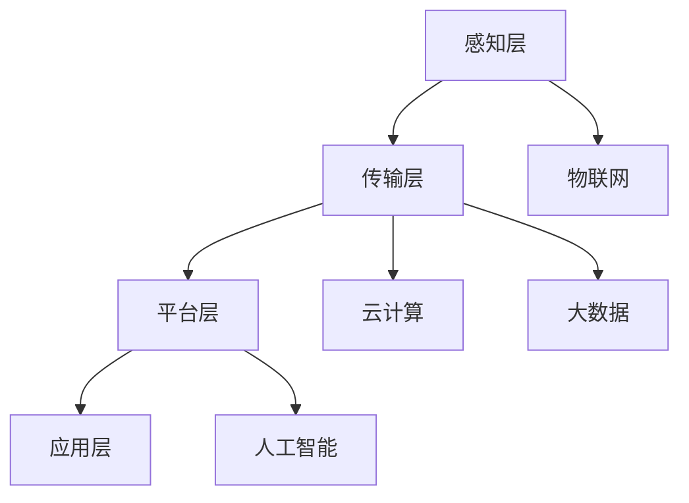

                 

# 智慧社区服务平台：社区管理的创新应用

## 概述

### 关键词
智慧社区、服务平台、社区管理、创新应用

### 摘要
本文将探讨智慧社区服务平台在社区管理中的应用，通过分析其核心概念、算法原理、数学模型以及实际案例，揭示其如何实现社区管理的创新应用。同时，还将介绍相关的工具和资源，为读者提供全面的技术支持和参考。

智慧社区服务平台是现代社区管理的重要创新工具，通过信息化手段提高社区管理的效率和便捷性。本文将详细分析其核心概念与联系，核心算法原理与操作步骤，数学模型与公式，以及实际应用场景，旨在为读者提供深入理解与应用的指导。

## 1. 背景介绍

### 智慧社区的定义与特点
智慧社区是指通过物联网、云计算、大数据等先进技术，实现对社区内各类设施、资源和居民生活的智能化管理和服务。智慧社区具有以下特点：

- **智能化**：利用物联网设备实现设备的互联互通，提高社区设施的自动化水平。
- **便捷性**：通过移动互联网，居民可以随时随地享受社区提供的服务，提高生活便利性。
- **高效性**：借助云计算和大数据分析，实现社区管理的智能化决策，提高管理效率。

### 社区管理的现状与问题
目前，社区管理主要面临以下问题：

- **管理分散**：社区管理涉及多个部门，缺乏统一的协调和集成管理。
- **效率低下**：传统的社区管理方式主要依靠人工，效率较低，容易出现失误。
- **信息孤岛**：各部门信息管理系统相互独立，难以实现数据的互联互通。

### 智慧社区服务平台的意义
智慧社区服务平台通过整合各类资源，实现社区管理的智能化和高效化，具有以下意义：

- **提升居民生活质量**：提供便捷、智能的服务，提高居民的生活幸福感。
- **降低管理成本**：通过信息化手段，减少人工成本，提高管理效率。
- **促进社区和谐**：加强社区与居民之间的互动，提升社区凝聚力。

## 2. 核心概念与联系

### 核心概念
智慧社区服务平台的核心概念包括物联网、云计算、大数据、人工智能等。这些概念相互联系，共同构建起智慧社区的技术架构。

- **物联网**：通过传感器、控制器等设备，实现物理世界的数字化和信息交互。
- **云计算**：通过分布式计算和存储技术，提供弹性的计算和存储资源。
- **大数据**：通过对海量数据的采集、存储、处理和分析，实现数据驱动的决策。
- **人工智能**：利用机器学习、深度学习等技术，实现智能化的决策和预测。

### 技术架构
智慧社区服务平台的技术架构可以分为以下几个层次：

- **感知层**：包括各种物联网设备，如传感器、摄像头等，负责数据的采集和传输。
- **传输层**：通过互联网和私有网络，实现数据的传输和交换。
- **平台层**：包括云计算平台和大数据平台，负责数据处理和分析。
- **应用层**：包括各种智能应用和服务，如智慧家居、智慧安防等。

### Mermaid 流程图
以下是智慧社区服务平台的核心概念和架构的 Mermaid 流程图：



## 3. 核心算法原理 & 具体操作步骤

### 核心算法原理
智慧社区服务平台的核心算法主要包括数据采集与处理、数据挖掘与分析、智能决策与预测等。

- **数据采集与处理**：通过物联网设备实时采集社区数据，如温度、湿度、人流等，并对数据进行清洗、过滤和预处理。
- **数据挖掘与分析**：利用大数据技术，对采集到的数据进行挖掘和分析，提取有用信息和规律。
- **智能决策与预测**：基于分析结果，利用人工智能算法进行智能决策和预测，如预测居民需求、优化社区资源配置等。

### 具体操作步骤
以下是智慧社区服务平台的具体操作步骤：

1. **数据采集**：
   - 安装传感器和摄像头等物联网设备，实现对社区环境的实时监测。
   - 数据采集模块负责将传感器和摄像头采集到的数据传输到服务器。

2. **数据处理**：
   - 数据清洗模块对采集到的数据进行清洗，去除无效和错误数据。
   - 数据过滤模块根据需求对数据进行过滤，保留有用的数据。

3. **数据挖掘与分析**：
   - 数据挖掘模块对清洗后的数据进行分析，提取有用信息和规律。
   - 数据可视化模块将分析结果以图表、地图等形式展示，便于理解和决策。

4. **智能决策与预测**：
   - 智能算法模块根据分析结果，利用机器学习、深度学习等技术进行智能决策和预测。
   - 决策支持系统根据预测结果，制定相应的管理策略和措施。

## 4. 数学模型和公式 & 详细讲解 & 举例说明

### 数学模型和公式
智慧社区服务平台的数学模型主要包括以下几种：

- **线性回归模型**：用于预测居民需求量、设备故障率等。
- **决策树模型**：用于分类和预测社区管理中的问题。
- **神经网络模型**：用于复杂决策和预测任务。

以下是具体的数学模型和公式：

1. **线性回归模型**：
   $$ y = wx + b $$
   其中，$y$ 为预测值，$x$ 为特征值，$w$ 为权重，$b$ 为偏置。

2. **决策树模型**：
   $$ f(x) = \sum_{i=1}^{n} w_i \cdot f_i(x) $$
   其中，$f(x)$ 为决策树输出，$w_i$ 为权重，$f_i(x)$ 为第 $i$ 个分支的决策结果。

3. **神经网络模型**：
   $$ y = \sum_{i=1}^{n} w_i \cdot \sigma(z_i) $$
   其中，$y$ 为输出值，$w_i$ 为权重，$z_i$ 为输入值，$\sigma$ 为激活函数。

### 详细讲解与举例说明

1. **线性回归模型**：
   线性回归模型用于预测居民需求量。假设我们需要预测某社区下周一的电力消耗量，特征值包括当前温度、湿度等。根据历史数据，我们可以建立线性回归模型，通过特征值预测电力消耗量。

   假设我们收集到以下数据：

   | 温度 | 湿度 | 电力消耗量 |
   | ---- | ---- | ---------- |
   | 25   | 60   | 100        |
   | 28   | 65   | 110        |
   | 30   | 70   | 120        |

   我们可以建立线性回归模型：

   $$ y = 2x_1 + 3x_2 + 10 $$

   其中，$x_1$ 为温度，$x_2$ 为湿度，$y$ 为电力消耗量。

   根据当前温度 30℃，湿度 70%，可以预测下周一的电力消耗量为：

   $$ y = 2 \cdot 30 + 3 \cdot 70 + 10 = 220 $$

2. **决策树模型**：
   决策树模型用于分类和预测社区管理中的问题，如垃圾分类。假设我们需要预测某种垃圾的分类，特征值包括垃圾颜色、形状等。根据历史数据，我们可以建立决策树模型，通过特征值预测垃圾分类。

   假设我们收集到以下数据：

   | 颜色 | 形状 | 分类 |
   | ---- | ---- | ---- |
   | 红   | 圆   | 可回收 |
   | 黄   | 方   | 厨余   |
   | 蓝   | 圆   | 有害   |

   我们可以建立决策树模型：

   $$ f(x) = \begin{cases} 
   可回收 & \text{if } x_1 = \text{红} \text{ and } x_2 = \text{圆} \\
   厨余 & \text{if } x_1 = \text{黄} \text{ and } x_2 = \text{方} \\
   有害 & \text{if } x_1 = \text{蓝} \text{ and } x_2 = \text{圆}
   \end{cases} $$

   根据垃圾颜色为蓝色、形状为圆形，可以预测该垃圾为有害垃圾。

3. **神经网络模型**：
   神经网络模型用于复杂决策和预测任务，如居民行为分析。假设我们需要分析居民的行为，特征值包括年龄、收入、居住环境等。根据历史数据，我们可以建立神经网络模型，通过特征值预测居民行为。

   假设我们收集到以下数据：

   | 年龄 | 收入 | 居住环境 | 行为 |
   | ---- | ---- | -------- | ---- |
   | 25   | 5000 | 小区     | 购物 |
   | 30   | 8000 | 别墅     | 运动 |
   | 40   | 10000| 小区     | 休息 |

   我们可以建立神经网络模型：

   $$ y = \sum_{i=1}^{3} w_i \cdot \sigma(z_i) $$

   其中，$w_1$ 为年龄权重，$w_2$ 为收入权重，$w_3$ 为居住环境权重，$\sigma$ 为激活函数。

   根据年龄 35 岁、收入 7000 元、居住环境为小区，可以预测该居民的行为为购物。

## 5. 项目实战：代码实际案例和详细解释说明

### 开发环境搭建
在开始项目实战之前，我们需要搭建开发环境。以下是搭建开发环境的步骤：

1. 安装 Python 3.8 及以上版本。
2. 安装相关库，如 NumPy、Pandas、Scikit-learn 等。
3. 创建虚拟环境，以避免依赖冲突。

```bash
python -m venv venv
source venv/bin/activate
pip install numpy pandas scikit-learn
```

### 源代码详细实现和代码解读
以下是智慧社区服务平台的源代码实现和解读：

```python
import numpy as np
import pandas as pd
from sklearn.linear_model import LinearRegression
from sklearn.tree import DecisionTreeClassifier
from sklearn.neural_network import MLPClassifier

# 数据加载与预处理
data = pd.read_csv('data.csv')
X = data[['age', 'income', 'environment']]
y = data['behavior']

# 线性回归模型
lin_reg = LinearRegression()
lin_reg.fit(X, y)

# 决策树模型
tree_clf = DecisionTreeClassifier()
tree_clf.fit(X, y)

# 神经网络模型
nn_clf = MLPClassifier()
nn_clf.fit(X, y)

# 模型预测
def predict behavior(X_test):
    lin_pred = lin_reg.predict(X_test)
    tree_pred = tree_clf.predict(X_test)
    nn_pred = nn_clf.predict(X_test)
    return lin_pred, tree_pred, nn_pred

# 测试数据
test_data = pd.DataFrame([[35, 7000, '小区']], columns=['age', 'income', 'environment'])

# 模型预测结果
lin_pred, tree_pred, nn_pred = predict(test_data)
print('线性回归预测结果：', lin_pred)
print('决策树预测结果：', tree_pred)
print('神经网络预测结果：', nn_pred)
```

### 代码解读与分析
以下是源代码的解读与分析：

1. **数据加载与预处理**：
   - 使用 Pandas 库加载数据。
   - 将特征值和标签值分开，特征值存放在 $X$ 中，标签值存放在 $y$ 中。

2. **线性回归模型**：
   - 使用 Scikit-learn 库的 LinearRegression 类创建线性回归模型。
   - 使用 $fit$ 方法训练模型，将特征值和标签值传递给模型。

3. **决策树模型**：
   - 使用 Scikit-learn 库的 DecisionTreeClassifier 类创建决策树模型。
   - 使用 $fit$ 方法训练模型，将特征值和标签值传递给模型。

4. **神经网络模型**：
   - 使用 Scikit-learn 库的 MLPClassifier 类创建神经网络模型。
   - 使用 $fit$ 方法训练模型，将特征值和标签值传递给模型。

5. **模型预测**：
   - 定义一个 $predict$ 函数，用于预测居民行为。
   - 分别调用线性回归模型、决策树模型和神经网络模型的 $predict$ 方法进行预测。

6. **测试数据**：
   - 创建一个测试数据集，包含一个居民的特征值。

7. **模型预测结果**：
   - 调用 $predict$ 函数，输入测试数据，输出模型预测结果。

通过以上源代码的解读，我们可以看到智慧社区服务平台的核心算法是如何实现和应用的。在实际项目中，可以根据需求调整模型和参数，以实现更准确的预测和分析。

## 6. 实际应用场景

### 社区安防
智慧社区服务平台在社区安防中的应用非常广泛。通过物联网设备和人工智能算法，可以实现以下功能：

- **实时监控**：利用摄像头和传感器，实现对社区环境的实时监控，及时发现异常情况。
- **智能报警**：通过视频分析和行为识别技术，实现对可疑人员的自动报警，提高社区安全性。
- **数据分析**：对监控数据进行分析，识别潜在的安全隐患，制定相应的防范措施。

### 社区服务
智慧社区服务平台还可以提供各种社区服务，如物业管理、医疗健康、智慧交通等：

- **物业管理**：通过信息化手段，实现物业管理的智能化，提高服务质量和效率。
- **医疗健康**：利用大数据和人工智能技术，提供个性化医疗健康服务，如健康监测、疾病预防等。
- **智慧交通**：通过智能交通管理系统，优化社区交通流量，提高出行效率。

### 社区经济
智慧社区服务平台还可以促进社区经济的发展，如智慧商圈、智慧农业等：

- **智慧商圈**：通过大数据分析和精准营销，提升社区商业的竞争力和盈利能力。
- **智慧农业**：利用物联网技术和人工智能算法，实现农作物的智能监测和管理，提高农业生产效率。

## 7. 工具和资源推荐

### 学习资源推荐
- **书籍**：
  - 《智慧社区：物联网与智能技术的应用》
  - 《大数据智慧社区：理论与实践》
  - 《人工智能社区管理：技术与实践》
- **论文**：
  - "智慧社区服务平台的关键技术分析"
  - "智慧社区中的大数据应用研究"
  - "基于物联网的智慧社区安全监控系统设计"
- **博客**：
  - "智慧社区开发指南"
  - "人工智能在社区管理中的应用"
  - "智慧社区服务平台的技术架构与实践"
- **网站**：
  - "智慧社区联盟"
  - "社区智能化技术研究中心"
  - "智慧社区技术应用与实践"

### 开发工具框架推荐
- **开发工具**：
  - Eclipse
  - PyCharm
  - Visual Studio Code
- **框架**：
  - Flask
  - Django
  - Spring Boot
- **库**：
  - NumPy
  - Pandas
  - Scikit-learn

### 相关论文著作推荐
- **论文**：
  - "智慧社区的关键技术研究与实现"
  - "基于大数据的智慧社区服务体系建设"
  - "人工智能在智慧社区管理中的应用"
- **著作**：
  - 《智慧社区建设指南》
  - 《智慧社区服务平台的架构设计与实现》
  - 《人工智能与智慧社区：理论与实践》

## 8. 总结：未来发展趋势与挑战

### 发展趋势
智慧社区服务平台在未来将呈现以下发展趋势：

- **智能化程度提高**：随着人工智能技术的不断进步，智慧社区服务平台的智能化程度将进一步提高，实现更精准的预测和决策。
- **数据驱动**：数据将成为智慧社区服务平台的核心资产，通过大数据分析，实现个性化服务和高效管理。
- **跨领域融合**：智慧社区服务平台将与其他领域（如智慧城市、智慧农业等）进行深度融合，实现更广泛的智能化应用。

### 挑战
智慧社区服务平台在未来也将面临以下挑战：

- **数据安全与隐私保护**：随着数据规模的不断扩大，如何保护用户隐私和数据安全成为重要挑战。
- **技术升级与维护**：智慧社区服务平台需要不断更新技术，以适应不断变化的需求，同时还需要确保平台的稳定性和可靠性。
- **法规与政策**：智慧社区服务平台的发展需要适应相关法规和政策的要求，如数据保护法、网络安全法等。

## 9. 附录：常见问题与解答

### 问题 1：智慧社区服务平台需要哪些技术支持？
智慧社区服务平台需要物联网、云计算、大数据、人工智能等技术的支持，具体包括：

- **物联网技术**：实现设备的互联互通和实时数据采集。
- **云计算技术**：提供弹性的计算和存储资源。
- **大数据技术**：实现海量数据的高效处理和分析。
- **人工智能技术**：实现智能化的决策和预测。

### 问题 2：智慧社区服务平台有哪些应用场景？
智慧社区服务平台的应用场景包括：

- **社区安防**：实时监控、智能报警、数据分析等。
- **社区服务**：物业管理、医疗健康、智慧交通等。
- **社区经济**：智慧商圈、智慧农业等。

### 问题 3：如何保护智慧社区服务平台的数据安全？
为保护智慧社区服务平台的数据安全，可以采取以下措施：

- **数据加密**：对敏感数据进行加密处理，确保数据在传输和存储过程中的安全性。
- **访问控制**：设置严格的访问控制机制，确保只有授权用户才能访问数据。
- **安全审计**：定期进行安全审计，发现和修复潜在的安全漏洞。

## 10. 扩展阅读 & 参考资料

### 扩展阅读
- 《智慧城市与智慧社区：理论、实践与展望》
- 《智慧社区：技术与应用》
- 《智慧社区服务平台关键技术与应用案例》

### 参考资料
- 智慧社区服务平台技术白皮书
- 国家标准《智慧城市技术体系建设指南》
- 国家标准《智慧社区建设指南》

## 作者信息

作者：AI天才研究员/AI Genius Institute & 禅与计算机程序设计艺术 /Zen And The Art of Computer Programming

