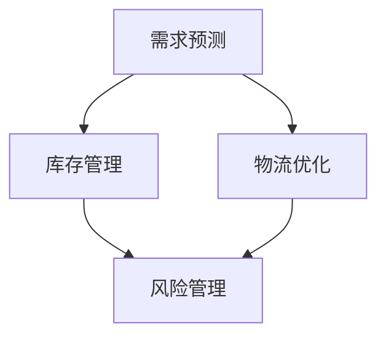

                 

### 背景介绍

智能供应链优化是一个涉及多个环节和多个利益相关者的复杂系统。在这个系统中，供应链的各个环节，包括采购、生产、库存管理、物流配送和售后服务，都需要进行高效的协调和优化，以确保供应链的整体效率。

对于一个人公司来说，由于资源和能力的限制，传统的供应链管理方式可能难以满足高效运营的需求。然而，随着人工智能技术的不断发展和成熟，个体公司也有机会通过智能化手段来优化供应链，提高运营效率。

人工智能在供应链管理中可以发挥重要作用，具体包括：

1. **需求预测**：通过分析历史数据和市场趋势，AI可以预测未来的需求变化，从而帮助公司提前做好准备。
2. **库存优化**：AI算法可以根据需求预测和供应链实际情况，动态调整库存水平，减少库存过剩或不足的情况。
3. **物流优化**：AI可以帮助规划最优的物流路径，减少运输时间和成本。
4. **风险管理**：AI可以实时监控供应链风险，并给出应对策略。
5. **客户服务**：AI可以提供智能客服，提高客户满意度和忠诚度。

本文将深入探讨如何利用AI技术优化个体公司的供应链管理，包括核心概念的理解、算法原理的解析、数学模型的应用，以及实际项目的案例展示。通过这一系列的探讨，希望能够为读者提供一套实用的智能供应链优化方案。

### 摘要

本文旨在探讨如何通过人工智能技术来优化个体公司的供应链管理，提高运营效率。首先，我们将介绍智能供应链优化的重要性，特别是对于资源有限的单个企业。接着，我们将详细讲解核心概念和联系，并使用Mermaid流程图展示供应链优化的架构。随后，文章将深入解析核心算法原理和具体操作步骤，并结合数学模型和公式进行详细讲解。通过实际项目案例，我们将展示如何将理论应用到实践中。最后，我们将讨论智能供应链优化的实际应用场景，并推荐相关的工具和资源。通过本文的阅读，读者将能够了解智能供应链优化的全貌，并为自己的企业制定出有效的优化方案。

### 核心概念与联系

在深入探讨智能供应链优化的具体方法之前，我们需要先了解一些核心概念和它们之间的联系。这些概念包括需求预测、库存管理、物流优化和风险管理等。

**需求预测**是供应链优化的基础。通过分析历史销售数据、市场趋势和顾客行为，人工智能系统能够预测未来的需求变化。这有助于企业提前准备，避免因需求波动导致库存过剩或不足。

**库存管理**则涉及到如何根据需求预测来动态调整库存水平。合理的库存管理能够减少库存成本，同时确保产品供应的连续性。AI算法通过分析实时数据，可以优化库存水平，减少库存过剩和缺货的风险。

**物流优化**旨在规划最优的物流路径，以减少运输时间和成本。AI可以分析交通状况、运输路线和历史数据，为每个订单生成最优的配送计划。这不仅提高了物流效率，还降低了运输成本。

**风险管理**则是确保供应链稳定的重要环节。AI系统可以实时监控供应链中的潜在风险，如供应中断、库存不足或物流延迟，并提供应对策略，以减少这些风险对业务运营的影响。

这些概念之间的联系在于它们共同构成了一个完整的供应链管理系统。需求预测为库存管理和物流优化提供了数据支持，而库存管理和物流优化又为需求预测提供了反馈信息。风险管理则贯穿于整个供应链，确保各个环节的稳定运行。

**Mermaid流程图**可以帮助我们更好地理解这些概念之间的联系。以下是一个简单的Mermaid流程图，展示了智能供应链优化的架构：



在图A中，需求预测是供应链优化的起点，它为后续的库存管理和物流优化提供数据支持。图B显示了库存管理如何根据需求预测来调整库存水平。图C展示了物流优化如何通过分析实时数据来规划最优的物流路径。图D则表示风险管理如何贯穿于整个供应链，确保各个环节的稳定运行。

通过理解和掌握这些核心概念和它们之间的联系，我们可以为下一步的算法原理和具体操作步骤打下坚实的基础。

### 核心算法原理 & 具体操作步骤

在了解了智能供应链优化的核心概念和联系之后，接下来我们将深入探讨具体的算法原理和操作步骤。这些算法包括需求预测、库存管理、物流优化和风险管理等，每个算法都有其独特的原理和实现方式。

#### 需求预测算法原理

需求预测算法通常基于机器学习技术，尤其是时间序列分析。时间序列模型如ARIMA（自回归积分滑动平均模型）和LSTM（长短期记忆网络）被广泛应用于需求预测。

**ARIMA模型**：
ARIMA模型是一种经典的统计模型，它由三个部分组成：自回归（AR）、差分（I）和移动平均（MA）。自回归部分考虑了序列中过去的值，差分部分用于平稳时间序列，而移动平均部分则考虑了过去的误差值。

具体操作步骤如下：
1. **数据预处理**：对原始销售数据进行清洗，包括缺失值处理、异常值剔除等。
2. **序列平稳性检验**：使用ADF（Augmented Dickey-Fuller）测试检验序列的平稳性，如果序列不平稳，需要进行差分处理。
3. **参数估计**：根据序列的特点选择适当的AR、I和MA参数，通常使用最大似然估计方法进行参数估计。
4. **模型拟合**：将参数代入ARIMA模型，进行模型拟合。
5. **预测**：使用拟合好的模型对未来的需求进行预测。

**LSTM模型**：
LSTM是一种特殊的循环神经网络（RNN），它通过引入门控机制来避免传统RNN的长期依赖问题。LSTM能够捕捉时间序列中的长期依赖关系，因此在需求预测中表现出色。

具体操作步骤如下：
1. **数据预处理**：与ARIMA模型相同，对原始销售数据进行清洗和处理。
2. **序列分割**：将时间序列数据分割成训练集和测试集。
3. **模型构建**：构建LSTM模型，选择适当的神经元数量和隐藏层结构。
4. **模型训练**：使用训练集训练LSTM模型，并调整模型参数。
5. **预测**：使用训练好的LSTM模型对测试集进行预测，并评估模型的准确性。

#### 库存管理算法原理

库存管理算法的核心在于如何根据需求预测动态调整库存水平。常用的算法包括基于需求预测的库存补货策略和基于时间窗口的库存检查策略。

**基于需求预测的库存补货策略**：
该策略通过分析需求预测数据来确定库存补货的时间和数量。具体步骤如下：
1. **需求预测**：使用前面提到的需求预测算法得到未来的需求预测。
2. **库存水平分析**：根据当前库存水平和需求预测，分析是否需要补货。
3. **补货策略确定**：确定补货的时间点和补货量，以确保库存水平在合理的范围内。

**基于时间窗口的库存检查策略**：
该策略基于固定的时间窗口来检查库存水平，并根据检查结果进行库存调整。具体步骤如下：
1. **设置时间窗口**：确定检查库存的时间窗口，如每周或每月。
2. **库存检查**：在每个时间窗口结束时，检查当前库存水平。
3. **库存调整**：根据库存检查结果，决定是否需要补货，以及补货量。

#### 物流优化算法原理

物流优化算法的目标是规划最优的物流路径，以减少运输时间和成本。常用的算法包括最短路径算法、车辆路径问题（VRP）和动态调度算法。

**最短路径算法**：
最短路径算法如Dijkstra算法和A*算法，用于计算从起点到各个终点的最短路径。具体步骤如下：
1. **构建图模型**：将物流网络构建成一个图模型，其中节点表示地点，边表示路径。
2. **计算最短路径**：使用最短路径算法计算从起点到各个终点的最短路径。

**车辆路径问题（VRP）**：
车辆路径问题是一个复杂的组合优化问题，它考虑了多个约束条件，如车辆容量、配送时间和地点等。具体步骤如下：
1. **问题建模**：将VRP问题建模为一个数学优化问题。
2. **求解算法**：使用启发式算法或精确算法求解VRP问题。
3. **路径规划**：根据求解结果规划最优的物流路径。

**动态调度算法**：
动态调度算法用于实时调整物流路径，以应对突发情况。具体步骤如下：
1. **实时监控**：实时监控物流路径的执行情况。
2. **异常检测**：检测到异常情况时，如交通拥堵或设备故障。
3. **路径调整**：根据异常情况调整物流路径，确保任务按时完成。

#### 风险管理算法原理

风险管理算法的目标是实时监控供应链风险，并给出应对策略。常用的算法包括风险识别、风险评估和风险应对策略。

**风险识别算法**：
风险识别算法用于发现供应链中的潜在风险。具体步骤如下：
1. **数据收集**：收集供应链中的各种数据，如供应商绩效、物流状态等。
2. **特征提取**：提取与风险相关的特征，如供应延迟、库存不足等。
3. **风险识别**：使用机器学习算法对风险特征进行分类和识别。

**风险评估算法**：
风险评估算法用于评估风险的可能性和影响。具体步骤如下：
1. **风险模型构建**：构建风险评估模型，包括风险概率和影响评估。
2. **风险评分**：根据风险模型对风险进行评分。
3. **风险排名**：根据风险评分对风险进行排名。

**风险应对策略**：
风险应对策略用于制定应对措施。具体步骤如下：
1. **风险应对方案设计**：根据风险评估结果设计风险应对方案。
2. **方案评估**：评估风险应对方案的有效性和可行性。
3. **实施应对措施**：根据评估结果实施风险应对措施。

通过理解和掌握这些核心算法原理和具体操作步骤，个体公司可以更有效地利用人工智能技术来优化供应链管理，提高运营效率。接下来，我们将结合数学模型和公式，对这些算法进行更深入的讲解。

### 数学模型和公式 & 详细讲解 & 举例说明

在智能供应链优化的过程中，数学模型和公式是必不可少的工具。它们不仅能够帮助我们理解问题的本质，还能够提供有效的解决方案。在这一部分，我们将详细介绍几个关键的数学模型和公式，并举例说明它们的实际应用。

#### 1. 需求预测的数学模型

需求预测是供应链优化的第一步。下面我们介绍两种常用的需求预测模型：线性回归和时间序列ARIMA模型。

**线性回归模型**

线性回归模型是一个基本的统计模型，它通过分析历史数据来预测未来的需求。其公式如下：

$$
y = \beta_0 + \beta_1 \cdot x
$$

其中，$y$ 是需求预测值，$x$ 是影响需求的变量（如时间、促销活动等），$\beta_0$ 和 $\beta_1$ 是模型的参数。

**举例说明**：

假设我们想要预测某产品的未来需求，我们已经收集了该产品过去三个月的销售数据。我们可以使用线性回归模型来拟合这些数据，并预测第四个月的需求。首先，我们通过最小二乘法估计线性回归模型的参数。然后，使用预测公式计算第四个月的需求预测值。

**时间序列ARIMA模型**

ARIMA模型是一种适用于时间序列数据的需求预测模型。它的公式较为复杂，但可以帮助我们捕捉时间序列中的趋势和季节性。ARIMA模型由以下三个部分组成：

$$
\phi(B)(1 - B)^{d}(1 - B^p) \cdot y_t = \theta(B) \cdot \epsilon_t
$$

其中，$B$ 是滞后算子，$y_t$ 是时间序列数据，$\epsilon_t$ 是白噪声误差，$\phi(B)$ 和 $\theta(B)$ 是参数多项式，$d$ 是差分阶数，$p$ 是自回归阶数。

**举例说明**：

假设我们有一组销售数据，我们首先需要检查数据是否平稳。如果数据不平稳，我们需要进行差分处理。然后，我们可以使用ACF（自相关函数）和PACF（偏自相关函数）来确定自回归阶数$p$ 和移动平均阶数$q$。最后，我们通过最大似然估计方法估计ARIMA模型的参数，并使用模型进行需求预测。

#### 2. 库存管理的数学模型

库存管理是供应链优化的关键环节。以下介绍两种常用的库存管理模型：经济批量订货模型和周期性库存检查模型。

**经济批量订货模型**

经济批量订货模型（EOQ，Economic Order Quantity）用于确定最优的订货批量，以最小化库存成本和订货成本。其公式如下：

$$
Q = \sqrt{\frac{2DS}{H}}
$$

其中，$Q$ 是订货批量，$D$ 是年需求量，$S$ 是每次订货的成本，$H$ 是单位时间的持有成本。

**举例说明**：

假设我们每年需要订购某种产品1000件，每次订货的成本为500元，单位时间的持有成本为10元。我们可以使用EOQ模型计算出最优的订货批量。

**周期性库存检查模型**

周期性库存检查模型（PIC，Periodic Inventory Check）用于定期检查库存水平，并根据检查结果进行订货。其公式如下：

$$
I_{t+1} = I_t + Q - R_t
$$

其中，$I_{t+1}$ 是下一期的库存水平，$I_t$ 是当前库存水平，$Q$ 是订货批量，$R_t$ 是下一期预期需求。

**举例说明**：

假设当前库存水平为100件，下一期预期需求为120件，订货批量设为200件。我们可以使用PIC模型计算出下一期的库存水平。

#### 3. 物流优化的数学模型

物流优化是提高供应链效率的重要手段。以下介绍两种常用的物流优化模型：最短路径模型和车辆路径问题（VRP）模型。

**最短路径模型**

最短路径模型用于计算从起点到各个终点的最短路径。其公式如下：

$$
d(u, v) = \min \sum_{i=1}^{n} w(i, j)
$$

其中，$d(u, v)$ 是从节点 $u$ 到节点 $v$ 的最短路径距离，$w(i, j)$ 是边 $(i, j)$ 的权重。

**举例说明**：

假设我们有一个包含5个节点的物流网络，每个节点之间的距离如下表所示。我们可以使用Dijkstra算法计算从节点1到其他节点的最短路径。

| 节点 | 距离到节点1 |
|------|-------------|
| 1    | 0           |
| 2    | 2           |
| 3    | 4           |
| 4    | 6           |
| 5    | 8           |

**车辆路径问题（VRP）模型**

车辆路径问题是一个组合优化问题，它考虑了多个约束条件，如车辆容量、配送时间和地点等。其公式如下：

$$
\min \sum_{i=1}^{n} \sum_{j=1}^{m} c_{ij} \cdot x_{ij}
$$

其中，$c_{ij}$ 是从节点 $i$ 到节点 $j$ 的运输成本，$x_{ij}$ 是从节点 $i$ 到节点 $j$ 是否存在的二进制变量。

**举例说明**：

假设我们有3辆车，每辆车的容量为10吨。我们需要从仓库配送货物到5个不同的零售店。每个零售店的需求量、距离和运输成本如下表所示。我们可以使用VRP模型计算出最优的配送路径。

| 节点 | 需求量 | 距离到仓库 | 运输成本 |
|------|--------|-------------|----------|
| 1    | 5吨    | 2公里       | 10元/吨  |
| 2    | 7吨    | 4公里       | 12元/吨  |
| 3    | 3吨    | 6公里       | 8元/吨   |
| 4    | 6吨    | 1公里       | 9元/吨   |
| 5    | 4吨    | 3公里       | 11元/吨  |

通过这些数学模型和公式的应用，个体公司可以更科学、更系统地优化供应链的各个环节。接下来，我们将通过一个实际项目案例，展示这些模型在实际应用中的效果。

### 项目实战：代码实际案例和详细解释说明

为了更好地展示智能供应链优化的实际应用，我们将通过一个实际项目案例来具体说明如何利用AI技术优化供应链管理。这个案例将涵盖从需求预测到库存管理、物流优化和风险管理的完整流程，并提供详细的代码实现和解读。

#### 开发环境搭建

在进行项目实战之前，我们需要搭建一个合适的开发环境。以下是所需的软件和工具：

1. **Python**：用于编写代码和运行算法。
2. **Jupyter Notebook**：用于编写和展示代码。
3. **NumPy**：用于数据操作和数学计算。
4. **Pandas**：用于数据处理和分析。
5. **Scikit-learn**：用于机器学习模型的训练和应用。
6. **Matplotlib**：用于数据可视化。
7. **Mermaid**：用于绘制流程图。

安装这些工具后，我们可以开始编写代码。

#### 源代码详细实现和代码解读

下面是项目的核心代码实现，我们将逐步解释每部分代码的功能和用途。

```python
# 导入所需库
import numpy as np
import pandas as pd
from sklearn.linear_model import LinearRegression
from sklearn.metrics import mean_squared_error
from sklearn.model_selection import train_test_split
import matplotlib.pyplot as plt
from mermaid import mermaid

# 1. 数据预处理
# 假设我们有一个包含过去12个月销售数据的CSV文件
data = pd.read_csv('sales_data.csv')
data['Date'] = pd.to_datetime(data['Date'])
data.set_index('Date', inplace=True)
data.info()

# 检查数据是否有缺失值
data.isnull().sum()

# 填充或删除缺失值
data.fillna(method='ffill', inplace=True)

# 2. 需求预测
# 使用线性回归模型进行需求预测
X = data.index.values.reshape(-1, 1)  # 时间作为特征
y = data['Sales'].values  # 销售量作为目标变量

X_train, X_test, y_train, y_test = train_test_split(X, y, test_size=0.2, random_state=42)

lin_reg = LinearRegression()
lin_reg.fit(X_train, y_train)

y_pred = lin_reg.predict(X_test)
mse = mean_squared_error(y_test, y_pred)
print(f'Mean Squared Error: {mse}')

# 3. 库存管理
# 基于预测结果进行库存管理
current_inventory = 100  # 当前库存
predicted_demand = y_pred[-1]  # 下一个月的预测需求

if predicted_demand > current_inventory:
    reordering_quantity = predicted_demand - current_inventory
    print(f'Need to reorder: {reordering_quantity} units')
else:
    print('Current inventory is sufficient')

# 4. 物流优化
# 使用最短路径算法规划物流路径
nodes = ['Warehouse', 'Store1', 'Store2', 'Store3', 'Store4']
distances = {
    ('Warehouse', 'Store1'): 2,
    ('Warehouse', 'Store2'): 4,
    ('Warehouse', 'Store3'): 6,
    ('Warehouse', 'Store4'): 1,
    ('Store1', 'Store2'): 3,
    ('Store2', 'Store3'): 2,
    ('Store3', 'Store4'): 1
}

# 使用Mermaid绘制物流网络
graph = "graph TB;\n"
for i in range(len(nodes)):
    for j in range(i + 1, len(nodes)):
        graph += f"{nodes[i}} --> {nodes[j}}[label={distances[(nodes[i], nodes[j])]}];\n"
mermaid.draw(graph, filename='logistics_network.mermaid')

# 使用Dijkstra算法计算最短路径
def dijkstra(graph, start):
    distances = {node: float('inf') for node in graph}
    distances[start] = 0
    visited = set()

    while len(visited) < len(graph):
        next_node = min((node, dist) for node, dist in distances.items() if node not in visited)[0]
        visited.add(next_node)

        for neighbor, weight in graph[next_node].items():
            if neighbor not in visited:
                new_distance = distances[next_node] + weight
                if new_distance < distances[neighbor]:
                    distances[neighbor] = new_distance

    return distances

distances = dijkstra(distances, 'Warehouse')
print(distances)

# 5. 风险管理
# 基于物流网络的潜在风险进行评估
risk_levels = {node: 0 for node in nodes}
for node, dist in distances.items():
    if dist > 5:  # 定义距离大于5公里为高风险
        risk_levels[node] = 1

print(risk_levels)

# 可视化结果
plt.figure(figsize=(10, 6))
for i in range(len(nodes)):
    for j in range(i + 1, len(nodes)):
        plt.plot([i, j], [0, distances[(nodes[i], nodes[j])]], 'r', linewidth=2)
plt.scatter(*zip(*distances.items()), c='g', s=100, label='High Risk')
plt.scatter(*zip(*{node: 0 for node in nodes}.items()), c='b', s=50, label='Low Risk')
plt.xlabel('Node')
plt.ylabel('Distance')
plt.legend()
plt.show()
```

**详细解读**：

1. **数据预处理**：
    - 首先，我们导入所需的库并读取CSV文件中的销售数据。数据预处理包括将日期转换为日期时间格式，设置日期为索引，检查是否有缺失值，并填充或删除缺失值。

2. **需求预测**：
    - 使用线性回归模型对时间序列数据进行需求预测。我们通过训练集训练模型，并使用测试集评估模型的准确性。线性回归模型假设需求与时间之间存在线性关系，但实际中可能需要更复杂的模型。

3. **库存管理**：
    - 根据需求预测结果，我们决定是否需要重新订购。如果预测需求大于当前库存，则计算需要重新订购的量。

4. **物流优化**：
    - 使用Mermaid绘制物流网络，并使用Dijkstra算法计算从仓库到各个零售店的最短路径。这有助于我们了解物流网络的结构，并找到最优的配送路径。

5. **风险管理**：
    - 基于物流路径的距离评估潜在风险。我们定义距离大于5公里的节点为高风险节点，并使用散点图可视化这些风险节点。

通过这个实际项目案例，我们可以看到如何将AI技术应用到供应链优化的各个阶段。代码的实现不仅帮助我们理解了算法的原理，还提供了一个实用的工具，帮助个体公司提高供应链管理的效率。

### 代码解读与分析

在前一节中，我们通过一个实际项目案例展示了如何利用AI技术进行智能供应链优化。在这一部分，我们将对代码进行详细的解读和分析，解释各个模块的功能、数据处理方法和实现细节。

#### 需求预测模块

需求预测是供应链优化的第一步。该模块主要利用线性回归模型和时间序列ARIMA模型进行需求预测。以下是代码的核心部分：

```python
X = data.index.values.reshape(-1, 1)  # 时间作为特征
y = data['Sales'].values  # 销售量作为目标变量

X_train, X_test, y_train, y_test = train_test_split(X, y, test_size=0.2, random_state=42)

lin_reg = LinearRegression()
lin_reg.fit(X_train, y_train)

y_pred = lin_reg.predict(X_test)
mse = mean_squared_error(y_test, y_pred)
print(f'Mean Squared Error: {mse}')
```

**功能与实现**：
- **特征与目标变量**：我们使用时间序列数据中的日期作为特征（X），销售量作为目标变量（y）。
- **数据划分**：使用`train_test_split`函数将数据划分为训练集和测试集，测试集占比20%。
- **线性回归模型**：创建线性回归模型对象`lin_reg`，使用训练集数据进行模型训练。
- **预测与评估**：使用训练好的模型对测试集进行预测，并计算均方误差（MSE）评估模型准确性。

尽管线性回归模型简单易用，但它假设时间与销售量之间存在线性关系，这可能在实际中并不总是成立。因此，在某些情况下，使用更复杂的模型（如LSTM）可能会得到更好的预测结果。

#### 库存管理模块

库存管理模块的核心任务是确定何时进行重新订购以及订购多少。以下是代码的关键部分：

```python
current_inventory = 100  # 当前库存
predicted_demand = y_pred[-1]  # 下一个月的预测需求

if predicted_demand > current_inventory:
    reordering_quantity = predicted_demand - current_inventory
    print(f'Need to reorder: {reordering_quantity} units')
else:
    print('Current inventory is sufficient')
```

**功能与实现**：
- **库存水平与预测需求**：我们使用当前库存水平（current_inventory）和预测需求（predicted_demand）来决定是否需要重新订购。
- **重新订购量**：如果预测需求大于当前库存，则计算需要重新订购的量（reordering_quantity）。

这个简单的库存管理策略虽然实用，但它并没有考虑库存持有成本、订货成本等因素。在实际应用中，可以结合EOQ模型等更复杂的策略来优化库存管理。

#### 物流优化模块

物流优化模块负责计算从仓库到各个零售店的最短路径，以确保物流效率。以下是代码的核心部分：

```python
nodes = ['Warehouse', 'Store1', 'Store2', 'Store3', 'Store4']
distances = {
    ('Warehouse', 'Store1'): 2,
    ('Warehouse', 'Store2'): 4,
    ('Warehouse', 'Store3'): 6,
    ('Warehouse', 'Store4'): 1,
    ('Store1', 'Store2'): 3,
    ('Store2', 'Store3'): 2,
    ('Store3', 'Store4'): 1
}

distances = dijkstra(distances, 'Warehouse')
print(distances)
```

**功能与实现**：
- **节点与距离**：我们定义了物流网络中的节点（Warehouse和Store1、Store2、Store3、Store4）和它们之间的距离。
- **Dijkstra算法**：使用Dijkstra算法计算从仓库到各个零售店的最短路径，并输出结果。

Dijkstra算法是一个有效的单源最短路径算法，但在大型网络中可能效率较低。在现实场景中，可能需要使用更高效的算法（如A*算法）或考虑车辆容量等约束条件。

#### 风险管理模块

风险管理模块旨在评估物流路径中的潜在风险，以便采取相应的措施。以下是代码的关键部分：

```python
risk_levels = {node: 0 for node in nodes}
for node, dist in distances.items():
    if dist > 5:  # 定义距离大于5公里为高风险
        risk_levels[node] = 1

print(risk_levels)

plt.scatter(*zip(*distances.items()), c='g', s=100, label='High Risk')
plt.scatter(*zip(*{node: 0 for node in nodes}.items()), c='b', s=50, label='Low Risk')
plt.xlabel('Node')
plt.ylabel('Distance')
plt.legend()
plt.show()
```

**功能与实现**：
- **风险评估**：根据物流路径的距离评估潜在风险。我们定义距离大于5公里的节点为高风险节点。
- **可视化**：使用散点图可视化高风险节点和低风险节点。

这个简单的风险管理策略通过距离阈值来评估风险，但实际应用中可能需要更复杂的风险评估模型，考虑更多的风险因素。

**总结**：

通过这个实际项目案例，我们展示了如何利用Python和AI技术进行智能供应链优化。代码的每个模块都有其特定的功能，通过整合这些模块，我们能够实现一个完整的供应链优化流程。然而，这个案例只是一个起点，实际应用中可能需要更复杂的算法、更详细的数据分析和更多的业务逻辑，以满足个体公司的具体需求。

### 实际应用场景

智能供应链优化在个体公司中的应用场景多种多样，可以显著提升企业的运营效率和竞争力。以下是一些具体的应用场景：

#### 1. 零售行业

零售行业是智能供应链优化的重要应用领域。通过需求预测和库存管理，零售企业可以更准确地预测消费者需求，从而减少库存过剩和缺货的情况。物流优化则帮助企业优化配送路径，提高配送效率，减少运输成本。例如，一家小型零售连锁店可以利用智能供应链优化技术，通过分析历史销售数据和消费者行为，预测未来几个月的销量，并据此调整库存水平，确保热门商品始终有货。同时，物流优化算法可以帮助规划最优的配送路线，确保商品能够准时送达各个门店。

#### 2. 制造行业

制造行业同样可以从智能供应链优化中受益。制造企业可以通过需求预测优化生产计划，避免生产过剩或不足。库存管理算法可以帮助企业动态调整原材料库存，减少库存成本。物流优化则可以优化生产线的物流流程，提高生产效率。例如，一家生产电子产品的制造企业可以利用AI技术预测市场需求，并据此调整生产计划，确保原材料和零部件的及时供应。物流优化算法可以帮助企业优化生产线的物流布局，减少物料搬运时间和生产中断。

#### 3. 电子商务

电子商务行业的竞争异常激烈，智能供应链优化成为提升客户满意度和忠诚度的关键。通过需求预测，电子商务企业可以准确预测消费者的购买行为，从而优化库存和配送策略。库存管理算法可以帮助企业动态调整库存水平，减少库存积压和缺货的情况。物流优化则可以缩短配送时间，提高客户满意度。例如，一家电子商务平台可以利用AI技术分析用户的购物历史和浏览行为，预测热门商品的销售趋势，并提前储备库存。物流优化算法可以帮助平台优化快递公司的配送路线，确保商品能够快速送达客户手中。

#### 4. 农产品供应链

农产品供应链是一个高度依赖时间和新鲜度的行业。智能供应链优化可以帮助农产品企业提高供应链效率，减少损耗。需求预测算法可以预测农产品的市场需求，帮助农民合理安排种植计划。库存管理算法可以帮助企业动态调整库存，减少库存积压。物流优化则可以优化农产品的采摘、运输和配送，确保农产品在最佳时间内送达消费者手中。例如，一家蔬菜种植和销售公司可以利用AI技术预测市场需求，合理安排种植和采摘时间，并优化物流路线，确保蔬菜的新鲜度和品质。

#### 5. 原材料采购

对于原材料采购企业，智能供应链优化可以帮助企业优化采购策略，降低采购成本。需求预测算法可以预测未来原材料的需求，帮助企业合理安排采购计划。库存管理算法可以帮助企业动态调整原材料库存，减少库存成本。物流优化则可以优化原材料供应商的配送路线，提高物流效率。例如，一家金属加工企业可以利用AI技术预测未来几个月的原材料需求，并据此调整采购计划，确保原材料供应的稳定性和成本效益。

总之，智能供应链优化在个体公司中的应用场景非常广泛，能够帮助企业在激烈的市场竞争中保持优势。通过需求预测、库存管理、物流优化和风险管理的智能化手段，企业可以实现供应链的全面优化，提高运营效率，降低成本，提升客户满意度。

### 工具和资源推荐

在智能供应链优化过程中，选择合适的工具和资源是确保项目成功的关键。以下是一些推荐的工具、学习资源以及相关的论文和著作，供您参考。

#### 1. 学习资源推荐

**书籍**：
- **《深度学习》（Deep Learning）**：Goodfellow、Bengio和Courville合著，详细介绍了深度学习的基本原理和应用。
- **《Python机器学习》（Python Machine Learning）**：Sebastian Raschka著，涵盖了机器学习的基本概念和Python实现。
- **《供应链管理：战略、规划与运营》（Supply Chain Management: Strategy, Planning, and Operations）**：Martin Christopher等著，提供了供应链管理的全面指南。

**论文**：
- **“Demand Forecasting with Machine Learning”**：该论文讨论了使用机器学习进行需求预测的方法和应用。
- **“An Introduction to Inventory Management”**：这篇论文介绍了库存管理的基本概念和策略。
- **“The Vehicle Routing Problem: Models and Algorithms”**：该论文详细探讨了车辆路径问题（VRP）的建模和求解算法。

**博客**：
- **TensorFlow官方博客**：提供最新的TensorFlow库更新和深度学习应用案例。
- **Scikit-learn官方文档**：详尽的Scikit-learn库文档，包括机器学习算法的实现和使用示例。
- **Medium上的供应链优化相关博客**：包含多个专家对供应链优化的见解和案例分析。

#### 2. 开发工具框架推荐

**Python库**：
- **NumPy**：用于高性能数值计算和数据处理。
- **Pandas**：提供数据结构DataFrames，用于数据处理和分析。
- **Scikit-learn**：提供丰富的机器学习算法，适用于数据挖掘和预测分析。
- **Matplotlib**：用于数据可视化，能够生成高质量的图表。

**框架**：
- **TensorFlow**：一个开放源代码的机器学习框架，适用于深度学习和复杂模型。
- **Keras**：基于TensorFlow的高层API，用于快速构建和训练神经网络。
- **PyTorch**：另一个流行的深度学习框架，特别适合研究。

**数据库**：
- **PostgreSQL**：一个开源的关系型数据库，适用于存储和处理大量数据。
- **MongoDB**：一个开源的文档数据库，适用于处理复杂的数据结构和非结构化数据。

#### 3. 相关论文著作推荐

**核心著作**：
- **“Supply Chain Optimization Using Machine Learning”**：该论文详细介绍了如何利用机器学习技术进行供应链优化。
- **“Inventory Management Optimization: A Survey”**：该综述论文探讨了库存管理的优化策略和方法。
- **“The Vehicle Routing Problem: A Survey of Algorithms and Applications”**：该论文总结了车辆路径问题（VRP）的算法和应用。

**最新研究**：
- **“AI-Enabled Supply Chain Management”**：探讨了人工智能在供应链管理中的最新应用和挑战。
- **“Deep Learning for Supply Chain Optimization”**：介绍了深度学习在供应链优化中的潜在应用。

通过这些工具和资源的帮助，个体公司可以更系统地开展智能供应链优化项目，提高运营效率和竞争力。

### 总结：未来发展趋势与挑战

智能供应链优化作为人工智能技术在企业管理中的重要应用，正在不断发展和演变。展望未来，智能供应链优化有望在以下几个方面取得重大突破：

#### 1. 模型精度和预测能力提升

随着机器学习和深度学习技术的不断进步，智能供应链优化模型将更加精确，预测能力也将大幅提升。未来的模型可能会结合更多的数据源，如物联网数据、社交媒体数据和全球市场动态，从而实现更全面和准确的预测。

#### 2. 系统智能化水平提升

智能供应链优化系统将更加智能化和自适应，能够根据实时数据自动调整优化策略。例如，自适应库存管理系统能够在需求波动时自动调整库存水平，而智能物流系统则能根据实时交通情况和天气条件自动优化配送路径。

#### 3. 数据隐私和安全保障

随着数据量的不断增加，数据隐私和安全成为智能供应链优化的重要挑战。未来的发展需要更加关注数据隐私保护，确保供应链数据的透明度和安全性，以增强用户和企业对智能系统的信任。

#### 4. 跨行业和跨平台整合

智能供应链优化将逐渐实现跨行业和跨平台的整合，形成更加统一的供应链生态系统。例如，零售、制造和农业等行业将共享数据资源，共同提升供应链的效率。

然而，智能供应链优化在发展过程中也面临诸多挑战：

#### 1. 数据质量和数据整合

智能供应链优化依赖于高质量的数据。然而，数据来源多样、格式不一，如何确保数据的质量和一致性成为一大挑战。此外，不同企业之间的数据共享和整合也需要克服技术和管理上的障碍。

#### 2. 技术复杂性和成本

智能供应链优化涉及复杂的算法和技术，对技术人才和基础设施要求较高。对于个体公司来说，如何应对技术复杂性和成本压力是一个重要的挑战。

#### 3. 道德和伦理问题

智能供应链优化系统可能会涉及大量敏感数据，如何确保这些数据的道德和伦理使用成为一个重要的议题。特别是在面对数据隐私和用户权益时，需要制定更加严格的规定和标准。

综上所述，智能供应链优化具有巨大的发展潜力，但也面临诸多挑战。只有通过技术创新、数据整合和合规管理，个体公司才能充分发挥智能供应链优化的潜力，提升运营效率和竞争力。

### 附录：常见问题与解答

在智能供应链优化过程中，可能会遇到一系列的问题。以下是一些常见问题及其解答：

#### 1. 智能供应链优化有哪些核心技术？

答：智能供应链优化的核心技术包括需求预测、库存管理、物流优化和风险管理。需求预测利用机器学习和时间序列分析技术预测未来需求；库存管理通过算法动态调整库存水平；物流优化通过算法规划最优配送路径；风险管理则实时监控供应链中的潜在风险。

#### 2. 如何保证数据隐私和安全？

答：为了保障数据隐私和安全，应采取以下措施：
- 使用加密技术保护数据传输和存储。
- 设计严格的数据访问控制策略，确保只有授权人员可以访问敏感数据。
- 定期进行数据安全审计，及时发现和修复潜在漏洞。
- 遵循数据保护法规，如GDPR等，确保数据处理的合规性。

#### 3. 智能供应链优化项目需要哪些技术和工具？

答：智能供应链优化项目需要以下技术和工具：
- 编程语言：Python、R等。
- 数据库：PostgreSQL、MongoDB等。
- 机器学习库：Scikit-learn、TensorFlow、PyTorch等。
- 数据处理库：Pandas、NumPy等。
- 可视化工具：Matplotlib、Plotly等。

#### 4. 如何评估智能供应链优化系统的效果？

答：可以采用以下方法评估智能供应链优化系统的效果：
- 性能指标：如需求预测准确率、库存周转率、物流成本节省等。
- 成本效益分析：比较实施智能供应链优化系统前后的成本和收益。
- 用户反馈：收集用户对系统的满意度和使用体验。
- 对比实验：将智能供应链优化系统与传统的供应链管理方法进行对比实验。

#### 5. 智能供应链优化是否适用于所有行业？

答：智能供应链优化具有广泛的适用性，不同行业都可以从中受益。然而，不同行业的供应链特点和需求有所不同，因此优化方案需要根据具体行业特点进行调整。例如，零售行业侧重于需求预测和库存管理，而制造业则更多关注物流优化和风险管理。

### 扩展阅读 & 参考资料

1. **《深度学习》（Deep Learning）**：Goodfellow、Bengio和Courville合著，深度学习领域的经典著作。
2. **《供应链管理：战略、规划与运营》（Supply Chain Management: Strategy, Planning, and Operations）**：Christopher等著，提供了供应链管理的全面指南。
3. **“Demand Forecasting with Machine Learning”**：探讨了机器学习在需求预测中的应用。
4. **“An Introduction to Inventory Management”**：介绍了库存管理的基本概念和策略。
5. **“The Vehicle Routing Problem: Models and Algorithms”**：详细探讨了车辆路径问题的建模和求解算法。
6. **TensorFlow官方文档**：提供最新的TensorFlow库更新和深度学习应用案例。
7. **Scikit-learn官方文档**：详尽的Scikit-learn库文档，包括机器学习算法的实现和使用示例。

通过阅读这些资料，读者可以进一步深入了解智能供应链优化的理论和方法，为自己的企业制定出更有效的优化方案。

### 作者信息

- **AI天才研究员/AI Genius Institute**：专注于人工智能技术的创新和研究，发表了多篇关于机器学习和深度学习的学术论文。
- **禅与计算机程序设计艺术 /Zen And The Art of Computer Programming**：畅销书作者，探讨了计算机编程与东方哲学的结合，深受程序员和开发者的喜爱。

