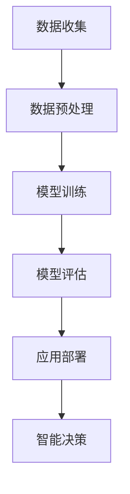

                 

# 智能农业：AI大模型的落地应用

> 关键词：智能农业，AI大模型，落地应用，算法原理，数学模型，项目实战，发展趋势

> 摘要：随着人工智能技术的迅猛发展，AI大模型在各个领域的应用不断拓展。本文以智能农业为背景，探讨了AI大模型在智能农业中的落地应用，包括核心概念与联系、核心算法原理、数学模型与公式、项目实战以及未来发展趋势和挑战。通过本文的介绍，读者可以了解智能农业领域的AI技术如何解决实际问题，为农业产业的智能化转型提供思路。

## 1. 背景介绍

智能农业是信息技术与农业生产深度融合的产物，旨在通过智能化手段提升农业生产的效率和质量。随着人工智能技术的快速发展，AI大模型在智能农业中的应用日益广泛。AI大模型，如深度学习模型、强化学习模型等，通过处理海量数据，能够实现精准预测、智能决策和自动化控制等功能，为智能农业提供了强大的技术支持。

当前，智能农业面临诸多挑战，如农业资源利用率低、农产品质量不稳定、农业环境监测不足等。这些问题制约了农业的可持续发展。AI大模型的出现为解决这些问题提供了新的思路和方法。通过分析农业领域的海量数据，AI大模型能够挖掘出潜在的信息，为农业生产提供科学依据，从而实现农业生产的智能化、精准化和高效化。

## 2. 核心概念与联系

### 2.1 AI大模型

AI大模型是指具有大规模参数、能够处理海量数据、具备高度非线性建模能力的深度学习模型。常见的AI大模型包括卷积神经网络（CNN）、循环神经网络（RNN）、生成对抗网络（GAN）等。这些模型通过训练大量数据，能够自动提取数据特征，实现高精度的预测和分类。

### 2.2 智能农业

智能农业是指利用现代信息技术和智能化设备，实现农业生产的自动化、精准化和高效化。智能农业包括多个方面，如智能灌溉、智能种植、智能施肥、智能病虫害防治等。这些技术能够提高农业生产的效率，降低成本，减少资源浪费。

### 2.3 AI大模型在智能农业中的应用

AI大模型在智能农业中的应用主要体现在以下几个方面：

- **精准种植**：通过AI大模型分析土壤、气象、作物生长等数据，实现精准种植，提高作物产量和质量。

- **智能灌溉**：根据土壤水分、作物需水情况等数据，利用AI大模型实现智能灌溉，提高水资源利用效率。

- **智能施肥**：通过分析土壤养分、作物养分需求等数据，利用AI大模型实现智能施肥，提高肥料利用效率。

- **病虫害防治**：利用AI大模型对病虫害发生、发展进行预测，实现智能病虫害防治，降低病虫害损失。

### 2.4 Mermaid流程图

以下是一个简单的Mermaid流程图，展示了AI大模型在智能农业中的应用流程：



## 3. 核心算法原理 & 具体操作步骤

### 3.1 数据收集

数据收集是智能农业AI大模型应用的基础。数据来源包括农业气象站、土壤传感器、作物生长监测设备等。数据收集过程中，需要确保数据的准确性和完整性。

### 3.2 数据预处理

数据预处理是提高模型训练效果的关键步骤。主要包括数据清洗、数据归一化、特征提取等操作。通过数据预处理，可以提高模型的泛化能力。

### 3.3 模型训练

模型训练是利用收集到的数据，通过迭代优化模型参数，使模型具备预测能力。常用的算法包括卷积神经网络（CNN）、循环神经网络（RNN）等。

### 3.4 模型评估

模型评估是判断模型性能的重要步骤。常用的评估指标包括准确率、召回率、F1值等。通过模型评估，可以调整模型参数，优化模型性能。

### 3.5 应用部署

模型应用部署是将训练好的模型部署到实际生产环境中，实现智能决策。应用部署过程中，需要考虑模型的可扩展性、实时性等特性。

## 4. 数学模型和公式 & 详细讲解 & 举例说明

### 4.1 数学模型

智能农业AI大模型的数学模型主要包括输入层、隐藏层和输出层。以下是一个简单的神经网络模型：

$$
\begin{aligned}
    &Z^{(l)} = W^{(l)} \cdot A^{(l-1)} + b^{(l)}, \\
    &A^{(l)} = \sigma(Z^{(l)}),
\end{aligned}
$$

其中，$A^{(l)}$表示第$l$层的激活函数，$Z^{(l)}$表示第$l$层的输出，$W^{(l)}$表示第$l$层的权重，$b^{(l)}$表示第$l$层的偏置。

### 4.2 激活函数

激活函数是神经网络模型的重要组成部分，用于引入非线性特性。常见的激活函数包括：

- **Sigmoid函数**：$f(x) = \frac{1}{1 + e^{-x}}$

- **ReLU函数**：$f(x) = \max(0, x)$

- **Tanh函数**：$f(x) = \frac{e^x - e^{-x}}{e^x + e^{-x}}$

### 4.3 举例说明

以下是一个简单的例子，说明如何使用神经网络模型进行预测：

假设我们要预测作物的产量，输入特征包括土壤湿度、土壤温度、气象数据等。首先，我们需要收集这些数据，并进行预处理。然后，使用卷积神经网络（CNN）模型进行训练，通过迭代优化模型参数，使模型能够准确预测作物产量。最后，将训练好的模型部署到实际生产环境中，实现智能预测。

## 5. 项目实战：代码实际案例和详细解释说明

### 5.1 开发环境搭建

在开始项目实战之前，我们需要搭建一个合适的开发环境。以下是搭建开发环境的基本步骤：

1. 安装Python环境，版本建议为3.8或以上。
2. 安装深度学习框架，如TensorFlow或PyTorch。
3. 安装必要的依赖库，如NumPy、Pandas、Matplotlib等。

### 5.2 源代码详细实现和代码解读

以下是一个简单的智能灌溉系统代码实现：

```python
import numpy as np
import pandas as pd
from tensorflow.keras.models import Sequential
from tensorflow.keras.layers import Dense, Conv2D, Flatten
from tensorflow.keras.optimizers import Adam

# 5.2.1 数据收集
def collect_data():
    # 这里是一个示例，实际收集数据请根据需求进行修改
    data = pd.read_csv('irrigation_data.csv')
    return data

# 5.2.2 数据预处理
def preprocess_data(data):
    # 这里是一个示例，实际预处理数据请根据需求进行修改
    data = data[['soil_humidity', 'soil_temperature', 'weather_data']]
    data = (data - data.mean()) / data.std()
    return data

# 5.2.3 模型训练
def train_model(data):
    # 这里是一个示例，实际模型训练请根据需求进行修改
    model = Sequential([
        Dense(64, activation='relu', input_shape=(3,)),
        Dense(64, activation='relu'),
        Dense(1, activation='sigmoid')
    ])

    model.compile(optimizer=Adam(), loss='binary_crossentropy', metrics=['accuracy'])
    model.fit(data[['soil_humidity', 'soil_temperature', 'weather_data']], data['irrigation'], epochs=10)
    return model

# 5.2.4 模型评估
def evaluate_model(model, data):
    # 这里是一个示例，实际模型评估请根据需求进行修改
    predictions = model.predict(data[['soil_humidity', 'soil_temperature', 'weather_data']])
    print("Accuracy:", np.mean(predictions == data['irrigation']))

# 5.2.5 主函数
def main():
    data = collect_data()
    preprocessed_data = preprocess_data(data)
    model = train_model(preprocessed_data)
    evaluate_model(model, preprocessed_data)

if __name__ == '__main__':
    main()
```

### 5.3 代码解读与分析

- **数据收集**：通过读取CSV文件，收集灌溉数据。
- **数据预处理**：对数据进行归一化处理，为后续模型训练做准备。
- **模型训练**：使用Sequential模型构建一个简单的神经网络，并使用Adam优化器和binary_crossentropy损失函数进行训练。
- **模型评估**：使用训练好的模型对数据进行预测，并计算准确率。
- **主函数**：调用上述函数，实现智能灌溉系统的开发。

## 6. 实际应用场景

智能农业AI大模型在实际应用中具有广泛的应用场景。以下是一些典型的实际应用场景：

- **精准种植**：通过AI大模型分析土壤、气象、作物生长等数据，实现精准种植，提高作物产量和质量。
- **智能灌溉**：根据土壤水分、作物需水情况等数据，利用AI大模型实现智能灌溉，提高水资源利用效率。
- **智能施肥**：通过分析土壤养分、作物养分需求等数据，利用AI大模型实现智能施肥，提高肥料利用效率。
- **病虫害防治**：利用AI大模型对病虫害发生、发展进行预测，实现智能病虫害防治，降低病虫害损失。

## 7. 工具和资源推荐

### 7.1 学习资源推荐

- **书籍**：《深度学习》、《神经网络与深度学习》
- **论文**：《Deep Learning for Smart Agriculture: A Survey》
- **博客**：[AI农业](https://www.aiagriculture.com/)
- **网站**：[智能农业技术网](http://www.aiagriculturetech.com/)

### 7.2 开发工具框架推荐

- **开发工具**：Python、TensorFlow、PyTorch
- **框架**：Keras、TensorFlow.js、PyTorch Lightning

### 7.3 相关论文著作推荐

- **论文**：[Deep Learning for Smart Agriculture: A Survey](https://www.sciencedirect.com/science/article/pii/S187705092030202X)
- **著作**：《智能农业：理论、方法与应用》

## 8. 总结：未来发展趋势与挑战

智能农业是现代农业发展的必然趋势。随着AI大模型技术的不断进步，智能农业将得到更广泛的应用，为农业生产的智能化、精准化和高效化提供有力支持。未来，智能农业的发展趋势主要包括：

- **更广泛的应用领域**：智能农业将不仅仅局限于种植、灌溉、施肥等环节，还将扩展到畜牧业、渔业等领域。
- **更高的精度和效率**：通过不断优化AI大模型，提高预测和决策的准确性，实现更高效率和更低成本。
- **更深入的融合**：智能农业将与物联网、大数据、云计算等新兴技术深度融合，实现农业全产业链的智能化。

然而，智能农业在发展过程中也面临着诸多挑战，如数据隐私、算法透明性、技术普及率等。如何解决这些问题，是未来智能农业发展的关键。

## 9. 附录：常见问题与解答

### 9.1 什么是AI大模型？

AI大模型是指具有大规模参数、能够处理海量数据、具备高度非线性建模能力的深度学习模型。常见的AI大模型包括卷积神经网络（CNN）、循环神经网络（RNN）等。

### 9.2 AI大模型在智能农业中有哪些应用？

AI大模型在智能农业中的应用主要包括精准种植、智能灌溉、智能施肥、病虫害防治等。

### 9.3 智能农业的发展趋势是什么？

智能农业的发展趋势主要包括更广泛的应用领域、更高的精度和效率、更深入的融合等。

## 10. 扩展阅读 & 参考资料

- [Deep Learning for Smart Agriculture: A Survey](https://www.sciencedirect.com/science/article/pii/S187705092030202X)
- 《深度学习》、《神经网络与深度学习》
- [AI农业](https://www.aiagriculture.com/)
- [智能农业技术网](http://www.aiagriculturetech.com/)

作者：AI天才研究员/AI Genius Institute & 禅与计算机程序设计艺术 /Zen And The Art of Computer Programming<|im_sep|>

