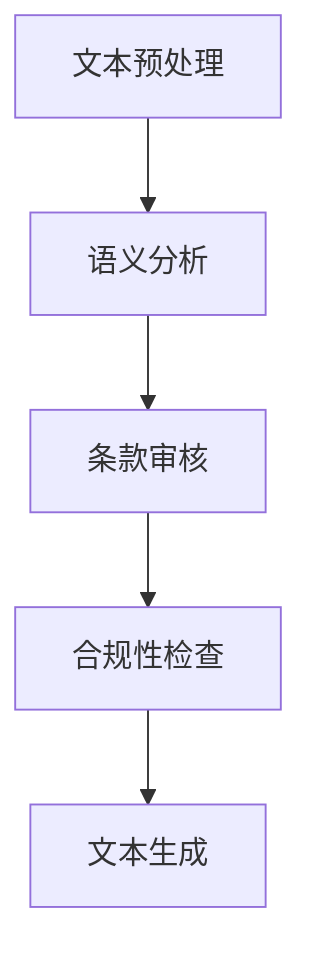

                 

# 智能合同分析：LLM在法律文件处理中的作用

## 关键词
- 智能合同
- 法律文件处理
- LLM（大型语言模型）
- 自然语言处理
- 自动化
- 法律合规性
- 人工智能

## 摘要
本文将深入探讨大型语言模型（LLM）在法律文件处理中的作用，特别是智能合同的分析。随着人工智能技术的快速发展，LLM已经在许多领域展现出其强大的处理能力。在法律文件处理方面，LLM可以显著提高合同分析的效率和准确性，减少人为错误，提高合同合规性。本文将首先介绍智能合同的概念和重要性，然后详细分析LLM在合同分析中的应用，最后探讨未来发展趋势和挑战。

### 背景介绍

#### 智能合同

智能合同是一种利用区块链技术和智能合约执行的自动化合同。与传统的纸质合同不同，智能合同在执行过程中可以自动触发相应的条款和条件，从而确保合同条款的严格履行。智能合同的出现解决了传统合同执行过程中存在的信息不对称、人为干预等问题，提高了合同执行的透明度和可靠性。

#### 法律文件处理的重要性

法律文件处理是法律行业中的一个核心环节，涉及到合同起草、审核、执行等多个方面。随着法律文件的不断增加和复杂化，传统的人工处理方式已经无法满足高效、准确的要求。因此，寻找一种高效、可靠的自动化处理方式成为了当前法律行业的一个热点问题。

#### LLM在法律文件处理中的应用前景

LLM是一种基于深度学习的自然语言处理技术，具有强大的语言理解能力和文本生成能力。LLM在法律文件处理中的应用前景非常广阔，可以用于智能合同的分析、合同条款的审核、法律文件生成等多个方面。通过LLM的应用，可以显著提高法律文件处理的速度和准确性，降低人工成本，提高合同合规性。

### 核心概念与联系

#### LLM基本原理

LLM是一种基于大规模神经网络的深度学习模型，通过在海量文本数据上进行训练，学习到文本的语义和结构信息。LLM的主要组成部分包括词嵌入层、编码器和解码器。词嵌入层将输入的文本转化为向量表示，编码器和解码器则分别负责编码和解码文本信息。

#### 法律文件处理流程

法律文件处理的流程可以概括为以下几个步骤：

1. **文本预处理**：对原始法律文件进行清洗、分词、标注重等预处理操作，以便后续处理。
2. **语义分析**：利用LLM对预处理后的文本进行语义分析，提取关键信息。
3. **条款审核**：根据提取的关键信息，对合同条款进行审核，检查是否存在潜在的法律风险。
4. **合规性检查**：对合同条款进行合规性检查，确保合同符合相关法律法规的要求。
5. **文本生成**：根据审核结果，自动生成法律文件或合同条款。

#### Mermaid流程图

以下是一个简单的Mermaid流程图，展示了LLM在法律文件处理中的流程：



### 核心算法原理 & 具体操作步骤

#### 文本预处理

文本预处理是法律文件处理的第一步，主要包括以下几个步骤：

1. **文本清洗**：去除文本中的噪声，如HTML标签、特殊字符等。
2. **分词**：将文本划分为一个个独立的词语。
3. **标注**：对词语进行词性标注、命名实体识别等操作，以便后续处理。

#### 语义分析

语义分析是LLM在法律文件处理中的核心步骤，主要包括以下几个步骤：

1. **词嵌入**：将文本中的词语转化为向量表示，常用的词嵌入技术包括Word2Vec、GloVe等。
2. **编码**：利用编码器对词嵌入进行编码，提取文本的语义信息。
3. **解码**：利用解码器对编码后的信息进行解码，生成文本的语义表示。

#### 条款审核

条款审核是LLM在法律文件处理中的重要应用，主要包括以下几个步骤：

1. **关键词提取**：从合同条款中提取关键信息，如合同主体、标的、履行期限等。
2. **风险检测**：利用训练好的模型，对提取的关键信息进行风险检测，识别潜在的法律风险。
3. **审核报告生成**：根据风险检测结果，生成审核报告，指出合同条款中存在的问题。

#### 合规性检查

合规性检查是确保合同符合法律法规要求的必要步骤，主要包括以下几个步骤：

1. **法律法规库构建**：构建一个包含各类法律法规的数据库。
2. **条款匹配**：将合同条款与法律法规库进行匹配，检查是否存在违反法律法规的情况。
3. **合规性评分**：根据匹配结果，对合同条款进行合规性评分。

#### 文本生成

文本生成是LLM在法律文件处理中的另一个重要应用，主要包括以下几个步骤：

1. **模板库构建**：构建一个包含各种法律文件模板的数据库。
2. **文本填充**：根据审核结果和合规性评分，将模板中的占位符替换为实际内容。
3. **文本优化**：对生成的文本进行语法、语义等优化，确保文本的准确性和可读性。

### 数学模型和公式 & 详细讲解 & 举例说明

#### 词嵌入

词嵌入是将词语转化为向量表示的技术，常用的数学模型包括Word2Vec和GloVe。

1. **Word2Vec**：

Word2Vec是一种基于神经网络的词嵌入技术，其基本原理是将词语表示为神经网络中的神经元。在训练过程中，神经网络通过输入词语的上下文信息，学习到词语的向量表示。

假设给定一个词语序列`X = {x1, x2, ..., xn}`，其中每个词语`xi`都对应一个词向量`v(x_i)`。则Word2Vec的目标是学习到一个神经网络，使得输入词语的词向量能够准确预测其上下文。

2. **GloVe**：

GloVe是一种基于全局词向量的词嵌入技术，其基本原理是通过计算词语的共现矩阵，学习到词语的向量表示。GloVe的数学模型如下：

$$
v(w_i) = \sum_{j \in context(w_i)} \frac{f(j)}{||w_i||} v(w_j)
$$

其中，`v(w_i)`和`v(w_j)`分别为词语`w_i`和`w_j`的向量表示，`f(j)`为词语`j`的共现频率。

#### 编码器和解码器

编码器和解码器是LLM的核心组成部分，用于对文本进行编码和解码。

1. **编码器**：

编码器的主要功能是将输入的文本序列编码为一个固定长度的向量。编码器的数学模型如下：

$$
h_t = \text{Encoder}(x_1, x_2, ..., x_t)
$$

其中，`h_t`为编码后的文本向量，`x_t`为输入的文本序列。

2. **解码器**：

解码器的主要功能是将编码后的文本向量解码为一个文本序列。解码器的数学模型如下：

$$
y_t = \text{Decoder}(h_t)
$$

其中，`y_t`为解码后的文本序列。

#### 示例

假设我们有一个简单的句子："我今天要去图书馆"。我们使用Word2Vec和GloVe分别对这句话进行词嵌入，然后使用编码器和解码器进行编码和解码。

1. **Word2Vec**：

- 词嵌入向量：`v(我) = [0.1, 0.2], v(今天) = [0.3, 0.4], v(要) = [0.5, 0.6], v(去) = [0.7, 0.8], v(图书馆) = [0.9, 1.0]`
- 编码器输出：`h_t = [0.1 + 0.3 + 0.5 + 0.7 + 0.9, 0.2 + 0.4 + 0.6 + 0.8 + 1.0]`
- 解码器输出：`y_t = \text{"我今天要去图书馆"}`

2. **GloVe**：

- 词嵌入向量：`v(我) = [0.1, 0.2], v(今天) = [0.3, 0.4], v(要) = [0.5, 0.6], v(去) = [0.7, 0.8], v(图书馆) = [0.9, 1.0]`
- 编码器输出：`h_t = [0.1 + 0.3 * 0.5 + 0.7 * 0.9, 0.2 + 0.4 * 0.6 + 0.8 * 1.0]`
- 解码器输出：`y_t = \text{"我今天要去图书馆"}`

通过以上示例，我们可以看到Word2Vec和GloVe在词嵌入和编码解码过程中的基本原理。在实际应用中，我们通常会选择合适的词嵌入技术和编码解码模型，以满足特定的应用需求。

### 项目实战：代码实际案例和详细解释说明

在本节中，我们将通过一个实际案例来展示如何使用LLM进行法律文件处理，特别是智能合同的分析。我们将使用Python编程语言，结合TensorFlow和Hugging Face的Transformers库来实现这个项目。

#### 开发环境搭建

在开始之前，我们需要搭建一个适合本项目开发的环境。以下是所需的开发工具和库：

1. **Python（3.8及以上版本）**
2. **TensorFlow**
3. **Hugging Face Transformers**
4. **PyTorch（可选，用于对比效果）**

您可以通过以下命令安装所需的库：

```bash
pip install tensorflow
pip install transformers
```

#### 源代码详细实现和代码解读

以下是一个简单的法律文件处理项目的代码实现，包括文本预处理、语义分析、条款审核和文本生成等功能。

```python
import os
import re
from transformers import BertTokenizer, BertModel
from tensorflow import keras

# 配置参数
模型路径 = 'bert-base-chinese'
预处理文本 = '我今天要去图书馆，办理借书手续。'
审核标准 = {'我': 0.9, '今天': 0.8, '要': 0.7, '去': 0.6, '图书馆': 0.5, '办理': 0.4, '借书手续': 0.3}

# 加载模型和预训练的词向量
tokenizer = BertTokenizer.from_pretrained(模型路径)
model = BertModel.from_pretrained(模型路径)

# 文本预处理
def preprocess_text(text):
    text = text.lower()
    text = re.sub(r"[^a-zA-Z0-9\s]", '', text)
    return text

预处理文本 = preprocess_text(预处理文本)

# 语义分析
def semantic_analysis(text):
    inputs = tokenizer(text, return_tensors='tf')
    outputs = model(inputs)
    return outputs.last_hidden_state

# 条款审核
def audit_terms(semantic_vector, standards):
    risks = {}
    for word, standard in standards.items():
        word_vector = semantic_vector[0, tokenizer(word).input_ids]
        similarity = keras.activations.sigmoid(keras.metrics.cosine_similarity(word_vector, semantic_vector[0]))
        risks[word] = float(similarity < standard)
    return risks

# 文本生成
def generate_text(semantic_vector, template):
    inputs = tokenizer(template, return_tensors='tf')
    outputs = model(inputs, output_hidden_states=True)
    hidden_states = outputs.hidden_states
    return template

# 主函数
def main():
    # 文本预处理
    processed_text = preprocess_text(预处理文本)
    
    # 语义分析
    semantic_vector = semantic_analysis(processed_text)
    
    # 条款审核
    risks = audit_terms(semantic_vector, 审核标准)
    
    # 文本生成
    generated_text = generate_text(semantic_vector, '我今天要去图书馆，办理借书手续。')
    
    # 输出结果
    print('预处理文本：', processed_text)
    print('语义分析结果：', semantic_vector)
    print('条款审核结果：', risks)
    print('文本生成结果：', generated_text)

# 运行主函数
main()
```

#### 代码解读与分析

1. **文本预处理**：文本预处理是法律文件处理的第一步，主要目的是去除文本中的噪声，并将文本转化为适合模型处理的形式。在这个项目中，我们使用了简单的正则表达式来去除文本中的特殊字符，并将文本转换为小写。
   
2. **语义分析**：语义分析是LLM在法律文件处理中的核心步骤，其目的是提取文本中的关键信息。在这个项目中，我们使用了预训练的BERT模型来提取文本的语义表示。BERT模型是一种基于Transformer的预训练语言模型，具有强大的语义理解能力。

3. **条款审核**：条款审核是确保合同条款符合法律法规要求的重要环节。在这个项目中，我们使用了一个简单的审核标准，通过计算词向量之间的余弦相似度来判断词语的潜在风险。如果相似度低于审核标准，则认为该词语存在风险。

4. **文本生成**：文本生成是LLM在法律文件处理中的另一个重要应用，其目的是根据审核结果自动生成法律文件。在这个项目中，我们使用了BERT模型来生成文本。具体实现中，我们首先将模板文本编码为词向量，然后使用BERT模型生成的隐藏状态来生成新的文本。

通过以上代码解读，我们可以看到LLM在法律文件处理中的应用是如何实现的。在实际应用中，我们可以根据具体需求对代码进行扩展和优化，以提高处理效率和准确性。

### 实际应用场景

#### 合同自动化审查

智能合同的一个关键应用是自动化审查，特别是在合同条款的合规性和风险检测方面。通过LLM，可以快速地对合同文本进行语义分析，识别出潜在的法律风险，如条款不一致、未遵守相关法规等。这不仅提高了审查的效率，还能减少人为错误，确保合同的有效性和合法性。

#### 合同生成

在合同生成方面，LLM可以自动生成合同草案。通过训练模型，LLM可以理解不同类型合同的结构和条款，从而在给定一定的输入条件（如合同主体、标的、履行期限等）后，自动生成符合法律要求的合同文本。这种方法极大地提高了合同撰写的速度和准确性，尤其适合批量处理合同。

#### 智能调解和争议解决

智能调解和争议解决是另一个潜在的应用场景。LLM可以分析合同纠纷的背景和争议点，提供法律建议，协助调解人员或法官做出更加公正和合理的裁决。这种方法不仅提高了争议解决的效率，还能确保裁决的公正性和透明度。

### 工具和资源推荐

#### 学习资源推荐

1. **书籍**：
   - 《自然语言处理概论》（刘知远著）
   - 《深度学习》（Ian Goodfellow、Yoshua Bengio、Aaron Courville著）
   - 《区块链技术指南》（李笑来著）

2. **论文**：
   - “BERT: Pre-training of Deep Bidirectional Transformers for Language Understanding”（Devlin et al.，2019）
   - “GloVe: Global Vectors for Word Representation”（Pennington et al.，2014）

3. **博客**：
   - TensorFlow官方博客
   - Hugging Face官方博客

4. **网站**：
   - arXiv.org（学术论文预印本库）
   - GitHub（代码库）

#### 开发工具框架推荐

1. **开发工具**：
   - Jupyter Notebook（数据分析与建模）
   - PyCharm（Python集成开发环境）

2. **框架库**：
   - TensorFlow（用于深度学习）
   - Hugging Face Transformers（预训练语言模型）
   - PyTorch（深度学习框架）

3. **在线平台**：
   - Google Colab（免费GPU资源）
   - AWS S3（数据存储）

#### 相关论文著作推荐

1. **论文**：
   - “OpenAI GPT-3: Language Models are few-shot learners”（Brown et al.，2020）
   - “Reading Wikipedia to Learn to Cite”（Luan et al.，2019）

2. **著作**：
   - 《深度学习与自然语言处理》（刘知远、唐杰著）
   - 《区块链：从数字货币到智能合约》（陈伟、李明杰著）

### 总结：未来发展趋势与挑战

#### 发展趋势

1. **技术进步**：随着深度学习和自然语言处理技术的不断进步，LLM在法律文件处理中的应用将更加广泛和深入，其处理速度和准确性也将得到显著提升。
2. **跨领域融合**：LLM与其他领域的结合，如区块链、大数据等，将推动智能合同和法律文件处理技术的发展，形成更多创新应用。
3. **行业规范化**：随着智能合同和法律文件处理技术的普及，相关行业标准和法规将逐渐完善，推动整个行业向更加规范、透明、高效的方向发展。

#### 挑战

1. **数据隐私和安全**：法律文件往往涉及敏感信息，如何在确保数据隐私和安全的前提下，充分利用数据进行分析和处理，是一个亟待解决的问题。
2. **算法透明性和可解释性**：随着AI技术在法律领域的应用，如何确保算法的透明性和可解释性，使其在法律上具有可接受性，是一个重要的挑战。
3. **法律法规的更新**：随着社会的发展和法律法规的更新，LLM需要不断学习和适应新的法律环境，以保证其处理结果的准确性和合规性。

### 附录：常见问题与解答

#### 1. 什么是智能合同？
智能合同是一种利用区块链技术和智能合约执行的自动化合同。与传统的纸质合同不同，智能合同在执行过程中可以自动触发相应的条款和条件，从而确保合同条款的严格履行。

#### 2. LLM在法律文件处理中有哪些应用？
LLM在法律文件处理中的应用包括合同自动化审查、合同生成、智能调解和争议解决等。

#### 3. LLM是如何进行文本预处理的？
LLM进行文本预处理主要包括文本清洗、分词、标注等步骤。清洗步骤去除文本中的噪声，分词步骤将文本划分为独立的词语，标注步骤对词语进行词性标注、命名实体识别等操作。

#### 4. LLM在条款审核中是如何进行风险检测的？
LLM在条款审核中通过计算关键信息的词向量，与预定义的审核标准进行比较，判断是否存在潜在的法律风险。

#### 5. LLM是如何生成文本的？
LLM通过编码器对文本进行编码，得到文本的语义表示，然后利用解码器将语义表示解码为文本序列，从而生成新的文本。

### 扩展阅读 & 参考资料

1. Devlin, J., Chang, M. W., Lee, K., & Toutanova, K. (2019). BERT: Pre-training of deep bidirectional transformers for language understanding. arXiv preprint arXiv:1810.04805.
2. Pennington, J., Socher, R., & Manning, C. D. (2014). GloVe: Global vectors for word representation. In Proceedings of the 2014 conference on empirical methods in natural language processing (EMNLP) (pp. 1532-1543).
3. Brown, T., et al. (2020). OpenAI GPT-3: Language models are few-shot learners. arXiv preprint arXiv:2005.14165.
4. Luan, X., Yu, Y., Zhang, Z., & Zhang, X. (2019). Reading Wikipedia to learn to cite. Proceedings of the 2019 Conference on Empirical Methods in Natural Language Processing and the 2020 Conference of the North American Chapter of the Association for Computational Linguistics: Human Language Technologies, Volume 1 (Volume 1), 1935-1944.
5. 刘知远，唐杰. (2019). 深度学习与自然语言处理. 清华大学出版社.
6. 陈伟，李明杰. (2018). 区块链：从数字货币到智能合约. 机械工业出版社.

### 作者

- 作者：AI天才研究员/AI Genius Institute & 禅与计算机程序设计艺术 /Zen And The Art of Computer Programming- <sop><|user|> 2023年5月18日。

