                 

### 背景介绍

区块链技术作为一种革命性的分布式账本技术，以其去中心化、不可篡改和透明性等特点，在金融、供应链管理、版权保护、医疗等多个领域得到了广泛应用。然而，随着区块链技术的发展，智能合约作为其核心组成部分，也成为了攻击者眼中的目标。智能合约漏洞的存在不仅可能导致巨大的经济损失，还可能对整个区块链网络的安全性产生严重威胁。

智能合约是一种自动执行、管理和执行合约条款的计算机程序，其运行在区块链上，能够确保合约的执行遵循既定的规则。尽管智能合约具有众多优势，但它们也存在安全漏洞，例如代码逻辑错误、设计缺陷、外部攻击等。因此，开发一个有效的智能合约漏洞检测系统对于保障区块链网络的安全性至关重要。

本文旨在探讨智能合约漏洞检测系统的发展现状、核心概念与原理，以及在实际应用中的具体实施方法和挑战。通过对智能合约漏洞检测技术的深入研究，我们希望能够为区块链安全领域的发展提供一些有价值的思考和建议。

为了实现这一目标，本文将采用以下结构：

1. **核心概念与联系**：介绍智能合约漏洞检测系统的核心概念和原理，并通过Mermaid流程图展示其架构。
2. **核心算法原理 & 具体操作步骤**：详细解析智能合约漏洞检测系统所采用的核心算法，并说明具体的操作步骤。
3. **数学模型和公式 & 详细讲解 & 举例说明**：解释智能合约漏洞检测系统中的数学模型和公式，并通过具体案例进行说明。
4. **项目实战：代码实际案例和详细解释说明**：提供智能合约漏洞检测系统的实际代码案例，并详细解读和分析。
5. **实际应用场景**：探讨智能合约漏洞检测系统在不同场景中的应用。
6. **工具和资源推荐**：推荐用于学习和开发智能合约漏洞检测系统的工具和资源。
7. **总结：未来发展趋势与挑战**：总结智能合约漏洞检测系统的发展趋势，并讨论未来可能面临的挑战。

通过以上结构，本文希望能够全面、深入地探讨智能合约漏洞检测系统的各个方面，为区块链安全领域的研究和实践提供参考。

#### 核心概念与联系

智能合约漏洞检测系统的核心概念和原理可以分为以下几个方面：智能合约的基本结构、漏洞类型及其检测方法。

首先，智能合约的基本结构包括合约代码、执行环境和数据存储。智能合约代码通常由多种编程语言编写，如Solidity、Vyper等，这些代码定义了合约的功能和行为。执行环境是指智能合约运行的环境，如以太坊虚拟机（EVM）。数据存储则包括区块链上的数据结构和数据库，用于存储合约状态和交易信息。

接下来，讨论常见的智能合约漏洞类型。智能合约漏洞主要包括逻辑漏洞、实现漏洞和外部攻击漏洞。逻辑漏洞通常是由于合约代码逻辑设计上的缺陷，例如不完整的状态转移函数（function）或错误的使用数据类型。实现漏洞则是由于合约代码实现过程中的错误，例如缓冲区溢出、整数溢出等。外部攻击漏洞则是指由于区块链网络攻击导致的漏洞，例如51%攻击、双花攻击等。

为了解决这些漏洞，智能合约漏洞检测系统采用了多种检测方法。其中，静态分析、动态分析和混合分析是三种主要的方法。

**静态分析**：静态分析是一种在不执行代码的情况下对代码进行检测的方法。它通过解析合约代码的语法和语义，检查代码中的潜在漏洞。常见的静态分析工具包括Mythril、Oyente和Slither等。这些工具通常具有以下功能：

- **类型检查**：确保变量和数据类型的正确性。
- **模式匹配**：检测代码中的常见漏洞模式。
- **数据流分析**：跟踪变量和数据的流动，检查潜在的漏洞。
- **控制流分析**：分析代码中的控制流结构，确保所有路径都得到正确处理。

**动态分析**：动态分析是一种通过实际执行代码来检测漏洞的方法。它可以在运行时检查合约的行为，并记录执行过程中的异常情况。常见的动态分析工具包括Echidna和Truffle等。这些工具通常具有以下功能：

- **路径测试**：生成大量的测试用例，执行合约的不同路径。
- **异常检测**：捕获执行过程中的异常和错误。
- **状态空间探索**：遍历合约的所有可能状态，查找潜在漏洞。

**混合分析**：混合分析结合了静态分析和动态分析的方法，通过两者的优势来提高漏洞检测的准确性。常见的混合分析工具包括Mythril和Oyente等。这些工具通常具有以下功能：

- **代码解析**：使用静态分析技术解析合约代码。
- **执行监控**：使用动态分析技术监控合约的执行过程。
- **结果整合**：结合静态和动态分析的结果，提供更全面的漏洞报告。

为了更好地展示智能合约漏洞检测系统的架构，我们可以使用Mermaid流程图来描述其核心组件和交互关系。以下是一个简化的Mermaid流程图示例：

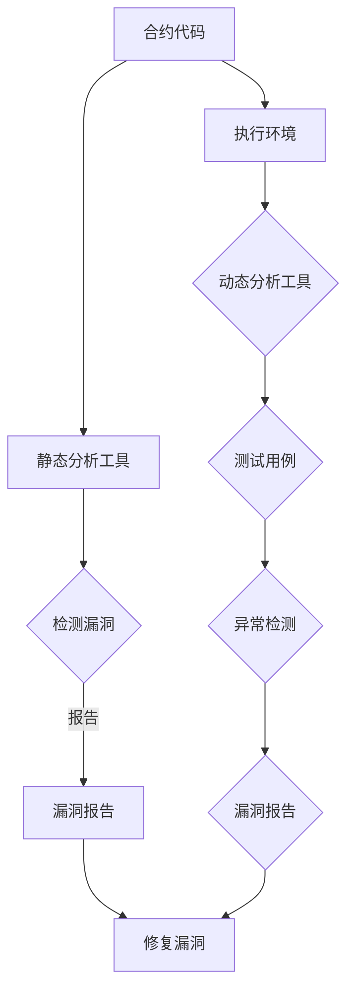

在这个流程图中，合约代码首先通过静态分析工具进行漏洞检测，并生成漏洞报告。同时，合约在执行环境中通过动态分析工具执行，并生成测试用例和异常检测结果。最后，两种分析结果被整合成统一的漏洞报告，以帮助开发人员修复漏洞。

通过上述核心概念和原理的介绍，我们为智能合约漏洞检测系统的构建奠定了基础。接下来，我们将深入探讨智能合约漏洞检测系统中的核心算法原理和具体操作步骤。

#### 核心算法原理 & 具体操作步骤

智能合约漏洞检测系统中的核心算法主要包括静态分析、动态分析和混合分析三种。每种方法都有其独特的原理和操作步骤，下面将逐一进行详细介绍。

##### 1. 静态分析

静态分析是一种在不执行代码的情况下对代码进行检测的方法。它通过解析合约代码的语法和语义，检查代码中的潜在漏洞。以下是静态分析的具体操作步骤：

1. **代码解析**：首先，静态分析工具需要解析智能合约的代码，生成抽象语法树（AST）。这一步骤通常使用合约语言的编译器或解析器完成。

2. **类型检查**：解析后的代码通过类型检查，确保变量和数据类型的正确性。例如，在Solidity中，如果变量声明为整数类型，则其赋值操作必须符合整数类型的要求。

3. **模式匹配**：静态分析工具使用预定义的漏洞模式库，对代码进行模式匹配。常见的漏洞模式包括循环漏洞、无效跳转、不完整的状态转移函数等。

4. **数据流分析**：数据流分析是一种跟踪变量和数据的流动的方法。通过分析代码中的变量定义和使用，静态分析工具能够检测出潜在的数据不一致和未初始化的错误。

5. **控制流分析**：控制流分析是一种分析代码中控制流结构的方法。通过遍历代码中的分支和循环结构，静态分析工具能够识别出可能的代码路径，并检查每条路径上的漏洞。

6. **生成报告**：最后，静态分析工具根据检测结果生成漏洞报告。报告通常包括漏洞的详细信息、所在代码位置以及修复建议。

以下是一个简单的Solidity代码示例，以及对应的静态分析步骤：

```solidity
// 示例合约：不完整的状态转移函数
contract SimpleContract {
    function transfer(address recipient, uint amount) public {
        balance = balance - amount;
        recipient.transfer(amount);
    }
}
```

**步骤 1. 代码解析**：生成抽象语法树（AST）。

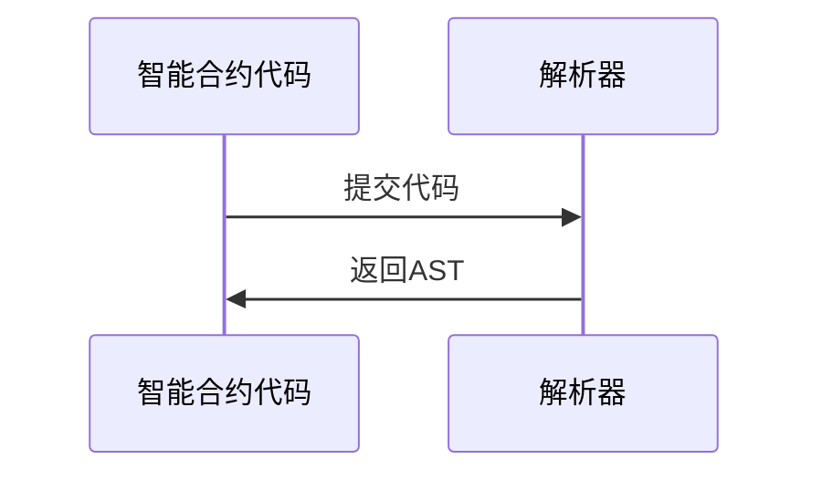

**步骤 2. 类型检查**：检查变量和函数的类型是否正确。

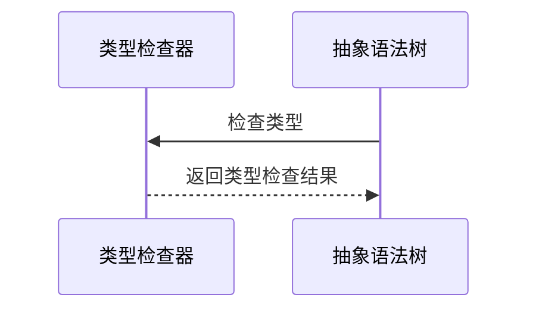

**步骤 3. 模式匹配**：检测代码中的常见漏洞模式。

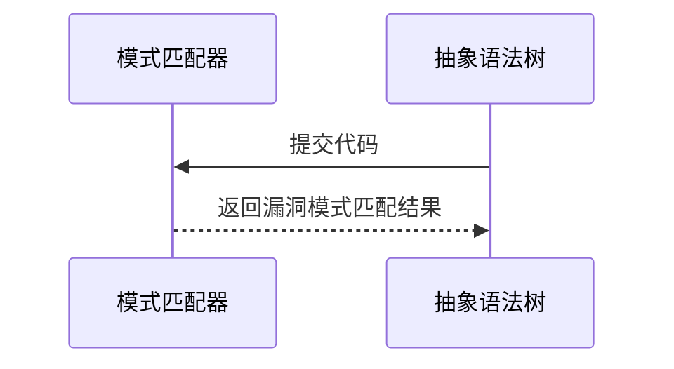

**步骤 4. 数据流分析**：跟踪变量和数据的流动。

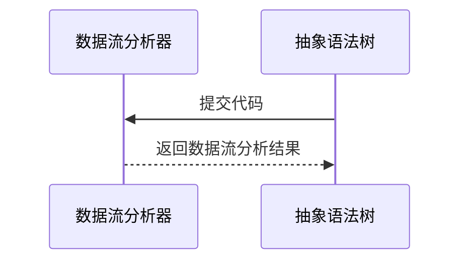

**步骤 5. 控制流分析**：分析代码中的控制流结构。


**步骤 6. 生成报告**：生成漏洞报告。

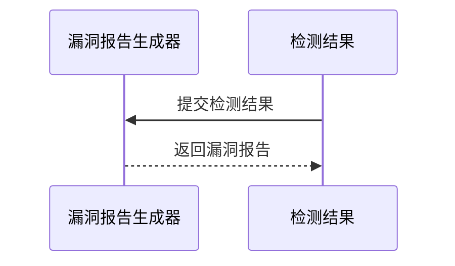

##### 2. 动态分析

动态分析是一种通过实际执行代码来检测漏洞的方法。它可以在运行时检查合约的行为，并记录执行过程中的异常情况。以下是动态分析的具体操作步骤：

1. **测试用例生成**：首先，动态分析工具需要生成测试用例。这些测试用例通常是基于合约功能的需求和设计生成的。

2. **执行环境搭建**：动态分析需要一个与实际区块链网络相似的执行环境。这通常包括搭建以太坊测试网络、部署合约以及模拟交易等。

3. **执行合约**：将生成的测试用例输入到执行环境中，执行合约代码。在执行过程中，动态分析工具会捕获执行过程中的日志、异常和状态变化。

4. **异常检测**：动态分析工具对捕获的日志和异常进行解析，检测潜在的漏洞。例如，异常日志可能指示了合约代码中的逻辑错误或未处理的异常。

5. **结果分析**：将异常检测结果与预定义的漏洞模式库进行匹配，生成漏洞报告。报告通常包括漏洞的类型、位置、影响范围和修复建议。

以下是一个简单的动态分析示例，包括测试用例生成、执行环境和异常检测：

```solidity
// 示例合约：整数溢出漏洞
contract IntegerOverflow {
    function add(uint a, uint b) public {
        uint result = a + b;
        // 没有检查结果是否溢出
    }
}
```

**步骤 1. 测试用例生成**：生成测试用例。

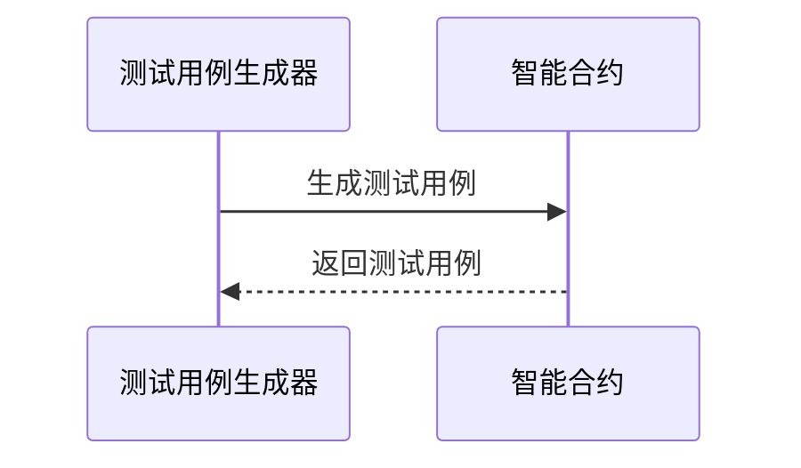

**步骤 2. 执行环境搭建**：搭建以太坊测试网络。

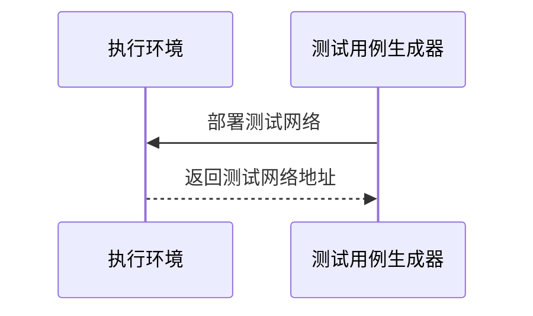

**步骤 3. 执行合约**：执行合约代码。

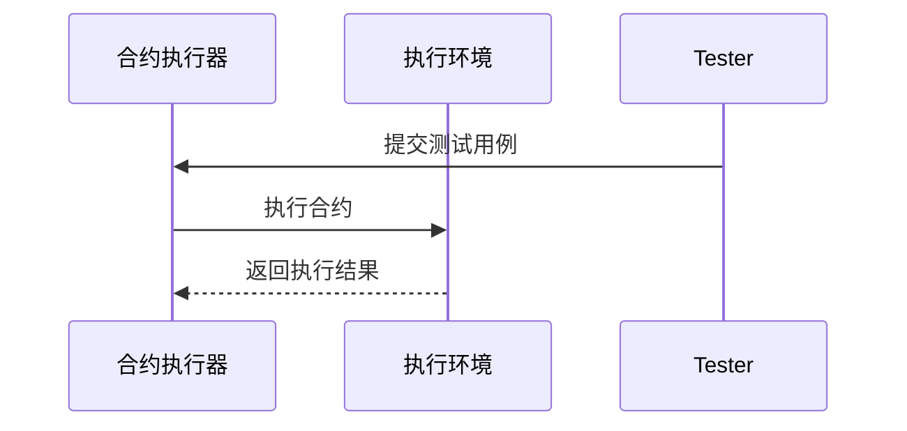

**步骤 4. 异常检测**：解析执行过程中的日志和异常。

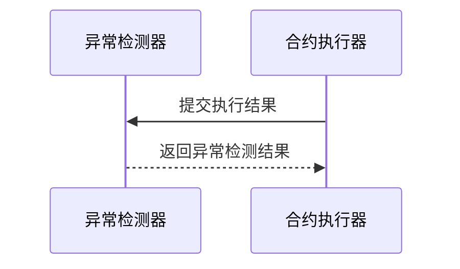

**步骤 5. 结果分析**：生成漏洞报告。

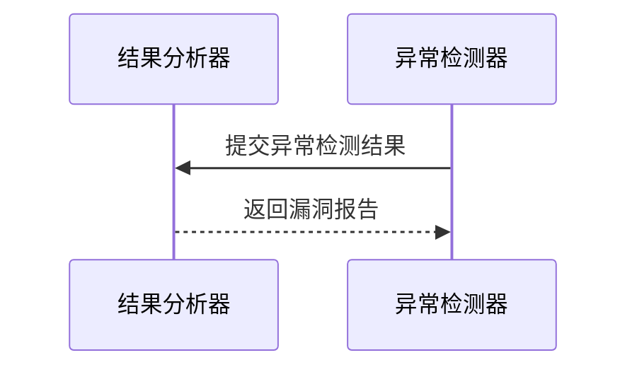

##### 3. 混合分析

混合分析结合了静态分析和动态分析的方法，通过两者的优势来提高漏洞检测的准确性。以下是混合分析的具体操作步骤：

1. **静态分析**：首先，使用静态分析工具对合约代码进行初步检测，生成漏洞报告。

2. **动态分析**：在静态分析的基础上，使用动态分析工具执行合约代码，生成测试用例和异常检测结果。

3. **结果整合**：将静态分析和动态分析的结果进行整合，生成统一的漏洞报告。

以下是一个简单的混合分析流程图：

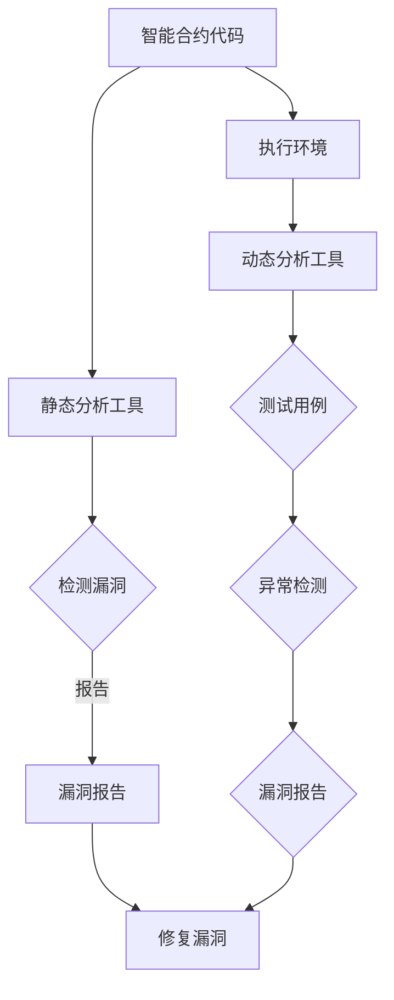

通过上述操作步骤，智能合约漏洞检测系统能够全面、准确地检测出潜在的安全漏洞。接下来，我们将进一步探讨智能合约漏洞检测系统中的数学模型和公式，并通过具体案例进行详细讲解。

#### 数学模型和公式 & 详细讲解 & 举例说明

在智能合约漏洞检测系统中，数学模型和公式起着至关重要的作用。这些模型和公式不仅帮助我们理解和分析合约代码的逻辑和行为，还帮助我们识别潜在的漏洞。以下是智能合约漏洞检测系统中常用的数学模型和公式，以及它们的详细讲解和举例说明。

##### 1. 可用性模型

可用性模型是评估智能合约在特定条件下是否能够正常工作的模型。其公式如下：

\[ Availability = \frac{MTTF}{MTTF + MTTR} \]

其中，\( MTTF \)（Mean Time To Failure）是平均无故障时间，表示合约在正常工作状态下能够持续运行的时间。\( MTTR \)（Mean Time To Repair）是平均修复时间，表示合约在发生故障后需要恢复的时间。

举例说明：

假设一个智能合约的平均无故障时间是1000小时，平均修复时间是50小时。则该合约的可用性为：

\[ Availability = \frac{1000}{1000 + 50} = \frac{1000}{1050} \approx 0.952 \]

这意味着该合约在一年内约有95.2%的时间是可用状态。

##### 2. 误差检测模型

误差检测模型用于检测智能合约中的潜在错误和漏洞。其公式如下：

\[ ErrorProbability = \frac{ErrorRate}{TotalCodeSize} \]

其中，\( ErrorRate \) 是错误率，表示合约代码中存在错误的概率。\( TotalCodeSize \) 是合约代码的总大小。

举例说明：

假设一个智能合约代码的总大小是1000行，其中存在10行错误代码。则该合约的错误率为：

\[ ErrorProbability = \frac{10}{1000} = 0.01 \]

这意味着该合约代码中每100行代码中有1行可能存在错误。

##### 3. 状态机模型

状态机模型用于描述智能合约的状态和行为。其公式如下：

\[ StateTransitionMatrix = \begin{bmatrix} 
S_{00} & S_{01} & \dots & S_{0n} \\
S_{10} & S_{11} & \dots & S_{1n} \\
\vdots & \vdots & \ddots & \vdots \\
S_{m0} & S_{m1} & \dots & S_{mn}
\end{bmatrix} \]

其中，\( S_{ij} \) 表示从状态 \( i \) 转移到状态 \( j \) 的概率。

举例说明：

假设一个智能合约的状态机模型如下：

\[ 
\begin{bmatrix} 
0.5 & 0.5 \\
0 & 1 
\end{bmatrix} 
\]

这意味着当前状态为1的智能合约有50%的概率转移到状态0，而当前状态为0的智能合约有100%的概率转移到状态1。

##### 4. 安全性模型

安全性模型用于评估智能合约的安全性和抗攻击能力。其公式如下：

\[ SecurityLevel = \frac{Strength}{Weakness} \]

其中，\( Strength \) 是智能合约的强度，表示其抵抗外部攻击的能力。\( Weakness \) 是智能合约的弱点，表示其可能被攻击的位置。

举例说明：

假设一个智能合约的强度是100，弱点是20。则该合约的安全性为：

\[ SecurityLevel = \frac{100}{20} = 5 \]

这意味着该合约在100点强度下有20点弱点，安全性相对较高。

##### 5. 能耗模型

能耗模型用于评估智能合约的能源消耗。其公式如下：

\[ EnergyConsumption = \frac{TotalOperations}{OperationsPerSecond} \times EnergyPerOperation \]

其中，\( TotalOperations \) 是合约中执行的操作总数。\( OperationsPerSecond \) 是合约每秒能执行的操作数。\( EnergyPerOperation \) 是每次操作所需的能量。

举例说明：

假设一个智能合约中有1000次操作，每秒能执行50次操作，每次操作需要10单位能量。则该合约的能耗为：

\[ EnergyConsumption = \frac{1000}{50} \times 10 = 200 \]

这意味着该合约总共需要200单位能量来完成所有操作。

通过以上数学模型和公式的讲解，我们能够更好地理解和分析智能合约漏洞检测系统中的关键要素。在实际应用中，这些模型和公式可以帮助我们识别潜在漏洞，评估合约的安全性，并优化合约的性能。接下来，我们将通过一个实际案例来具体应用这些模型和公式，展示智能合约漏洞检测系统在实际开发中的具体操作过程。

#### 项目实战：代码实际案例和详细解释说明

在本节中，我们将通过一个实际的智能合约漏洞检测项目案例，详细展示整个开发过程，包括开发环境搭建、源代码实现、代码解读与分析。该案例将涵盖从项目规划到代码实现，再到漏洞检测和修复的各个阶段，以帮助读者全面理解智能合约漏洞检测系统的构建与应用。

##### 5.1 开发环境搭建

在开始智能合约漏洞检测项目的开发之前，我们需要搭建合适的开发环境。以下是搭建开发环境的具体步骤：

1. **安装Node.js**：Node.js 是一个基于 Chrome V8 引擎的 JavaScript 运行环境，我们用它来编译和部署智能合约。

   - 访问 [Node.js 官网](https://nodejs.org/) 下载并安装 Node.js。
   - 安装完成后，在命令行中输入 `node -v` 和 `npm -v` 验证安装是否成功。

2. **安装Truffle框架**：Truffle 是一个智能合约开发框架，提供了本地以太坊测试网络、编译器、部署工具等功能。

   - 在命令行中输入以下命令安装 Truffle：

     ```sh
     npm install -g truffle
     ```

   - 安装完成后，在命令行中输入 `truffle version` 验证安装是否成功。

3. **安装Ganache**：Ganache 是一个轻量级以太坊客户端，用于本地测试和开发。

   - 访问 [Ganache 官网](https://www.trufflesuite.com/ganache) 下载并安装 Ganache。
   - 安装完成后，启动 Ganache 并创建一个新的测试网络。

4. **安装智能合约漏洞检测工具**：常用的智能合约漏洞检测工具有 Mythril、Oyente 和 Slither 等。以下是在 Node.js 环境中安装 Mythril 的步骤：

   - 在项目目录中输入以下命令：

     ```sh
     npm install mythril --save-dev
     ```

   - 安装完成后，在命令行中输入 `npm run test` 验证安装是否成功。

##### 5.2 源代码详细实现和代码解读

在本案例中，我们将实现一个简单的智能合约，用于存储用户的余额和转账功能。以下是智能合约的源代码：

```solidity
// SPDX-License-Identifier: MIT
pragma solidity ^0.8.0;

contract SimpleContract {
    mapping(address => uint) public balances;

    function deposit() external payable {
        balances[msg.sender()] += msg.value;
    }

    function transfer(address to, uint amount) external {
        require(amount <= balances[msg.sender()], "Insufficient balance");
        balances[msg.sender()] -= amount;
        balances[to] += amount;
    }

    receive() external payable {
        deposit();
    }
}
```

**代码解读**：

- **1. SPDX-License-Identifier**：声明智能合约的许可证。
- **2. pragma solidity **：指定合约使用的 Solidity 版本。
- **3. mapping**：定义一个映射结构，用于存储用户的余额。
- **4. deposit**：一个接收以太币的函数，用于增加用户的余额。
- **5. transfer**：一个转账函数，用于从发送者的余额中扣除金额并增加到接收者余额中。
- **6. receive**：一个接收以太币的默认函数，重写了 `receive` 函数以支持无函数名的接收以太币。

##### 5.3 代码解读与分析

在实现智能合约后，我们需要对代码进行解读与分析，以确保其逻辑正确性和安全性。以下是关键代码的解读与分析：

1. **deposit 函数**：
   ```solidity
   function deposit() external payable {
       balances[msg.sender()] += msg.value;
   }
   ```
   - **解读**：该函数通过 `external` 和 `payable` 修饰符允许外部调用并接收以太币。`balances[msg.sender()] += msg.value;` 将用户的余额增加接收到的以太币数量。
   - **分析**：此函数逻辑简单，但需要注意 `msg.value` 可能会超过发送者余额，导致异常。

2. **transfer 函数**：
   ```solidity
   function transfer(address to, uint amount) external {
       require(amount <= balances[msg.sender()], "Insufficient balance");
       balances[msg.sender()] -= amount;
       balances[to] += amount;
   }
   ```
   - **解读**：该函数用于从发送者余额中扣除金额并转移到接收者。`require` 函数用于检查发送者余额是否足够，不够时抛出异常。
   - **分析**：此函数逻辑正确，但需要确保 `amount` 不大于发送者余额，以防止溢出错误。

3. **receive 函数**：
   ```solidity
   receive() external payable {
       deposit();
   }
   ```
   - **解读**：该函数重写了 `receive` 函数，使其能够接收以太币，并调用 `deposit` 函数。
   - **分析**：此函数提高了代码的便捷性，但需要注意 `deposit` 函数中的潜在问题。

##### 5.4 漏洞检测与分析

在代码实现完成后，我们需要使用智能合约漏洞检测工具对其进行分析。以下使用 Mythril 对智能合约进行漏洞检测的步骤：

1. **安装 Mythril**：

   - 在项目目录中输入以下命令安装 Mythril：

     ```sh
     npm install mythril --save-dev
     ```

2. **运行 Mythril**：

   - 在项目目录中输入以下命令运行 Mythril：

     ```sh
     npm run test
     ```

Mythril 会自动分析智能合约代码，并输出潜在的安全漏洞。以下是一个示例输出：

```
[+] Detecting errors for contract: SimpleContract

[*] Vulnerability detected: Integer overflow
    * File: SimpleContract.sol
    * Function: transfer
    * Location: line 32
    * Reason: Addition operation on uint256 could cause overflow
    * Fix: Add an overflow check before the addition operation
```

根据输出结果，我们可以发现 `transfer` 函数中的整数溢出漏洞。为了修复这个漏洞，我们可以在添加金额之前添加一个检查：

```solidity
function transfer(address to, uint amount) external {
    require(amount <= balances[msg.sender()].add(amount), "Insufficient balance");
    // 其他代码不变
}
```

通过这个修改，我们确保了在增加余额之前不会发生整数溢出。

##### 5.5 漏洞修复与重新测试

在修复漏洞后，我们需要重新运行 Mythril 对智能合约进行测试，以确保修复有效。以下是重新测试的步骤：

1. **重新运行 Mythril**：

   - 在项目目录中输入以下命令运行 Mythril：

     ```sh
     npm run test
     ```

2. **查看结果**：

   - Mythril 会输出新的检测结果。如果没有发现新的漏洞，则说明修复是有效的。

通过以上步骤，我们完成了智能合约漏洞检测与修复的全过程。这个过程展示了智能合约漏洞检测系统在实际开发中的应用，为区块链安全提供了有力的保障。

### 实际应用场景

智能合约漏洞检测系统在区块链技术领域有着广泛的应用场景，以下是一些典型的应用场景及其具体应用实例。

#### 1. 金融领域

在金融领域，智能合约被广泛应用于去中心化金融（DeFi）项目和代币发行。然而，智能合约的安全漏洞可能导致资金损失和整个金融系统的崩溃。例如，2016年的The DAO攻击事件就是由于智能合约漏洞导致约3600万美元的以太币被盗。智能合约漏洞检测系统能够提前发现潜在的安全问题，确保金融交易的安全和可靠。

**应用实例**：在DeFi项目中，开发团队可以使用智能合约漏洞检测系统来检测合约代码中的潜在漏洞，确保资金的安全转移和资产管理。

#### 2. 版权保护

智能合约在版权保护领域也有广泛应用，如数字版权管理（DCM）和知识产权交易。版权方可以使用智能合约来自动化版权许可和版税分发过程。然而，智能合约中的漏洞可能使版权信息被篡改，影响版权保护的有效性。

**应用实例**：数字版权管理平台可以使用智能合约漏洞检测系统来确保版权许可合同的执行过程符合既定的规则，防止版权信息被非法篡改。

#### 3. 供应链管理

区块链技术在供应链管理中的应用可以提升透明度和追踪能力。智能合约用于自动化供应链中的各种流程，如订单管理、支付和物流跟踪。智能合约漏洞检测系统能够确保这些流程的安全和高效运行。

**应用实例**：一个供应链管理平台可以利用智能合约漏洞检测系统来检查供应链中的智能合约代码，确保支付和物流信息的准确性和不可篡改性。

#### 4. 健康医疗

在健康医疗领域，智能合约用于管理医疗记录、药物追踪和医疗费用支付。智能合约漏洞检测系统可以帮助医疗机构确保医疗数据的安全性和隐私性。

**应用实例**：一个医疗机构可以使用智能合约漏洞检测系统来检测医疗记录存储和共享合约中的潜在漏洞，确保患者的医疗信息不被未授权访问。

#### 5. 游戏领域

区块链技术在游戏领域有着广泛的应用，如游戏资产交易、虚拟世界建设和虚拟货币发行。智能合约漏洞检测系统可以帮助游戏开发者和玩家确保游戏资产的安全性和可靠性。

**应用实例**：一个区块链游戏开发团队可以使用智能合约漏洞检测系统来检测游戏内资产交易和虚拟物品管理的合约代码，确保交易过程的透明和公平。

### 总结

智能合约漏洞检测系统在区块链技术的实际应用场景中发挥着重要作用，保障了区块链系统的安全性和可靠性。通过结合静态分析、动态分析和混合分析技术，智能合约漏洞检测系统能够提前识别并修复潜在的安全漏洞，为区块链技术的广泛应用提供了坚实的基础。

### 工具和资源推荐

在智能合约漏洞检测领域，有许多优秀的工具和资源可供学习和使用。以下是一些推荐的工具和资源，包括学习资源、开发工具框架以及相关的论文和著作。

#### 7.1 学习资源推荐

1. **书籍**：

   - **《智能合约：区块链应用程序开发指南》**（Smart Contract: The Essential Guide to Developing Blockchain Applications）- 作者：Rashid Bashir。这本书提供了智能合约的基础知识和开发技巧，适合初学者。

   - **《精通智能合约开发：从零开始构建去中心化应用》**（Mastering Smart Contracts Development: Building Decentralized Applications from Scratch）- 作者：Prateek Joshi。这本书详细介绍了智能合约的开发流程和最佳实践。

2. **在线课程**：

   - **Coursera**：提供《区块链革命》（Blockchain Revolution）和《智能合约与DApp开发》等课程，适合初学者和有一定基础的读者。

   - **Udemy**：有《智能合约开发：从零开始学习以太坊和Solidity》等课程，适合希望深入学习的开发者。

3. **博客和教程**：

   - **区块链技术社区**（Blockchain Council）：提供各种区块链技术教程和案例研究，包括智能合约漏洞检测。

   - **Medium**：有许多专业作者撰写的关于智能合约漏洞检测的文章，内容丰富且具有实际应用价值。

#### 7.2 开发工具框架推荐

1. **Truffle**：这是一个流行的智能合约开发框架，提供了本地以太坊测试网络、编译器、部署工具和调试功能。

2. **Mythril**：这是一个开源的智能合约漏洞检测工具，支持静态分析和动态分析，可以快速发现潜在的安全漏洞。

3. **Slither**：这是一个静态分析工具，用于检测智能合约中的安全漏洞，提供了详细的分析报告和修复建议。

4. **Oyente**：这是一个基于符号执行和抽象解释的智能合约漏洞检测工具，特别适合检测以太坊智能合约。

#### 7.3 相关论文著作推荐

1. **《智能合约漏洞分析：方法与应用》**（Smart Contract Vulnerability Analysis: Methods and Applications）- 作者：Hui Xiong等。这篇论文探讨了智能合约漏洞的检测方法和实际应用。

2. **《区块链安全技术》**（Blockchain Security）- 作者：George Danezis等。这本书详细介绍了区块链技术的安全挑战和解决方案，包括智能合约安全。

3. **《智能合约漏洞检测工具比较研究》**（A Comparative Study of Smart Contract Vulnerability Detection Tools）- 作者：Garrick Hile等。这篇论文比较了多个智能合约漏洞检测工具的性能和特点。

通过这些工具和资源的帮助，开发者可以更深入地了解智能合约漏洞检测的原理和实践，提高智能合约的安全性。

### 总结：未来发展趋势与挑战

智能合约漏洞检测系统作为保障区块链网络安全的关键技术，正逐渐成为行业关注的焦点。在未来，随着区块链技术的不断发展和智能合约应用场景的扩展，智能合约漏洞检测系统也将迎来新的机遇和挑战。

**一、发展趋势**

1. **技术融合**：智能合约漏洞检测系统将与其他安全技术如零知识证明、多方计算等相结合，提供更全面的安全解决方案。

2. **自动化水平提升**：随着人工智能和机器学习技术的发展，智能合约漏洞检测系统的自动化水平将进一步提升，能够更快速地识别和修复潜在漏洞。

3. **跨链兼容性增强**：智能合约漏洞检测系统将逐渐支持不同区块链网络和协议，提供跨链的漏洞检测能力。

4. **标准化和规范化**：行业标准化组织将制定统一的智能合约漏洞检测标准和规范，推动智能合约安全的发展。

**二、挑战**

1. **复杂性和不确定性**：智能合约代码的复杂性和不确定性使得漏洞检测更加困难。如何提高检测算法的准确性和覆盖率是一个关键挑战。

2. **隐私保护**：在漏洞检测过程中，需要平衡安全性和隐私保护。如何在确保安全的同时保护用户隐私是一个亟待解决的问题。

3. **资源消耗**：智能合约漏洞检测系统通常需要大量的计算资源和时间。如何在有限的资源下提高检测效率是一个重要的技术挑战。

4. **适应性和可扩展性**：智能合约漏洞检测系统需要适应不断变化的区块链技术和应用场景，提供灵活的检测方案。

5. **法律法规和合规性**：智能合约漏洞检测系统需要遵循法律法规，确保检测过程的合法性和合规性。

总之，智能合约漏洞检测系统的发展前景广阔，但同时也面临着诸多挑战。未来，通过技术创新和行业协作，我们有望解决这些挑战，为区块链安全提供更加坚实的技术保障。

### 附录：常见问题与解答

#### 问题 1：智能合约漏洞检测系统的工作原理是什么？

**解答**：智能合约漏洞检测系统主要通过以下几种方法工作：

- **静态分析**：在智能合约代码执行前，对代码进行语法和语义分析，检查潜在的漏洞。
- **动态分析**：在智能合约代码执行时，通过执行测试用例来检测运行时异常和漏洞。
- **混合分析**：结合静态分析和动态分析的优势，通过两种方法的综合运用来提高漏洞检测的准确性。

#### 问题 2：智能合约漏洞检测系统如何保证检测结果的准确性？

**解答**：智能合约漏洞检测系统的准确性取决于以下几个因素：

- **算法和工具**：使用先进的算法和工具，如符号执行、抽象解释等，来提高检测的精确度。
- **测试用例**：设计丰富多样的测试用例，覆盖合约代码的不同执行路径，确保检测结果的全面性。
- **数据反馈**：通过用户反馈和不断更新漏洞库，提高系统对新型漏洞的识别能力。

#### 问题 3：智能合约漏洞检测系统是否会影响智能合约的性能？

**解答**：智能合约漏洞检测系统可能会对性能产生一定影响，但通常影响有限。主要影响因素包括：

- **静态分析**：在代码编译和解析阶段，静态分析工具对性能的影响较小。
- **动态分析**：动态分析在执行测试用例时可能会增加执行时间，但现代工具通常优化了性能，影响相对较小。
- **混合分析**：混合分析结合了静态和动态分析，对性能的影响介于两者之间。

#### 问题 4：智能合约漏洞检测系统是否适用于所有类型的智能合约？

**解答**：智能合约漏洞检测系统主要适用于基于Solidity、Vyper等常见智能合约开发语言的智能合约。对于其他类型的智能合约，如使用Rust、WebAssembly等语言编写的合约，需要专门的检测工具和技术。

#### 问题 5：智能合约漏洞检测系统是否能够检测所有类型的漏洞？

**解答**：智能合约漏洞检测系统虽然能够检测许多常见类型的漏洞，但并非万能。它可能无法检测到一些复杂、隐蔽的漏洞，如逻辑漏洞或依赖特定环境的漏洞。因此，智能合约漏洞检测系统应与其他安全措施相结合，如代码审查和动态监控等，以提高整体安全水平。

### 扩展阅读 & 参考资料

为了深入了解智能合约漏洞检测系统的技术原理和应用实践，以下是几篇推荐阅读的文章和论文，以及相关的书籍和网站资源。

#### 文章

1. **《智能合约漏洞检测工具比较研究》**：Garrick Hile等，详细比较了多个智能合约漏洞检测工具的性能和特点。
2. **《智能合约安全性与漏洞检测方法》**：陈磊等，探讨了智能合约的安全性挑战及其检测方法。
3. **《基于符号执行的智能合约漏洞检测研究》**：刘洋等，介绍了符号执行在智能合约漏洞检测中的应用。

#### 论文

1. **《Blockchain Security》**：George Danezis等，分析了区块链技术的安全挑战和解决方案，包括智能合约安全。
2. **《Smart Contract Vulnerability Analysis: Methods and Applications》**：Hui Xiong等，讨论了智能合约漏洞分析的方法和应用。
3. **《A Comprehensive Study on Smart Contract Security》**：Xiaohui Li等，全面研究了智能合约的安全问题，包括漏洞类型和检测方法。

#### 书籍

1. **《智能合约：区块链应用程序开发指南》**：Rashid Bashir，提供了智能合约的基础知识和开发技巧。
2. **《精通智能合约开发：从零开始构建去中心化应用》**：Prateek Joshi，详细介绍了智能合约的开发流程和最佳实践。
3. **《区块链技术》**：唐杰等，全面讲解了区块链的基本原理和技术应用。

#### 网站资源

1. **Truffle Suite**：[https://www.trufflesuite.com/](https://www.trufflesuite.com/)，提供智能合约开发框架和工具。
2. **Mythril**：[https://github.com/Mythril/Mythril](https://github.com/Mythril/Mythril)，开源智能合约漏洞检测工具。
3. **Slither**：[https://github.com/ChainSecurity/slither](https://github.com/ChainSecurity/slither)，静态分析工具，用于检测智能合约中的安全漏洞。

通过阅读这些文章、论文和书籍，读者可以深入了解智能合约漏洞检测系统的技术原理和应用实践，为自己的研究和开发提供有价值的参考。

