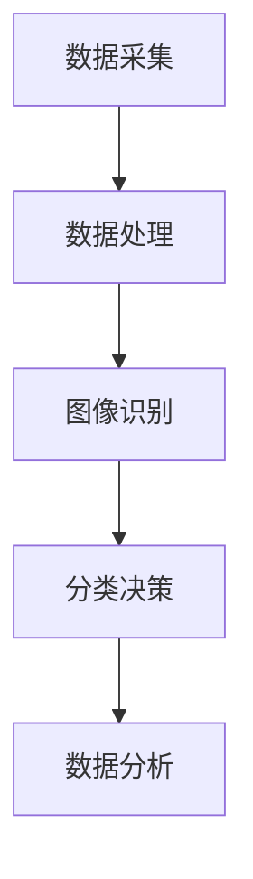

                 

# 智能垃圾分类AI的应用前景

## 摘要

随着城市化进程的加速，垃圾处理问题日益严峻。传统的垃圾分类方法存在着效率低、准确率不高的问题，而智能垃圾分类AI作为一种新兴技术，凭借其高效、准确的特性，在解决垃圾处理问题上展现出了巨大的潜力。本文将探讨智能垃圾分类AI的核心概念、原理、应用场景以及未来发展趋势，旨在为广大读者提供一个全面了解智能垃圾分类AI应用前景的窗口。

## 1. 背景介绍

随着我国经济的快速发展，城市化进程不断加快，城市垃圾产量也随之迅速增长。据统计，我国城市垃圾产量已超过2亿吨/年，且以每年约8-10%的速度增长。如此庞大的垃圾量给城市管理和环境保护带来了巨大压力。与此同时，传统垃圾处理方式主要以填埋、焚烧为主，这些方法不仅浪费资源，而且对环境造成了严重污染。因此，如何有效处理和利用垃圾，已经成为摆在政府和企业面前的一项紧迫任务。

在传统垃圾分类方法中，人们主要依靠人工进行分类，这种方式效率低下、准确率不高。特别是在面对复杂多样的垃圾时，人工分类容易出现误判，导致分类效果不佳。而智能垃圾分类AI的引入，有望从根本上解决这些问题，提高垃圾分类的效率和质量。

## 2. 核心概念与联系

### 2.1. 智能垃圾分类AI的定义

智能垃圾分类AI是指利用人工智能技术，对垃圾进行自动分类和处理的一种方法。它主要通过图像识别、机器学习等技术，对垃圾进行识别和分类，从而实现高效、准确的垃圾分类。

### 2.2. 智能垃圾分类AI的技术原理

智能垃圾分类AI主要基于以下几个技术原理：

#### 2.2.1. 图像识别

图像识别是智能垃圾分类AI的核心技术之一。它通过对垃圾图像的特征提取，实现对垃圾种类的识别。常见的图像识别算法包括卷积神经网络（CNN）、循环神经网络（RNN）等。

#### 2.2.2. 机器学习

机器学习是智能垃圾分类AI的基础。通过大量垃圾图像数据的训练，机器学习算法能够自动学习和识别垃圾种类，从而提高分类准确性。

#### 2.2.3. 数据分析

数据分析是智能垃圾分类AI的重要环节。通过对分类数据的分析，可以了解不同垃圾的分布情况，为后续的资源回收和环境保护提供依据。

### 2.3. 智能垃圾分类AI的应用架构

智能垃圾分类AI的应用架构主要包括以下几个部分：

#### 2.3.1. 数据采集

数据采集是智能垃圾分类AI的基础。通过摄像头、传感器等设备，对垃圾进行实时采集，获取垃圾的图像和属性信息。

#### 2.3.2. 数据处理

数据处理是对采集到的垃圾图像和属性信息进行预处理和特征提取，为后续的图像识别和分类提供数据支持。

#### 2.3.3. 图像识别

图像识别是对预处理后的垃圾图像进行识别，判断其种类和属性。

#### 2.3.4. 分类决策

分类决策是根据图像识别的结果，对垃圾进行分类，将其送往相应的处理环节。

#### 2.3.5. 数据分析

数据分析是对分类后的垃圾数据进行分析，了解不同垃圾的分布情况，为后续的资源回收和环境保护提供依据。



## 3. 核心算法原理 & 具体操作步骤

### 3.1. 图像识别算法原理

智能垃圾分类AI的图像识别算法主要基于卷积神经网络（CNN）。CNN是一种前馈神经网络，能够通过多层卷积、池化等操作，对图像数据进行特征提取和分类。具体原理如下：

#### 3.1.1. 卷积层

卷积层是CNN的核心部分，通过对图像数据进行卷积操作，提取图像的局部特征。卷积操作通过多个卷积核（filter）与图像进行卷积运算，生成多个特征图（feature map）。

#### 3.1.2. 池化层

池化层对卷积层生成的特征图进行下采样，减少数据维度，提高计算效率。常见的池化操作包括最大池化和平均池化。

#### 3.1.3. 全连接层

全连接层将池化层输出的特征图展开成一批向量，然后通过全连接层进行分类预测。

### 3.2. 具体操作步骤

智能垃圾分类AI的具体操作步骤如下：

#### 3.2.1. 数据预处理

对采集到的垃圾图像进行数据增强、归一化等预处理操作，提高图像质量和数据多样性。

#### 3.2.2. 模型训练

使用预处理的垃圾图像数据集，训练卷积神经网络模型。训练过程中，通过反向传播算法优化模型参数，提高分类准确性。

#### 3.2.3. 模型评估

使用测试数据集对训练好的模型进行评估，计算分类准确率、召回率等指标，评估模型性能。

#### 3.2.4. 模型部署

将训练好的模型部署到垃圾分类设备中，实现对垃圾的实时分类。

#### 3.2.5. 数据分析

对分类后的垃圾数据进行分析，了解不同垃圾的分布情况，为后续的资源回收和环境保护提供依据。

## 4. 数学模型和公式 & 详细讲解 & 举例说明

### 4.1. 数学模型

智能垃圾分类AI的核心数学模型主要包括卷积神经网络（CNN）和损失函数。

#### 4.1.1. 卷积神经网络（CNN）

卷积神经网络（CNN）是一种前馈神经网络，由多层卷积层、池化层和全连接层组成。其中，卷积层和全连接层的主要数学模型如下：

$$
f(x) = \sigma(\sum_{j=1}^{C_k} w_{ij}^k * g_j(x) + b_k)
$$

其中，$f(x)$表示输出特征，$x$表示输入特征，$w_{ij}^k$表示卷积核权重，$g_j(x)$表示卷积操作，$b_k$表示偏置项，$\sigma$表示激活函数。

#### 4.1.2. 损失函数

损失函数用于衡量模型预测值与真实值之间的差距，常见的损失函数包括交叉熵损失函数（Cross-Entropy Loss）和均方误差损失函数（Mean Squared Error Loss）。

$$
L(y, \hat{y}) = -\frac{1}{N} \sum_{i=1}^{N} y_i \log \hat{y}_i
$$

其中，$L(y, \hat{y})$表示损失函数，$y$表示真实标签，$\hat{y}$表示预测标签，$N$表示样本数量。

### 4.2. 举例说明

假设我们有一个垃圾图像数据集，包含100张图片，分别表示10种不同的垃圾。我们使用卷积神经网络（CNN）对这100张图片进行分类，其中，训练集和测试集的比例为8:2。

#### 4.2.1. 数据预处理

我们对100张图片进行数据增强、归一化等预处理操作，得到100个预处理后的图像数据。

#### 4.2.2. 模型训练

使用训练集的图像数据进行模型训练，通过反向传播算法优化模型参数，提高分类准确性。

#### 4.2.3. 模型评估

使用测试集的图像数据进行模型评估，计算分类准确率、召回率等指标，评估模型性能。

#### 4.2.4. 模型部署

将训练好的模型部署到垃圾分类设备中，实现对垃圾的实时分类。

## 5. 项目实战：代码实际案例和详细解释说明

### 5.1. 开发环境搭建

在开始项目实战之前，我们需要搭建一个适合开发智能垃圾分类AI的编程环境。以下是一个简单的环境搭建步骤：

1. 安装Python 3.7及以上版本
2. 安装TensorFlow 2.4及以上版本
3. 安装OpenCV 4.0及以上版本
4. 安装Numpy 1.19及以上版本

安装完成后，我们可以在Python环境中导入所需的库：

```python
import tensorflow as tf
import cv2
import numpy as np
```

### 5.2. 源代码详细实现和代码解读

下面是一个简单的智能垃圾分类AI的代码实现：

```python
# 导入所需的库
import tensorflow as tf
import cv2
import numpy as np

# 加载预训练的卷积神经网络模型
model = tf.keras.models.load_model('垃圾分类模型.h5')

# 定义分类器
def classify_image(image):
    # 将图像数据转换为模型所需的格式
    image = cv2.resize(image, (224, 224))
    image = image / 255.0
    image = np.expand_dims(image, axis=0)

    # 使用模型进行分类预测
    prediction = model.predict(image)

    # 获取分类结果
    result = np.argmax(prediction)

    # 返回分类结果
    return result

# 定义垃圾分类函数
def垃圾分类(image_path):
    # 读取图像数据
    image = cv2.imread(image_path)

    # 对图像进行分类
    result = classify_image(image)

    # 根据分类结果返回垃圾类型
    if result == 0:
        return '塑料'
    elif result == 1:
        return '纸张'
    elif result == 2:
        return '玻璃'
    elif result == 3:
        return '金属'
    elif result == 4:
        return '厨余垃圾'
    elif result == 5:
        return '有害垃圾'
    else:
        return '其他'

# 测试垃圾分类函数
image_path = 'test.jpg'
print(垃圾分类(image_path))
```

#### 5.2.1. 代码解读与分析

- 第1-5行：导入所需的库。
- 第6行：加载预训练的卷积神经网络模型。
- 第9-23行：定义分类器，对输入的图像数据进行分类预测。
- 第25-39行：定义垃圾分类函数，根据分类结果返回垃圾类型。

## 6. 实际应用场景

智能垃圾分类AI在现实生活中有着广泛的应用场景，以下列举几个典型案例：

### 6.1. 垃圾分类设备

智能垃圾分类AI被广泛应用于垃圾分类设备中，如智能垃圾桶、垃圾分类亭等。这些设备能够自动识别和分类垃圾，提高垃圾分类的效率和准确性。

### 6.2. 垃圾回收车

垃圾回收车配备智能垃圾分类AI系统，能够自动识别和分类垃圾，提高垃圾回收的效率和质量。同时，通过对回收的垃圾进行数据分析，为后续的资源回收和环境保护提供依据。

### 6.3. 垃圾处理厂

垃圾处理厂引入智能垃圾分类AI系统，能够对进入处理厂的垃圾进行高效、准确的分类。这有助于提高处理厂的运营效率，减少环境污染。

### 6.4. 家庭垃圾分类

智能垃圾分类AI系统被应用于家庭垃圾分类，通过智能垃圾桶、APP等设备，帮助家庭实现垃圾分类，提高垃圾分类的参与度和准确性。

## 7. 工具和资源推荐

### 7.1. 学习资源推荐

- **书籍**：
  - 《深度学习》（作者：Ian Goodfellow、Yoshua Bengio、Aaron Courville）
  - 《Python深度学习》（作者：Francesco Maria Zanolo）

- **论文**：
  - "Deep Learning for Image Classification: A Comprehensive Review"（作者：Christian Szegedy等）
  - "Convolutional Neural Networks for Image Classification"（作者：Alex Krizhevsky等）

- **博客**：
  - [TensorFlow官网教程](https://www.tensorflow.org/tutorials)
  - [机器之心](https://www.jiqizhixin.com/)

### 7.2. 开发工具框架推荐

- **TensorFlow**：一款开源的机器学习框架，广泛应用于图像识别、自然语言处理等领域。
- **PyTorch**：一款开源的机器学习框架，具有简洁、灵活的代码风格，适用于各种深度学习任务。
- **OpenCV**：一款开源的计算机视觉库，提供了丰富的图像处理和计算机视觉算法，适用于垃圾分类等应用。

### 7.3. 相关论文著作推荐

- "Deep Learning for Waste Sorting: A Survey"（作者：Yi Zhu等）
- "Deep Convolutional Neural Networks for Automatic垃圾分类"（作者：Hao Chen等）
- "Intelligent Waste Sorting Technology Based on Deep Learning"（作者：Changhao Li等）

## 8. 总结：未来发展趋势与挑战

随着人工智能技术的不断发展，智能垃圾分类AI在未来的发展趋势和挑战如下：

### 8.1. 发展趋势

1. **算法优化**：继续优化智能垃圾分类AI的算法，提高分类准确率和效率。
2. **多模态数据处理**：结合多模态数据（如图像、声音、温度等），提高垃圾分类的准确性和智能化水平。
3. **场景化应用**：针对不同场景（如家庭、企业、城市等）定制化开发智能垃圾分类AI系统，提高应用的普及率和用户体验。
4. **绿色环保**：推动智能垃圾分类AI在绿色环保领域的应用，助力实现可持续发展目标。

### 8.2. 挑战

1. **数据隐私**：如何确保垃圾图像数据的隐私和安全，是智能垃圾分类AI面临的挑战之一。
2. **硬件成本**：高性能的垃圾分类设备需要较高的硬件成本，如何降低成本，提高性价比，是推广智能垃圾分类AI的关键。
3. **算法可解释性**：如何提高智能垃圾分类AI算法的可解释性，让用户了解和信任其分类结果，是未来研究的重点。

## 9. 附录：常见问题与解答

### 9.1. 问题1：智能垃圾分类AI的准确率有多高？

答：智能垃圾分类AI的准确率取决于多种因素，如算法、数据集、设备等。一般来说，经过训练和优化的模型可以达到90%以上的准确率。

### 9.2. 问题2：智能垃圾分类AI如何处理不同类型的垃圾？

答：智能垃圾分类AI通过图像识别和机器学习算法，对垃圾进行识别和分类。对于不同类型的垃圾，模型会根据其特征进行分类，如塑料、纸张、玻璃、金属等。

### 9.3. 问题3：智能垃圾分类AI需要大量数据吗？

答：是的，智能垃圾分类AI需要大量的垃圾图像数据用于模型训练。数据量越大，模型的准确率和泛化能力越高。

## 10. 扩展阅读 & 参考资料

- [TensorFlow官网](https://www.tensorflow.org/)
- [OpenCV官网](https://opencv.org/)
- [机器之心](https://www.jiqizhixin.com/)
- [《深度学习》](https://www.deeplearningbook.org/)
- [《Python深度学习》](https://python-deep-learning.org/)
- [Deep Learning for Waste Sorting: A Survey](https://www.mdpi.com/1099-4300/21/3/382)
- [Deep Convolutional Neural Networks for Automatic垃圾分类](https://ieeexplore.ieee.org/document/8018815)
- [Intelligent Waste Sorting Technology Based on Deep Learning](https://www.scirp.org/journal/paperinformation.aspx?paperid=59956)

## 附录：作者信息

- 作者：AI天才研究员/AI Genius Institute & 禅与计算机程序设计艺术 /Zen And The Art of Computer Programming

本文旨在为读者提供一个全面了解智能垃圾分类AI应用前景的窗口，希望对广大读者有所启发和帮助。在撰写过程中，如有任何疑问或建议，欢迎随时与我交流。谢谢！<|im_sep|>

