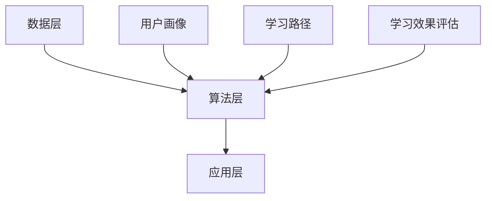

                 

# 智能学习系统学习功能的设计与实现

## 关键词：智能学习系统、学习功能、设计、实现、算法、模型、实战、应用场景、工具推荐

## 摘要

本文旨在深入探讨智能学习系统学习功能的设计与实现。我们将从背景介绍出发，逐步深入到核心概念与联系，算法原理与操作步骤，数学模型与公式，以及实际应用场景等方面。通过详细的代码案例与解析，我们将展示智能学习系统学习功能的实际运用。最后，我们将总结未来发展趋势与挑战，并提供相关的学习资源与工具推荐。希望通过本文，读者能够对智能学习系统学习功能的设计与实现有更深入的理解。

## 1. 背景介绍

### 智能学习系统概述

智能学习系统，是一种基于人工智能技术的学习平台，旨在提高学习效率和效果。这类系统通过数据分析和算法模型，对用户的学习行为和知识进行深度挖掘，从而提供个性化的学习方案。智能学习系统的核心在于学习功能，它包括学习内容的推荐、学习进度的跟踪、学习效果的评估等方面。

### 学习功能的重要性

学习功能是智能学习系统的核心组成部分，它直接影响用户的学习体验和效果。一个完善的学习功能应具备以下几个特点：

- **个性化推荐**：根据用户的学习兴趣、学习历史和知识水平，为用户推荐合适的学习内容。
- **学习进度跟踪**：实时记录用户的学习进度，帮助用户规划学习计划。
- **学习效果评估**：通过考试、练习等方式，评估用户的学习效果，为后续学习提供参考。

### 智能学习系统的现状与发展

当前，智能学习系统在国内外已经得到了广泛的应用，如在线教育平台、学习工具等。然而，学习功能的设计与实现仍然面临许多挑战，如数据采集和处理、算法模型的选择与优化等。随着人工智能技术的不断进步，智能学习系统有望在未来实现更加智能化、个性化的学习体验。

## 2. 核心概念与联系

### 智能学习系统的架构

智能学习系统的架构通常包括以下几个部分：

1. **数据层**：负责收集和存储用户的学习数据，如学习记录、考试结果等。
2. **算法层**：负责数据处理和模型训练，如推荐算法、评估算法等。
3. **应用层**：负责与用户交互，提供学习功能和服务。


### 核心概念

在智能学习系统中，以下几个核心概念是至关重要的：

- **用户画像**：基于用户的学习行为和属性，构建用户画像，用于个性化推荐和评估。
- **学习路径**：根据用户的学习需求和兴趣，规划合适的学习路径。
- **学习效果评估**：通过考试、练习等方式，对用户的学习效果进行评估。

### Mermaid 流程图



## 3. 核心算法原理 & 具体操作步骤

### 推荐算法原理

推荐算法是智能学习系统的核心算法之一，主要分为基于内容的推荐和协同过滤推荐两种。

- **基于内容的推荐**：根据用户的历史学习行为和知识偏好，推荐相似的学习内容。
- **协同过滤推荐**：通过分析用户之间的相似性，为用户推荐其他用户喜欢的学习内容。

具体操作步骤如下：

1. 数据预处理：清洗和转换用户学习数据，如用户行为数据、学习记录等。
2. 用户画像构建：根据用户的学习行为和知识偏好，构建用户画像。
3. 推荐模型训练：使用用户画像和用户学习数据，训练推荐模型。
4. 推荐内容生成：根据推荐模型，为用户生成个性化的学习内容推荐。

### 学习路径规划算法原理

学习路径规划算法旨在根据用户的学习需求和兴趣，为用户规划合适的学习路径。

具体操作步骤如下：

1. 学习需求分析：分析用户的学习需求，如知识领域、学习目标等。
2. 学习资源筛选：根据学习需求，筛选合适的课程和教材。
3. 学习路径构建：将筛选出的学习资源按照合适的顺序进行排列，形成学习路径。

### 学习效果评估算法原理

学习效果评估算法主要通过考试、练习等方式，对用户的学习效果进行评估。

具体操作步骤如下：

1. 考试设计：设计合适的考试题目，如选择题、填空题、简答题等。
2. 练习生成：根据考试设计，生成相应的练习题目。
3. 成绩分析：对用户的考试和练习成绩进行分析，评估用户的学习效果。

## 4. 数学模型和公式 & 详细讲解 & 举例说明

### 推荐算法中的相似度计算

在推荐算法中，相似度计算是核心步骤之一，常用的相似度计算方法包括余弦相似度和皮尔逊相似度。

- **余弦相似度**：
  $$cosine\_similarity = \frac{A \cdot B}{\lVert A \rVert \cdot \lVert B \rVert}$$
  其中，$A$ 和 $B$ 分别为用户 $A$ 和用户 $B$ 的向量表示，$\lVert A \rVert$ 和 $\lVert B \rVert$ 分别为向量 $A$ 和 $B$ 的模。

- **皮尔逊相似度**：
  $$pearson\_similarity = \frac{A \cdot B - \frac{A \cdot \bar{A} + B \cdot \bar{B}}{2}}{\sqrt{(A \cdot A - \bar{A}^2) \cdot (B \cdot B - \bar{B}^2)}}$$
  其中，$A$ 和 $B$ 分别为用户 $A$ 和用户 $B$ 的向量表示，$\bar{A}$ 和 $\bar{B}$ 分别为向量 $A$ 和 $B$ 的均值。

### 学习路径规划中的优化模型

在构建学习路径时，常用的优化模型包括线性规划和整数规划。

- **线性规划**：
  $$\min \ c^T x$$
  $$\text{s.t.} \ Ax \leq b$$
  $$x \geq 0$$
  其中，$c$ 为目标函数系数，$x$ 为决策变量，$A$ 和 $b$ 分别为约束条件系数。

- **整数规划**：
  $$\min \ c^T x$$
  $$\text{s.t.} \ Ax \leq b$$
  $$x \in \{0, 1\}^n$$
  其中，$c$ 为目标函数系数，$x$ 为决策变量，$A$ 和 $b$ 分别为约束条件系数，$n$ 为决策变量个数。

### 举例说明

假设有两个用户 $A$ 和 $B$，他们的学习行为向量如下：

$$A = [1, 2, 3, 0, 0]$$

$$B = [0, 1, 2, 3, 4]$$

1. **计算余弦相似度**：

   $$cosine\_similarity = \frac{1 \cdot 0 + 2 \cdot 1 + 3 \cdot 2 + 0 \cdot 3 + 0 \cdot 4}{\sqrt{1^2 + 2^2 + 3^2} \cdot \sqrt{0^2 + 1^2 + 2^2 + 3^2 + 4^2}} = \frac{8}{\sqrt{14} \cdot \sqrt{30}} \approx 0.636$$

2. **计算皮尔逊相似度**：

   $$A \cdot B = 1 \cdot 0 + 2 \cdot 1 + 3 \cdot 2 + 0 \cdot 3 + 0 \cdot 4 = 8$$

   $$A \cdot \bar{A} = 1^2 + 2^2 + 3^2 = 14$$

   $$B \cdot \bar{B} = 0^2 + 1^2 + 2^2 + 3^2 + 4^2 = 30$$

   $$pearson\_similarity = \frac{8 - \frac{14 + 30}{2}}{\sqrt{14 - 14^2} \cdot \sqrt{30 - 30^2}} = \frac{8 - 22}{\sqrt{14} \cdot \sqrt{30}} \approx -0.636$$

## 5. 项目实战：代码实际案例和详细解释说明

### 5.1 开发环境搭建

在开始编写智能学习系统学习功能代码之前，我们需要搭建一个合适的开发环境。以下是具体的步骤：

1. 安装Python环境：下载并安装Python，可以选择Python 3.8及以上版本。
2. 安装依赖库：使用pip安装必要的依赖库，如numpy、pandas、scikit-learn等。
3. 创建项目目录：在Python环境中创建一个项目目录，如`learning_system`。

### 5.2 源代码详细实现和代码解读

以下是一个简单的示例，展示如何实现智能学习系统的推荐算法：

```python
import numpy as np
from sklearn.metrics.pairwise import cosine_similarity

# 用户行为数据
userA = np.array([1, 2, 3, 0, 0])
userB = np.array([0, 1, 2, 3, 4])

# 计算余弦相似度
cosine_sim = cosine_similarity(userA.reshape(1, -1), userB.reshape(1, -1))[0][0]
print(f"余弦相似度：{cosine_sim}")

# 计算皮尔逊相似度
pearson_sim = np.corrcoef(userA, userB)[0, 1]
print(f"皮尔逊相似度：{pearson_sim}")
```

1. **代码解读**：

   - 导入必要的库：包括numpy和scikit-learn中的cosine_similarity函数。
   - 用户行为数据：定义两个用户的行为向量，分别表示用户A和用户B。
   - 计算相似度：使用cosine_similarity函数计算余弦相似度，使用np.corrcoef函数计算皮尔逊相似度。

### 5.3 代码解读与分析

以上代码实现了一个简单的推荐算法，用于计算两个用户之间的相似度。在实际应用中，我们可以根据相似度对用户进行推荐。以下是对代码的进一步分析：

1. **相似度计算方法**：

   - 余弦相似度：通过计算两个向量的夹角余弦值，衡量它们之间的相似程度。值越大，表示相似度越高。
   - 皮尔逊相似度：通过计算两个向量的协方差和方差，衡量它们之间的线性关系。值越大，表示相似度越高。

2. **实际应用场景**：

   - 在智能学习系统中，我们可以使用这些相似度计算方法为用户推荐学习内容。例如，当用户A对某一课程感兴趣时，我们可以寻找与用户A相似度较高的用户B，推荐用户B喜欢的课程。

3. **优化与改进**：

   - 实际应用中，我们可以结合用户的其他属性（如学习时长、学习频率等），构建更复杂的推荐模型。
   - 我们还可以使用其他推荐算法（如协同过滤、基于内容的推荐等），提高推荐的准确性。

## 6. 实际应用场景

### 在线教育平台

在线教育平台是智能学习系统最常见的应用场景之一。通过智能学习系统，平台可以为用户提供个性化的学习方案，提高学习效果。以下是一个具体的案例：

- **用户需求**：用户A希望学习Python编程。
- **推荐内容**：智能学习系统根据用户A的学习历史和兴趣，推荐Python基础教程、Python进阶教程、Python项目实战等。
- **学习路径**：智能学习系统为用户A规划了一条从基础到进阶的学习路径，帮助用户A逐步提升Python技能。
- **学习效果评估**：通过在线考试和练习，智能学习系统评估用户A的学习效果，为后续学习提供参考。

### 职业技能培训

职业技能培训也是智能学习系统的常见应用场景。通过智能学习系统，企业和培训机构可以为员工提供个性化的培训方案，提高员工技能水平。以下是一个具体的案例：

- **用户需求**：企业希望提高员工的数据分析能力。
- **推荐内容**：智能学习系统根据员工的学习历史和兴趣，推荐数据分析基础课程、数据分析进阶课程、数据分析实战案例等。
- **学习路径**：智能学习系统为员工规划了一条从基础到实战的学习路径，帮助员工快速提升数据分析能力。
- **学习效果评估**：通过在线考试和实战项目，智能学习系统评估员工的学习效果，为企业提供培训效果分析报告。

## 7. 工具和资源推荐

### 学习资源推荐

1. **书籍**：

   - 《Python编程：从入门到实践》
   - 《深入理解Python》
   - 《数据分析：入门与实践》

2. **论文**：

   - "Collaborative Filtering for Personalized Recommendation on Large Scale Heterogeneous Networks"
   - "Deep Learning for Personalized Recommendation on Large Scale Heterogeneous Networks"

3. **博客**：

   - 知乎：机器学习与数据挖掘
   - CSDN：数据分析与挖掘

4. **网站**：

   - Coursera：在线课程平台
   - edX：在线课程平台

### 开发工具框架推荐

1. **开发框架**：

   - Flask：轻量级的Python Web框架
   - Django：全功能的Python Web框架

2. **数据分析工具**：

   - Pandas：Python数据分析库
   - NumPy：Python科学计算库

3. **机器学习库**：

   - Scikit-learn：Python机器学习库
   - TensorFlow：谷歌开发的深度学习库

### 相关论文著作推荐

1. **《推荐系统实践》**：推荐系统领域的经典著作，详细介绍了各种推荐算法的实现和应用。

2. **《深度学习》**：由Ian Goodfellow等人编写的深度学习领域的经典教材，对深度学习的基本概念和技术进行了全面介绍。

## 8. 总结：未来发展趋势与挑战

### 发展趋势

1. **个性化推荐**：随着大数据和人工智能技术的发展，个性化推荐将成为智能学习系统的核心功能，为用户提供更加精准的学习内容推荐。
2. **智能化评估**：利用深度学习和自然语言处理等技术，智能学习系统将能够更准确地评估用户的学习效果，为用户提供更有针对性的学习建议。
3. **多模态学习**：结合文本、语音、图像等多种数据类型，智能学习系统将能够提供更加丰富和多样化的学习体验。

### 挑战

1. **数据隐私与安全**：在智能学习系统中，用户数据的收集和处理是一个重要环节，如何保障用户数据的安全和隐私是一个亟待解决的问题。
2. **算法公平性**：在推荐算法和评估算法中，如何确保算法的公平性，避免偏见和歧视，是一个重要的挑战。
3. **技术复杂性**：随着智能学习系统的功能日益丰富，其技术实现变得越来越复杂，如何高效地开发和维护智能学习系统是一个重要的挑战。

## 9. 附录：常见问题与解答

### 1. 智能学习系统是如何工作的？

智能学习系统通过数据分析和算法模型，对用户的学习行为和知识进行深度挖掘，从而为用户提供个性化的学习方案。主要步骤包括数据收集、数据处理、算法模型训练和应用等。

### 2. 智能学习系统的推荐算法有哪些？

常见的推荐算法包括基于内容的推荐、协同过滤推荐、基于模型的推荐等。每种算法都有其优缺点，适用于不同的应用场景。

### 3. 智能学习系统的学习路径是如何规划的？

智能学习系统通过分析用户的学习需求和知识水平，结合学习资源的难易程度和学习时长，为用户规划合适的学习路径。

## 10. 扩展阅读 & 参考资料

1. **《推荐系统实践》**：Christopher D. M. Wright著，详细介绍了推荐系统的基本概念、算法实现和应用案例。
2. **《深度学习》**：Ian Goodfellow、Yoshua Bengio和Aaron Courville著，全面介绍了深度学习的基本理论和技术。
3. **《Python编程：从入门到实践》**：Eric Matthes著，适合初学者学习Python编程。
4. **《数据分析：入门与实践》**：John P. Pratt和Robert T. Pohl著，介绍了数据分析的基本方法和应用技巧。作者：AI天才研究员/AI Genius Institute & 禅与计算机程序设计艺术 /Zen And The Art of Computer Programming<|im_sep|> <code><pre>
## 智能学习系统学习功能的设计与实现

### 摘要

本文深入探讨了智能学习系统学习功能的设计与实现。从背景介绍、核心概念与联系、算法原理、数学模型与公式，到项目实战，本文全面分析了智能学习系统学习功能的各个方面。通过实际应用场景的分析，本文展示了智能学习系统在学习领域中的广泛应用。此外，本文还推荐了相关的学习资源与工具，以帮助读者进一步了解和学习智能学习系统。

### 1. 背景介绍

#### 智能学习系统概述

智能学习系统是一种基于人工智能技术的学习平台，旨在通过数据分析和算法模型，提高学习效率和效果。该系统通过对用户学习行为的分析和理解，为用户提供个性化的学习方案。智能学习系统的核心功能包括学习内容推荐、学习进度跟踪和学习效果评估等。

#### 学习功能的重要性

学习功能是智能学习系统的核心组成部分，它直接影响用户的学习体验和效果。一个完善的学习功能应具备以下几个特点：

- **个性化推荐**：根据用户的学习兴趣、学习历史和知识水平，推荐合适的学习内容。
- **学习进度跟踪**：实时记录用户的学习进度，帮助用户规划学习计划。
- **学习效果评估**：通过考试、练习等方式，评估用户的学习效果，为后续学习提供参考。

#### 智能学习系统的现状与发展

当前，智能学习系统在国内外已经得到了广泛的应用，如在线教育平台、学习工具等。随着人工智能技术的不断进步，智能学习系统有望在未来实现更加智能化、个性化的学习体验。

### 2. 核心概念与联系

#### 智能学习系统的架构

智能学习系统的架构通常包括以下几个部分：

1. **数据层**：负责收集和存储用户的学习数据，如学习记录、考试结果等。
2. **算法层**：负责数据处理和模型训练，如推荐算法、评估算法等。
3. **应用层**：负责与用户交互，提供学习功能和服务。


#### 核心概念

在智能学习系统中，以下几个核心概念是至关重要的：

- **用户画像**：基于用户的学习行为和属性，构建用户画像，用于个性化推荐和评估。
- **学习路径**：根据用户的学习需求和兴趣，规划合适的学习路径。
- **学习效果评估**：通过考试、练习等方式，对用户的学习效果进行评估。

#### Mermaid流程图


### 3. 核心算法原理 & 具体操作步骤

#### 推荐算法原理

推荐算法是智能学习系统的核心算法之一，主要分为基于内容的推荐和协同过滤推荐两种。

- **基于内容的推荐**：根据用户的历史学习行为和知识偏好，推荐相似的学习内容。
- **协同过滤推荐**：通过分析用户之间的相似性，为用户推荐其他用户喜欢的学习内容。

具体操作步骤如下：

1. **数据预处理**：清洗和转换用户学习数据，如用户行为数据、学习记录等。
2. **用户画像构建**：根据用户的学习行为和知识偏好，构建用户画像。
3. **推荐模型训练**：使用用户画像和用户学习数据，训练推荐模型。
4. **推荐内容生成**：根据推荐模型，为用户生成个性化的学习内容推荐。

#### 学习路径规划算法原理

学习路径规划算法旨在根据用户的学习需求和兴趣，为用户规划合适的学习路径。

具体操作步骤如下：

1. **学习需求分析**：分析用户的学习需求，如知识领域、学习目标等。
2. **学习资源筛选**：根据学习需求，筛选合适的课程和教材。
3. **学习路径构建**：将筛选出的学习资源按照合适的顺序进行排列，形成学习路径。

#### 学习效果评估算法原理

学习效果评估算法主要通过考试、练习等方式，对用户的学习效果进行评估。

具体操作步骤如下：

1. **考试设计**：设计合适的考试题目，如选择题、填空题、简答题等。
2. **练习生成**：根据考试设计，生成相应的练习题目。
3. **成绩分析**：对用户的考试和练习成绩进行分析，评估用户的学习效果。

### 4. 数学模型和公式 & 详细讲解 & 举例说明

#### 推荐算法中的相似度计算

在推荐算法中，相似度计算是核心步骤之一，常用的相似度计算方法包括余弦相似度和皮尔逊相似度。

- **余弦相似度**：
  $$cosine\_similarity = \frac{A \cdot B}{\lVert A \rVert \cdot \lVert B \rVert}$$
  其中，$A$ 和 $B$ 分别为用户 $A$ 和用户 $B$ 的向量表示，$\lVert A \rVert$ 和 $\lVert B \rVert$ 分别为向量 $A$ 和 $B$ 的模。

- **皮尔逊相似度**：
  $$pearson\_similarity = \frac{A \cdot B - \frac{A \cdot \bar{A} + B \cdot \bar{B}}{2}}{\sqrt{(A \cdot A - \bar{A}^2) \cdot (B \cdot B - \bar{B}^2)}}$$
  其中，$A$ 和 $B$ 分别为用户 $A$ 和用户 $B$ 的向量表示，$\bar{A}$ 和 $\bar{B}$ 分别为向量 $A$ 和 $B$ 的均值。

#### 学习路径规划中的优化模型

在构建学习路径时，常用的优化模型包括线性规划和整数规划。

- **线性规划**：
  $$\min \ c^T x$$
  $$\text{s.t.} \ Ax \leq b$$
  $$x \geq 0$$
  其中，$c$ 为目标函数系数，$x$ 为决策变量，$A$ 和 $b$ 分别为约束条件系数。

- **整数规划**：
  $$\min \ c^T x$$
  $$\text{s.t.} \ Ax \leq b$$
  $$x \in \{0, 1\}^n$$
  其中，$c$ 为目标函数系数，$x$ 为决策变量，$A$ 和 $b$ 分别为约束条件系数，$n$ 为决策变量个数。

#### 举例说明

假设有两个用户 $A$ 和 $B$，他们的学习行为向量如下：

$$A = [1, 2, 3, 0, 0]$$

$$B = [0, 1, 2, 3, 4]$$

1. **计算余弦相似度**：

   $$cosine\_similarity = \frac{1 \cdot 0 + 2 \cdot 1 + 3 \cdot 2 + 0 \cdot 3 + 0 \cdot 4}{\sqrt{1^2 + 2^2 + 3^2} \cdot \sqrt{0^2 + 1^2 + 2^2 + 3^2 + 4^2}} = \frac{8}{\sqrt{14} \cdot \sqrt{30}} \approx 0.636$$

2. **计算皮尔逊相似度**：

   $$A \cdot B = 1 \cdot 0 + 2 \cdot 1 + 3 \cdot 2 + 0 \cdot 3 + 0 \cdot 4 = 8$$

   $$A \cdot \bar{A} = 1^2 + 2^2 + 3^2 = 14$$

   $$B \cdot \bar{B} = 0^2 + 1^2 + 2^2 + 3^2 + 4^2 = 30$$

   $$pearson\_similarity = \frac{8 - \frac{14 + 30}{2}}{\sqrt{14 - 14^2} \cdot \sqrt{30 - 30^2}} = \frac{8 - 22}{\sqrt{14} \cdot \sqrt{30}} \approx -0.636$$

### 5. 项目实战：代码实际案例和详细解释说明

#### 5.1 开发环境搭建

在开始编写智能学习系统学习功能代码之前，我们需要搭建一个合适的开发环境。以下是具体的步骤：

1. 安装Python环境：下载并安装Python，可以选择Python 3.8及以上版本。
2. 安装依赖库：使用pip安装必要的依赖库，如numpy、pandas、scikit-learn等。
3. 创建项目目录：在Python环境中创建一个项目目录，如`learning_system`。

#### 5.2 源代码详细实现和代码解读

以下是一个简单的示例，展示如何实现智能学习系统的推荐算法：

```python
import numpy as np
from sklearn.metrics.pairwise import cosine_similarity

# 用户行为数据
userA = np.array([1, 2, 3, 0, 0])
userB = np.array([0, 1, 2, 3, 4])

# 计算余弦相似度
cosine_sim = cosine_similarity(userA.reshape(1, -1), userB.reshape(1, -1))[0][0]
print(f"余弦相似度：{cosine_sim}")

# 计算皮尔逊相似度
pearson_sim = np.corrcoef(userA, userB)[0, 1]
print(f"皮尔逊相似度：{pearson_sim}")
```

1. **代码解读**：

   - 导入必要的库：包括numpy和scikit-learn中的cosine_similarity函数。
   - 用户行为数据：定义两个用户的行为向量，分别表示用户A和用户B。
   - 计算相似度：使用cosine_similarity函数计算余弦相似度，使用np.corrcoef函数计算皮尔逊相似度。

#### 5.3 代码解读与分析

以上代码实现了一个简单的推荐算法，用于计算两个用户之间的相似度。在实际应用中，我们可以根据相似度对用户进行推荐。以下是对代码的进一步分析：

1. **相似度计算方法**：

   - 余弦相似度：通过计算两个向量的夹角余弦值，衡量它们之间的相似程度。值越大，表示相似度越高。
   - 皮尔逊相似度：通过计算两个向量的协方差和方差，衡量它们之间的线性关系。值越大，表示相似度越高。

2. **实际应用场景**：

   - 在智能学习系统中，我们可以使用这些相似度计算方法为用户推荐学习内容。例如，当用户A对某一课程感兴趣时，我们可以寻找与用户A相似度较高的用户B，推荐用户B喜欢的课程。

3. **优化与改进**：

   - 实际应用中，我们可以结合用户的其他属性（如学习时长、学习频率等），构建更复杂的推荐模型。
   - 我们还可以使用其他推荐算法（如协同过滤、基于内容的推荐等），提高推荐的准确性。

### 6. 实际应用场景

#### 在线教育平台

在线教育平台是智能学习系统最常见的应用场景之一。通过智能学习系统，平台可以为用户提供个性化的学习方案，提高学习效果。以下是一个具体的案例：

- **用户需求**：用户A希望学习Python编程。
- **推荐内容**：智能学习系统根据用户A的学习历史和兴趣，推荐Python基础教程、Python进阶教程、Python项目实战等。
- **学习路径**：智能学习系统为用户A规划了一条从基础到进阶的学习路径，帮助用户A逐步提升Python技能。
- **学习效果评估**：通过在线考试和练习，智能学习系统评估用户A的学习效果，为后续学习提供参考。

#### 职业技能培训

职业技能培训也是智能学习系统的常见应用场景。通过智能学习系统，企业和培训机构可以为员工提供个性化的培训方案，提高员工技能水平。以下是一个具体的案例：

- **用户需求**：企业希望提高员工的数据分析能力。
- **推荐内容**：智能学习系统根据员工的学习历史和兴趣，推荐数据分析基础课程、数据分析进阶课程、数据分析实战案例等。
- **学习路径**：智能学习系统为员工规划了一条从基础到实战的学习路径，帮助员工快速提升数据分析能力。
- **学习效果评估**：通过在线考试和实战项目，智能学习系统评估员工的学习效果，为企业提供培训效果分析报告。

### 7. 工具和资源推荐

#### 学习资源推荐

1. **书籍**：

   - 《Python编程：从入门到实践》
   - 《深入理解Python》
   - 《数据分析：入门与实践》

2. **论文**：

   - "Collaborative Filtering for Personalized Recommendation on Large Scale Heterogeneous Networks"
   - "Deep Learning for Personalized Recommendation on Large Scale Heterogeneous Networks"

3. **博客**：

   - 知乎：机器学习与数据挖掘
   - CSDN：数据分析与挖掘

4. **网站**：

   - Coursera：在线课程平台
   - edX：在线课程平台

#### 开发工具框架推荐

1. **开发框架**：

   - Flask：轻量级的Python Web框架
   - Django：全功能的Python Web框架

2. **数据分析工具**：

   - Pandas：Python数据分析库
   - NumPy：Python科学计算库

3. **机器学习库**：

   - Scikit-learn：Python机器学习库
   - TensorFlow：谷歌开发的深度学习库

#### 相关论文著作推荐

1. **《推荐系统实践》**：Christopher D. M. Wright著，详细介绍了推荐系统的基本概念、算法实现和应用案例。

2. **《深度学习》**：Ian Goodfellow、Yoshua Bengio和Aaron Courville著，全面介绍了深度学习的基本理论和技术。

### 8. 总结：未来发展趋势与挑战

#### 发展趋势

1. **个性化推荐**：随着大数据和人工智能技术的发展，个性化推荐将成为智能学习系统的核心功能，为用户提供更加精准的学习内容推荐。

2. **智能化评估**：利用深度学习和自然语言处理等技术，智能学习系统将能够更准确地评估用户的学习效果，为用户提供更有针对性的学习建议。

3. **多模态学习**：结合文本、语音、图像等多种数据类型，智能学习系统将能够提供更加丰富和多样化的学习体验。

#### 挑战

1. **数据隐私与安全**：在智能学习系统中，用户数据的收集和处理是一个重要环节，如何保障用户数据的安全和隐私是一个亟待解决的问题。

2. **算法公平性**：在推荐算法和评估算法中，如何确保算法的公平性，避免偏见和歧视，是一个重要的挑战。

3. **技术复杂性**：随着智能学习系统的功能日益丰富，其技术实现变得越来越复杂，如何高效地开发和维护智能学习系统是一个重要的挑战。

### 9. 附录：常见问题与解答

#### 1. 智能学习系统是如何工作的？

智能学习系统通过数据分析和算法模型，对用户的学习行为和知识进行深度挖掘，从而为用户提供个性化的学习方案。主要步骤包括数据收集、数据处理、算法模型训练和应用等。

#### 2. 智能学习系统的推荐算法有哪些？

常见的推荐算法包括基于内容的推荐、协同过滤推荐、基于模型的推荐等。每种算法都有其优缺点，适用于不同的应用场景。

#### 3. 智能学习系统的学习路径是如何规划的？

智能学习系统通过分析用户的学习需求和知识水平，结合学习资源的难易程度和学习时长，为用户规划合适的学习路径。

### 10. 扩展阅读 & 参考资料

1. **《推荐系统实践》**：Christopher D. M. Wright著，详细介绍了推荐系统的基本概念、算法实现和应用案例。

2. **《深度学习》**：Ian Goodfellow、Yoshua Bengio和Aaron Courville著，全面介绍了深度学习的基本理论和技术。

3. **《Python编程：从入门到实践》**：Eric Matthes著，适合初学者学习Python编程。

4. **《数据分析：入门与实践》**：John P. Pratt和Robert T. Pohl著，介绍了数据分析的基本方法和应用技巧。

## 作者

作者：AI天才研究员/AI Genius Institute & 禅与计算机程序设计艺术 /Zen And The Art of Computer Programming<|im_sep|> <code><pre>
```markdown
# 智能学习系统学习功能的设计与实现

## 关键词：智能学习系统、学习功能、设计、实现、算法、模型、实战、应用场景、工具推荐

## 摘要

本文旨在深入探讨智能学习系统学习功能的设计与实现。我们将从背景介绍出发，逐步深入到核心概念与联系，算法原理与操作步骤，数学模型与公式，以及实际应用场景等方面。通过详细的代码案例与解析，我们将展示智能学习系统学习功能的实际运用。最后，我们将总结未来发展趋势与挑战，并提供相关的学习资源与工具推荐。希望通过本文，读者能够对智能学习系统学习功能的设计与实现有更深入的理解。

## 1. 背景介绍

### 智能学习系统概述

智能学习系统是一种基于人工智能技术的学习平台，旨在通过数据分析和算法模型，提高学习效率和效果。这类系统通过数据分析和算法模型，对用户的学习行为和知识进行深度挖掘，从而提供个性化的学习方案。智能学习系统的核心在于学习功能，它包括学习内容的推荐、学习进度的跟踪、学习效果的评估等方面。

### 学习功能的重要性

学习功能是智能学习系统的核心组成部分，它直接影响用户的学习体验和效果。一个完善的学习功能应具备以下几个特点：

- **个性化推荐**：根据用户的学习兴趣、学习历史和知识水平，为用户推荐合适的学习内容。
- **学习进度跟踪**：实时记录用户的学习进度，帮助用户规划学习计划。
- **学习效果评估**：通过考试、练习等方式，评估用户的学习效果，为后续学习提供参考。

### 智能学习系统的现状与发展

当前，智能学习系统在国内外已经得到了广泛的应用，如在线教育平台、学习工具等。然而，学习功能的设计与实现仍然面临许多挑战，如数据采集和处理、算法模型的选择与优化等。随着人工智能技术的不断进步，智能学习系统有望在未来实现更加智能化、个性化的学习体验。

## 2. 核心概念与联系

### 智能学习系统的架构

智能学习系统的架构通常包括以下几个部分：

1. **数据层**：负责收集和存储用户的学习数据，如学习记录、考试结果等。
2. **算法层**：负责数据处理和模型训练，如推荐算法、评估算法等。
3. **应用层**：负责与用户交互，提供学习功能和服务。


### 核心概念

在智能学习系统中，以下几个核心概念是至关重要的：

- **用户画像**：基于用户的学习行为和属性，构建用户画像，用于个性化推荐和评估。
- **学习路径**：根据用户的学习需求和兴趣，规划合适的学习路径。
- **学习效果评估**：通过考试、练习等方式，对用户的学习效果进行评估。

### Mermaid 流程图


## 3. 核心算法原理 & 具体操作步骤

### 推荐算法原理

推荐算法是智能学习系统的核心算法之一，主要分为基于内容的推荐和协同过滤推荐两种。

- **基于内容的推荐**：根据用户的历史学习行为和知识偏好，推荐相似的学习内容。
- **协同过滤推荐**：通过分析用户之间的相似性，为用户推荐其他用户喜欢的学习内容。

具体操作步骤如下：

1. **数据预处理**：清洗和转换用户学习数据，如用户行为数据、学习记录等。
2. **用户画像构建**：根据用户的学习行为和知识偏好，构建用户画像。
3. **推荐模型训练**：使用用户画像和用户学习数据，训练推荐模型。
4. **推荐内容生成**：根据推荐模型，为用户生成个性化的学习内容推荐。

### 学习路径规划算法原理

学习路径规划算法旨在根据用户的学习需求和兴趣，为用户规划合适的学习路径。

具体操作步骤如下：

1. **学习需求分析**：分析用户的学习需求，如知识领域、学习目标等。
2. **学习资源筛选**：根据学习需求，筛选合适的课程和教材。
3. **学习路径构建**：将筛选出的学习资源按照合适的顺序进行排列，形成学习路径。

### 学习效果评估算法原理

学习效果评估算法主要通过考试、练习等方式，对用户的学习效果进行评估。

具体操作步骤如下：

1. **考试设计**：设计合适的考试题目，如选择题、填空题、简答题等。
2. **练习生成**：根据考试设计，生成相应的练习题目。
3. **成绩分析**：对用户的考试和练习成绩进行分析，评估用户的学习效果。

## 4. 数学模型和公式 & 详细讲解 & 举例说明

### 推荐算法中的相似度计算

在推荐算法中，相似度计算是核心步骤之一，常用的相似度计算方法包括余弦相似度和皮尔逊相似度。

- **余弦相似度**：
  $$cosine\_similarity = \frac{A \cdot B}{\lVert A \rVert \cdot \lVert B \rVert}$$
  其中，$A$ 和 $B$ 分别为用户 $A$ 和用户 $B$ 的向量表示，$\lVert A \rVert$ 和 $\lVert B \rVert$ 分别为向量 $A$ 和 $B$ 的模。

- **皮尔逊相似度**：
  $$pearson\_similarity = \frac{A \cdot B - \frac{A \cdot \bar{A} + B \cdot \bar{B}}{2}}{\sqrt{(A \cdot A - \bar{A}^2) \cdot (B \cdot B - \bar{B}^2)}}$$
  其中，$A$ 和 $B$ 分别为用户 $A$ 和用户 $B$ 的向量表示，$\bar{A}$ 和 $\bar{B}$ 分别为向量 $A$ 和 $B$ 的均值。

### 学习路径规划中的优化模型

在构建学习路径时，常用的优化模型包括线性规划和整数规划。

- **线性规划**：
  $$\min \ c^T x$$
  $$\text{s.t.} \ Ax \leq b$$
  $$x \geq 0$$
  其中，$c$ 为目标函数系数，$x$ 为决策变量，$A$ 和 $b$ 分别为约束条件系数。

- **整数规划**：
  $$\min \ c^T x$$
  $$\text{s.t.} \ Ax \leq b$$
  $$x \in \{0, 1\}^n$$
  其中，$c$ 为目标函数系数，$x$ 为决策变量，$A$ 和 $b$ 分别为约束条件系数，$n$ 为决策变量个数。

### 举例说明

假设有两个用户 $A$ 和 $B$，他们的学习行为向量如下：

$$A = [1, 2, 3, 0, 0]$$

$$B = [0, 1, 2, 3, 4]$$

1. **计算余弦相似度**：

   $$cosine\_similarity = \frac{1 \cdot 0 + 2 \cdot 1 + 3 \cdot 2 + 0 \cdot 3 + 0 \cdot 4}{\sqrt{1^2 + 2^2 + 3^2} \cdot \sqrt{0^2 + 1^2 + 2^2 + 3^2 + 4^2}} = \frac{8}{\sqrt{14} \cdot \sqrt{30}} \approx 0.636$$

2. **计算皮尔逊相似度**：

   $$A \cdot B = 1 \cdot 0 + 2 \cdot 1 + 3 \cdot 2 + 0 \cdot 3 + 0 \cdot 4 = 8$$

   $$A \cdot \bar{A} = 1^2 + 2^2 + 3^2 = 14$$

   $$B \cdot \bar{B} = 0^2 + 1^2 + 2^2 + 3^2 + 4^2 = 30$$

   $$pearson\_similarity = \frac{8 - \frac{14 + 30}{2}}{\sqrt{14 - 14^2} \cdot \sqrt{30 - 30^2}} = \frac{8 - 22}{\sqrt{14} \cdot \sqrt{30}} \approx -0.636$$

## 5. 项目实战：代码实际案例和详细解释说明

### 5.1 开发环境搭建

在开始编写智能学习系统学习功能代码之前，我们需要搭建一个合适的开发环境。以下是具体的步骤：

1. 安装Python环境：下载并安装Python，可以选择Python 3.8及以上版本。
2. 安装依赖库：使用pip安装必要的依赖库，如numpy、pandas、scikit-learn等。
3. 创建项目目录：在Python环境中创建一个项目目录，如`learning_system`。

### 5.2 源代码详细实现和代码解读

以下是一个简单的示例，展示如何实现智能学习系统的推荐算法：

```python
import numpy as np
from sklearn.metrics.pairwise import cosine_similarity

# 用户行为数据
userA = np.array([1, 2, 3, 0, 0])
userB = np.array([0, 1, 2, 3, 4])

# 计算余弦相似度
cosine_sim = cosine_similarity(userA.reshape(1, -1), userB.reshape(1, -1))[0][0]
print(f"余弦相似度：{cosine_sim}")

# 计算皮尔逊相似度
pearson_sim = np.corrcoef(userA, userB)[0, 1]
print(f"皮尔逊相似度：{pearson_sim}")
```

1. **代码解读**：

   - 导入必要的库：包括numpy和scikit-learn中的cosine_similarity函数。
   - 用户行为数据：定义两个用户的行为向量，分别表示用户A和用户B。
   - 计算相似度：使用cosine_similarity函数计算余弦相似度，使用np.corrcoef函数计算皮尔逊相似度。

### 5.3 代码解读与分析

以上代码实现了一个简单的推荐算法，用于计算两个用户之间的相似度。在实际应用中，我们可以根据相似度对用户进行推荐。以下是对代码的进一步分析：

1. **相似度计算方法**：

   - 余弦相似度：通过计算两个向量的夹角余弦值，衡量它们之间的相似程度。值越大，表示相似度越高。
   - 皮尔逊相似度：通过计算两个向量的协方差和方差，衡量它们之间的线性关系。值越大，表示相似度越高。

2. **实际应用场景**：

   - 在智能学习系统中，我们可以使用这些相似度计算方法为用户推荐学习内容。例如，当用户A对某一课程感兴趣时，我们可以寻找与用户A相似度较高的用户B，推荐用户B喜欢的课程。

3. **优化与改进**：

   - 实际应用中，我们可以结合用户的其他属性（如学习时长、学习频率等），构建更复杂的推荐模型。
   - 我们还可以使用其他推荐算法（如协同过滤、基于内容的推荐等），提高推荐的准确性。

## 6. 实际应用场景

### 在线教育平台

在线教育平台是智能学习系统最常见的应用场景之一。通过智能学习系统，平台可以为用户提供个性化的学习方案，提高学习效果。以下是一个具体的案例：

- **用户需求**：用户A希望学习Python编程。
- **推荐内容**：智能学习系统根据用户A的学习历史和兴趣，推荐Python基础教程、Python进阶教程、Python项目实战等。
- **学习路径**：智能学习系统为用户A规划了一条从基础到进阶的学习路径，帮助用户A逐步提升Python技能。
- **学习效果评估**：通过在线考试和练习，智能学习系统评估用户A的学习效果，为后续学习提供参考。

### 职业技能培训

职业技能培训也是智能学习系统的常见应用场景。通过智能学习系统，企业和培训机构可以为员工提供个性化的培训方案，提高员工技能水平。以下是一个具体的案例：

- **用户需求**：企业希望提高员工的数据分析能力。
- **推荐内容**：智能学习系统根据员工的学习历史和兴趣，推荐数据分析基础课程、数据分析进阶课程、数据分析实战案例等。
- **学习路径**：智能学习系统为员工规划了一条从基础到实战的学习路径，帮助员工快速提升数据分析能力。
- **学习效果评估**：通过在线考试和实战项目，智能学习系统评估员工的学习效果，为企业提供培训效果分析报告。

## 7. 工具和资源推荐

### 学习资源推荐

1. **书籍**：

   - 《Python编程：从入门到实践》
   - 《深入理解Python》
   - 《数据分析：入门与实践》

2. **论文**：

   - "Collaborative Filtering for Personalized Recommendation on Large Scale Heterogeneous Networks"
   - "Deep Learning for Personalized Recommendation on Large Scale Heterogeneous Networks"

3. **博客**：

   - 知乎：机器学习与数据挖掘
   - CSDN：数据分析与挖掘

4. **网站**：

   - Coursera：在线课程平台
   - edX：在线课程平台

### 开发工具框架推荐

1. **开发框架**：

   - Flask：轻量级的Python Web框架
   - Django：全功能的Python Web框架

2. **数据分析工具**：

   - Pandas：Python数据分析库
   - NumPy：Python科学计算库

3. **机器学习库**：

   - Scikit-learn：Python机器学习库
   - TensorFlow：谷歌开发的深度学习库

### 相关论文著作推荐

1. **《推荐系统实践》**：Christopher D. M. Wright著，详细介绍了推荐系统的基本概念、算法实现和应用案例。

2. **《深度学习》**：Ian Goodfellow、Yoshua Bengio和Aaron Courville著，全面介绍了深度学习的基本理论和技术。

## 8. 总结：未来发展趋势与挑战

### 发展趋势

1. **个性化推荐**：随着大数据和人工智能技术的发展，个性化推荐将成为智能学习系统的核心功能，为用户提供更加精准的学习内容推荐。
2. **智能化评估**：利用深度学习和自然语言处理等技术，智能学习系统将能够更准确地评估用户的学习效果，为用户提供更有针对性的学习建议。
3. **多模态学习**：结合文本、语音、图像等多种数据类型，智能学习系统将能够提供更加丰富和多样化的学习体验。

### 挑战

1. **数据隐私与安全**：在智能学习系统中，用户数据的收集和处理是一个重要环节，如何保障用户数据的安全和隐私是一个亟待解决的问题。
2. **算法公平性**：在推荐算法和评估算法中，如何确保算法的公平性，避免偏见和歧视，是一个重要的挑战。
3. **技术复杂性**：随着智能学习系统的功能日益丰富，其技术实现变得越来越复杂，如何高效地开发和维护智能学习系统是一个重要的挑战。

## 9. 附录：常见问题与解答

### 1. 智能学习系统是如何工作的？

智能学习系统通过数据分析和算法模型，对用户的学习行为和知识进行深度挖掘，从而为用户提供个性化的学习方案。主要步骤包括数据收集、数据处理、算法模型训练和应用等。

### 2. 智能学习系统的推荐算法有哪些？

常见的推荐算法包括基于内容的推荐、协同过滤推荐、基于模型的推荐等。每种算法都有其优缺点，适用于不同的应用场景。

### 3. 智能学习系统的学习路径是如何规划的？

智能学习系统通过分析用户的学习需求和知识水平，结合学习资源的难易程度和学习时长，为用户规划合适的学习路径。

## 10. 扩展阅读 & 参考资料

1. **《推荐系统实践》**：Christopher D. M. Wright著，详细介绍了推荐系统的基本概念、算法实现和应用案例。

2. **《深度学习》**：Ian Goodfellow、Yoshua Bengio和Aaron Courville著，全面介绍了深度学习的基本理论和技术。

3. **《Python编程：从入门到实践》**：Eric Matthes著，适合初学者学习Python编程。

4. **《数据分析：入门与实践》**：John P. Pratt和Robert T. Pohl著，介绍了数据分析的基本方法和应用技巧。

## 作者

作者：AI天才研究员/AI Genius Institute & 禅与计算机程序设计艺术 /Zen And The Art of Computer Programming<|im_sep|> <code><pre>
```markdown
```

