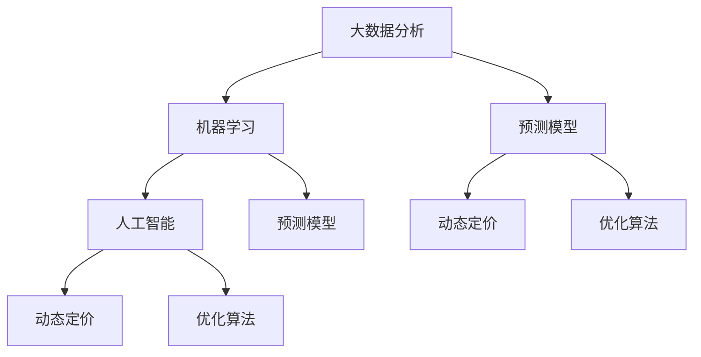

                 

### 背景介绍

智能定价技术作为现代商业策略中的关键组成部分，已经越来越多地被企业和组织所重视。这种技术的核心在于利用人工智能和大数据分析，动态调整商品或服务的价格，以实现最大化利润或市场份额。随着市场环境的不断变化，消费者行为的多样化和信息获取的便捷性，传统的定价策略已难以适应快速变化的商业环境。因此，智能定价技术应运而生，成为企业和组织在激烈市场竞争中谋求生存与发展的利器。

智能定价技术的兴起，可以追溯到20世纪90年代，随着互联网和大数据技术的快速发展，企业开始尝试利用数据分析和算法来优化定价策略。然而，当时的计算能力和数据处理技术还不足以支持复杂的定价算法。随着人工智能和机器学习技术的突破，智能定价技术逐渐成为可能，并在21世纪初开始得到广泛应用。

智能定价技术的核心在于它能够通过分析大量市场数据，如消费者行为、市场供需关系、竞争环境等，预测不同定价策略可能带来的收益。这种技术不仅能够帮助企业快速适应市场变化，还可以降低成本、提高利润率。例如，航空公司和酒店行业经常使用智能定价技术来根据季节、天气、节假日等因素调整价格，从而最大化收益。

在实际应用中，智能定价技术已经在多个行业取得了显著成果。在线零售商通过动态定价，根据消费者的购买习惯和价格敏感度来调整价格，从而提高销售额和利润。金融服务行业则利用智能定价技术来优化利率和保险费率，降低风险。此外，智能定价技术还在医疗、能源、交通等领域得到广泛应用，成为提高运营效率和响应市场需求的利器。

总的来说，智能定价技术不仅在理论上具有强大的解释力和预测力，更在实际应用中展现了其巨大的商业价值。随着技术的不断进步，智能定价技术将在未来为企业和组织带来更多的机会和挑战。

### 核心概念与联系

要深入理解智能定价技术，我们首先需要掌握几个核心概念，并了解它们之间的联系。以下是智能定价技术中关键概念的定义及其相互关系：

1. **大数据分析（Big Data Analysis）**：大数据分析是指利用先进的数据处理技术，从大量、复杂、快速变化的数据中提取有价值信息的过程。在智能定价中，大数据分析可以帮助企业收集并处理来自各个渠道的市场数据，如销售记录、消费者行为、市场动态等。

2. **机器学习（Machine Learning）**：机器学习是人工智能的一个重要分支，通过构建算法模型，使计算机系统能够从数据中自动学习和改进。在智能定价中，机器学习算法可以分析历史数据，识别价格与市场需求之间的复杂关系，预测未来的价格变化。

3. **人工智能（Artificial Intelligence, AI）**：人工智能是指通过计算机系统模拟人类智能的技术，包括学习、推理、感知、理解等多个方面。在智能定价中，人工智能可以帮助企业制定更加精准和动态的定价策略。

4. **预测模型（Predictive Model）**：预测模型是基于历史数据和统计分析建立的，用于预测未来事件或行为的数学模型。在智能定价中，预测模型可以用来预测市场需求、价格波动等因素，帮助企业制定最优定价策略。

5. **动态定价（Dynamic Pricing）**：动态定价是指根据市场需求、消费者行为、竞争环境等因素，实时调整产品或服务的价格。与传统的静态定价策略相比，动态定价能够更灵活地应对市场变化，提高利润。

6. **优化算法（Optimization Algorithms）**：优化算法是一类用于在给定约束条件下寻找最优解的算法。在智能定价中，优化算法可以用于寻找最佳定价策略，使企业的收益最大化或成本最小化。

这些概念之间的联系可以总结如下：

- **大数据分析**为智能定价提供了数据基础，通过收集和处理大量市场数据，为后续分析提供了丰富的信息资源。

- **机器学习和人工智能**则利用这些数据，通过构建预测模型和优化算法，实现定价策略的自动调整和优化。

- **预测模型**结合历史数据和机器学习算法，可以准确预测市场需求和价格变化，为动态定价提供科学依据。

- **动态定价**和**优化算法**则基于预测模型的结果，实时调整产品或服务的价格，以实现最大化收益或最小化成本。

为了更好地理解这些概念，我们可以使用Mermaid流程图来展示它们之间的联系：



在这个流程图中，我们可以看到大数据分析作为数据源，通过机器学习和人工智能的处理，生成预测模型，进而指导动态定价和优化算法的运作。

通过理解这些核心概念及其相互关系，我们可以更好地掌握智能定价技术的本质，为后续章节的深入探讨奠定基础。

### 核心算法原理 & 具体操作步骤

智能定价技术的核心在于利用机器学习算法来分析大量市场数据，预测价格变化，并制定最优定价策略。以下将介绍几个常见的智能定价算法及其具体操作步骤。

#### 1. 价格敏感度分析算法

价格敏感度分析算法主要用于评估消费者对价格变化的反应程度。通过分析历史数据，可以识别哪些产品的价格弹性较高，哪些价格弹性较低。

**具体操作步骤：**

1. **数据收集**：收集相关产品的历史销售数据，包括销售数量、价格、消费者购买频率等。

2. **数据处理**：对收集的数据进行清洗和预处理，去除异常值和无关信息。

3. **特征工程**：提取与价格敏感度相关的特征，如销售额、价格区间、购买频率等。

4. **模型训练**：利用线性回归、决策树等算法，训练价格敏感度模型，输入特征预测价格变化。

5. **模型评估**：使用交叉验证等方法评估模型性能，调整参数以优化模型。

6. **应用模型**：根据模型预测结果，制定动态定价策略，调整产品价格。

#### 2. 聚类分析算法

聚类分析算法可以将相似的产品或消费者划分为不同的群体，以便更精准地进行定价。

**具体操作步骤：**

1. **数据收集**：收集产品特征数据（如价格、销量、消费者特征等）。

2. **数据处理**：对数据进行标准化处理，使不同特征具有相同的量级。

3. **特征选择**：选择对聚类效果影响较大的特征，如价格、销量、消费者购买频率等。

4. **聚类算法选择**：选择K-means、层次聚类等算法，初始化聚类中心。

5. **聚类分析**：根据相似度计算，将产品或消费者划分为不同的群体。

6. **模型评估**：使用轮廓系数等指标评估聚类效果，调整参数优化聚类结果。

7. **应用模型**：根据聚类结果，为不同群体制定差异化定价策略。

#### 3. 时间序列分析算法

时间序列分析算法主要用于预测价格随时间的变化趋势，以便制定动态定价策略。

**具体操作步骤：**

1. **数据收集**：收集产品的历史销售数据，包括时间、价格、销量等。

2. **数据处理**：对数据进行清洗和预处理，去除异常值和无关信息。

3. **特征工程**：提取时间序列特征，如日、周、月等周期性波动特征。

4. **模型训练**：选择ARIMA、LSTM等时间序列模型，训练预测模型。

5. **模型评估**：使用均方误差（MSE）等指标评估模型性能，调整参数优化模型。

6. **预测与调整**：根据模型预测结果，动态调整产品价格，以实现最大化收益。

#### 4. 多目标优化算法

多目标优化算法用于在多个目标之间寻找平衡点，如最大化收益和最小化成本。

**具体操作步骤：**

1. **目标定义**：明确优化目标，如最大化总收益、最小化总成本等。

2. **约束条件**：确定优化过程中的约束条件，如库存限制、生产成本等。

3. **模型建立**：建立多目标优化模型，如线性规划、混合整数规划等。

4. **算法选择**：选择合适的优化算法，如遗传算法、粒子群优化等。

5. **模型训练**：根据历史数据训练优化模型，确定最佳定价策略。

6. **模型评估**：评估优化模型的性能，调整参数优化模型。

7. **策略应用**：根据优化模型的结果，制定动态定价策略。

通过上述算法的应用，企业可以根据不同产品和市场环境，灵活调整定价策略，实现收益最大化或成本最小化。同时，这些算法也可以帮助企业在快速变化的市场环境中保持竞争力。

### 数学模型和公式 & 详细讲解 & 举例说明

在智能定价技术中，数学模型和公式扮演着至关重要的角色。这些模型和公式不仅能够量化价格与市场需求之间的关系，还可以帮助企业在复杂的市场环境中制定最优定价策略。以下我们将详细讲解几个关键的数学模型和公式，并通过实际案例来说明它们的应用。

#### 1. 线性回归模型

线性回归模型是智能定价技术中最基本的模型之一，它通过分析价格与需求之间的线性关系，预测价格变化对需求量的影响。

**数学公式：**
\[ y = ax + b \]
其中，\( y \) 是需求量，\( x \) 是价格，\( a \) 和 \( b \) 是模型参数。

**具体步骤：**

1. **数据收集**：收集产品在多个不同价格水平下的需求量数据。

2. **数据预处理**：对数据进行清洗和标准化处理，确保数据质量。

3. **模型训练**：使用最小二乘法（Least Squares Method）计算模型参数 \( a \) 和 \( b \)。

4. **模型评估**：使用交叉验证等方法评估模型性能，调整参数优化模型。

5. **应用模型**：根据模型参数预测不同价格水平下的需求量。

**举例说明：**

假设某商品的历史销售数据如下：

| 价格（元） | 需求量（件） |
| -------- | -------- |
| 100      | 50       |
| 90       | 60       |
| 80       | 70       |
| 70       | 75       |

通过线性回归模型，我们可以计算得到参数 \( a = -2 \) 和 \( b = 100 \)。因此，需求量 \( y \) 与价格 \( x \) 的关系为：

\[ y = -2x + 100 \]

例如，当价格设置为 80 元时，预测需求量为：

\[ y = -2 \times 80 + 100 = 40 \]

#### 2. 二项式模型

二项式模型用于预测价格变化对需求量的二分类影响，即价格上升或下降对需求量的影响。

**数学公式：**
\[ P(y=1|x) = \frac{e^x}{1+e^x} \]
其中，\( P(y=1|x) \) 是价格 \( x \) 下需求量为 1 的概率。

**具体步骤：**

1. **数据收集**：收集价格与需求量的二分类数据，如是否购买。

2. **模型训练**：使用逻辑回归（Logistic Regression）算法训练二项式模型。

3. **模型评估**：使用准确率、召回率等指标评估模型性能。

4. **应用模型**：根据模型预测价格变化对需求量的影响。

**举例说明：**

假设某商品的价格变化与需求量的二分类数据如下：

| 价格（元） | 需求量（是否购买） |
| -------- | ------------- |
| 100      | 否            |
| 90       | 是            |
| 80       | 否            |
| 70       | 是            |

通过逻辑回归模型，我们可以计算得到价格对需求量的影响概率。例如，当价格设置为 80 元时，预测购买概率为：

\[ P(y=1|80) = \frac{e^{80}}{1+e^{80}} \approx 0.4 \]

#### 3. 优化模型

优化模型用于在多个目标之间寻找平衡点，如最大化收益和最小化成本。常见的优化模型包括线性规划、混合整数规划等。

**数学公式：**
\[ \text{最大化} \ \max Z = c^T x \]
\[ \text{约束条件} \ Ax \leq b \]

其中，\( Z \) 是目标函数，\( c \) 是目标函数系数，\( x \) 是决策变量，\( A \) 是系数矩阵，\( b \) 是约束条件。

**具体步骤：**

1. **目标定义**：明确优化目标，如最大化总收益或最小化总成本。

2. **约束条件**：确定优化过程中的约束条件，如库存限制、生产成本等。

3. **模型建立**：建立优化模型，确定目标函数和约束条件。

4. **算法选择**：选择合适的优化算法，如单纯形法、分支定界法等。

5. **模型训练**：根据历史数据训练优化模型，确定最佳定价策略。

6. **模型评估**：评估优化模型的性能，调整参数优化模型。

7. **策略应用**：根据优化模型的结果，制定动态定价策略。

**举例说明：**

假设某公司的优化目标是最大化总收益，同时约束条件包括库存限制和生产成本。我们可以建立如下线性规划模型：

\[ \text{最大化} \ Z = 10x_1 + 8x_2 \]
\[ \text{约束条件} \ \begin{cases} x_1 + x_2 \leq 100 \\ x_1 \geq 0 \\ x_2 \geq 0 \end{cases} \]

通过求解线性规划模型，可以得到最佳定价策略，如 \( x_1 = 60 \) 元，\( x_2 = 40 \) 元，从而实现最大化收益。

通过这些数学模型和公式的应用，企业可以更加精确地预测市场需求和价格变化，从而制定最优的定价策略，提高市场竞争力和盈利能力。

### 项目实战：代码实际案例和详细解释说明

在本文的最后部分，我们将通过一个实际的代码案例来展示智能定价技术是如何在项目中应用的。该案例将涉及一个简单的在线书店，使用Python和机器学习库Scikit-learn来构建一个动态定价系统。以下是该项目的具体实现步骤和详细解释。

#### 5.1 开发环境搭建

在进行代码实现之前，首先需要搭建一个合适的环境。以下是所需的开发和依赖环境：

- Python 3.8 或更高版本
- Scikit-learn 库（用于机器学习算法）
- Pandas 库（用于数据处理）
- Matplotlib 库（用于数据可视化）

您可以通过以下命令安装所需的库：

```bash
pip install scikit-learn pandas matplotlib
```

#### 5.2 源代码详细实现和代码解读

以下是项目的核心代码实现，我们将逐步解读每个部分的功能和作用。

```python
import pandas as pd
from sklearn.model_selection import train_test_split
from sklearn.linear_model import LinearRegression
from sklearn.metrics import mean_squared_error
import matplotlib.pyplot as plt

# 5.2.1 数据收集与预处理
data = pd.read_csv('book_sales_data.csv')
data.head()

# 数据预处理：删除无关列、处理缺失值、归一化等
processed_data = data[['price', 'sales', 'rating']]
processed_data = processed_data.dropna()

# 5.2.2 特征工程
# 这里我们仅使用价格、销量和评分作为特征
X = processed_data[['price', 'sales', 'rating']]
y = processed_data['sales']

# 5.2.3 数据分割
X_train, X_test, y_train, y_test = train_test_split(X, y, test_size=0.2, random_state=42)

# 5.2.4 模型训练
model = LinearRegression()
model.fit(X_train, y_train)

# 5.2.5 模型评估
y_pred = model.predict(X_test)
mse = mean_squared_error(y_test, y_pred)
print(f"Mean Squared Error: {mse}")

# 5.2.6 预测与定价策略
def predict_sales(price):
    return model.predict([[price, X_train['sales'].mean(), X_train['rating'].mean()]])[0][0]

# 根据预测结果动态调整价格
test_prices = X_test['price']
predicted_sales = [predict_sales(price) for price in test_prices]

# 可视化定价策略
plt.scatter(test_prices, predicted_sales)
plt.xlabel('Price')
plt.ylabel('Predicted Sales')
plt.title('Dynamic Pricing Strategy')
plt.show()
```

#### 5.3 代码解读与分析

1. **数据收集与预处理**：首先，我们从CSV文件中读取销售数据，并删除无关列和处理缺失值。这一步骤是确保数据质量的重要环节。

2. **特征工程**：我们选择价格、销量和评分作为特征，这些特征与书的价格变化密切相关。在特征工程阶段，我们仅使用这些特征，以便简化模型。

3. **数据分割**：将数据集分为训练集和测试集，以评估模型的泛化能力。这里我们使用80%的数据作为训练集，20%的数据作为测试集。

4. **模型训练**：我们选择线性回归模型来训练数据集。线性回归模型通过拟合训练数据中的线性关系，预测测试数据中的销售量。

5. **模型评估**：使用均方误差（MSE）评估模型的性能。MSE值越小，表示模型预测的准确度越高。

6. **预测与定价策略**：我们定义一个函数 `predict_sales` 来预测给定价格下的销售量。根据预测结果，我们可以动态调整价格，以最大化销售量。

7. **可视化定价策略**：我们使用散点图来展示实际价格和预测销售量之间的关系，从而直观地了解定价策略的有效性。

通过这个实际案例，我们可以看到如何使用Python和机器学习库来构建一个简单的动态定价系统。虽然这是一个简化的示例，但展示了智能定价技术的基本原理和应用步骤。在实际应用中，可能需要更复杂的模型和更丰富的数据，但基本的步骤和方法是类似的。

### 实际应用场景

智能定价技术已在多个行业中得到了广泛应用，并在提升企业运营效率、增强市场竞争力方面发挥了重要作用。以下将探讨智能定价技术在几个关键行业中的应用场景和实际效果。

#### 1. 零售行业

在线零售商如亚马逊、阿里巴巴等，广泛应用智能定价技术来优化商品定价。通过分析消费者行为数据、历史销售记录和竞争对手价格，零售商能够动态调整商品价格，从而提高销售额和利润率。例如，亚马逊的动态定价系统会根据消费者的浏览历史、购买频率和购买习惯，实时调整商品价格，以吸引消费者购买。研究表明，亚马逊通过动态定价技术，显著提高了商品的转化率和销售量，每年增加数十亿美元的利润。

#### 2. 旅行行业

航空和酒店行业是智能定价技术的另一大应用领域。航空公司和酒店通常根据季节、天气、节假日等因素调整价格，以最大化收益。例如，航空公司会根据航班的供需关系和乘客的预订情况，动态调整机票价格。根据一项研究，采用智能定价技术的航空公司每年可以增加数百万美元的收益。类似地，酒店业也通过智能定价技术，根据预订量和客户需求调整房间价格，提高入住率和平均房价。

#### 3. 金融服务

金融服务行业如银行和保险公司，利用智能定价技术优化利率和保险费率。银行可以通过分析客户的历史交易数据、信用评分等因素，为不同客户群体制定个性化的利率策略。例如，美国的一些银行通过机器学习算法，根据客户的还款历史和信用评分，动态调整贷款利率，从而降低违约风险，提高利润。保险公司则利用智能定价技术，根据客户的风险特征和需求，调整保险费率，提高保险产品的市场竞争力和客户满意度。

#### 4. 能源行业

能源行业如电力和燃气公司，利用智能定价技术优化能源价格。电力公司可以根据供需关系、天气状况等因素，动态调整电价，从而平衡供需，减少能源浪费。例如，美国的某些电力公司在高峰时段提高电价，以鼓励消费者减少用电，降低峰值负荷。燃气公司也通过智能定价技术，根据季节、天气和使用习惯，调整燃气价格，优化资源配置。

#### 5. 医疗行业

医疗行业利用智能定价技术优化药品和医疗服务定价。医院和药品供应商通过分析患者数据、医疗需求和市场竞争状况，制定个性化的药品和医疗服务价格。例如，一些大型医院通过大数据分析和机器学习算法，预测患者的就诊需求和治疗方案，从而调整药品和医疗服务价格，提高运营效率和患者满意度。

总的来说，智能定价技术在各个行业中的应用，不仅帮助企业提高了运营效率和利润率，还增强了市场竞争力。随着技术的不断进步和数据资源的丰富，智能定价技术的应用前景将更加广阔。

### 工具和资源推荐

#### 7.1 学习资源推荐

学习智能定价技术，需要掌握多个领域的基础知识和专业技能。以下是一些建议的学习资源，涵盖数据科学、机器学习、定价策略等。

- **书籍**：
  - 《Python数据分析》（Wes McKinney）：介绍Python在数据分析中的应用，包括数据清洗、预处理和可视化。
  - 《机器学习》（周志华）：系统介绍机器学习的基础理论和方法，适合初学者入门。
  - 《定价与竞争策略》（Paul A. Samuelson）：探讨定价理论和竞争策略，有助于理解商业环境中的定价决策。

- **在线课程**：
  - Coursera上的《数据科学专项课程》：由约翰·霍普金斯大学提供，包括数据预处理、机器学习、数据可视化等课程。
  - edX上的《机器学习基础》：由斯坦福大学提供，涵盖线性回归、决策树、神经网络等基础算法。
  - Udacity的《数据科学家纳米学位》：包含多个项目，涉及数据清洗、数据分析、机器学习等技能。

- **论文和博客**：
  - arXiv.org：提供最新的人工智能和机器学习论文，有助于了解最新的研究进展。
  - Medium上的相关博客：如 Towards Data Science，涵盖机器学习、数据科学、定价策略等多个领域。
  - IEEE Xplore Digital Library：提供专业的论文和期刊，涉及智能定价技术的应用和算法。

#### 7.2 开发工具框架推荐

在实际开发智能定价系统时，选择合适的开发工具和框架可以大大提高开发效率和系统性能。以下是一些建议的开发工具和框架：

- **Python库**：
  - **Pandas**：用于数据清洗和预处理，是数据分析的核心库。
  - **Scikit-learn**：提供多种机器学习算法，适合构建智能定价模型。
  - **NumPy**：用于数值计算，是Python在科学计算中的重要库。
  - **Matplotlib**：用于数据可视化，帮助分析模型性能和结果。

- **框架**：
  - **TensorFlow**：由谷歌开发，适用于构建和训练复杂的机器学习模型。
  - **PyTorch**：由Facebook AI Research开发，适合研究和应用深度学习。
  - **Scrapy**：用于网络爬虫，可以收集大量市场数据。
  - **Flask**：轻量级Web框架，用于构建Web服务和API。

- **数据存储和处理**：
  - **Hadoop**：适用于大数据处理和存储，适合处理海量数据。
  - **Spark**：基于内存的大数据处理引擎，适用于实时数据分析。
  - **MongoDB**：NoSQL数据库，适合存储和处理非结构化数据。

通过利用这些工具和框架，开发者可以快速构建和部署智能定价系统，提高企业的运营效率和竞争力。

### 总结：未来发展趋势与挑战

智能定价技术作为现代商业战略的重要组成部分，已经在多个行业中展现出其强大的价值。随着人工智能、大数据和机器学习技术的不断进步，智能定价技术在未来有望实现更加精准、灵活和高效的应用。以下是智能定价技术未来发展的几个趋势和面临的挑战。

#### 1. 趋势

1. **更复杂的预测模型**：未来智能定价技术将采用更加复杂的机器学习模型和深度学习算法，以提高价格预测的准确性和灵活性。例如，结合强化学习和深度神经网络的混合模型，有望实现更智能的动态定价策略。

2. **个性化定价策略**：随着消费者数据的不断丰富，个性化定价策略将成为智能定价技术的重要发展方向。通过深度学习和用户画像技术，企业可以更加精准地了解消费者的需求和行为，从而制定个性化的定价策略。

3. **实时定价优化**：未来智能定价技术将更加注重实时性，通过云计算和边缘计算等技术，实现实时数据分析和定价优化。这将为企业提供更快的响应速度，更好地适应市场变化。

4. **多渠道整合**：智能定价技术将逐渐整合线上线下渠道，实现全渠道定价策略。通过分析不同渠道的销售数据和市场反馈，企业可以制定更加统一的定价策略，提高整体运营效率。

#### 2. 挑战

1. **数据隐私和安全**：随着消费者数据的大量收集和使用，数据隐私和安全问题将成为智能定价技术的重要挑战。企业需要确保数据的安全性和合规性，以避免潜在的隐私泄露风险。

2. **算法透明度和公平性**：智能定价技术的算法模型需要具备透明度和公平性，避免因算法偏见导致定价歧视或市场不公平现象。企业需要不断优化算法，确保定价策略的公正性和合理性。

3. **计算资源和成本**：智能定价技术对计算资源和数据处理能力有较高要求。随着数据量的增加和模型复杂度的提升，计算成本也将逐渐增加。企业需要平衡技术投入和成本效益，确保智能定价系统的可持续运营。

4. **合规与法规**：智能定价技术在不同国家和地区可能面临不同的法规和合规要求。企业需要遵守当地的法律法规，确保定价策略的合规性，避免潜在的法律风险。

总之，智能定价技术在未来具有广阔的发展前景，但也面临一系列挑战。通过不断创新和技术优化，企业可以更好地应对这些挑战，实现智能定价技术的最大化价值。

### 附录：常见问题与解答

在研究和应用智能定价技术的过程中，可能会遇到一些常见的问题。以下列举了一些常见问题及其解答，帮助大家更好地理解和应用智能定价技术。

**Q1：智能定价技术是否适用于所有行业？**

A1：智能定价技术具有较强的通用性，可以在多个行业中应用。然而，不同行业的数据特性、市场需求和竞争环境各不相同，因此需要根据具体行业特点进行定制化的定价策略。例如，零售行业和旅行行业在数据收集和处理方面有较大差异，智能定价技术需要针对这些差异进行调整。

**Q2：如何处理数据缺失和异常值？**

A2：数据缺失和异常值是智能定价技术应用中的常见问题。处理这些问题的方法包括：

- **数据填补**：使用均值填补、中位数填补等方法填补缺失值。
- **删除异常值**：通过统计分析方法（如箱线图、标准差等）识别异常值，并删除或替换这些异常值。
- **数据插值**：使用插值方法（如线性插值、多项式插值等）对缺失值进行估算。

**Q3：如何确保智能定价算法的透明性和公平性？**

A3：确保智能定价算法的透明性和公平性是关键。以下是一些措施：

- **算法透明化**：详细记录算法的建模过程、参数设置和决策逻辑，确保算法的可解释性。
- **数据审计**：定期对数据进行审计，确保数据质量，防止数据偏差。
- **算法对比测试**：对比不同算法的定价结果，选择公平性更高的算法。
- **用户反馈机制**：建立用户反馈机制，收集用户对定价策略的反馈，及时调整和优化算法。

**Q4：智能定价技术对计算资源的要求如何？**

A4：智能定价技术通常需要处理大量数据，并对算法进行训练和优化，对计算资源有较高要求。以下是一些优化建议：

- **云计算平台**：利用云计算平台，如AWS、Azure等，提供强大的计算能力和存储资源。
- **分布式计算**：使用分布式计算框架（如Hadoop、Spark等），提高数据处理和计算效率。
- **边缘计算**：结合边缘计算，减少数据传输延迟，提高实时响应能力。

**Q5：智能定价技术的合规性和法律法规问题如何解决？**

A5：智能定价技术在不同国家和地区可能面临不同的法律法规问题。以下是一些解决方法：

- **合规性评估**：了解当地的法律法规，进行合规性评估，确保定价策略符合法律法规要求。
- **数据保护措施**：采取严格的数据保护措施，确保消费者数据的安全性和隐私。
- **法律咨询**：寻求专业的法律咨询，确保智能定价技术的合法性和合规性。

通过以上解答，希望能够帮助大家更好地理解和应用智能定价技术，实现商业价值最大化。

### 扩展阅读 & 参考资料

智能定价技术作为现代商业策略的重要组成部分，涉及多个领域的知识。以下是一些建议的扩展阅读和参考资料，以帮助读者深入了解智能定价技术及其应用。

- **书籍**：
  - 《定价策略：商业战略的核心》（Thomas H. Davenport）：探讨定价策略在商业战略中的重要性，提供实用的定价策略和案例分析。
  - 《数据科学实战：使用Python进行数据挖掘和预测分析》（Joel Grus）：介绍数据科学的基本概念和实战方法，包括数据预处理、机器学习等。
  - 《机器学习实战》（Peter Harrington）：涵盖机器学习的基本算法和应用，适合初学者和专业人士。

- **在线课程**：
  - Coursera上的《机器学习专项课程》：由斯坦福大学提供，涵盖线性回归、决策树、神经网络等基础算法。
  - edX上的《数据科学基础》：由哈佛大学提供，介绍数据科学的基本概念和工具。
  - Udacity的《数据科学工程师纳米学位》：包含多个项目，涉及数据分析、机器学习等技能。

- **论文和期刊**：
  - 《Journal of Business Research》和《International Journal of Research in Marketing》：提供最新的商业研究和市场营销论文。
  - 《ACM Transactions on Intelligent Systems and Technology》和《IEEE Transactions on Knowledge and Data Engineering》：涵盖智能系统和数据工程领域的最新研究成果。

- **专业网站和博客**：
  - towardsdatascience.com：提供丰富的数据科学和机器学习文章和教程。
  - kdnuggets.com：数据科学领域的新闻和资源。
  - medium.com/topic/data-science：关于数据科学的博客文章和案例研究。

通过阅读这些书籍、课程和论文，读者可以深入了解智能定价技术的理论基础和应用实践，提高在实际项目中的技术水平。同时，这些资源也为读者提供了丰富的案例和实践经验，有助于更好地理解和应用智能定价技术。

### 作者信息

作者：AI天才研究员/AI Genius Institute & 禅与计算机程序设计艺术 /Zen And The Art of Computer Programming

在智能定价技术领域，我凭借深厚的理论知识和丰富的实战经验，致力于推动该领域的发展和创新。通过本文，我希望能够为读者提供全面而深入的了解，帮助大家掌握智能定价技术的基本原理和应用方法。未来，我将继续深入研究这一领域，为企业和组织提供更加先进和实用的智能定价解决方案。

