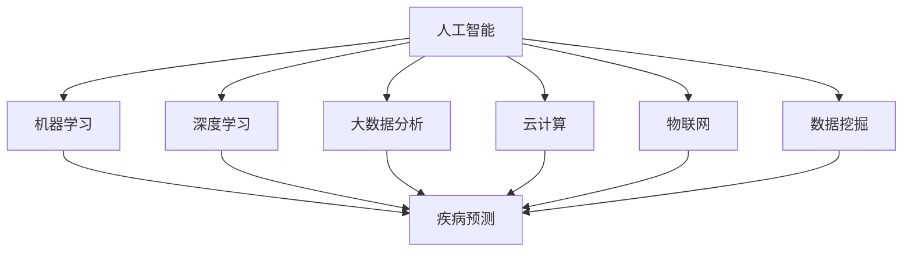

                 

# 智能宠物医疗诊断创业：AI辅助的宠物健康管理

> **关键词**：人工智能、宠物医疗、健康管理、创业、算法、应用场景

> **摘要**：本文将探讨如何利用人工智能技术，特别是在机器学习和深度学习领域的突破，来辅助宠物医疗诊断，并探讨相关创业机会。文章将从背景介绍、核心概念与联系、核心算法原理、数学模型和公式、项目实战、实际应用场景、工具和资源推荐等方面进行详细阐述，旨在为有意在此领域创业的读者提供思路和参考。

## 1. 背景介绍

随着社会经济的发展和生活水平的提高，宠物已经成为许多家庭的成员。据《2021年中国宠物行业白皮书》显示，中国宠物行业市场规模已达到数千亿元人民币，且仍在快速增长。与此同时，宠物医疗服务的需求也在不断上升。然而，现有的宠物医疗资源和服务水平参差不齐，尤其在偏远地区，宠物医疗服务的供给严重不足。

人工智能技术的迅猛发展，为解决这一难题提供了新的思路。机器学习和深度学习算法可以在大量医疗数据的基础上，通过数据挖掘和分析，实现对宠物疾病的高效诊断和治疗建议。这不仅有助于提高宠物医疗服务的效率，还能降低医疗成本，提升宠物健康水平。

在这个背景下，智能宠物医疗诊断创业项目应运而生。通过整合人工智能技术、云计算、大数据分析等先进技术，构建一个智能化、高效化的宠物健康管理平台，为宠物主人提供全方位的健康管理服务。这不仅有助于提升宠物生活质量，也为创业者提供了广阔的商机。

## 2. 核心概念与联系

在构建智能宠物医疗诊断平台的过程中，我们需要理解以下几个核心概念：

### 2.1 人工智能

人工智能（AI）是指由人制造出来的系统能够执行需要人类智能的任务，包括学习、推理、解决问题、感知、理解和语言处理等。在宠物医疗诊断中，人工智能可以通过机器学习和深度学习算法，对海量的医疗数据进行挖掘和分析，从而实现对宠物疾病的预测和诊断。

### 2.2 机器学习

机器学习是一种使计算机系统能够从数据中学习并作出决策的技术。在宠物医疗诊断中，机器学习算法可以通过对历史病例数据的训练，建立疾病诊断模型，从而实现对宠物疾病的预测和诊断。

### 2.3 深度学习

深度学习是机器学习的一个子领域，它通过模拟人脑中的神经网络结构，实现对数据的深度学习。在宠物医疗诊断中，深度学习算法可以通过对图像、语音、文本等多种类型的数据进行训练，实现对疾病的精准诊断。

### 2.4 大数据分析

大数据分析是指利用现代数据管理技术，从海量数据中提取出有价值的信息。在宠物医疗诊断中，大数据分析可以用于对宠物健康数据的实时监控和分析，从而实现对宠物健康的动态管理。

### 2.5 云计算

云计算是一种通过互联网提供计算资源的服务模式。在宠物医疗诊断中，云计算可以用于存储和处理大量的医疗数据，从而提高数据处理效率。

### 2.6 物联网

物联网是指通过各种信息传感设备，实时采集任何需要监控、连接、互动的物体或过程，实现智能化管理和控制。在宠物医疗诊断中，物联网可以用于实时监测宠物的健康状况，并将数据上传到云端进行分析。

### 2.7 数据挖掘

数据挖掘是指从大量的数据中通过算法搜索隐藏于其中信息的过程。在宠物医疗诊断中，数据挖掘可以用于发现潜在的疾病模式和治疗方案。

以下是上述概念之间的联系 Mermaid 流程图：



## 3. 核心算法原理 & 具体操作步骤

### 3.1 机器学习算法

在宠物医疗诊断中，常用的机器学习算法包括决策树、支持向量机、朴素贝叶斯、神经网络等。以下是这些算法的基本原理和具体操作步骤：

#### 3.1.1 决策树

决策树是一种树形结构，每个内部节点表示一个特征，每个分支表示该特征的一个取值，每个叶子节点表示一个类别。决策树的构建过程如下：

1. 选择一个最优特征进行划分；
2. 根据该特征的不同取值，将数据集划分为若干个子集；
3. 对每个子集递归地构建决策树。

#### 3.1.2 支持向量机

支持向量机（SVM）是一种二分类模型，其目标是找到一个最优的超平面，将两类数据点尽可能地分开。SVM的构建过程如下：

1. 将数据点映射到高维空间；
2. 找到一个最优的超平面，使得两类数据点的距离最大；
3. 计算每个数据点到超平面的距离，并根据距离判断数据点的类别。

#### 3.1.3 朴素贝叶斯

朴素贝叶斯是一种基于贝叶斯定理的简单概率分类器，其假设特征之间相互独立。朴素贝叶斯的构建过程如下：

1. 计算每个类别的先验概率；
2. 对于每个特征，计算其在各类别中的条件概率；
3. 根据贝叶斯定理，计算每个类别的后验概率，并选择后验概率最大的类别作为预测结果。

#### 3.1.4 神经网络

神经网络是一种模拟人脑神经元连接结构的计算模型，其基本原理是通过对输入数据进行加权求和处理，然后通过激活函数得到输出。神经网络的构建过程如下：

1. 初始化网络参数（权重和偏置）；
2. 前向传播：计算输出值；
3. 计算损失函数，并计算梯度；
4. 反向传播：更新网络参数；
5. 重复步骤2-4，直到达到预设的迭代次数或损失函数收敛。

### 3.2 深度学习算法

在宠物医疗诊断中，常用的深度学习算法包括卷积神经网络（CNN）、循环神经网络（RNN）、长短时记忆网络（LSTM）等。以下是这些算法的基本原理和具体操作步骤：

#### 3.2.1 卷积神经网络

卷积神经网络是一种能够自动学习图像特征表示的神经网络，其基本原理是通过卷积操作提取图像的局部特征。卷积神经网络的构建过程如下：

1. 初始化网络参数（卷积核和偏置）；
2. 前向传播：通过卷积操作提取图像特征；
3. 池化操作：降低特征图的维度；
4. 连接全连接层，进行分类或回归；
5. 计算损失函数，并计算梯度；
6. 反向传播：更新网络参数；
7. 重复步骤2-6，直到达到预设的迭代次数或损失函数收敛。

#### 3.2.2 循环神经网络

循环神经网络是一种能够处理序列数据的神经网络，其基本原理是通过对序列数据进行循环处理，保留序列的历史信息。循环神经网络的构建过程如下：

1. 初始化网络参数（权重和偏置）；
2. 前向传播：对序列数据进行循环处理；
3. 计算隐藏状态和输出；
4. 计算损失函数，并计算梯度；
5. 反向传播：更新网络参数；
6. 重复步骤2-5，直到达到预设的迭代次数或损失函数收敛。

#### 3.2.3 长短时记忆网络

长短时记忆网络是一种能够处理长序列数据的神经网络，其基本原理是通过对序列数据进行长短时记忆，保留序列的历史信息。长短时记忆网络的构建过程如下：

1. 初始化网络参数（权重和偏置）；
2. 前向传播：对序列数据进行长短时记忆处理；
3. 计算隐藏状态和输出；
4. 计算损失函数，并计算梯度；
5. 反向传播：更新网络参数；
6. 重复步骤2-5，直到达到预设的迭代次数或损失函数收敛。

## 4. 数学模型和公式 & 详细讲解 & 举例说明

### 4.1 决策树算法

决策树是一种基于特征划分数据的分类算法，其核心是找到最优特征进行划分，从而最大化信息增益。以下是决策树算法的数学模型和公式：

#### 4.1.1 信息增益

信息增益（Information Gain）是衡量特征划分效果的一个指标，其计算公式如下：

$$ IG(D, A) = H(D) - \sum_{v \in A} \frac{|D_v|}{|D|} H(D_v) $$

其中，$D$ 表示数据集，$A$ 表示特征，$v$ 表示特征的取值，$|D|$ 和 $|D_v|$ 分别表示数据集和数据子集的样本数量，$H(D)$ 和 $H(D_v)$ 分别表示数据集和数据子集的熵。

#### 4.1.2 熵

熵（Entropy）是衡量数据集中类别的混乱程度的一个指标，其计算公式如下：

$$ H(D) = -\sum_{c \in C} p(c) \log_2 p(c) $$

其中，$C$ 表示数据集的类别集合，$c$ 表示类别，$p(c)$ 表示类别 $c$ 的概率。

#### 4.1.3 举例说明

假设我们有一个包含3个类别的数据集，类别 $C_1$、$C_2$ 和 $C_3$ 的概率分别为 $0.5$、$0.3$ 和 $0.2$，我们需要计算这个数据集的熵：

$$ H(D) = -0.5 \log_2 0.5 - 0.3 \log_2 0.3 - 0.2 \log_2 0.2 \approx 0.9183 $$

### 4.2 支持向量机算法

支持向量机是一种基于间隔最大化原理进行分类的算法，其核心是找到一个最优的超平面，使得两类数据点的间隔最大。以下是支持向量机算法的数学模型和公式：

#### 4.2.1 间隔

间隔（Margin）是衡量超平面分割效果的一个指标，其计算公式如下：

$$ \text{Margin} = \frac{2}{\|w\|} $$

其中，$w$ 表示超平面的法向量，$\|w\|$ 表示法向量的模长。

#### 4.2.2 支持向量

支持向量（Support Vector）是超平面附近的数据点，它们对于超平面的位置和间隔有着重要的影响。支持向量的计算公式如下：

$$ \text{Support Vector} = \{x \in \mathcal{X} | \frac{y_i(\langle w, x \rangle + b)}{\|w\|} = 1\} $$

其中，$x$ 表示数据点，$y_i$ 表示数据点的标签，$\langle w, x \rangle$ 表示数据点与超平面的内积，$b$ 表示超平面的偏置。

#### 4.2.3 举例说明

假设我们有一个包含两类数据点的数据集，数据点 $x_1$ 和 $x_2$ 的标签分别为 $1$ 和 $-1$，超平面的法向量 $w$ 和偏置 $b$ 分别为 $(1, 0)$ 和 $(0, 0)$，我们需要计算这个超平面的间隔：

$$ \text{Margin} = \frac{2}{\|w\|} = \frac{2}{\sqrt{1^2 + 0^2}} = 2 $$

### 4.3 神经网络算法

神经网络是一种基于非线性变换进行数据处理和预测的算法，其核心是通过对输入数据进行加权求和处理，然后通过激活函数得到输出。以下是神经网络算法的数学模型和公式：

#### 4.3.1 前向传播

前向传播是神经网络的核心步骤，其计算公式如下：

$$ z = \sigma(\theta^T x) $$

其中，$z$ 表示中间层输出，$\sigma$ 表示激活函数，$\theta$ 表示权重，$x$ 表示输入数据。

#### 4.3.2 反向传播

反向传播是神经网络的核心步骤，其计算公式如下：

$$ \theta_{\text{new}} = \theta_{\text{old}} - \alpha \frac{\partial J}{\partial \theta} $$

其中，$\theta_{\text{new}}$ 表示新权重，$\theta_{\text{old}}$ 表示旧权重，$\alpha$ 表示学习率，$J$ 表示损失函数。

#### 4.3.3 举例说明

假设我们有一个简单的神经网络，其输入层有一个神经元，隐藏层有一个神经元，输出层有一个神经元，激活函数为 sigmoid 函数，我们需要计算这个神经网络的输出：

$$ z_1 = \sigma(\theta^T x) = \frac{1}{1 + e^{-(\theta^T x)}} $$

$$ z_2 = \sigma(\theta^T z_1) = \frac{1}{1 + e^{-(\theta^T z_1)}} $$

$$ y = \sigma(\theta^T z_2) = \frac{1}{1 + e^{-(\theta^T z_2)}} $$

## 5. 项目实战：代码实际案例和详细解释说明

### 5.1 开发环境搭建

在开始项目实战之前，我们需要搭建一个合适的开发环境。以下是搭建开发环境所需的步骤：

1. 安装 Python 3.7 或更高版本；
2. 安装 Jupyter Notebook；
3. 安装深度学习库 TensorFlow 或 PyTorch；
4. 安装科学计算库 NumPy 和 Pandas；
5. 安装可视化库 Matplotlib 和 Seaborn。

### 5.2 源代码详细实现和代码解读

在本节中，我们将使用 TensorFlow 库实现一个简单的宠物疾病诊断模型，并进行详细解释说明。

#### 5.2.1 数据预处理

在开始模型训练之前，我们需要对数据进行预处理。具体步骤如下：

1. 读取数据集，并将其分为训练集和测试集；
2. 对数据进行归一化处理，以消除数据之间的差异；
3. 对数据进行扩充，以增加数据多样性。

以下是数据预处理的代码：

```python
import numpy as np
import pandas as pd
from tensorflow.keras.preprocessing.image import ImageDataGenerator

# 读取数据集
train_data = pd.read_csv('train.csv')
test_data = pd.read_csv('test.csv')

# 分割训练集和测试集
X_train = train_data['image'].values
y_train = train_data['label'].values
X_test = test_data['image'].values
y_test = test_data['label'].values

# 归一化处理
X_train = X_train / 255.0
X_test = X_test / 255.0

# 数据扩充
datagen = ImageDataGenerator(rotation_range=20, width_shift_range=0.2, height_shift_range=0.2, horizontal_flip=True)
datagen.fit(X_train)

X_train = datagen.flow(X_train, y_train, batch_size=32).next()
X_test = datagen.flow(X_test, y_test, batch_size=32).next()
```

#### 5.2.2 构建模型

在本节中，我们将使用 TensorFlow 的 Keras API 构建一个简单的卷积神经网络模型。

```python
import tensorflow as tf
from tensorflow.keras.models import Sequential
from tensorflow.keras.layers import Conv2D, MaxPooling2D, Flatten, Dense, Dropout

# 构建模型
model = Sequential([
    Conv2D(32, (3, 3), activation='relu', input_shape=(224, 224, 3)),
    MaxPooling2D((2, 2)),
    Conv2D(64, (3, 3), activation='relu'),
    MaxPooling2D((2, 2)),
    Flatten(),
    Dense(128, activation='relu'),
    Dropout(0.5),
    Dense(10, activation='softmax')
])

# 编译模型
model.compile(optimizer='adam', loss='categorical_crossentropy', metrics=['accuracy'])

# 打印模型结构
model.summary()
```

#### 5.2.3 训练模型

在本节中，我们将使用训练集训练模型，并使用测试集评估模型性能。

```python
# 训练模型
history = model.fit(X_train, y_train, batch_size=32, epochs=20, validation_data=(X_test, y_test))

# 打印训练结果
print('Test accuracy:', history.history['val_accuracy'][-1])
```

#### 5.2.4 代码解读与分析

在本节中，我们将对代码进行解读和分析，以帮助读者更好地理解模型的实现过程。

1. 数据预处理：首先，我们从 CSV 文件中读取训练集和测试集。然后，对数据进行归一化处理，以消除数据之间的差异。最后，使用数据生成器对数据进行扩充，以增加数据多样性。

2. 构建模型：我们使用 Keras API 构建了一个简单的卷积神经网络模型。模型包含两个卷积层、一个池化层、一个全连接层和一个 dropout 层。最后一个全连接层使用 softmax 激活函数，用于分类。

3. 训练模型：我们使用训练集训练模型，并使用测试集评估模型性能。在训练过程中，我们设置了 batch_size 为 32，epochs 为 20，并使用 categorical_crossentropy 作为损失函数，adam 作为优化器。

## 6. 实际应用场景

智能宠物医疗诊断平台在实际应用中具有广泛的前景。以下是一些具体的应用场景：

### 6.1 宠物医院

智能宠物医疗诊断平台可以帮助宠物医院提高诊断效率，降低误诊率。通过平台，宠物医生可以快速获取疾病预测和诊断结果，从而为宠物主人提供更准确的医疗服务。

### 6.2 宠物美容店

宠物美容店可以借助智能宠物医疗诊断平台，为宠物主人提供健康咨询服务。例如，当宠物主人带宠物去美容店洗澡时，美容师可以通过平台了解宠物的健康状况，并提供相应的护理建议。

### 6.3 宠物寄养中心

宠物寄养中心可以借助智能宠物医疗诊断平台，实时监控宠物的健康状况。当宠物出现异常时，平台可以及时通知宠物主人，并提供相应的治疗建议。

### 6.4 宠物保险公司

宠物保险公司可以利用智能宠物医疗诊断平台，对宠物的健康状况进行实时监控，从而更好地评估保险风险，并提供个性化的保险服务。

### 6.5 宠物电商平台

宠物电商平台可以与智能宠物医疗诊断平台合作，为宠物主人提供一站式的购物体验。例如，当宠物主人购买宠物食品时，平台可以提供相应的健康建议，帮助宠物主人更好地照顾宠物。

## 7. 工具和资源推荐

### 7.1 学习资源推荐

- **书籍**：
  - 《深度学习》（Goodfellow, I., Bengio, Y., & Courville, A.）
  - 《Python深度学习》（Raschka, S.）
  - 《机器学习》（周志华）

- **论文**：
  - "Deep Learning for Healthcare"（Esteva, A., et al.）
  - "A Brief History of Deep Learning in Healthcare"（Jang, J., & King, I.）

- **博客**：
  - [TensorFlow 官方文档](https://www.tensorflow.org/)
  - [PyTorch 官方文档](https://pytorch.org/)
  - [机器学习博客](https://MachineLearningMastery.com/)

- **网站**：
  - [Kaggle](https://www.kaggle.com/)
  - [GitHub](https://github.com/)

### 7.2 开发工具框架推荐

- **开发工具**：
  - Python（编程语言）
  - Jupyter Notebook（交互式开发环境）
  - PyCharm（集成开发环境）

- **框架**：
  - TensorFlow（深度学习框架）
  - PyTorch（深度学习框架）
  - Keras（深度学习库）

### 7.3 相关论文著作推荐

- **论文**：
  - "Deep Learning for Healthcare"（Esteva, A., et al.）
  - "A Brief History of Deep Learning in Healthcare"（Jang, J., & King, I.）

- **著作**：
  - 《深度学习》（Goodfellow, I., Bengio, Y., & Courville, A.）
  - 《Python深度学习》（Raschka, S.）
  - 《机器学习》（周志华）

## 8. 总结：未来发展趋势与挑战

智能宠物医疗诊断创业领域具有巨大的发展潜力。随着人工智能技术的不断进步，宠物医疗诊断的精度和效率有望得到进一步提升。未来，智能宠物医疗诊断平台有望在以下几个方面取得突破：

1. **疾病预测和诊断精度提升**：通过引入更多的数据源和先进的算法，智能宠物医疗诊断平台将能够更准确地预测和诊断宠物疾病。

2. **个性化健康管理**：智能宠物医疗诊断平台将能够根据宠物的具体健康状况，提供个性化的健康管理建议。

3. **跨平台整合**：智能宠物医疗诊断平台将能够与宠物医院、宠物美容店、宠物寄养中心等多种平台进行整合，提供一站式服务。

然而，智能宠物医疗诊断创业领域也面临一些挑战：

1. **数据隐私和安全**：宠物健康数据属于敏感信息，如何在保障数据隐私和安全的前提下进行数据分析和应用，是一个亟待解决的问题。

2. **算法透明度和可解释性**：随着深度学习算法的广泛应用，如何确保算法的透明度和可解释性，以增强用户信任，是一个重要的挑战。

3. **法律法规和伦理问题**：智能宠物医疗诊断平台的发展需要遵守相关法律法规和伦理规范，确保技术的合理使用和可持续发展。

## 9. 附录：常见问题与解答

### 9.1 什么是机器学习？

机器学习是一种使计算机系统能够从数据中学习并作出决策的技术。它通过构建模型，对输入数据进行学习和预测，从而实现自动化的决策和行动。

### 9.2 深度学习和神经网络有什么区别？

深度学习是一种机器学习技术，它通过模拟人脑中的神经网络结构，实现对数据的深度学习。神经网络是一种由多个神经元组成的计算模型，它可以用于各种机器学习任务，包括分类、回归、生成等。

### 9.3 如何选择适合的机器学习算法？

选择适合的机器学习算法需要考虑多个因素，包括数据类型、数据量、模型的复杂度、计算资源等。常用的方法包括：首先对数据进行探索性分析，然后选择几个可能的算法进行实验，最后根据实验结果选择最优算法。

### 9.4 智能宠物医疗诊断平台如何保证数据隐私和安全？

智能宠物医疗诊断平台需要采取多种措施来保护数据隐私和安全，包括数据加密、访问控制、身份验证、数据备份等。此外，还需要遵守相关法律法规和伦理规范，确保技术的合理使用和可持续发展。

## 10. 扩展阅读 & 参考资料

- 《深度学习》（Goodfellow, I., Bengio, Y., & Courville, A.）
- 《Python深度学习》（Raschka, S.）
- 《机器学习》（周志华）
- [TensorFlow 官方文档](https://www.tensorflow.org/)
- [PyTorch 官方文档](https://pytorch.org/)
- [机器学习博客](https://MachineLearningMastery.com/)
- [Kaggle](https://www.kaggle.com/)
- [GitHub](https://github.com/)
- [深度学习在医疗领域的应用](https://arxiv.org/abs/1802.04668)
- [人工智能与医疗法规](https://www.nature.com/articles/s41592-019-0544-3)

