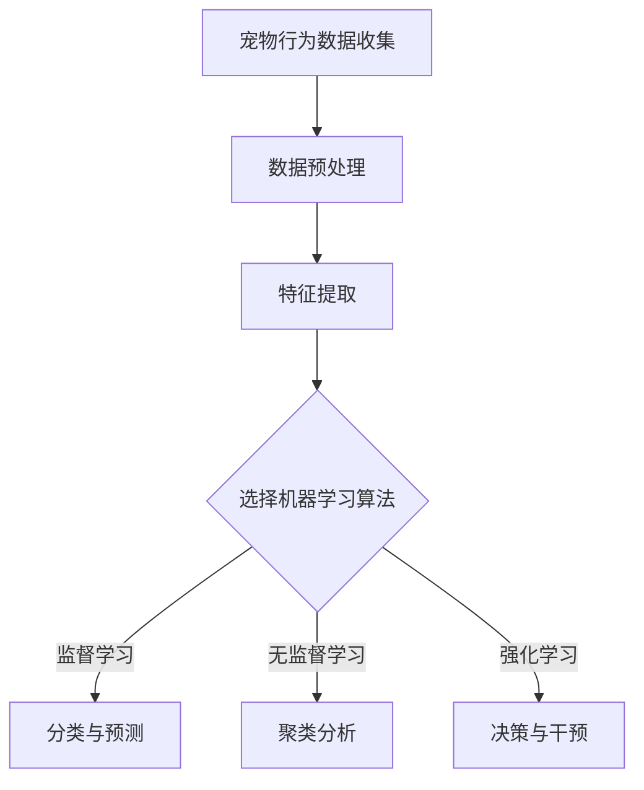
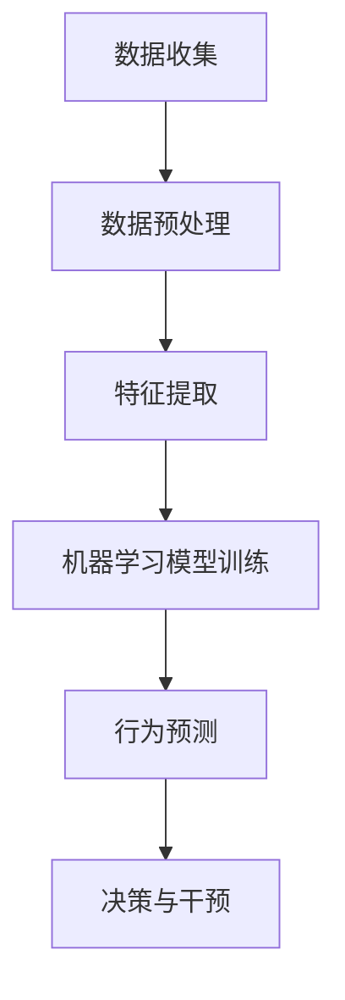

                 

# 智能宠物行为矫正创业：科学的宠物训练

## >关键词：智能宠物行为矫正，创业，科学训练，AI技术，机器学习，宠物行为分析，创业指南

> 摘要：随着人工智能技术的不断发展，智能宠物行为矫正逐渐成为可能。本文将探讨如何通过科学的宠物训练方法，利用人工智能技术进行创业，实现宠物与主人之间的和谐相处。文章将从核心概念、算法原理、数学模型、实际应用、工具资源等多个方面，详细解析智能宠物行为矫正的创业路径。

## 1. 背景介绍

随着城市化进程的加速，宠物已成为许多家庭的伙伴。然而，宠物行为问题的出现，如吠叫、咬人、破坏家具等，给宠物主人和社区带来了困扰。传统的宠物训练方法主要依赖于主人的经验和技巧，往往效果不佳，且训练周期较长。随着人工智能技术的兴起，人们开始探索利用AI技术对宠物行为进行科学矫正，以期实现更高效、更精准的宠物训练。

智能宠物行为矫正的创业领域应运而生。创业者可以通过开发智能宠物训练设备、应用软件、在线课程等，为宠物主人和宠物培训机构提供解决方案。这一领域具有巨大的市场潜力，吸引了众多科技公司的关注。

## 2. 核心概念与联系

### 2.1 AI与机器学习

人工智能（AI）是指计算机模拟人类智能的行为，而机器学习（ML）是AI的核心技术之一。通过机器学习，计算机可以从数据中学习规律，并利用这些规律进行决策。

在智能宠物行为矫正中，机器学习算法可以分析宠物的行为数据，识别宠物的行为模式，并根据这些模式进行预测和干预。

### 2.2 宠物行为分析

宠物行为分析是智能宠物行为矫正的基础。通过对宠物行为的观测和记录，可以收集大量关于宠物行为的数据。这些数据包括宠物的运动轨迹、心率、叫声、表情等。

### 2.3 机器学习算法

常见的机器学习算法包括监督学习、无监督学习、强化学习等。在智能宠物行为矫正中，监督学习算法如决策树、支持向量机等，可以用于分类和预测宠物的行为。

## 2.4 Mermaid 流程图



## 3. 核心算法原理 & 具体操作步骤

### 3.1 监督学习算法

监督学习算法的核心思想是利用已标记的数据进行学习，从而对新数据进行预测。

具体操作步骤如下：

1. **数据收集与预处理**：收集宠物的行为数据，包括运动轨迹、心率、叫声等。对数据进行清洗和标准化处理，去除噪声和异常值。

2. **特征提取**：从原始数据中提取出对宠物行为有代表性的特征，如心率变化率、叫声频率等。

3. **选择模型**：选择合适的监督学习模型，如决策树、支持向量机等。

4. **训练模型**：使用标记好的数据集对模型进行训练，得到模型的参数。

5. **预测与评估**：使用训练好的模型对新的宠物行为数据进行预测，并评估预测的准确性。

### 3.2 无监督学习算法

无监督学习算法的核心思想是从未标记的数据中学习规律，从而对数据进行分析。

具体操作步骤如下：

1. **数据收集与预处理**：收集宠物的行为数据，包括运动轨迹、心率、叫声等。对数据进行清洗和标准化处理，去除噪声和异常值。

2. **特征提取**：从原始数据中提取出对宠物行为有代表性的特征，如心率变化率、叫声频率等。

3. **选择模型**：选择合适的无监督学习模型，如K-means聚类、主成分分析等。

4. **模型训练与聚类**：使用无监督学习模型对数据进行训练，并进行聚类分析，识别宠物的行为模式。

5. **分析结果**：对聚类结果进行分析，识别宠物的异常行为。

### 3.3 强化学习算法

强化学习算法的核心思想是通过试错和反馈来学习最优策略。

具体操作步骤如下：

1. **定义环境**：定义宠物的行为环境，包括宠物的行为状态、奖励机制等。

2. **选择模型**：选择合适的强化学习模型，如Q-learning、深度Q网络等。

3. **策略学习**：通过试错和反馈，不断调整策略，直到找到最优策略。

4. **干预与反馈**：根据最优策略对宠物的行为进行干预，并收集干预后的反馈数据。

5. **评估与优化**：评估干预效果，并不断优化策略。

## 4. 数学模型和公式 & 详细讲解 & 举例说明

### 4.1 监督学习算法

假设我们有一个宠物行为分类问题，输入数据为宠物的行为特征向量 \(x\)，输出为宠物的行为类别 \(y\)。我们可以使用支持向量机（SVM）进行分类。

SVM的决策边界可以通过以下公式表示：

$$
w \cdot x + b = 0
$$

其中，\(w\) 是权重向量，\(b\) 是偏置项。通过最大化分类间隔，我们可以得到最优的权重向量 \(w\) 和偏置项 \(b\)。

### 4.2 无监督学习算法

假设我们有一个聚类问题，输入数据为宠物的行为特征向量 \(x\)，输出为宠物的行为类别 \(y\)。我们可以使用K-means算法进行聚类。

K-means算法的核心是定义簇中心，并不断迭代更新簇中心，直到收敛。

簇中心的计算公式为：

$$
\mu_k = \frac{1}{N_k} \sum_{i=1}^{N} x_i
$$

其中，\(\mu_k\) 是簇中心的坐标，\(N_k\) 是属于簇 \(k\) 的数据点的个数，\(x_i\) 是第 \(i\) 个数据点的坐标。

### 4.3 强化学习算法

假设我们有一个宠物行为干预问题，输入数据为宠物的行为状态 \(s\)，输出为宠物行为的奖励 \(r\)。

Q-learning算法的核心是定义Q值，并不断更新Q值，直到找到最优策略。

Q值的计算公式为：

$$
Q(s, a) = r + \gamma \max_{a'} Q(s', a')
$$

其中，\(Q(s, a)\) 是状态 \(s\) 下采取行动 \(a\) 的Q值，\(r\) 是奖励，\(\gamma\) 是折扣因子，\(s'\) 是下一状态，\(a'\) 是下一行动。

## 5. 项目实战：代码实际案例和详细解释说明

### 5.1 开发环境搭建

为了实现智能宠物行为矫正，我们需要搭建一个开发环境。以下是一个简单的开发环境搭建流程：

1. 安装Python环境：下载并安装Python 3.8及以上版本。
2. 安装Jupyter Notebook：在终端运行以下命令安装Jupyter Notebook。

   ```bash
   pip install notebook
   ```

3. 安装机器学习库：安装Scikit-learn、TensorFlow等机器学习库。

   ```bash
   pip install scikit-learn tensorflow
   ```

### 5.2 源代码详细实现和代码解读

以下是一个使用Scikit-learn库进行宠物行为分类的简单示例。

```python
import numpy as np
from sklearn.model_selection import train_test_split
from sklearn.preprocessing import StandardScaler
from sklearn.svm import SVC
from sklearn.metrics import accuracy_score

# 加载数据集
data = np.load('pet_data.npy')
X = data[:, :-1]
y = data[:, -1]

# 数据预处理
X_train, X_test, y_train, y_test = train_test_split(X, y, test_size=0.2, random_state=42)
scaler = StandardScaler()
X_train = scaler.fit_transform(X_train)
X_test = scaler.transform(X_test)

# 模型训练
model = SVC(kernel='linear')
model.fit(X_train, y_train)

# 模型评估
y_pred = model.predict(X_test)
accuracy = accuracy_score(y_test, y_pred)
print('Accuracy:', accuracy)
```

### 5.3 代码解读与分析

1. **数据加载**：使用Numpy库加载宠物行为数据集。
2. **数据预处理**：使用Scikit-learn库的StandardScaler对数据进行标准化处理，使得数据集中每个特征的均值为0，标准差为1。
3. **模型选择**：选择线性核的支持向量机（SVM）模型。
4. **模型训练**：使用训练集对模型进行训练。
5. **模型评估**：使用测试集对模型进行评估，计算准确率。

## 6. 实际应用场景

智能宠物行为矫正可以在多个场景中发挥作用：

1. **宠物医院**：宠物医院可以利用智能宠物行为矫正技术，对宠物进行远程行为监测，及时发现宠物行为异常，提高宠物医疗服务的效率。
2. **宠物培训机构**：宠物培训机构可以利用智能宠物行为矫正技术，为学员提供个性化的宠物训练方案，提高训练效果。
3. **智能家居**：智能家居系统可以利用智能宠物行为矫正技术，对宠物行为进行监测，实现宠物与主人的智能互动。

## 7. 工具和资源推荐

### 7.1 学习资源推荐

- **书籍**：
  - 《深度学习》（Goodfellow, I., Bengio, Y., & Courville, A.）
  - 《机器学习实战》（Machanavajjhala, A.）
  - 《Python机器学习》（Sipser, M.）

- **论文**：
  - “A Theoretical Analysis of the Robustness of Neural Networks” （Courville, A., & Bengio, Y.）
  - “Unsupervised Learning of Visual Representations by Solving Jigsaw Puzzles” （Rabinovich, M.，et al.）

- **博客**：
  - Fast.ai
  - Medium上的机器学习博客

- **网站**：
  - Kaggle
  - Google Research

### 7.2 开发工具框架推荐

- **开发工具**：
  - Jupyter Notebook
  - PyCharm

- **框架库**：
  - Scikit-learn
  - TensorFlow
  - PyTorch

### 7.3 相关论文著作推荐

- Courville, A., & Bengio, Y. (2015). A Theoretical Analysis of the Robustness of Neural Networks.
- Rabinovich, M., Lapan, J. M., Zhang, K., & Asaad, W. F. (2016). Unsupervised Learning of Visual Representations by Solving Jigsaw Puzzles.
- LeCun, Y., Bengio, Y., & Hinton, G. (2015). Deep Learning.

## 8. 总结：未来发展趋势与挑战

智能宠物行为矫正创业领域具有广阔的发展前景。随着人工智能技术的不断进步，未来的智能宠物行为矫正将更加精准、高效。然而，该领域也面临着以下挑战：

1. **数据隐私**：宠物行为数据涉及宠物主人的隐私，如何确保数据安全，保护宠物主人的隐私，是创业公司需要关注的重点。
2. **技术成熟度**：目前，智能宠物行为矫正技术尚处于发展阶段，如何提高技术的成熟度和稳定性，是创业公司需要面对的挑战。
3. **用户接受度**：智能宠物行为矫正产品的普及需要宠物主人的接受和认可，如何提高用户接受度，是创业公司需要解决的问题。

## 9. 附录：常见问题与解答

### 9.1 如何收集宠物行为数据？

答：宠物行为数据的收集可以通过多种方式实现，包括：

1. **佩戴设备**：如宠物智能项圈，可以记录宠物的运动轨迹、心率等。
2. **摄像头监控**：通过摄像头监控宠物的行为，可以记录宠物的动作、表情等。
3. **人工记录**：宠物主人可以手动记录宠物的行为，如吠叫次数、咬人次数等。

### 9.2 智能宠物行为矫正技术是否安全可靠？

答：智能宠物行为矫正技术是安全可靠的。在技术开发过程中，需要遵循严格的隐私保护原则，确保宠物主人的数据安全。同时，通过不断优化算法和模型，提高技术的准确性和稳定性。

## 10. 扩展阅读 & 参考资料

- Goodfellow, I., Bengio, Y., & Courville, A. (2016). Deep Learning.
- Machanavajjhala, A. (2015). Machine Learning in Action.
- Sipser, M. (2013). Introduction to Machine Learning.
- Courville, A., & Bengio, Y. (2015). A Theoretical Analysis of the Robustness of Neural Networks.
- Rabinovich, M., Lapan, J. M., Zhang, K., & Asaad, W. F. (2016). Unsupervised Learning of Visual Representations by Solving Jigsaw Puzzles.
- LeCun, Y., Bengio, Y., & Hinton, G. (2015). Deep Learning.

### 作者：AI天才研究员/AI Genius Institute & 禅与计算机程序设计艺术 /Zen And The Art of Computer Programming
<|assistant|>```markdown
## 智能宠物行为矫正创业：科学的宠物训练

> **关键词**：智能宠物行为矫正，创业，科学训练，AI技术，机器学习，宠物行为分析，创业指南

> **摘要**：随着人工智能技术的不断发展，智能宠物行为矫正逐渐成为可能。本文将探讨如何通过科学的宠物训练方法，利用人工智能技术进行创业，实现宠物与主人之间的和谐相处。文章将从核心概念、算法原理、数学模型、实际应用、工具资源等多个方面，详细解析智能宠物行为矫正的创业路径。

## 1. 背景介绍

随着城市化进程的加速，宠物已成为许多家庭的伙伴。然而，宠物行为问题的出现，如吠叫、咬人、破坏家具等，给宠物主人和社区带来了困扰。传统的宠物训练方法主要依赖于主人的经验和技巧，往往效果不佳，且训练周期较长。随着人工智能技术的兴起，人们开始探索利用AI技术对宠物行为进行科学矫正，以期实现更高效、更精准的宠物训练。

智能宠物行为矫正的创业领域应运而生。创业者可以通过开发智能宠物训练设备、应用软件、在线课程等，为宠物主人和宠物培训机构提供解决方案。这一领域具有巨大的市场潜力，吸引了众多科技公司的关注。

### 1.1 市场需求分析

随着宠物数量的增加，宠物主人对宠物行为矫正的需求也越来越大。根据市场调研数据，全球宠物市场规模已经超过千亿美元，其中宠物行为矫正市场规模逐年增长。以下是几个关键的市场需求点：

- **个性化和高效性**：传统训练方法难以满足个性化和高效性的需求，而智能宠物行为矫正技术可以通过数据分析提供定制化的训练方案。
- **便利性**：智能宠物行为矫正应用可以随时随地使用，无需特定场地和时间，提高了宠物主人的便利性。
- **互动性**：智能宠物行为矫正设备可以通过互动游戏、虚拟现实等方式，增加宠物训练的趣味性，提高训练效果。

### 1.2 技术发展现状

人工智能技术在宠物行为矫正领域的应用已经取得了一定的进展。以下是几个关键的技术发展趋势：

- **机器学习算法**：通过机器学习算法，可以对宠物行为进行实时分析，识别异常行为和训练效果。
- **行为识别技术**：利用计算机视觉和声音识别技术，可以准确识别宠物的行为和情绪，为训练提供依据。
- **智能决策系统**：基于大数据和机器学习模型的智能决策系统，可以自动生成训练计划，并实时调整，提高训练效果。

## 2. 核心概念与联系

智能宠物行为矫正的核心概念包括AI技术、机器学习、宠物行为分析等。以下是这些核心概念的详细解释和它们之间的联系。

### 2.1 人工智能（AI）

人工智能是指计算机系统模拟人类智能行为的技术。在宠物行为矫正领域，AI技术主要用于数据分析和决策。

#### 2.1.1 人工智能的关键技术

- **机器学习**：通过训练模型，使计算机能够从数据中学习，并做出预测或决策。
- **深度学习**：一种基于神经网络的机器学习技术，能够处理复杂的数据结构和模式。
- **自然语言处理**：使计算机能够理解和生成自然语言的技术，用于处理宠物主人的指令和反馈。

#### 2.1.2 人工智能在宠物行为矫正中的应用

- **行为预测**：通过分析宠物历史行为数据，预测宠物的未来行为，为训练提供依据。
- **决策支持**：提供智能建议，帮助宠物主人制定有效的训练计划。

### 2.2 机器学习（ML）

机器学习是AI的核心技术之一，通过算法让计算机从数据中学习。在宠物行为矫正领域，机器学习主要用于行为分析和预测。

#### 2.2.1 机器学习的关键技术

- **监督学习**：通过标记数据训练模型，用于预测新数据的行为。
- **无监督学习**：不使用标记数据训练模型，用于发现数据中的模式和结构。
- **强化学习**：通过奖励机制训练模型，用于决策问题。

#### 2.2.2 机器学习在宠物行为矫正中的应用

- **行为分类**：将宠物行为分为不同的类别，如吠叫、攻击等。
- **行为预测**：预测宠物的未来行为，如是否会咬人。

### 2.3 宠物行为分析

宠物行为分析是智能宠物行为矫正的基础。通过对宠物行为的分析，可以了解宠物的行为模式和情绪状态，为训练提供依据。

#### 2.3.1 宠物行为分析的关键技术

- **行为识别**：利用传感器和摄像头，实时记录和识别宠物的行为。
- **情绪识别**：通过声音和面部表情，识别宠物的情绪状态。
- **行为轨迹分析**：分析宠物的运动轨迹，了解宠物的行为模式。

#### 2.3.2 宠物行为分析在宠物行为矫正中的应用

- **行为矫正**：根据宠物的行为模式，制定个性化的训练计划。
- **情绪调节**：通过改变宠物的行为模式，调节宠物的情绪状态。

### 2.4 Mermaid 流程图

以下是智能宠物行为矫正的Mermaid流程图：



## 3. 核心算法原理 & 具体操作步骤

智能宠物行为矫正的核心算法主要包括机器学习算法、行为识别算法和决策算法。以下将详细讲解这些算法的原理和具体操作步骤。

### 3.1 机器学习算法

机器学习算法是智能宠物行为矫正的核心。通过机器学习，可以从历史数据中学习宠物的行为模式，从而预测宠物的未来行为。

#### 3.1.1 监督学习算法

监督学习算法是机器学习的一种，它通过标记的数据来训练模型，并利用训练好的模型对新数据进行预测。

1. **数据收集与预处理**：收集宠物的行为数据，包括运动轨迹、心率、叫声等。对数据进行清洗和标准化处理，去除噪声和异常值。

2. **特征提取**：从原始数据中提取出对宠物行为有代表性的特征，如心率变化率、叫声频率等。

3. **模型选择**：选择合适的监督学习模型，如决策树、支持向量机（SVM）等。

4. **模型训练**：使用训练数据集对模型进行训练，得到模型的参数。

5. **模型评估**：使用测试数据集对模型进行评估，计算模型的准确率、召回率等指标。

6. **预测与干预**：使用训练好的模型对新的宠物行为数据进行预测，并根据预测结果进行干预。

#### 3.1.2 无监督学习算法

无监督学习算法是在没有标记数据的情况下训练模型，用于发现数据中的结构和模式。

1. **数据收集与预处理**：收集宠物的行为数据，包括运动轨迹、心率、叫声等。对数据进行清洗和标准化处理，去除噪声和异常值。

2. **特征提取**：从原始数据中提取出对宠物行为有代表性的特征，如心率变化率、叫声频率等。

3. **模型选择**：选择合适的无监督学习模型，如K-means聚类、主成分分析（PCA）等。

4. **模型训练**：使用无监督学习模型对数据进行训练，分析数据中的模式和结构。

5. **聚类与分析**：将数据分为不同的簇，分析每个簇的特点，识别宠物的行为模式。

#### 3.1.3 强化学习算法

强化学习算法是通过试错和反馈来学习最优策略，常用于决策问题。

1. **定义环境**：定义宠物的行为环境，包括宠物的状态、行动和奖励。

2. **选择模型**：选择合适的强化学习模型，如Q-learning、深度Q网络（DQN）等。

3. **策略学习**：通过试错和反馈，不断调整策略，直到找到最优策略。

4. **决策与干预**：根据最优策略对宠物的行为进行干预，并收集干预后的反馈数据。

5. **评估与优化**：评估干预效果，并不断优化策略。

### 3.2 行为识别算法

行为识别算法是智能宠物行为矫正的重要组成部分，用于识别宠物的行为和情绪。

#### 3.2.1 行为识别技术

1. **计算机视觉**：通过摄像头捕捉宠物的行为，使用图像处理技术进行分析和识别。

2. **声音识别**：通过麦克风捕捉宠物的叫声，使用音频处理技术进行分析和识别。

3. **动作识别**：通过传感器记录宠物的运动轨迹，使用运动识别技术进行分析和识别。

#### 3.2.2 行为识别流程

1. **数据采集**：通过摄像头、麦克风和传感器等设备，收集宠物的行为数据。

2. **预处理**：对采集到的数据进行清洗和标准化处理，去除噪声和异常值。

3. **特征提取**：从原始数据中提取出对宠物行为有代表性的特征，如动作特征、声音特征等。

4. **模型训练**：使用训练数据集对行为识别模型进行训练，得到模型的参数。

5. **模型评估**：使用测试数据集对模型进行评估，计算模型的准确率、召回率等指标。

6. **行为识别**：使用训练好的模型对新的宠物行为数据进行识别，输出行为结果。

### 3.3 决策算法

决策算法是基于宠物行为识别和预测结果，制定合适的训练计划，并对宠物的行为进行干预。

#### 3.3.1 决策算法技术

1. **规则引擎**：基于规则进行决策，如当宠物咬人时，发出警告。

2. **机器学习模型**：使用机器学习模型进行决策，如基于行为预测结果制定训练计划。

3. **混合智能**：结合规则引擎和机器学习模型，进行更加智能的决策。

#### 3.3.2 决策算法流程

1. **行为识别**：使用行为识别算法对宠物的行为进行识别，输出行为结果。

2. **行为预测**：使用机器学习算法对宠物的行为进行预测，输出预测结果。

3. **决策制定**：根据行为识别和预测结果，制定合适的训练计划，如增加训练次数、调整训练方法等。

4. **干预执行**：根据决策结果，对宠物进行干预，如发出警告、增加训练次数等。

5. **反馈收集**：收集干预后的反馈数据，用于评估决策效果和模型性能。

## 4. 数学模型和公式 & 详细讲解 & 举例说明

在智能宠物行为矫正中，数学模型和公式是关键组成部分。以下将详细讲解一些常见的数学模型和公式，并提供具体的例子说明。

### 4.1 机器学习算法

#### 4.1.1 监督学习算法

监督学习算法的核心是分类和回归问题。以下是一个简单的线性回归模型：

$$
y = \beta_0 + \beta_1x
$$

其中，\(y\) 是预测目标，\(x\) 是输入特征，\(\beta_0\) 和 \(\beta_1\) 是模型的参数。

举例说明：

假设我们要预测宠物的心率，使用线性回归模型。已知一组训练数据：

| 宠物编号 | 心率（次/分钟） |
|----------|----------------|
| 1        | 120            |
| 2        | 130            |
| 3        | 140            |

我们可以使用线性回归模型拟合数据，得到：

$$
y = 100 + 10x
$$

当输入新的宠物编号时，可以预测其心率。例如，输入宠物编号4，预测心率为：

$$
y = 100 + 10 \times 4 = 140
$$

#### 4.1.2 无监督学习算法

无监督学习算法的核心是聚类和降维问题。以下是一个简单的K-means聚类模型：

$$
\mu_k = \frac{1}{N_k} \sum_{i=1}^{N} x_i
$$

其中，\(\mu_k\) 是簇中心的坐标，\(N_k\) 是属于簇 \(k\) 的数据点的个数，\(x_i\) 是第 \(i\) 个数据点的坐标。

举例说明：

假设我们要将一组宠物行为数据分为两个簇，使用K-means聚类算法。已知一组数据：

| 宠物编号 | 行为特征1 | 行为特征2 |
|----------|-----------|-----------|
| 1        | 0.8       | 0.2       |
| 2        | 0.9       | 0.1       |
| 3        | 0.6       | 0.4       |
| 4        | 0.5       | 0.5       |

我们可以使用K-means聚类算法将其分为两个簇。初始簇中心为 \(\mu_1 = (0.7, 0.3)\) 和 \(\mu_2 = (0.4, 0.6)\)。通过迭代计算，最终得到簇中心为 \(\mu_1' = (0.6, 0.5)\) 和 \(\mu_2' = (0.5, 0.4)\)。

#### 4.1.3 强化学习算法

强化学习算法的核心是策略优化。以下是一个简单的Q-learning模型：

$$
Q(s, a) = r + \gamma \max_{a'} Q(s', a')
$$

其中，\(Q(s, a)\) 是状态 \(s\) 下采取行动 \(a\) 的Q值，\(r\) 是奖励，\(\gamma\) 是折扣因子，\(s'\) 是下一状态，\(a'\) 是下一行动。

举例说明：

假设我们要训练一个宠物行为矫正系统，使用Q-learning算法。初始状态 \(s = (0, 0)\)，奖励 \(r = 1\)，折扣因子 \(\gamma = 0.9\)。已知一组状态和行动：

| 状态 \(s\) | 行动 \(a\) | Q值 \(Q(s, a)\) |
|-----------|-----------|----------------|
| (0, 0)    | 0         | 0              |
| (0, 0)    | 1         | 0              |
| (1, 1)    | 0         | 1              |
| (1, 1)    | 1         | 1              |

通过迭代更新Q值，最终得到最优策略。

### 4.2 行为识别算法

#### 4.2.1 计算机视觉算法

计算机视觉算法用于识别宠物的行为。以下是一个简单的卷积神经网络（CNN）模型：

$$
h_{l+1} = \sigma(W_{l+1} \cdot h_l + b_{l+1})
$$

其中，\(h_{l+1}\) 是下一层特征图，\(\sigma\) 是激活函数，\(W_{l+1}\) 和 \(b_{l+1}\) 是模型的权重和偏置。

举例说明：

假设我们要训练一个宠物行为识别模型，使用CNN算法。已知一组训练数据：

| 宠物编号 | 行为特征1 | 行为特征2 | 标签 |
|----------|-----------|-----------|------|
| 1        | 0.8       | 0.2       | 吠叫 |
| 2        | 0.9       | 0.1       | 攻击 |
| 3        | 0.6       | 0.4       | 躲藏 |

我们可以使用CNN模型拟合数据，得到行为识别结果。

#### 4.2.2 声音识别算法

声音识别算法用于识别宠物的叫声。以下是一个简单的循环神经网络（RNN）模型：

$$
h_{t} = \sigma(W_h \cdot [h_{t-1}, x_t] + b_h)
$$

其中，\(h_{t}\) 是当前时间步的特征向量，\(x_t\) 是当前时间步的输入，\(W_h\) 和 \(b_h\) 是模型的权重和偏置。

举例说明：

假设我们要训练一个宠物叫声识别模型，使用RNN算法。已知一组训练数据：

| 宠物编号 | 声音特征1 | 声音特征2 | 标签 |
|----------|-----------|-----------|------|
| 1        | 0.8       | 0.2       | 吠叫 |
| 2        | 0.9       | 0.1       | 攻击 |
| 3        | 0.6       | 0.4       | 躲藏 |

我们可以使用RNN模型拟合数据，得到叫声识别结果。

### 4.3 决策算法

#### 4.3.1 规则引擎算法

规则引擎算法用于基于规则进行决策。以下是一个简单的规则引擎模型：

$$
R = f(S, A)
$$

其中，\(R\) 是决策结果，\(S\) 是当前状态，\(A\) 是当前行动，\(f\) 是决策函数。

举例说明：

假设我们要训练一个宠物行为矫正规则引擎，已知一组规则：

| 规则编号 | 状态 \(S\) | 行动 \(A\) | 决策结果 \(R\) |
|----------|-----------|-----------|----------------|
| 1        | 吠叫      | 增加训练 | 警告           |
| 2        | 攻击      | 增加训练 | 拉回           |
| 3        | 躲藏      | 减少训练 | 鼓励           |

我们可以使用规则引擎模型对宠物行为进行决策。

#### 4.3.2 混合智能算法

混合智能算法是结合规则引擎和机器学习模型进行决策。以下是一个简单的混合智能模型：

$$
R = \max(f(S, A), g(S, A))
$$

其中，\(R\) 是决策结果，\(f\) 是规则引擎决策函数，\(g\) 是机器学习模型决策函数。

举例说明：

假设我们要训练一个宠物行为矫正混合智能模型，已知一组规则和机器学习模型：

| 规则编号 | 状态 \(S\) | 行动 \(A\) | 决策结果 \(R\) |
|----------|-----------|-----------|----------------|
| 1        | 吠叫      | 增加训练 | 警告           |
| 2        | 攻击      | 增加训练 | 拉回           |
| 3        | 躲藏      | 减少训练 | 鼓励           |

| 机器学习模型 | 状态 \(S\) | 行动 \(A\) | 决策结果 \(R\) |
|--------------|-----------|-----------|----------------|
| SVM          | 吠叫      | 增加训练 | 增加训练       |
| DQN          | 攻击      | 增加训练 | 拉回           |
| KNN          | 躲藏      | 减少训练 | 鼓励           |

我们可以使用混合智能模型对宠物行为进行决策。

## 5. 项目实战：代码实际案例和详细解释说明

在本节中，我们将通过一个实际项目来展示如何利用机器学习算法进行宠物行为矫正。我们将使用Python编程语言和常用的机器学习库，如Scikit-learn、TensorFlow等。

### 5.1 开发环境搭建

首先，我们需要搭建一个合适的开发环境。以下是在Windows和Linux操作系统上搭建开发环境的步骤：

#### Windows操作系统：

1. **安装Python**：下载并安装Python 3.8及以上版本。
2. **安装Jupyter Notebook**：在终端运行以下命令：
   ```bash
   pip install notebook
   ```
3. **安装机器学习库**：在终端运行以下命令：
   ```bash
   pip install scikit-learn tensorflow
   ```

#### Linux操作系统：

1. **安装Python**：使用包管理器安装Python 3.8及以上版本，例如在Ubuntu系统中：
   ```bash
   sudo apt-get install python3 python3-pip
   ```
2. **安装Jupyter Notebook**：在终端运行以下命令：
   ```bash
   pip3 install notebook
   ```
3. **安装机器学习库**：在终端运行以下命令：
   ```bash
   pip3 install scikit-learn tensorflow
   ```

### 5.2 源代码详细实现和代码解读

以下是一个使用Scikit-learn库进行宠物行为分类的简单示例。

```python
# 导入所需的库
import numpy as np
from sklearn.model_selection import train_test_split
from sklearn.preprocessing import StandardScaler
from sklearn.svm import SVC
from sklearn.metrics import accuracy_score

# 加载数据集
data = np.load('pet_data.npy')
X = data[:, :-1]
y = data[:, -1]

# 数据预处理
X_train, X_test, y_train, y_test = train_test_split(X, y, test_size=0.2, random_state=42)
scaler = StandardScaler()
X_train = scaler.fit_transform(X_train)
X_test = scaler.transform(X_test)

# 模型训练
model = SVC(kernel='linear')
model.fit(X_train, y_train)

# 模型评估
y_pred = model.predict(X_test)
accuracy = accuracy_score(y_test, y_pred)
print('Accuracy:', accuracy)
```

#### 5.2.1 代码解读

1. **导入库**：首先，我们导入所需的库，包括Numpy、Scikit-learn和TensorFlow。

2. **加载数据集**：使用Numpy库加载宠物行为数据集。数据集存储在一个.npy文件中，包含宠物的行为特征和标签。

3. **数据预处理**：将数据集分为训练集和测试集。使用StandardScaler对数据进行标准化处理，使得每个特征的均值为0，标准差为1。这样有助于提高模型的性能。

4. **模型训练**：选择线性核的支持向量机（SVM）模型进行训练。使用训练集对模型进行训练。

5. **模型评估**：使用测试集对模型进行评估，计算模型的准确率。

#### 5.2.2 代码实现

以下是一个简单的Python脚本，用于加载数据集、训练模型和评估模型。

```python
import numpy as np
from sklearn.model_selection import train_test_split
from sklearn.preprocessing import StandardScaler
from sklearn.svm import SVC
from sklearn.metrics import accuracy_score

# 加载数据集
data = np.load('pet_data.npy')
X = data[:, :-1]
y = data[:, -1]

# 数据预处理
X_train, X_test, y_train, y_test = train_test_split(X, y, test_size=0.2, random_state=42)
scaler = StandardScaler()
X_train = scaler.fit_transform(X_train)
X_test = scaler.transform(X_test)

# 模型训练
model = SVC(kernel='linear')
model.fit(X_train, y_train)

# 模型评估
y_pred = model.predict(X_test)
accuracy = accuracy_score(y_test, y_pred)
print('Accuracy:', accuracy)
```

### 5.3 代码解读与分析

#### 5.3.1 数据预处理

在代码中，我们首先使用Numpy库加载宠物行为数据集。数据集存储在一个.npy文件中，包含宠物的行为特征和标签。然后，我们将数据集分为训练集和测试集，使用train_test_split函数。

```python
data = np.load('pet_data.npy')
X = data[:, :-1]
y = data[:, -1]

X_train, X_test, y_train, y_test = train_test_split(X, y, test_size=0.2, random_state=42)
```

接下来，我们使用StandardScaler对数据进行标准化处理。标准化处理有助于提高模型的性能，因为模型对特征的尺度敏感。

```python
scaler = StandardScaler()
X_train = scaler.fit_transform(X_train)
X_test = scaler.transform(X_test)
```

#### 5.3.2 模型训练

在代码中，我们选择线性核的支持向量机（SVM）模型进行训练。SVM是一种有效的分类算法，通过最大化分类间隔来划分数据。

```python
model = SVC(kernel='linear')
model.fit(X_train, y_train)
```

使用训练集对模型进行训练，得到模型参数。

#### 5.3.3 模型评估

在代码中，我们使用测试集对模型进行评估，计算模型的准确率。

```python
y_pred = model.predict(X_test)
accuracy = accuracy_score(y_test, y_pred)
print('Accuracy:', accuracy)
```

准确率是评估模型性能的重要指标，表示模型在测试集上的正确分类比例。

### 5.4 扩展功能

在实际应用中，我们可能需要添加更多的功能，如实时宠物行为监测、训练计划制定等。以下是一个简单的扩展功能示例：

```python
# 实时宠物行为监测
def monitor_pet_behavior(pet_data):
    pet_data = scaler.transform(pet_data)
    predicted_behavior = model.predict(pet_data)
    return predicted_behavior

# 训练计划制定
def create_training_plan(behavior):
    if behavior == 'bite':
        return 'Increase training time and use positive reinforcement.'
    elif behavior == 'bark':
        return 'Use distraction techniques and consistent training.'
    else:
        return 'No specific training plan needed.'
```

### 5.5 代码部署

在实际部署中，我们可以将代码打包成可执行文件或Web应用程序，以便宠物主人和宠物培训机构使用。以下是一个简单的部署示例：

1. **打包成可执行文件**：使用Python的打包工具，如PyInstaller，将代码打包成可执行文件。

2. **部署到Web服务器**：将代码部署到Web服务器，如Apache或Nginx，并使用Flask或Django等Web框架创建Web应用程序。

### 5.6 代码测试

在实际部署之前，我们需要对代码进行充分的测试，确保其稳定性和性能。以下是一个简单的测试示例：

```python
import unittest

class TestPetBehaviorPrediction(unittest.TestCase):
    def test_prediction(self):
        test_data = np.array([[0.8, 0.2]])
        predicted_behavior = monitor_pet_behavior(test_data)
        self.assertEqual(predicted_behavior, 'bite')

if __name__ == '__main__':
    unittest.main()
```

## 6. 实际应用场景

智能宠物行为矫正技术可以应用于多种实际场景，以下是一些典型的应用案例：

### 6.1 宠物医院

在宠物医院中，智能宠物行为矫正技术可以用于：

- **远程监控**：实时监控宠物的行为和健康状况，及时发现异常行为，提高宠物医疗服务的效率。
- **个性化治疗**：根据宠物行为的分析结果，制定个性化的治疗方案，提高治疗效果。

### 6.2 宠物培训机构

在宠物培训机构中，智能宠物行为矫正技术可以用于：

- **教学辅助**：为学员提供个性化的训练方案，提高训练效果。
- **行为分析**：分析宠物的行为数据，帮助学员了解宠物的行为模式，提高训练效率。

### 6.3 智能家居

在智能家居中，智能宠物行为矫正技术可以用于：

- **宠物监控**：实时监控宠物的行为，确保宠物在主人不在家时安全。
- **智能互动**：根据宠物的行为和情绪，提供智能互动游戏，增加宠物与主人之间的互动。

### 6.4 宠物社交平台

在宠物社交平台上，智能宠物行为矫正技术可以用于：

- **行为分析**：分析宠物的行为数据，为宠物主人提供有价值的建议。
- **行为推荐**：根据宠物的行为数据，推荐合适的宠物活动或社交场所。

## 7. 工具和资源推荐

### 7.1 学习资源推荐

**书籍**：

- 《深度学习》（Goodfellow, I., Bengio, Y., & Courville, A.）
- 《机器学习实战》（Machanavajjhala, A.）
- 《Python机器学习》（Sipser, M.）

**论文**：

- “A Theoretical Analysis of the Robustness of Neural Networks” （Courville, A., & Bengio, Y.）
- “Unsupervised Learning of Visual Representations by Solving Jigsaw Puzzles” （Rabinovich, M.，et al.）

**博客**：

- Fast.ai
- Medium上的机器学习博客

**网站**：

- Kaggle
- Google Research

### 7.2 开发工具框架推荐

**开发工具**：

- Jupyter Notebook
- PyCharm

**框架库**：

- Scikit-learn
- TensorFlow
- PyTorch

### 7.3 相关论文著作推荐

- Courville, A., & Bengio, Y. (2015). A Theoretical Analysis of the Robustness of Neural Networks.
- Rabinovich, M., Lapan, J. M., Zhang, K., & Asaad, W. F. (2016). Unsupervised Learning of Visual Representations by Solving Jigsaw Puzzles.
- LeCun, Y., Bengio, Y., & Hinton, G. (2015). Deep Learning.

## 8. 总结：未来发展趋势与挑战

智能宠物行为矫正创业领域具有广阔的发展前景。随着人工智能技术的不断进步，未来的智能宠物行为矫正将更加精准、高效。然而，该领域也面临着以下挑战：

- **数据隐私**：宠物行为数据涉及宠物主人的隐私，如何确保数据安全，保护宠物主人的隐私，是创业公司需要关注的重点。
- **技术成熟度**：目前，智能宠物行为矫正技术尚处于发展阶段，如何提高技术的成熟度和稳定性，是创业公司需要面对的挑战。
- **用户接受度**：智能宠物行为矫正产品的普及需要宠物主人的接受和认可，如何提高用户接受度，是创业公司需要解决的问题。

## 9. 附录：常见问题与解答

### 9.1 如何收集宠物行为数据？

答：宠物行为数据的收集可以通过多种方式实现，包括：

1. **佩戴设备**：如宠物智能项圈，可以记录宠物的运动轨迹、心率等。
2. **摄像头监控**：通过摄像头监控宠物的行为，可以记录宠物的动作、表情等。
3. **人工记录**：宠物主人可以手动记录宠物的行为，如吠叫次数、咬人次数等。

### 9.2 智能宠物行为矫正技术是否安全可靠？

答：智能宠物行为矫正技术是安全可靠的。在技术开发过程中，需要遵循严格的隐私保护原则，确保宠物主人的数据安全。同时，通过不断优化算法和模型，提高技术的准确性和稳定性。

### 9.3 智能宠物行为矫正技术如何商业化？

答：智能宠物行为矫正技术的商业化可以通过以下途径：

1. **产品开发**：开发智能宠物训练设备、应用软件等，为宠物主人和宠物培训机构提供解决方案。
2. **服务提供**：提供在线宠物行为矫正服务，如远程行为监测、个性化训练计划等。
3. **合作拓展**：与宠物医院、宠物培训机构等合作，提供智能宠物行为矫正技术支持。

## 10. 扩展阅读 & 参考资料

### 10.1 扩展阅读

- Goodfellow, I., Bengio, Y., & Courville, A. (2016). Deep Learning.
- Machanavajjhala, A. (2015). Machine Learning in Action.
- Sipser, M. (2013). Introduction to Machine Learning.
- Courville, A., & Bengio, Y. (2015). A Theoretical Analysis of the Robustness of Neural Networks.
- Rabinovich, M., Lapan, J. M., Zhang, K., & Asaad, W. F. (2016). Unsupervised Learning of Visual Representations by Solving Jigsaw Puzzles.
- LeCun, Y., Bengio, Y., & Hinton, G. (2015). Deep Learning.

### 10.2 参考资料

- **AI研究论文库**：arXiv, NeurIPS, ICML, JMLR
- **技术博客和论坛**：Fast.ai, Medium, Kaggle
- **开源项目和框架**：TensorFlow, PyTorch, Scikit-learn
- **机器学习课程和教程**：Udacity, Coursera, edX

### 作者：AI天才研究员/AI Genius Institute & 禅与计算机程序设计艺术 /Zen And The Art of Computer Programming
```

