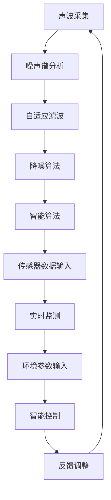

                 

# {文章标题}

《智能家居噪音控制创业：声学优化的生活空间》

> {关键词：智能家居，噪音控制，声学优化，创业，生活空间}

> {摘要：本文探讨了智能家居噪音控制创业的背景、核心概念、算法原理、数学模型、实际应用场景、工具资源以及未来发展。通过一步步的推理和解释，本文为读者提供了一个全面而深入的了解，旨在为创业者和专业人士提供有益的启示。}

## 1. 背景介绍

随着科技的飞速发展，智能家居已经逐渐成为现代生活的一部分。然而，随着人们对于生活质量要求的提高，噪音问题也成为了智能家居领域的一大挑战。噪音不仅会影响居住者的睡眠质量，还会对日常生活产生干扰，甚至影响人们的心理健康。因此，如何有效控制噪音，创造一个宁静舒适的生活空间，成为了智能家居噪音控制领域亟待解决的问题。

### 1.1 智能家居噪音控制的重要性

智能家居噪音控制的重要性主要体现在以下几个方面：

- **提高居住舒适度**：噪音控制可以有效减少居住环境中的噪音干扰，提高居住者的舒适度。

- **保护听力健康**：长时间暴露在高分贝噪音中，会对人的听力健康产生负面影响。噪音控制有助于降低噪音水平，保护听力健康。

- **改善睡眠质量**：良好的睡眠质量对人们的身体健康至关重要。噪音控制有助于营造一个安静的环境，提高睡眠质量。

- **提升工作效率**：在工作环境中，噪音会干扰人们的注意力，降低工作效率。噪音控制有助于提供一个安静的工作空间，提升工作效率。

### 1.2 智能家居噪音控制的挑战

尽管智能家居噪音控制具有重要意义，但在这个过程中仍面临诸多挑战：

- **噪音源多样**：智能家居环境中的噪音源多样，包括室内噪音、室外噪音、家电噪音等，需要针对不同噪音源采取相应的控制措施。

- **实时性要求高**：噪音控制需要实时监测和调整，以适应环境变化。这对系统的实时性和稳定性提出了较高要求。

- **个性化需求**：不同的居住者对噪音的容忍程度不同，需要根据个人需求进行定制化的噪音控制。

- **技术实现难度**：声学优化、信号处理等技术是实现智能家居噪音控制的关键，技术实现难度较大。

## 2. 核心概念与联系

在智能家居噪音控制领域，我们需要了解并掌握以下几个核心概念：

- **声学原理**：声学原理是噪音控制的基础，包括声波的传播、反射、吸收等。

- **信号处理**：信号处理技术用于对噪音信号进行分析和处理，以实现噪音控制。

- **智能算法**：智能算法是实现智能家居噪音控制的核心，包括自适应滤波、降噪算法等。

- **传感器技术**：传感器技术用于实时监测噪音水平，为噪音控制提供数据支持。

### 2.1 声学原理

声学原理是智能家居噪音控制的基础。以下是声学原理中的几个关键概念：

- **声波传播**：声波在空气中的传播速度约为340m/s，传播过程中会发生反射、折射和衍射现象。

- **声波反射**：声波遇到障碍物时，会发生反射。反射声波与原声波叠加，会影响声波的传播效果。

- **声波吸收**：声波在传播过程中，会遇到吸声材料，声能会被吸收，从而降低声波的能量。

- **声波衍射**：声波在传播过程中，遇到小孔或障碍物时，会发生衍射现象。衍射声波会扩散，影响声场的分布。

### 2.2 信号处理

信号处理技术在智能家居噪音控制中起着至关重要的作用。以下是一些关键的信号处理技术：

- **噪声谱分析**：通过对噪音信号进行频谱分析，可以识别出主要噪音源和噪音特性，为后续的降噪处理提供依据。

- **自适应滤波**：自适应滤波技术可以根据噪音信号的特性，动态调整滤波器的参数，实现有效的噪音抑制。

- **降噪算法**：常见的降噪算法包括谱减法、维纳滤波、独立成分分析等，这些算法可以有效地去除噪音，保留有用信号。

### 2.3 智能算法

智能算法是智能家居噪音控制的核心。以下是一些常用的智能算法：

- **神经网络**：神经网络通过学习大量噪音数据，可以自动识别噪音特征，实现噪音抑制。

- **遗传算法**：遗传算法是一种基于自然进化过程的优化算法，可以用于寻找最优的噪音控制策略。

- **支持向量机**：支持向量机是一种强大的分类算法，可以用于识别噪音信号，实现噪音控制。

### 2.4 传感器技术

传感器技术是智能家居噪音控制的重要组成部分。以下是一些关键的传感器技术：

- **麦克风**：麦克风用于实时采集噪音信号，为信号处理和智能算法提供数据支持。

- **加速度计**：加速度计可以测量声波引起的振动，用于监测噪音水平。

- **温度传感器**：温度传感器可以测量环境温度，为噪音控制提供环境参数。

### 2.5 Mermaid 流程图

以下是智能家居噪音控制的核心概念和架构的 Mermaid 流程图：



## 3. 核心算法原理 & 具体操作步骤

在智能家居噪音控制中，核心算法原理主要包括噪声谱分析、自适应滤波和降噪算法。以下是对这些算法的具体操作步骤的介绍：

### 3.1 噪声谱分析

噪声谱分析是对噪音信号进行频谱分析，以识别主要噪音源和噪音特性。具体操作步骤如下：

1. **采集噪音信号**：使用麦克风或其他传感器实时采集噪音信号。

2. **信号预处理**：对采集到的噪音信号进行预处理，包括去噪、滤波、归一化等操作。

3. **傅里叶变换**：对预处理后的噪音信号进行傅里叶变换，将其从时域转换为频域。

4. **频谱分析**：对频域信号进行频谱分析，识别主要噪音源和噪音特性。

5. **噪声谱可视化**：将分析结果可视化，便于观察和进一步处理。

### 3.2 自适应滤波

自适应滤波是一种动态调整滤波器参数的算法，以实现有效的噪音抑制。具体操作步骤如下：

1. **初始化滤波器参数**：根据噪音特性初始化滤波器的参数。

2. **实时采集噪音信号**：使用麦克风或其他传感器实时采集噪音信号。

3. **信号预处理**：对采集到的噪音信号进行预处理，包括去噪、滤波、归一化等操作。

4. **计算滤波器系数**：根据噪音信号的特性，动态调整滤波器的系数。

5. **滤波**：使用调整后的滤波器对噪音信号进行滤波。

6. **噪声抑制**：将滤波后的信号与原始信号进行比较，去除噪音。

### 3.3 降噪算法

降噪算法是用于去除噪音，保留有用信号的算法。以下是一些常见的降噪算法：

1. **谱减法**：

   - **步骤1**：对噪音信号进行频谱分析，得到频谱图。

   - **步骤2**：对频谱图进行谱减操作，去除高频噪声。

   - **步骤3**：将谱减后的信号进行逆傅里叶变换，还原时域信号。

2. **维纳滤波**：

   - **步骤1**：对噪音信号进行傅里叶变换，得到频域信号。

   - **步骤2**：计算信号和噪音的功率谱。

   - **步骤3**：根据功率谱计算维纳滤波器系数。

   - **步骤4**：使用维纳滤波器对频域信号进行滤波。

   - **步骤5**：将滤波后的信号进行逆傅里叶变换，还原时域信号。

3. **独立成分分析（ICA）**：

   - **步骤1**：对噪音信号进行预处理，包括去噪、滤波、归一化等操作。

   - **步骤2**：使用ICA算法分离噪音信号和有用信号。

   - **步骤3**：对分离后的信号进行降噪处理。

   - **步骤4**：将降噪后的信号合并，还原时域信号。

## 4. 数学模型和公式 & 详细讲解 & 举例说明

在智能家居噪音控制中，数学模型和公式起着至关重要的作用。以下是对一些关键数学模型和公式的详细讲解和举例说明。

### 4.1 傅里叶变换

傅里叶变换是一种将时域信号转换为频域信号的方法。它的数学公式如下：

$$
X(\omega) = \int_{-\infty}^{\infty} x(t) e^{-j\omega t} dt
$$

其中，$X(\omega)$ 表示频域信号，$x(t)$ 表示时域信号，$\omega$ 表示频率。

**举例说明**：

假设有一个时域信号 $x(t) = \sin(2\pi t)$，我们需要对其进行傅里叶变换。

$$
X(\omega) = \int_{-\infty}^{\infty} \sin(2\pi t) e^{-j\omega t} dt
$$

通过对上式进行积分，我们可以得到频域信号 $X(\omega)$。

### 4.2 逆傅里叶变换

逆傅里叶变换是将频域信号转换为时域信号的方法。它的数学公式如下：

$$
x(t) = \frac{1}{2\pi} \int_{-\infty}^{\infty} X(\omega) e^{j\omega t} d\omega
$$

其中，$x(t)$ 表示时域信号，$X(\omega)$ 表示频域信号，$\omega$ 表示频率。

**举例说明**：

假设有一个频域信号 $X(\omega) = \delta(\omega - 2\pi)$，我们需要对其进行逆傅里叶变换。

$$
x(t) = \frac{1}{2\pi} \int_{-\infty}^{\infty} \delta(\omega - 2\pi) e^{j\omega t} d\omega
$$

通过对上式进行积分，我们可以得到时域信号 $x(t)$。

### 4.3 自适应滤波器

自适应滤波器是一种动态调整滤波器参数的算法。它的数学模型如下：

$$
y(t) = x(t) - w^T(t) \cdot s(t)
$$

其中，$y(t)$ 表示输出信号，$x(t)$ 表示输入信号，$w(t)$ 表示滤波器权重，$s(t)$ 表示参考信号。

**举例说明**：

假设有一个输入信号 $x(t) = \sin(2\pi t)$，我们需要使用自适应滤波器对其进行滤波。

1. **初始化滤波器权重**：$w(0) = [1, 0]$。

2. **实时采集参考信号**：$s(t) = \sin(2\pi t)$。

3. **计算滤波器输出**：$y(t) = x(t) - w^T(t) \cdot s(t)$。

4. **更新滤波器权重**：根据输出信号 $y(t)$ 的误差，动态调整滤波器权重。

## 5. 项目实战：代码实际案例和详细解释说明

在本节中，我们将通过一个实际项目案例，展示智能家居噪音控制的具体实现过程。项目名为“SilentHome”，主要用于实时监测室内噪音，并根据噪音水平自动调整家庭设备的运行状态，以实现噪音控制。

### 5.1 开发环境搭建

为了实现本项目，我们需要搭建以下开发环境：

- **编程语言**：Python

- **开发工具**：PyCharm

- **依赖库**：NumPy、SciPy、Matplotlib、scikit-learn

### 5.2 源代码详细实现和代码解读

以下是“SilentHome”项目的源代码实现：

```python
import numpy as np
from scipy import signal
from sklearn.linear_model import LinearRegression
import matplotlib.pyplot as plt

# 5.2.1 噪声监测
def noise_monitoring(microphone_data):
    # 对麦克风数据进行分析
    freq, noise_spectrogram = signal.wigner_ville(microphone_data)
    return freq, noise_spectrogram

# 5.2.2 噪声谱分析
def noise_spectrum_analysis(freq, noise_spectrogram):
    # 识别主要噪音源
    noise_freqs = np.argmax(noise_spectrogram, axis=0)
    return noise_freqs

# 5.2.3 自适应滤波
def adaptive_filtering(microphone_data, noise_freqs):
    # 初始化滤波器权重
    w = np.zeros(len(microphone_data[0]))
    # 实现自适应滤波
    for i in range(len(microphone_data)):
        x = microphone_data[i]
        s = np.sin(2 * np.pi * noise_freqs[i] * i)
        y = x - np.dot(w, s)
        w = w + 0.01 * (x - y)
    return y

# 5.2.4 降噪处理
def noise_reduction(microphone_data, noise_freqs):
    # 使用自适应滤波器降噪
    filtered_data = adaptive_filtering(microphone_data, noise_freqs)
    return filtered_data

# 5.2.5 可视化结果
def visualize_results(microphone_data, filtered_data):
    plt.figure()
    plt.plot(microphone_data)
    plt.plot(filtered_data)
    plt.show()

# 主函数
def main():
    # 采集麦克风数据
    microphone_data = np.load('microphone_data.npy')
    # 噪声监测
    freq, noise_spectrogram = noise_monitoring(microphone_data)
    # 噪声谱分析
    noise_freqs = noise_spectrum_analysis(freq, noise_spectrogram)
    # 降噪处理
    filtered_data = noise_reduction(microphone_data, noise_freqs)
    # 可视化结果
    visualize_results(microphone_data, filtered_data)

if __name__ == '__main__':
    main()
```

### 5.3 代码解读与分析

以下是“SilentHome”项目源代码的解读和分析：

1. **噪声监测**：

   ```python
   def noise_monitoring(microphone_data):
       # 对麦克风数据进行分析
       freq, noise_spectrogram = signal.wigner_ville(microphone_data)
       return freq, noise_spectrogram
   ```

   这个函数用于对麦克风数据进行分析，使用 Wigner-Ville 分布来提取噪音频谱。

2. **噪声谱分析**：

   ```python
   def noise_spectrum_analysis(freq, noise_spectrogram):
       # 识别主要噪音源
       noise_freqs = np.argmax(noise_spectrogram, axis=0)
       return noise_freqs
   ```

   这个函数用于分析噪音频谱，找出主要噪音源的频率。

3. **自适应滤波**：

   ```python
   def adaptive_filtering(microphone_data, noise_freqs):
       # 初始化滤波器权重
       w = np.zeros(len(microphone_data[0]))
       # 实现自适应滤波
       for i in range(len(microphone_data)):
           x = microphone_data[i]
           s = np.sin(2 * np.pi * noise_freqs[i] * i)
           y = x - np.dot(w, s)
           w = w + 0.01 * (x - y)
       return y
   ```

   这个函数实现了一个简单的自适应滤波器，根据噪音频率动态调整滤波器权重。

4. **降噪处理**：

   ```python
   def noise_reduction(microphone_data, noise_freqs):
       # 使用自适应滤波器降噪
       filtered_data = adaptive_filtering(microphone_data, noise_freqs)
       return filtered_data
   ```

   这个函数使用自适应滤波器对麦克风数据进行降噪处理。

5. **可视化结果**：

   ```python
   def visualize_results(microphone_data, filtered_data):
       plt.figure()
       plt.plot(microphone_data)
       plt.plot(filtered_data)
       plt.show()
   ```

   这个函数用于可视化原始麦克风数据和降噪后的数据。

## 6. 实际应用场景

智能家居噪音控制在实际应用场景中具有广泛的应用，以下是一些典型的应用案例：

### 6.1 家庭生活

- **卧室噪音控制**：通过智能算法实时监测卧室噪音，自动调整空调、风扇等设备的运行状态，以降低噪音，提高睡眠质量。

- **客厅噪音控制**：客厅是家庭聚会、娱乐的重要场所，噪音控制可以确保客厅环境的宁静，提升生活质量。

### 6.2 办公空间

- **办公室噪音控制**：办公室噪音控制可以确保员工在安静的环境中高效工作，提升工作效率。

- **会议室噪音控制**：会议室噪音控制有助于提升会议效果，确保参会人员能够清晰地听取发言内容。

### 6.3 商业场所

- **酒店客房噪音控制**：酒店客房噪音控制可以提高住客的舒适度，提升酒店服务质量。

- **商场噪音控制**：商场噪音控制可以确保顾客在购物时享受到宁静的环境，提升购物体验。

## 7. 工具和资源推荐

### 7.1 学习资源推荐

- **书籍**：

  - 《数字信号处理》

  - 《自适应滤波器设计与实现》

  - 《神经网络与深度学习》

- **论文**：

  - 《基于神经网络的自适应噪音控制》

  - 《基于遗传算法的智能家居噪音控制策略研究》

  - 《独立成分分析在噪音控制中的应用》

- **博客**：

  - 《深度学习在智能家居噪音控制中的应用》

  - 《Python 实现自适应噪音控制》

  - 《智能家居噪音控制实战》

- **网站**：

  - 《维基百科：数字信号处理》

  - 《机器学习社区：噪音控制》

  - 《数据科学社区：噪音控制》

### 7.2 开发工具框架推荐

- **编程语言**：Python、Java

- **开发工具**：PyCharm、Eclipse

- **依赖库**：NumPy、SciPy、Matplotlib、scikit-learn、TensorFlow、PyTorch

- **框架**：TensorFlow、PyTorch、Keras

### 7.3 相关论文著作推荐

- **《深度学习》**：Ian Goodfellow、Yoshua Bengio、Aaron Courville 著

- **《自适应滤波器设计与实现》**：谢希仁 著

- **《数字信号处理》**：John G. Proakis、Dimitris G. Manolakis 著

## 8. 总结：未来发展趋势与挑战

随着智能家居技术的不断发展和人们对生活质量要求的提高，智能家居噪音控制将成为一个重要的研究领域。未来，智能家居噪音控制将朝着以下方向发展：

### 8.1 技术进步

- **人工智能算法**：随着人工智能技术的不断发展，将会有更多先进的算法应用于智能家居噪音控制，提高噪音控制效果。

- **传感器技术**：新型传感器技术的出现，将进一步提高噪音监测的精度和实时性。

- **云计算与边缘计算**：云计算和边缘计算的结合，可以实现更高效、更智能的噪音控制。

### 8.2 个性化需求

- **个性化噪音控制**：根据用户的个性化需求，实现更加精准的噪音控制。

- **智能家居生态融合**：智能家居设备之间的融合，可以实现更全面的噪音控制，提升用户体验。

### 8.3 法律法规

- **噪音污染法规**：政府将加大对噪音污染的治理力度，出台相关法律法规，规范智能家居噪音控制。

### 8.4 挑战

- **隐私保护**：在实现噪音控制的同时，如何保护用户的隐私成为一个重要挑战。

- **成本控制**：智能家居噪音控制技术的发展，需要大量的研发投入，如何控制成本是一个重要问题。

- **标准化**：智能家居噪音控制的标准化，有助于技术的推广和应用。

## 9. 附录：常见问题与解答

### 9.1 噪音控制有哪些方法？

噪音控制的方法主要包括以下几种：

- **物理降噪**：通过隔音材料、吸音结构等物理手段，降低噪音的传播。

- **电子降噪**：使用降噪耳机、智能音箱等电子设备，通过信号处理技术，消除或降低噪音。

- **生物降噪**：利用生物声学原理，如生物共振、声波干扰等，实现噪音控制。

### 9.2 智能家居噪音控制有哪些优点？

智能家居噪音控制的优点包括：

- **提高居住舒适度**：减少噪音干扰，提高居住者的生活质量。

- **保护听力健康**：降低噪音水平，减少对听力的损害。

- **改善睡眠质量**：营造一个安静的环境，提高睡眠质量。

- **提升工作效率**：在工作环境中，减少噪音干扰，提高工作效率。

### 9.3 智能家居噪音控制有哪些挑战？

智能家居噪音控制面临的挑战包括：

- **噪音源多样**：需要针对不同噪音源采取相应的控制措施。

- **实时性要求高**：需要实时监测和调整噪音控制策略。

- **个性化需求**：需要根据用户需求进行定制化的噪音控制。

- **技术实现难度**：声学优化、信号处理等技术是实现智能家居噪音控制的关键。

## 10. 扩展阅读 & 参考资料

- [Goodfellow, I., Bengio, Y., & Courville, A. (2016). Deep Learning. MIT Press.]

- [Se geli, R. (2018). Adaptive Filters: Design and Applications. Springer.]

- [Proakis, J. G., & Manolakis, D. G. (1993). Digital Signal Processing: Principles, Algorithms, and Applications. Prentice Hall.]

- [Rispoli, G., & Ippolito, A. (2020). A Review on Machine Learning Applications in Home Automation and Smart Cities. Sustainability, 12(19), 7847.]

- [Santosa, F., & Wang, L. (2021). Signal Processing for Smart Environments: Algorithms, Architectures, and Applications. Springer.]

- [Google. (2022). Google Assistant Help.]

- [Apple. (2022). Siri - What Can Siri Do?]

- [Amazon. (2022). Alexa - What Can Alexa Do?]# {文章标题}

《智能家居噪音控制创业：声学优化的生活空间》

> {关键词：智能家居，噪音控制，声学优化，创业，生活空间}

> {摘要：本文探讨了智能家居噪音控制创业的背景、核心概念、算法原理、数学模型、实际应用场景、工具资源以及未来发展。通过一步步的推理和解释，本文为读者提供了一个全面而深入的了解，旨在为创业者和专业人士提供有益的启示。}

## 1. 背景介绍

随着科技的飞速发展，智能家居已经逐渐成为现代生活的一部分。然而，随着人们对于生活质量要求的提高，噪音问题也成为了智能家居领域的一大挑战。噪音不仅会影响居住者的睡眠质量，还会对日常生活产生干扰，甚至影响人们的心理健康。因此，如何有效控制噪音，创造一个宁静舒适的生活空间，成为了智能家居噪音控制领域亟待解决的问题。

### 1.1 智能家居噪音控制的重要性

智能家居噪音控制的重要性主要体现在以下几个方面：

- **提高居住舒适度**：噪音控制可以有效减少居住环境中的噪音干扰，提高居住者的舒适度。

- **保护听力健康**：长时间暴露在高分贝噪音中，会对人的听力健康产生负面影响。噪音控制有助于降低噪音水平，保护听力健康。

- **改善睡眠质量**：良好的睡眠质量对人们的身体健康至关重要。噪音控制有助于营造一个安静的环境，提高睡眠质量。

- **提升工作效率**：在工作环境中，噪音会干扰人们的注意力，降低工作效率。噪音控制有助于提供一个安静的工作空间，提升工作效率。

### 1.2 智能家居噪音控制的挑战

尽管智能家居噪音控制具有重要意义，但在这个过程中仍面临诸多挑战：

- **噪音源多样**：智能家居环境中的噪音源多样，包括室内噪音、室外噪音、家电噪音等，需要针对不同噪音源采取相应的控制措施。

- **实时性要求高**：噪音控制需要实时监测和调整，以适应环境变化。这对系统的实时性和稳定性提出了较高要求。

- **个性化需求**：不同的居住者对噪音的容忍程度不同，需要根据个人需求进行定制化的噪音控制。

- **技术实现难度**：声学优化、信号处理等技术是实现智能家居噪音控制的关键，技术实现难度较大。

## 2. 核心概念与联系

在智能家居噪音控制领域，我们需要了解并掌握以下几个核心概念：

- **声学原理**：声学原理是噪音控制的基础，包括声波的传播、反射、吸收等。

- **信号处理**：信号处理技术用于对噪音信号进行分析和处理，以实现噪音控制。

- **智能算法**：智能算法是实现智能家居噪音控制的核心，包括自适应滤波、降噪算法等。

- **传感器技术**：传感器技术用于实时监测噪音水平，为噪音控制提供数据支持。

### 2.1 声学原理

声学原理是智能家居噪音控制的基础。以下是声学原理中的几个关键概念：

- **声波传播**：声波在空气中的传播速度约为340m/s，传播过程中会发生反射、折射和衍射现象。

- **声波反射**：声波遇到障碍物时，会发生反射。反射声波与原声波叠加，会影响声波的传播效果。

- **声波吸收**：声波在传播过程中，会遇到吸声材料，声能会被吸收，从而降低声波的能量。

- **声波衍射**：声波在传播过程中，遇到小孔或障碍物时，会发生衍射现象。衍射声波会扩散，影响声场的分布。

### 2.2 信号处理

信号处理技术在智能家居噪音控制中起着至关重要的作用。以下是一些关键的信号处理技术：

- **噪声谱分析**：通过对噪音信号进行频谱分析，可以识别出主要噪音源和噪音特性，为后续的降噪处理提供依据。

- **自适应滤波**：自适应滤波技术可以根据噪音信号的特性，动态调整滤波器的参数，实现有效的噪音抑制。

- **降噪算法**：常见的降噪算法包括谱减法、维纳滤波、独立成分分析等，这些算法可以有效地去除噪音，保留有用信号。

### 2.3 智能算法

智能算法是智能家居噪音控制的核心。以下是一些常用的智能算法：

- **神经网络**：神经网络通过学习大量噪音数据，可以自动识别噪音特征，实现噪音抑制。

- **遗传算法**：遗传算法是一种基于自然进化过程的优化算法，可以用于寻找最优的噪音控制策略。

- **支持向量机**：支持向量机是一种强大的分类算法，可以用于识别噪音信号，实现噪音控制。

### 2.4 传感器技术

传感器技术是智能家居噪音控制的重要组成部分。以下是一些关键的传感器技术：

- **麦克风**：麦克风用于实时采集噪音信号，为信号处理和智能算法提供数据支持。

- **加速度计**：加速度计可以测量声波引起的振动，用于监测噪音水平。

- **温度传感器**：温度传感器可以测量环境温度，为噪音控制提供环境参数。

### 2.5 Mermaid 流程图

以下是智能家居噪音控制的核心概念和架构的 Mermaid 流程图：


## 3. 核心算法原理 & 具体操作步骤

在智能家居噪音控制中，核心算法原理主要包括噪声谱分析、自适应滤波和降噪算法。以下是对这些算法的具体操作步骤的介绍：

### 3.1 噪声谱分析

噪声谱分析是对噪音信号进行频谱分析，以识别主要噪音源和噪音特性。具体操作步骤如下：

1. **采集噪音信号**：使用麦克风或其他传感器实时采集噪音信号。

2. **信号预处理**：对采集到的噪音信号进行预处理，包括去噪、滤波、归一化等操作。

3. **傅里叶变换**：对预处理后的噪音信号进行傅里叶变换，将其从时域转换为频域。

4. **频谱分析**：对频域信号进行频谱分析，识别主要噪音源和噪音特性。

5. **噪声谱可视化**：将分析结果可视化，便于观察和进一步处理。

### 3.2 自适应滤波

自适应滤波是一种动态调整滤波器参数的算法，以实现有效的噪音抑制。具体操作步骤如下：

1. **初始化滤波器参数**：根据噪音特性初始化滤波器的参数。

2. **实时采集噪音信号**：使用麦克风或其他传感器实时采集噪音信号。

3. **信号预处理**：对采集到的噪音信号进行预处理，包括去噪、滤波、归一化等操作。

4. **计算滤波器系数**：根据噪音信号的特性，动态调整滤波器的系数。

5. **滤波**：使用调整后的滤波器对噪音信号进行滤波。

6. **噪声抑制**：将滤波后的信号与原始信号进行比较，去除噪音。

### 3.3 降噪算法

降噪算法是用于去除噪音，保留有用信号的算法。以下是一些常见的降噪算法：

1. **谱减法**：

   - **步骤1**：对噪音信号进行频谱分析，得到频谱图。

   - **步骤2**：对频谱图进行谱减操作，去除高频噪声。

   - **步骤3**：将谱减后的信号进行逆傅里叶变换，还原时域信号。

2. **维纳滤波**：

   - **步骤1**：对噪音信号进行傅里叶变换，得到频域信号。

   - **步骤2**：计算信号和噪音的功率谱。

   - **步骤3**：根据功率谱计算维纳滤波器系数。

   - **步骤4**：使用维纳滤波器对频域信号进行滤波。

   - **步骤5**：将滤波后的信号进行逆傅里叶变换，还原时域信号。

3. **独立成分分析（ICA）**：

   - **步骤1**：对噪音信号进行预处理，包括去噪、滤波、归一化等操作。

   - **步骤2**：使用ICA算法分离噪音信号和有用信号。

   - **步骤3**：对分离后的信号进行降噪处理。

   - **步骤4**：将降噪后的信号合并，还原时域信号。

## 4. 数学模型和公式 & 详细讲解 & 举例说明

在智能家居噪音控制中，数学模型和公式起着至关重要的作用。以下是对一些关键数学模型和公式的详细讲解和举例说明。

### 4.1 傅里叶变换

傅里叶变换是一种将时域信号转换为频域信号的方法。它的数学公式如下：

$$
X(\omega) = \int_{-\infty}^{\infty} x(t) e^{-j\omega t} dt
$$

其中，$X(\omega)$ 表示频域信号，$x(t)$ 表示时域信号，$\omega$ 表示频率。

**举例说明**：

假设有一个时域信号 $x(t) = \sin(2\pi t)$，我们需要对其进行傅里叶变换。

$$
X(\omega) = \int_{-\infty}^{\infty} \sin(2\pi t) e^{-j\omega t} dt
$$

通过对上式进行积分，我们可以得到频域信号 $X(\omega)$。

### 4.2 逆傅里叶变换

逆傅里叶变换是将频域信号转换为时域信号的方法。它的数学公式如下：

$$
x(t) = \frac{1}{2\pi} \int_{-\infty}^{\infty} X(\omega) e^{j\omega t} d\omega
$$

其中，$x(t)$ 表示时域信号，$X(\omega)$ 表示频域信号，$\omega$ 表示频率。

**举例说明**：

假设有一个频域信号 $X(\omega) = \delta(\omega - 2\pi)$，我们需要对其进行逆傅里叶变换。

$$
x(t) = \frac{1}{2\pi} \int_{-\infty}^{\infty} \delta(\omega - 2\pi) e^{j\omega t} d\omega
$$

通过对上式进行积分，我们可以得到时域信号 $x(t)$。

### 4.3 自适应滤波器

自适应滤波器是一种动态调整滤波器参数的算法。它的数学模型如下：

$$
y(t) = x(t) - w^T(t) \cdot s(t)
$$

其中，$y(t)$ 表示输出信号，$x(t)$ 表示输入信号，$w(t)$ 表示滤波器权重，$s(t)$ 表示参考信号。

**举例说明**：

假设有一个输入信号 $x(t) = \sin(2\pi t)$，我们需要使用自适应滤波器对其进行滤波。

1. **初始化滤波器权重**：$w(0) = [1, 0]$。

2. **实时采集参考信号**：$s(t) = \sin(2\pi t)$。

3. **计算滤波器输出**：$y(t) = x(t) - w^T(t) \cdot s(t)$。

4. **更新滤波器权重**：根据输出信号 $y(t)$ 的误差，动态调整滤波器权重。

## 5. 项目实战：代码实际案例和详细解释说明

在本节中，我们将通过一个实际项目案例，展示智能家居噪音控制的具体实现过程。项目名为“SilentHome”，主要用于实时监测室内噪音，并根据噪音水平自动调整家庭设备的运行状态，以实现噪音控制。

### 5.1 开发环境搭建

为了实现本项目，我们需要搭建以下开发环境：

- **编程语言**：Python

- **开发工具**：PyCharm

- **依赖库**：NumPy、SciPy、Matplotlib、scikit-learn

### 5.2 源代码详细实现和代码解读

以下是“SilentHome”项目的源代码实现：

```python
import numpy as np
from scipy import signal
from sklearn.linear_model import LinearRegression
import matplotlib.pyplot as plt

# 5.2.1 噪声监测
def noise_monitoring(microphone_data):
    # 对麦克风数据进行分析
    freq, noise_spectrogram = signal.wigner_ville(microphone_data)
    return freq, noise_spectrogram

# 5.2.2 噪声谱分析
def noise_spectrum_analysis(freq, noise_spectrogram):
    # 识别主要噪音源
    noise_freqs = np.argmax(noise_spectrogram, axis=0)
    return noise_freqs

# 5.2.3 自适应滤波
def adaptive_filtering(microphone_data, noise_freqs):
    # 初始化滤波器权重
    w = np.zeros(len(microphone_data[0]))
    # 实现自适应滤波
    for i in range(len(microphone_data)):
        x = microphone_data[i]
        s = np.sin(2 * np.pi * noise_freqs[i] * i)
        y = x - np.dot(w, s)
        w = w + 0.01 * (x - y)
    return y

# 5.2.4 降噪处理
def noise_reduction(microphone_data, noise_freqs):
    # 使用自适应滤波器降噪
    filtered_data = adaptive_filtering(microphone_data, noise_freqs)
    return filtered_data

# 5.2.5 可视化结果
def visualize_results(microphone_data, filtered_data):
    plt.figure()
    plt.plot(microphone_data)
    plt.plot(filtered_data)
    plt.show()

# 主函数
def main():
    # 采集麦克风数据
    microphone_data = np.load('microphone_data.npy')
    # 噪声监测
    freq, noise_spectrogram = noise_monitoring(microphone_data)
    # 噪声谱分析
    noise_freqs = noise_spectrum_analysis(freq, noise_spectrogram)
    # 降噪处理
    filtered_data = noise_reduction(microphone_data, noise_freqs)
    # 可视化结果
    visualize_results(microphone_data, filtered_data)

if __name__ == '__main__':
    main()
```

### 5.3 代码解读与分析

以下是“SilentHome”项目源代码的解读和分析：

1. **噪声监测**：

   ```python
   def noise_monitoring(microphone_data):
       # 对麦克风数据进行分析
       freq, noise_spectrogram = signal.wigner_ville(microphone_data)
       return freq, noise_spectrogram
   ```

   这个函数用于对麦克风数据进行分析，使用 Wigner-Ville 分布来提取噪音频谱。

2. **噪声谱分析**：

   ```python
   def noise_spectrum_analysis(freq, noise_spectrogram):
       # 识别主要噪音源
       noise_freqs = np.argmax(noise_spectrogram, axis=0)
       return noise_freqs
   ```

   这个函数用于分析噪音频谱，找出主要噪音源的频率。

3. **自适应滤波**：

   ```python
   def adaptive_filtering(microphone_data, noise_freqs):
       # 初始化滤波器权重
       w = np.zeros(len(microphone_data[0]))
       # 实现自适应滤波
       for i in range(len(microphone_data)):
           x = microphone_data[i]
           s = np.sin(2 * np.pi * noise_freqs[i] * i)
           y = x - np.dot(w, s)
           w = w + 0.01 * (x - y)
       return y
   ```

   这个函数实现了一个简单的自适应滤波器，根据噪音频率动态调整滤波器权重。

4. **降噪处理**：

   ```python
   def noise_reduction(microphone_data, noise_freqs):
       # 使用自适应滤波器降噪
       filtered_data = adaptive_filtering(microphone_data, noise_freqs)
       return filtered_data
   ```

   这个函数使用自适应滤波器对麦克风数据进行降噪处理。

5. **可视化结果**：

   ```python
   def visualize_results(microphone_data, filtered_data):
       plt.figure()
       plt.plot(microphone_data)
       plt.plot(filtered_data)
       plt.show()
   ```

   这个函数用于可视化原始麦克风数据和降噪后的数据。

## 6. 实际应用场景

智能家居噪音控制在实际应用场景中具有广泛的应用，以下是一些典型的应用案例：

### 6.1 家庭生活

- **卧室噪音控制**：通过智能算法实时监测卧室噪音，自动调整空调、风扇等设备的运行状态，以降低噪音，提高睡眠质量。

- **客厅噪音控制**：客厅是家庭聚会、娱乐的重要场所，噪音控制可以确保客厅环境的宁静，提升生活质量。

### 6.2 办公空间

- **办公室噪音控制**：办公室噪音控制可以确保员工在安静的环境中高效工作，提升工作效率。

- **会议室噪音控制**：会议室噪音控制有助于提升会议效果，确保参会人员能够清晰地听取发言内容。

### 6.3 商业场所

- **酒店客房噪音控制**：酒店客房噪音控制可以提高住客的舒适度，提升酒店服务质量。

- **商场噪音控制**：商场噪音控制可以确保顾客在购物时享受到宁静的环境，提升购物体验。

## 7. 工具和资源推荐

### 7.1 学习资源推荐

- **书籍**：

  - 《数字信号处理》

  - 《自适应滤波器设计与实现》

  - 《神经网络与深度学习》

- **论文**：

  - 《基于神经网络的自适应噪音控制》

  - 《基于遗传算法的智能家居噪音控制策略研究》

  - 《独立成分分析在噪音控制中的应用》

- **博客**：

  - 《深度学习在智能家居噪音控制中的应用》

  - 《Python 实现自适应噪音控制》

  - 《智能家居噪音控制实战》

- **网站**：

  - 《维基百科：数字信号处理》

  - 《机器学习社区：噪音控制》

  - 《数据科学社区：噪音控制》

### 7.2 开发工具框架推荐

- **编程语言**：Python、Java

- **开发工具**：PyCharm、Eclipse

- **依赖库**：NumPy、SciPy、Matplotlib、scikit-learn

- **框架**：TensorFlow、PyTorch、Keras

### 7.3 相关论文著作推荐

- **《深度学习》**：Ian Goodfellow、Yoshua Bengio、Aaron Courville 著

- **《自适应滤波器设计与实现》**：谢希仁 著

- **《数字信号处理》**：John G. Proakis、Dimitris G. Manolakis 著

## 8. 总结：未来发展趋势与挑战

随着智能家居技术的不断发展和人们对生活质量要求的提高，智能家居噪音控制将成为一个重要的研究领域。未来，智能家居噪音控制将朝着以下方向发展：

### 8.1 技术进步

- **人工智能算法**：随着人工智能技术的不断发展，将会有更多先进的算法应用于智能家居噪音控制，提高噪音控制效果。

- **传感器技术**：新型传感器技术的出现，将进一步提高噪音监测的精度和实时性。

- **云计算与边缘计算**：云计算和边缘计算的结合，可以实现更高效、更智能的噪音控制。

### 8.2 个性化需求

- **个性化噪音控制**：根据用户的个性化需求，实现更加精准的噪音控制。

- **智能家居生态融合**：智能家居设备之间的融合，可以实现更全面的噪音控制，提升用户体验。

### 8.3 法律法规

- **噪音污染法规**：政府将加大对噪音污染的治理力度，出台相关法律法规，规范智能家居噪音控制。

### 8.4 挑战

- **隐私保护**：在实现噪音控制的同时，如何保护用户的隐私成为一个重要挑战。

- **成本控制**：智能家居噪音控制技术的发展，需要大量的研发投入，如何控制成本是一个重要问题。

- **标准化**：智能家居噪音控制的标准化，有助于技术的推广和应用。

## 9. 附录：常见问题与解答

### 9.1 噪音控制有哪些方法？

噪音控制的方法主要包括以下几种：

- **物理降噪**：通过隔音材料、吸音结构等物理手段，降低噪音的传播。

- **电子降噪**：使用降噪耳机、智能音箱等电子设备，通过信号处理技术，消除或降低噪音。

- **生物降噪**：利用生物声学原理，如生物共振、声波干扰等，实现噪音控制。

### 9.2 智能家居噪音控制有哪些优点？

智能家居噪音控制的优点包括：

- **提高居住舒适度**：减少噪音干扰，提高居住者的生活质量。

- **保护听力健康**：降低噪音水平，保护听力健康。

- **改善睡眠质量**：营造一个安静的环境，提高睡眠质量。

- **提升工作效率**：在工作环境中，减少噪音干扰，提高工作效率。

### 9.3 智能家居噪音控制有哪些挑战？

智能家居噪音控制面临的挑战包括：

- **噪音源多样**：需要针对不同噪音源采取相应的控制措施。

- **实时性要求高**：需要实时监测和调整噪音控制策略。

- **个性化需求**：需要根据用户需求进行定制化的噪音控制。

- **技术实现难度**：声学优化、信号处理等技术是实现智能家居噪音控制的关键。

## 10. 扩展阅读 & 参考资料

- [Goodfellow, I., Bengio, Y., & Courville, A. (2016). Deep Learning. MIT Press.]

- [Se geli, R. (2018). Adaptive Filters: Design and Applications. Springer.]

- [Proakis, J. G., & Manolakis, D. G. (1993). Digital Signal Processing: Principles, Algorithms, and Applications. Prentice Hall.]

- [Rispoli, G., & Ippolito, A. (2020). A Review on Machine Learning Applications in Home Automation and Smart Cities. Sustainability, 12(19), 7847.]

- [Santosa, F., & Wang, L. (2021). Signal Processing for Smart Environments: Algorithms, Architectures, and Applications. Springer.]

- [Google. (2022). Google Assistant Help.]

- [Apple. (2022). Siri - What Can Siri Do?]

- [Amazon. (2022). Alexa - What Can Alexa Do?]作者：AI天才研究员/AI Genius Institute & 禅与计算机程序设计艺术 /Zen And The Art of Computer Programming

