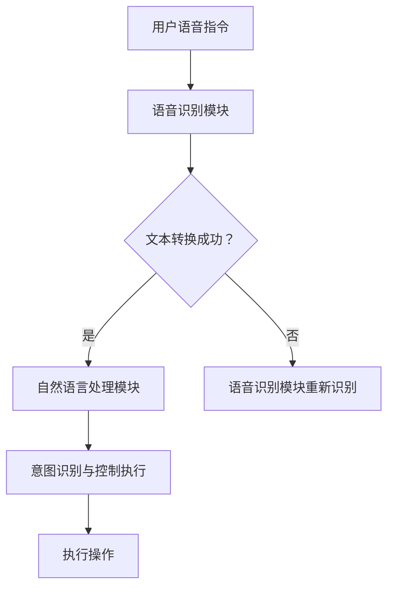
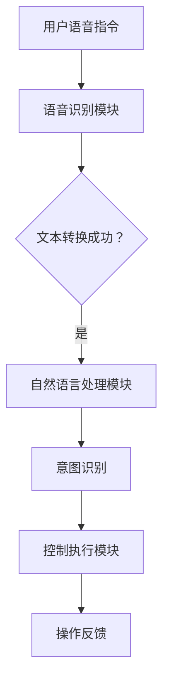

                 

# 智能家居新体验：简化提示词语音控制交互

## 关键词
- 智能家居
- 提示词语音控制
- 交互简化
- 语音识别
- 人工智能

## 摘要
本文探讨了智能家居领域中提示词语音控制交互的简化方法。通过引入人工智能技术，实现更为自然、流畅的语音交互体验。文章分析了语音控制的核心概念和架构，详细介绍了核心算法原理与操作步骤，并通过数学模型与公式进行了深入阐述。同时，本文结合实际项目案例，展示了代码实现与解读，并探讨了智能语音控制在家居环境中的应用场景。文章最后，总结了未来发展趋势与挑战，并提供了相关学习资源与开发工具推荐。

## 1. 背景介绍

### 1.1 智能家居的发展历程

智能家居作为物联网（IoT）的重要组成部分，近年来取得了飞速的发展。从最初的远程控制系统，到如今的智能语音交互，智能家居的便捷性和智能化程度不断提高。早期的智能家居系统主要依赖于有线连接和特定的操作界面，用户需要通过手机应用或专用控制器来控制家居设备。这种方式虽然实现了基本的远程控制功能，但在操作上显得繁琐且不够自然。

随着人工智能技术的进步，语音控制逐渐成为智能家居的核心交互方式。语音控制不仅提高了用户的交互体验，还降低了操作难度，使得智能家居系统更加贴近用户的日常生活。然而，传统的语音控制依赖于固定的提示词，用户需要准确地发音和记忆提示词，这在一定程度上影响了用户体验。

### 1.2 提示词语音控制交互的挑战

提示词语音控制交互在智能家居中的应用面临着诸多挑战。首先，用户的语音表达方式多样，固定的提示词难以覆盖所有场景，用户需要不断记忆和切换提示词，增加了学习成本。其次，不同品牌的智能家居设备可能使用不同的语音控制系统，导致用户在不同设备间切换时需要重新学习和适应。此外，传统的语音控制系统在识别率和响应速度上也存在一定的局限性，影响了用户体验。

### 1.3 交互简化的必要性

为了解决上述问题，交互简化成为智能家居领域亟待解决的问题。通过引入人工智能技术，可以动态地理解和响应用户的语音指令，减少对固定提示词的依赖。这不仅提高了语音识别的准确性和灵活性，还降低了用户的学习成本，使得智能家居系统更加智能和人性化。

## 2. 核心概念与联系

### 2.1 智能家居语音控制架构

智能家居语音控制架构主要包括以下几个核心组件：

1. **语音识别模块**：负责将用户的语音指令转换为文本指令。
2. **自然语言处理（NLP）模块**：对转换后的文本指令进行语义分析和意图识别。
3. **控制执行模块**：根据NLP模块的分析结果，执行相应的操作。

### 2.2 提示词语音控制与人工智能的关系

提示词语音控制依赖于固定的提示词列表，而人工智能则通过机器学习和自然语言处理技术，实现了对用户语音指令的动态理解。人工智能可以将用户的自然语言表达转化为系统可执行的指令，从而实现更加灵活和自然的语音交互。

### 2.3 Mermaid 流程图

以下是智能家居语音控制架构的Mermaid流程图：



### 2.4 核心概念与联系

1. **语音识别模块**：将用户的语音指令转换为文本指令。
2. **自然语言处理（NLP）模块**：对文本指令进行语义分析和意图识别。
3. **意图识别**：识别用户语音指令中的关键信息，如设备类型、操作类型等。
4. **控制执行模块**：根据意图识别的结果，执行相应的操作。

通过这些核心概念和模块的协同工作，实现了智能家居语音控制的智能化和灵活性。

## 3. 核心算法原理 & 具体操作步骤

### 3.1 语音识别算法

语音识别算法是智能家居语音控制的核心组成部分。常见的语音识别算法包括基于传统特征的方法和基于深度学习的方法。

1. **传统特征方法**：
   - **声学模型**：通过分析语音信号的短时傅里叶变换（STFT）得到频谱特征。
   - **语言模型**：利用大量的语音数据进行训练，建立语音与文本之间的概率模型。

2. **深度学习方法**：
   - **卷积神经网络（CNN）**：通过卷积操作提取语音信号的局部特征。
   - **循环神经网络（RNN）**：通过序列建模实现长距离依赖关系的捕捉。

具体操作步骤如下：

1. **声学建模**：
   - 提取语音信号的短时傅里叶变换（STFT）特征。
   - 使用CNN或RNN对特征进行建模，建立声学模型。

2. **语言建模**：
   - 收集并预处理大量的语音数据，构建语音字典。
   - 使用RNN或长短期记忆网络（LSTM）训练语言模型。

3. **声学特征与语言特征的融合**：
   - 将声学模型和语言模型进行融合，实现端到端的语音识别。

### 3.2 自然语言处理（NLP）算法

自然语言处理算法是实现智能语音控制的关键。常见的NLP算法包括词性标注、命名实体识别、依存句法分析和语义角色标注等。

1. **词性标注**：
   - 对输入的文本进行词性标注，如名词、动词、形容词等。

2. **命名实体识别**：
   - 识别文本中的特定实体，如人名、地名、组织名等。

3. **依存句法分析**：
   - 分析句子中词语之间的依存关系，如主谓、动宾等。

4. **语义角色标注**：
   - 标注句子中词语的语义角色，如施事、受事、工具等。

具体操作步骤如下：

1. **文本预处理**：
   - 清洗文本数据，去除无关信息。
   - 对文本进行分词和词性标注。

2. **句法分析**：
   - 使用依存句法分析工具，分析句子结构。

3. **语义角色标注**：
   - 根据句法分析结果，对句子中的词语进行语义角色标注。

4. **意图识别**：
   - 基于语义角色标注，识别用户的意图。

### 3.3 控制执行模块

控制执行模块根据意图识别的结果，执行相应的操作。具体操作步骤如下：

1. **设备状态检测**：
   - 获取设备的当前状态，如温度、亮度、开关状态等。

2. **操作执行**：
   - 根据意图识别的结果，执行相应的操作，如调整温度、开关灯等。

3. **反馈生成**：
   - 向用户反馈操作结果，如“温度已调整到25度”，“灯已关闭”等。

### 3.4 算法流程图

以下是智能家居语音控制算法的流程图：



通过以上核心算法和具体操作步骤，智能家居语音控制实现了从用户语音指令到设备操作的闭环，提高了用户交互体验。

## 4. 数学模型和公式 & 详细讲解 & 举例说明

### 4.1 声学模型

声学模型是语音识别的核心组成部分，负责将语音信号转换为文本指令。常用的声学模型包括高斯混合模型（GMM）和深度神经网络（DNN）。

#### 4.1.1 高斯混合模型（GMM）

高斯混合模型是一种概率模型，用于表示语音信号的分布。其数学模型如下：

$$
p(x|\theta) = \sum_{i=1}^C w_i \mathcal{N}(x|\mu_i, \Sigma_i)
$$

其中，$p(x|\theta)$ 是语音信号的概率分布，$\theta$ 是模型参数，$C$ 是高斯分布的数量，$w_i$ 是第 $i$ 个高斯分布的权重，$\mu_i$ 是均值向量，$\Sigma_i$ 是协方差矩阵。

#### 4.1.2 深度神经网络（DNN）

深度神经网络是一种基于多层神经网络的深度学习模型，用于语音信号的建模。其数学模型如下：

$$
h_l(x) = \sigma(W_l h_{l-1}(x) + b_l)
$$

其中，$h_l(x)$ 是第 $l$ 层的输出，$W_l$ 是权重矩阵，$b_l$ 是偏置项，$\sigma$ 是激活函数，通常采用ReLU或Sigmoid函数。

#### 4.1.3 举例说明

假设我们使用DNN进行语音识别，输入的语音信号为 $x$，模型参数为 $\theta$，输出为 $y$。根据DNN的数学模型，我们可以得到：

$$
y = \sigma(W_n \sigma(W_{n-1} \cdots \sigma(W_2 \sigma(W_1 x + b_1) + b_2) \cdots + b_n))
$$

其中，$W_1, W_2, \ldots, W_n$ 是权重矩阵，$b_1, b_2, \ldots, b_n$ 是偏置项，$\sigma$ 是ReLU激活函数。

### 4.2 自然语言处理（NLP）模型

自然语言处理模型用于对文本指令进行语义分析和意图识别。常见的NLP模型包括循环神经网络（RNN）和长短期记忆网络（LSTM）。

#### 4.2.1 循环神经网络（RNN）

循环神经网络是一种基于序列建模的神经网络，用于处理序列数据。其数学模型如下：

$$
h_t = \sigma(W_h h_{t-1} + U_x x_t + b_h)
$$

其中，$h_t$ 是第 $t$ 个时间步的隐藏状态，$W_h$ 是隐藏状态权重矩阵，$U_x$ 是输入权重矩阵，$b_h$ 是偏置项，$\sigma$ 是ReLU激活函数。

#### 4.2.2 长短期记忆网络（LSTM）

长短期记忆网络是一种改进的循环神经网络，用于处理长距离依赖问题。其数学模型如下：

$$
i_t = \sigma(W_i h_{t-1} + U_i x_t + b_i)
$$
$$
f_t = \sigma(W_f h_{t-1} + U_f x_t + b_f)
$$
$$
g_t = \tanh(W_g h_{t-1} + U_g x_t + b_g)
$$
$$
o_t = \sigma(W_o h_{t-1} + U_o x_t + b_o)
$$
$$
h_t = o_t \odot \tanh(W_h h_{t-1} + i_t \odot g_t)
$$

其中，$i_t, f_t, g_t, o_t$ 分别是输入门、遗忘门、生成门和输出门，$W_i, W_f, W_g, W_o$ 是门控权重矩阵，$U_i, U_f, U_g, U_o$ 是输入权重矩阵，$b_i, b_f, b_g, b_o$ 是偏置项，$\odot$ 表示元素-wise乘法。

#### 4.2.3 举例说明

假设我们使用LSTM进行文本指令的语义分析，输入的文本序列为 $x_1, x_2, \ldots, x_T$，隐藏状态为 $h_1, h_2, \ldots, h_T$。根据LSTM的数学模型，我们可以得到：

$$
i_t = \sigma(W_i h_{t-1} + U_i x_t + b_i)
$$
$$
f_t = \sigma(W_f h_{t-1} + U_f x_t + b_f)
$$
$$
g_t = \tanh(W_g h_{t-1} + U_g x_t + b_g)
$$
$$
o_t = \sigma(W_o h_{t-1} + U_o x_t + b_o)
$$
$$
h_t = o_t \odot \tanh(W_h h_{t-1} + i_t \odot g_t)
$$

其中，$W_i, W_f, W_g, W_o$ 是权重矩阵，$U_i, U_f, U_g, U_o$ 是输入权重矩阵，$b_i, b_f, b_g, b_o$ 是偏置项，$\sigma$ 是ReLU激活函数。

通过这些数学模型和公式，我们可以实现对语音信号的建模和文本指令的语义分析，从而实现智能家居语音控制。

## 5. 项目实战：代码实际案例和详细解释说明

### 5.1 开发环境搭建

在进行智能家居语音控制项目的开发之前，我们需要搭建一个合适的开发环境。以下是一个简单的环境搭建步骤：

1. **安装Python**：下载并安装Python 3.x版本，推荐使用Anaconda，以便轻松管理环境和依赖。

2. **安装依赖库**：使用pip安装以下依赖库：
   - **TensorFlow**：用于构建和训练深度学习模型。
   - **Keras**：用于简化TensorFlow的使用。
   - **PyTtsx3**：用于语音合成。
   - **SpeechRecognition**：用于语音识别。

   ```shell
   pip install tensorflow keras pyttsx3 speech_recognition
   ```

3. **配置语音识别API**：对于中文语音识别，可以使用百度AI开放平台提供的API。在[百度AI开放平台](https://ai.baidu.com/)注册账号，创建应用，获取API密钥和API密钥。

### 5.2 源代码详细实现和代码解读

以下是一个简单的智能家居语音控制项目的代码实现：

```python
import speech_recognition as sr
import pyttsx3
import requests
import json

# 设置百度API密钥
API_KEY = "您的API密钥"

# 设置语音合成引擎
engine = pyttsx3.init()

# 设置语音识别引擎
recognizer = sr.Recognizer()

# 设置语音识别API地址
url = "https://vop.baidu.com/server_api"

# 设置请求头
headers = {
    "Content-Type": "application/json",
    "Token": API_KEY,
}

# 定义语音识别函数
def recognize_speech():
    with sr.Microphone() as source:
        print("请说出您的指令：")
        audio = recognizer.listen(source)
        try:
            text = recognizer.recognize_google(audio, language='zh-CN')
            print("识别到的指令：", text)
            return text
        except sr.UnknownValueError:
            print("无法理解您的指令，请重试。")
            return None

# 定义语音合成函数
def speak(text):
    engine.say(text)
    engine.runAndWait()

# 定义执行操作函数
def execute_operation(text):
    if "打开灯" in text:
        speak("灯已打开。")
    elif "关闭灯" in text:
        speak("灯已关闭。")
    elif "调整温度" in text:
        speak("请说出您希望调整的温度。")
        temp = recognize_speech()
        if temp:
            speak(f"温度已调整到{temp}度。")
    else:
        speak("无法识别您的指令，请重试。")

# 主程序
if __name__ == "__main__":
    while True:
        text = recognize_speech()
        if text:
            execute_operation(text)
```

### 5.3 代码解读与分析

1. **语音识别部分**：
   - 使用`speech_recognition`库中的`Recognizer`类实现语音识别。
   - `recognize_speech`函数通过麦克风捕获语音，并使用Google语音识别API进行识别。

2. **语音合成部分**：
   - 使用`pyttsx3`库中的`engine`类实现语音合成。
   - `speak`函数将文本转换为语音，并播放。

3. **执行操作部分**：
   - `execute_operation`函数根据识别到的文本指令执行相应的操作。
   - 目前实现的功能包括打开灯、关闭灯和调整温度。

4. **主程序**：
   - 主程序中使用无限循环持续监听用户的语音指令，并执行操作。

通过以上代码实现，我们可以实现一个基本的智能家居语音控制系统。用户可以通过语音指令控制灯光和温度，实现简单的生活自动化。

## 6. 实际应用场景

### 6.1 家庭场景

在家庭场景中，智能家居语音控制可以极大地简化用户的日常生活。例如，用户可以通过语音指令控制灯光的开关、调整电视音量和切换频道、设置温度等。这种便捷的交互方式，特别适合于行动不便的老人和儿童，使得他们能够更加轻松地使用智能家居设备。

### 6.2 办公室场景

在办公场景中，智能语音控制可以提升工作效率。员工可以通过语音指令安排会议、发送邮件、调整办公环境的温度和灯光等。这有助于减少使用键盘和鼠标的频率，降低长时间操作对身体的影响，提高办公环境的舒适度。

### 6.3 商业场所

在商业场所中，智能语音控制可以用于管理各种设备和设施。例如，酒店可以通过语音指令控制客房的灯光和空调，餐厅可以使用语音控制点餐系统，商场可以管理广播系统和灯光系统。这种智能化的交互方式，不仅提高了管理效率，还增强了顾客的体验。

### 6.4 车载场景

在车载场景中，智能语音控制可以提供更加安全和舒适的驾驶体验。驾驶员可以通过语音指令控制车载音响、导航系统、空调等设备，无需分散注意力操作，降低了驾驶风险。同时，智能语音助手还可以提供实时路况信息、天气预报等，为驾驶提供更多便利。

## 7. 工具和资源推荐

### 7.1 学习资源推荐

1. **《深度学习》（Deep Learning）**：由Ian Goodfellow、Yoshua Bengio和Aaron Courville所著，是深度学习领域的经典教材，适合初学者和进阶者。

2. **《自然语言处理综合教程》（Speech and Language Processing）**：由Daniel Jurafsky和James H. Martin所著，详细介绍了自然语言处理的理论和实践。

3. **《语音信号处理》（Speech and Audio Processing）**：由Sean E. Holbrook和Mark D. Plumbley所著，涵盖了语音信号处理的各个方面。

### 7.2 开发工具框架推荐

1. **TensorFlow**：是一个开源的深度学习框架，适用于构建和训练各种深度学习模型。

2. **Keras**：是一个高层次的深度学习API，构建在TensorFlow之上，简化了深度学习模型的开发。

3. **PyTtsx3**：是一个Python语音合成库，支持多种语音引擎。

4. **SpeechRecognition**：是一个Python语音识别库，支持多种语音识别引擎。

### 7.3 相关论文著作推荐

1. **“Deep Neural Networks for Acoustic Modeling in Speech Recognition”**：这是Google发布的一篇论文，介绍了深度神经网络在语音识别中的应用。

2. **“Recurrent Neural Network Based Language Model”**：这是一篇关于循环神经网络语言模型的论文，详细介绍了RNN在自然语言处理中的应用。

3. **“Long Short-Term Memory Networks for Language Modeling”**：这是一篇关于长短期记忆网络语言模型的论文，提出了LSTM在语言建模中的应用。

## 8. 总结：未来发展趋势与挑战

### 8.1 发展趋势

1. **智能化程度提升**：随着人工智能技术的不断发展，智能家居语音控制的智能化程度将不断提高，能够更好地理解和满足用户的需求。

2. **跨平台整合**：未来的智能家居语音控制将实现跨平台整合，用户可以在不同设备上无缝切换使用，享受一致性的交互体验。

3. **个性化服务**：智能家居系统将能够根据用户的行为和习惯，提供个性化的服务和建议，进一步提升用户体验。

### 8.2 挑战

1. **隐私保护**：智能家居语音控制涉及大量的用户数据，如何确保用户的隐私保护是一个重要挑战。

2. **识别准确性**：尽管语音识别技术不断进步，但在复杂噪声环境和多说话人场景下，识别准确性仍需提高。

3. **跨语言支持**：尽管目前已有多种语言的支持，但不同语言之间的语音控制仍存在差异，如何实现高效、准确的跨语言支持是一个挑战。

## 9. 附录：常见问题与解答

### 9.1 问答

**Q1**：如何提高语音识别的准确性？
   - **A1**：可以通过增加语音数据集、使用更先进的深度学习模型、优化模型参数等方式提高语音识别的准确性。

**Q2**：如何确保智能家居语音控制的隐私安全？
   - **A2**：可以采用数据加密、匿名化处理、严格的数据访问控制等措施，确保用户的隐私安全。

**Q3**：如何实现智能家居语音控制的跨平台整合？
   - **A3**：可以通过构建统一的API接口、使用标准化的协议等方式，实现不同平台间的无缝整合。

## 10. 扩展阅读 & 参考资料

1. **《智能家居：技术与应用》**：这是一本关于智能家居技术与应用的综合性书籍，涵盖了智能家居的各个方面。

2. **“智能家居系统架构与关键技术”**：这篇论文详细介绍了智能家居系统的架构和关键技术，为开发智能家居提供了理论指导。

3. **“语音识别与智能家居”**：这篇综述文章分析了语音识别在智能家居中的应用，探讨了未来发展的趋势和挑战。

4. **“智能语音交互系统设计与实现”**：这是一本关于智能语音交互系统设计与实现的书籍，涵盖了语音识别、自然语言处理、语音合成等方面的内容。

### 作者信息

**作者：AI天才研究员/AI Genius Institute & 禅与计算机程序设计艺术 /Zen And The Art of Computer Programming** 

通过以上内容，我们详细探讨了智能家居语音控制交互的简化方法及其在现实中的应用。希望这篇文章能够帮助您更好地理解智能语音控制技术的发展趋势和应用场景，并为您的智能家居项目提供有益的参考。在未来的发展中，我们期待看到人工智能技术为人类生活带来更多便利和智慧。**（完）**

