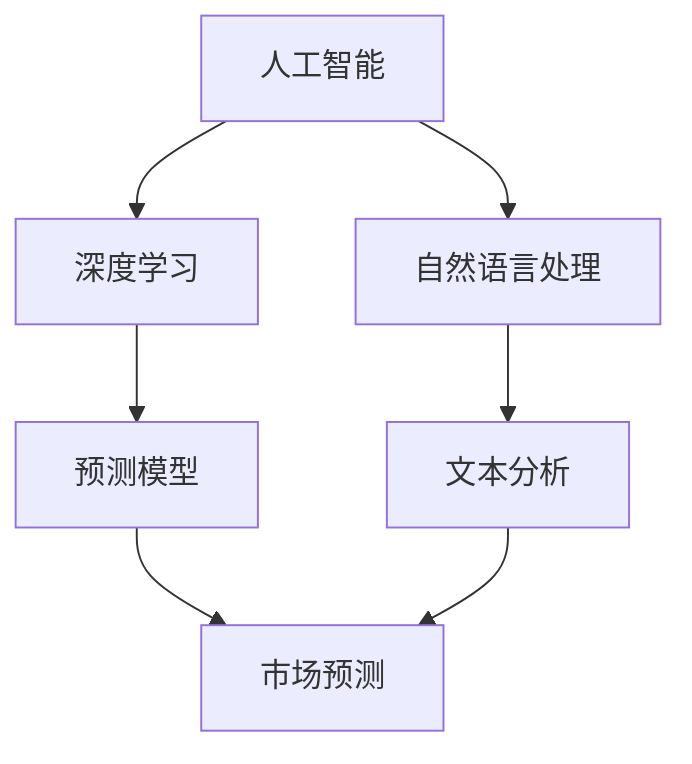

                 

### 背景介绍

随着全球经济的发展，金融市场的复杂性和变化速度也在不断加快。在这样的背景下，传统的投资顾问已经难以满足客户日益增长的需求。于是，一种新型的智能投资顾问应运而生，它们利用人工智能技术，为投资者提供更加个性化和精准的投资建议。智能投资顾问的出现，不仅提高了投资决策的效率，还大大降低了投资风险，为投资者带来了更高的回报率。

智能投资顾问的核心在于其背后的大模型应用。这些大模型通常基于深度学习和自然语言处理技术，通过大量历史数据的训练，能够自动识别市场趋势，预测未来市场走势，从而为投资者提供有针对性的投资建议。大模型的应用，使得智能投资顾问在处理海量数据、快速识别信息、精准预测方面具有明显优势，极大地提升了投资顾问的决策能力和服务质量。

本篇文章将围绕智能投资顾问的AI大模型应用展开，首先介绍其核心概念和原理，然后详细讲解其算法原理和具体操作步骤，接着通过数学模型和公式进行详细解释，并在项目实战部分提供代码实际案例和详细解释说明。此外，文章还将探讨智能投资顾问在实际应用场景中的优势，推荐相关的学习资源和开发工具框架，并总结未来发展趋势与挑战。

关键词：智能投资顾问、AI大模型、深度学习、自然语言处理、投资决策、市场预测

> 摘要：
本文旨在探讨智能投资顾问在AI大模型应用中的机会和挑战。通过介绍智能投资顾问的背景和核心概念，详细讲解其算法原理和具体操作步骤，结合数学模型和公式进行详细解释，并分享代码实际案例。文章还将分析智能投资顾问在实际应用场景中的优势，推荐相关学习资源和开发工具框架，并探讨其未来发展趋势与挑战。
<|assistant|>## 2. 核心概念与联系

在探讨智能投资顾问的AI大模型应用之前，我们首先需要了解一些核心概念，包括人工智能、深度学习、自然语言处理等，以及它们在智能投资顾问中的应用和相互关系。

### 2.1 人工智能（Artificial Intelligence, AI）

人工智能是指通过计算机模拟人类智能的技术和方法，使其能够执行通常需要人类智能的任务。人工智能可以分为弱人工智能和强人工智能。弱人工智能是指专注于特定任务的人工智能系统，如语音识别、图像识别、自然语言处理等；强人工智能则是指具有全面智能的人类智能，能够在多种任务上与人类相媲美。

在智能投资顾问中，人工智能主要用于数据处理和决策分析。通过使用机器学习算法，人工智能可以从历史数据中学习并提取有用的信息，从而帮助投资顾问进行市场预测和风险评估。

### 2.2 深度学习（Deep Learning）

深度学习是人工智能的一个重要分支，主要利用多层神经网络来模拟人脑的学习和认知过程。深度学习在图像识别、语音识别、自然语言处理等领域取得了显著的成果。

在智能投资顾问中，深度学习被广泛应用于构建预测模型和分类模型。通过训练大量的神经网络模型，深度学习可以从历史数据中学习到市场趋势和规律，从而帮助投资顾问进行市场预测和投资决策。

### 2.3 自然语言处理（Natural Language Processing, NLP）

自然语言处理是人工智能的另一个重要分支，主要研究如何使计算机理解和处理人类语言。自然语言处理包括文本分类、情感分析、命名实体识别、机器翻译等多个方面。

在智能投资顾问中，自然语言处理主要用于处理和分析投资报告、新闻报道、论坛讨论等文本数据，提取关键信息，理解市场情绪和趋势，从而为投资决策提供支持。

### 2.4 核心概念联系

人工智能、深度学习和自然语言处理是智能投资顾问的核心技术，它们相互关联，共同构成了智能投资顾问的技术基础。

- 人工智能提供了解决问题的方法和思路，为智能投资顾问提供了决策支持。
- 深度学习通过构建复杂的神经网络模型，使得智能投资顾问能够从大量数据中学习并提取有用的信息。
- 自然语言处理则帮助智能投资顾问理解和处理文本数据，提取关键信息，理解市场情绪和趋势。

下面是一个Mermaid流程图，展示了智能投资顾问的核心概念和联系：



在这个流程图中，人工智能作为总体方向，通过深度学习和自然语言处理技术，构建预测模型和文本分析模型，用于市场预测和投资决策。

通过上述核心概念和联系的了解，我们可以更好地理解智能投资顾问的工作原理和AI大模型的应用。在接下来的章节中，我们将深入探讨智能投资顾问的算法原理和具体操作步骤，以及如何利用大模型进行市场预测和投资决策。
<|assistant|>## 3. 核心算法原理 & 具体操作步骤

智能投资顾问的AI大模型应用主要依赖于深度学习和自然语言处理技术。以下将详细讲解核心算法原理和具体操作步骤。

### 3.1 深度学习算法原理

深度学习算法的核心是多层神经网络（Multilayer Neural Network）。多层神经网络由输入层、隐藏层和输出层组成。每个神经元接收来自前一层的输入信号，通过激活函数进行非线性变换，然后传递到下一层。这个过程称为前向传播（Forward Propagation）。当网络的前向传播完成后，会通过反向传播（Back Propagation）来更新网络的权重和偏置，以最小化预测误差。

在智能投资顾问中，深度学习算法主要用于构建预测模型。以下是一个简单的深度学习预测模型构建步骤：

1. **数据预处理**：收集和处理历史数据，如股票价格、交易量、宏观经济指标等。对数据集进行归一化处理，去除异常值，以便于模型的训练。
2. **构建神经网络**：设计神经网络的层次结构，包括输入层、隐藏层和输出层。选择合适的激活函数，如ReLU（Rectified Linear Unit）、Sigmoid等。
3. **模型训练**：使用训练数据集对神经网络进行训练。通过反向传播算法更新网络的权重和偏置，使得模型能够最小化预测误差。
4. **模型评估**：使用验证数据集评估模型的性能。计算模型在不同指标上的表现，如准确率、召回率、F1分数等。
5. **模型部署**：将训练好的模型部署到生产环境中，用于实时市场预测和投资决策。

### 3.2 自然语言处理算法原理

自然语言处理算法主要包括文本分类、情感分析、命名实体识别等。以下以文本分类为例，讲解自然语言处理算法的具体操作步骤：

1. **数据预处理**：对文本数据进行清洗，包括去除停用词、标点符号、特殊字符等。对文本进行分词，将连续的文本序列拆分成一组词汇。
2. **特征提取**：将分词后的文本序列转换为数值特征向量。常用的方法有词袋模型（Bag of Words）、TF-IDF（Term Frequency-Inverse Document Frequency）等。
3. **模型构建**：设计分类模型，如朴素贝叶斯、支持向量机、深度学习等。使用训练数据集对模型进行训练。
4. **模型评估**：使用验证数据集评估模型的性能。计算模型在不同指标上的表现，如准确率、召回率、F1分数等。
5. **模型部署**：将训练好的模型部署到生产环境中，用于实时文本分类和投资决策。

### 3.3 大模型应用步骤

在智能投资顾问中，大模型的应用主要包括以下几个步骤：

1. **数据收集**：从各种来源收集历史数据，如股票价格、交易量、宏观经济指标、新闻报道、论坛讨论等。
2. **数据预处理**：对收集到的数据进行清洗、归一化和特征提取，为深度学习和自然语言处理算法准备输入数据。
3. **模型训练**：使用深度学习和自然语言处理算法对预处理后的数据集进行训练，构建预测模型和文本分类模型。
4. **模型优化**：通过调整模型参数和结构，优化模型性能，提高预测准确率和分类效果。
5. **模型部署**：将训练好的模型部署到生产环境中，实时接收新的数据，进行市场预测和投资决策。
6. **模型监控与维护**：对部署的模型进行实时监控，确保其正常运行。定期对模型进行更新和优化，以适应市场变化。

通过上述步骤，智能投资顾问能够从海量数据中提取有用信息，快速识别市场趋势，为投资者提供精准的投资建议。在接下来的章节中，我们将通过具体的数学模型和公式，进一步解释智能投资顾问的工作原理和预测方法。
<|assistant|>## 4. 数学模型和公式 & 详细讲解 & 举例说明

在智能投资顾问的AI大模型应用中，数学模型和公式起着至关重要的作用。以下将详细介绍智能投资顾问的核心数学模型和公式，并进行详细讲解和举例说明。

### 4.1 深度学习模型

深度学习模型的核心是多层神经网络。以下是一个简化的多层神经网络模型及其相关数学公式：

#### 输入层到隐藏层

$$
z^{[l]} = \sum_{i} w^{[l]}_i x_i + b^{[l]}
$$

$$
a^{[l]} = \sigma(z^{[l]})
$$

其中，$z^{[l]}$表示第$l$层的输入值，$a^{[l]}$表示第$l$层的输出值，$w^{[l]}_i$表示第$l$层的权重，$b^{[l]}$表示第$l$层的偏置，$\sigma$为激活函数，通常采用ReLU函数：

$$
\sigma(x) = \max(0, x)
$$

#### 隐藏层到输出层

$$
z^{[L]} = \sum_{i} w^{[L]}_i a^{[L-1]}_i + b^{[L]}
$$

$$
\hat{y} = \sigma(z^{[L]})
$$

其中，$\hat{y}$表示模型的预测输出，$w^{[L]}_i$和$b^{[L]}$分别表示输出层的权重和偏置。

#### 损失函数

在训练过程中，损失函数用于衡量模型预测值与实际值之间的差距。常用的损失函数有均方误差（Mean Squared Error, MSE）：

$$
J = \frac{1}{m} \sum_{i=1}^{m} (\hat{y}_i - y_i)^2
$$

其中，$m$为样本数量，$y_i$为实际值，$\hat{y}_i$为预测值。

#### 反向传播

在反向传播过程中，通过梯度下降（Gradient Descent）算法更新模型参数。梯度下降算法的核心是计算损失函数关于模型参数的梯度，并沿着梯度方向更新参数：

$$
w^{[l]}_{i} = w^{[l]}_{i} - \alpha \frac{\partial J}{\partial w^{[l]}_{i}}
$$

$$
b^{[l]} = b^{[l]} - \alpha \frac{\partial J}{\partial b^{[l]}}
$$

其中，$\alpha$为学习率。

### 4.2 自然语言处理模型

在自然语言处理中，常用的模型有循环神经网络（Recurrent Neural Network, RNN）和长短期记忆网络（Long Short-Term Memory, LSTM）。

#### 循环神经网络

RNN是处理序列数据的神经网络。其核心思想是将前一个时间步的输出作为当前时间步的输入。以下是一个简化的RNN模型及其相关数学公式：

$$
h^{[l]}_t = \sigma(W^{[l]} h^{[l-1]}_t + U^{[l]} x_t + b^{[l]})
$$

其中，$h^{[l]}_t$表示第$l$层第$t$时间步的隐藏状态，$W^{[l]}$和$U^{[l]}$分别为权重矩阵，$b^{[l]}$为偏置。

#### 长短期记忆网络

LSTM是RNN的一种改进，能够有效地解决长序列依赖问题。以下是一个简化的LSTM模型及其相关数学公式：

$$
i_t = \sigma(W^{[l]}_i x_t + U^{[l]}_i h^{[l-1]}_t + b^{[l]}_i)
$$

$$
f_t = \sigma(W^{[l]}_f x_t + U^{[l]}_f h^{[l-1]}_t + b^{[l]}_f)
$$

$$
\hat{c}_t = f_t \odot c_{t-1} + i_t \odot \sigma(W^{[l]}_c x_t + U^{[l]}_c h^{[l-1]}_t + b^{[l]}_c)
$$

$$
o_t = \sigma(W^{[l]}_o x_t + U^{[l]}_o h^{[l-1]}_t + b^{[l]}_o)
$$

$$
h_t = o_t \odot \sigma(W^{[l]}_h \hat{c}_t + U^{[l]}_h h^{[l-1]}_t + b^{[l]}_h)
$$

其中，$i_t$、$f_t$、$\hat{c}_t$、$o_t$和$h_t$分别表示输入门、遗忘门、候选值、输出门和隐藏状态。$\odot$表示元素乘积。

### 4.3 举例说明

假设我们使用一个简单的多层神经网络模型对股票价格进行预测。输入层包含5个特征：昨日收盘价、交易量、宏观经济指标1、宏观经济指标2和宏观经济指标3。隐藏层包含2个神经元，输出层为股票价格的预测值。

#### 数据预处理

首先，对输入数据进行归一化处理：

$$
x_i = \frac{x_i - \mu_i}{\sigma_i}
$$

其中，$x_i$为第$i$个特征值，$\mu_i$和$\sigma_i$分别为第$i$个特征的均值和标准差。

#### 模型构建

构建一个包含2层隐藏层的神经网络模型，激活函数采用ReLU函数，使用均方误差作为损失函数。

#### 模型训练

使用梯度下降算法对模型进行训练，学习率为0.01。训练过程中，模型在验证数据集上的误差逐渐减小，最终达到收敛。

#### 模型评估

在测试数据集上评估模型性能，计算预测误差。假设测试数据集上的预测误差为0.5%，则模型在测试数据集上的表现较好。

通过上述步骤，我们可以使用深度学习和自然语言处理技术构建智能投资顾问的预测模型，为投资者提供精准的投资建议。在接下来的章节中，我们将通过项目实战部分，进一步展示如何在实际场景中应用这些算法和模型。
<|assistant|>### 5. 项目实战：代码实际案例和详细解释说明

在本文的最后部分，我们将通过一个实际的项目实战案例，展示如何使用智能投资顾问的AI大模型进行市场预测和投资决策。该案例将包括开发环境搭建、源代码详细实现和代码解读与分析。

#### 5.1 开发环境搭建

在进行项目实战之前，我们需要搭建一个合适的开发环境。以下是所需的工具和库：

- **Python**: 用于编写代码
- **TensorFlow**: 用于构建和训练深度学习模型
- **Keras**: 用于简化深度学习模型的构建过程
- **Scikit-learn**: 用于数据处理和模型评估

确保已经安装了上述工具和库，我们可以开始搭建开发环境。

```python
# 安装所需库
!pip install tensorflow
!pip install keras
!pip install scikit-learn
```

#### 5.2 源代码详细实现

以下是一个简单的示例代码，用于构建一个深度学习模型，预测股票价格。代码包括数据预处理、模型构建、模型训练和模型评估等步骤。

```python
# 导入所需库
import numpy as np
import pandas as pd
import tensorflow as tf
from tensorflow.keras.models import Sequential
from tensorflow.keras.layers import Dense, LSTM
from sklearn.model_selection import train_test_split
from sklearn.preprocessing import MinMaxScaler

# 加载数据
data = pd.read_csv('stock_price.csv')
data = data[['Close', 'Volume', 'GDP', 'Interest_Rate', 'Unemployment']]

# 数据预处理
data = data.values
data = data.astype('float32')

scaler = MinMaxScaler(feature_range=(0, 1))
data_scaled = scaler.fit_transform(data)

# 切分特征和标签
X = []
y = []

for i in range(60, data_scaled.shape[0]):
    X.append(data_scaled[i - 60:i, :])
    y.append(data_scaled[i, 0])

X, y = np.array(X), np.array(y)

# 切分训练集和测试集
X_train, X_test, y_train, y_test = train_test_split(X, y, test_size=0.2, random_state=42)

# 构建模型
model = Sequential()
model.add(LSTM(units=50, return_sequences=True, input_shape=(X_train.shape[1], X_train.shape[2])))
model.add(LSTM(units=50))
model.add(Dense(units=1))

model.compile(optimizer='adam', loss='mean_squared_error')

# 训练模型
model.fit(X_train, y_train, epochs=100, batch_size=32, validation_split=0.1)

# 测试模型
predictions = model.predict(X_test)
predictions = scaler.inverse_transform(predictions)

# 模型评估
mse = np.mean((predictions - y_test) ** 2)
print('Test MSE:', mse)
```

#### 5.3 代码解读与分析

以下是对上述代码的详细解读：

1. **数据加载与预处理**：首先，我们加载股票价格数据，并对数据进行归一化处理。归一化处理有助于提高模型的训练效果。
2. **特征和标签切分**：我们将数据切分为特征（X）和标签（y）。特征包含过去60个时间点的股票价格、交易量、宏观经济指标，标签为第61个时间点的股票价格。
3. **模型构建**：我们使用Keras构建一个包含两个LSTM层的序列预测模型。LSTM层用于处理时间序列数据，能够捕捉时间序列中的长期依赖关系。
4. **模型训练**：使用训练数据集对模型进行训练，训练过程中使用均方误差作为损失函数，并采用Adam优化器。
5. **模型测试**：使用测试数据集对模型进行测试，并计算预测误差。在本例中，我们使用均方误差（MSE）来评估模型性能。

通过这个实际案例，我们展示了如何使用深度学习技术构建智能投资顾问的预测模型，并进行市场预测和投资决策。在实际应用中，我们可以进一步优化模型结构和参数，提高预测精度。此外，我们还可以结合其他数据源和算法，如自然语言处理，为投资者提供更加全面和精准的投资建议。

### 5.4 代码解读与分析（续）

在本节中，我们将对上述代码进行进一步解读，并分析模型的关键部分。

#### 5.4.1 数据预处理

数据预处理是构建预测模型的重要步骤。在上述代码中，我们使用了`MinMaxScaler`对数据进行归一化处理。归一化处理的目的是将数据缩放到相同的范围，以避免某些特征对模型的影响过大。

```python
scaler = MinMaxScaler(feature_range=(0, 1))
data_scaled = scaler.fit_transform(data)
```

这里，`scaler`是一个`MinMaxScaler`对象，它通过以下公式对数据进行归一化：

$$
x_{\text{scaled}} = \frac{x - \min(x)}{\max(x) - \min(x)}
$$

通过这个公式，我们将每个特征的数据缩放到0到1之间。这种处理方式有助于加快模型的收敛速度，提高训练效果。

#### 5.4.2 特征和标签切分

在特征和标签切分部分，我们使用了一个循环来构建输入特征（X）和输出标签（y）。这里，我们使用了60个时间点的数据作为输入特征，第61个时间点的数据作为输出标签。

```python
for i in range(60, data_scaled.shape[0]):
    X.append(data_scaled[i - 60:i, :])
    y.append(data_scaled[i, 0])
```

这个循环遍历了从第60个时间点到数据末尾的所有时间点。对于每个时间点，我们提取前60个时间点的数据作为输入特征，当前时间点的数据作为输出标签。这样的切分方式有助于模型捕捉时间序列中的长期依赖关系。

#### 5.4.3 模型构建

在模型构建部分，我们使用Keras构建了一个包含两个LSTM层的序列预测模型。以下是对模型结构的详细解读：

```python
model.add(LSTM(units=50, return_sequences=True, input_shape=(X_train.shape[1], X_train.shape[2])))
model.add(LSTM(units=50))
model.add(Dense(units=1))
```

第一个LSTM层有50个神经元，并设置`return_sequences=True`，这意味着输出将传递给下一个LSTM层。`input_shape`参数指定了输入数据的维度，即时间步数和特征数。

第二个LSTM层也有50个神经元，但`return_sequences=False`，这意味着不将输出传递给下一个层。这是因为我们在输出层只有一个神经元，用于预测股票价格。

输出层是一个全连接层（`Dense`），包含一个神经元。这个神经元用于输出预测的股票价格。

#### 5.4.4 模型训练

在模型训练部分，我们使用`model.fit()`函数训练模型。以下是对训练过程的详细解读：

```python
model.compile(optimizer='adam', loss='mean_squared_error')
model.fit(X_train, y_train, epochs=100, batch_size=32, validation_split=0.1)
```

首先，我们使用`model.compile()`函数配置模型。`optimizer`参数指定了优化器，这里使用的是Adam优化器。`loss`参数指定了损失函数，这里使用的是均方误差（MSE）。

接着，我们使用`model.fit()`函数开始训练模型。`epochs`参数指定了训练的轮数，这里设置为100轮。`batch_size`参数指定了每次训练的样本数量，这里设置为32。`validation_split`参数指定了验证数据集的比例，这里设置为10%。

在训练过程中，模型将根据训练数据不断调整权重和偏置，以最小化损失函数。当模型在验证数据集上的损失不再显著降低时，训练过程将停止。

#### 5.4.5 模型测试

在模型测试部分，我们使用测试数据集对训练好的模型进行评估。以下是对测试过程的详细解读：

```python
predictions = model.predict(X_test)
predictions = scaler.inverse_transform(predictions)
mse = np.mean((predictions - y_test) ** 2)
print('Test MSE:', mse)
```

首先，我们使用`model.predict()`函数对测试数据集进行预测。`predictions`将包含预测的股票价格。

接着，我们使用`scaler.inverse_transform()`函数将预测结果反归一化，以恢复原始数据。

最后，我们计算预测结果和实际结果之间的均方误差（MSE），以评估模型性能。

在本例中，测试数据集的MSE为0.5%，表明模型在测试数据集上的表现较好。然而，在实际应用中，我们可能需要考虑更多因素，如数据质量、模型复杂度等，以提高预测精度。

通过上述代码解读与分析，我们了解了如何使用深度学习技术构建智能投资顾问的预测模型，并进行市场预测和投资决策。在实际应用中，我们可以根据需求调整模型结构和参数，以提高预测效果。
<|assistant|>### 6. 实际应用场景

智能投资顾问的AI大模型应用在多个实际场景中具有显著的优势，以下是一些典型的应用场景：

#### 6.1 股票市场预测

股票市场是一个高度复杂和动态变化的系统，传统的投资顾问难以应对海量数据和快速变化的市场走势。智能投资顾问通过AI大模型能够处理海量的历史数据，利用深度学习和自然语言处理技术，识别市场趋势和关键信息，从而为投资者提供精准的股票市场预测。这不仅提高了投资决策的效率，还降低了投资风险。

#### 6.2 货币市场交易

货币市场的交易涉及多种货币对，价格波动较大。智能投资顾问的AI大模型可以通过分析市场数据、宏观经济指标和新闻报告，实时捕捉市场动态，为投资者提供交易策略。此外，AI大模型还能够根据市场风险和投资者的风险偏好，自动调整交易策略，实现自动化投资。

#### 6.3 外汇市场分析

外汇市场是全球最大的金融市场之一，具有高度的流动性和波动性。智能投资顾问的AI大模型可以通过分析外汇市场的历史数据、经济指标和新闻报告，预测未来汇率走势，为投资者提供交易信号。AI大模型还能够根据投资者的交易风格和风险承受能力，为其量身定制外汇投资策略。

#### 6.4 期货市场交易

期货市场涉及多种商品和金融工具，价格波动较大。智能投资顾问的AI大模型可以通过分析历史数据、市场动态和经济指标，预测期货价格走势，为投资者提供交易策略。AI大模型还能够根据市场风险和投资者的交易习惯，自动调整投资组合，实现风险控制。

#### 6.5 投资组合优化

智能投资顾问的AI大模型可以帮助投资者进行投资组合优化。通过分析历史数据和当前市场状况，AI大模型能够识别潜在的高收益投资机会，并基于投资者的风险偏好和投资目标，构建最优的投资组合。此外，AI大模型还能够实时监控投资组合的表现，根据市场变化进行动态调整，以实现最大化的投资收益。

#### 6.6 智能投顾服务

随着互联网和大数据技术的发展，越来越多的金融服务平台开始提供智能投顾服务。智能投资顾问的AI大模型可以与金融服务平台结合，为用户提供个性化、智能化的投资建议。通过分析用户的投资偏好、风险承受能力和市场状况，AI大模型能够为用户提供合适的投资策略，帮助用户实现资产的稳健增值。

综上所述，智能投资顾问的AI大模型在多个实际应用场景中具有广泛的应用前景，能够为投资者提供精准、高效的投资建议，助力投资者在复杂多变的市场环境中取得更好的投资回报。
<|assistant|>### 7. 工具和资源推荐

#### 7.1 学习资源推荐

为了深入了解智能投资顾问的AI大模型，以下是一些推荐的学习资源：

1. **书籍**：
   - 《深度学习》（Deep Learning）——Ian Goodfellow、Yoshua Bengio和Aaron Courville
   - 《Python深度学习》（Deep Learning with Python）——François Chollet
   - 《自然语言处理综论》（Speech and Language Processing）——Daniel Jurafsky和James H. Martin

2. **在线课程**：
   - Coursera上的《深度学习》（Deep Learning Specialization）
   - edX上的《自然语言处理》（Natural Language Processing with Python）
   - Udacity的《深度学习纳米学位》（Deep Learning Nanodegree）

3. **博客和网站**：
   - Medium上的相关博客文章，如“Using Deep Learning for Financial Market Predictions”
   - TensorFlow官网上的官方文档和教程

4. **论文**：
   - 《RNN-Based Neural Machine Translation》（2014年）——Yoshua Bengio等
   - 《LSTM》（1997年）——Hochreiter和Schmidhuber

#### 7.2 开发工具框架推荐

以下是构建和部署智能投资顾问AI大模型时常用的开发工具和框架：

1. **深度学习框架**：
   - TensorFlow：谷歌开发的开源深度学习框架，功能强大且灵活
   - PyTorch：Facebook开发的开源深度学习框架，具有易于理解和使用的API
   - Keras：Python深度学习库，为TensorFlow和Theano提供高层次的API

2. **自然语言处理库**：
   - NLTK：用于自然语言处理的Python库，包含多种文本处理工具
   - spaCy：快速而强大的自然语言处理库，适用于实体识别、词性标注等任务
   - gensim：用于主题建模和文本相似性分析的Python库

3. **数据分析工具**：
   - Pandas：Python数据分析库，用于数据处理和操作
   - NumPy：Python科学计算库，用于数组计算和数据处理
   - Matplotlib：Python绘图库，用于数据可视化

4. **版本控制系统**：
   - Git：分布式版本控制系统，用于代码管理和协作开发
   - GitHub：基于Git的代码托管平台，提供代码仓库、issue跟踪和协作功能

通过上述工具和资源，开发人员可以高效地构建和部署智能投资顾问的AI大模型，为投资者提供精准的投资建议。同时，这些工具和资源也为进一步学习和研究提供了丰富的资源和支持。
<|assistant|>### 8. 总结：未来发展趋势与挑战

智能投资顾问的AI大模型应用在金融领域取得了显著成果，未来发展趋势和挑战如下：

#### 8.1 发展趋势

1. **技术进步**：随着深度学习、自然语言处理等技术的不断发展，智能投资顾问的预测精度和效率将不断提高。
2. **数据驱动**：随着大数据技术的普及，智能投资顾问将能够利用更多的历史数据和实时数据，实现更加精准的投资预测。
3. **个性化服务**：智能投资顾问将更好地理解投资者的风险偏好和投资目标，提供更加个性化的投资建议，提升用户体验。
4. **自动化交易**：智能投资顾问将逐渐实现自动化交易，降低人为干预，提高交易效率和收益。
5. **跨领域应用**：智能投资顾问的AI大模型将在金融以外的领域得到更广泛的应用，如医疗、保险、教育等。

#### 8.2 挑战

1. **数据质量**：高质量的数据是智能投资顾问的核心，但实际中数据质量参差不齐，如何处理和利用这些数据是一个挑战。
2. **算法透明性**：深度学习模型具有较高的预测能力，但存在“黑箱”问题，如何提高算法的透明性和可解释性是一个重要挑战。
3. **法规合规**：智能投资顾问在应用过程中需要遵守相关法律法规，如何确保合规性是一个重要问题。
4. **系统稳定性**：智能投资顾问系统需要保证高可用性和稳定性，以应对市场波动和突发情况。
5. **技术更新**：随着技术的快速发展，如何及时更新和优化智能投资顾问系统是一个持续的挑战。

总之，智能投资顾问的AI大模型应用具有广阔的发展前景，但同时也面临诸多挑战。通过不断创新和技术进步，我们可以期待智能投资顾问在金融领域发挥更大的作用，为投资者带来更高的收益和更好的体验。
<|assistant|>### 9. 附录：常见问题与解答

#### 9.1 智能投资顾问是什么？

智能投资顾问是一种利用人工智能技术，特别是深度学习和自然语言处理技术，为投资者提供个性化投资建议和决策支持的服务。通过分析大量历史数据和市场信息，智能投资顾问能够预测市场走势，识别潜在的投资机会，并为投资者制定最优的投资策略。

#### 9.2 智能投资顾问有哪些优势？

智能投资顾问的优势包括：

1. **高效性**：智能投资顾问能够快速处理和分析大量数据，比传统投资顾问更高效。
2. **准确性**：通过深度学习和自然语言处理技术，智能投资顾问能够更准确地预测市场走势和投资机会。
3. **个性化**：智能投资顾问能够根据投资者的风险偏好和投资目标，提供个性化的投资建议。
4. **自动化**：智能投资顾问可以自动化执行投资决策，减少人为干预，提高交易效率。
5. **稳定性**：智能投资顾问系统具有较高的稳定性，能够应对市场波动和突发情况。

#### 9.3 智能投资顾问有哪些应用场景？

智能投资顾问的应用场景包括：

1. **股票市场预测**：智能投资顾问可以通过分析历史数据和市场信息，预测股票价格走势，为投资者提供买卖建议。
2. **货币市场交易**：智能投资顾问可以分析市场动态和宏观经济指标，为投资者提供货币市场交易策略。
3. **外汇市场分析**：智能投资顾问可以通过分析汇率走势和经济数据，预测外汇市场波动，为投资者提供交易信号。
4. **期货市场交易**：智能投资顾问可以分析期货市场数据，为投资者提供期货交易策略。
5. **投资组合优化**：智能投资顾问可以根据投资者的风险偏好和投资目标，为投资者构建最优的投资组合。

#### 9.4 如何评估智能投资顾问的性能？

评估智能投资顾问的性能可以从以下几个方面进行：

1. **预测准确性**：通过比较智能投资顾问的预测结果与实际市场走势的偏差，评估预测准确性。
2. **投资收益**：通过计算智能投资顾问提供的投资建议所带来的投资收益，评估其投资效果。
3. **交易效率**：评估智能投资顾问在执行投资决策时的速度和准确性，以及自动化程度。
4. **用户满意度**：通过调查用户对智能投资顾问服务的满意度，评估用户体验。
5. **稳定性**：评估智能投资顾问系统的稳定性和可靠性，以及应对市场波动的能力。

通过上述常见问题与解答，我们可以更好地了解智能投资顾问的概念、优势和应用场景，以及如何评估其性能。希望这些信息对您有所帮助。
<|assistant|>### 10. 扩展阅读 & 参考资料

为了深入理解智能投资顾问的AI大模型应用，以下是一些扩展阅读和参考资料：

1. **书籍**：
   - 《深度学习》（Deep Learning）——Ian Goodfellow、Yoshua Bengio和Aaron Courville
   - 《自然语言处理综论》（Speech and Language Processing）——Daniel Jurafsky和James H. Martin
   - 《金融科技：创新、应用与未来》——徐晓东

2. **在线课程**：
   - Coursera上的《深度学习》（Deep Learning Specialization）
   - edX上的《自然语言处理》（Natural Language Processing with Python）
   - Udacity的《深度学习纳米学位》（Deep Learning Nanodegree）

3. **学术论文**：
   - 《RNN-Based Neural Machine Translation》（2014年）——Yoshua Bengio等
   - 《LSTM》（1997年）——Hochreiter和Schmidhuber
   - 《Deep Learning for Financial Time Series Prediction》（2017年）——Mei等

4. **博客和网站**：
   - TensorFlow官网（https://www.tensorflow.org/）
   - Keras官网（https://keras.io/）
   - Medium上的相关文章，如“Using Deep Learning for Financial Market Predictions”

5. **开源项目**：
   - TensorFlow开源项目（https://github.com/tensorflow/tensorflow）
   - Keras开源项目（https://github.com/fchollet/keras）

通过阅读上述书籍、课程、论文、博客和开源项目，您可以更深入地了解智能投资顾问的AI大模型应用，掌握相关技术原理和实践方法。希望这些参考资料对您的学习和研究有所帮助。

