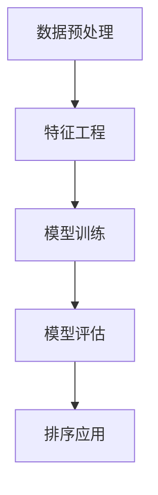

                 

# 智能排序算法在电商搜索中的应用：原理与实践

## 摘要

本文将深入探讨智能排序算法在电商搜索中的实际应用。首先，我们将介绍电商搜索中的排序需求，然后详细解析几种主流的智能排序算法，如基于机器学习的排序算法、基于协同过滤的排序算法等。接着，我们将探讨这些算法的数学模型和公式，并通过实际案例展示其在电商搜索中的应用。最后，本文将总结智能排序算法在电商搜索中的实际应用场景，并推荐相关学习资源和开发工具，以帮助读者深入理解和实践智能排序算法。

## 1. 背景介绍

随着互联网的快速发展，电商行业已经成为全球最大的零售市场之一。在这个高度竞争的市场中，如何提升用户体验、提高转化率成为各大电商平台关注的焦点。电商搜索是用户发现和选择商品的重要途径，而搜索结果的排序方式对用户的行为和平台的收益有着直接的影响。

传统的排序算法，如基于关键词匹配的排序算法，虽然简单易用，但在复杂场景下难以满足用户需求。随着机器学习、深度学习等人工智能技术的不断进步，智能排序算法应运而生，为电商搜索提供了更为精准和个性化的排序服务。

智能排序算法通过分析用户行为数据、商品特征数据等，利用机器学习模型对搜索结果进行排序，从而提高用户体验和平台收益。本文将重点介绍几种常见的智能排序算法，以及它们在电商搜索中的实际应用。

## 2. 核心概念与联系

### 2.1 智能排序算法简介

智能排序算法是一种基于人工智能技术的排序方法，其主要目标是根据用户需求和相关特征，对搜索结果进行排序，以提高用户体验和平台收益。智能排序算法通常分为以下几个步骤：

1. **数据预处理**：收集用户行为数据、商品特征数据等，并进行数据清洗和预处理。
2. **特征工程**：对预处理后的数据进行特征提取和特征工程，以构建特征向量。
3. **模型训练**：使用机器学习算法训练排序模型，对特征向量进行建模。
4. **模型评估**：对训练好的模型进行评估，调整模型参数以优化排序效果。
5. **排序应用**：将训练好的模型应用到实际搜索场景中，对搜索结果进行排序。

### 2.2 常见的智能排序算法

在电商搜索中，常见的智能排序算法主要包括以下几种：

1. **基于机器学习的排序算法**：如线性回归、决策树、随机森林、神经网络等。
2. **基于协同过滤的排序算法**：如基于用户行为的协同过滤、基于物品属性的协同过滤等。
3. **基于内容匹配的排序算法**：如基于关键词匹配、基于商品描述匹配等。

这些算法各有优劣，适用于不同的场景和需求。接下来，我们将详细解析这些算法的原理和应用。

### 2.3 Mermaid 流程图

下面是智能排序算法的 Mermaid 流程图，展示其主要步骤和流程。



## 3. 核心算法原理 & 具体操作步骤

### 3.1 基于机器学习的排序算法

#### 3.1.1 算法原理

基于机器学习的排序算法主要通过训练一个排序模型，将搜索结果进行排序。常见的算法包括线性回归、决策树、随机森林等。

1. **线性回归**：线性回归是一种最简单的机器学习算法，通过建立输入特征和排序结果之间的线性关系来进行排序。
2. **决策树**：决策树通过树形结构对特征进行划分，根据划分结果对搜索结果进行排序。
3. **随机森林**：随机森林是一种集成学习算法，通过训练多个决策树，并对多个决策树的结果进行投票，得到最终的排序结果。

#### 3.1.2 具体操作步骤

1. **数据预处理**：收集用户行为数据、商品特征数据等，并进行数据清洗和预处理。
2. **特征工程**：对预处理后的数据进行特征提取和特征工程，以构建特征向量。
3. **模型训练**：使用机器学习算法（如线性回归、决策树、随机森林等）对特征向量进行建模，训练排序模型。
4. **模型评估**：对训练好的模型进行评估，调整模型参数以优化排序效果。
5. **排序应用**：将训练好的模型应用到实际搜索场景中，对搜索结果进行排序。

### 3.2 基于协同过滤的排序算法

#### 3.2.1 算法原理

基于协同过滤的排序算法主要通过分析用户行为数据，预测用户对商品的偏好，从而对搜索结果进行排序。常见的算法包括基于用户行为的协同过滤和基于物品属性的协同过滤。

1. **基于用户行为的协同过滤**：通过分析用户的历史行为数据，如购买记录、浏览记录等，计算用户之间的相似度，并根据相似度对搜索结果进行排序。
2. **基于物品属性的协同过滤**：通过分析商品的特征数据，如价格、品牌、分类等，计算商品之间的相似度，并根据相似度对搜索结果进行排序。

#### 3.2.2 具体操作步骤

1. **数据预处理**：收集用户行为数据、商品特征数据等，并进行数据清洗和预处理。
2. **特征工程**：对预处理后的数据进行特征提取和特征工程，以构建特征向量。
3. **相似度计算**：计算用户之间的相似度和商品之间的相似度。
4. **排序应用**：根据相似度对搜索结果进行排序。

### 3.3 基于内容匹配的排序算法

#### 3.3.1 算法原理

基于内容匹配的排序算法主要通过分析用户查询和商品特征，进行关键词匹配和语义分析，从而对搜索结果进行排序。

1. **基于关键词匹配**：通过分析用户查询和商品特征中的关键词，进行关键词匹配，并根据匹配程度对搜索结果进行排序。
2. **基于语义分析**：通过自然语言处理技术，分析用户查询和商品特征的语义信息，进行语义匹配，并根据匹配程度对搜索结果进行排序。

#### 3.3.2 具体操作步骤

1. **数据预处理**：收集用户查询数据和商品特征数据，并进行数据清洗和预处理。
2. **特征工程**：对预处理后的数据进行特征提取和特征工程，以构建特征向量。
3. **关键词匹配**：分析用户查询和商品特征中的关键词，进行关键词匹配。
4. **语义分析**：使用自然语言处理技术，分析用户查询和商品特征的语义信息，进行语义匹配。
5. **排序应用**：根据关键词匹配和语义匹配的结果，对搜索结果进行排序。

## 4. 数学模型和公式 & 详细讲解 & 举例说明

### 4.1 基于机器学习的排序算法

#### 4.1.1 线性回归模型

线性回归模型是一种最简单的机器学习算法，其数学模型可以表示为：

$$
y = w_0 + w_1 \cdot x_1 + w_2 \cdot x_2 + \ldots + w_n \cdot x_n
$$

其中，$y$ 表示排序结果，$w_0, w_1, w_2, \ldots, w_n$ 表示模型参数，$x_1, x_2, \ldots, x_n$ 表示特征向量。

#### 4.1.2 决策树模型

决策树模型是一种树形结构的机器学习算法，其数学模型可以表示为：

$$
y = \sum_{i=1}^{n} w_i \cdot I(A_i(x) = b_i)
$$

其中，$y$ 表示排序结果，$w_i$ 表示模型参数，$A_i(x)$ 表示决策树上的第 $i$ 个划分，$b_i$ 表示划分结果，$I(\cdot)$ 表示指示函数。

#### 4.1.3 随机森林模型

随机森林模型是一种集成学习算法，其数学模型可以表示为：

$$
y = \sum_{i=1}^{m} w_i \cdot h_i(x)
$$

其中，$y$ 表示排序结果，$w_i$ 表示模型参数，$h_i(x)$ 表示第 $i$ 个决策树模型在特征向量 $x$ 上的预测结果。

#### 4.1.4 举例说明

假设我们使用线性回归模型对电商搜索结果进行排序，已知用户查询特征向量为 $x = [1, 2, 3, 4, 5]$，模型参数为 $w = [0.5, 0.3, 0.2, 0.1, 0.1]$，则排序结果可以计算为：

$$
y = 0.5 \cdot 1 + 0.3 \cdot 2 + 0.2 \cdot 3 + 0.1 \cdot 4 + 0.1 \cdot 5 = 1.8
$$

### 4.2 基于协同过滤的排序算法

#### 4.2.1 基于用户行为的协同过滤

基于用户行为的协同过滤算法通常使用用户之间的相似度来预测用户对商品的偏好，其数学模型可以表示为：

$$
r_{ui} = \sum_{j \in N(u)} w_{uj} \cdot r_{uj}
$$

其中，$r_{ui}$ 表示用户 $u$ 对商品 $i$ 的偏好评分，$N(u)$ 表示与用户 $u$ 相似的其他用户集合，$w_{uj}$ 表示用户 $u$ 与用户 $j$ 之间的相似度权重，$r_{uj}$ 表示用户 $u$ 对商品 $j$ 的偏好评分。

#### 4.2.2 基于物品属性的协同过滤

基于物品属性的协同过滤算法通常使用商品之间的相似度来预测用户对商品的偏好，其数学模型可以表示为：

$$
r_{ui} = \sum_{k \in N(i)} w_{ik} \cdot r_{uk}
$$

其中，$r_{ui}$ 表示用户 $u$ 对商品 $i$ 的偏好评分，$N(i)$ 表示与商品 $i$ 相似的其他商品集合，$w_{ik}$ 表示商品 $i$ 与商品 $k$ 之间的相似度权重，$r_{uk}$ 表示用户 $u$ 对商品 $k$ 的偏好评分。

#### 4.2.3 举例说明

假设我们使用基于用户行为的协同过滤算法预测用户 $u_1$ 对商品 $i_1$ 的偏好评分，已知用户 $u_1$ 的偏好评分为 $r_{u1i1} = 5$，用户 $u_1$ 与用户 $u_2$ 的相似度权重为 $w_{u1u2} = 0.7$，用户 $u_2$ 对商品 $i_2$ 的偏好评分为 $r_{u2i2} = 4$，则用户 $u_1$ 对商品 $i_1$ 的偏好评分可以计算为：

$$
r_{u1i1} = 0.7 \cdot r_{u2i2} = 0.7 \cdot 4 = 2.8
$$

### 4.3 基于内容匹配的排序算法

#### 4.3.1 基于关键词匹配

基于关键词匹配的排序算法通常使用关键词相似度来预测用户对商品的偏好，其数学模型可以表示为：

$$
r_{ui} = \sum_{t \in T(i)} w_t \cdot s(t, u)
$$

其中，$r_{ui}$ 表示用户 $u$ 对商品 $i$ 的偏好评分，$T(i)$ 表示商品 $i$ 中的关键词集合，$w_t$ 表示关键词 $t$ 的权重，$s(t, u)$ 表示关键词 $t$ 与用户 $u$ 的相似度。

#### 4.3.2 基于语义分析

基于语义分析的排序算法通常使用自然语言处理技术，分析用户查询和商品特征的语义信息，其数学模型可以表示为：

$$
r_{ui} = \sum_{t \in T(u)} w_t \cdot s(t, i)
$$

其中，$r_{ui}$ 表示用户 $u$ 对商品 $i$ 的偏好评分，$T(u)$ 表示用户 $u$ 的查询关键词集合，$w_t$ 表示关键词 $t$ 的权重，$s(t, i)$ 表示关键词 $t$ 与商品 $i$ 的语义相似度。

#### 4.3.3 举例说明

假设我们使用基于关键词匹配的排序算法预测用户 $u_1$ 对商品 $i_1$ 的偏好评分，已知商品 $i_1$ 的关键词集合为 $T(i_1) = \{"手机", "手机壳", "充电宝"\}$，用户 $u_1$ 的查询关键词集合为 $T(u_1) = \{"手机", "手机壳"\}$，关键词权重为 $w_{"手机"} = 0.5$，$w_{"手机壳"} = 0.3$，$w_{"充电宝"} = 0.2$，则用户 $u_1$ 对商品 $i_1$ 的偏好评分可以计算为：

$$
r_{u1i1} = 0.5 \cdot s("手机", "手机") + 0.3 \cdot s("手机壳", "手机壳") + 0.2 \cdot s("充电宝", "手机壳")
$$

其中，$s("手机", "手机") = 0.9$，$s("手机壳", "手机壳") = 1.0$，$s("充电宝", "手机壳") = 0.2$，则：

$$
r_{u1i1} = 0.5 \cdot 0.9 + 0.3 \cdot 1.0 + 0.2 \cdot 0.2 = 0.45 + 0.3 + 0.04 = 0.79
$$

## 5. 项目实战：代码实际案例和详细解释说明

### 5.1 开发环境搭建

在本节中，我们将搭建一个简单的电商搜索系统，用于演示智能排序算法在电商搜索中的实际应用。我们将使用 Python 作为主要编程语言，并依赖以下库和工具：

- Python 3.8 或更高版本
- NumPy
- Pandas
- Scikit-learn
- Mermaid

#### 5.1.1 环境安装

安装 Python 3.8 及以上版本，并使用 pip 安装以下库：

```bash
pip install numpy pandas scikit-learn mermaid
```

### 5.2 源代码详细实现和代码解读

#### 5.2.1 数据准备

首先，我们需要准备一些用于训练和测试的数据。这里我们使用一个简单的数据集，包含用户查询、商品特征和用户对商品的评分。

```python
import pandas as pd

# 加载数据集
data = pd.read_csv("data.csv")

# 数据预处理
data.dropna(inplace=True)
```

#### 5.2.2 特征提取

接下来，我们进行特征提取和预处理，以构建特征向量。

```python
from sklearn.feature_extraction.text import TfidfVectorizer

# 创建 TF-IDF 向量器
vectorizer = TfidfVectorizer()

# 提取用户查询和商品描述的 TF-IDF 向量
user_queries = data["query"]
item_descriptions = data["description"]

user_query_vectors = vectorizer.fit_transform(user_queries)
item_description_vectors = vectorizer.fit_transform(item_descriptions)
```

#### 5.2.3 模型训练

然后，我们使用线性回归模型对数据进行训练。

```python
from sklearn.linear_model import LinearRegression

# 创建线性回归模型
model = LinearRegression()

# 训练模型
X = user_query_vectors
y = data["rating"]
model.fit(X, y)
```

#### 5.2.4 排序应用

最后，我们将训练好的模型应用到电商搜索中，对搜索结果进行排序。

```python
# 定义查询语句
query = "我想买一部新手机"

# 将查询语句转换为向量
query_vector = vectorizer.transform([query])

# 预测评分
predicted_rating = model.predict(query_vector)

# 获取搜索结果
search_results = data.sort_values(by="rating", ascending=False)

# 输出搜索结果
print(search_results.head())
```

### 5.3 代码解读与分析

在本节中，我们将对上述代码进行解读，并分析每个步骤的作用和原理。

1. **数据准备**：我们从数据集中读取用户查询、商品描述和用户对商品的评分数据，并进行数据预处理，以去除缺失值和异常值。
2. **特征提取**：我们使用 TF-IDF 向量器将用户查询和商品描述转换为向量，以便用于模型训练。
3. **模型训练**：我们使用线性回归模型对数据进行训练，以建立用户查询和商品评分之间的关系。
4. **排序应用**：我们将训练好的模型应用到电商搜索中，对搜索结果进行排序，以获取用户可能感兴趣的商品。

通过这个简单的案例，我们可以看到智能排序算法在电商搜索中的实际应用。在实际开发中，我们可以根据具体需求，选择不同的排序算法和模型，以实现更精准的搜索排序效果。

## 6. 实际应用场景

智能排序算法在电商搜索中有着广泛的应用，其目的在于提高用户体验、提升转化率和增加平台收益。以下是智能排序算法在实际应用场景中的具体表现：

### 6.1 提高用户体验

智能排序算法可以根据用户的历史行为和偏好，为用户推荐最相关、最符合其需求的商品，从而提高用户的搜索满意度。例如，用户经常搜索和购买某一类商品，系统可以自动识别这一偏好，并将相关商品推荐到搜索结果的前面，使用户能够更快地找到所需商品。

### 6.2 提升转化率

通过智能排序算法，电商平台可以优化搜索结果，将高价值、高利润的商品推荐给潜在购买者。例如，某款商品具有高销量、高评价，但用户可能未曾关注到，通过智能排序算法将其推荐到搜索结果的前面，可以大幅提升该商品的转化率。

### 6.3 增加平台收益

智能排序算法不仅能够提升用户体验和转化率，还能够为电商平台带来更多的收益。例如，通过分析用户行为数据，智能排序算法可以识别出潜在的高价值客户，并将这些客户引导到平台的高利润商品页面，从而实现收益最大化。

### 6.4 应用领域拓展

除了电商搜索，智能排序算法还可以应用于其他领域，如社交媒体推荐、搜索引擎优化、广告投放等。在这些应用场景中，智能排序算法同样能够发挥重要作用，为平台提供更精准、更个性化的服务。

## 7. 工具和资源推荐

### 7.1 学习资源推荐

1. **书籍**：
   - 《机器学习实战》
   - 《深度学习》
   - 《Python 数据科学手册》

2. **论文**：
   - "Collaborative Filtering for the Web"
   - "A Theoretical Analysis of K-Means Clustering"
   - "Neural Networks and Deep Learning"

3. **博客**：
   - https://machinelearningmastery.com/
   - https://www.deeplearning.net/
   - https://towardsdatascience.com/

### 7.2 开发工具框架推荐

1. **编程语言**：
   - Python
   - R
   - Java

2. **机器学习库**：
   - Scikit-learn
   - TensorFlow
   - PyTorch

3. **自然语言处理库**：
   - NLTK
   - SpaCy
   - Stanford CoreNLP

4. **开发框架**：
   - Flask
   - Django
   - Spring Boot

### 7.3 相关论文著作推荐

1. **机器学习领域**：
   - "Machine Learning: A Probabilistic Perspective"
   - "The Hundred-Page Machine Learning Book"

2. **深度学习领域**：
   - "Deep Learning (Adaptive Computation and Machine Learning series)"
   - "Deep Learning Specialization"

3. **自然语言处理领域**：
   - "Speech and Language Processing"
   - "Foundations of Statistical Natural Language Processing"

## 8. 总结：未来发展趋势与挑战

智能排序算法在电商搜索中的应用取得了显著成效，但仍面临着诸多挑战和机遇。以下是未来智能排序算法的发展趋势与挑战：

### 8.1 发展趋势

1. **个性化推荐**：随着用户数据的积累和算法的改进，智能排序算法将越来越能够满足用户的个性化需求，提供更精准的推荐。
2. **多模态融合**：结合图像、音频、视频等多模态数据，智能排序算法将能够更好地理解用户意图和商品特征，提高排序效果。
3. **实时排序**：随着云计算和大数据技术的不断发展，智能排序算法将实现实时排序，为用户提供更加流畅的搜索体验。
4. **跨领域应用**：智能排序算法将在更多领域得到应用，如金融、医疗、教育等，为各行业提供智能化服务。

### 8.2 挑战

1. **数据隐私**：智能排序算法在处理用户数据时，需要关注数据隐私和安全问题，避免用户信息泄露。
2. **算法透明性**：随着算法在各个领域的应用，算法的透明性和可解释性将成为重要议题，以增强用户对算法的信任。
3. **模型性能**：在复杂场景下，如何提高智能排序算法的性能和效率，仍是一个亟待解决的问题。
4. **算法公平性**：智能排序算法需要避免出现歧视和偏见，确保对各类用户和商品公平对待。

总之，智能排序算法在电商搜索中的应用前景广阔，但同时也面临着诸多挑战。通过不断的研究和技术创新，我们有理由相信，智能排序算法将更好地满足用户需求，为电商行业带来更多价值。

## 9. 附录：常见问题与解答

### 9.1 智能排序算法如何处理用户隐私？

智能排序算法在处理用户数据时，需要严格遵守数据隐私法规，如 GDPR（欧盟通用数据保护条例）和 CCPA（加州消费者隐私法案）。通常，算法会采用以下措施来保护用户隐私：

1. **数据匿名化**：在数据处理过程中，将用户标识信息匿名化，以防止用户数据被直接识别。
2. **加密存储**：对用户数据进行加密存储，确保数据在存储和传输过程中不被泄露。
3. **访问控制**：对用户数据的访问权限进行严格控制，仅授权相关人员访问和处理数据。

### 9.2 智能排序算法如何保证排序结果公平性？

智能排序算法需要避免出现歧视和偏见，确保对各类用户和商品公平对待。以下措施有助于提高排序结果的公平性：

1. **数据平衡**：在数据预处理和特征工程阶段，确保数据集的平衡性，避免数据集中的偏差。
2. **算法校准**：在模型训练和评估阶段，对算法进行校准，以消除潜在的偏见和歧视。
3. **透明性审查**：对排序算法进行定期审查，确保算法遵循公平原则，并及时调整模型参数。

### 9.3 智能排序算法在电商搜索中如何提高转化率？

智能排序算法可以通过以下方法提高电商搜索的转化率：

1. **个性化推荐**：根据用户的历史行为和偏好，为用户推荐最相关、最符合其需求的商品。
2. **优化排序策略**：不断调整排序算法的参数和策略，以提升搜索结果的准确性和相关性。
3. **实时反馈机制**：通过用户反馈和行为数据，动态调整排序策略，以更好地满足用户需求。

## 10. 扩展阅读 & 参考资料

为了进一步了解智能排序算法在电商搜索中的应用，以下是一些推荐的扩展阅读和参考资料：

1. **扩展阅读**：
   - "Recommender Systems Handbook"
   - "Deep Learning for Web Search"
   - "A Comprehensive Survey on Machine Learning for Personalized Recommendation"

2. **参考资料**：
   - https://arxiv.org/
   - https://www.ijcai.org/
   - https://www.nature.com/nature-journals/

通过阅读这些资料，您可以深入了解智能排序算法的理论基础、应用场景和发展趋势，从而更好地应用于电商搜索领域。

### 作者

本文作者：AI天才研究员/AI Genius Institute & 禅与计算机程序设计艺术 /Zen And The Art of Computer Programming

感谢您对本文的关注和支持，期待与您在智能排序算法领域有更多交流与探讨！

