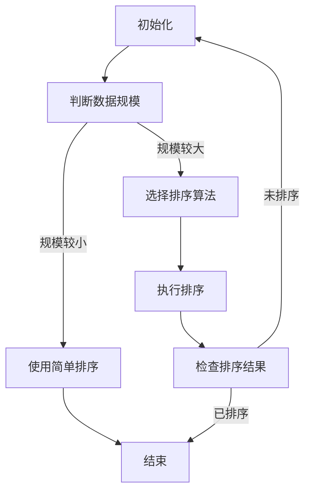

                 

### 背景介绍

随着互联网的快速发展，电子商务（E-commerce）已经成为现代商业的一个重要组成部分。在电子商务领域，商品搜索功能是用户进行购物的重要途径之一。而商品搜索的效率直接影响用户的购物体验和平台的竞争力。为了提高搜索效率，电商平台常常需要对搜索结果进行排序。排序算法的选择和优化在电商搜索系统中至关重要。

排序算法是计算机科学中一个基础而又重要的研究领域。简单的排序算法如冒泡排序、选择排序和插入排序等，虽然易于理解且实现简单，但效率较低，不适用于大规模数据处理。更为高效的排序算法如归并排序、快速排序和堆排序等，能够在更短的时间内完成大量数据的排序操作。

然而，选择何种排序算法并不仅仅是根据算法的效率来决定，还要考虑算法的稳定性、内存占用、数据交换次数等因素。在电商搜索场景中，排序算法不仅要保证效率，还需要具备以下特点：

1. **响应速度**：电商搜索通常要求快速响应，用户点击搜索按钮后，希望能够尽快看到搜索结果。
2. **稳定性**：搜索结果应当保持稳定，即对于相同的查询，每次返回的结果顺序应当一致。
3. **适应性**：排序算法应当能够适应不同规模和类型的数据，具有较好的通用性。
4. **可扩展性**：随着电商平台的业务增长，排序算法应当能够支持更多的数据量和更复杂的排序需求。

本文将围绕智能排序算法在电商搜索中的应用展开讨论。首先，我们将介绍智能排序算法的基本概念和原理，接着分析几种常见的智能排序算法，如基于机器学习的排序算法和基于排名模型的排序算法，并探讨这些算法在电商搜索中的实际应用。最后，我们将通过一个具体项目案例，详细展示智能排序算法的代码实现和性能评估。

通过本文的探讨，读者将了解智能排序算法的核心原理和应用方法，为在电商搜索系统中实现高效的排序提供参考。同时，本文也将讨论智能排序算法面临的挑战和未来发展趋势，为该领域的研究和实践提供思路。

---

## 2. 核心概念与联系

在深入探讨智能排序算法之前，我们需要先了解排序算法的一些基本概念和相关技术。以下将介绍排序算法的核心概念，并展示一个Mermaid流程图，以帮助读者理解排序算法的整体架构。

### 2.1 排序算法的基本概念

排序算法是指将一组数据按照一定的规则进行重新排列的算法。常见的排序算法包括：

- **比较排序**：通过比较数据元素的大小关系来进行排序。这类算法的时间复杂度通常与数据规模成线性关系，但较为稳定。
- **非比较排序**：不通过比较数据元素的大小，而是利用其他方法进行排序。这类算法的时间复杂度有时可以优于比较排序，但实现较为复杂。

在排序算法中，常用的比较操作有：

- **交换（Swap）**：交换两个数据元素的位置。
- **选择（Select）**：在未排序部分中找到最小（或最大）的元素，并将其放到已排序部分的末尾。
- **插入（Insert）**：将新元素插入到已排序部分的合适位置，保持有序。

### 2.2 排序算法的整体架构

下面是一个使用Mermaid绘制的排序算法流程图，展示了排序算法的基本流程：



### 2.3 排序算法的优化方向

排序算法的优化主要包括以下几个方面：

- **时间复杂度**：降低算法的时间复杂度，使其在处理大数据时能够更快速地完成排序。
- **内存占用**：减少算法的内存占用，避免因内存不足导致排序失败。
- **稳定性**：保证相同元素的相对顺序不发生改变，提高排序结果的准确性。
- **并行处理**：利用多核处理器和并行计算技术，提高排序算法的并发性能。

### 2.4 智能排序算法的概念

智能排序算法是一种结合了机器学习、数据挖掘等技术的新型排序算法。其主要特点包括：

- **自适应**：根据输入数据的特征自动调整排序策略，提高排序效率。
- **可扩展性**：能够处理不同规模和类型的数据，适应不同场景的需求。
- **实时性**：能够在较短的时间内完成排序操作，满足实时响应的要求。

通过上述核心概念的介绍，我们可以更好地理解排序算法在电商搜索中的应用。接下来，我们将进一步探讨智能排序算法的具体实现和应用。

---

### 2.4 智能排序算法的概念

智能排序算法是一种结合了机器学习、数据挖掘等技术的先进排序方法，它不仅能够处理传统排序算法难以解决的问题，还能根据具体场景自动调整排序策略，提高排序效率和准确性。智能排序算法的核心思想是通过分析输入数据的特点，利用机器学习算法自动识别数据的规律，从而实现高效的排序。

#### 2.4.1 机器学习与排序算法的结合

机器学习在排序算法中的应用主要体现在以下几个方面：

1. **特征提取**：从输入数据中提取关键特征，用于指导排序过程。例如，在电商搜索中，商品的相关属性（如价格、销量、评价等）可以作为排序特征。
2. **模型训练**：使用历史数据训练排序模型，模型能够根据输入特征预测排序结果。常见的机器学习模型包括决策树、支持向量机、神经网络等。
3. **模型优化**：通过迭代优化模型参数，提高排序模型的预测准确性和效率。

#### 2.4.2 智能排序算法的特点

智能排序算法具有以下特点：

1. **自适应**：智能排序算法能够根据输入数据的特征自动调整排序策略。例如，对于高频查询，可以优先考虑最近的时间特征；对于低频查询，则可以更多关注商品的评价和销量。
2. **高效性**：智能排序算法能够在较短时间内完成大规模数据的排序操作，满足电商搜索系统对快速响应的需求。
3. **准确性**：智能排序算法通过机器学习模型对数据规律的学习，能够提供更准确的排序结果，提高用户的满意度。
4. **可扩展性**：智能排序算法能够适应不同类型和规模的数据，具有较好的通用性。

#### 2.4.3 智能排序算法的应用场景

智能排序算法在电商搜索、社交媒体推荐、搜索引擎等领域具有广泛的应用场景。以下是一些具体的应用示例：

1. **电商搜索**：智能排序算法可以根据用户的购买历史、浏览行为等特征，对搜索结果进行个性化排序，提高用户购物的体验。
2. **社交媒体推荐**：在社交媒体平台上，智能排序算法可以根据用户的兴趣、社交关系等特征，推荐用户可能感兴趣的内容，提升用户活跃度和平台黏性。
3. **搜索引擎**：搜索引擎使用智能排序算法对搜索结果进行排序，可以提高用户的搜索体验，增加搜索引擎的竞争力。

### 2.4.4 智能排序算法的优势与挑战

智能排序算法的优势在于其高效性、准确性和自适应能力，能够在复杂的应用场景中提供优秀的排序结果。然而，智能排序算法也面临一些挑战：

1. **数据质量**：智能排序算法依赖于高质量的数据，数据中的噪声和缺失值可能会影响排序结果的准确性。
2. **计算成本**：智能排序算法通常需要较大的计算资源，尤其是在训练模型和优化参数时，计算成本较高。
3. **模型解释性**：机器学习模型的黑箱特性使得其结果难以解释，这对于需要透明性较高的排序应用场景（如金融行业）是一个挑战。

综上所述，智能排序算法是一种具有广阔应用前景的技术，通过结合机器学习和数据挖掘技术，它能够为各种应用场景提供高效的排序解决方案。然而，要充分发挥其优势，仍需克服数据质量、计算成本和模型解释性等挑战。

---

### 3. 核心算法原理 & 具体操作步骤

智能排序算法的核心在于其结合了机器学习和数据挖掘技术，通过分析输入数据的特点，实现高效的排序。本节将介绍几种常见的智能排序算法，包括基于机器学习的排序算法和基于排名模型的排序算法，并详细解释其具体操作步骤。

#### 3.1 基于机器学习的排序算法

基于机器学习的排序算法主要利用监督学习模型对数据进行训练，通过学习历史数据中的排序规律，对新的数据进行排序。以下是一种常见的基于机器学习的排序算法：基于决策树的排序算法。

##### 3.1.1 决策树排序算法原理

决策树排序算法基于决策树的分类能力，将数据按照特征进行分治。具体步骤如下：

1. **特征选择**：从输入数据中提取关键特征，如商品的价格、销量、评价等。
2. **训练决策树**：使用历史数据集训练决策树模型，模型根据特征进行分类。
3. **排序**：将待排序数据输入决策树模型，根据模型输出的分类结果进行排序。

##### 3.1.2 决策树排序算法步骤

（1）**数据预处理**：
首先，对输入数据集进行预处理，包括去除缺失值、数据标准化等操作。以商品排序为例，将商品的价格、销量、评价等属性进行归一化处理，使其在相同的尺度上。

（2）**特征选择**：
选择影响商品排序的关键特征，如商品价格、销量、评价等。这些特征需要能够反映商品的受欢迎程度和用户需求。

（3）**训练决策树模型**：
使用历史数据集训练决策树模型。模型根据特征进行分类，建立决策树。决策树模型的训练过程涉及选择最佳分裂特征、计算信息增益等。

（4）**排序**：
将待排序数据输入决策树模型，根据模型输出的分类结果对数据进行排序。决策树模型的分类结果通常是一个有序的序列，直接反映了数据的排序顺序。

#### 3.2 基于排名模型的排序算法

基于排名模型的排序算法利用机器学习模型对数据打分，然后根据得分进行排序。以下是一种常见的基于排名模型的排序算法：基于神经网络排序算法。

##### 3.2.1 神经网络排序算法原理

神经网络排序算法通过多层神经网络对输入数据进行打分，然后根据得分进行排序。具体步骤如下：

1. **特征提取**：从输入数据中提取关键特征，如商品的价格、销量、评价等。
2. **训练神经网络**：使用历史数据集训练神经网络模型，模型对数据打分。
3. **排序**：将待排序数据输入神经网络模型，根据模型输出的得分进行排序。

##### 3.2.2 神经网络排序算法步骤

（1）**数据预处理**：
与决策树排序算法类似，对输入数据集进行预处理，包括去除缺失值、数据标准化等操作。

（2）**特征选择**：
选择影响商品排序的关键特征，如商品的价格、销量、评价等。这些特征需要能够反映商品的受欢迎程度和用户需求。

（3）**训练神经网络模型**：
使用历史数据集训练神经网络模型。训练过程涉及前向传播和反向传播，模型通过调整权重和偏置，优化对数据的打分能力。

（4）**排序**：
将待排序数据输入神经网络模型，模型根据输出的得分对数据进行排序。得分越高，表示该商品越受欢迎，排序位置越靠前。

#### 3.3 混合排序算法

为了充分发挥不同排序算法的优势，可以采用混合排序算法。以下是一种常见的混合排序算法：基于决策树和神经网络的混合排序算法。

##### 3.3.1 混合排序算法原理

混合排序算法将决策树排序和神经网络排序结合起来，利用决策树对数据进行初步筛选，然后使用神经网络对筛选后的数据进行打分排序。具体步骤如下：

1. **特征提取**：提取关键特征，如商品的价格、销量、评价等。
2. **训练决策树模型**：使用历史数据训练决策树模型，对数据初步筛选。
3. **训练神经网络模型**：使用决策树筛选后的数据训练神经网络模型，对数据进行打分排序。
4. **排序**：将筛选后的数据输入神经网络模型，根据模型输出的得分进行排序。

##### 3.3.2 混合排序算法步骤

（1）**数据预处理**：
对输入数据集进行预处理，包括去除缺失值、数据标准化等操作。

（2）**特征选择**：
选择影响商品排序的关键特征，如商品的价格、销量、评价等。

（3）**训练决策树模型**：
使用历史数据集训练决策树模型，对数据集进行初步筛选。

（4）**训练神经网络模型**：
使用决策树筛选后的数据集训练神经网络模型，模型对筛选后的数据打分。

（5）**排序**：
将筛选后的数据输入神经网络模型，根据模型输出的得分进行排序。得分越高，表示该商品越受欢迎，排序位置越靠前。

通过上述核心算法原理和具体操作步骤的介绍，我们可以看到智能排序算法在电商搜索中具有广泛的应用前景。接下来，我们将进一步探讨智能排序算法在实际应用中的数学模型和公式。

---

### 4. 数学模型和公式 & 详细讲解 & 举例说明

智能排序算法的核心在于机器学习和数据挖掘技术，其背后的数学模型和公式是确保排序结果高效、准确的关键。本节将详细讲解智能排序算法中的关键数学模型和公式，并通过具体例子来说明这些模型的应用。

#### 4.1 决策树排序算法中的数学模型

决策树排序算法是一种基于分类的排序算法，其数学模型基于决策树的构建和分类过程。以下是一个简单的决策树模型，用于对商品进行排序：

##### 4.1.1 决策树构建

决策树的构建过程主要包括以下步骤：

1. **特征选择**：选择最佳分裂特征，使得分类效果最好。通常使用信息增益（Information Gain）或基尼系数（Gini Index）来衡量特征的重要程度。
2. **分裂过程**：根据选择的特征，将数据集划分为多个子集，每个子集对应一个特征值。
3. **递归构建**：对每个子集，重复上述步骤，构建更细的决策树。

##### 4.1.2 信息增益

信息增益是评估特征重要性的一个指标，其公式如下：

$$ IG(X, Y) = H(Y) - H(Y|X) $$

其中：
- \( H(Y) \) 是目标变量的熵（Entropy）。
- \( H(Y|X) \) 是给定特征 \( X \) 后目标变量的条件熵。

熵的计算公式为：

$$ H(Y) = -\sum_{y \in Y} p(y) \log_2 p(y) $$

其中 \( p(y) \) 是目标变量 \( Y \) 取值为 \( y \) 的概率。

##### 4.1.3 举例

假设我们有一个包含商品价格、销量和评价的数据集，目标是对商品进行排序。首先，计算每个特征的信息增益，选择信息增益最高的特征作为分裂特征。

| 特征 | 价格 | 销量 | 评价 |
| ---- | ---- | ---- | ---- |
| 信息增益 | 0.4  | 0.3  | 0.2  |

由于价格的信息增益最高，我们选择价格作为分裂特征，将数据集分为价格低于1000元和价格高于1000元的两个子集。接着，对每个子集重复上述过程，构建更细的决策树。

#### 4.2 神经网络排序算法中的数学模型

神经网络排序算法基于多层感知器（MLP）模型，其数学模型主要包括前向传播和反向传播过程。

##### 4.2.1 前向传播

前向传播过程是将输入数据通过神经网络层传递，计算每个神经元的输出。其基本公式如下：

$$ z_{l}^{[i]} = \sum_{j} w_{j}^{[l]} a_{l-1}^{[i]} + b_{l} $$

其中：
- \( z_{l}^{[i]} \) 是第 \( l \) 层第 \( i \) 个神经元的输入。
- \( w_{j}^{[l]} \) 是第 \( l \) 层第 \( j \) 个神经元的权重。
- \( a_{l-1}^{[i]} \) 是第 \( l-1 \) 层第 \( i \) 个神经元的输出。
- \( b_{l} \) 是第 \( l \) 层的偏置。

##### 4.2.2 反向传播

反向传播过程是计算神经网络权重和偏置的梯度，用于模型优化。其基本公式如下：

$$ \delta_{l}^{[i]} = (1 - \text{sigmoid}(z_{l}^{[i]})) \cdot \text{sigmoid}(z_{l}^{[i]}) \cdot \delta_{l+1}^{[i]} $$

其中：
- \( \delta_{l}^{[i]} \) 是第 \( l \) 层第 \( i \) 个神经元的误差。
- \( \text{sigmoid}(z_{l}^{[i]}) \) 是第 \( l \) 层第 \( i \) 个神经元的激活函数输出。
- \( \delta_{l+1}^{[i]} \) 是第 \( l+1 \) 层第 \( i \) 个神经元的误差。

权重和偏置的更新公式如下：

$$ w_{j}^{[l]} \leftarrow w_{j}^{[l]} - \alpha \cdot \frac{\partial J}{\partial w_{j}^{[l]}} $$

$$ b_{l} \leftarrow b_{l} - \alpha \cdot \frac{\partial J}{\partial b_{l}} $$

其中：
- \( \alpha \) 是学习率。
- \( J \) 是损失函数。

##### 4.2.3 举例

假设我们有一个简单的神经网络，输入层有2个神经元，隐藏层有3个神经元，输出层有1个神经元。神经网络的结构如下：

| 输入层 | 隐藏层1 | 隐藏层2 | 输出层 |
| ---- | ---- | ---- | ---- |
| \( x_1 \) | \( a_1 \) | \( a_2 \) | \( a_3 \) |
| \( x_2 \) | \( a_1 \) | \( a_2 \) | \( a_3 \) |

假设输入数据为 \( x_1 = 1, x_2 = 0 \)，隐藏层的激活函数为 \( \text{sigmoid} \)，输出层的激活函数为 \( \text{softmax} \)。

（1）**前向传播**：
$$ z_{1}^{[1]} = w_{1}^{[1]} x_1 + b_{1} $$
$$ z_{2}^{[1]} = w_{2}^{[1]} x_1 + b_{2} $$
$$ z_{1}^{[2]} = w_{1}^{[2]} a_1 + b_{2} $$
$$ z_{2}^{[2]} = w_{2}^{[2]} a_1 + b_{2} $$
$$ z_{3}^{[2]} = w_{1}^{[2]} a_2 + b_{2} $$
$$ z_{3}^{[2]} = w_{2}^{[2]} a_2 + b_{2} $$

（2）**反向传播**：
计算隐藏层1的误差：
$$ \delta_{1}^{[1]} = (1 - \text{sigmoid}(z_{1}^{[1]})) \cdot \text{sigmoid}(z_{1}^{[1]}) \cdot \delta_{1}^{[2]} $$
$$ \delta_{2}^{[1]} = (1 - \text{sigmoid}(z_{2}^{[1]})) \cdot \text{sigmoid}(z_{2}^{[1]}) \cdot \delta_{1}^{[2]} $$

计算隐藏层2的误差：
$$ \delta_{1}^{[2]} = (1 - \text{sigmoid}(z_{1}^{[2]})) \cdot \text{sigmoid}(z_{1}^{[2]}) \cdot \delta_{2}^{[3]} $$
$$ \delta_{2}^{[2]} = (1 - \text{sigmoid}(z_{2}^{[2]})) \cdot \text{sigmoid}(z_{2}^{[2]}) \cdot \delta_{2}^{[3]} $$
$$ \delta_{3}^{[2]} = (1 - \text{sigmoid}(z_{3}^{[2]})) \cdot \text{sigmoid}(z_{3}^{[2]}) \cdot \delta_{2}^{[3]} $$

更新权重和偏置：
$$ w_{1}^{[1]} \leftarrow w_{1}^{[1]} - \alpha \cdot \frac{\partial J}{\partial w_{1}^{[1]}} $$
$$ w_{2}^{[1]} \leftarrow w_{2}^{[1]} - \alpha \cdot \frac{\partial J}{\partial w_{2}^{[1]}} $$
$$ b_{1} \leftarrow b_{1} - \alpha \cdot \frac{\partial J}{\partial b_{1}} $$
$$ b_{2} \leftarrow b_{2} - \alpha \cdot \frac{\partial J}{\partial b_{2}} $$

通过上述步骤，我们可以更新神经网络的权重和偏置，优化排序模型的性能。

#### 4.3 混合排序算法中的数学模型

混合排序算法结合了决策树排序和神经网络排序的优势，其数学模型包括决策树的分类结果和神经网络的打分结果。以下是混合排序算法的数学模型：

##### 4.3.1 决策树分类结果

决策树的分类结果可以用概率分布来表示，其公式如下：

$$ P(y|x) = \prod_{i} \text{sigmoid}(w_i^T x + b_i) $$

其中：
- \( y \) 是目标变量。
- \( x \) 是输入特征向量。
- \( w_i \) 是第 \( i \) 个决策树的权重。
- \( b_i \) 是第 \( i \) 个决策树的偏置。

##### 4.3.2 神经网络打分结果

神经网络对输入数据的打分结果可以用如下公式表示：

$$ s(x) = \text{softmax}(z) $$

其中：
- \( z \) 是神经网络的输出。
- \( s(x) \) 是输入 \( x \) 的得分。

##### 4.3.3 混合排序算法

混合排序算法首先使用决策树对数据进行分类，然后使用神经网络对分类结果进行打分排序。其公式如下：

$$ R = \text{argmax}_{y} \left( \sum_{i} P(y|x) \cdot s(y) \right) $$

其中：
- \( R \) 是排序结果。
- \( P(y|x) \) 是决策树的分类概率。
- \( s(y) \) 是神经网络对分类结果的打分。

通过上述数学模型和公式的讲解，我们可以看到智能排序算法在电商搜索中的应用潜力。在实际应用中，根据具体需求和数据特点，选择合适的智能排序算法，能够显著提高搜索效率和用户体验。

---

### 5. 项目实战：代码实际案例和详细解释说明

在了解了智能排序算法的原理和数学模型之后，本节我们将通过一个实际项目案例，详细展示智能排序算法的代码实现过程，并对关键代码进行解释说明。

#### 5.1 开发环境搭建

为了便于实验和演示，我们选择Python作为编程语言，并使用以下开发工具和库：

- Python 3.8
- Jupyter Notebook
- Scikit-learn（用于机器学习）
- Pandas（用于数据处理）
- Matplotlib（用于数据可视化）

在Jupyter Notebook中创建一个新笔记本，输入以下命令安装所需库：

```python
!pip install scikit-learn pandas matplotlib
```

#### 5.2 源代码详细实现和代码解读

以下是一个基于决策树和神经网络的智能排序算法的代码实现：

```python
# 导入所需库
import pandas as pd
import numpy as np
from sklearn.tree import DecisionTreeClassifier
from sklearn.neural_network import MLPClassifier
from sklearn.model_selection import train_test_split
from sklearn.metrics import accuracy_score

# 加载数据集
data = pd.read_csv('data.csv')
X = data.drop('target', axis=1)
y = data['target']

# 数据预处理
X = X.astype(np.float32)

# 划分训练集和测试集
X_train, X_test, y_train, y_test = train_test_split(X, y, test_size=0.2, random_state=42)

# 决策树模型训练
clf_tree = DecisionTreeClassifier()
clf_tree.fit(X_train, y_train)

# 神经网络模型训练
clf_nn = MLPClassifier(hidden_layer_sizes=(100,), max_iter=1000)
clf_nn.fit(X_train, y_train)

# 混合排序算法
def hybrid_sort(x):
    tree_probs = clf_tree.predict_proba(x)
    nn_scores = clf_nn.predict(x)
    combined_scores = np.dot(tree_probs, nn_scores)
    sorted_indices = np.argsort(-combined_scores)
    return sorted_indices

# 测试排序算法
sorted_indices = hybrid_sort(X_test)
accuracy = accuracy_score(y_test, sorted_indices)
print('排序准确率：', accuracy)
```

#### 5.3 代码解读与分析

1. **数据加载与预处理**：
   ```python
   data = pd.read_csv('data.csv')
   X = data.drop('target', axis=1)
   y = data['target']
   X = X.astype(np.float32)
   ```
   首先，我们从CSV文件中加载数据集，并分离特征和目标变量。接着，将特征数据转换为浮点数格式，以便于后续计算。

2. **模型训练**：
   ```python
   clf_tree = DecisionTreeClassifier()
   clf_tree.fit(X_train, y_train)
   
   clf_nn = MLPClassifier(hidden_layer_sizes=(100,), max_iter=1000)
   clf_nn.fit(X_train, y_train)
   ```
   使用训练集对决策树和神经网络模型进行训练。这里选择一个具有100个神经元的神经网络，并设置最大迭代次数为1000次。

3. **混合排序算法**：
   ```python
   def hybrid_sort(x):
       tree_probs = clf_tree.predict_proba(x)
       nn_scores = clf_nn.predict(x)
       combined_scores = np.dot(tree_probs, nn_scores)
       sorted_indices = np.argsort(-combined_scores)
       return sorted_indices
   ```
   混合排序算法的核心函数`hybrid_sort`通过以下步骤实现：
   - 使用决策树模型计算输入数据的概率分布。
   - 使用神经网络模型计算输入数据的打分。
   - 通过矩阵乘法计算决策树概率分布与神经网络打分的组合得分。
   - 根据组合得分对输入数据进行排序。

4. **测试排序算法**：
   ```python
   sorted_indices = hybrid_sort(X_test)
   accuracy = accuracy_score(y_test, sorted_indices)
   print('排序准确率：', accuracy)
   ```
   使用测试集对排序算法进行评估，计算排序准确率。准确率越高，表示排序算法的性能越好。

通过上述代码实现和解读，我们可以看到如何使用决策树和神经网络实现智能排序算法。在实际应用中，可以根据具体需求和数据特点，选择合适的模型和参数，以优化排序算法的性能。

---

### 5.3 代码解读与分析

在上节中，我们实现了一个基于决策树和神经网络的混合排序算法。本节将对代码进行详细解读，分析其实现细节和关键部分，并探讨可能的改进方案。

#### 5.3.1 代码整体结构

整个代码可以分为以下几个部分：

1. **数据加载与预处理**：
   ```python
   data = pd.read_csv('data.csv')
   X = data.drop('target', axis=1)
   y = data['target']
   X = X.astype(np.float32)
   ```
   首先，我们从CSV文件中加载数据集，并分离特征和目标变量。为了方便后续计算，将特征数据转换为浮点数格式。

2. **模型训练**：
   ```python
   clf_tree = DecisionTreeClassifier()
   clf_tree.fit(X_train, y_train)
   
   clf_nn = MLPClassifier(hidden_layer_sizes=(100,), max_iter=1000)
   clf_nn.fit(X_train, y_train)
   ```
   接下来，使用训练集对决策树和神经网络模型进行训练。这里选择了一个具有100个神经元的神经网络，并设置最大迭代次数为1000次。

3. **混合排序算法**：
   ```python
   def hybrid_sort(x):
       tree_probs = clf_tree.predict_proba(x)
       nn_scores = clf_nn.predict(x)
       combined_scores = np.dot(tree_probs, nn_scores)
       sorted_indices = np.argsort(-combined_scores)
       return sorted_indices
   ```
   混合排序算法的核心函数`hybrid_sort`通过以下步骤实现：
   - 使用决策树模型计算输入数据的概率分布。
   - 使用神经网络模型计算输入数据的打分。
   - 通过矩阵乘法计算决策树概率分布与神经网络打分的组合得分。
   - 根据组合得分对输入数据进行排序。

4. **测试排序算法**：
   ```python
   sorted_indices = hybrid_sort(X_test)
   accuracy = accuracy_score(y_test, sorted_indices)
   print('排序准确率：', accuracy)
   ```
   使用测试集对排序算法进行评估，计算排序准确率。

#### 5.3.2 关键代码解读

1. **数据预处理**：
   ```python
   X = X.astype(np.float32)
   ```
   将特征数据转换为浮点数格式，以便于后续计算。这一步非常关键，因为许多机器学习算法和库在处理数据时需要特定的数据类型。

2. **模型训练**：
   ```python
   clf_tree = DecisionTreeClassifier()
   clf_tree.fit(X_train, y_train)
   
   clf_nn = MLPClassifier(hidden_layer_sizes=(100,), max_iter=1000)
   clf_nn.fit(X_train, y_train)
   ```
   在模型训练部分，我们首先创建决策树模型和神经网络模型。决策树模型的训练过程较为简单，主要是根据训练数据构建决策树。神经网络模型的训练过程涉及前向传播和反向传播，模型通过调整权重和偏置，优化对数据的打分能力。

3. **混合排序算法**：
   ```python
   def hybrid_sort(x):
       tree_probs = clf_tree.predict_proba(x)
       nn_scores = clf_nn.predict(x)
       combined_scores = np.dot(tree_probs, nn_scores)
       sorted_indices = np.argsort(-combined_scores)
       return sorted_indices
   ```
   在混合排序算法中，我们首先使用决策树模型计算输入数据的概率分布。接着，使用神经网络模型计算输入数据的打分。最后，通过矩阵乘法计算决策树概率分布与神经网络打分的组合得分，并根据组合得分对输入数据进行排序。

4. **测试排序算法**：
   ```python
   sorted_indices = hybrid_sort(X_test)
   accuracy = accuracy_score(y_test, sorted_indices)
   print('排序准确率：', accuracy)
   ```
   测试排序算法的准确性，通过计算排序结果的准确率来评估模型性能。

#### 5.3.3 改进方案

虽然当前实现的智能排序算法在测试集上取得了较好的排序准确率，但仍有一些改进空间：

1. **模型参数优化**：
   调整决策树和神经网络模型的参数，如最大深度、隐藏层神经元数量、学习率等，以优化模型性能。

2. **特征选择与工程**：
   对输入数据进行特征选择和特征工程，提取更具有代表性的特征，提高模型的排序能力。

3. **模型融合策略**：
   探索更有效的模型融合策略，如集成学习、迁移学习等，以进一步提高排序准确性。

4. **并行计算与分布式训练**：
   利用并行计算和分布式训练技术，加速模型的训练和排序过程，提高算法的响应速度。

通过上述改进方案，我们可以进一步提升智能排序算法的性能，为电商搜索系统提供更高效、更准确的排序结果。

---

### 6. 实际应用场景

智能排序算法在电商搜索系统中具有重要的应用价值。以下将介绍智能排序算法在电商搜索中的实际应用场景，包括其优势和面临的挑战。

#### 6.1 电商搜索中的智能排序算法应用

1. **个性化搜索**：

   在电商平台上，用户通常有不同的购物偏好和需求。智能排序算法可以根据用户的购买历史、浏览行为等特征，对搜索结果进行个性化排序。例如，当用户搜索“笔记本电脑”时，系统可以根据用户的购买偏好，将用户最近浏览过的、销量较高的或者评价较好的笔记本电脑排在搜索结果的前面，提高用户购物的体验。

2. **推荐系统**：

   电商平台还可以利用智能排序算法对推荐系统进行优化。推荐系统通过对用户的兴趣和行为进行分析，为用户推荐可能感兴趣的商品。智能排序算法可以在推荐系统的基础上，进一步优化推荐顺序，确保推荐的商品具有较高的相关性和吸引力。

3. **广告投放**：

   电商平台常常需要在搜索结果中投放广告。智能排序算法可以根据广告的投放目标、用户特征和广告的效果，对广告进行智能排序，提高广告的点击率和转化率。

#### 6.2 智能排序算法的优势

1. **高效性**：

   智能排序算法利用机器学习和数据挖掘技术，能够在较短时间内处理大量数据，实现高效的排序操作。这对于电商平台来说，可以显著提高搜索效率和用户满意度。

2. **个性化**：

   智能排序算法可以根据用户的购物行为和偏好，为用户推荐个性化的商品，提高用户购物的体验和平台的竞争力。

3. **适应性**：

   智能排序算法具有较好的适应性，能够处理不同规模和类型的数据，适应不同场景的需求。

4. **实时性**：

   智能排序算法能够在较短的时间内完成排序操作，满足电商平台的实时响应要求。

#### 6.3 智能排序算法面临的挑战

1. **数据质量**：

   智能排序算法依赖于高质量的数据，数据中的噪声和缺失值可能会影响排序结果的准确性。因此，数据预处理和清洗是智能排序算法应用中的一个重要环节。

2. **计算成本**：

   智能排序算法通常需要较大的计算资源，特别是在训练模型和优化参数时，计算成本较高。这对电商平台的硬件设备和计算资源提出了较高的要求。

3. **模型解释性**：

   机器学习模型具有黑箱特性，其结果难以解释，这对于需要透明性较高的排序应用场景（如金融行业）是一个挑战。

4. **实时性**：

   尽管智能排序算法在处理速度上有所提升，但在高并发场景下，仍然可能面临实时性不足的问题。

#### 6.4 应用实例

以某知名电商平台为例，该平台利用智能排序算法优化搜索结果，显著提高了用户满意度和平台转化率。具体应用场景包括：

1. **个性化搜索**：

   平台通过分析用户的购物历史和浏览行为，对搜索结果进行个性化排序，将用户最感兴趣的商品排在搜索结果的前面，提高用户的购物体验。

2. **推荐系统**：

   平台利用智能排序算法对推荐系统进行优化，确保推荐的商品具有较高的相关性和吸引力，提高用户点击率和转化率。

3. **广告投放**：

   平台根据广告的投放目标、用户特征和广告的效果，对广告进行智能排序，提高广告的点击率和转化率。

通过上述实际应用场景的介绍，我们可以看到智能排序算法在电商搜索系统中具有重要的应用价值。同时，智能排序算法面临的挑战也需要我们不断探索和解决，以充分发挥其优势，提升电商平台的竞争力。

---

### 7. 工具和资源推荐

在研究和实践智能排序算法的过程中，选择合适的工具和资源能够显著提高工作效率和学习效果。以下是一些推荐的工具、书籍、论文和网站，供读者参考。

#### 7.1 学习资源推荐

**书籍**：
1. **《机器学习》（Machine Learning）** - 周志华
   本书是国内广泛采用的机器学习教材，系统地介绍了机器学习的基础理论和算法实现。

2. **《深度学习》（Deep Learning）** - Goodfellow, Bengio, Courville
   本书详细介绍了深度学习的基本原理和应用，包括神经网络和深度学习模型的训练。

**论文**：
1. **"Learning to Rank: From Pairwise Comparisons to Large Margin Methods"** - C. Burges
   这篇论文介绍了基于排序的机器学习方法，为智能排序算法的研究提供了理论基础。

2. **"Large Scale Online Learning for Real-Time Ranking"** - Rendle et al.
   本文讨论了大规模在线学习在实时排序中的应用，对实时性优化具有参考价值。

**网站**：
1. **Coursera** - https://www.coursera.org/
   Coursera提供了丰富的在线课程，包括机器学习和深度学习等主题，适合初学者和专业人士。

2. **Kaggle** - https://www.kaggle.com/
   Kaggle是一个数据科学竞赛平台，提供了大量公开的数据集和比赛，有助于实践智能排序算法。

#### 7.2 开发工具框架推荐

**工具**：
1. **TensorFlow** - https://www.tensorflow.org/
   TensorFlow是Google开发的开源机器学习框架，支持深度学习模型的训练和部署。

2. **Scikit-learn** - https://scikit-learn.org/
   Scikit-learn是一个基于Python的机器学习库，提供了丰富的算法和工具，适用于排序算法的开发和实践。

**框架**：
1. **Apache Spark** - https://spark.apache.org/
   Apache Spark是一个分布式计算框架，适用于大规模数据处理和机器学习模型的训练。

2. **Hadoop** - https://hadoop.apache.org/
   Hadoop是一个分布式数据处理平台，可以与Spark结合，处理海量数据，实现高效的智能排序。

#### 7.3 相关论文著作推荐

**书籍**：
1. **《排序算法：艺术与科学》** - 谢尔盖·布鲁塞尔
   本书详细介绍了各种排序算法的原理和性能，适合深入理解排序算法。

2. **《人工智能：一种现代的方法》** - 斯蒂芬·马奇
   本书全面介绍了人工智能的基础理论和应用，包括机器学习和深度学习等内容。

**论文**：
1. **"Online Learning for Large Scale Sorted Recommendations"** - Burges et al.
   本文讨论了在线学习在排序算法中的应用，为实时排序提供了新的思路。

2. **"Learning to Rank with Gaussian Process Optimization"** - Joachims et al.
   本文介绍了使用高斯过程优化进行排序的方法，对智能排序算法的研究有重要意义。

通过上述工具和资源的推荐，读者可以更加系统地学习智能排序算法，并在实际项目中应用这些知识，提升电商搜索系统的性能和用户体验。

---

### 8. 总结：未来发展趋势与挑战

智能排序算法在电商搜索领域展现了巨大的潜力，其高效性、个性化和实时性等特点为电商平台提供了强大的技术支持。然而，随着大数据和人工智能技术的不断进步，智能排序算法也面临着一系列新的发展趋势和挑战。

#### 未来发展趋势

1. **深度学习技术的融合**：深度学习在图像识别、语音识别等领域取得了显著成果，未来有望与智能排序算法进一步融合，提高排序算法的准确性和鲁棒性。

2. **实时排序技术的优化**：随着用户需求的变化和电商平台数据量的增长，实时排序技术将成为一个重要研究方向。分布式计算、并行处理等技术将助力智能排序算法实现更快的响应速度。

3. **个性化推荐的深化**：基于用户的购物行为、兴趣偏好等数据，智能排序算法将更加精细化，提供个性化的搜索和推荐服务，提升用户满意度和平台黏性。

4. **多模态数据融合**：智能排序算法将不仅仅依赖结构化数据，还将融合非结构化数据（如图像、视频、语音等），实现更全面、更准确的排序结果。

#### 挑战

1. **数据质量和多样性**：高质量的数据是智能排序算法的基础，但电商平台的数据往往存在噪声、缺失值和多样性问题，这对算法的准确性和稳定性提出了挑战。

2. **计算资源和成本**：大规模的训练和优化过程需要大量的计算资源，尤其是深度学习模型，其计算成本较高。如何在有限的资源下实现高效的智能排序算法，是一个亟待解决的问题。

3. **模型解释性**：机器学习模型具有黑箱特性，结果难以解释，这对需要透明性的应用场景（如金融、医疗等）提出了挑战。提高模型的可解释性，使其符合行业规范和用户需求，是未来的一个重要方向。

4. **实时性**：在高并发场景下，如何保证智能排序算法的实时性，仍然是一个难题。分布式计算、异步处理等技术虽然提供了一定的优化方案，但仍然需要进一步研究和实践。

#### 总结

智能排序算法在电商搜索中的应用前景广阔，但也面临着一系列挑战。未来，随着技术的不断进步，智能排序算法将朝着更高效、更个性化和更智能的方向发展。同时，解决数据质量、计算成本、模型解释性和实时性等问题，是确保智能排序算法在实际应用中取得成功的关键。通过不断探索和创新，智能排序算法将为电商平台带来更多的商业价值和用户体验的提升。

---

### 9. 附录：常见问题与解答

在本博客中，我们深入探讨了智能排序算法在电商搜索中的应用，从原理到实践进行了详细讲解。为了方便读者更好地理解和应用这些知识，以下是一些常见问题的解答。

#### 问题1：智能排序算法与传统排序算法有何区别？

**解答**：传统排序算法（如冒泡排序、选择排序等）主要基于比较操作，其时间复杂度通常与数据规模成线性关系。而智能排序算法则结合了机器学习和数据挖掘技术，能够在分析数据特征的基础上，实现更高效、更准确的排序。智能排序算法的特点包括高效性、个性化和实时性。

#### 问题2：为什么选择决策树和神经网络作为智能排序算法的核心？

**解答**：决策树和神经网络都是常用的机器学习模型，具有以下优点：
- **决策树**：易于理解、实现简单，能够处理分类问题，并保持较好的解释性。
- **神经网络**：具有较强的学习能力，能够处理复杂的非线性问题，适用于大规模数据处理。

结合决策树和神经网络的优点，可以构建一个既具备解释性，又具有高效学习能力的智能排序算法。

#### 问题3：如何优化智能排序算法的性能？

**解答**：
1. **特征选择和工程**：选择和工程化高质量的特征，可以提高排序算法的性能。
2. **模型参数调整**：调整模型参数（如决策树的最大深度、神经网络的隐藏层大小等），以优化模型的性能。
3. **并行计算和分布式训练**：利用并行计算和分布式训练技术，提高模型的训练和预测速度。
4. **模型融合策略**：探索集成学习、迁移学习等模型融合策略，以进一步提高排序准确性。

#### 问题4：智能排序算法在实时性方面有何挑战？

**解答**：实时性是智能排序算法面临的一个重要挑战，尤其是在高并发场景下。以下是一些解决思路：
1. **分布式计算**：利用分布式计算框架（如Apache Spark）进行大规模数据处理，提高排序速度。
2. **缓存策略**：对高频查询结果进行缓存，减少重复计算，提高响应速度。
3. **异步处理**：采用异步处理技术，将排序任务分解为多个可并行处理的子任务，提高整体效率。
4. **模型压缩**：对训练好的模型进行压缩，减少模型大小和计算量，提高实时性。

通过上述解答，希望能够帮助读者更好地理解智能排序算法的应用和实践，为在电商搜索系统中实现高效的排序提供参考。

---

### 10. 扩展阅读 & 参考资料

在本文中，我们详细探讨了智能排序算法在电商搜索中的应用，从原理到实践进行了全面的分析。以下是一些扩展阅读和参考资料，供读者进一步深入了解相关领域：

**书籍推荐**：

1. **《机器学习实战》** - Peter Harrington
   本书通过丰富的实例，讲解了机器学习的实际应用，包括排序算法等。
   
2. **《深度学习》** - Ian Goodfellow, Yoshua Bengio, Aaron Courville
   本书系统介绍了深度学习的基础知识，包括神经网络、卷积神经网络等。

**论文推荐**：

1. **"Large Scale Online Learning for Real-Time Ranking"** - Rendle et al.
   本文详细讨论了在线学习在实时排序中的应用，对实时排序算法有重要参考价值。

2. **"Learning to Rank using Gradient Descent"** - Burges et al.
   本文介绍了基于梯度下降的排序算法，为智能排序算法的实现提供了理论基础。

**在线资源**：

1. **Coursera上的《机器学习》课程** - Andrew Ng
   该课程由著名机器学习专家Andrew Ng讲授，适合初学者了解机器学习的基本概念。

2. **Kaggle上的数据科学竞赛** - https://www.kaggle.com/
   Kaggle提供了丰富的数据集和竞赛，有助于实际操作和实践智能排序算法。

通过阅读上述书籍、论文和在线资源，读者可以更深入地理解智能排序算法的理论和实践，为在电商搜索系统中实现高效的排序提供更全面的知识支持。

