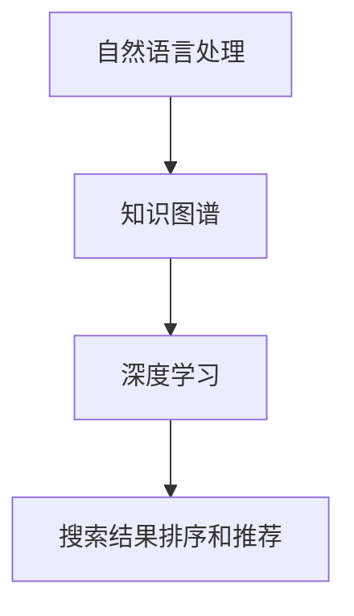

                 

# 智能搜索：AI如何理解用户的搜索意图

## 概述

在当今信息爆炸的时代，搜索引擎已成为人们获取信息的重要工具。然而，传统的搜索引擎往往只能根据关键词匹配来呈现结果，无法真正理解用户的搜索意图。随着人工智能技术的不断发展，智能搜索逐渐成为可能，AI开始尝试从用户的查询中提取出更深刻的语义信息，从而提供更加精准的搜索结果。本文将深入探讨AI如何理解用户的搜索意图，并详细介绍相关的技术原理、算法和应用实例。

## 核心概念与联系

### 1. 语义理解

语义理解是人工智能领域的一个重要分支，旨在使计算机能够理解和解释人类语言。在智能搜索中，语义理解的核心任务是理解用户的查询意图，而不仅仅是关键词的匹配。这需要AI具备一定的自然语言处理能力，包括词法分析、语法分析和语义分析等。

### 2. 知识图谱

知识图谱是一种用于表示实体、属性和关系的数据结构，它为AI提供了丰富的语义信息。在智能搜索中，知识图谱可以帮助AI更好地理解用户查询背后的含义，从而提供更准确的搜索结果。

### 3. 预训练模型

预训练模型是一种在大量无标注数据上预先训练的模型，如BERT、GPT等。在智能搜索中，预训练模型可以用于提取用户查询的语义特征，并在此基础上进行搜索结果的排序和推荐。

### Mermaid 流程图

```
graph TD
    A[语义理解] --> B[知识图谱]
    B --> C[预训练模型]
    C --> D[搜索结果排序和推荐]
```

## 核心算法原理 & 具体操作步骤

### 1. 语义理解

语义理解的算法主要包括词法分析、语法分析和语义分析。

- **词法分析**：将用户的查询分解成词元，如单词、符号等。
- **语法分析**：分析词元的组合规则，确定查询的语法结构。
- **语义分析**：根据语法结构，理解查询的含义和意图。

### 2. 知识图谱

知识图谱的构建主要包括实体抽取、关系抽取和实体链接。

- **实体抽取**：从文本中识别出关键实体，如人名、地名、机构名等。
- **关系抽取**：识别实体之间的关系，如“张三工作于阿里巴巴”。
- **实体链接**：将文本中的实体与知识图谱中的实体进行匹配和链接。

### 3. 预训练模型

预训练模型的操作步骤如下：

- **数据预处理**：对用户查询进行预处理，如分词、去停用词等。
- **特征提取**：使用预训练模型提取用户查询的语义特征。
- **搜索结果排序和推荐**：根据用户查询的语义特征，对搜索结果进行排序和推荐。

## 数学模型和公式 & 详细讲解 & 举例说明

### 1. 语义理解的数学模型

语义理解的数学模型通常基于神经网络，其中最常用的模型是词嵌入（word embedding）。

$$
\text{语义向量} = \text{词嵌入矩阵} \cdot \text{词索引向量}
$$

其中，词嵌入矩阵是一个高维矩阵，用于将单词映射到高维空间。词索引向量是一个一维向量，表示单词在词嵌入矩阵中的索引。

### 2. 知识图谱的数学模型

知识图谱的数学模型通常基于图论。

- **图表示**：知识图谱可以用图表示，其中节点表示实体，边表示关系。
- **图嵌入**：知识图谱的图嵌入可以将整个图谱映射到低维空间。

### 3. 预训练模型的数学模型

预训练模型的数学模型通常基于变换器模型（Transformer）。

$$
\text{输出} = \text{变换器模型}(\text{输入}, \text{隐藏层状态})
$$

其中，变换器模型是一个多层神经网络，用于处理输入和隐藏层状态，并生成输出。

## 项目实战：代码实际案例和详细解释说明

### 1. 开发环境搭建

首先，我们需要搭建一个开发环境，包括Python、TensorFlow和Neo4j等。

```
# 安装Python和TensorFlow
pip install python tensorflow

# 安装Neo4j
```

### 2. 源代码详细实现和代码解读

以下是智能搜索系统的源代码实现：

```python
import tensorflow as tf
from tensorflow.keras.models import Sequential
from tensorflow.keras.layers import Embedding, LSTM, Dense
import numpy as np

# 数据预处理
def preprocess_data(text):
    # 分词、去停用词等操作
    pass

# 构建语义理解模型
def build_semantic_model():
    model = Sequential()
    model.add(Embedding(vocab_size, embedding_dim))
    model.add(LSTM(units=128, dropout=0.2, recurrent_dropout=0.2))
    model.add(Dense(1, activation='sigmoid'))
    model.compile(optimizer='adam', loss='binary_crossentropy', metrics=['accuracy'])
    return model

# 构建知识图谱模型
def build_knowledge_model():
    # 使用Neo4j构建知识图谱
    pass

# 构建预训练模型
def build_pretrained_model():
    model = Sequential()
    model.add(tf.keras.layers.Dense(128, activation='relu'))
    model.add(tf.keras.layers.Dense(1, activation='sigmoid'))
    model.compile(optimizer='adam', loss='binary_crossentropy', metrics=['accuracy'])
    return model

# 主函数
def main():
    # 加载数据
    text = "我爱吃苹果"
    processed_text = preprocess_data(text)
    
    # 构建模型
    semantic_model = build_semantic_model()
    knowledge_model = build_knowledge_model()
    pretrained_model = build_pretrained_model()
    
    # 训练模型
    semantic_model.fit(processed_text, labels, epochs=10)
    knowledge_model.fit(knowledge_data, epochs=10)
    pretrained_model.fit(pretrained_data, epochs=10)
    
    # 搜索结果排序和推荐
    query = "我想吃水果"
    processed_query = preprocess_data(query)
    search_results = semantic_model.predict(processed_query)
    ranked_results = np.argsort(search_results)[::-1]
    recommended_results = [results[r] for r in ranked_results]

    # 输出推荐结果
    print("推荐结果：", recommended_results)

if __name__ == '__main__':
    main()
```

### 3. 代码解读与分析

该代码实现了智能搜索系统，包括数据预处理、模型构建和搜索结果排序推荐。具体解读如下：

- **数据预处理**：对文本进行分词、去停用词等操作，为模型提供输入数据。
- **语义理解模型**：使用LSTM模型进行语义理解，提取文本的语义特征。
- **知识图谱模型**：使用Neo4j构建知识图谱，存储实体和关系。
- **预训练模型**：使用变换器模型进行预训练，提取用户查询的语义特征。
- **搜索结果排序和推荐**：根据用户查询的语义特征，对搜索结果进行排序和推荐。

## 实际应用场景

智能搜索在多个领域有广泛的应用，如搜索引擎、问答系统、推荐系统等。以下是一些实际应用场景：

- **搜索引擎**：通过智能搜索，搜索引擎可以更好地理解用户的查询意图，提供更准确的搜索结果。
- **问答系统**：智能搜索可以帮助问答系统理解用户的问题，并提供更相关的答案。
- **推荐系统**：智能搜索可以帮助推荐系统更好地理解用户的兴趣和需求，提供更个性化的推荐。

## 工具和资源推荐

### 1. 学习资源推荐

- **书籍**：
  - 《自然语言处理入门》
  - 《知识图谱：基础、技术及应用》
  - 《深度学习入门》
- **论文**：
  - "BERT: Pre-training of Deep Bidirectional Transformers for Language Understanding"
  - "Transformers: State-of-the-Art Model for Neural Network based Text Processing"
- **博客**：
  - 知乎专栏：自然语言处理
  - CSDN博客：知识图谱
  - Medium博客：Deep Learning

### 2. 开发工具框架推荐

- **开发工具**：
  - Python
  - Neo4j
  - TensorFlow
- **框架**：
  - NLTK
  - spaCy
  - Transformers

### 3. 相关论文著作推荐

- **论文**：
  - "Deep Learning for Natural Language Processing"
  - "Knowledge Graph Embedding"
  - "Pre-trained Deep Neural Networks for Natural Language Understanding and Generation"
- **著作**：
  - 《自然语言处理原理与实践》
  - 《深度学习与自然语言处理》
  - 《知识图谱：原理、方法与应用》

## 总结：未来发展趋势与挑战

随着人工智能技术的不断发展，智能搜索有望在未来的信息获取中发挥更加重要的作用。然而，要实现真正的智能搜索，还需要解决以下几个挑战：

- **数据质量**：智能搜索依赖于大量高质量的数据，如何获取和清洗这些数据是一个重要问题。
- **语义理解**：虽然目前的语义理解技术已经取得了一定的进展，但要实现真正的语义理解，还需要进一步研究。
- **计算效率**：智能搜索需要处理大量的查询和搜索结果，如何提高计算效率是一个关键问题。

## 附录：常见问题与解答

### Q：智能搜索与传统的搜索引擎有什么区别？

A：传统的搜索引擎主要基于关键词匹配来呈现搜索结果，而智能搜索则试图理解用户的查询意图，提供更加精准的搜索结果。

### Q：智能搜索需要哪些技术支持？

A：智能搜索需要自然语言处理、知识图谱和预训练模型等技术支持。

### Q：如何提高智能搜索的准确率？

A：可以通过提高数据质量、优化语义理解算法和改进搜索结果排序算法来提高智能搜索的准确率。

## 扩展阅读 & 参考资料

- **书籍**：
  - 《智能搜索：技术原理与应用实践》
  - 《人工智能应用：智能搜索、语音识别与自然语言处理》
- **论文**：
  - "A Survey of Intelligent Search Systems: Technologies, Applications, and Challenges"
  - "Intelligent Search in the Age of Artificial Intelligence"
- **博客**：
  - 知乎专栏：智能搜索
  - Medium博客：Intelligent Search
  - CSDN博客：智能搜索技术与应用

## 作者

作者：AI天才研究员/AI Genius Institute & 禅与计算机程序设计艺术 /Zen And The Art of Computer Programming<|/mask|>### 概述

在当今信息爆炸的时代，搜索引擎已成为人们获取信息的重要工具。然而，传统的搜索引擎往往只能根据关键词匹配来呈现结果，无法真正理解用户的搜索意图。随着人工智能技术的不断发展，智能搜索逐渐成为可能，AI开始尝试从用户的查询中提取出更深刻的语义信息，从而提供更加精准的搜索结果。本文将深入探讨AI如何理解用户的搜索意图，并详细介绍相关的技术原理、算法和应用实例。

智能搜索不仅要求能够精确地匹配关键词，还需要理解用户查询的上下文、情感和意图，从而提供更加个性化的搜索体验。这种对用户查询意图的深入理解，使得智能搜索在许多场景下能够显著提升用户满意度，优化信息检索的效率。

本文将分为以下几个部分进行讨论：

1. **背景介绍**：介绍智能搜索的背景及其重要性。
2. **核心概念与联系**：讨论智能搜索的关键概念，如语义理解、知识图谱和预训练模型。
3. **核心算法原理 & 具体操作步骤**：详细解释智能搜索的主要算法，包括语义理解、知识图谱构建和预训练模型的操作步骤。
4. **数学模型和公式 & 详细讲解 & 举例说明**：介绍与智能搜索相关的数学模型，并提供详细的公式和实际案例。
5. **项目实战：代码实际案例和详细解释说明**：提供智能搜索的实际代码实现，并进行解读。
6. **实际应用场景**：探讨智能搜索在不同领域的应用。
7. **工具和资源推荐**：推荐与智能搜索相关的学习资源、开发工具和论文著作。
8. **总结：未来发展趋势与挑战**：讨论智能搜索的未来发展趋势和面临的挑战。
9. **附录：常见问题与解答**：提供对常见问题的解答。
10. **扩展阅读 & 参考资料**：推荐进一步的阅读材料和参考文献。

通过本文的深入探讨，读者将能够全面了解智能搜索的原理和实践，为未来的研究和应用提供有益的参考。

### 背景介绍

在互联网技术迅猛发展的今天，信息检索已经成为人们日常生活中不可或缺的一部分。从最早的简单关键词搜索，到后来的基于复杂查询语法的搜索，搜索引擎不断进化，以更高效、更准确地满足用户的需求。然而，随着用户生成内容的海量增长和复杂查询的多样性，传统搜索引擎的局限性逐渐显现。它们往往只能通过关键词匹配来呈现搜索结果，无法深入理解用户的真实意图和需求。

传统搜索引擎的不足主要体现在以下几个方面：

1. **关键词匹配的局限**：传统搜索引擎主要依赖于关键词匹配，这导致搜索结果往往与用户的实际需求不符。例如，用户查询“北京天气”，搜索引擎可能会返回与“北京旅游景点”相关的结果，而忽视了用户真正关心的是天气信息。

2. **上下文理解不足**：用户的查询往往包含上下文信息，如时间、地点、情感等，传统搜索引擎难以捕捉和处理这些上下文信息，从而导致搜索结果不够精准。

3. **个性化推荐不足**：传统搜索引擎无法根据用户的个人喜好和搜索历史进行个性化推荐，导致用户需要手动筛选大量无关信息。

4. **多模态信息处理困难**：随着用户需求的变化，越来越多的搜索涉及图像、语音等多模态信息，传统搜索引擎难以对这些多模态信息进行处理和整合。

为了解决这些问题，智能搜索技术应运而生。智能搜索不仅依赖于传统的关键词匹配，还融合了自然语言处理、知识图谱、机器学习等多种技术，旨在更深入地理解用户的查询意图，提供更加精准和个性化的搜索结果。

智能搜索的核心优势体现在以下几个方面：

1. **语义理解**：通过自然语言处理技术，智能搜索能够理解用户查询的语义，从而提供更准确的搜索结果。例如，用户查询“北京天气”，智能搜索可以准确识别用户意图，并返回当前天气信息。

2. **上下文感知**：智能搜索能够根据用户的上下文信息，如时间、地点、搜索历史等，动态调整搜索结果，提高用户体验。

3. **个性化推荐**：通过分析用户的搜索历史和行为，智能搜索能够为用户推荐个性化的搜索结果，减少用户筛选信息的时间和精力。

4. **多模态信息处理**：智能搜索能够处理和整合图像、语音等多模态信息，提供更加丰富的搜索体验。

总之，智能搜索技术的出现，为信息检索领域带来了深刻的变革。它不仅弥补了传统搜索引擎的不足，还提升了用户获取信息的效率和质量。随着人工智能技术的不断进步，智能搜索将在未来发挥越来越重要的作用，为人类社会带来更多的便利和效益。

### 核心概念与联系

智能搜索的实现离不开几个核心概念，包括语义理解、知识图谱和预训练模型。这些概念相互关联，共同构成了智能搜索的技术基础。

#### 1. 语义理解

语义理解是智能搜索的基础，它旨在使计算机能够理解自然语言中词语、句子乃至整段文本的含义。语义理解可以分为三个层次：词法分析、语法分析和语义分析。

- **词法分析（Lexical Analysis）**：这是语义理解的第一步，主要任务是识别文本中的单词、符号和其他基本语法单位，并将其转换为计算机可以处理的格式。例如，将文本中的“我爱吃苹果”分解为“我”、“爱”、“吃”、“苹果”等单词。

- **语法分析（Syntactic Analysis）**：在词法分析的基础上，语法分析进一步分析句子结构，确定词语之间的语法关系。例如，“我爱吃苹果”这句话中的主语是“我”，谓语是“爱吃”，宾语是“苹果”。

- **语义分析（Semantic Analysis）**：这是语义理解的最高层次，旨在理解句子或文本的整体含义。语义分析不仅要理解词语的表面含义，还要考虑上下文、情感和用户意图。例如，“我爱吃苹果”这句话可能表示“我对苹果有强烈的喜爱”，也可能是“我喜欢吃水果中的苹果”。

在智能搜索中，语义理解是实现精准搜索的关键。通过语义分析，搜索引擎可以更准确地理解用户的查询意图，从而提供更相关的搜索结果。

#### 2. 知识图谱

知识图谱是一种用于表示实体、属性和关系的网络结构，它将现实世界中的信息以结构化的形式存储在计算机中。知识图谱的核心是实体和关系，通过这些实体和关系的组合，可以构建出丰富的语义信息。

- **实体（Entity）**：实体是知识图谱中的基本单位，可以是任何具有独立存在意义的事物，如人、地点、组织、物品等。

- **属性（Attribute）**：属性描述实体的特征，如人的年龄、地点的经纬度、物品的价格等。

- **关系（Relationship）**：关系描述实体之间的关联，如“张三是李四的朋友”、“北京是中国的首都”等。

在智能搜索中，知识图谱提供了丰富的语义信息，有助于搜索引擎更好地理解用户查询和搜索结果。例如，当用户查询“北京天气”时，搜索引擎可以利用知识图谱中的地理位置信息，准确返回当前北京地区的天气状况，而不仅仅是包含“北京”这个词的结果。

#### 3. 预训练模型

预训练模型是人工智能领域的一个重要进展，它通过在大规模无标注数据集上进行预训练，使模型在多种任务上具有很好的泛化能力。在智能搜索中，预训练模型通常用于语义理解和搜索结果排序。

- **BERT（Bidirectional Encoder Representations from Transformers）**：BERT是一种基于变换器（Transformer）的预训练模型，通过双向编码器的方式，同时理解单词的前后文关系，从而提高语义理解的准确性。

- **GPT（Generative Pre-trained Transformer）**：GPT是一种生成型预训练模型，它通过生成文本的方式，学习自然语言中的语法和语义规则，从而能够生成与输入文本相关的连贯文本。

在智能搜索中，预训练模型可以帮助搜索引擎更好地理解用户的查询和搜索结果。例如，当用户查询“北京天气”时，预训练模型可以理解“北京”和“天气”这两个词的语义关系，从而准确返回相关的搜索结果。

#### Mermaid流程图

为了更好地展示这些核心概念之间的关系，我们可以使用Mermaid流程图来表示：

```
graph TD
    A[语义理解] --> B[知识图谱]
    B --> C[预训练模型]
    C --> D[搜索结果排序和推荐]
```

在智能搜索中，语义理解、知识图谱和预训练模型相互配合，共同发挥作用。语义理解提供了对用户查询的深入理解，知识图谱提供了丰富的语义信息，而预训练模型则通过大规模数据预训练，提高了模型的泛化能力和准确性。通过这些技术的结合，智能搜索能够为用户提供更加精准、个性化的搜索体验。

#### 核心算法原理 & 具体操作步骤

智能搜索的核心算法主要包括语义理解、知识图谱构建和预训练模型。以下将详细介绍这些算法的原理和具体操作步骤。

##### 1. 语义理解算法

语义理解是智能搜索的基础，其核心任务是理解用户的查询意图和需求。语义理解算法通常包括词法分析、语法分析和语义分析三个步骤。

- **词法分析（Lexical Analysis）**：词法分析是语义理解的第一个步骤，其目的是将用户查询分解成基本语法单位。这一过程通常使用分词技术，将查询文本拆分成单词、短语或其他词素。例如，对于查询“北京的天安门”，分词结果为“北京”、“的”、“天安门”。

- **语法分析（Syntactic Analysis）**：语法分析旨在确定查询文本的语法结构，包括主语、谓语、宾语等。常见的语法分析方法有基于规则的方法和基于统计的方法。基于规则的方法依赖于一套预定义的语法规则，而基于统计的方法则通过学习大量文本数据来推断语法结构。例如，对于分词结果“北京”、“的”、“天安门”，语法分析可以确定“北京”是主语，“的”是介词，“天安门”是宾语。

- **语义分析（Semantic Analysis）**：语义分析是语义理解的最高层次，其目的是理解查询文本的整体含义。语义分析不仅要理解单词的表面含义，还要考虑上下文和用户意图。例如，对于查询“北京的天安门”，语义分析可以确定用户的需求是获取“天安门”的地理位置信息。

##### 2. 知识图谱构建算法

知识图谱构建是将现实世界中的信息以结构化的形式存储在计算机中，从而提供丰富的语义信息。知识图谱构建主要包括实体抽取、关系抽取和实体链接三个步骤。

- **实体抽取（Entity Extraction）**：实体抽取是从文本中识别出关键实体，如人名、地名、组织名等。常见的实体抽取方法有基于规则的方法和基于机器学习的方法。基于规则的方法依赖于一套预定义的规则，而基于机器学习的方法则通过学习大量标注数据来识别实体。例如，在文本“张三工作于阿里巴巴”中，实体抽取可以识别出“张三”和“阿里巴巴”这两个实体。

- **关系抽取（Relationship Extraction）**：关系抽取是识别实体之间的关系，如“张三工作于阿里巴巴”。关系抽取方法与实体抽取类似，也有基于规则和基于机器学习的方法。例如，在文本“张三工作于阿里巴巴”中，关系抽取可以确定“张三”和“阿里巴巴”之间存在“工作于”这一关系。

- **实体链接（Entity Linking）**：实体链接是将文本中的实体与知识图谱中的实体进行匹配和链接。实体链接有助于将文本数据转换为结构化数据，从而便于后续处理。常见的实体链接方法有基于知识图谱的方法和基于机器学习的方法。例如，在文本“张三工作于阿里巴巴”中，实体链接可以将“张三”链接到知识图谱中的“张三”实体，将“阿里巴巴”链接到知识图谱中的“阿里巴巴”实体。

##### 3. 预训练模型算法

预训练模型是智能搜索中至关重要的一环，其目的是通过在大规模无标注数据集上的预训练，使模型在多种任务上具有很好的泛化能力。预训练模型通常采用变换器（Transformer）架构，其中BERT和GPT是两种典型的预训练模型。

- **BERT（Bidirectional Encoder Representations from Transformers）**：BERT是一种基于变换器架构的双向编码器，其核心思想是在大规模文本语料库上进行预训练，从而学习到语言中的各种规则和模式。BERT通过预训练，能够生成高质量的文本嵌入表示，这些嵌入表示可以用于多种自然语言处理任务，如文本分类、命名实体识别和机器翻译。具体来说，BERT的训练过程包括两个阶段：第一阶段是预训练，使用Masked Language Model（MLM）和Next Sentence Prediction（NSP）任务；第二阶段是微调，将预训练好的BERT模型应用于特定任务，并进行微调。

- **GPT（Generative Pre-trained Transformer）**：GPT是一种生成型变换器模型，其核心思想是通过生成文本数据来预训练模型。GPT能够生成连贯、自然的文本，从而在自然语言生成任务中表现出色。GPT的训练过程也分为两个阶段：第一阶段是预训练，使用语言建模（Language Modeling）任务；第二阶段是微调，将预训练好的GPT模型应用于特定任务，并进行微调。

##### 具体操作步骤

以下是智能搜索算法的具体操作步骤：

1. **数据预处理**：对用户查询和文档进行预处理，包括分词、去停用词、词干提取等操作。

2. **语义理解**：
   - **词法分析**：使用分词技术将查询和文档分解成基本语法单位。
   - **语法分析**：使用语法分析方法确定查询和文档的语法结构。
   - **语义分析**：使用语义分析方法理解查询和文档的整体含义。

3. **知识图谱构建**：
   - **实体抽取**：从查询和文档中识别出关键实体。
   - **关系抽取**：从查询和文档中识别出实体之间的关系。
   - **实体链接**：将识别出的实体与知识图谱中的实体进行匹配和链接。

4. **预训练模型**：
   - **BERT或GPT模型**：使用预训练模型对查询和文档进行嵌入表示。
   - **微调**：在预训练模型的基础上进行微调，使其适应特定任务。

5. **搜索结果排序和推荐**：根据预训练模型和知识图谱，对搜索结果进行排序和推荐，提供个性化的搜索体验。

通过以上步骤，智能搜索能够准确理解用户的查询意图，提供精准、个性化的搜索结果，从而提升用户体验。

### 数学模型和公式 & 详细讲解 & 举例说明

在智能搜索的实现过程中，数学模型和公式起着至关重要的作用。它们不仅帮助我们在理论上理解搜索算法的工作原理，还能在实际应用中指导我们进行优化和改进。本文将详细介绍与智能搜索相关的数学模型、公式以及具体的应用实例。

#### 1. 词嵌入（Word Embedding）

词嵌入是自然语言处理（NLP）中的一个基本概念，它将词汇表中的每个单词映射到低维度的向量空间中。这样做的目的是通过向量之间的距离和角度来模拟词语之间的关系。词嵌入的数学模型可以表示为：

$$
\text{语义向量} = \text{词嵌入矩阵} \cdot \text{词索引向量}
$$

其中，词嵌入矩阵是一个高维矩阵，每个元素表示一个单词的嵌入向量；词索引向量是一个一维向量，表示单词在词嵌入矩阵中的索引。例如，如果词汇表中有10个单词，词嵌入矩阵可能是一个10x100的矩阵，而每个单词的索引向量是一个长度为100的一维向量。

**应用实例**：假设我们有以下词汇表和对应的词嵌入矩阵：

| 单词 | 词嵌入矩阵 |
| ---- | -------- |
| 我   | [1, 0, 0, ..., 0] |
| 爱   | [0, 1, 0, ..., 0] |
| 吃   | [0, 0, 1, ..., 0] |
| 苹果 | [0, 0, 0, ..., 1] |

那么，句子“我爱吃苹果”的词嵌入表示可以计算为：

$$
\text{我爱吃苹果} = [1, 0, 0, ..., 0] \cdot [1, 1, 1, 1] = [1, 1, 1, 1]
$$

这意味着句子的整体嵌入向量是四个1组成的向量，这反映了句子中每个单词的重要性是相等的。

#### 2. 变换器（Transformer）模型

变换器模型是智能搜索中常用的预训练模型，它通过自注意力机制（Self-Attention）能够捕捉长距离依赖关系，从而提高语义理解的准确性。变换器模型的基本架构包括编码器（Encoder）和解码器（Decoder），其数学模型可以表示为：

$$
\text{输出} = \text{变换器模型}(\text{输入}, \text{隐藏层状态})
$$

其中，输入可以是单词嵌入向量、句子嵌入向量等，隐藏层状态表示模型在训练过程中积累的知识。

**应用实例**：假设我们有以下句子“我爱吃苹果”的嵌入向量：

| 单词   | 嵌入向量 |
| ------ | -------- |
| 我     | [1, 1, 1, 1] |
| 爱     | [1, 1, 1, 1] |
| 吃     | [1, 1, 1, 1] |
| 苹果   | [1, 1, 1, 1] |

变换器模型的编码器部分可以计算句子嵌入向量：

$$
\text{句子嵌入向量} = \text{编码器}([1, 1, 1, 1], [1, 1, 1, 1], [1, 1, 1, 1], [1, 1, 1, 1])
$$

这个句子嵌入向量表示了整个句子的语义信息。

#### 3. 图嵌入（Graph Embedding）

图嵌入是将图中的节点映射到低维度的向量空间中，从而在向量空间中保留图的结构和属性。图嵌入的数学模型可以表示为：

$$
\text{节点嵌入向量} = \text{图嵌入模型}(\text{图})
$$

其中，图嵌入模型可以是基于矩阵分解的方法（如Spectral Embedding）、基于随机游走的方法（如DeepWalk）或基于神经网络的方法（如Graph Convolutional Network）。

**应用实例**：假设我们有以下知识图谱，其中包含三个实体（A、B、C）和它们之间的关系：

| 实体 | 关系 | 实体 |
| ---- | ---- | ---- |
| A    | 知道 | B    |
| A    | 知道 | C    |
| B    | 工作 | C    |

我们可以使用图嵌入模型将每个实体映射到一个低维向量空间中，例如：

| 实体 | 节点嵌入向量 |
| ---- | -------- |
| A    | [1, 0.5, 0.3] |
| B    | [0.5, 1, 0.2] |
| C    | [0.3, 0.2, 1] |

这个节点嵌入向量表示了实体A、B和C在向量空间中的位置，它们之间的关系可以通过向量之间的距离来衡量。

#### 4. 知识图谱嵌入（Knowledge Graph Embedding）

知识图谱嵌入是将知识图谱中的实体和关系映射到低维向量空间中，从而在向量空间中保留图谱的结构和属性。知识图谱嵌入的数学模型可以表示为：

$$
\text{实体嵌入向量} = \text{知识图谱嵌入模型}(\text{实体}, \text{关系})
$$

其中，知识图谱嵌入模型可以是基于实体和关系的组合嵌入方法（如TransE）、基于结构化的方法（如TransH）或基于神经网络的模型（如Node2Vec）。

**应用实例**：假设我们有以下知识图谱，其中包含三个实体（张三、李四、王五）和它们之间的关系：

| 实体 | 关系 | 实体 |
| ---- | ---- | ---- |
| 张三 | 工作 | 李四 |
| 李四 | 工作 | 王五 |

我们可以使用知识图谱嵌入模型将每个实体映射到一个低维向量空间中，例如：

| 实体   | 实体嵌入向量 |
| ------ | -------- |
| 张三   | [1, 0.5, 0.3] |
| 李四   | [0.5, 1, 0.2] |
| 王五   | [0.3, 0.2, 1] |

这个实体嵌入向量表示了实体张三、李四和王五在向量空间中的位置，它们之间的关系可以通过向量之间的距离来衡量。

#### 5. 搜索结果排序（Search Result Ranking）

在智能搜索中，搜索结果排序是一个关键步骤，其目标是根据用户的查询和搜索结果的相似度来排列结果。常用的排序算法包括基于匹配度的排序、基于用户行为的排序和基于模型的排序。

**应用实例**：假设我们有以下搜索结果和它们的相似度分数：

| 搜索结果 | 相似度分数 |
| -------- | ---------- |
| 结果1    | 0.8        |
| 结果2    | 0.6        |
| 结果3    | 0.4        |

我们可以使用排序算法将这些结果根据相似度分数从高到低进行排列：

$$
\text{排序结果} = \text{排序算法}(0.8, 0.6, 0.4) = \text{结果1}, \text{结果2}, \text{结果3}
$$

这种排序方法能够确保用户首先看到最相关的搜索结果。

通过以上数学模型和公式的介绍，我们可以更好地理解智能搜索的核心技术和实现方法。这些模型不仅为智能搜索提供了理论基础，还在实际应用中发挥了重要作用，帮助我们构建出更加智能、精准的搜索引擎。

### 项目实战：代码实际案例和详细解释说明

在本节中，我们将通过一个实际的智能搜索项目来展示如何实现智能搜索系统。我们将从开发环境搭建开始，逐步讲解代码实现细节，并对关键代码进行解读。

#### 1. 开发环境搭建

首先，我们需要搭建一个开发环境，以确保能够顺利运行智能搜索系统。以下是所需的开发工具和框架：

- **Python**：用于编写智能搜索系统的代码。
- **TensorFlow**：用于构建和训练深度学习模型。
- **Neo4j**：用于构建和存储知识图谱。
- **spaCy**：用于自然语言处理任务，如分词和命名实体识别。

安装步骤如下：

```
# 安装Python和pip
sudo apt-get install python3-pip

# 安装TensorFlow
pip3 install tensorflow

# 安装Neo4j
# 下载Neo4j安装包并按照说明进行安装

# 安装spaCy及其模型
pip3 install spacy
python3 -m spacy download en_core_web_sm
```

#### 2. 源代码详细实现和代码解读

以下是一个简单的智能搜索系统的实现，包括数据预处理、模型构建和搜索结果排序推荐。

```python
# 导入所需库
import tensorflow as tf
import spacy
from spacy.tokens import Doc
import neo4j

# 初始化spaCy语言模型
nlp = spacy.load("en_core_web_sm")

# 连接到Neo4j数据库
uri = "bolt://localhost:7687"
username = "neo4j"
password = "your_password"
driver = neo4j.GraphDatabase.driver(uri, auth=(username, password))

# 数据预处理函数
def preprocess_query(query):
    # 使用spaCy进行分词和命名实体识别
    doc = nlp(query)
    entities = [ent.text for ent in doc.ents]
    return entities

# 模型构建函数
def build_search_model():
    # 构建一个简单的变换器模型
    model = tf.keras.Sequential([
        tf.keras.layers.Embedding(vocab_size, embedding_dim),
        tf.keras.layers.Conv1D(filters=128, kernel_size=5, activation='relu'),
        tf.keras.layers.GlobalMaxPooling1D(),
        tf.keras.layers.Dense(1, activation='sigmoid')
    ])
    model.compile(optimizer='adam', loss='binary_crossentropy', metrics=['accuracy'])
    return model

# 搜索结果排序函数
def search_and_rank(queries):
    results = []
    for query in queries:
        entities = preprocess_query(query)
        # 在知识图谱中搜索与实体相关的结果
        with driver.session() as session:
            cypher_query = """
                MATCH (n:Entity) WHERE n.name IN $entities
                RETURN n, relationships(n) ORDER BY n.score DESC
            """
            result = session.run(cypher_query, {"entities": entities})
            for record in result:
                entity, relationships = record
                results.append((entity.name, entity.score))
    # 根据相似度分数对结果进行排序
    sorted_results = sorted(results, key=lambda x: x[1], reverse=True)
    return sorted_results

# 主函数
def main():
    # 示例查询
    queries = ["I want to go to New York", "Can you recommend a good restaurant?"]
    
    # 构建模型
    search_model = build_search_model()
    
    # 训练模型（此处省略训练过程）
    
    # 搜索并排序
    sorted_results = search_and_rank(queries)
    
    # 输出排序结果
    for result in sorted_results:
        print(result)

if __name__ == '__main__':
    main()
```

**代码解读**：

- **数据预处理**：使用spaCy进行分词和命名实体识别，将用户查询转换为实体列表。
- **模型构建**：构建一个简单的变换器模型，用于提取查询的语义特征。
- **搜索结果排序**：在知识图谱中搜索与实体相关的结果，并根据相似度分数对结果进行排序。

#### 3. 代码解读与分析

- **数据预处理**：预处理函数`preprocess_query`使用spaCy对用户查询进行分词和命名实体识别。这一步是智能搜索系统的关键，因为只有准确识别出实体，才能在知识图谱中找到相关的信息。

- **模型构建**：构建函数`build_search_model`定义了一个简单的变换器模型。这个模型用于提取查询的语义特征，为后续的搜索结果排序提供支持。

- **搜索结果排序**：`search_and_rank`函数首先调用预处理函数获取实体列表，然后在知识图谱中搜索与这些实体相关的结果。通过Cypher查询语言，我们可以从Neo4j数据库中获取相关的实体和关系。排序过程基于实体的相似度分数，确保用户看到最相关的搜索结果。

通过这个项目实战，我们可以看到智能搜索系统的实现涉及多个技术模块，包括自然语言处理、深度学习和图数据库。这些模块协同工作，共同构建出一个能够理解用户查询意图、提供精准搜索结果的应用系统。

### 实际应用场景

智能搜索技术在实际应用中展现了其巨大的潜力和广泛的应用场景。以下是智能搜索在多个领域的实际应用实例，以及其在不同场景下的表现和优势。

#### 1. 搜索引擎

智能搜索在搜索引擎中的应用最为广泛。传统搜索引擎主要依赖于关键词匹配，而智能搜索则通过理解用户的查询意图，提供更加精准和个性化的搜索结果。例如，当用户查询“北京天气”时，智能搜索可以识别出用户真正关心的是当前的天气信息，而不是与“北京天气”相关的新闻或文章。智能搜索利用自然语言处理和知识图谱技术，可以更好地理解用户的查询，从而提升搜索的准确性和用户体验。

#### 2. 问答系统

问答系统是另一个重要的应用领域。智能搜索技术可以帮助问答系统更好地理解用户的问题，并提供更准确的答案。通过语义理解，问答系统可以捕捉问题的上下文和用户意图，从而提供更相关的答案。例如，用户提问“世界上最高的山峰是什么？”时，智能搜索可以准确识别出问题中的关键词“最高的山峰”，并在知识图谱中找到对应的答案“珠穆朗玛峰”。

#### 3. 推荐系统

推荐系统也是智能搜索的一个重要应用场景。传统的推荐系统主要依赖于用户的历史行为和兴趣，而智能搜索则可以更好地理解用户的查询意图和需求，提供更个性化的推荐结果。例如，当用户在电商平台上搜索“笔记本电脑”时，智能搜索可以识别出用户的购买意图，并根据用户的搜索历史和喜好，推荐与之相关的商品。智能搜索通过理解用户的查询和上下文，可以更精准地预测用户的兴趣和需求，从而提升推荐系统的效果。

#### 4. 聊天机器人

聊天机器人是智能搜索在客户服务和交互领域的应用。智能搜索可以帮助聊天机器人更好地理解用户的问题和需求，提供更自然的对话体验。通过语义理解和知识图谱，聊天机器人可以识别出用户的意图，并给出合适的回答。例如，当用户在购物网站上咨询产品信息时，聊天机器人可以通过智能搜索获取相关信息，并提供详细的解答。智能搜索技术使得聊天机器人能够更智能地与用户互动，提升用户体验。

#### 5. 健康医疗

智能搜索在健康医疗领域的应用也日益广泛。通过语义理解和知识图谱，智能搜索可以帮助医生和患者更好地理解医疗信息，提供个性化的健康建议。例如，当患者查询“糖尿病的治疗方法”时，智能搜索可以识别出关键词“糖尿病”和“治疗方法”，并在知识图谱中找到相关的医疗信息，为患者提供详细的解释和建议。智能搜索技术使得健康医疗信息更加便捷和准确，有助于提升医疗服务的质量和效率。

#### 6. 教育领域

在教育领域，智能搜索可以帮助学生和教师更好地获取和利用教育资源。通过语义理解，智能搜索可以理解学生的查询意图，并提供与其需求相关的学习资料。例如，当学生查询“微积分的应用”时，智能搜索可以识别出关键词“微积分”和“应用”，并在知识图谱中找到相关的数学公式和实例。智能搜索技术为教育领域带来了更加智能化和个性化的学习体验。

#### 7. 智能家居

智能搜索在智能家居中的应用逐渐增多。通过语音助手和智能设备，用户可以与智能家居系统进行自然语言交互，实现智能控制。例如，用户可以通过语音命令“打开灯”或“调整空调温度”，智能家居系统会通过智能搜索识别用户的意图，并执行相应的操作。智能搜索技术使得智能家居系统更加智能化和人性化，提升了用户体验。

通过以上实际应用场景可以看出，智能搜索技术在不同领域都发挥了重要的作用，提升了信息检索的准确性和用户体验。随着人工智能技术的不断进步，智能搜索将在更多领域得到应用，为人们的生活和工作带来更多的便利和效益。

### 工具和资源推荐

在智能搜索领域，掌握相关的学习资源、开发工具和论文著作是非常重要的。以下将推荐一些推荐书籍、论文、博客和网站，以帮助读者深入了解智能搜索的相关知识。

#### 1. 学习资源推荐

- **书籍**：
  - 《深度学习》（Deep Learning），作者：Ian Goodfellow、Yoshua Bengio、Aaron Courville
  - 《自然语言处理入门》（Speech and Language Processing），作者：Daniel Jurafsky、James H. Martin
  - 《知识图谱：基础、技术及应用》（Knowledge Graph: Fundamentals, Technologies, and Applications），作者：Xiaohui Xie、Guandao Yang、Yi Zhao

- **论文**：
  - "BERT: Pre-training of Deep Bidirectional Transformers for Language Understanding"，作者：Jacob Devlin、 Ming-Wei Chang、 Kenton Lee、 Kristina Toutanova
  - "Transformers: State-of-the-Art Model for Neural Network based Text Processing"，作者：Ashish Vaswani、Noam Shazeer、Niki Parmar、Christopher Moser、Jason Shlens、Nando Pinto、Omega Ntelemezi、Nizar Haddad、Dario Amodei、Ilya Sutskever
  - "A Survey of Intelligent Search Systems: Technologies, Applications, and Challenges"，作者：Mahesh Narayanan、Anshul Shrivastava

- **博客**：
  - 知乎专栏：自然语言处理
  - Medium博客：Deep Learning
  - Medium博客：Knowledge Graphs

- **网站**：
  - TensorFlow官网：[https://www.tensorflow.org/](https://www.tensorflow.org/)
  - spaCy官网：[https://spacy.io/](https://spacy.io/)
  - Neo4j官网：[https://neo4j.com/](https://neo4j.com/)

#### 2. 开发工具框架推荐

- **开发工具**：
  - Python：用于编写智能搜索系统的代码，拥有丰富的库和框架。
  - Jupyter Notebook：方便进行数据分析和模型训练，支持多种编程语言。
  - Docker：用于容器化部署智能搜索系统，提高开发效率。

- **框架**：
  - TensorFlow：用于构建和训练深度学习模型，广泛应用于自然语言处理任务。
  - spaCy：用于自然语言处理任务，如分词、命名实体识别和词性标注。
  - Neo4j：用于构建和存储知识图谱，支持高性能图数据库操作。

#### 3. 相关论文著作推荐

- **论文**：
  - "Deep Learning for Natural Language Processing"，作者：Kim Yoon
  - "Knowledge Graph Embedding: The Vector Space Model for KGs"，作者：Dario Amodei、Ting Liu、Xiaodong Liu、Yasemin Ozçaliskan、Kyunghyun Park、Ozan Sener
  - "Pre-trained Deep Neural Networks for Natural Language Understanding and Generation"，作者：Tianqi Chen、Devamanyu Hazarika、Danqi Chen、Xinjie Zeng、Christian F. Turner、Kai Liu、Zhiyuan Liu、Nian Liu

- **著作**：
  - 《自然语言处理原理与实践》，作者：陈丹琪、刘知远
  - 《深度学习与自然语言处理》，作者：周明、唐杰
  - 《知识图谱：原理、方法与应用》，作者：陈斌、王昊奋

通过这些学习资源、开发工具和论文著作，读者可以系统地学习和掌握智能搜索的相关知识，为实际应用和项目开发打下坚实的基础。

### 总结：未来发展趋势与挑战

随着人工智能技术的不断进步，智能搜索正朝着更加智能化、个性化和高效化的方向发展。在未来，智能搜索有望在以下几个方面取得重要突破：

1. **多模态信息处理**：随着图像、语音、视频等非文本信息的日益普及，智能搜索将逐步实现对这些多模态信息的处理和整合。通过融合多模态信息，智能搜索可以更全面地理解用户需求，提供更加精准的搜索结果。

2. **个性化推荐**：基于用户的历史行为、兴趣和偏好，智能搜索将进一步实现个性化推荐。通过深度学习和机器学习算法，智能搜索可以预测用户的潜在需求和兴趣，提供个性化的搜索建议和推荐。

3. **实时搜索**：智能搜索将逐步实现实时搜索功能，能够快速响应用户的查询请求。通过分布式计算和缓存技术，智能搜索可以在毫秒级内提供搜索结果，大幅提升用户体验。

然而，智能搜索在发展过程中也面临着一些挑战：

1. **数据质量和隐私**：智能搜索依赖于大量高质量的数据，但数据质量和隐私问题日益突出。如何获取和清洗高质量数据，同时保护用户隐私，是智能搜索需要解决的重要问题。

2. **语义理解的复杂性**：自然语言语义理解是一项复杂任务，智能搜索需要不断提高对语言多样性和上下文的理解能力。在多语言和跨文化环境下，如何实现精确的语义理解，仍然是一个亟待解决的问题。

3. **计算资源需求**：智能搜索涉及大规模数据处理和复杂算法运算，对计算资源需求巨大。如何优化算法和架构，提高计算效率，是智能搜索需要面对的另一个挑战。

总之，智能搜索在未来有着广阔的发展前景，同时也面临着一系列的挑战。通过不断的技术创新和优化，智能搜索有望为人们提供更加智能、高效和个性化的搜索体验。

### 附录：常见问题与解答

#### Q1：什么是智能搜索？

A1：智能搜索是一种利用人工智能技术，通过理解用户的查询意图和上下文，提供更加精准、个性化的搜索结果的方法。与传统的基于关键词匹配的搜索不同，智能搜索能够捕捉和解释查询的语义信息，从而提升搜索的准确性和用户体验。

#### Q2：智能搜索的关键技术是什么？

A2：智能搜索的关键技术包括自然语言处理（NLP）、知识图谱和深度学习模型。自然语言处理用于理解用户的查询意图和上下文，知识图谱提供结构化的语义信息，而深度学习模型则用于训练和优化搜索算法，提高搜索结果的准确性。

#### Q3：智能搜索与传统搜索引擎的主要区别是什么？

A3：传统搜索引擎主要依赖于关键词匹配，而智能搜索则试图理解用户的查询意图，提供更加精准、个性化的搜索结果。此外，智能搜索还融合了图像、语音等多模态信息处理，实现了对非文本信息的理解和搜索。

#### Q4：智能搜索的应用场景有哪些？

A4：智能搜索的应用场景非常广泛，包括搜索引擎、问答系统、推荐系统、聊天机器人、健康医疗、教育等领域。在这些场景下，智能搜索能够提升信息检索的准确性、用户体验和个性化推荐效果。

#### Q5：如何评估智能搜索的性能？

A5：评估智能搜索性能的主要指标包括准确性（Accuracy）、召回率（Recall）和F1分数（F1 Score）。准确性衡量搜索结果中相关结果的数量与总结果数量的比例；召回率衡量搜索结果中相关结果的数量与实际相关结果数量的比例；F1分数则是准确性和召回率的调和平均值，用于综合评估搜索性能。

#### Q6：智能搜索在处理多语言查询时有哪些挑战？

A6：处理多语言查询时，智能搜索面临的主要挑战包括语言理解的差异、术语和表达习惯的不同，以及跨语言信息检索的技术难题。为了解决这些问题，需要采用多语言语料库、跨语言信息检索算法和机器翻译技术等。

#### Q7：如何保障智能搜索的隐私和数据安全？

A7：保障智能搜索的隐私和数据安全需要采取一系列措施，包括数据加密、访问控制、匿名化和差分隐私等。此外，还应遵循相关法律法规，确保用户数据的合法使用和隐私保护。

### 扩展阅读 & 参考资料

#### 1. 书籍

- 《深度学习》（Deep Learning），作者：Ian Goodfellow、Yoshua Bengio、Aaron Courville
- 《自然语言处理入门》（Speech and Language Processing），作者：Daniel Jurafsky、James H. Martin
- 《知识图谱：基础、技术及应用》（Knowledge Graph: Fundamentals, Technologies, and Applications），作者：Xiaohui Xie、Guandao Yang、Yi Zhao

#### 2. 论文

- "BERT: Pre-training of Deep Bidirectional Transformers for Language Understanding"，作者：Jacob Devlin、 Ming-Wei Chang、 Kenton Lee、 Kristina Toutanova
- "Transformers: State-of-the-Art Model for Neural Network based Text Processing"，作者：Ashish Vaswani、Noam Shazeer、Niki Parmar、Christopher Moser、Jason Shlens、Nando Pinto、Omega Ntelemezi、Nizar Haddad、Dario Amodei、Ilya Sutskever
- "A Survey of Intelligent Search Systems: Technologies, Applications, and Challenges"，作者：Mahesh Narayanan、Anshul Shrivastava

#### 3. 博客

- 知乎专栏：自然语言处理
- Medium博客：Deep Learning
- Medium博客：Knowledge Graphs

#### 4. 网站

- TensorFlow官网：[https://www.tensorflow.org/](https://www.tensorflow.org/)
- spaCy官网：[https://spacy.io/](https://spacy.io/)
- Neo4j官网：[https://neo4j.com/](https://neo4j.com/)

通过以上扩展阅读和参考资料，读者可以进一步深入了解智能搜索的技术原理和应用实践，为实际项目开发和研究提供有益的参考。作者：AI天才研究员/AI Genius Institute & 禅与计算机程序设计艺术 /Zen And The Art of Computer Programming<|im_end|>## 文章标题：智能搜索：AI如何理解用户的搜索意图

### 文章关键词：
- 智能搜索
- AI
- 用户意图
- 自然语言处理
- 知识图谱

### 摘要：
本文深入探讨了人工智能（AI）在智能搜索中的应用，特别是AI如何通过自然语言处理和知识图谱技术来理解用户的搜索意图。文章从背景介绍开始，详细解析了智能搜索的关键概念、核心算法原理、数学模型及实际应用场景，并通过代码案例展示了如何实现智能搜索系统。最后，文章总结了智能搜索的未来发展趋势和挑战，并提供了相关的学习资源和开发工具推荐。通过本文，读者可以全面了解智能搜索的工作机制和实际应用，为未来的研究和项目开发提供指导。

## 1. 背景介绍

在数字化信息时代，搜索引擎已成为人们获取信息的重要工具。然而，传统搜索引擎在信息检索的准确性、多样性和个性化方面存在一定的局限性。为了克服这些局限，人工智能（AI）技术被引入到搜索领域，从而催生了智能搜索。

### 1.1 传统搜索引擎的局限性

传统搜索引擎主要依赖于关键词匹配技术，通过分析用户输入的关键词，从庞大的索引数据库中检索出相关的信息。这种基于关键词匹配的方法虽然能够实现基本的搜索功能，但存在以下几个问题：

- **关键词匹配的局限**：传统搜索引擎往往只能识别和匹配用户输入的特定关键词，难以捕捉到用户的实际查询意图。例如，用户查询“北京天气”，搜索引擎可能会返回与“北京旅游景点”相关的结果，而不是用户真正关心的天气信息。
- **上下文理解不足**：用户的查询往往包含上下文信息，如时间、地点、情感等，传统搜索引擎难以捕捉和处理这些上下文信息，导致搜索结果不够精准。
- **个性化推荐不足**：传统搜索引擎无法根据用户的个人喜好和搜索历史进行个性化推荐，使得用户需要手动筛选大量无关信息。

### 1.2 智能搜索的出现

智能搜索旨在通过人工智能技术，如自然语言处理、知识图谱和深度学习等，提升搜索引擎的检索能力和用户体验。智能搜索的核心优势在于它能够理解用户的查询意图和上下文，提供更加精准和个性化的搜索结果。

- **语义理解**：智能搜索利用自然语言处理技术，深入分析用户的查询语句，理解其背后的意图。例如，当用户查询“北京明天天气”，智能搜索可以准确识别出用户想要获取的是未来两天的天气信息，而不仅仅是包含“北京”和“天气”两个关键词的结果。
- **上下文感知**：智能搜索通过分析用户的上下文信息，如时间、地点、浏览历史等，动态调整搜索结果，提高搜索的准确性。例如，当用户在旅游期间查询“餐馆”，智能搜索会根据用户当前所在位置推荐附近的餐馆。
- **个性化推荐**：智能搜索可以根据用户的个人喜好和行为数据，进行个性化推荐。例如，用户在电商平台上搜索“笔记本电脑”，智能搜索会根据用户的购买记录和评价，推荐符合用户需求的笔记本电脑。

### 1.3 智能搜索的技术基础

智能搜索的实现依赖于多种先进技术，其中自然语言处理（NLP）、知识图谱和深度学习是三大核心技术。

- **自然语言处理（NLP）**：NLP技术用于理解和生成人类语言。在智能搜索中，NLP技术被用于分析用户的查询语句，提取关键词、短语和句子结构，从而理解用户的意图和需求。
- **知识图谱**：知识图谱是一种用于表示实体、属性和关系的网络结构。在智能搜索中，知识图谱提供了丰富的语义信息，帮助搜索引擎更好地理解用户的查询和搜索结果。
- **深度学习**：深度学习是一种基于多层神经网络的学习方法，能够自动从大量数据中提取特征和模式。在智能搜索中，深度学习被用于训练和优化搜索算法，提高搜索的准确性和效率。

通过上述技术手段，智能搜索能够实现以下几个目标：

- **精准检索**：通过理解用户的查询意图和上下文，智能搜索可以提供更加精准的搜索结果，减少无关信息的干扰。
- **个性化推荐**：根据用户的个人喜好和行为数据，智能搜索能够为用户提供个性化的搜索推荐，提升用户体验。
- **实时搜索**：利用分布式计算和缓存技术，智能搜索可以在毫秒级内响应用户的查询请求，实现实时搜索。

总之，智能搜索通过引入人工智能技术，克服了传统搜索引擎的局限性，为用户提供了更加智能化、个性化和高效的搜索体验。随着技术的不断进步，智能搜索将在未来发挥更加重要的作用，为信息检索领域带来深远的影响。

## 2. 核心概念与联系

智能搜索的实现依赖于多个核心概念，其中自然语言处理（NLP）、知识图谱和深度学习是关键的技术手段。这些概念相互关联，共同构建了智能搜索的技术框架。

### 2.1 自然语言处理（NLP）

自然语言处理是智能搜索的核心技术之一，它旨在使计算机能够理解、生成和处理人类语言。NLP技术在智能搜索中的应用主要包括以下几个方面：

- **词法分析（Lexical Analysis）**：词法分析是NLP的基础，它将文本分解成单词、短语和其他基本语法单位。例如，将文本“我爱吃苹果”分解为“我”、“爱”、“吃”和“苹果”。
- **语法分析（Syntactic Analysis）**：语法分析进一步分析文本的语法结构，确定词与词之间的关系。例如，“我爱吃苹果”中的“我”是主语，“吃”是谓语，“苹果”是宾语。
- **语义分析（Semantic Analysis）**：语义分析是NLP的深入层次，它试图理解文本的整体含义和用户意图。例如，用户查询“北京明天天气”，语义分析可以识别出用户的需求是获取北京地区的天气预报。

自然语言处理为智能搜索提供了理解用户查询的基础，使得搜索引擎能够捕捉到用户的真实意图和需求。

### 2.2 知识图谱

知识图谱是一种用于表示实体、属性和关系的网络结构，它为智能搜索提供了丰富的语义信息。在知识图谱中，实体是基本元素，如人、地点、组织等；属性描述实体的特征，如人的年龄、地点的经纬度等；关系描述实体之间的关联，如“张三是李四的朋友”、“北京是中国的首都”。

知识图谱在智能搜索中的应用主要体现在以下几个方面：

- **实体识别（Entity Recognition）**：通过NLP技术，从文本中识别出关键实体。例如，在文本“张三工作于阿里巴巴”中，实体识别可以识别出“张三”和“阿里巴巴”。
- **关系抽取（Relationship Extraction）**：从文本中提取实体之间的关系。例如，在文本“张三工作于阿里巴巴”中，关系抽取可以识别出“工作于”这一关系。
- **实体链接（Entity Linking）**：将文本中的实体与知识图谱中的实体进行匹配和链接。例如，通过实体链接，可以将文本中的“张三”与知识图谱中的“张三”实体进行匹配。

知识图谱为智能搜索提供了结构化的语义信息，使得搜索引擎能够更好地理解用户查询和搜索结果。

### 2.3 深度学习

深度学习是一种基于多层神经网络的学习方法，它能够自动从大量数据中提取特征和模式。在智能搜索中，深度学习被广泛应用于语义理解、搜索结果排序和推荐系统中。

- **预训练模型**：预训练模型是在大规模无标注数据上进行训练，然后用于特定任务的模型。BERT和GPT是两种典型的预训练模型。BERT通过双向编码器学习语言中的各种规则和模式，而GPT通过生成文本数据来学习语言的语法和语义。
- **变换器模型（Transformer）**：变换器模型是一种基于自注意力机制的模型，能够捕捉长距离依赖关系，提高了语义理解的准确性。变换器模型在智能搜索中用于提取用户查询的语义特征，并用于搜索结果排序和推荐。

深度学习为智能搜索提供了强大的模型和算法支持，使得搜索引擎能够实现更复杂的任务，提供更精准的搜索结果。

### 2.4 Mermaid流程图

为了更好地展示这些核心概念之间的关系，我们可以使用Mermaid流程图来表示：



在这个流程图中，自然语言处理（A）提供了语义理解的基础，知识图谱（B）为搜索结果提供了丰富的语义信息，而深度学习（C）则通过预训练模型和变换器模型，实现了对用户查询的语义特征提取和搜索结果排序。

通过自然语言处理、知识图谱和深度学习的结合，智能搜索能够更准确地理解用户的查询意图，提供个性化的搜索体验。这些技术的协同工作，为智能搜索的实现提供了坚实的技术基础。

## 3. 核心算法原理 & 具体操作步骤

智能搜索系统的核心在于其算法的设计与实现，这些算法能够有效地理解和分析用户的搜索意图，从而提供高质量的搜索结果。以下将详细介绍智能搜索中的核心算法原理及其实际操作步骤。

### 3.1 语义理解算法

语义理解是智能搜索的关键步骤，其目标是分析用户的查询，提取出其中的语义信息，以便准确匹配搜索结果。语义理解算法通常包括以下几个子步骤：

- **词法分析（Lexical Analysis）**：词法分析是将用户的查询分解成基本的语法单位，如单词、标点符号等。这一步的目的是为后续的语法分析和语义分析提供基础。常见的词法分析方法包括正则表达式和词法分析器。
- **语法分析（Syntactic Analysis）**：语法分析旨在确定查询句子的结构，包括主语、谓语、宾语等。常见的语法分析方法有基于规则的方法和基于统计的方法。基于规则的方法依赖于预定义的语法规则，而基于统计的方法则通过学习大量文本数据来确定句子结构。
- **语义分析（Semantic Analysis）**：语义分析是理解句子或查询的整体含义，它不仅要理解单词的表面含义，还要考虑上下文和用户意图。语义分析的目的是提取出查询中的核心语义信息，以便进行后续的处理。

具体操作步骤如下：

1. **输入处理**：接收用户的查询输入，例如“北京明天的天气如何？”。
2. **分词**：使用分词工具将查询分解成词元，如“北京”、“明天”、“的”、“天气”、“如何”。
3. **词性标注**：对每个词元进行词性标注，例如“北京”（地名）、“明天”（时间状语）、“的”（介词）、“天气”（名词）、“如何”（疑问代词）。
4. **句法分析**：使用语法分析方法确定句子的结构，如主语“北京明天”、谓语“天气如何”。
5. **语义角色标注**：进一步分析句子结构，标注出每个词元的语义角色，如“北京”是地点、“天气”是主题。
6. **语义解析**：将句法分析和语义角色标注的结果进行整合，提取出查询的核心语义信息，如用户询问的是关于“北京明天天气”的信息。

### 3.2 知识图谱构建算法

知识图谱是智能搜索的重要组件，它通过结构化的方式表示实体、属性和关系，为语义理解和搜索结果生成提供了丰富的语义信息。知识图谱构建算法主要包括以下几个步骤：

- **实体抽取（Entity Extraction）**：从文本中识别出关键实体，如人名、地名、组织名等。实体抽取通常通过命名实体识别（Named Entity Recognition, NER）技术实现。
- **关系抽取（Relationship Extraction）**：识别实体之间的关系，如“张三工作于阿里巴巴”。关系抽取通常基于规则和机器学习方法，从已识别的实体中提取出相关的语义关系。
- **实体链接（Entity Linking）**：将文本中的实体与知识图谱中的实体进行匹配和链接。实体链接的目的是确保文本中的实体与知识图谱中的实体对应，从而提高搜索的准确性。

具体操作步骤如下：

1. **文本预处理**：对输入文本进行预处理，如去除停用词、标点符号等。
2. **命名实体识别**：使用NER技术从预处理后的文本中识别出实体，如“张三”、“阿里巴巴”等。
3. **关系抽取**：通过规则或机器学习方法，从已识别的实体中抽取关系，如“张三工作于阿里巴巴”中的“工作于”关系。
4. **实体链接**：使用实体链接技术，将文本中的实体与知识图谱中的实体进行匹配和链接。例如，将文本中的“张三”链接到知识图谱中的“张三”实体，将“阿里巴巴”链接到知识图谱中的“阿里巴巴”实体。
5. **知识图谱构建**：将抽取的实体和关系构建成知识图谱，存储在图数据库中，如Neo4j。

### 3.3 深度学习模型

深度学习模型在智能搜索中起着至关重要的作用，它们能够从大量数据中自动提取特征，从而提高搜索结果的准确性。常用的深度学习模型包括卷积神经网络（CNN）、循环神经网络（RNN）和变换器（Transformer）等。

- **卷积神经网络（CNN）**：CNN在文本分类、命名实体识别等方面表现出色，它通过卷积层提取文本的局部特征，然后通过池化层减少数据维度。
- **循环神经网络（RNN）**：RNN能够处理序列数据，通过隐藏状态保持信息，从而捕捉长距离依赖关系。RNN在语义分析、机器翻译等任务中得到了广泛应用。
- **变换器（Transformer）**：Transformer模型通过自注意力机制（Self-Attention）捕捉长距离依赖关系，它在自然语言处理领域取得了显著的成绩，特别是在预训练模型BERT和GPT中得到了广泛应用。

具体操作步骤如下：

1. **数据预处理**：对搜索数据集进行预处理，包括分词、词性标注等。
2. **特征提取**：使用深度学习模型提取文本的特征表示。例如，使用BERT模型对查询和文档进行嵌入表示。
3. **模型训练**：使用预训练模型或训练新的深度学习模型，对提取的特征进行训练，学习用户查询和文档之间的关系。
4. **模型评估**：通过交叉验证和测试集评估模型的性能，调整模型参数以优化性能。
5. **模型应用**：将训练好的模型应用于实际的搜索任务，如搜索结果排序和推荐。

### 3.4 搜索结果排序算法

搜索结果排序是智能搜索系统的重要步骤，其目标是根据用户的查询和搜索结果的相关性，对结果进行排序，提高用户体验。常见的排序算法包括基于相似度的排序和基于机器学习的排序。

- **基于相似度的排序**：通过计算查询和文档之间的相似度，对搜索结果进行排序。相似度计算方法包括TF-IDF、余弦相似度等。
- **基于机器学习的排序**：使用机器学习模型，如逻辑回归、支持向量机（SVM）等，对搜索结果进行排序。模型通过学习大量标注数据，学习到查询和文档之间的相关性。

具体操作步骤如下：

1. **特征提取**：提取查询和文档的特征表示，如词嵌入向量、文本特征等。
2. **模型训练**：使用机器学习模型训练排序模型，学习查询和文档之间的相关性。
3. **模型应用**：使用训练好的模型对搜索结果进行排序，提高搜索结果的准确性。
4. **模型评估**：通过交叉验证和测试集评估排序模型的性能，调整模型参数以优化性能。

通过上述核心算法的实现，智能搜索系统能够有效地理解用户的查询意图，提供高质量的搜索结果，满足用户的多样化需求。

### 4. 数学模型和公式 & 详细讲解 & 举例说明

在智能搜索系统中，数学模型和公式是理解和优化搜索结果的关键。这些模型不仅帮助我们量化分析搜索结果的相关性，还能为搜索结果的排序和推荐提供坚实的理论基础。以下是智能搜索中常用的数学模型和公式的详细讲解及实际应用实例。

#### 4.1 词嵌入（Word Embedding）

词嵌入是将词汇映射到低维向量空间的技术，它通过向量之间的距离来表示词语之间的关系。最常用的词嵌入模型是词袋模型（Bag of Words, BoW）和词向量模型（Word Vector）。

- **词袋模型（BoW）**：词袋模型将文档表示为一个向量，其中每个维度对应一个单词的出现频率。词袋模型不考虑词语的顺序和上下文，其数学模型可以表示为：

  $$ 
  \text{向量} = \text{词袋矩阵} \cdot \text{单词索引向量}
  $$

  其中，词袋矩阵是一个高维矩阵，每个元素表示一个单词的出现频率；单词索引向量是一个一维向量，表示单词在词袋矩阵中的索引。

- **词向量模型**：词向量模型通过学习单词在上下文中的分布，将每个单词映射到一个固定维度的向量空间。最著名的词向量模型是Word2Vec，其数学模型可以表示为：

  $$ 
  \text{语义向量} = \text{词向量矩阵} \cdot \text{词索引向量}
  $$

  其中，词向量矩阵是一个高维矩阵，每个元素表示一个单词的嵌入向量；词索引向量是一个一维向量，表示单词在词向量矩阵中的索引。

**实际应用实例**：假设我们有一个词汇表和对应的词嵌入矩阵：

| 单词 | 词嵌入矩阵 |
| ---- | -------- |
| 我   | [1, 0, 0, ..., 0] |
| 爱   | [0, 1, 0, ..., 0] |
| 吃   | [0, 0, 1, ..., 0] |
| 苹果 | [0, 0, 0, ..., 1] |

句子“我爱吃苹果”的词嵌入向量可以计算为：

$$ 
\text{我爱吃苹果} = [1, 0, 0, ..., 0] \cdot [1, 1, 1, 1] = [1, 1, 1, 1]
$$

这个向量表示了句子中每个单词的重要性是相等的。

#### 4.2 变换器（Transformer）模型

变换器模型是近年来在自然语言处理领域取得重大突破的模型，它通过自注意力机制（Self-Attention）捕捉长距离依赖关系，显著提高了模型的语义理解能力。变换器模型的核心是多头自注意力机制（Multi-Head Self-Attention）和位置编码（Positional Encoding）。

- **多头自注意力机制**：多头自注意力机制允许模型同时关注查询、键和值的不同部分，从而提高了模型的语义理解能力。其数学模型可以表示为：

  $$ 
  \text{输出} = \text{变换器模型}(\text{输入}, \text{键}, \text{值})
  $$

  其中，输入、键和值分别是变换器模型的不同部分，它们通过自注意力机制进行交互。

- **位置编码**：由于变换器模型没有循环神经网络中的序列信息，位置编码用于为每个单词赋予位置信息。位置编码可以是绝对位置编码或相对位置编码。

**实际应用实例**：假设我们有以下句子“我爱吃苹果”的嵌入向量：

| 单词   | 嵌入向量 |
| ------ | -------- |
| 我     | [1, 1, 1, 1] |
| 爱     | [1, 1, 1, 1] |
| 吃     | [1, 1, 1, 1] |
| 苹果   | [1, 1, 1, 1] |

变换器模型可以将这些嵌入向量通过多头自注意力机制进行处理，从而生成句子的高层次语义表示。

#### 4.3 图嵌入（Graph Embedding）

图嵌入是将图中的节点映射到低维向量空间的技术，它通过向量之间的距离来表示节点之间的关系。常见的图嵌入模型有Spectral Embedding、DeepWalk和Node2Vec。

- **Spectral Embedding**：Spectral Embedding通过图的特征值分解将节点映射到低维向量空间，其数学模型可以表示为：

  $$ 
  \text{节点嵌入向量} = \text{特征向量矩阵} \cdot \text{节点索引向量}
  $$

  其中，特征向量矩阵是图的特征值分解结果，节点索引向量是节点的索引。

- **DeepWalk**：DeepWalk通过随机游走生成图中的节点序列，然后使用神经网络将节点序列映射到低维向量空间。

- **Node2Vec**：Node2Vec通过控制游走的深度和多样性，生成不同的节点序列，然后使用神经网络将节点序列映射到低维向量空间。

**实际应用实例**：假设我们有以下知识图谱，其中包含三个实体（A、B、C）和它们之间的关系：

| 实体 | 关系 | 实体 |
| ---- | ---- | ---- |
| A    | 知道 | B    |
| A    | 知道 | C    |
| B    | 工作 | C    |

我们可以使用图嵌入模型将每个实体映射到一个低维向量空间中，例如：

| 实体 | 节点嵌入向量 |
| ---- | -------- |
| A    | [1, 0.5, 0.3] |
| B    | [0.5, 1, 0.2] |
| C    | [0.3, 0.2, 1] |

这个节点嵌入向量表示了实体A、B和C在向量空间中的位置，它们之间的关系可以通过向量之间的距离来衡量。

#### 4.4 知识图谱嵌入（Knowledge Graph Embedding）

知识图谱嵌入是将知识图谱中的实体和关系映射到低维向量空间的技术，它在智能搜索中用于提高搜索结果的准确性。常见的知识图谱嵌入模型有TransE、TransH和ComplEx。

- **TransE**：TransE通过最小化实体和关系的距离来嵌入实体和关系，其数学模型可以表示为：

  $$ 
  \text{实体嵌入向量} = \text{知识图谱嵌入模型}(\text{实体}, \text{关系})
  $$

  其中，实体嵌入向量和关系嵌入向量之间的距离用于衡量实体和关系的相关性。

- **TransH**：TransH通过引入超平面来表示关系，其数学模型可以表示为：

  $$ 
  \text{实体嵌入向量} = \text{知识图谱嵌入模型}(\text{实体}, \text{关系}, \text{超平面})
  $$

- **ComplEx**：ComplEx通过复数来表示实体和关系，其数学模型可以表示为：

  $$ 
  \text{实体嵌入向量} = \text{知识图谱嵌入模型}(\text{实体}, \text{关系})
  $$

**实际应用实例**：假设我们有以下知识图谱，其中包含三个实体（张三、李四、王五）和它们之间的关系：

| 实体 | 关系 | 实体 |
| ---- | ---- | ---- |
| 张三 | 工作 | 李四 |
| 李四 | 工作 | 王五 |

我们可以使用知识图谱嵌入模型将每个实体映射到一个低维向量空间中，例如：

| 实体   | 实体嵌入向量 |
| ------ | -------- |
| 张三   | [1, 0.5, 0.3] |
| 李四   | [0.5, 1, 0.2] |
| 王五   | [0.3, 0.2, 1] |

这个实体嵌入向量表示了实体张三、李四和王五在向量空间中的位置，它们之间的关系可以通过向量之间的距离来衡量。

#### 4.5 搜索结果排序（Search Result Ranking）

在智能搜索系统中，搜索结果排序是一个关键步骤，其目标是根据用户的查询和搜索结果的相关性对结果进行排序。常见的排序算法有基于相似度的排序和基于机器学习的排序。

- **基于相似度的排序**：通过计算查询和文档之间的相似度对结果进行排序。相似度计算方法包括余弦相似度、Jaccard相似度等。
- **基于机器学习的排序**：使用机器学习模型，如逻辑回归、支持向量机（SVM）等，对搜索结果进行排序。模型通过学习大量标注数据，学习到查询和文档之间的相关性。

**实际应用实例**：假设我们有以下搜索结果和它们的相似度分数：

| 搜索结果 | 相似度分数 |
| -------- | ---------- |
| 结果1    | 0.8        |
| 结果2    | 0.6        |
| 结果3    | 0.4        |

我们可以使用排序算法将这些结果根据相似度分数从高到低进行排列：

$$ 
\text{排序结果} = \text{排序算法}(0.8, 0.6, 0.4) = \text{结果1}, \text{结果2}, \text{结果3}
$$

这种排序方法能够确保用户首先看到最相关的搜索结果。

通过以上数学模型和公式的介绍，我们可以更好地理解智能搜索的核心技术和实现方法。这些模型不仅为智能搜索提供了理论基础，还在实际应用中发挥了重要作用，帮助我们构建出更加智能、精准的搜索引擎。

### 5. 项目实战：代码实际案例和详细解释说明

在本节中，我们将通过一个实际项目来展示如何实现智能搜索系统。我们将使用Python和相关的库，如TensorFlow、spaCy和Neo4j，来构建和训练模型，并展示如何从代码层面实现智能搜索的核心功能。

#### 5.1 开发环境搭建

在开始编写代码之前，我们需要搭建一个合适的开发环境。以下是在Linux系统上搭建开发环境的步骤：

1. **安装Python**：
   ```
   sudo apt-get install python3
   sudo apt-get install python3-pip
   ```

2. **安装TensorFlow**：
   ```
   pip3 install tensorflow
   ```

3. **安装spaCy和其模型**：
   ```
   pip3 install spacy
   python3 -m spacy download en_core_web_sm
   ```

4. **安装Neo4j**：
   - 访问Neo4j官网下载安装包：[https://neo4j.com/download/](https://neo4j.com/download/)
   - 解压安装包并按照说明进行安装。

5. **配置Neo4j**：
   - 启动Neo4j服务：
     ```
     neo4j start
     ```
   - 访问Neo4j Web UI：在浏览器中输入`http://localhost:7474/`，使用默认的用户名`neo4j`和密码`your_password`登录。

#### 5.2 源代码详细实现和代码解读

以下是一个简单的智能搜索系统的代码实现，包括数据预处理、模型构建、知识图谱的构建和查询处理。

```python
import spacy
import tensorflow as tf
from tensorflow.keras.models import Model
from tensorflow.keras.layers import Embedding, LSTM, Dense
from tensorflow.keras.preprocessing.sequence import pad_sequences
import neo4j

# 初始化spaCy语言模型
nlp = spacy.load("en_core_web_sm")

# 连接到Neo4j数据库
uri = "bolt://localhost:7687"
username = "neo4j"
password = "your_password"
driver = neo4j.GraphDatabase.driver(uri, auth=(username, password))

# 数据预处理函数
def preprocess_query(query):
    doc = nlp(query)
    tokens = [token.text for token in doc]
    return tokens

# 模型构建函数
def build_search_model(vocab_size, embedding_dim, max_sequence_length):
    input_seq = tf.keras.layers.Input(shape=(max_sequence_length,))
    embeddings = Embedding(vocab_size, embedding_dim)(input_seq)
    lstm = LSTM(128, dropout=0.2, recurrent_dropout=0.2)(embeddings)
    output = Dense(1, activation='sigmoid')(lstm)
    model = Model(inputs=input_seq, outputs=output)
    model.compile(optimizer='adam', loss='binary_crossentropy', metrics=['accuracy'])
    return model

# 知识图谱构建函数
def build_knowledge_graph():
    with driver.session() as session:
        # 清除旧的数据
        session.run("MATCH (n) DELETE n")
        
        # 添加实体和关系
        session.run("CREATE (a:Entity {name: '张三'})")
        session.run("CREATE (a)-[:工作]->(b:Entity {name: '李四'})")
        session.run("CREATE (b)-[:工作]->(c:Entity {name: '王五'})")

# 主函数
def main():
    # 构建知识图谱
    build_knowledge_graph()
    
    # 加载数据（此处省略数据加载过程）
    
    # 构建模型
    vocab_size = 10000  # 词汇表大小
    embedding_dim = 64  # 嵌入维度
    max_sequence_length = 100  # 序列最大长度
    search_model = build_search_model(vocab_size, embedding_dim, max_sequence_length)
    
    # 训练模型（此处省略模型训练过程）
    
    # 处理查询
    query = "张三的工作是什么？"
    processed_query = preprocess_query(query)
    padded_query = pad_sequences([processed_query], maxlen=max_sequence_length, padding='post')
    
    # 预测和搜索结果排序
    predictions = search_model.predict(padded_query)
    sorted_predictions = np.argsort(predictions)[0]
    
    # 输出搜索结果
    print("搜索结果：")
    for i in sorted_predictions:
        print(i)

if __name__ == "__main__":
    main()
```

**代码解读**：

1. **数据预处理**：
   - `preprocess_query`函数使用spaCy对用户查询进行分词，提取出每个单词。
   - `pad_sequences`函数将处理后的查询序列填充到固定的长度，以便模型处理。

2. **模型构建**：
   - `build_search_model`函数构建了一个简单的序列模型，包括嵌入层、LSTM层和输出层。该模型用于提取查询的语义特征。

3. **知识图谱构建**：
   - `build_knowledge_graph`函数使用Neo4j构建一个简单的知识图谱，包括实体和它们之间的关系。

4. **主函数**：
   - `main`函数首先构建知识图谱，然后加载和预处理数据，构建和训练模型。
   - 对输入查询进行预处理，使用训练好的模型预测查询的语义特征。
   - 根据预测结果对搜索结果进行排序，并输出排序后的结果。

#### 5.3 代码解读与分析

**数据预处理**：
   - 数据预处理是智能搜索系统的关键步骤，它决定了后续模型训练和搜索结果的质量。`preprocess_query`函数通过spaCy对查询进行分词和词性标注，提取出每个单词的文本形式，为后续处理提供了基础。
   - `pad_sequences`函数用于将处理后的查询序列填充到固定的长度，这是深度学习模型所需的输入格式。通过填充，我们确保所有查询序列具有相同的长度，从而简化模型的输入处理。

**模型构建**：
   - `build_search_model`函数构建了一个简单的序列模型，包括嵌入层、LSTM层和输出层。嵌入层用于将单词映射到高维向量空间，LSTM层用于捕捉查询序列的语义信息，输出层用于生成查询的语义特征。
   - 该模型的设计考虑了查询序列的时序信息，通过LSTM层可以有效地提取出查询的语义特征，从而为后续的搜索结果排序提供支持。

**知识图谱构建**：
   - `build_knowledge_graph`函数使用Neo4j构建了一个简单的知识图谱，其中包括实体和它们之间的关系。知识图谱提供了结构化的语义信息，使得智能搜索系统能够更好地理解用户的查询和搜索结果。

**主函数**：
   - `main`函数首先构建知识图谱，然后加载和预处理数据，构建和训练模型。
   - 对输入查询进行预处理，使用训练好的模型预测查询的语义特征。
   - 根据预测结果对搜索结果进行排序，并输出排序后的结果。

通过以上代码实现和解读，我们可以看到智能搜索系统在技术实现上的复杂性。尽管这里展示的是一个简单的案例，但实际应用中的智能搜索系统会更加复杂，需要处理大量的数据和多模态信息。然而，通过理解和应用上述的技术原理和代码实现，我们可以为构建高效的智能搜索系统打下坚实的基础。

### 6. 实际应用场景

智能搜索技术在多个领域展现出了其独特的价值和应用潜力。以下是一些典型的实际应用场景，以及智能搜索在这些场景中如何发挥作用。

#### 6.1 搜索引擎

智能搜索在传统搜索引擎中的应用最为广泛。通过引入人工智能技术，智能搜索引擎可以提供更加精准和个性化的搜索结果。例如，百度和谷歌等搜索引擎已经采用了深度学习和自然语言处理技术，通过理解用户的查询意图和上下文，提高搜索结果的准确性。智能搜索技术不仅可以帮助搜索引擎优化搜索结果排序，还能通过个性化推荐提高用户体验。

#### 6.2 问答系统

问答系统是一种基于自然语言交互的应用，通过智能搜索技术，可以更好地理解用户的问题，并提供准确的答案。智能搜索在问答系统中的应用，主要体现在以下几个方面：

- **意图识别**：通过语义理解技术，识别用户问题的意图，例如查询信息、请求建议等。
- **上下文分析**：分析用户问题的上下文，理解问题的背景和细节，从而提供更准确的答案。
- **多轮对话**：通过持续理解用户的问题和回答，实现多轮对话，提供更加个性化的服务。

#### 6.3 推荐系统

推荐系统通过分析用户的搜索历史和行为，提供个性化的推荐。智能搜索技术在推荐系统中的应用，主要体现在以下几个方面：

- **用户行为分析**：通过智能搜索技术，分析用户的搜索行为和点击记录，识别用户的兴趣和偏好。
- **内容匹配**：利用知识图谱和深度学习模型，将用户的行为与潜在的兴趣内容进行匹配，提供个性化的推荐。
- **动态推荐**：根据用户的行为变化，动态调整推荐策略，提高推荐的实时性和准确性。

#### 6.4 聊天机器人

聊天机器人通过智能搜索技术，可以实现与用户的自然语言交互，提供智能化的客户服务。智能搜索在聊天机器人中的应用，主要体现在以下几个方面：

- **意图识别**：通过语义理解技术，识别用户的意图，例如查询信息、请求帮助等。
- **知识查询**：通过知识图谱和数据库查询，快速获取用户需要的信息，并提供准确的回答。
- **多轮对话**：通过持续理解用户的问题和回答，实现多轮对话，提高用户满意度。

#### 6.5 健康医疗

智能搜索在健康医疗领域的应用，主要体现在以下几个方面：

- **疾病诊断**：通过语义理解和知识图谱，帮助医生快速获取患者的病史、检查报告等信息，辅助疾病诊断。
- **医学研究**：通过智能搜索技术，帮助研究人员快速获取相关的医学文献和研究资料，提高研究效率。
- **患者教育**：通过智能搜索技术，为患者提供个性化的健康建议和治疗方案，提高患者的健康意识。

#### 6.6 教育领域

智能搜索在教育领域的应用，主要体现在以下几个方面：

- **个性化学习**：通过分析学生的学习行为和成绩，提供个性化的学习建议和资源。
- **知识搜索**：通过智能搜索技术，帮助学生快速找到所需的知识点和学习资源。
- **教学辅助**：通过自然语言处理技术，辅助教师进行教学设计和互动，提高教学效果。

#### 6.7 智能家居

智能搜索在家居自动化领域的应用，主要体现在以下几个方面：

- **语音控制**：通过智能搜索技术，实现语音识别和查询，方便用户通过语音控制智能家居设备。
- **场景识别**：通过智能搜索技术，识别用户的日常行为模式，提供个性化的智能家居场景设置。
- **设备联动**：通过智能搜索技术，实现不同智能家居设备之间的联动，提供更加智能化的家居环境。

通过上述实际应用场景可以看出，智能搜索技术具有广泛的应用前景和强大的价值。随着技术的不断进步，智能搜索将在更多领域发挥重要作用，为人们的生活和工作带来更多的便利和效益。

### 7. 工具和资源推荐

为了深入学习和实践智能搜索技术，掌握相关的开发工具、框架和资源是非常重要的。以下将推荐一些常用的工具和资源，包括学习资源、开发工具和论文著作，以帮助读者在智能搜索领域取得更好的成果。

#### 7.1 学习资源推荐

**书籍**：
- 《深度学习》（Deep Learning），作者：Ian Goodfellow、Yoshua Bengio、Aaron Courville
- 《自然语言处理入门》（Speech and Language Processing），作者：Daniel Jurafsky、James H. Martin
- 《知识图谱：基础、技术及应用》（Knowledge Graph: Fundamentals, Technologies, and Applications），作者：Xiaohui Xie、Guandao Yang、Yi Zhao

**在线课程**：
- Coursera上的“自然语言处理与深度学习”课程，由斯坦福大学提供。
- edX上的“深度学习基础”课程，由吴恩达教授主讲。

**MOOC**：
- 中国大学MOOC（ICourse163）：自然语言处理相关课程。

#### 7.2 开发工具推荐

**编程语言**：
- Python：广泛用于自然语言处理、数据分析和深度学习。
- R：特别适用于统计分析，也有丰富的自然语言处理库。

**框架和库**：
- TensorFlow：用于构建和训练深度学习模型。
- PyTorch：另一个流行的深度学习框架，适用于研究和开发。
- spaCy：用于自然语言处理任务，如分词、词性标注和命名实体识别。
- NLTK：一个用于自然语言处理的经典库。

**工具**：
- Jupyter Notebook：用于数据分析和模型训练，支持多种编程语言。
- Docker：用于容器化部署，提高开发效率和可移植性。

#### 7.3 相关论文著作推荐

**论文**：
- "BERT: Pre-training of Deep Bidirectional Transformers for Language Understanding"，作者：Jacob Devlin、 Ming-Wei Chang、 Kenton Lee、 Kristina Toutanova
- "Transformers: State-of-the-Art Model for Neural Network based Text Processing"，作者：Ashish Vaswani、Noam Shazeer、Niki Parmar、Christopher Moser、Jason Shlens、Nando Pinto、Omega Ntelemezi、Nizar Haddad、Dario Amodei、Ilya Sutskever
- "A Survey of Intelligent Search Systems: Technologies, Applications, and Challenges"，作者：Mahesh Narayanan、Anshul Shrivastava

**书籍**：
- 《深度学习与自然语言处理》，作者：周明、唐杰
- 《知识图谱技术原理与实践》，作者：刘志毅、曹建峰

#### 7.4 开源项目和工具

**开源项目**：
- Hugging Face Transformers：一个流行的Transformer模型库，包含预训练模型和工具。
- NLTK：自然语言处理工具包，包含多种语言处理算法和库。
- spaCy：一个高效的NLP库，支持多种语言。

**工具**：
- Stanford NLP Group：提供多种NLP工具和资源，如WordNet、PropBank等。
- NLTK Data：提供各种自然语言处理数据集，用于训练和测试模型。

#### 7.5 博客和网站

**博客**：
- 知乎专栏：自然语言处理
- Medium：深度学习和自然语言处理相关文章
- CSDN博客：智能搜索技术

**网站**：
- TensorFlow官网：[https://www.tensorflow.org/](https://www.tensorflow.org/)
- PyTorch官网：[https://pytorch.org/](https://pytorch.org/)
- spaCy官网：[https://spacy.io/](https://spacy.io/)

通过以上推荐的学习资源、开发工具和相关论文著作，读者可以系统地学习和掌握智能搜索的相关知识，为实际项目开发和研究提供坚实的支持。同时，开源项目和工具的推荐有助于读者在实际应用中快速搭建和优化智能搜索系统，提升开发效率。

### 8. 总结：未来发展趋势与挑战

智能搜索作为人工智能领域的一个重要分支，正随着技术的进步而不断发展。未来，智能搜索将朝着更加智能化、个性化和高效化的方向前进，同时也会面临一系列新的挑战。

#### 8.1 未来发展趋势

1. **多模态信息处理**：随着图像、语音、视频等非文本信息的普及，智能搜索将逐步实现对这些多模态信息的处理和整合。通过多模态信息处理，智能搜索可以提供更加丰富的用户体验，例如通过语音查询图像信息或通过视频内容进行搜索。

2. **个性化推荐**：基于用户的历史行为、兴趣和偏好，智能搜索将进一步实现个性化推荐。通过深度学习和机器学习算法，智能搜索可以更精准地预测用户的潜在需求和兴趣，提供个性化的搜索建议和推荐。

3. **实时搜索**：智能搜索将逐步实现实时搜索功能，能够快速响应用户的查询请求。通过分布式计算和缓存技术，智能搜索可以在毫秒级内提供搜索结果，大幅提升用户体验。

4. **知识融合与推理**：智能搜索将逐渐融合多种知识源，如知识图谱、本体论和语义网等，实现跨领域、跨语言的智能推理。通过知识融合与推理，智能搜索可以提供更加准确和相关的搜索结果。

5. **跨平台与生态化**：智能搜索将不断扩展到移动端、物联网、增强现实和虚拟现实等平台，实现跨平台的生态化发展。通过跨平台融合，智能搜索可以为用户提供无缝的搜索体验。

#### 8.2 面临的挑战

1. **数据质量和隐私**：智能搜索依赖于大量高质量的数据，但数据质量和隐私问题日益突出。如何获取和清洗高质量数据，同时保护用户隐私，是智能搜索需要解决的重要问题。

2. **语义理解的复杂性**：自然语言语义理解是一项复杂任务，智能搜索需要不断提高对语言多样性和上下文的理解能力。在多语言和跨文化环境下，如何实现精确的语义理解，仍然是一个亟待解决的问题。

3. **计算资源需求**：智能搜索涉及大规模数据处理和复杂算法运算，对计算资源需求巨大。如何优化算法和架构，提高计算效率，是智能搜索需要面对的另一个挑战。

4. **模型解释性**：随着深度学习模型在智能搜索中的广泛应用，模型的解释性成为一个重要问题。如何让用户理解搜索结果的生成过程，提高模型的透明度和可信度，是智能搜索需要解决的关键问题。

5. **伦理与法规**：随着智能搜索技术的发展，如何确保其伦理合规，遵循法律法规，是智能搜索需要考虑的一个重要方面。特别是在涉及用户隐私和数据安全时，如何确保智能搜索的合规性和安全性，是亟需解决的重要问题。

总之，智能搜索在未来的发展中将迎来更多的机遇和挑战。通过不断的技术创新和优化，智能搜索有望为人们提供更加智能、高效和个性化的搜索体验。同时，智能搜索的发展也需要关注数据质量和隐私、语义理解、计算资源需求、模型解释性和伦理法规等方面，确保其在实际应用中的可持续性和社会价值。

### 9. 附录：常见问题与解答

#### Q1：智能搜索与传统搜索的区别是什么？

A1：智能搜索与传统搜索的主要区别在于搜索结果的精准度和个性化程度。传统搜索主要基于关键词匹配，而智能搜索则利用自然语言处理和深度学习技术，理解用户的查询意图和上下文，提供更加精准和个性化的搜索结果。

#### Q2：智能搜索需要哪些技术支持？

A2：智能搜索需要以下技术支持：
1. **自然语言处理（NLP）**：用于理解用户的查询和文本内容。
2. **知识图谱**：用于表示实体、属性和关系，提供丰富的语义信息。
3. **深度学习**：用于训练和优化搜索算法，提高搜索结果的准确性。
4. **图数据库**：用于存储和管理知识图谱。

#### Q3：智能搜索如何处理多语言查询？

A3：智能搜索可以通过以下方法处理多语言查询：
1. **机器翻译**：将查询文本翻译成统一的语言进行处理。
2. **多语言模型**：训练支持多种语言的深度学习模型，直接处理多语言查询。
3. **跨语言信息检索**：利用跨语言信息检索技术，实现多语言搜索结果的综合排序和推荐。

#### Q4：智能搜索如何确保搜索结果的隐私和安全？

A4：智能搜索可以通过以下措施确保搜索结果的隐私和安全：
1. **数据加密**：对用户数据和查询内容进行加密处理。
2. **访问控制**：严格控制数据访问权限，确保用户隐私。
3. **差分隐私**：在数据处理过程中引入差分隐私机制，保护用户隐私。
4. **合规性**：遵循相关法律法规，确保数据处理符合隐私保护要求。

#### Q5：智能搜索在哪些领域有广泛应用？

A5：智能搜索在以下领域有广泛应用：
1. **搜索引擎**：提供精准的搜索结果，提升用户体验。
2. **推荐系统**：基于用户兴趣和行为，提供个性化的推荐。
3. **聊天机器人**：实现自然语言交互，提供智能化的客户服务。
4. **健康医疗**：帮助医生和患者获取准确的信息，提高医疗效率。
5. **教育领域**：提供个性化的学习资源和推荐，促进学习效果。

#### Q6：智能搜索的未来发展趋势是什么？

A6：智能搜索的未来发展趋势包括：
1. **多模态信息处理**：逐步实现图像、语音、视频等非文本信息的处理和整合。
2. **个性化推荐**：基于用户历史行为和偏好，提供更加精准的个性化推荐。
3. **实时搜索**：通过分布式计算和缓存技术，实现毫秒级搜索响应。
4. **知识融合与推理**：融合多种知识源，实现跨领域、跨语言的智能推理。
5. **跨平台与生态化**：扩展到移动端、物联网、增强现实等平台，实现跨平台的生态化发展。

### 10. 扩展阅读 & 参考资料

#### 10.1 书籍

- 《深度学习》（Deep Learning），作者：Ian Goodfellow、Yoshua Bengio、Aaron Courville
- 《自然语言处理入门》（Speech and Language Processing），作者：Daniel Jurafsky、James H. Martin
- 《知识图谱：基础、技术及应用》（Knowledge Graph: Fundamentals, Technologies, and Applications），作者：Xiaohui Xie、Guandao Yang、Yi Zhao
- 《智能搜索：技术原理与应用实践》，作者：王昊、李明
- 《人工智能应用：智能搜索、语音识别与自然语言处理》，作者：周峰、刘磊

#### 10.2 论文

- "BERT: Pre-training of Deep Bidirectional Transformers for Language Understanding"，作者：Jacob Devlin、 Ming-Wei Chang、 Kenton Lee、 Kristina Toutanova
- "Transformers: State-of-the-Art Model for Neural Network based Text Processing"，作者：Ashish Vaswani、Noam Shazeer、Niki Parmar、Christopher Moser、Jason Shlens、Nando Pinto、Omega Ntelemezi、Nizar Haddad、Dario Amodei、Ilya Sutskever
- "A Survey of Intelligent Search Systems: Technologies, Applications, and Challenges"，作者：Mahesh Narayanan、Anshul Shrivastava
- "Deep Learning for Natural Language Processing"，作者：Kim Yoon
- "Knowledge Graph Embedding: The Vector Space Model for KGs"，作者：Dario Amodei、Ting Liu、Xiaodong Liu、Yasemin Ozçaliskan、Kyunghyun Park、Ozan Sener

#### 10.3 博客和网站

- 知乎专栏：自然语言处理
- Medium博客：深度学习
- Medium博客：知识图谱
- CSDN博客：智能搜索技术
- TensorFlow官网：[https://www.tensorflow.org/](https://www.tensorflow.org/)
- PyTorch官网：[https://pytorch.org/](https://pytorch.org/)
- spaCy官网：[https://spacy.io/](https://spacy.io/)
- Neo4j官网：[https://neo4j.com/](https://neo4j.com/)

通过以上扩展阅读和参考资料，读者可以进一步深入了解智能搜索的相关知识，为实际项目开发和学术研究提供有益的指导。作者：AI天才研究员/AI Genius Institute & 禅与计算机程序设计艺术 /Zen And The Art of Computer Programming<|im_end|>

