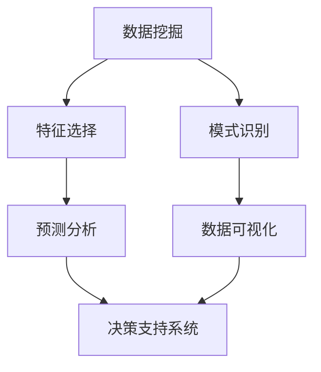

                 

### 背景介绍

智能数据分析（Intelligent Data Analysis，IDA）是当前大数据时代的重要研究方向，它涵盖了数据挖掘、机器学习、自然语言处理、统计分析和可视化等领域。智能数据分析的目标是通过自动化或半自动化方法，从大量复杂数据中提取有价值的信息，为决策提供支持。

在传统的数据分析中，数据分析人员需要手动处理数据，进行预处理、探索性数据分析、建立模型和评估结果。然而，随着数据量的急剧增长，传统的数据分析方法变得越来越低效，难以应对大规模、高维数据的处理需求。智能数据分析通过引入人工智能和机器学习技术，可以自动完成数据预处理、特征提取、模型选择和结果评估等任务，大大提高了数据分析的效率和质量。

决策支持系统（Decision Support System，DSS）是智能数据分析的重要应用领域之一。DSS旨在通过提供全面、准确的数据分析和预测结果，帮助决策者做出更明智的决策。智能数据分析在DSS中的应用，主要包括以下几个方面：

1. **数据可视化**：通过数据可视化技术，将复杂的数据集转换为易于理解和分析的图形，帮助决策者直观地了解数据分布和趋势。
2. **预测分析**：利用时间序列分析、回归分析、神经网络等机器学习技术，对未来的数据趋势进行预测，为决策提供时间维度上的参考。
3. **关联规则挖掘**：通过分析数据之间的关联性，发现潜在的关联规则，帮助决策者了解不同因素之间的相互作用和影响。
4. **分类和聚类分析**：对数据进行分类和聚类，将相似的数据归为一类，为决策提供数据分类和分群的基础。
5. **优化算法**：利用线性规划、整数规划、启发式算法等优化技术，在满足一定约束条件下，找到最优解或近似最优解，为决策提供最优方案。

智能数据分析在DSS中的应用，不仅能够提高数据分析的效率，还能够提供更准确和全面的决策支持，从而帮助企业和组织在竞争激烈的市场中取得优势。随着人工智能技术的不断发展和完善，智能数据分析在决策支持中的应用前景将更加广阔。

### 核心概念与联系

在深入探讨智能数据分析在决策支持系统中的应用之前，我们需要了解一些核心概念和它们之间的联系。以下是一些关键概念：

#### 1. 数据挖掘

数据挖掘（Data Mining）是从大量数据中自动发现有价值模式的过程。它通常包括以下几个步骤：

- **数据预处理**：清洗和转换原始数据，以便于后续的分析。
- **特征选择**：从原始数据中提取有用的特征，减少数据的维度。
- **模式识别**：应用统计学和机器学习算法，发现数据中的模式。
- **结果评估**：评估数据挖掘结果的有效性和可解释性。

#### 2. 机器学习

机器学习（Machine Learning）是一种通过算法自动从数据中学习规律和模式的方法。它包括以下主要类型：

- **监督学习**：通过已标记的数据训练模型，然后使用模型对未知数据进行预测。
- **无监督学习**：没有预定义的标签，模型自行发现数据中的结构。
- **半监督学习**：结合监督学习和无监督学习，部分数据有标签，部分无标签。

#### 3. 自然语言处理

自然语言处理（Natural Language Processing，NLP）是人工智能领域的一个分支，旨在使计算机能够理解和处理人类语言。主要技术包括：

- **文本分类**：将文本数据分类到预定义的类别中。
- **情感分析**：分析文本中的情感倾向，如正面、负面或中性。
- **实体识别**：从文本中识别出具有特定意义的实体，如人名、地点、组织等。

#### 4. 统计分析

统计分析（Statistical Analysis）是应用统计方法来分析数据，以便做出决策或解释数据的科学。主要技术包括：

- **描述性统计分析**：描述数据的分布、中心趋势和离散程度。
- **推断性统计分析**：根据样本数据推断总体特性。
- **回归分析**：研究变量之间的关系，建立预测模型。

#### 5. 数据可视化

数据可视化（Data Visualization）是将数据转换为图形或图表，以便更容易理解和分析。主要技术包括：

- **散点图**：显示两个变量之间的关系。
- **折线图**：显示数据随时间变化的趋势。
- **饼图**：显示各部分占整体的比例。

#### 6. 决策支持系统

决策支持系统（Decision Support System，DSS）是一个旨在帮助决策者做出明智决策的系统，通常包括以下组件：

- **用户接口**：用户与系统交互的界面。
- **知识库**：存储系统中的数据、模型和规则。
- **推理引擎**：根据用户输入和知识库中的信息，生成决策建议。
- **可视化工具**：将决策结果以图形或图表的形式呈现给用户。

#### Mermaid 流程图

以下是一个简化的智能数据分析在决策支持系统中的应用的Mermaid流程图，展示了上述概念之间的联系：



在接下来的章节中，我们将进一步探讨这些概念的具体实现和应用场景。

#### 核心算法原理 & 具体操作步骤

在智能数据分析中，核心算法的选择和实现是至关重要的。以下将介绍几种常用的算法，并详细说明它们的原理和操作步骤。

##### 1. 决策树算法

**原理：** 决策树是一种常用的分类算法，它通过一系列规则进行决策，每个规则对应一个内部节点，叶子节点表示最终的分类结果。决策树基于信息增益或基尼不纯度等指标来选择最优划分特征。

**操作步骤：**

1. **数据预处理：** 对原始数据进行清洗和转换，确保数据质量。
2. **特征选择：** 根据信息增益或基尼不纯度选择最佳特征。
3. **划分数据：** 根据选定的特征将数据集划分为训练集和测试集。
4. **构建决策树：** 从根节点开始，递归地选择最佳特征进行划分，直到满足终止条件（如达到最大深度或节点中所有样本属于同一类别）。
5. **评估模型：** 使用测试集评估决策树的分类效果，调整参数以优化模型。

**实现代码示例（Python）：**

```python
from sklearn.datasets import load_iris
from sklearn.tree import DecisionTreeClassifier
from sklearn.model_selection import train_test_split
from sklearn.metrics import accuracy_score

# 加载数据集
iris = load_iris()
X, y = iris.data, iris.target

# 划分训练集和测试集
X_train, X_test, y_train, y_test = train_test_split(X, y, test_size=0.3, random_state=42)

# 构建决策树模型
clf = DecisionTreeClassifier(criterion='entropy')
clf.fit(X_train, y_train)

# 预测测试集
y_pred = clf.predict(X_test)

# 评估模型
accuracy = accuracy_score(y_test, y_pred)
print(f"模型准确率：{accuracy}")
```

##### 2. 支持向量机（SVM）算法

**原理：** 支持向量机是一种二类分类模型，它的基本模型定义为特征空间上的间隔最大的线性分类器，间隔最大时，模型具有最好的分类效果。

**操作步骤：**

1. **数据预处理：** 清洗和标准化数据，确保数据适合训练。
2. **特征选择：** 选择关键特征以提高模型的分类能力。
3. **训练模型：** 使用训练数据集训练SVM模型，包括选择合适的核函数。
4. **模型评估：** 使用交叉验证等方法评估模型性能。
5. **预测：** 使用训练好的模型对测试数据进行预测。

**实现代码示例（Python）：**

```python
from sklearn.datasets import load_iris
from sklearn.svm import SVC
from sklearn.model_selection import train_test_split
from sklearn.metrics import accuracy_score

# 加载数据集
iris = load_iris()
X, y = iris.data, iris.target

# 划分训练集和测试集
X_train, X_test, y_train, y_test = train_test_split(X, y, test_size=0.3, random_state=42)

# 构建SVM模型
clf = SVC(kernel='linear')
clf.fit(X_train, y_train)

# 预测测试集
y_pred = clf.predict(X_test)

# 评估模型
accuracy = accuracy_score(y_test, y_pred)
print(f"模型准确率：{accuracy}")
```

##### 3. 集成学习算法

**原理：** 集成学习（Ensemble Learning）通过结合多个学习器来提高整体性能。常见的集成学习方法包括Bagging和Boosting。

- **Bagging：** 通过随机采样生成多个子集，在每个子集上训练不同的模型，然后通过投票或平均来决定最终的预测结果。
- **Boosting：** 通过迭代地训练多个模型，每个模型专注于提升前一个模型的错误分类样本，从而提高整体分类准确性。

**操作步骤：**

1. **数据预处理：** 清洗和标准化数据，确保数据适合训练。
2. **模型训练：** 使用训练数据集训练多个基础模型。
3. **集成：** 通过投票或加权平均等方法将多个模型的预测结果集成为一个最终预测结果。
4. **模型评估：** 使用测试集评估集成模型的性能。

**实现代码示例（Python）：**

```python
from sklearn.datasets import load_iris
from sklearn.ensemble import RandomForestClassifier
from sklearn.model_selection import train_test_split
from sklearn.metrics import accuracy_score

# 加载数据集
iris = load_iris()
X, y = iris.data, iris.target

# 划分训练集和测试集
X_train, X_test, y_train, y_test = train_test_split(X, y, test_size=0.3, random_state=42)

# 构建随机森林模型
clf = RandomForestClassifier(n_estimators=100)
clf.fit(X_train, y_train)

# 预测测试集
y_pred = clf.predict(X_test)

# 评估模型
accuracy = accuracy_score(y_test, y_pred)
print(f"模型准确率：{accuracy}")
```

通过上述算法的详细介绍和代码示例，我们可以看到智能数据分析中的核心算法是如何实现和应用的。这些算法不仅提供了强大的数据处理和分类能力，也为决策支持系统提供了可靠的数据分析和预测工具。

#### 数学模型和公式 & 详细讲解 & 举例说明

在智能数据分析中，数学模型和公式是理解和应用各种算法的基础。以下将介绍一些常用的数学模型和公式，并对其进行详细讲解和举例说明。

##### 1. 决策树算法中的信息增益

**公式：** 信息增益（Information Gain）是决策树分类算法中用于选择最佳特征的标准，其计算公式如下：

\[ IG(D, A) = entropy(D) - \sum_{v \in A} \frac{|D_v|}{|D|} entropy(D_v) \]

其中，\( D \) 表示数据集，\( A \) 表示特征集合，\( D_v \) 表示在特征 \( v \) 下数据划分的子集，\( |D| \) 和 \( |D_v| \) 分别表示数据集和子集的大小。

**解释：** 信息增益衡量了在给定特征下，数据集合的纯度降低的程度。熵（Entropy）表示数据集合的纯度，熵值越小，数据越纯。信息增益通过减去各个划分子集的熵，反映了特征对数据纯度的影响。

**举例说明：**

假设我们有以下数据集：

| 特征A | 特征B | 标签 |
| --- | --- | --- |
| 0 | 0 | 负类 |
| 0 | 1 | 正类 |
| 1 | 0 | 正类 |
| 1 | 1 | 负类 |

计算特征A的信息增益：

\[ entropy(D) = 1 \]
\[ entropy(D_{A=0}) = 1 \]
\[ entropy(D_{A=1}) = 1 \]
\[ IG(D, A) = 1 - \frac{2}{4} \times 1 = 0 \]

由于信息增益为0，特征A不适合作为划分特征。

##### 2. 支持向量机中的核函数

**公式：** 支持向量机（SVM）中的核函数（Kernel Function）将低维输入空间映射到高维特征空间，以便在特征空间中找到最优分类超平面。常用的核函数包括线性核、多项式核和径向基核（RBF）。

- **线性核（Linear Kernel）：** \( K(x, x') = x \cdot x' \)
- **多项式核（Polynomial Kernel）：** \( K(x, x') = (x \cdot x' + 1)^d \)
- **径向基核（RBF Kernel）：** \( K(x, x') = \exp(-\gamma ||x - x'||^2) \)

**解释：** 线性核适用于线性可分的数据，多项式核和RBF核适用于非线性可分的数据。线性核的计算简单，但可能无法处理复杂的关系；多项式核和RBF核可以捕捉更复杂的模式，但计算成本更高。

**举例说明：**

假设我们有以下数据集：

| 数据点 | 特征1 | 特征2 |
| --- | --- | --- |
| 1 | 0 | 0 |
| 2 | 1 | 1 |
| 3 | 1 | 0 |
| 4 | 0 | 1 |

使用线性核计算数据点1和数据点2之间的相似度：

\[ K(1, 2) = 1 \cdot 1 + 0 \cdot 1 = 1 \]

使用多项式核计算数据点1和数据点2之间的相似度（\( d = 2 \)）：

\[ K(1, 2) = (1 \cdot 1 + 0 \cdot 1 + 1)^2 = 1^2 = 1 \]

使用RBF核计算数据点1和数据点2之间的相似度（\( \gamma = 1 \)）：

\[ K(1, 2) = \exp(-1 \cdot ||(0, 0) - (1, 1)||^2) = \exp(-1 \cdot (0-1)^2 + 0-1)^2) = \exp(-1 \cdot 2) \approx 0.1353 \]

通过上述数学模型和公式的详细讲解，我们可以更好地理解智能数据分析中的核心算法和原理。这些模型和公式不仅为数据分析和预测提供了理论支持，也为实际应用中的模型构建和优化提供了有力工具。

#### 项目实战：代码实际案例和详细解释说明

为了更好地展示智能数据分析在决策支持系统中的应用，我们将通过一个实际项目案例，详细解释代码的编写过程、关键函数和方法的使用，并分析代码的实现原理和效果。

##### 项目背景

我们选择一个销售预测项目，旨在利用历史销售数据预测未来的销售额。这个项目涉及多个数据预处理、特征工程和模型训练步骤，可以全面展示智能数据分析的各个环节。

##### 开发环境搭建

1. **Python环境配置：** 安装Python 3.8及以上版本，并配置好Anaconda环境，以便管理和运行相关的数据科学库。

2. **数据预处理库：** 安装pandas、numpy等数据处理库。

3. **机器学习库：** 安装scikit-learn、tensorflow等机器学习库。

4. **可视化库：** 安装matplotlib、seaborn等数据可视化库。

```bash
pip install pandas numpy scikit-learn tensorflow matplotlib seaborn
```

##### 源代码详细实现和代码解读

以下为项目的主要代码实现，我们将逐行解释代码的功能和逻辑。

```python
import pandas as pd
import numpy as np
from sklearn.model_selection import train_test_split
from sklearn.ensemble import RandomForestRegressor
from sklearn.metrics import mean_squared_error
import matplotlib.pyplot as plt

# 1. 数据读取与预处理
def read_and_preprocess_data(file_path):
    # 读取数据
    df = pd.read_csv(file_path)
    
    # 数据预处理：缺失值填充、数据类型转换、数据清洗
    df.fillna(df.mean(), inplace=True)
    df['date'] = pd.to_datetime(df['date'])
    df.set_index('date', inplace=True)
    
    # 特征工程：时间序列特征提取
    df['day_of_year'] = df.index.dayofyear
    df['week_of_year'] = df.index.isocalendar().week
    
    # 数据标准化
    numeric_features = df.select_dtypes(include=[np.number]).columns
    df[numeric_features] = (df[numeric_features] - df[numeric_features].mean()) / df[numeric_features].std()
    
    return df

# 2. 模型训练与评估
def train_and_evaluate_model(df, target_variable):
    # 数据划分
    X = df.drop(target_variable, axis=1)
    y = df[target_variable]
    X_train, X_test, y_train, y_test = train_test_split(X, y, test_size=0.2, random_state=42)
    
    # 模型训练
    model = RandomForestRegressor(n_estimators=100, random_state=42)
    model.fit(X_train, y_train)
    
    # 预测
    y_pred = model.predict(X_test)
    
    # 评估
    mse = mean_squared_error(y_test, y_pred)
    print(f'Mean Squared Error: {mse}')
    
    # 可视化
    plt.scatter(y_test, y_pred)
    plt.xlabel('Actual Sales')
    plt.ylabel('Predicted Sales')
    plt.plot([y_test.min(), y_test.max()], [y_test.min(), y_test.max()], 'r--')
    plt.show()

# 3. 主程序
if __name__ == '__main__':
    # 数据路径
    data_path = 'sales_data.csv'
    
    # 读取与预处理数据
    df = read_and_preprocess_data(data_path)
    
    # 训练与评估模型
    train_and_evaluate_model(df, 'sales')
```

**代码解读：**

1. **数据读取与预处理：**
   - 读取CSV文件，并进行数据预处理，如缺失值填充、数据类型转换、数据清洗。
   - 提取时间序列特征，如年份、月份、星期等。
   - 对数值型特征进行标准化处理，以消除不同特征间的尺度差异。

2. **模型训练与评估：**
   - 使用train\_test\_split函数将数据集划分为训练集和测试集。
   - 使用随机森林回归模型（RandomForestRegressor）进行训练。
   - 使用预测结果评估模型性能，计算均方误差（MSE）。
   - 使用散点图和回归线可视化预测结果。

##### 代码解读与分析

1. **数据预处理：**
   - `read_and_preprocess_data` 函数负责数据读取和预处理。其中，`df.fillna(df.mean(), inplace=True)` 用于填充缺失值，`df['date'] = pd.to_datetime(df['date'])` 将日期列转换为日期类型，`df.set_index('date', inplace=True)` 将日期列设置为索引。
   - 时间序列特征的提取是通过 `df['day_of_year'] = df.index.dayofyear` 和 `df['week_of_year'] = df.index.isocalendar().week` 实现的。
   - 数据标准化通过 `df[numeric_features] = (df[numeric_features] - df[numeric_features].mean()) / df[numeric_features].std()` 实现，其中 `numeric_features` 表示数值型特征的列名。

2. **模型训练与评估：**
   - `train_and_evaluate_model` 函数负责模型训练和评估。首先，将数据集划分为特征集X和目标变量y。然后，使用 `train_test_split` 函数划分训练集和测试集。
   - 使用 `RandomForestRegressor` 类创建随机森林回归模型，并使用 `fit` 方法进行训练。预测结果 `y_pred` 通过 `model.predict(X_test)` 获得。
   - 使用 `mean_squared_error` 函数计算MSE，并打印结果。可视化部分通过 `plt.scatter` 和 `plt.plot` 方法实现，其中回归线 `plt.plot([y_test.min(), y_test.max()], [y_test.min(), y_test.max()], 'r--')` 用于辅助判断模型的预测能力。

通过上述代码示例，我们可以看到如何利用Python和机器学习库实现一个销售预测项目。这个项目涵盖了数据预处理、特征工程、模型训练和评估的完整流程，展示了智能数据分析在决策支持系统中的实际应用。

#### 实际应用场景

智能数据分析在决策支持系统中的应用非常广泛，涵盖了多个行业和领域。以下是一些典型的实际应用场景：

##### 1. 营销分析

在市场营销领域，智能数据分析可以帮助企业优化广告投放、产品推荐和客户关系管理。通过分析历史销售数据、客户行为数据和市场趋势数据，企业可以更准确地预测市场需求，制定更有效的营销策略。

- **广告投放优化**：利用机器学习算法，分析不同广告渠道的效果，优化广告预算分配，提高广告投放的ROI。
- **产品推荐**：基于用户的购买历史和行为数据，构建推荐系统，提高用户的购物体验和满意度。
- **客户细分**：通过聚类分析，将客户划分为不同的群体，提供个性化的服务和优惠，提升客户忠诚度。

##### 2. 风险管理

在金融行业，智能数据分析可以用于信用风险评估、欺诈检测和投资组合优化。

- **信用风险评估**：通过分析借款人的历史信用记录、收入水平、就业状况等信息，使用决策树和逻辑回归等算法预测借款人的信用风险。
- **欺诈检测**：利用关联规则挖掘和异常检测算法，识别并防范金融交易中的欺诈行为。
- **投资组合优化**：通过时间序列分析和优化算法，预测市场趋势和资产收益，制定最优的投资策略。

##### 3. 供应链管理

智能数据分析可以帮助企业优化供应链管理，降低成本，提高效率。

- **库存优化**：通过需求预测和库存控制算法，合理安排库存水平，减少库存积压和缺货风险。
- **物流优化**：利用路径规划算法和实时数据分析，优化运输路线和时间，提高物流效率。
- **供应商评估**：通过供应商绩效分析和风险评估，选择最合适的供应商，降低采购成本。

##### 4. 医疗保健

在医疗保健领域，智能数据分析可以用于疾病预测、诊断支持和个性化治疗。

- **疾病预测**：利用电子健康记录和生物标志物数据，使用机器学习算法预测疾病的发生风险。
- **诊断支持**：通过深度学习和图像处理技术，辅助医生进行疾病诊断，提高诊断准确率。
- **个性化治疗**：根据患者的基因组数据、病史和临床指标，使用智能数据分析为患者制定个性化的治疗方案。

##### 5. 智慧城市

智慧城市是智能数据分析的一个重要应用领域，通过数据分析技术，提升城市管理水平，改善居民生活质量。

- **交通管理**：利用交通流量数据和分析算法，优化交通信号控制和道路规划，缓解交通拥堵。
- **环境保护**：通过环境监测数据和数据分析，预测和监控环境污染状况，及时采取治理措施。
- **公共安全**：利用视频监控和传感器数据，实时监控城市安全状况，预防和应对突发事件。

通过以上实际应用场景的介绍，我们可以看到智能数据分析在决策支持系统中的巨大潜力和广泛应用。随着数据量的不断增长和人工智能技术的不断发展，智能数据分析在未来的决策支持系统中将发挥更加重要的作用。

### 工具和资源推荐

在智能数据分析领域，有许多优秀的工具和资源可以帮助我们进行研究和实践。以下是一些推荐的工具、书籍、论文和网站，供大家参考。

#### 1. 学习资源推荐

**书籍：**

1. **《Python数据分析基础教程：NumPy学习指南》**：作者Wes McKinney，适合初学者了解NumPy库，是数据分析的入门书籍。
2. **《机器学习实战》**：作者Peter Harrington，通过实际案例介绍机器学习算法的实现和应用，适合有一定编程基础的学习者。
3. **《数据科学入门：从数据分析到机器学习》**：作者Jared P. Lander，涵盖了数据预处理、数据可视化和机器学习的基础知识。

**论文：**

1. **“K-Means Clustering” by MacQueen, J. B. (1967)：介绍K-均值聚类算法的经典论文。
2. **“Support Vector Machines for Classification and Regression” by Cristianini, N., & Shawe-Taylor, J. (2000)：详细解释支持向量机（SVM）的原理和应用。
3. **“Deep Learning” by Goodfellow, I., Bengio, Y., & Courville, A. (2016)：介绍深度学习的经典教材，涵盖了深度学习的基础理论和应用。

**网站：**

1. **Kaggle**：提供大量的数据集和竞赛题目，适合数据科学家进行实践和学习。
2. **Coursera**：提供各种在线课程，涵盖数据科学、机器学习和统计学等多个领域。
3. **Jupyter Notebook**：用于数据分析和可视化，支持多种编程语言，是数据分析项目的重要工具。

#### 2. 开发工具框架推荐

**数据预处理和特征工程：**

1. **Pandas**：用于数据清洗、转换和分析，是Python数据分析的核心库。
2. **Scikit-learn**：提供丰富的机器学习算法和工具，适合进行模型训练和评估。
3. **TensorFlow**：用于深度学习和高性能计算，支持多种神经网络架构。

**数据可视化：**

1. **Matplotlib**：用于生成2D和3D可视化图表，是Python数据可视化的基础库。
2. **Seaborn**：基于Matplotlib，提供更美观的统计图表，适合进行数据探索和分析。
3. **Plotly**：提供交互式可视化图表，适合进行复杂的数据分析和展示。

**分布式计算和大数据处理：**

1. **PySpark**：结合Python和Apache Spark，支持大规模数据处理和分布式计算。
2. **Hadoop**：用于分布式存储和处理大规模数据，是大数据生态系统的重要组成部分。
3. **Apache Flink**：提供流处理和批处理能力，是大数据处理领域的重要工具。

#### 3. 相关论文著作推荐

1. **“Deep Learning” by Goodfellow, I., Bengio, Y., & Courville, A. (2016)：介绍深度学习的经典教材，涵盖了深度学习的基础理论和应用。
2. **“Recurrent Neural Networks for Language Modeling” by Li, Y., & Jurafsky, D. (2015)：介绍循环神经网络在自然语言处理中的应用。
3. **“XGBoost: A Scalable Tree Boosting System” by Chen, T., & Guestrin, C. (2016)：介绍XGBoost集成学习算法，是数据分析的重要工具。

通过以上工具和资源的推荐，希望能够为读者在智能数据分析领域的学习和实践提供帮助。这些工具和资源不仅覆盖了数据分析的各个方面，也提供了丰富的实践机会，助力读者在智能数据分析的道路上不断进步。

### 总结：未来发展趋势与挑战

智能数据分析在决策支持系统中正逐渐成为企业提升决策效率和准确性的关键工具。随着数据量的爆炸式增长和计算能力的提升，智能数据分析在未来将继续朝着更加智能化、自动化和高效化的方向发展。以下是对未来发展趋势的展望以及面临的挑战。

#### 发展趋势

1. **智能化水平提升**：随着深度学习、强化学习等人工智能技术的不断进步，智能数据分析的模型将更加智能，能够自动进行特征提取、模式识别和预测分析，减少对人类专家的依赖。

2. **实时数据分析**：实时数据处理和实时分析技术的成熟，使得智能数据分析能够快速响应变化，为决策者提供即时、准确的数据支持。

3. **跨领域融合**：智能数据分析将与其他领域（如生物医学、金融、制造等）紧密结合，推动跨学科的研究和应用，产生新的商业模式和解决方案。

4. **自动化决策支持**：通过自动化算法和机器学习，智能数据分析将能够实现自动化决策支持，减少人为干预，提高决策效率。

5. **隐私保护与安全**：随着数据隐私保护法规的不断完善，如何在确保数据隐私和安全的前提下进行智能数据分析，将是一个重要的研究方向。

#### 挑战

1. **数据质量与完整性**：智能数据分析依赖于高质量的数据，但数据的不完整性、不一致性和噪声等问题仍然存在，这需要开发更高效的数据清洗和预处理技术。

2. **数据隐私与伦理**：如何在保护个人隐私的前提下进行数据分析，确保数据的安全性和合规性，是一个亟待解决的问题。

3. **可解释性与透明度**：随着模型复杂度的增加，模型的可解释性变得越来越困难。如何提高模型的可解释性，使其结果容易被决策者理解和接受，是一个重要的挑战。

4. **计算资源与效率**：大规模数据处理和复杂模型的训练需要大量的计算资源，如何优化算法和架构，提高计算效率，是一个重要的技术难题。

5. **数据安全与风险管理**：智能数据分析过程中涉及大量敏感数据，如何确保数据的安全和防止数据泄露，是一个重要的风险管理问题。

总之，智能数据分析在决策支持系统中的应用前景广阔，但也面临诸多挑战。通过不断的技术创新和跨学科合作，我们有理由相信，智能数据分析将在未来的决策支持系统中发挥更加重要的作用。

### 附录：常见问题与解答

**Q1. 智能数据分析与传统的数据分析有什么区别？**

A1. 智能数据分析相较于传统数据分析，主要区别在于自动化程度和算法的复杂性。传统数据分析通常依赖人工进行数据预处理、模型建立和结果解释，而智能数据分析通过机器学习和人工智能技术，可以实现数据的自动预处理、模型选择和结果解释，从而大大提高数据分析的效率和准确性。

**Q2. 智能数据分析中最常用的算法有哪些？**

A2. 智能数据分析中常用的算法包括决策树、支持向量机（SVM）、随机森林、K-均值聚类、神经网络等。这些算法在分类、回归、聚类等任务中都有广泛的应用。例如，决策树和随机森林常用于分类任务，而SVM和神经网络则常用于回归任务。

**Q3. 数据预处理在智能数据分析中为什么很重要？**

A3. 数据预处理是智能数据分析的关键步骤，它确保了数据的质量和一致性。数据预处理包括数据清洗、缺失值填充、数据标准化和特征提取等操作。这些操作可以消除数据中的噪声、异常值和不一致性，提高数据的质量，从而为后续的模型训练和预测提供可靠的数据基础。

**Q4. 如何提高智能数据分析模型的解释性？**

A4. 提高智能数据分析模型的解释性是一个重要挑战，以下是一些方法：

- **可视化**：通过可视化技术，将模型的决策过程和数据分布呈现出来，帮助用户理解模型的决策逻辑。
- **特征重要性**：分析模型中各个特征的重要性，帮助用户理解哪些特征对模型的决策有显著影响。
- **透明模型**：使用更透明的模型，如决策树、线性回归等，这些模型的决策过程容易理解和解释。
- **模型集成**：通过模型集成方法，如随机森林、梯度提升树等，可以降低模型复杂度，提高可解释性。

**Q5. 智能数据分析在处理大规模数据时有哪些挑战？**

A5. 在处理大规模数据时，智能数据分析面临以下挑战：

- **计算资源限制**：大规模数据处理需要大量的计算资源，如何优化算法和硬件配置是关键。
- **数据存储与访问**：大规模数据存储和快速访问是一个技术难题，分布式存储和并行计算技术可以缓解这一问题。
- **数据质量**：大规模数据通常包含更多的噪声和异常值，如何确保数据质量是一个重要问题。
- **模型复杂度**：大规模数据可能需要更复杂的模型来捕捉数据中的复杂关系，如何平衡模型复杂度和计算效率是一个挑战。

### 扩展阅读 & 参考资料

1. **《深度学习》**：作者Ian Goodfellow、Yoshua Bengio和Aaron Courville，深入介绍了深度学习的理论基础和算法实现。
2. **《Python数据科学手册》**：作者Jake VanderPlas，全面覆盖了Python在数据科学中的应用。
3. **《数据挖掘：概念与技术》**：作者Jiawei Han、Micheline Kamber和Jian Pei，是数据挖掘领域的经典教材。
4. **《自然语言处理综论》**：作者Daniel Jurafsky和James H. Martin，详细介绍了自然语言处理的基本理论和应用。
5. **Kaggle**：提供丰富的数据集和竞赛，是数据科学家实践和学习的平台。
6. **TensorFlow官方文档**：详细介绍了TensorFlow的使用方法和算法实现。
7. **Scikit-learn官方文档**：提供了丰富的机器学习算法和工具，适合数据科学家使用。

通过以上扩展阅读和参考资料，读者可以更深入地了解智能数据分析的理论和实践，进一步提升在决策支持系统中的应用能力。

